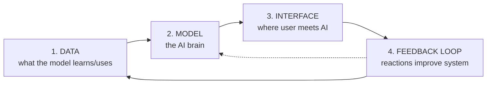
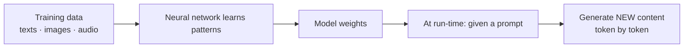
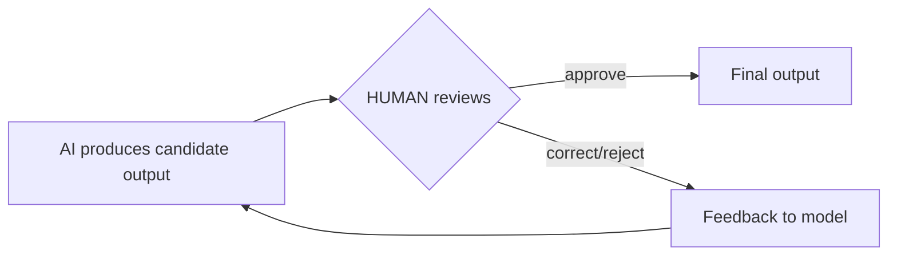

# UNIT 1 — Fundamentals of AI Products & Emerging AI Systems 🤖

> **AI Product Design (DI05016021)** · **8 hrs · 18% weightage**
> **Covers syllabus sections:** 1.1 AI products · 1.2 AI tool vs AI product · 1.3 System components (Data/Model/Interface/Feedback) · 1.4 Generative AI · 1.5 LLMs · 1.6 Model types · 1.7 GenAI vs Analytical AI · 1.8 Model selection · 1.9 Multi-agent AI · 1.10 Human-in-the-loop · 1.11 Basic architecture
> **Related practicals:** [P01](../practicals/writeups/P01_product_idea_problem_statement.md), [P02](../practicals/writeups/P02_ai_system_architecture.md), [P03](../practicals/writeups/P03_data_components.md)

---

## 🧭 Chapter Roadmap

```
UNIT 1 — Fundamentals of AI Products
├── 1.1 What is an AI product?              ★★★
├── 1.2 AI tool  vs  AI product             ★★★★   ← classic 4-mark short note
├── 1.3 The 4 system components             ★★★★★  ← P02 architecture
│     ├── Data · Model · Interface
│     └── Feedback loop
├── 1.4 Overview of Generative AI           ★★★★
├── 1.5 Large Language Models (LLMs)        ★★★★
├── 1.6 Types of AI models                  ★★★    ← Text/Image/Speech/Embeddings
├── 1.7 GenAI vs Analytical AI              ★★★★   ← favourite comparison table
├── 1.8 AI model selection                  ★★★
├── 1.9 Multi-agent AI                      ★★★
├── 1.10 Human-in-the-loop                  ★★★★
└── 1.11 Basic AI system architecture       ★★★★★  ← guaranteed diagram question
```

### Learning outcomes — after this unit you can:
1. Define an **AI product** and separate it cleanly from an **AI tool**.
2. Name and explain the **4 components** of any AI system (Data, Model, Interface, Feedback loop).
3. Describe **generative AI** and **LLMs** in plain words with real examples.
4. Classify AI models by **input/output type** (text, image, speech, embeddings).
5. Compare **generative vs analytical** AI and justify a model choice for a product.
6. Explain **multi-agent** and **human-in-the-loop** systems with an application.
7. Draw a **basic AI system architecture** diagram (this is a guaranteed exam diagram).

---

## 1.1 Introduction to AI Products

An **AI product** is a software product that uses **artificial intelligence** (machine learning, deep learning, LLMs) to deliver its core value. The AI is not an add-on — it *is* the reason the product exists.

**Examples you should be able to rattle off:**
- **Recommendation** — Netflix, YouTube, Amazon (suggest what you'll like).
- **Language** — ChatGPT, Google Translate, Grammarly, StudyMate's summariser.
- **Vision** — Google Lens, Face ID unlock, automatic photo tagging.
- **Speech** — Alexa, Siri, voice-to-text keyboards.
- **Generative media** — Midjourney (images), Suno (music), Synthesia (talking avatars).

> 💡 **Key idea for exams:** the *input is messy* (unstructured text, images, speech) and the *output is probabilistic* (the system can be wrong). Traditional apps always do exactly what you code; AI apps *predict* what to do. That single difference drives every other topic in this unit (feedback loops, hallucinations, human-in-the-loop).

## 1.2 AI Tool vs AI Product ⭐⭐

The most asked short-note in Unit 1. Memorise this table.

| Criterion | **AI Tool** | **AI Product** |
|---|---|---|
| **Scope** | One narrow task (e.g., summarise this text) | An end-to-end solution for a user's whole job |
| **User focus** | Generic — anyone, any context | Designed for a **specific persona** with a specific need |
| **Context/data** | Stateless — no memory of you | **Persistent** — remembers user, history, preferences |
| **Feedback loop** | None — output is final | Closes the loop — user reaction improves future output |
| **Business model** | Often free / pay-per-use | Monetised (subscription, freemium — Unit 3) |
| **Support/servicing** | Minimal | Onboarding, privacy, reliability, updates |
| **Example** | ChatGPT answering one prompt | StudyMate — a study assistant with accounts, uploads, progress tracking and pricing |

**The one-line exam answer:** *A tool does one AI task for anyone; a product wraps AI into a complete, user-centred, monetisable solution with data and a feedback loop.*

> ⚠️ **Exam trap:** ChatGPT itself is a product (it has accounts, memory, pricing). A single prompt you paste into it is "using a tool". Don't say "ChatGPT is a tool" without qualification.

## 1.3 Components of AI Systems ⭐⭐⭐

Every AI system — simple or giant — has these **4 blocks** (this is the backbone of P02):



| Block | What it is | Example (StudyMate) |
|---|---|---|
| **Data** | Training data (how the model learned) + inference data (what it processes at run-time) | Public web corpus (training); the student's uploaded PDFs, chat and quiz history (inference) |
| **Model** | The algorithm/neural network that maps input → output | An LLM that reads a chapter and produces a summary/quiz |
| **Interface** | The screens/APIs where human and machine interact | Upload page, chat box, results screen |
| **Feedback loop** | The mechanism that captures user reactions and feeds them back | Quiz scores → "weak topics" tags → future quizzes target them |

> 💡 **Exam phrasing:** "Data feeds the Model, the Model powers the Interface, and the Feedback Loop returns the Interface's outcomes back to Data/Model — making the system learn from use." That sentence is worth full marks for the conceptual-architecture question.

## 1.4 Overview of Generative AI

**Generative AI (GenAI)** creates **new content** — text, images, audio, code, video — that did not exist before, by learning the *patterns* of training data and sampling from them.

- **How it works (conceptual):** a neural network is trained on massive amounts of content; it learns the statistical structure ("after 'The capital of India is' usually comes 'New Delhi'"); at generation time it predicts the next token again and again.
- **Key models:** GPT / Gemini / Claude (text), DALL·E / Midjourney / Stable Diffusion (images), Suno (music), Veo / Runway (video).
- **Applications:** chatbots, content creation (Unit 4), code generation, design, study tools (our StudyMate summariser/quiz generator).



> 💡 **Beyond the textbook:** generation is *sampling, not retrieval*. The model doesn't "look up" an answer — it rolls a weighted die over likely next tokens. That's why outputs are fresh, but also why **hallucination** (confidently wrong answers) happens (Unit 6).

## 1.5 Introduction to Large Language Models (LLMs) ⭐

An **LLM** is a generative AI model trained on **enormous amounts of text** to predict the next word/token. "Large" = billions of parameters.

**Key facts to memorise:**
- **Architecture:** Transformer-based (introduced in the 2017 paper *"Attention Is All You Need"*). Attention lets the model weigh which earlier words matter most.
- **Token:** the unit of text the model reads/writes (~3–4 characters of English, or ~¾ of a word). *Billing is per token* (Unit 3).
- **Training:** pre-training on general text → fine-tuning for a specific task/domain.
- **Inference:** the run-time use of the trained model (what a product pays for).
- **Capabilities:** chat, summarisation, translation, coding, question-answering, reasoning (CoT).
- **Limitations:** hallucination, outdated knowledge (cut-off), no real "understanding", cost/latency, bias in training data.

**Products:** ChatGPT, Gemini, Claude, and our running example **StudyMate**, which grounds an LLM in a student's *own* documents (RAG — see P02/P08).

> ⚠️ **Exam trap:** "LLM understands language" is wrong — it predicts tokens. It *mimics* understanding. Say "the model has no memory between sessions" and "it can't verify facts" — those are the two standard limitations asked.

## 1.6 Types of AI Models (conceptual overview only) ⭐

| Type | Input → Output | Example models | Product uses |
|---|---|---|---|
| **Text** | Text → text (classify, summarise, translate, chat) | GPT, Gemini, Claude, BERT | Chatbots, StudyMate summariser |
| **Image** | Image → label/box/description (vision), or text → image (generation) | ResNet (classify), YOLO (detect), DALL·E / Stable Diffusion (generate) | Google Lens, face unlock, Canva AI art |
| **Speech** | Audio → text (ASR), text → audio (TTS), speech → label | Whisper (transcribe), ElevenLabs (voice) | Voice assistants, captions, audiobooks |
| **Embeddings** | Anything → a list of numbers (a "vector") capturing meaning | text-embedding-3-small, CLIP | Search, recommendations, RAG retrieval (P08) |

> **Embeddings made simple:** an embedding turns *meaning* into *math*. Similar sentences get similar numbers, so you can search "documents about Kirchhoff's law" even if the exact words differ. This is the engine behind StudyMate's "find the right page of your notes" step.

## 1.7 Generative AI vs Analytical AI ⭐⭐

| Criterion | **Generative AI** | **Analytical (predictive) AI** |
|---|---|---|
| **Goal** | Create **new** content | Analyse data to **predict/classify** |
| **Output** | Text, images, audio, video (open-ended) | A label, score, or number (closed) |
| **Typical task** | "Write an essay", "make a poster" | "Will this customer churn?", "is this email spam?" |
| **Underlying model** | LLMs, diffusion models | Regression, decision trees, classifiers |
| **Right/wrong** | Subjective (quality of content) | Objective (accuracy of prediction) |
| **Product example** | StudyMate quiz generator, Canva AI | YouTube recommendation score, credit-risk score |
| **Risk** | Hallucination, misuse (deepfakes) | Bias in predictions, unfair decisions |

> **Exam one-liner:** *Generative AI invents the answer; analytical AI decides between answers.* Many products use both (a recommendation system is analytical; the personalised email it writes about the recommendation is generative).

## 1.8 AI Model Selection for Product Use

A product designer chooses a model by **trade-offs**, not hype. The exam asks you to *justify* a choice, so learn the 5 axes:

| Axis | Question to ask | StudyMate example |
|---|---|---|
| **1. Task type** | Does the feature generate (GenAI) or predict (analytical)? | Generation → LLM |
| **2. Quality vs cost** | How wrong can the output afford to be? | Quizzes must be syllabus-accurate → quality matters |
| **3. Latency** | How fast must the answer come? | Chat < 3 s → a small fast model |
| **4. Privacy & hosting** | Can data leave your servers? Where must it live? | Student notes → vendor must not train on them (P08) |
| **5. Cost per use** | What does one request cost? (tokens!) | Free tier needs a cheap model → gpt-4o-mini class (P08) |

**The decision is never "best model" — it's "best model for *this* user, *this* latency, *this* budget".**

> 💡 **Beyond the textbook:** also consider *model drift* — providers update models and your quality/cost changes overnight (a risk we treat properly in P12). Pinning a version is part of a production plan.

## 1.9 Introduction to Multi-Agent AI (basic idea)

A **multi-agent system** is a setup where several specialised AI "agents" **collaborate** to finish a task, each doing what it's good at.

```
USER question
   │
   ▼
┌────────────┐  ┌─────────────┐  ┌──────────────┐  ┌────────────┐
│ Planner    │→ │ Retriever   │→ │ Writer       │→ │ Reviewer   │
│ splits task│  │ finds notes │  │ drafts answer│  │ checks it  │
└────────────┘  └─────────────┘  └──────────────┘  └────────────┘
```

**Simple real example — a "study assistant team":**
- Agent 1 (Retriever): finds the right chapter in your notes.
- Agent 2 (Quiz-master): generates questions from it.
- Agent 3 (Tutor): explains any wrong answer step-by-step.
- Agent 4 (Scheduler): builds the revision plan.

**Why it matters:** one giant prompt doing everything is messy and error-prone; specialised agents with clear roles are easier to control, evaluate, and fix. **Trade-off:** more moving parts, higher cost and latency — so multi-agent is an *architecture choice*, not a default.

## 1.10 Human-in-the-Loop Systems ⭐

**Human-in-the-loop (HITL)** = a person is **inside** the AI loop — reviewing, approving, or correcting AI output before it's final.



| Where | Who | Why |
|---|---|---|
| **Content moderation** | Reviewer approves/rejects AI posts | Safety, policy |
| **StudyMate quiz answers** | Teacher/student flags a wrong question | Accuracy before it misleads |
| **Medical/AI diagnosis** | Doctor confirms | Accountability, safety |
| **Bank loan scoring** | Analyst reviews before decision | Fairness, appeal rights |

**Why the syllabus loves this topic:** (1) it reduces harm from AI errors; (2) it produces **training data** (corrections become better prompts/models); (3) it satisfies **accountability** (Unit 5) — "a human is responsible". **Cost:** slower and expensive, so designers keep *only critical steps* in the loop.

## 1.11 Basic AI System Architecture (conceptual diagram) ⭐⭐⭐

This is the "draw the diagram" favourite (P02 builds it in full). A minimal answer-sheet version:

```text
                 USER
                  │
                  ▼
          ┌───────────────┐
          │  INTERFACE    │  ← app screens / chat box
          └───────────────┘
                  │
                  ▼
          ┌───────────────┐
          │   MODEL       │  ← AI brain (LLM/classifier)
          └───────────────┘
             ▲            │
             │            ▼
     ┌───────┴──────┐  ┌──────────────┐
     │    DATA      │  │ FEEDBACK LOOP│  ← scores/ratings
     └──────────────┘  └──────────────┘
```

**The 4-sentence explanation (memorise):**
1. The **user** interacts through the **interface**.
2. The **model** receives the input and produces output (grounded in **data**).
3. **Data** — training and run-time data — feeds the model.
4. The **feedback loop** captures user reactions and returns them to Data/Model so the system improves over time.

---

## 🧠 Deep-Dive Topics

### Deep Dive A: Why "probabilistic output" changes product design
Classical apps: output is deterministic — same input → same result. AI: same input → *similar but different* output, sometimes **wrong**. Consequences a designer must handle: show confidence, allow retries/regeneration, cite sources, and keep a human in the loop for high-stakes output. Every one of these appears in Unit 2 (UX for AI) and Unit 6 (risks). One sentence connects the whole subject.

### Deep Dive B: Tokens, embeddings and RAG in one story (Unit 1 ↔ P08)
Your 40-page PDF can't fit in one prompt. So StudyMate: (1) **chunks** the text, (2) **embeds** each chunk into a vector, (3) at question time **retrieves** the most similar chunks, (4) asks the LLM to answer *using only those chunks*, with a citation. That's **RAG** — it reduces tokens (cheaper), reduces hallucination, and gives the "answer from YOUR notes" promise. It's the same pipeline drawn in P02's architecture.

### Deep Dive C: Generative vs Analytical on the same product
A credit-card issuer uses **analytical AI** to score whether you'll default (objective prediction) and **generative AI** to write your personalised offer letter (subjective creation). Knowing *which AI fits which stage* is the "model selection" skill of §1.8.

---

## 🚀 Beyond the Textbook (what most classes won't tell you)

1. **LLMs don't have a database of facts.** They have *weights* that compress patterns. That's why they can't reliably answer "what happened yesterday" and why products bolt on retrieval (RAG).
2. **"Attention is all you need" is the real birthday of modern AI.** 2017 transformer paper → GPT → everything. If a viva asks "why 2017?", that's the answer.
3. **Every generative AI call costs money and emits carbon.** "Free" chatbots are subsidised; product designers must cost-model tokens (P08) and pick small models.
4. **Embeddings make AI search possible.** Without them, "find similar notes" would be literal word-matching; with them, it's semantic.
5. **The feedback loop is also a risk surface.** If you feed the loop bad signals (spam, trolls), the system learns to be bad. Feedback must be cleaned before it becomes data (see Unit 6).
6. **Exam-hack memory aid for the 4 components:** "**D**ata → **M**odel → **I**nterface → **F**eedback" = **DMIF** → remember "**D**o **M**y **I**ndian **F**riends… revise daily."

---

## 🎯 High-Yield Exam Topics (no PYQ papers exist for this new subject — these are the likely GTU-style questions)

**Likely questions (short notes / 4 marks):**
1. Define an AI product with two examples.
2. Differentiate between an **AI tool and an AI product**.
3. Explain the four components of an AI system.
4. What is Generative AI? Give examples.
5. What is an LLM? State two capabilities and two limitations.
6. Differentiate between **Generative AI and Analytical AI**.
7. What are embeddings? Where are they used?
8. Explain **Human-in-the-loop** with an example.
9. What is a multi-agent system? Give an application.
10. List the types of AI models (text/image/speech/embeddings) with one use each.

**Likely long questions (7 marks):**
11. Draw and explain a **basic AI system architecture** (Data, Model, Interface, Feedback loop) for any AI product.
12. Explain the **factors considered in AI model selection** for a product.
13. Explain tokens and how they relate to the cost of LLM-based products.

**Solved model answers (exam style):**

**Q. 7 marks — Differentiate between Generative AI and Analytical AI with examples.**
> **Generative AI** creates new content (text, images, audio, video) by learning patterns from training data and sampling from them. Output is open-ended and subjective. Examples: ChatGPT writing an essay, DALL·E generating an image, StudyMate generating a quiz. **Analytical (predictive) AI** analyses existing data to make a prediction or classification; output is a fixed label or score and is judged by accuracy. Examples: YouTube recommending a video, a spam filter classifying email, a credit-risk model scoring a loan applicant. **Key differences:** purpose (create vs predict), output (open content vs closed decision), evaluation (subjective quality vs objective accuracy), and main risk (hallucination/misuse vs unfair bias). A real product often uses both — a recommendation engine (analytical) that writes its suggestion message with an LLM (generative).

**Q. 4 marks — Explain the four components of an AI system.**
> (1) **Data** — the information the system learns from during training and processes at run-time; without data there is no AI. (2) **Model** — the trained algorithm that maps input to output (e.g., an LLM that summarises a chapter). (3) **Interface** — the surface where the user and the model interact (screens, chat box, API). (4) **Feedback loop** — the mechanism that captures user reactions (ratings, scores) and returns them to Data/Model so output improves over time. Example: in StudyMate, the student's PDF is Data, the LLM is the Model, the upload/chat screens are the Interface, and quiz scores that tag "weak topics" form the Feedback loop.

**Q. 4 marks — What is an LLM? Two capabilities, two limitations.**
> A **Large Language Model** is a neural network trained on enormous text corpora to predict the next token. It is "large" in parameters (billions) and uses the Transformer architecture with attention. **Capabilities:** (1) generation — chat, summarisation, translation, code; (2) few-shot reasoning — it can solve unseen problems given examples. **Limitations:** (1) hallucination — it can produce confident but wrong content; (2) no persistent memory or real understanding — it predicts tokens and knows nothing outside its training cut-off. Because of this, products ground LLMs in user data (RAG) and keep humans in the loop for critical output.

---

## ✍️ Practice Problems (self-test — answers hidden)

1. Is "an app that lets you paste text into ChatGPT and copy the answer" a tool or a product? Justify.
2. Draw the four-component diagram for **YouTube** (name each block in YouTube's own terms).
3. For each model type (text/image/speech/embeddings), give one product you use daily.
4. Your AI weather app generates a 50-word forecast. Is that generative or analytical AI? (Tricky — defend your answer.)
5. A bank wants an AI to approve loans. Why must it keep a human in the loop?
6. You must choose an LLM for a student chat feature. Name the 3 axes you'd weigh and how you'd trade them off.

<details>
<summary>📌 Model solutions</summary>

1. **A tool** — it's stateless, generic, single-task. The moment it has accounts, your history, persistence and pricing, it becomes a product.
2. **Data:** videos + your watch history; **Model:** the recommendation algorithm; **Interface:** the home feed / search; **Feedback loop:** watch-time, likes, skips → re-rank recommendations.
3. Text → spell-checker; Image → Face ID; Speech → Google voice typing; Embeddings → Google image search ("find similar images").
4. **Analytical at heart** — generating text from fixed weather *data* is formatting a prediction; the model's judgment (rain/no-rain) is analytical. The wording is generative polish. The exam-safe answer: the *decision* is analytical; the *rendering* is generative.
5. Accountability and fairness: a rejected applicant deserves a human-verifiable, explainable decision and an appeal channel; also the AI's errors need a responsible owner (HITL).
6. Quality vs cost (wrong quiz answers vs token bill), latency (chat must feel instant), and privacy/hosting (notes must not train shared models). Typical trade: accept a small fast model for chat, spend more on retrieval to protect quality.
</details>

---

## 📖 Glossary of Key Terms

| Term | Definition |
|---|---|
| **AI product** | A software product whose core value comes from AI, built for a specific user with data + feedback loop |
| **AI tool** | A single-purpose, stateless AI capability usable by anyone |
| **Data (component)** | Training data + inference (run-time) data an AI system consumes |
| **Model** | The trained algorithm that maps input to output |
| **Interface** | The surface where user and AI interact (UI/API) |
| **Feedback loop** | The cycle that feeds user reactions back into Data/Model |
| **Generative AI** | AI that creates new content (text/image/audio/video) |
| **Analytical AI** | AI that predicts/classifies from data (labels, scores) |
| **LLM** | Large Language Model — a huge Transformer trained to predict the next token |
| **Token** | Unit of text the model reads/writes (~¾ word); basis of API billing |
| **Transformer** | 2017 neural architecture using *attention*; the basis of modern LLMs |
| **Embedding** | A vector of numbers capturing meaning; enables semantic search |
| **RAG** | Retrieval-Augmented Generation — ground an LLM in retrieved documents |
| **Multi-agent system** | Several specialised AI agents collaborating on one task |
| **Human-in-the-loop** | A person reviews/approves/corrects AI output before it's final |
| **Model selection** | Choosing a model by task type, quality, latency, privacy, cost |
| **Hallucination** | Confidently wrong AI output |

---

## 🔗 Curated Resources (per concept)

**AI products & systems**
- *Designing Machine Learning Systems* — Chip Huyen, Ch. 1 (the book is in your GTU syllabus)
- Google People + AI Guidebook: https://pair.withgoogle.com
- "State of AI" reports (annual): search *state of ai report air street capital*

**Generative AI & LLMs**
- OpenAI GPT overview: https://openai.com/research/gpt
- Hugging Face (models & datasets): https://huggingface.co
- "Attention Is All You Need" (2017 paper): https://arxiv.org/abs/1706.03762

**Model types & embeddings**
- Google Teachable Machine (build tiny models visually): https://teachablemachine.withgoogle.com
- "Intro to embeddings" (OpenAI cookbook): https://cookbook.openai.com
- YOLO / computer vision (conceptual): https://www.ultralytics.com

**Human-in-the-loop & agents**
- Human-AI interaction guidelines (Microsoft): https://www.microsoft.com/en-us/research/publication/guidelines-for-human-ai-interaction/
- Multi-agent LLM overviews: search *multi agent llm architecture explained*

## 🎥 Video Study Guide (YouTube)

> Don't like reading? Me neither. This is your **structured video path** for the whole unit — better than the syllabus because it tells you *exactly what to search* and *what to watch first*, in a sensible order. Everything below is search keywords (they never rot like links do) + channels you can trust.

### 🧑‍🎓 Step 0 — Pick your learning style

| Style | You learn best by | Your path through this unit |
|---|---|---|
| 🎧 **Listener** | short, clear explainers | Watch 1 explainer per topic from the table below (3–8 min each) |
| 🛠️ **Builder** | building/demoing things | Do [P01–P03](../README.md) first, then watch the "architecture" explainers |
| 🔧 **Tinkerer** | experimenting & demos | Try Teachable Machine + ChatGPT Playground while watching demo videos |
| 🧠 **Deep Diver** | full theory, "why" | Watch the whole-unit playlists at the bottom, then the arXiv/paper explainers |
| 🧭 **Explorer** | breadth & curiosity | Watch the "how GPT works" classics first, then follow your curiosity |
| 🎓 **Academic** | exam marks | Grind the High-Yield list above → watch revision videos → write the diagrams by hand |

### 🎬 Step 1 — Watch by topic (search these on YouTube)

| Topic | YouTube search keywords (copy-paste ready) | Best channels | Style served |
|---|---|---|---|
| What is an AI product | `what is an ai product vs ai tool` · `ai product examples 2025` · `product vs tool difference` | Y Combinator, Lenny's Podcast, a16z | 🧭 Explorer |
| Components of an AI system | `ai system architecture data model interface feedback loop` · `how does an ai product work under the hood` | ByteByteGo, Google Cloud Tech | 🧠 Deep Diver |
| Generative AI overview | `what is generative ai explained` · `generative ai for beginners` · `genai vs traditional ai` | IBM Technology, Google Cloud Tech | 🎧 Listener |
| LLMs explained | `how large language models work` · `transformers explained attention` · `llm in 10 minutes` | 3Blue1Brown, Andrej Karpathy, StatQuest | 🧠 Deep Diver |
| Embeddings | `what are embeddings in machine learning` · `word embeddings explained` · `vector search explained rag` | StatQuest, Luis Serrano, ByteByteGo | 🧠 + 🛠️ |
| Analytical vs Generative | `predictive vs generative ai difference` · `analytical ai examples` | IBM Technology, Dataiku | 🎓 Academic |
| Multi-agent AI | `multi agent systems explained llm` · `ai agents what are they` | Andrej Karpathy, Cogent, Fireship | 🧠 + 🧭 |
| Human-in-the-loop | `human in the loop machine learning explained` · `hitl ai moderation` | Google Cloud Tech, AssemblyAI | 🎧 Listener |
| Build a tiny AI (hands-on) | `teachable machine tutorial` · `first ml model google teachable machine` | Google for Education, freeCodeCamp | 🔧 + 🛠️ |
| Whole-unit revision | `ai fundamentals full course beginners` · `intro to generative ai complete course` | freeCodeCamp, Stanford Online, MIT OCW | 🎓 Academic |

### 🎬 Step 2 — Full playlists (for Deep Divers & Academics)

1. **"freeCodeCamp — AI / Machine Learning for Beginners full courses"** — structured 1–4 hour build-ups; perfect for this unit's breadth.
2. **"Andrej Karpathy — Neural Networks: Zero to Hero"** — the definitive deep dive into how LLMs *actually* work (watch after the explainers).
3. **"Stanford CS229 / CS25 — Transformers & LLM lectures"** — university depth on Transformers if you want the "Attention Is All You Need" maths.

### 🎬 Step 3 — Proof you got it (5 min)

- Explain to a friend why "an app that just pastes into ChatGPT" is a **tool**, but StudyMate is a **product**.
- Draw the four-component diagram from memory, then label it with *StudyMate's* real blocks.
- Say out loud: "generative AI invents, analytical AI decides" — then give one product that uses both.

---

*Next: [UNIT 2 — Design Thinking & Human-Centred AI](./UNIT_2_Design_Thinking_and_Human_Centred_AI.md)*
