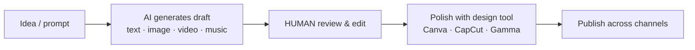
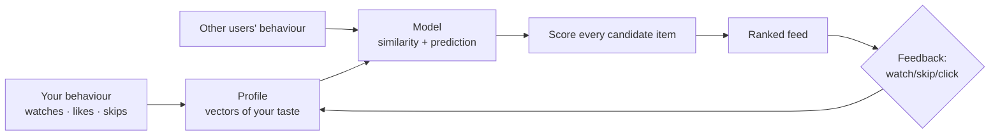

# UNIT 4 — AI in Social Media & Digital Experience 📱

> **AI Product Design (DI05016021)** · **10 hrs · 22% weightage — the heaviest unit**
> **Covers syllabus sections:** 4.1 AI content creation · 4.2 Recommendation systems · 4.3 AI chatbots · 4.4 AI ad targeting · 4.5 Virtual influencers & avatars · 4.6 Social-media AI risks (deepfakes, fake news, bots, algorithm manipulation) · 4.7 AI tools & prototyping (no-code, presentations, logos, UI mock-ups, demo videos)
> **Related practicals:** [P09](../practicals/writeups/P09_social_media_campaign.md), [P10](../practicals/writeups/P10_no_code_prototype_demo_video.md)

---

## 🧭 Chapter Roadmap

```
UNIT 4 — AI in Social Media & Digital Experience
├── 4.1 AI in content creation                  ★★★★   ← P09 drafts
├── 4.2 Recommendation systems (concept)        ★★★★★
├── 4.3 AI chatbots for customer service        ★★★★
├── 4.4 AI-driven ad targeting (concept)        ★★★★
├── 4.5 Virtual influencers & AI avatars        ★★★
├── 4.6 Risks in Social Media AI                ★★★★★  ← exam hot zone
│     ├── Deep fake content · Fake news
│     └── Bot networks · Algorithm manipulation
└── 4.7 AI Tools & Prototyping                  ★★★★   ← P10
      ├── No-code AI tools · Presentation tools
      └── Logo/content generators · UI mock-ups · demo videos
```

### Learning outcomes — after this unit you can:
1. Describe how **AI creates content** (text, image, video, music) and its workflow.
2. Explain **recommendation systems** conceptually (collaborative, content-based, hybrid).
3. Explain **AI chatbots** and **ad targeting** at concept level.
4. Describe **virtual influencers / AI avatars** and their risks.
5. Explain the **4 social-media AI risks** — deepfakes, fake news, bot networks, algorithm manipulation.
6. Choose **no-code AI tools** for prototyping (presentations, logos, mock-ups, demo videos) and explain when to use each.

---

## 4.1 AI in Content Creation

AI tools generate text, images, audio, and video from prompts — turning content production from hours to seconds (the P09 campaign drafts used exactly this).

**Typical AI content workflow:**


| Content type | Example tools | What AI does | Watch-outs |
|---|---|---|---|
| **Text** | ChatGPT, Gemini, Claude | Posts, emails, captions, scripts | Factual errors — always review |
| **Image** | Canva AI, DALL·E, Midjourney | Posters, thumbnails, logos | Licensing & deepfake risk (§4.6) |
| **Video** | CapCut AI, Synthesia, Runway | Shorts, talking-avatar videos | "AI-made" transparency |
| **Audio/music** | ElevenLabs, Suno | Voiceover, background music | Voice-clone misuse (§4.6) |

> 💡 **Exam one-liner:** *AI accelerates creation but cannot own the judgement — the human sets the strategy, reviews the output, and owns the responsibility.* (This also answers every "does AI replace creators?" question.)

## 4.2 AI Recommendation Systems (concept) ⭐

A **recommendation system** predicts *what the user will like* and surfaces it (YouTube feed, Netflix row, Instagram explore, Amazon "you may also like").

**The 3 approaches (memorise):**
| Approach | Idea | Example |
|---|---|---|
| **Collaborative filtering** | "Users like you liked X" — patterns across users | Netflix ("people who watched this also watched…") |
| **Content-based** | "You liked X, here's more like it" — item features | YouTube (more from the same channel/topic) |
| **Hybrid** | Combines both | Most real platforms |



**Why it's an AI problem:** taste is hidden in massive, messy behavioural data — the system must *predict* what you'll do next, and it improves through the **feedback loop** (Unit 1).

> ⚠️ **Exam angle — the dark side:** recommendation engines optimise *engagement*, which can lead to **echo chambers** (you only see what reinforces your views) and **addictive loops**. This is the bridge to §4.6 risks.

## 4.3 AI Chatbots for Customer Service

An **AI chatbot** answers customer questions automatically, 24/7, through a conversational interface.

| Feature | Rule-based bot (old) | AI/LLM chatbot (now) |
|---|---|---|
| Understands | Only exact keywords/flows | Natural language, open-ended |
| Answers | Scripted, limited | Generated, flexible, can escalate |
| Failure mode | "Sorry, I didn't understand" | Confident-but-wrong (hallucination) |
| Best practice | Good for FAQs | Needs HITL fallback + grounding |

**Design rules (ties to Unit 2.7):** greet → gather context → answer from *trusted knowledge* (grounding) → **escalate to a human** when out of scope → collect feedback. StudyMate's Doubt Assistant is the same architecture applied to study material.

## 4.4 AI-Driven Ad Targeting (concept)

**Ad targeting** uses AI to decide *who sees which ad* — from demographics to behaviour to *predicted intent*.

```
User signals (browsing, searches, likes, device)  ──►  prediction model
                                                         │
                                                         ▼
        "P(student, exam week, revision content) = 0.87"  ──►  serve StudyMate ad
```

- **Lookalike audiences:** find new users who *behave like* your best existing users.
- **Dynamic creative:** AI picks/generates the ad variant most likely to convert per person.
- **Bidding:** AI places bids in real-time auctions (the "ad auction").
- **The ethical issue:** profiling can be *creepy* and *discriminatory* (housing/job ads shown unevenly) — regulation and transparency (Unit 5) are closing in on this.

## 4.5 Virtual Influencers & AI Avatars

**Virtual influencers** = computer-generated characters with social-media lives (e.g., Lil Miquela) who promote brands; **AI avatars** = generated humans/characters in video (Synthesia, HeyGen).

| Aspect | What to know |
|---|---|
| **How they're made** | Generated faces + motion + voice cloning + script |
| **Why brands use them** | 24/7, fully controllable, no scandals, cheap at scale |
| **Marketing use** | Product demos, tutorial videos, campaign spokes-avatars |
| **Real risks** | Deception (fake endorsement), unrealistic beauty standards, deepfake abuse (§4.6), disclosure rules |
| **Disclosure rule** | Platforms increasingly require "AI-generated" labels |

> **Exam one-liner:** *Virtual influencers are a marketing channel, not a person — so trust, disclosure, and responsibility rules still apply, and deception is the core risk.*

## 4.6 Risks in Social Media AI ⭐⭐⭐ (exam hot zone)

Four risks — you must be able to define each, give an example, and state one mitigation each.

### 4.6.1 Deep fake content
**Definition:** AI-generated or altered media (faces, voices, videos) that looks real but is fabricated — e.g., a fake video of a person saying something they never said.
- **Harm:** identity theft, defamation, scams (fake CEO voice calls), fraud.
- **Mitigation:** watermarking, detection tools, provenance metadata (C2PA), platform labelling, awareness.

### 4.6.2 Fake news generation
**Definition:** AI generates realistic but false news articles, images, or audio at scale — cheap to produce, hard to trace.
- **Harm:** mass misinformation, election manipulation, panic (e.g., fake disaster warnings).
- **Mitigation:** fact-checking pipelines, content provenance labels, platform takedowns, literacy campaigns.

### 4.6.3 Bot networks
**Definition:** automated AI-driven accounts that post/retweet/engage at scale to manipulate trends, sentiment, or rankings.
- **Harm:** fake engagement ("astroturfing"), market manipulation, manufactured consensus.
- **Mitigation:** bot detection (behavioural signals), CAPTCHA, rate limits, platform enforcement.

### 4.6.4 Algorithm manipulation
**Definition:** attacking the *recommender itself* — gaming engagement signals so the algorithm promotes harmful content or suppresses true content.
- **Harm:** amplified misinformation, view hijacking, SEO/rank poisoning, echo chambers.
- **Mitigation:** signal validation, robustness testing (red-teaming), transparency in ranking.

> **One-sentence summary for the viva:** *The same AI that recommends, creates, and targets can be weaponised — deepfakes fake the content, fake news fakes the facts, bots fake the audience, and algorithm manipulation fakes the rankings — so products must build detection, disclosure, and monitoring into the platform itself.* (P12 turns these into a risk matrix for StudyMate.)

## 4.7 AI Tools & Prototyping ⭐

### 4.7.1 Overview of no-code AI tools
Build apps and AI demos **without programming**:
| Tool | What you build | StudyMate use |
|---|---|---|
| **Glide** | Mobile-style apps from a spreadsheet | The P10 clickable prototype |
| **FlutterFlow / Bubble** | More custom logic, real backend | If the prototype outgrows Glide |
| **Google Teachable Machine** | Tiny image/audio/pose classifier, visually | Demo a classifier for P02/P03 |
| **Framer / Webflow / Wix** | Landing pages / marketing sites | P09 landing page |

### 4.7.2 AI-based presentation tools
- **Gamma / Tome AI:** type an outline → AI generates a designed deck with text/images.
- **Canva AI / PowerPoint Copilot:** design assistance and drafting.
- **Use in this course:** making your practical reports, project pitch decks, and the P09 campaign presentation.

### 4.7.3 Logo and content generation tools
- **Logo:** Canva AI / Looka / name-based generators.
- **Content:** ChatGPT/Gemini (copy), Canva AI (posters), CapCut (video), Suno (jingles).
- **Rule:** generate → review → edit; keep the raw + edited versions for your report appendix (examiners want the *process*).

### 4.7.4 Basic UI mock-up design
- **Figma (or FigJam / Canva):** draw screens, arrange boxes, connect flows.
- The output is a **mock-up** (static visual design) — one level above a wireframe (P05) and below a clickable prototype (P10).
- Mock-up = layout + visual style; wireframe = structure only; prototype = clickable.

### 4.7.5 Demo video preparation
1. **Script** (what you'll say, ≤2:30) — P10 has a full storyboard.
2. **Record** on phone (landscape, good light) + screen-record the app (OBS/Loom).
3. **Edit** in CapCut/Canva video: trim, captions, pop-ups, background music ≤20% volume.
4. **Publish** and embed/share the link in your report.

---

## 🧠 Deep-Dive Topics

### Deep Dive A: The engagement-maximisation problem
Every platform optimises watch-time because that's what pays. The AI recommendation loop (4.2) therefore gravitates toward *extreme, novel, divisive* content — which is precisely the content fake news, bots, and manipulated algorithms exploit. This one economic fact explains the entire risk section (4.6). An AI product designer who can say "the recommendation objective is the product decision" has a genuinely advanced answer.

### Deep Dive B: A marketing funnel built on AI tools (P09 end-to-end)
Awareness (AI-generated reels from CapCut + AI captions) → Interest (recommendation-amplified, ad-targeted to lookalike audiences) → Desire (testimonials + virtual-avatar demo videos) → Action (Glide-built free trial) → Retention (chatbot answering questions, email automations). The same AI that powers the product powers its growth — and every step carries the 4.6 risks (a fake testimonial is a deepfake *in miniature*).

### Deep Dive C: Provenance as the antidote
All four 4.6 risks share one cure: **provenance** — knowing who created content, with what, and whether it was AI-altered (C2PA standards, watermarking, content credentials). Platforms, regulators, and consumers are converging on "trust the source, not the pixels." A modern AI product should generate, store, and *show* content provenance by default — that's both ethics (Unit 5) and risk control (Unit 6).

---

## 🚀 Beyond the Textbook (what most classes won't tell you)

1. **The "recommendation echo chamber" is a design choice, not a law of physics.** Platforms *choose* engagement-maximising objectives; regulators now push for "recommender transparency" (EU DSA) that forces them to expose and offer alternatives.
2. **Deepfakes now include voice.** The cheapest attack is a cloned voice in a WhatsApp call — not a Hollywood-quality face swap. Detection is a losing arms race; *provenance + verification* (call-back to a trusted channel) is the real defence.
3. **Bots are a cost/scale game.** A single human can run thousands of AI accounts because generation is free — which is why CAPTCHA/behavioural signals alone can't win; platform-level detection + throttling is needed.
4. **Your "AI product" already trains its attackers.** The more your content pipeline is AI-generated, the easier it is to spoof — attackers learn the same tools. Include adversarial testing in the roadmap (Unit 6).
5. **Algorithm manipulation isn't only "bad guys".** Influencers gaming the feed and companies doing black-hat SEO are the same risk — define it by *behaviour*, not by actor.
6. **Exam-hack memory aid for 4.6 risks:** "**D**eepfakes · **F**ake news · **B**ot networks · **A**lgorithm manipulation" = **DFBA** → "**D**on't **F**all **B**ehind **A**I."

---

## 🎯 High-Yield Exam Topics (no PYQ papers exist for this new subject — these are the likely GTU-style questions)

**Likely questions (short notes / 4 marks):**
1. How does **AI create content**? Name 4 content types with one tool each.
2. Explain **recommendation systems** with the 3 approaches.
3. Explain **AI chatbots** for customer service and their limits.
4. Explain **AI-driven ad targeting** at concept level.
5. What are **virtual influencers / AI avatars**? State two uses and two risks.
6. What are **deepfakes**? Give a real harm and one mitigation.
7. How do **bot networks** manipulate social media?
8. Explain **algorithm manipulation**.
9. What is a **no-code tool**? Name three with their uses.
10. Steps to prepare a **demo video**.

**Likely long questions (7 marks):**
11. Explain the **4 risks of AI in social media** with examples and mitigations.
12. Explain **recommendation systems** in detail — approaches, feedback loop, and risks.
13. "AI tools for prototyping" — explain no-code tools, presentation tools, logo/content tools, UI mock-ups and demo videos, with a use case.

**Solved model answers (exam style):**

**Q. 7 marks — Explain the risks of AI in social media with examples and mitigations.**
> **(1) Deep fake content** — AI-created realistic media showing people doing/saying things they didn't. Example: a cloned-voice call convincing someone to transfer money. Mitigation: watermarks, provenance metadata, detection tools, platform labelling. **(2) Fake news generation** — false articles/images produced cheaply at scale. Example: a fabricated "exam paper leaked" post circulating before finals. Mitigation: fact-checking, provenance labels, platform takedown, media literacy. **(3) Bot networks** — automated AI accounts manipulating trends and sentiment. Example: thousands of accounts artificially trending a hashtag (astroturfing). Mitigation: bot detection on behavioural signals, CAPTCHA, rate limiting. **(4) Algorithm manipulation** — gaming recommendation/ranking signals so harmful content gets promoted or true content is suppressed. Example: engagement-farming that pushes misinformation to the top of feeds. Mitigation: signal validation, robustness/red-team testing, ranking transparency. The common thread: the same AI that powers creation and recommendation can be weaponised, so detection, disclosure and monitoring must be built into the platform itself.

**Q. 4 marks — Explain recommendation systems with the three approaches.**
> A recommendation system predicts what a user will like and ranks it into a feed. **Collaborative filtering:** "users like you also liked X" — it finds patterns across many users' behaviour (Netflix's "because you watched…"). **Content-based:** "you liked X, here is more like X" — it compares the features of items you already engaged with (YouTube suggesting more from the same topic). **Hybrid:** combines both for better coverage and accuracy, as most real platforms do. The system builds a **user profile from behaviour** (watches, likes, skips), scores candidate items, and improves through the **feedback loop** — every watch/skip becomes new signal. Risks: echo chambers and engagement-maximising design can amplify harmful content.

**Q. 4 marks — What are no-code tools? Name three with uses.**
> **No-code tools** let non-programmers build functional apps, websites, and AI demos visually — through drag-and-drop interfaces, templates, and data sources — instead of writing code. Examples: **(1) Glide** — build a mobile-style app from a Google Sheet (used for the StudyMate clickable prototype in P10). **(2) Google Teachable Machine** — train a tiny image/audio/pose classifier visually, no code (demonstrates a model for P02). **(3) Canva AI** — design posters, logos, presentations and social media posts (used for P09 campaign content). Others include FlutterFlow and Bubble (custom apps), Gamma/Tome (AI presentations), and Webflow/Framer (websites). No-code speeds up prototyping, letting the team test ideas before committing to engineering.

---

## ✍️ Practice Problems (self-test — answers hidden)

1. For each of the 4 social-media risks, name a *StudyMate-relevant* example (how could each hit an EdTech product?).
2. YouTube recommends 10 videos. Which recommendation approaches likely produced that feed, and why?
3. A brand launches a virtual influencer. List 3 rules it must follow to avoid deception.
4. You're building a chatbot for a college support desk. Design the escalation rule set (when does a human take over?).
5. Which no-code tool would you use for: (a) a clickable phone app demo, (b) a pitch deck, (c) a poster, (d) a tiny image classifier?
6. Explain why "engagement-maximising recommendation" and "fake news spread" are causally linked.

<details>
<summary>📌 Model solutions</summary>

1. Deepfake: a fake video of a "topper" endorsing an app. Fake news: a fabricated "GTU paper pattern leaked" PDF shared in WhatsApp groups. Bots: thousands of accounts inflating a coaching institute's ratings. Algorithm manipulation: gaming search so scam study apps rank above real ones.
2. Likely hybrid: content-based (more of the topics you watch) + collaborative (what similar viewers watch) + engagement-signal reranking. Rarely is one approach used alone.
3. (1) Disclose it's AI/virtual; (2) never imply a real human endorsement; (3) be honest in sponsored content; (4) moderate its comments/behaviour like a real influencer; (5) avoid unrealistic beauty/marketing claims.
4. Escalate when: repeated misunderstanding (2 failed attempts), high stakes (fees, results, personal data), explicit emotion/anger ("talk to a human"), out-of-scope topic, or user asks directly. Always offer "talk to human" in a persistent button.
5. (a) Glide/FlutterFlow; (b) Gamma/Tome or Canva; (c) Canva AI; (d) Google Teachable Machine.
6. The recommender optimises watch-time/engagement; false and extreme content generates high engagement cheaply; so the optimisation objective itself rewards misinformation. Design the objective responsibly (add quality/provenance signals) to break the link.
</details>

---

## 📖 Glossary of Key Terms

| Term | Definition |
|---|---|
| **Content creation** | Producing text/images/video/audio, now AI-assisted |
| **Recommendation system** | Predicts what a user will like; ranks a feed |
| **Collaborative filtering** | "Users like you liked X" — cross-user patterns |
| **Content-based recommendation** | "More like what you liked" — item features |
| **Hybrid recommendation** | Combines collaborative + content-based |
| **Echo chamber** | Algorithmic feedback that only reinforces existing views |
| **AI chatbot** | Conversational AI for customer service |
| **Escalation / HITL** | Handing off to a human when the bot can't help |
| **Ad targeting** | Predicting who should see which ad (lookalikes, bidding) |
| **Virtual influencer** | AI-generated character with a social-media presence |
| **AI avatar** | Generated human/character in video content |
| **Deepfake** | Realistic AI-fabricated media (face/voice/video) |
| **Fake news generation** | Cheap, realistic false content at scale |
| **Bot network** | Automated accounts manipulating trends/sentiment |
| **Algorithm manipulation** | Gaming recommendation/ranking signals |
| **Provenance / C2PA** | Verified record of content origin & AI alteration |
| **No-code tool** | Visual, drag-and-drop app/AI builder (Glide, Teachable Machine) |
| **Mock-up** | Static visual design of screens |
| **Prototype** | Clickable, interactive version of the product |

---

## 🔗 Curated Resources (per concept)

**Recommendation systems**
- "The Netflix Prize / recommender systems" explainers: https://www.netflixprize.com
- Google "How recommendations work" style docs: search *how youtube recommendation works transparency report*

**AI content & chatbots**
- OpenAI / Canva AI / CapCut official blogs (content workflows)
- "How to build a customer-service chatbot" guides: search *customer service chatbot design best practices*

**Social-media AI risks**
- Deepfake & misinformation explainers: search *deepfakes explained c2pa content credentials*
- EU Digital Services Act (recommender transparency): https://digital-strategy.ec.europa.eu/en/policies/dsa
- Misinformation defence guidance: search *prebunking inoculation theory misinformation*

**Tools**
- Glide: https://www.glideapps.com · Google Teachable Machine: https://teachablemachine.withgoogle.com
- Gamma: https://gamma.app · Tome: https://tome.app · Canva: https://www.canva.com · CapCut: https://www.capcut.com
- Figma (mock-ups): https://www.figma.com

## 🎥 Video Study Guide (YouTube)

> Don't like reading? Me neither. This is your **structured video path** for the whole unit — better than the syllabus because it tells you *exactly what to search* and *what to watch first*, in a sensible order. Everything below is search keywords (they never rot like links do) + channels you can trust.

### 🧑‍🎓 Step 0 — Pick your learning style

| Style | You learn best by | Your path through this unit |
|---|---|---|
| 🎧 **Listener** | short, clear explainers | Watch 1 explainer per topic from the table below (3–8 min each) |
| 🛠️ **Builder** | making things | Do [P09](../practicals/writeups/P09_social_media_campaign.md) drafts and the [P10](../practicals/writeups/P10_no_code_prototype_demo_video.md) Glide build as you go |
| 🔧 **Tinkerer** | experimenting | Try Canva AI, Gamma, Teachable Machine and CapCut in one afternoon |
| 🧠 **Deep Diver** | full theory, "why" | Watch the recommendation-system and deepfake deep dives below |
| 🧭 **Explorer** | breadth & curiosity | Watch platform-transparency talks (YouTube "How YouTube works") first |
| 🎓 **Academic** | exam marks | Grind the High-Yield list above; write the 4 risks from memory with examples |

### 🎬 Step 1 — Watch by topic (search these on YouTube)

| Topic | YouTube search keywords (copy-paste ready) | Best channels | Style served |
|---|---|---|---|
| AI content creation | `ai content creation tools 2026` · `how to use ai for social media content` · `ai video generator tutorial` | Canva (official), CapCut, Matt Wolfe | 🔧 Tinkerer |
| Recommendation systems | `how recommendation systems work` · `recommender systems explained collaborative filtering` · `how youtube recommendation works` | StatQuest, ByteByteGo, Veritasium | 🧠 Deep Diver |
| AI chatbots | `how ai chatbots work` · `customer service chatbot best practices` · `chatbot vs human escalation` | IBM Technology, Google Cloud Tech | 🎧 Listener |
| Ad targeting | `how ad targeting works machine learning` · `programmatic advertising explained` · `how facebook ads targeting works` | Facebook Blueprint, a16z, HubSpot | 🎧 + 🧠 |
| Virtual influencers | `virtual influencers explained` · `ai avatars for video` · `synthesia ai avatar tutorial` | Matt Wolfe, Business Insider, The Verge | 🧭 Explorer |
| Deepfakes & fake news | `deepfakes explained dangers` · `how deepfakes are made` · `fake news and ai misinformation` | Veritasium, Computerphile, TED-Ed | 🧠 Deep Diver |
| Bot networks & manipulation | `bot networks social media manipulation` · `astroturfing explained` · `how twitter bots work` | CNBC, Data Society, The Verge | 🧠 + 🧭 |
| No-code tools | `what is no code development` · `glide app tutorial for beginners` · `teachable machine tutorial` | freeCodeCamp, Glide (official), Google for Education | 🛠️ Builder |
| Presentations & logos | `gamma ai presentation tutorial` · `canva ai logo generator` · `make a pitch deck with ai` | Canva, Gamma, Product School | 🔧 + 🛠️ |
| Demo videos | `how to record a product demo video` · `product demo script template` · `capcut tutorial for beginners` | Loom, CapCut, Ahrefs | 🛠️ Builder |
| Whole-unit revision | `ai in marketing full course` · `recommender systems full course` · `misinformation and social media course` | freeCodeCamp, Stanford Online, MIT OCW | 🎓 Academic |

### 🎬 Step 2 — Full playlists (for Deep Divers & Academics)

1. **"Stanford CS229-style / StatQuest — Machine Learning foundations"** — the recommender-system and classification maths behind this unit, if you want the "why".
2. **"freeCodeCamp — No-Code & AI tools full courses"** — hands-on Glide, Canva AI, and video-editing playlists for the Builder/Tinkerer paths.
3. **"MIT / Stanford — Misinformation & digital media lectures"** — academic depth on deepfakes, bots, and algorithm manipulation (great viva ammunition).

### 🎬 Step 3 — Proof you got it (5 min)

- Explain to a friend how YouTube's home feed "knows" what you'll watch — name both approaches + the feedback loop.
- List the 4 social-media AI risks from memory, each with one real example and one mitigation.
- Pick the right no-code tool for each of 4 jobs (app demo / deck / poster / classifier) and justify it in one line each.

---

*Next: [UNIT 5 — Privacy, Data Governance & Responsible AI](./UNIT_5_Privacy_Data_Governance_and_Responsible_AI.md)*
