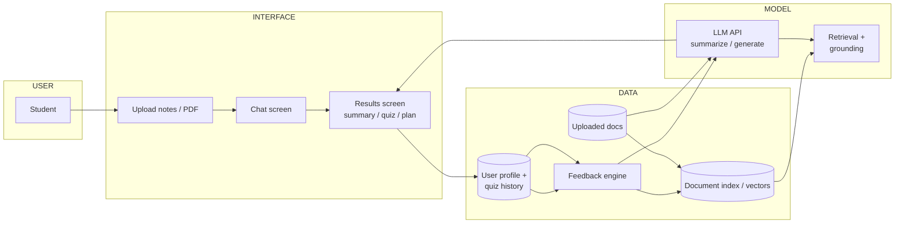

# P02 — Conceptual AI System Architecture (Data → Model → Interface → Feedback)

**Subject:** AI Product Design | **Unit:** 1 | **Approx. Hrs:** 2
**PrO (verbatim):** *Draw conceptual AI system architecture showing Data, Model, Interface, and Feedback Loop.*

---

## 1. Objective
- Draw a **conceptual** (block-level) architecture for StudyMate — no code, just the four standard AI-system blocks.
- Explain what each block does and how data flows through them.
- Show where the **feedback loop** closes the cycle.

## 2. The Four Standard Blocks (theory you must know)

| Block | Role | StudyMate example |
|---|---|---|
| **① Data** | Everything the system learns from or uses at run-time | Student's uploaded PDFs/notes, chat history, quiz results, user profile |
| **② Model** | The AI brain — transforms input into output | LLM API (e.g., GPT-class) + a retrieval step over the student's docs |
| **③ Interface** | Where human and machine meet | Web/phone UI: upload screen, chat screen, results screen |
| **④ Feedback loop** | Model output → user reaction → better data/model over time | Quiz score → "weak topics" tag → future quizzes target those topics |

## 3. Conceptual Architecture — StudyMate



**Simpler ASCII version (copy into any answer sheet):**

```
                ┌────────────────────────────────────────────┐
                │                STUDENT (user)              │
                └──────────────────┬─────────────────────────┘
                                   │ ask / upload
                                   ▼
        ┌───────────────────────────────────────────────────────────────┐
        │ ③ INTERFACE  (web app / phone screen)                          │
        │   upload notes · chat input · quiz & summary results          │
        └───────────────────────────────────────────────────────────────┘
                                   │
                                   ▼
        ┌───────────────────────────────────────────────────────────────┐
        │ ② MODEL  (LLM API + retrieval over your documents)             │
        │   "read your notes → produce summary / quiz / answer"          │
        └───────────────────────────────────────────────────────────────┘
                                   ▲                                 │
                                   │                                 ▼
                    ┌──────────────┴──────────────┐    ┌──────────────────────────┐
                    │ ① DATA                      │    │ ④ FEEDBACK LOOP           │
                    │ uploaded PDFs · chat history│    │ quiz score → "weak topic" │
                    │ user profile · study logs   │    │ → next quiz targets it    │
                    └─────────────────────────────┘    └──────────────────────────┘
```

## 4. Data Flow (read this aloud — it's the viva answer)

1. **Input:** the student uploads a PDF or types a question in the **Interface**.
2. **Data capture:** the file is saved into the **Data** layer; the raw text is chunked and indexed so the model can search it.
3. **Model call:** the **Model** (LLM API) receives *your prompt + only the relevant chunks* (retrieval-augmented generation — "RAG").
4. **Output:** the generated summary/quiz/answer is returned to the **Interface**.
5. **Feedback:** the student's *reaction* (quiz score, thumbs up/down, "regenerate") is stored in Data and feeds the **Feedback loop**, which re-ranks what the model retrieves next time (e.g., prioritise weak topics).

> **Key exam insight:** in a conceptual AI architecture the **Data block feeds the Model**, the **Model feeds the Interface**, and the **Feedback loop returns user signals to Data/Model** — otherwise the system never improves.

## 5. Blank Template (copy into `../code/p02_architecture_template.md`)

```
# AI System Architecture — <Product>

## 5.1 Block map
| Block | Role | What it is in MY product |
|---|---|---|
| Data | ____ | ____ |
| Model | ____ | ____ |
| Interface | ____ | ____ |
| Feedback loop | ____ | ____ |

## 5.2 ASCII diagram
(draw boxes for the four blocks + arrows for data flow)

## 5.3 Data-flow steps
1. Input: ____
2. Data capture: ____
3. Model call: ____
4. Output: ____
5. Feedback: ____
```

## 6. Field-by-field explanation (so you can redo it for your idea)

- **Data** — list the *inputs your model needs* (documents, sensor readings, user profiles) and the *signals you collect* (clicks, scores). If you can't name the data, you can't build the product.
- **Model** — a **conceptual** diagram does not require you to pick a specific model. You only say *what kind of AI* (LLM, image classifier, recommender). Picking a concrete API happens in P08.
- **Interface** — the screens/modes the user touches. A product with a hidden model but a bad interface fails; that's why UI is a whole unit (Unit 2).
- **Feedback loop** — *"how does the product get smarter from use?"* This is what separates a one-shot tool from a product. Common loops: explicit ratings, implicit behaviour (what you click), and outcome data (test scores).
- **Arrows** — every arrow must answer *"what travels along it?"* A diagram with arrows but no labels is half marks.

## 7. Expected Deliverable (report skeleton)
1. Title, aim, date.
2. Block map table (5.1).
3. Mermaid or ASCII diagram (3.x) with all four blocks labelled.
4. Data-flow steps (5.3) — one paragraph per step.
5. Conclusion: one line on why the feedback loop matters.

## 8. Viva Q&A
1. **What is RAG / retrieval?** — Before asking the LLM, the system finds the *relevant parts* of the user's documents (vector search) and sends only those chunks in the prompt, so answers are grounded in the user's material.
2. **Why is the feedback loop a "loop"?** — Because output becomes data, which changes future input — the cycle is circular, not linear.
3. **What if the model is external (API)?** — Then "Model" is a third-party block; your architecture adds a security/API-gateway block (see P08) between Interface and Model.
4. **Do all AI systems need all four blocks?** — Conceptually yes; even a one-shot tool has data (prompt), model, interface (chat box), and implicit feedback (conversation history).

## 9. Resources
- "AI systems architecture" (conceptual diagrams): search *how to draw ai system architecture diagram data model interface feedback*
- Google People + AI Guidebook (system-level thinking): https://pair.withgoogle.com
- Mermaid live editor (draw the diagram): https://mermaid.live
- *Designing Machine Learning Systems* — Chip Huyen, Ch. 1 (full-stack AI)
