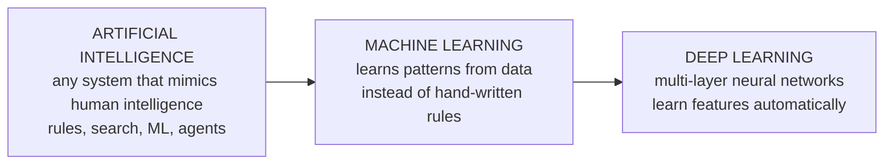
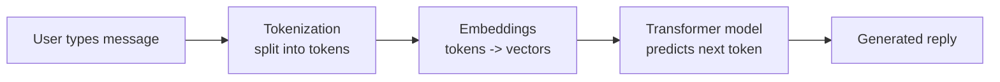

# UNIT 1 — Foundations of Artificial Intelligence & Generative AI 🤖

> **Artificial Intelligence with Prompt Engineering (DI05016011)** · **6 hrs · 15% weightage**
> **Covers syllabus sections:** 1.1 Introduction to AI · 1.2 Types of AI · 1.3 Applications of AI · 1.4 Introduction to Generative AI · 1.5 Generative AI tools · 1.6 Basics of NLP
> **Related practicals:** [P01](../practicals/writeups/P01_genai_tools_tasks_and_domains.md), [P02](../practicals/writeups/P02_sentiment_analysis_text_classification.md)

---

## 🧭 Chapter Roadmap

This unit answers two questions the whole subject depends on: *"What is AI and where did it come from?"* and *"What is Generative AI, and what can it do?"*. Everything later — LLMs (Unit 2), prompting (Units 3–4), and applications (Unit 5) — is a build-up from here. It is the highest "definition-heavy" unit: lots of 2–3 mark definitions.

| # | Concept | Exam importance | Code demo |
|---|---------|-----------------|-----------|
| 1.1 | Definition & history of AI | ★★★ | — |
| 1.2 | AI vs ML vs Deep Learning | ★★★★ | — |
| 1.3 | Narrow AI vs General AI | ★★★ | — |
| 1.4 | Applications of AI (daily life, education, healthcare, cybersecurity) | ★★★★ | — |
| 1.5 | Concept & types of Generative AI | ★★★★★ | P01 |
| 1.6 | Generative AI tools (ChatGPT, Gemini, DALL·E) | ★★★★ | P01 |
| 1.7 | Text / Image / Code generation | ★★★★ | P01 |
| 1.8 | NLP basics & its role in chatbots/LLMs | ★★★★ | P02 |

### Learning outcomes — after this unit you can:
1. Define AI and narrate its history (from Turing to today's GenAI boom).
2. Distinguish **AI → ML → Deep Learning** and **Narrow → General AI** in one table each.
3. Give 2–3 real examples of AI per domain: daily life, education, healthcare, cybersecurity.
4. Explain what **Generative AI** is and classify GenAI systems by output type.
5. Name the big GenAI tools and what each does best (ChatGPT, Gemini, DALL·E).
6. Explain **NLP** and its role in chatbots and LLMs.
7. Relate this unit to the practicals: P01 (task-type matrix) and P02 (sentiment analysis/NLP).

---

## 1.1 Introduction to Artificial Intelligence

### 1.1.1 Definition and History of AI ⭐

**Definition (exam-ready):** Artificial Intelligence is the branch of computer science concerned with building **machines/systems that can perform tasks that normally require human intelligence** — such as understanding language, recognizing images, making decisions, and solving problems. Alternatively: "AI is the study and design of intelligent agents that perceive their environment and take actions to achieve goals."

**The history in 6 lines (memorize the dates + names):**

```
1950 Turing's "Computing Machinery and Intelligence" ──► Turing Test proposed
1956 Dartmouth workshop (McCarthy) ──► the term "Artificial Intelligence" coined
1950s–70s Symbolic AI ──► rule-based systems, expert systems (MYCIN, 1970s)
1980s–90s ML + neural nets return ──► backpropagation popularized; Deep Blue beats Kasparov (1997)
2010s Deep Learning era ──► AlexNet (2012), AlphaGo (2016), GPT-1 (2018)
2020s Generative AI era ──► GPT-3 (2020), ChatGPT (2022), Gemini, Claude, Sora
```

| Era | Key event | Significance |
|---|---|---|
| **1950** | Turing proposes the **Turing Test** | First test of machine "intelligence" |
| **1956** | Dartmouth workshop | Birth of AI as a field |
| **1970s** | Expert systems (MYCIN) | Rule-based AI reaches real use |
| **1997** | Deep Blue beats Kasparov | Narrow AI beats a world champion in chess |
| **2012** | AlexNet wins ImageNet | Deep learning breakthrough (GPUs + big data) |
| **2020–2022** | GPT-3 → ChatGPT | Generative AI goes mainstream |

> 💡 **Beyond the textbook:** AI has had two "winters" — periods (1974–80, 1987–93) when funding and hype collapsed because the promised results didn't arrive. The current era avoids this partly because LLMs are genuinely useful and commercially valuable, not just demos.

### 1.1.2 AI vs Machine Learning vs Deep Learning ⭐⭐

The three are **nested** — ML is a subset of AI; Deep Learning is a subset of ML.



| Criterion | AI | Machine Learning | Deep Learning |
|---|---|---|---|
| **Definition** | Making machines intelligent | Computers learn from data | Neural networks with many layers |
| **How it "knows"** | Rules / search / logic / learned | Patterns in data | Hierarchical features (edges → shapes → objects) |
| **Human effort** | Hand-craft rules | Feature engineering still needed | Features learned automatically |
| **Data needed** | Little | Moderate | Very large |
| **Example** | Chess engine with rules, Siri, chatbots | Spam filter, credit scoring | Image recognition, ChatGPT |
| **Relation** | Umbrella term | Subset of AI | Subset of ML |

> ⚠️ **Exam trap:** "Is a spam filter AI?" — Yes (it is ML-based AI). "Is ChatGPT deep learning?" — Yes (an LLM is a deep neural network). "Is a decision-tree spam filter deep learning?" — **No** — it's ML but not deep learning.

## 1.2 Types of AI ⭐

### 1.2.1 Narrow AI vs General AI

| Criterion | Narrow (Weak) AI | General (Strong) AI |
|---|---|---|
| **Scope** | One specific task | Any intellectual task a human can do |
| **Learning** | Trained for that task only | Learns and transfers across tasks |
| **Today?** | ✅ Everywhere (all current AI) | ❌ Not yet achieved (research goal) |
| **Awareness** | None — no consciousness | Hypothetical self-aware systems |
| **Examples** | Chess engine, spam filter, ChatGPT, face recognition | Human-level robot assistants in sci-fi (JARVIS, HAL) |
| **Memory aid** | "Narrow = one job" | "General = like a person" |

> 💡 **Beyond the textbook:** some books add a third label, **Artificial Superintelligence (ASI)** — intelligence far beyond the best human in every domain. A common exam phrase: "current GenAI systems like ChatGPT are *narrow* AI, despite looking broad, because they have no understanding, no world model, and can't do arbitrary tasks."

## 1.3 Applications of AI

A guaranteed "name applications" question — know **2–3 per domain** with one concrete example each.

| Domain | Applications | Concrete example |
|---|---|---|
| **Daily life** | Virtual assistants, recommendation systems, smart keyboards, maps, smart home | Siri/Alexa; YouTube/Netflix recommendations; Google Maps traffic prediction |
| **Education** | Adaptive learning, auto-grading, doubt-solving chatbots, study assistants | Duolingo adapting difficulty; AI that generates quizzes (P12!) |
| **Healthcare** | Medical imaging analysis, disease prediction, drug discovery, clinical support | AI screening X-rays/CT for tuberculosis; predicting diabetic risk |
| **Cybersecurity** | Intrusion detection, phishing detection, malware analysis, log analysis | AI flagging a phishing email; anomaly detection in network traffic |

> ⚠️ **Exam note:** "AI in healthcare" — be careful to say AI is a **decision-support** tool, not a replacement for doctors; it can be biased or wrong, so humans review.

## 1.4 Introduction to Generative AI ⭐⭐

### 1.4.1 Concept of Generative AI

**Definition (exam-ready):** Generative AI is a branch of AI that **creates new content** — text, images, code, audio, video — rather than just classifying or predicting. It learns the **statistical patterns and distribution of training data**, then **samples** from that learned distribution to produce novel outputs.

```
Traditional AI:   input ──► MODEL ──► label/decision   (e.g., spam/not-spam)
Generative AI:    prompt ──► MODEL ──► new content      (e.g., a new essay, image, song)
```

**Key properties:**
- **Generative** = produces something *new*, not a stored copy.
- **Learns patterns** from massive data (text, images, audio).
- **Probabilistic** — the same prompt can yield different outputs (this is central to Units 2–3).
- Powered today mostly by **foundation models** — huge neural networks pre-trained on internet-scale data and fine-tuned/adjusted for tasks.

### 1.4.2 Types of Generative AI Systems ⭐

| Type | Output produced | Example models/tools |
|---|---|---|
| **Text generation (LLMs)** | Sentences, essays, code, summaries | ChatGPT, Gemini, Claude, LLaMA |
| **Image generation** | New images from a text description | DALL·E, Midjourney, Stable Diffusion |
| **Code generation** | Source code from a description | GitHub Copilot, Codeium, ChatGPT |
| **Audio generation** | Speech, music, voices | ElevenLabs (voice), Suno (music) |
| **Video generation** | Short video clips | Runway, Pika, Sora |
| **Multimodal** | Mixes text + image + audio understanding/generation | Gemini, GPT-4o |

### 1.4.3 Text, Image, and Code Generation ⭐

| Task | How it works (conceptual) | Example prompt → output |
|---|---|---|
| **Text generation** | LLM predicts the next token given the prompt | "Write a haiku about rain" → 5-7-5 poem |
| **Image generation** | Diffusion models start from noise and iteratively denoise toward the text description | "A cat astronaut, watercolor" → image |
| **Code generation** | LLM trained partly on code predicts code tokens | "Python function to check if a number is prime" → function |

> 💡 **Beyond the textbook:** most text-to-image models today are **diffusion models** (trained by progressively adding noise to images, then learning to reverse it), while LLMs are **transformer** models predicting tokens (Unit 2). "Two model families, one word: generative."

## 1.5 Generative AI Tools ⭐

| Tool | Company | Strength | Notes for exams |
|---|---|---|---|
| **ChatGPT** | OpenAI | General-purpose chatbot, excellent reasoning & code | Released Nov 2022; powered by GPT models |
| **Google Gemini** | Google DeepMind | **Multimodal** (text + image + audio + video), integrated with Google Workspace | Successor to Bard |
| **DALL·E** | OpenAI | Text-to-**image** generation | Named after surrealist painter Salvador Dalí + WALL·E |

**Choosing a tool (practical mindset — from P01):**
- Code & reasoning → **ChatGPT**.
- Multimodal input (analyze an uploaded image) → **Gemini**.
- Generating an image → **DALL·E / Midjourney / Stable Diffusion**.
- Long, nuanced writing → **Claude**.

> ⚠️ **Exam note:** "Name 3 GenAI tools" — be able to say who makes each and one signature capability. Also: tools are *complements*, not replacements — outputs need human review.

## 1.6 Basics of Natural Language Processing ⭐

### 1.6.1 Concept of NLP

**Definition (exam-ready):** Natural Language Processing (NLP) is the branch of AI that enables computers to **understand, interpret, and generate human language**.

**Core NLP tasks:**
| Task | What it does | Example |
|---|---|---|
| **Tokenization** | Split text into tokens (words/subwords) | "AI is fun" → `["AI", "is", "fun"]` |
| **Sentiment analysis** | Detect emotional tone | "Great product" → positive |
| **Text classification** | Assign a category | Email → spam/ham |
| **Named-entity recognition** | Find names, dates, places | "Riya met Aarav in Ahmedabad" |
| **Machine translation** | Convert between languages | English ↔ Gujarati |
| **Text generation / summarization** | Produce/shorten text | Summarize a news article |

**NLP pipeline (simplified):** raw text → clean → tokenize → represent as numbers (embeddings) → model → output.

### 1.6.2 Role of NLP in Chatbots and LLMs ⭐



- **Chatbots:** NLP lets the bot understand what the user wrote (parse, intent) and produce a natural reply. Rule-based bots (old) matched keywords; modern LLM chatbots *generate* replies.
- **LLMs:** NLP is the *front end* of an LLM — tokenization + embeddings convert language into numbers the network can process; the model's output is converted back to text.
- In short: **NLP is the bridge between human language and machine math** — the same bridge P02's practical walks across (tokenize → represent → classify).

---

## 🧠 Deep-Dive Topics

### Deep Dive A: The "is it AI?" decision tree
```
Does it mimic human intelligence?  ──No──► it's just software
   │Yes
   Does it learn from data? ──No──► Rule-based AI (expert systems, search bots)
   │Yes
   Does it use multi-layer neural networks? ──No──► Classical ML (trees, SVMs)
   │Yes
   Deep Learning ── generates new content? ──Yes──► Generative AI (LLMs, diffusion)
```
Use this to answer "classify this system" viva questions with confidence.

### Deep Dive B: Why Generative AI is probabilistic (the seed of Unit 2)
A generative model does **not** memorize answers; it assigns probabilities to possible next tokens/images and *samples* from them. Consequences: (1) same prompt → different outputs; (2) confident-but-wrong outputs (hallucination) are intrinsic, not bugs; (3) prompt engineering works because better instructions narrow the probability distribution. This single idea explains Units 2, 3, and 4.

### Deep Dive C: Generative vs Discriminative, in one sentence
- **Discriminative model:** learns the boundary between classes → *"Given input X, the label is Y."* (spam filter)
- **Generative model:** learns how the data is produced → *"Given the pattern I learned, here is new X."* (image generator)
A one-sentence exam answer: *"Discriminative models classify; generative models create."*

---

## 🚀 Beyond the Textbook (what most classes won't tell you)

1. **ChatGPT did not invent LLMs.** GPT-1/2 (2018–19) and Google's Transformer paper (2017) came first; ChatGPT was the *product* that made them usable by everyone. Exams reward the history timeline over brand worship.
2. **"Generative" ≠ "original".** A GenAI model samples from patterns in its training data — it can produce text/images that *look* original but are statistical recombinations. This is why copyright and deep-fake debates exist.
3. **Narrow AI is a spectrum, not a line.** A model like ChatGPT looks broad, but it still fails basic real-world reasoning — it has no body, no senses, and no world model. "General AI" remains a research goal, not a product.
4. **The current era is "capability without understanding."** LLMs pass many tests while being deeply unreliable on facts they haven't memorized. That's exactly why the rest of this subject teaches *prompting* (control the output) and *RAG* (ground the output).
5. **Memorization aid for history:** **"Turing 1950, Dartmouth 1956, Deep Blue 1997, AlexNet 2012, ChatGPT 2022"** — five dates = the whole story.
6. **GenAI tool accuracy varies by task type** (P01 finding): code generation is remarkably reliable; image generation needs many iterations; factual answers must be verified. Never quote a tool's answer as truth in an exam answer unless you'd verify it.

---

## 🎯 High-Yield Exam Topics (likely GTU-style — no PYQ papers exist yet)

> This subject is new for 2026-27, so there are no previous papers to map. Below are the **questions most likely to appear**, written in GTU style, with mark hints.

1. **Define Artificial Intelligence.** (3)
2. **State the difference between AI, Machine Learning, and Deep Learning with examples.** (4)
3. **Write a short note on the history of AI.** (4)
4. **Distinguish between Narrow AI and General AI.** (3/4)
5. **Explain any four applications of AI (daily life, education, healthcare, cybersecurity).** (7)
6. **What is Generative AI? Explain its types.** (4/7)
7. **Explain text generation, image generation, and code generation with examples.** (4)
8. **Write a short note on: ChatGPT, Google Gemini, and DALL·E.** (7)
9. **What is NLP? List the tasks performed by NLP.** (3/4)
10. **Explain the role of NLP in chatbots and LLMs.** (4)
11. **Short note: Diffusion models vs LLMs.** (4)
12. **Explain why Generative AI outputs can differ each time.** (3)

### ✅ Solved model answers (exam style)

**Q. (7 marks) What is Generative AI? Explain its types.**
> Generative AI is a branch of artificial intelligence that **creates new content** — text, images, code, audio, video — by learning the statistical patterns of its training data and then **sampling** from that learned distribution. Unlike traditional (discriminative) AI, which classifies or predicts a label from an input, generative systems produce *novel outputs* from a prompt. Types: **(1) Text generation (LLMs)** — models such as ChatGPT, Claude, and Gemini generate coherent sentences, essays, and summaries by predicting the next token. **(2) Image generation** — diffusion-based models such as DALL·E, Midjourney, and Stable Diffusion create images from text descriptions. **(3) Code generation** — tools like GitHub Copilot and ChatGPT write source code from a natural-language specification. **(4) Audio generation** — tools such as ElevenLabs and Suno synthesize speech and music. **(5) Video generation** — tools such as Runway and Sora produce short video clips. **(6) Multimodal systems** — such as Gemini and GPT-4o, which understand and generate multiple modalities together. Example: the prompt "a cat astronaut, watercolor" produces a new image; the prompt "write a haiku about rain" produces a new poem.

**Q. (4 marks) Distinguish between AI, Machine Learning, and Deep Learning.**
> AI is the umbrella field of building machines that mimic human intelligence (perception, language, reasoning, problem-solving). **Machine Learning (ML)** is a subset of AI in which systems **learn patterns from data** instead of following hand-written rules — e.g., a spam filter trained on labelled emails. **Deep Learning (DL)** is a subset of ML that uses **multi-layer neural networks** to automatically learn hierarchical features, requiring large datasets and high compute — e.g., image recognition and ChatGPT. The three are nested: every DL system is ML, every ML system is AI, but not vice versa. Example: a rule-based chess program is AI but not ML; a decision-tree credit scorer is ML but not DL; a neural-network image classifier is DL.

**Q. (3 marks) Define AI. Give the significance of the Turing Test and the Dartmouth workshop.**
> **AI** is the branch of computer science concerned with building systems that perform tasks normally requiring human intelligence — understanding language, recognizing images, making decisions, solving problems. The **Turing Test**, proposed by Alan Turing in 1950, was the first practical proposal for judging machine intelligence: a machine is "intelligent" if a human interrogator cannot reliably tell it apart from a human in a conversation. The **Dartmouth workshop (1956)**, organized by John McCarthy and colleagues, coined the term "Artificial Intelligence" and formally established AI as a research field.

---

## ✍️ Practice Problems (self-test — answers upside-down)

1. Order the timeline: ChatGPT, AlexNet, Deep Blue, Dartmouth workshop, Turing Test.
2. A system uses a fixed set of if-then rules to answer customer queries. Is it AI? Is it ML? Is it DL?
3. Give one example each of text, image, and code generation by GenAI tools.
4. Why is ChatGPT called "Narrow AI" despite doing many tasks?
5. List the six NLP tasks from §1.6 and give an example of each.
6. Name the tool you'd choose to (a) analyze an uploaded X-ray image, (b) generate a logo, (c) fix a buggy Python function. Justify.

<details>
<summary>📌 Model solutions</summary>

1. Turing Test (1950) → Dartmouth (1956) → Deep Blue (1997) → AlexNet (2012) → ChatGPT (2022).
2. It is **AI** (mimics human answering) but **not ML** (no learning from data) and therefore **not DL**.
3. Text: "Write a haiku about rain" → poem (ChatGPT). Image: "a cat astronaut, watercolor" → image (DALL·E). Code: "Python function to check if a number is prime" → function (Copilot/ChatGPT).
4. Because it has **no general understanding** — it is trained for language tasks, has no world model, no senses, and fails on arbitrary tasks; "narrow" refers to task scope and lack of general reasoning, not how many tasks a product offers.
5. Tokenization (split into words), sentiment analysis (positive/negative), text classification (spam/ham), named-entity recognition (find "Riya", "Ahmedabad"), machine translation (EN↔GU), text generation/summarization (shorten an article).
6. (a) **Gemini** (multimodal — reads images), (b) **DALL·E** (text-to-image), (c) **ChatGPT/Copilot** (strongest at code).
</details>

---

## 📖 Glossary of Key Terms

| Term | Definition |
|---|---|
| **Artificial Intelligence** | Building machines that perform tasks requiring human intelligence |
| **Turing Test** | Conversational test of machine intelligence (Turing, 1950) |
| **Dartmouth workshop** | 1956 event that founded AI as a field |
| **Machine Learning** | Learning patterns from data instead of hand-written rules |
| **Deep Learning** | Multi-layer neural networks that learn features automatically |
| **Narrow AI** | AI limited to one task (all current systems) |
| **General AI** | Hypothetical AI matching human intellectual ability |
| **Generative AI** | AI that creates new content by sampling a learned distribution |
| **Foundation model** | Large pre-trained model adapted to many tasks |
| **Diffusion model** | Image-generating model that reverses added noise |
| **LLM** | Large Language Model — next-token predicting text model |
| **ChatGPT** | OpenAI's general-purpose chatbot |
| **Gemini** | Google's multimodal GenAI model family |
| **DALL·E** | OpenAI's text-to-image model |
| **NLP** | Branch of AI for understanding/generating human language |
| **Tokenization** | Splitting text into tokens (words/subwords) |
| **Sentiment analysis** | Detecting the emotional tone of text |
| **Embedding** | Vector of numbers representing a word/text's meaning |

---

## 🔗 Curated Resources (per concept)

**AI basics & history**
- *Artificial Intelligence: A Modern Approach* — Russell & Norvig (GTU-suggested book)
- AI history timeline: https://en.wikipedia.org/wiki/History_of_artificial_intelligence
- Turing's 1950 paper: https://academic.oup.com/mind/article/LIX/236/433/986238

**Generative AI**
- OpenAI "What is Generative AI?" explainers: https://openai.com
- DALL·E product page: https://openai.com/dall-e
- Google Gemini: https://gemini.google.com · developers: https://ai.google.dev
- DAIR.AI Prompt Engineering Guide: https://www.promptingguide.ai

**NLP**
- NLTK book (free, GTU-suggested): https://www.nltk.org/book/
- TextBlob docs: https://textblob.readthedocs.io
- *Natural Language Processing with Python* — Bird, Klein & Loper (GTU book)

**Practical tie-ins**
- [P01](../practicals/writeups/P01_genai_tools_tasks_and_domains.md) — GenAI task-type matrix + tool comparison
- [P02](../practicals/writeups/P02_sentiment_analysis_text_classification.md) — NLP in code: sentiment + classification

---

## 🎥 Video Study Guide (YouTube)

> Don't like reading? Me neither. This is your **structured video path** for the whole unit — better than the syllabus because it tells you *exactly what to search* and *what to watch first*, in a sensible order. Everything below is search keywords (they never rot like links do) + channels you can trust.

### 🧑‍🎓 Step 0 — Pick your learning style

| Style | You learn best by | Your path through this unit |
|---|---|---|
| 🎧 **Listener** | short, clear explainers | Watch 1 explainer per topic from the table below (3–8 min each) |
| 🛠️ **Builder** | writing code yourself | Watch the NLP/Python intro video → then run [P02](../practicals/writeups/P02_sentiment_analysis_text_classification.md) code |
| 🔧 **Tinkerer** | experimenting & demos | Open ChatGPT/Gemini and re-run the P01 task matrix for yourself |
| 🧠 **Deep Diver** | full theory, "why" | Watch the full AI-intro playlists at the bottom (university-level depth) |
| 🧭 **Explorer** | breadth & curiosity | Watch the "how generative AI works" explainers first, then follow your curiosity |
| 🎓 **Academic** | exam marks | Watch the GTU-style/revision videos, then grind the High-Yield Topics above |

### 🎬 Step 1 — Watch by topic (search these on YouTube)

| Topic | YouTube search keywords (copy-paste ready) | Best channels | Style served |
|---|---|---|---|
| What is AI (mental model) | `artificial intelligence explained` · `what is ai in 5 minutes` · `introduction to artificial intelligence` | freeCodeCamp, Simplilearn, IBM Technology | 🧭 Explorer |
| History of AI | `history of artificial intelligence timeline` · `ai winters explained` · `turing test explained` | Computerphile, IEEE, The Royal Institution | 🎧 + 🧠 |
| AI vs ML vs Deep Learning | `ai vs machine learning vs deep learning` · `machine learning explained simply` | Simplilearn, IBM Technology, 3Blue1Brown (neural nets) | 🎓 Academic |
| Narrow vs General AI | `narrow ai vs general ai vs superintelligence` · `what is agi` | Two Minute Papers, ColdFusion | 🧭 + 🎧 |
| Applications of AI | `ai in daily life examples` · `ai in healthcare` · `ai in cybersecurity` | IBM Technology, TED-Ed, freeCodeCamp | 🧭 Explorer |
| Generative AI explained | `what is generative ai` · `generative ai explained` · `diffusion models explained` | IBM Technology, Two Minute Papers, Andrej Karpathy | 🧠 Deep Diver |
| Text-to-image (diffusion) | `stable diffusion explained` · `how dall-e works` · `diffusion models from scratch` | Two Minute Papers, Andrej Karpathy, Computerphile | 🧠 + 🛠️ |
| LLMs / ChatGPT basics | `how chatgpt works for beginners` · `large language models explained` | Andrej Karpathy, 3Blue1Brown, Fireship | 🧠 Deep Diver |
| NLP fundamentals | `natural language processing explained` · `nlp tutorial for beginners` · `textblob sentiment analysis python` | freeCodeCamp, DeepLearning.AI, Tech With Tim | 🛠️ Builder |
| AI tools overview | `chatgpt vs gemini vs claude` · `best ai tools 2026 comparison` | Fireship, The AI Advantage | 🔧 Tinkerer |
| Whole-unit revision | `artificial intelligence full course diploma` · `ai fundamentals one shot revision` · `generative ai crash course` | freeCodeCamp, Gate Smashers, Neso Academy | 🎓 Academic |

### 🎬 Step 2 — Full playlists (for Deep Divers & Academics)

1. **"freeCodeCamp — AI / Machine Learning for Beginners full course"** — structured, covers AI→ML→DL and hands-on Python; ideal companion for this unit.
2. **"Andrej Karpathy — Neural Networks: Zero to Hero"** — the deepest intuition for how deep learning actually works; watch the first 2 videos here.
3. **"DeepLearning.AI — short courses on generative AI & prompt engineering"** (Andrew Ng) — short, credible, directly relevant to the rest of this subject.

### 🎬 Step 3 — Proof you got it (5 min)

- Can you explain the AI→ML→DL nesting to a friend in two sentences?
- Open any GenAI tool and generate one text, one image, and one code output (the P01 trio) — did each behave differently?
- Run [P02](../practicals/writeups/P02_sentiment_analysis_text_classification.md) and predict which review is positive before the script prints it.

---

*Next: [UNIT 2 — Basics of Large Language Models](./UNIT_2_Basics_of_Large_Language_Models.md)*
