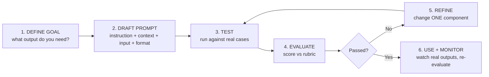

# UNIT 3 — Prompt Engineering Fundamentals 🎯

> **Artificial Intelligence with Prompt Engineering (DI05016011)** · **9 hrs · 20% weightage**
> **Covers syllabus sections:** 3.1 Introduction (definition, importance, prompt lifecycle) · 3.2 Prompt Structure (instruction, context, input data, output format) · 3.3 Prompting Methods (zero-shot, few-shot, role-based, instruction) · 3.4 Prompt Design Best Practices
> **Related practicals:** [P05](../practicals/writeups/P05_prompt_design_and_refinement.md), [P06](../practicals/writeups/P06_zero_shot_few_shot_role_based.md), [P08](../practicals/writeups/P08_task_based_prompt_engineering.md)

---

## 🧭 Chapter Roadmap

This is the **core skill chapter** of the whole subject — 20% weight and the direct basis of Units 4–5. The exam wants definitions (prompt engineering, lifecycle, 4 components, 4 methods) *and* application (design a prompt for a given task). Every "design/refine a prompt" question in the paper traces back to this chapter.

| # | Concept | Exam importance | Code demo |
|---|---------|-----------------|-----------|
| 3.1 | Definition & importance of prompt engineering | ★★★★★ | — |
| 3.2 | Prompt lifecycle | ★★★★ | P05 |
| 3.3 | Instruction / Context / Input data / Output format | ★★★★★ | P05, P08 |
| 3.4 | Zero-shot prompting | ★★★★ | P06 |
| 3.5 | Few-shot prompting | ★★★★★ | P06 |
| 3.6 | Role-based prompting | ★★★★ | P06 |
| 3.7 | Instruction prompting | ★★★★ | P06 |
| 3.8 | Writing effective prompts | ★★★★ | P05, P08 |
| 3.9 | Testing & evaluating prompts | ★★★★ | P03, P08 |
| 3.10 | Iterative prompt improvement | ★★★★★ | P05, P08 |

### Learning outcomes — after this unit you can:
1. Define prompt engineering and explain *why* it matters (better outputs without retraining).
2. Draw the **prompt lifecycle** and name its stages.
3. Break any prompt into the 4 components — instruction, context, input data, output format.
4. Define and apply the 4 prompting methods: zero-shot, few-shot, role-based, instruction.
5. Explain how to *test and evaluate* prompts, and improve them iteratively.
6. Apply all of it in practicals P05 (refinement), P06 (methods), P08 (task prompts).

---

## 3.1 Introduction to Prompt Engineering

### 3.1.1 Definition and Importance ⭐⭐⭐

**Definition (exam-ready):** Prompt engineering is the practice of **designing, testing, and refining the input (prompt)** given to an LLM so that it produces **accurate, useful, and correctly formatted outputs**.

**Why it's important (memorize 4 reasons):**
1. **No retraining needed** — the same model does different tasks just by changing the prompt (cheap).
2. **Controls quality** — a clear prompt avoids vague, wrong, or off-format answers.
3. **Controls cost** — concise prompts use fewer tokens (Unit 2 §2.4.4).
4. **Reduces risk** — constraints ("answer only from the text", "say I don't know") reduce hallucinations and unsafe outputs.

> 💡 **Beyond the textbook:** prompt engineering is sometimes called "the programming language of LLMs" — the prompt is the only code you write for a foundation model. It's a **human skill**: knowledge of the task, the model, and the failure modes.

### 3.1.2 The Prompt Lifecycle ⭐

A prompt is not written once — it goes through a cycle:



| Stage | Activity |
|---|---|
| 1. Define goal | What exactly must the output contain? (format, length, facts) |
| 2. Draft | Build the 4-component prompt (next section) |
| 3. Test | Run on representative inputs, incl. edge cases |
| 4. Evaluate | Score with a rubric (P08 has one) |
| 5. Refine | Change one thing at a time; measure improvement |
| 6. Use & monitor | Deploy, then keep checking real-world outputs |

> ⚠️ **Exam trap:** "Iteration" means changing **one variable at a time** — if you change three things and the output improves, you can't know which one helped.

## 3.2 Prompt Structure ⭐⭐

Every strong prompt has four components (syllabus §3.2). Learn them as the **P-P-I-O** mnemonic — **P**arts: Instruction, **C**ontext, **I**nput data, **O**utput format — actually let's just say **"I-C-I-O"** (Instruction, Context, Input, Output).

| Component | What it is | Bad example | Good example |
|---|---|---|---|
| **Instruction** | The task verb + goal | "Write something about AI." | "Write a 300-word blog post titled …" |
| **Context** | Background, audience, constraints, role | — | "For final-year IT students; formal tone" |
| **Input data** | The material to work on | "summarize this article" | paste the actual article |
| **Output format** | How the result must look | — | "Exactly 4 bullets, max 20 words each" |

**A model prompt built from all four:**
```
Instruction : Summarize the text below for a busy manager.
Context     : Manager needs decisions, not background; English, formal.
Input data  : {article pasted here}
Output fmt  : 4 bullet points (≤20 words each) + a one-sentence conclusion.
```

> 💡 **Beyond the textbook:** for **harder** tasks, add a 5th informal component — **examples** (few-shot, §3.3.2) and **constraints** (negative rules: "do not mention prices"). Examples act as executable specification; constraints act as safety rails.

## 3.3 Prompting Methods ⭐⭐

### 3.3.1 Zero-Shot Prompting ⭐
**Definition:** give the model a task with **no examples**. It must do the task from the instruction alone.
```
Prompt: Classify this review as Positive, Negative, or Neutral.
        "The app crashes every time I open it."
Output: Negative
```
**When:** common tasks; quick tests; when examples would waste tokens.
**Risk:** format/labels may drift (the model picks its own labels).

### 3.3.2 Few-Shot Prompting ⭐⭐⭐
**Definition:** include **2–5 example input→output pairs** before the real input. The model learns the *pattern and format* from the examples (in-context learning).
```
Prompt: Classify each review as POS/NEG/NEU.
        "Great battery life." -> POS
        "Worst purchase ever." -> NEG
        "It works, nothing more." -> NEU
        "The camera is decent." ->
Output: POS
```
**When:** exact labels/formats matter; new or unusual tasks; improving consistency.
**Risks:** bad examples mislead; too many examples cost tokens.
**Key paper:** *"Language Models are Few-Shot Learners"* (Brown et al., 2020).

### 3.3.3 Role-Based Prompting ⭐
**Definition:** assign the model a **role** ("Act as …") to control tone, knowledge domain, and constraints.
```
Prompt: You are a primary-school science teacher. Explain why the sky is blue
        to a 7-year-old, ending with one fun question.
```
**When:** domain voice matters (teacher, editor, reviewer); consistent persona.
**Risks:** over-roleplaying can add verbose fluff — constrain length too.

### 3.3.4 Instruction Prompting ⭐
**Definition:** leading with a **clear, explicit instruction** (a command verb) and precise requirements, without roleplay or examples.
```
Prompt: Translate the following to Gujarati. Keep it formal.
        "Please complete the form and return it by Friday."
```
**When:** straightforward operational tasks; a close cousin of the "instruction component" — the difference: instruction *prompting* makes the verb + requirements the entire strategy.

**Comparison table (memorize):**
| Method | Examples? | Role? | Best for | Weakness |
|---|---|---|---|---|
| Zero-shot | No | No | Simple, common tasks | Inconsistent formats |
| Few-shot | Yes (2–5) | No | Exact format/labels | Token cost; bad examples |
| Role-based | Optional | Yes | Tone & domain depth | Verbose fluff |
| Instruction | No | Optional | Direct commands | No help on unfamiliar tasks |

**Real prompts combine methods:** *"You are a senior code reviewer (role). Review this function (instruction). Use this output format (format)."*

## 3.4 Prompt Design Best Practices ⭐⭐

### 3.4.1 Writing Effective Prompts
| Do | Don't |
|---|---|
| Use a clear task verb first ("Summarize", "Fix", "Classify") | Start with vague words ("Write something about …") |
| Give the audience and tone | Assume the model knows who the reader is |
| Supply the input data yourself | Leave placeholders the model must guess |
| Specify the output format (bullets, table, N lines, JSON) | Accept whatever format comes |
| Add constraints and negative rules | Allow open-ended rambling |
| Use examples for tricky formats | Overload one prompt with many tasks |
| Ask for uncertainty ("say I don't know") | Let it guess silently |

### 3.4.2 Prompt Testing and Evaluation
**How to test a prompt:**
1. Build a **test set** of 5–10 inputs: 3 normal, 2 edge cases, 1 adversarial.
2. Run the prompt on all of them; record outputs.
3. **Score** each output with a rubric (correctness, completeness, format, usability — P08 has a ready 0–2 rubric).
4. Compare prompts by total score, not by feel.

**Evaluation metrics (simple, exam-friendly):**
| Metric | What it measures |
|---|---|
| **Accuracy** | How many outputs are factually/correctly right |
| **Completeness** | Whether every required element appeared |
| **Format adherence** | Whether the output matched the requested format |
| **Usability** | Whether the output needs editing before use |

### 3.4.3 Iterative Prompt Improvement
**The loop (from P05's worked examples):**
```
Draft → Test → Identify the gap → Change ONE thing → Retest → Compare
```
**Common "gaps" and their fix:**
| Symptom in output | Likely missing piece | Fix |
|---|---|---|
| Vague/generic | Audience or context | "For a 7-year-old; formal tone" |
| Invented facts | Input data | Paste the real data, add dates |
| Wrong format | Output format | "Exactly 4 bullets ≤20 words" |
| Too long | Length constraint | "Max 150 words" |
| Wrong style | Role or tone | "Act as a marketing copywriter; no hype" |
| Wrong labels | Examples | Few-shot the exact labels |

---

## 🧠 Deep-Dive Topics

### Deep Dive A: Why few-shot works (in-context learning)
The transformer's attention lets later tokens look at *earlier example tokens*. With 2–5 examples the model effectively performs a tiny "pattern match": the new input is closest to one of the examples, so it copies that example's structure. This is *inference-time adaptation* — no weights change. It's why few-shot is the cheapest way to specialize a model to your format.

### Deep Dive B: The full prompt-improvement case (email)
| Iteration | Prompt | Output problem | One change |
|---|---|---|---|
| 1 | "Write an extension-request email." | No recipient, no dates | Add recipient + reason |
| 2 | "…to Prof. Sharma, because I was hospitalised." | Invents dates | Add exact dates + subject line |
| 3 | "…from 5 to 10 August, include subject line, 3 paragraphs, warm-formal." | Ready to send | — |

Note each step changed **one** component and the evaluation told us which one. This exact walkthrough is P05.

### Deep Dive C: Instruction prompting vs instruction component — the exam-safe distinction
- **Instruction (component):** one of the four prompt *parts* ("write", "summarize").
- **Instruction prompting (method):** a *strategy* where the whole prompt is built around a precise instruction + explicit requirements, sometimes with a role. A method uses components; a component is just a piece. Don't mix them up in answers.

---

## 🚀 Beyond the Textbook (what most classes won't tell you)

1. **A "good prompt" is task-specific, not universal.** The same model gives different results for the same content phrased as summary vs extract vs rewrite — pick the verb for the job.
2. **Few-shot examples are a debugging tool.** If the model keeps using wrong labels/format, your *examples* (not the instruction) are usually the culprit — fix them first.
3. **Negative constraints work better than you'd think.** "Do not mention prices" or "never say 'I think'" measurably changes output; it's cheap safety.
4. **Evaluation beats inspiration.** Students who score outputs with a rubric improve faster than those who "feel" prompts are better. That's the P08 checklist.
5. **Prompt engineering is transferable.** The 4 components + lifecycle + iteration apply to every LLM (ChatGPT, Gemini, Claude) — models differ in defaults, not in prompt grammar.
6. **Memory aid for the four components:** **"I-C-I-O"** — **I**nstruction, **C**ontext, **I**nput data, **O**utput format. For the four methods: **"Z-F-R-I"** — **Z**ero-shot, **F**ew-shot, **R**ole-based, **I**nstruction.

---

## 🎯 High-Yield Exam Topics (likely GTU-style — no PYQ papers exist yet)

1. **Define prompt engineering and state its importance.** (3/4)
2. **Explain the prompt lifecycle with a diagram.** (7)
3. **Explain the four components of a prompt with examples.** (7)
4. **Design a prompt to … (e.g., summarize an article for a manager).** (4/7)
5. **What is zero-shot prompting? Give an example.** (3)
6. **What is few-shot prompting? Give an example. Why is it more consistent?** (4/7)
7. **What is role-based prompting? Give an example.** (3/4)
8. **What is instruction prompting? How does it differ from few-shot?** (4)
9. **Compare zero-shot, few-shot, role-based, and instruction prompting.** (4/7)
10. **Explain how you would test and evaluate a prompt.** (4)
11. **Explain iterative prompt improvement with an example.** (4/7)
12. **Write the "best-practice" rules for writing effective prompts.** (7)

### ✅ Solved model answers (exam style)

**Q. (7 marks) Explain the four components of a prompt with an example.**
> A well-designed prompt has four components. **(1) Instruction:** the task verb and goal — e.g., "Write a formal email requesting a deadline extension." **(2) Context:** background, audience, tone, and constraints that guide the model — e.g., "to Professor Sharma, course: Networking, submission was due 5 August." **(3) Input data:** the actual material the model works on — e.g., "Reason for delay: I was hospitalised from 25 July to 2 August." **(4) Output format:** how the result must be structured — e.g., "3 short paragraphs with a subject line and a polite closing." Example prompt: *Instruction:* "Write a leave application email." *Context:* "For a college professor; formal but warm tone." *Input data:* "Student name Riya, dates 10–12 August, reason family function." *Output format:* "Subject line, 3 paragraphs, 100 words." When all four are present, output quality, correctness, and usability improve dramatically compared to vague prompts.

**Q. (4 marks) What is few-shot prompting? Give an example. Why does it improve consistency?**
> Few-shot prompting includes **2–5 example input→output pairs** in the prompt before the real input, so the model learns the expected pattern and format. Example: *"Classify each review as POS/NEG/NEU. 'Great battery' → POS. 'Worst purchase' → NEG. 'The camera is decent' →"* — the model replies "POS" because the examples define the exact labels and structure. Consistency improves because of **in-context learning**: the attention mechanism lets the model copy the structure of the examples, so instead of guessing labels or inventing a new format, it matches the demonstrated pattern. Few-shot also helps on new or unusual tasks where a plain instruction is ambiguous.

**Q. (7 marks) Explain iterative prompt improvement with an example.**
> Iterative prompt improvement follows the cycle **draft → test → evaluate → refine → retest**, changing one component at a time. Example: **(Iteration 1)** Prompt: "Write an email asking for a deadline extension." Output: generic, no recipient or dates → **evaluate**: fails on completeness. **(Iteration 2)** Added context: "…to Professor Sharma because I was hospitalised for a week." Output: polite but the model invents dates → **evaluate**: fails on correctness. **(Iteration 3)** Added input data and format: "extend from 5 August to 10 August; 3 paragraphs; subject line; warm-formal tone." Output: ready-to-send email → **evaluate**: passes. The key rule is changing **one component per iteration** — changing several at once makes it impossible to know which change caused the improvement. Evaluation can use a simple rubric: correctness, completeness, format adherence, and usability.

---

## ✍️ Practice Problems (self-test — answers upside-down)

1. Split this prompt into its 4 components: *"Act as a dietician. Write a 150-word Indian meal plan for a diabetic adult, avoiding sugar. Here is the patient's profile: …"*
2. Which method fixes each problem: (a) labels drift, (b) tone too formal, (c) output too long?
3. Why should you change only one prompt component per iteration?
4. Give the lifecycle in order.
5. A prompt returns perfect facts but the wrong format. Which component do you fix?
6. What's the difference between the "instruction component" and "instruction prompting"?

<details>
<summary>📌 Model solutions</summary>

1. Instruction = "Write a 150-word Indian meal plan"; Context = "dietician role, diabetic adult, avoid sugar"; Input data = "patient's profile"; Output format = "150 words, meal plan".
2. (a) **few-shot** with exact labels; (b) **role-based** or add tone to context; (c) add a length constraint to output format.
3. So you know *which* change caused the improvement — changing many at once is untestable.
4. Define goal → draft prompt → test → evaluate → refine → use & monitor.
5. The **output format** component.
6. The instruction is a *component* (the task verb); instruction prompting is a *method*/strategy built around a precise instruction plus explicit requirements — a method uses components.
</details>

---

## 📖 Glossary of Key Terms

| Term | Definition |
|---|---|
| **Prompt** | The input given to an LLM |
| **Prompt engineering** | Designing/testing/refining prompts for accurate, formatted outputs |
| **Instruction** | The task verb + goal in a prompt |
| **Context** | Background, audience, tone, constraints |
| **Input data** | The material the model works on |
| **Output format** | The required structure of the result |
| **Prompt lifecycle** | Define → draft → test → evaluate → refine → use |
| **Zero-shot** | Task with no examples |
| **Few-shot** | Task with 2–5 example pairs (in-context learning) |
| **Role-based** | "Act as X" for tone/domain |
| **Instruction prompting** | Method built around a precise instruction + requirements |
| **In-context learning** | Model adapts to examples inside the prompt without weight changes |
| **Iteration** | Changing one component at a time and retesting |
| **Rubric** | Fixed scoring criteria (correctness, completeness, format, usability) |
| **Negative constraint** | "Do not X" rule that trims output |

---

## 🔗 Curated Resources (per concept)

**Official guides (GTU-referenced)**
- DAIR.AI Prompt Engineering Guide (syllabus's suggested resource): https://www.promptingguide.ai
- OpenAI Prompt Engineering guide: https://platform.openai.com/docs/guides/prompt-engineering
- Google Prompt Engineering learning path: https://developers.google.com/learn/pathways/prompt-engineering
- Google "Prompting guide" (best practices PDF): https://ai.google.dev/docs/prompt_best_practices

**The science**
- "Language Models are Few-Shot Learners" (Brown et al., 2020): https://arxiv.org/abs/2005.14165
- "Chain-of-Thought Prompting Elicits Reasoning" (Wei et al., 2022): https://arxiv.org/abs/2201.11903 (for Unit 4)

**Practical tie-ins**
- [P05](../practicals/writeups/P05_prompt_design_and_refinement.md) — 3-iteration before/after refinement
- [P06](../practicals/writeups/P06_zero_shot_few_shot_role_based.md) — methods with worked examples
- [P08](../practicals/writeups/P08_task_based_prompt_engineering.md) — task prompts + optimization checklists

---

## 🎥 Video Study Guide (YouTube)

> Don't like reading? Me neither. This is your **structured video path** for the whole unit — better than the syllabus because it tells you *exactly what to search* and *what to watch first*, in a sensible order. Everything below is search keywords (they never rot like links do) + channels you can trust.

### 🧑‍🎓 Step 0 — Pick your learning style

| Style | You learn best by | Your path through this unit |
|---|---|---|
| 🎧 **Listener** | short, clear explainers | Watch 1 explainer per topic from the table below (3–8 min each) |
| 🛠️ **Builder** | writing code yourself | Watch a "prompt engineering crash course" → run [P05](../practicals/writeups/P05_prompt_design_and_refinement.md) iterations live |
| 🔧 **Tinkerer** | experimenting & demos | Open a chatbot and reproduce the P06 method demos yourself |
| 🧠 **Deep Diver** | full theory, "why" | Watch the Andrew Ng / Google courses at the bottom |
| 🧭 **Explorer** | breadth & curiosity | Watch the "prompt engineering in the wild" explainers first |
| 🎓 **Academic** | exam marks | Watch revision videos, then grind the High-Yield Topics above |

### 🎬 Step 1 — Watch by topic (search these on YouTube)

| Topic | YouTube search keywords (copy-paste ready) | Best channels | Style served |
|---|---|---|---|
| What is prompt engineering | `what is prompt engineering` · `prompt engineering explained in 5 minutes` · `prompt engineering crash course` | IBM Technology, freeCodeCamp, Fireship | 🎧 + 🧭 |
| Prompt structure (4 components) | `anatomy of a good prompt` · `prompt structure instruction context` · `elements of a prompt llm` | Google for Developers, DeepLearning.AI, Keras | 🧠 Deep Diver |
| Prompt lifecycle & iteration | `how to iterate on prompts` · `prompt engineering workflow` · `improving prompts step by step` | Data School, DeepLearning.AI, AI Jason | 🛠️ Builder |
| Zero-shot & few-shot | `zero shot vs few shot prompting` · `few shot prompting explained with examples` | IBM Technology, AssemblyAI, Andrew Ng | 🧠 + 🎓 |
| Role-based prompting | `role prompting llm` · `act as prompting technique` · `persona prompting examples` | AI Jason, Prompt Engineering Tutorials | 🔧 Tinkerer |
| Instruction prompting | `instruction prompting techniques` · `system prompts vs user prompts` · `prompt engineering techniques beginners` | Google for Developers, DeepLearning.AI | 🎓 Academic |
| Best practices | `prompt engineering best practices openai` · `write better prompts 10 tips` · `golden rules of prompting` | OpenAI (official channel), Google for Developers, freeCodeCamp | 🎧 + 🎓 |
| Testing & evaluating prompts | `how to evaluate llm prompts` · `llm evaluation metrics` · `prompt testing benchmark` | DeepLearning.AI, MLOps community, Weights & Biases | 🧠 Deep Diver |
| Whole-unit revision | `prompt engineering full course` · `prompt engineering one shot revision` · `prompt engineering for diploma students` | freeCodeCamp, Gate Smashers, Neso Academy | 🎓 Academic |

### 🎬 Step 2 — Full playlists (for Deep Divers & Academics)

1. **"DeepLearning.AI — Andrew Ng: ChatGPT Prompt Engineering for Developers"** — the canonical short course; every exam concept appears here.
2. **"Google for Developers — Prompt Engineering learning path"** — official, structured, mirrors this exact syllabus.
3. **"freeCodeCamp — Prompt Engineering full course"** — long-form, hands-on, great before the practicals.

### 🎬 Step 3 — Proof you got it (5 min)

- Write a prompt for a classmate containing all 4 components, then have them grade it.
- Run the [P05](../practicals/writeups/P05_prompt_design_and_refinement.md) 3-iteration email example yourself and note which iteration gave the biggest jump.
- Answer the High-Yield Q6 (design a prompt) out loud with the I-C-I-O structure.

---

*Next: [UNIT 4 — Prompt Engineering Techniques](./UNIT_4_Prompt_Engineering_Techniques.md)*
