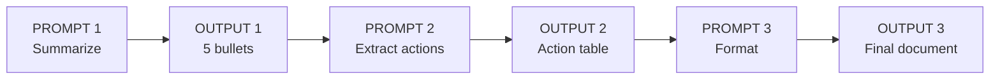
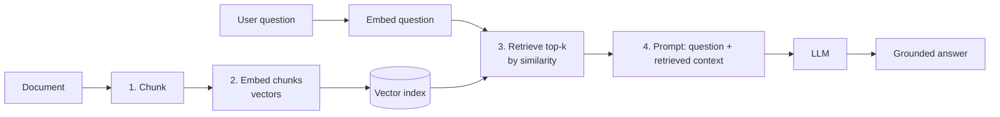

# UNIT 4 — Prompt Engineering Techniques 🧩

> **Artificial Intelligence with Prompt Engineering (DI05016011)** · **9 hrs · 20% weightage**
> **Covers syllabus sections:** 4.1 Prompting Techniques (chain-of-thought, prompt chaining, self-consistency, ReAct) · 4.2 Step-by-step reasoning prompts · 4.3 Prompt Engineering for Tasks (summarization, content, code, QA, translation) · 4.4 Retrieval Augmented Generation
> **Related practicals:** [P07](../practicals/writeups/P07_chain_of_thought_prompt_chaining.md), [P08](../practicals/writeups/P08_task_based_prompt_engineering.md), [P11](../practicals/writeups/P11_document_qa_basic_rag.md)

---

## 🧭 Chapter Roadmap

This is the "advanced weapons" chapter — the techniques that turn a chat toy into a reliable tool. 20% weight. Exams love: **define + example** for CoT, chaining, self-consistency, ReAct; **prompt design for a task**; and **RAG concept + pipeline**. The four techniques and five task recipes are all "short-note" material.

| # | Concept | Exam importance | Code demo |
|---|---------|-----------------|-----------|
| 4.1 | Chain-of-Thought prompting | ★★★★★ | P07 |
| 4.2 | Step-by-step reasoning prompts | ★★★★ | P07 |
| 4.3 | Prompt chaining | ★★★★★ | P07 |
| 4.4 | Self-consistency | ★★★★ | P07 |
| 4.5 | ReAct prompting | ★★★★ | P12 |
| 4.6 | Task: summarization | ★★★★ | P08 |
| 4.7 | Task: content generation | ★★★★ | P08 |
| 4.8 | Task: code generation | ★★★★ | P08, P09 |
| 4.9 | Task: question answering | ★★★ | P11 |
| 4.10 | Task: language translation | ★★★ | — |
| 4.11 | RAG concept & pipeline | ★★★★★ | P11 |

### Learning outcomes — after this unit you can:
1. Define **chain-of-thought** prompting, name its origin paper, and give a worked example.
2. Explain **step-by-step reasoning prompts** (a relaxed form of CoT).
3. Define **prompt chaining**, draw the pipeline, and list its benefits.
4. Define **self-consistency** and **ReAct** with one-line examples.
5. Design a prompt for each task: summarization, content, code, QA, translation.
6. Explain **RAG** — the 4-step pipeline and why it reduces hallucination.
7. Apply it all in P07 (CoT + chaining), P08 (task prompts), P11 (RAG).

---

## 4.1 Prompting Techniques ⭐⭐

### 4.1.1 Chain-of-Thought (CoT) Prompting ⭐⭐⭐

**Definition:** asking the model to **reason step by step** before giving the final answer. The intermediate reasoning "chain" makes the model's logic visible and measurably improves accuracy on arithmetic, logic, and multi-step problems.

```
Prompt: A notebook costs ₹45. Riya buys 4 notebooks and a pen for ₹27.
        She pays ₹500. How much change? Think step by step.
Output:
  Step 1: cost of notebooks = 4 × 45 = ₹180
  Step 2: total = 180 + 27 = ₹207
  Step 3: change = 500 − 207 = ₹293
  Answer: ₹293
```

| Without CoT | With CoT |
|---|---|
| Answers directly (can be silently wrong) | Shows each step (errors are visible & fixable) |
| Skips arithmetic | Forces explicit arithmetic |
| Unreliable on multi-step tasks | Much higher accuracy on such tasks |

**Origin:** *"Chain-of-Thought Prompting Elicits Reasoning in Large Language Models"* (Wei et al., 2022).

> ⚠️ **Exam note:** CoT is a **prompting** technique — no training is involved; it works by changing what the model is asked to do.

### 4.1.2 Prompt Chaining ⭐⭐⭐

**Definition:** splitting a complex task into **smaller sequential prompts**, where the output of each prompt becomes the input of the next.



**Benefits (memorize):**
1. **Focused prompts** — each step has one job, so instructions don't conflict.
2. **Testable steps** — a bad step is fixed in isolation.
3. **Reusable steps** — swap or reorder steps for new pipelines.
4. **Cheaper** — each step sees only its small input, not the whole document.

**Example:** summarize a report → extract action items ("Who | What | By when") → format as a handover document. (Worked fully in P07.)

### 4.1.3 Self-Consistency Prompting ⭐⭐

**Definition:** run the **same CoT prompt multiple times** (with varied sampling) and take the **majority answer**.

```
Run 1: "…Answer: ₹293"
Run 2: "…Answer: ₹293"
Run 3: "…Answer: ₹250"   ← outlier
Majority answer: ₹293
```
- **Why it works:** the correct reasoning path is usually the most probable, so it shows up more often than wrong paths.
- **Cost:** N runs = N× tokens (a deliberate trade of cost for accuracy).
- **Origin:** *"Self-Consistency Improves Chain of Thought Reasoning in Language Models"* (Wang et al., 2022).

### 4.1.4 ReAct Prompting ⭐⭐

**Definition:** **Rea**soning + **Act**ing — the model interleaves thinking ("I need X") with **tool actions** (search, code, calculator, API) and observes results, in a loop, until it answers.

```
Thought: I need the current temperature of Ahmedabad.
Action : search("Ahmedabad temperature today")
Observation: 34°C, partly cloudy
Thought: That answers the question.
Answer : The current temperature is 34°C.
```
- **Why it matters:** gives the model access to live/external data → grounds answers, reduces hallucination.
- **Examples:** agentic systems like AutoGPT and CrewAI (Unit 5 §5.6) are built on this pattern.

## 4.2 Step-by-Step Reasoning Prompts ⭐

**Definition:** any prompt that explicitly asks the model to proceed in ordered steps ("First… then… finally…") — a more structured, softer form of CoT.

```
Prompt: To write this essay, first outline 3 arguments, then expand each to a
        paragraph, then write a conclusion. Show the outline before the essay.
```

**Why it works:** it imposes **structure on generation**, so the model follows a plan instead of free-associating. Use CoT for *reasoning* tasks; use step-by-step instructions for *procedural* tasks (writing, planning, building).

## 4.3 Prompt Engineering for Tasks ⭐⭐

Five task recipes (syllabus §4.3) — know the prompt structure for each.

### 4.3.1 Text Summarization
```
Instruction : Summarize the text below for a busy manager.
Constraints : 4 bullets ≤20 words each; keep all numbers & dates; end with
              the main conclusion.
Input data  : {article}
```
**Trap to avoid:** "summarize this" without data → the model invents or drifts. Always paste the text.

### 4.3.2 Content Generation
```
Instruction : Write a 500-word blog post titled "…".
Context     : Audience = 18-year-old engineering students; tone = friendly, no hype.
Structure   : Hook → 5 numbered sections with one example each → risks box → CTA.
```
**Trap to avoid:** generic blog filler — structure + audience + word count are the fixes (P08).

### 4.3.3 Code Generation
```
Instruction : Write a Python function flatten(nested).
Input/output example : [[1,[2,3]],[4]] → [1,2,3,4]
Edge cases : empty list; strings inside; one level deep.
Style      : type hints, docstring, 3 assert tests.
```
**Trap to avoid:** trusting unrun code — always execute and test (P09's golden rule).

### 4.3.4 Question Answering
```
Instruction : Answer the question using ONLY the given document.
Constraint  : If the answer is absent, reply "Not found in the document."
Input data  : {document or retrieved excerpts}
```
**Trap to avoid:** the model answering from memory → grounding constraints (this is RAG's prompt half, P11).

### 4.3.5 Language Translation
```
Instruction : Translate the following to Gujarati.
Context     : Formal register; keep technical terms in English where standard.
Input data  : {source text}
```
**Trap to avoid:** translation *plus commentary* — "translate only, no notes".

**Recipe summary table (memorize):**
| Task | Key instruction | Must-add | Format |
|---|---|---|---|
| Summarize | "Summarize…" | data + what to keep | bullets / N lines |
| Content | "Write…" | audience + structure | H1, sections, CTA |
| Code | "Write a function…" | I/O example + edge cases | code + tests |
| QA | "Answer from…" | grounding source | short answer |
| Translate | "Translate…" | register + language | text only |

## 4.4 Retrieval Augmented Generation (RAG) ⭐⭐⭐

### 4.4.1 Concept of RAG

**Definition:** Retrieval Augmented Generation (RAG) is an architecture that **retrieves relevant information from an external knowledge source** and passes it to the LLM as **context**, so the model's answer is **grounded** in real documents instead of its training memory.



**Why RAG matters:**
- **Reduces hallucination** — the model answers from the retrieved text (P04's fix in action).
- **Domain answers** — the model can discuss documents it never trained on.
- **Fresh data** — swap the document; no retraining (cheap).
- **Traceable** — you know *which* passages the answer came from.

**Original paper:** *"Retrieval-Augmented Generation for Knowledge-Intensive NLP Tasks"* (Lewis et al., 2020).

### 4.4.2 Using External Knowledge Sources

| Aspect | Detail |
|---|---|
| **Sources** | PDFs, web pages, internal manuals, chat history, vector databases |
| **Chunking** | Split source into overlapping passages (~200–500 chars) |
| **Embedding** | Convert chunks to vectors (embedding model, or cheap hashed n-grams like P11) |
| **Retrieval** | Rank chunks by **cosine similarity** with the question vector; take top-k |
| **Prompt** | "Answer ONLY from these excerpts…" + excerpts + question |
| **Limits** | Retrieval quality caps answer quality; stale/biased sources propagate |

> ⚠️ **Exam trap:** RAG ≠ search. Search returns raw documents; RAG *grounds generation* — the LLM *writes* the answer from the retrieved passages. Also: RAG and prompt chaining both break problems into steps, but chaining splits *the task* into prompts; RAG splits *the knowledge* into retrievable chunks.

---

## 🧠 Deep-Dive Topics

### Deep Dive A: CoT with and without examples (zero-shot vs few-shot CoT)
- **Zero-shot CoT:** just append "Think step by step" — cheap, usually works.
- **Few-shot CoT:** provide a fully worked example ("A buys 2 pens at ₹10… → Step1, Step2…") before the real question — more reliable on hard problems.
Use zero-shot CoT first, escalate to few-shot CoT when the answer is still wrong.

### Deep Dive B: Chaining vs CoT — when to use which
| Situation | Technique |
|---|---|
| Single reasoning problem (math, logic) | CoT (+ self-consistency) |
| Long multi-stage deliverable (report, app, article) | Prompt chaining |
| Needs live data or tool calls | ReAct |
| Model lacks your document's facts | RAG |
CoT makes one step *transparent*; chaining makes many steps *independent*; RAG makes knowledge *external*; ReAct makes actions *possible*.

### Deep Dive C: RAG's retrieval math in 30 seconds
Embed every chunk and the question as vectors. Score each chunk by **cosine similarity** = how aligned the two vectors are (1 = identical direction). Take the top-k scores and paste those chunks into the prompt. P11 implements this with hashed character n-grams (offline) so the whole pipeline runs without downloads.

---

## 🚀 Beyond the Textbook (what most classes won't tell you)

1. **CoT is not magic; it's scratch paper.** The model is just as likely to write a wrong chain as a right one — but with the chain you can *see* and correct it, and self-consistency filters out the wrong chains statistically.
2. **Chaining is the ancestor of "agents".** AutoGPT/CrewAI (Unit 5) are essentially prompt chains where the model chooses the next step and calls tools — the ReAct loop is chaining *with autonomy*.
3. **RAG's bottleneck is retrieval, not the LLM.** If the wrong chunks are retrieved, even the best model fails. "Garbage in, garbage out" applies to chunks.
4. **Task recipes transfer across models.** The summarization/code/translation recipes work on ChatGPT, Gemini, and Claude alike — models differ in defaults, not prompt grammar.
5. **Memory aid for the four techniques:** **"C-C-S-R"** → **C**hain-of-Thought, **C**haining, **S**elf-consistency, **R**eAct. For the five tasks: **"S-C-C-Q-T"** → **S**ummarize, **C**ontent, **C**ode, **Q**A, **T**ranslate.

---

## 🎯 High-Yield Exam Topics (likely GTU-style — no PYQ papers exist yet)

1. **Define chain-of-thought prompting with an example.** (4/7)
2. **What is prompt chaining? Explain its benefits with a diagram.** (7)
3. **What is self-consistency prompting?** (3/4)
4. **What is ReAct prompting? Give an example.** (4)
5. **Differentiate CoT, chaining, self-consistency, and ReAct.** (4/7)
6. **Design a prompt for text summarization / content generation / code generation.** (4/7)
7. **Design a prompt for question answering / translation.** (4)
8. **Explain step-by-step reasoning prompts.** (3/4)
9. **What is RAG? Explain its working with a diagram.** (7)
10. **How does RAG reduce hallucinations?** (4)
11. **Compare RAG with plain prompting / with search.** (4)
12. **Short note: external knowledge sources in RAG.** (3/4)

### ✅ Solved model answers (exam style)

**Q. (7 marks) Explain chain-of-thought prompting and prompt chaining with examples.**
> **Chain-of-Thought (CoT):** asking the model to reason step by step before giving the final answer, making its logic visible. Example: "A notebook costs ₹45. Riya buys 4 notebooks and a pen for ₹27 and pays ₹500. How much change? Think step by step." The model writes: "Step 1: 4×45 = ₹180; Step 2: 180+27 = ₹207; Step 3: 500−207 = ₹293; Answer: ₹293." CoT improves accuracy on arithmetic and logic problems because the model is forced to show each step, so errors are visible. It was introduced by Wei et al. (2022). **Prompt chaining:** splitting a complex task into sequential prompts where each output feeds the next prompt. Example: (1) "Summarize this report into 5 bullets", (2) "Extract action items as Who/What/By-when from these bullets", (3) "Format these as a handover document." Benefits: each step is focused and testable, errors are fixed in one step, and small prompts cost fewer tokens. CoT makes a single step transparent; chaining makes a whole task modular.

**Q. (4 marks) What is RAG? How does it reduce hallucination?**
> **RAG (Retrieval Augmented Generation)** is an architecture that retrieves relevant passages from an external knowledge source and supplies them to the LLM as context before generation. Pipeline: (1) **chunk** the document into overlapping passages; (2) **embed** each chunk into a vector; (3) on a question, embed it and **retrieve** the top-k most similar chunks by cosine similarity; (4) **generate** an answer from the prompt "answer ONLY from these excerpts" plus the retrieved text. It reduces hallucination because the model answers from **grounded, supplied text** instead of recalling (or inventing) facts from training memory. It also lets models discuss documents they never saw, needs no retraining, and makes answers traceable. Example: a chatbot for a 200-page college handbook retrieves the relevant rule before answering, instead of guessing.

**Q. (4 marks) Design a prompt for text summarization and one for code generation.**
> **Summarization:** "Act as an editorial assistant. Summarize the text below for a busy manager. Use exactly 4 bullets of at most 20 words each. Keep all numbers, dates, and names. End with a one-sentence conclusion. {paste the text}." The key design choices are supplying the input data, fixing length/format, and saying what to keep. **Code generation:** "Write a Python function `flatten(nested)` that flattens a nested list. Example: `[[1,[2,3]],[4]]` → `[1,2,3,4]`. Handle empty lists and strings inside. Use type hints and a docstring, and write 3 assert statements for edge cases." The key choices are the function signature, an input→output example, edge cases, and demanded style/tests. Both prompts use the four components: instruction, context, input data, output format.

---

## ✍️ Practice Problems (self-test — answers upside-down)

1. Which technique: (a) run the same prompt 3× and take the majority; (b) split a task into sequential prompts; (c) interleave thinking and tool calls; (d) "think step by step"?
2. Order the RAG pipeline steps.
3. Give one reason prompt chaining is cheaper than one giant prompt.
4. For a "chat with your PDF" app, which technique is essential and why?
5. Write a translation prompt that forbids commentary.
6. Why does self-consistency cost more tokens?

<details>
<summary>📌 Model solutions</summary>

1. (a) self-consistency; (b) prompt chaining; (c) ReAct; (d) chain-of-thought.
2. Chunk → embed chunks → embed question → retrieve top-k → prompt with context → generate.
3. Each step's prompt only contains that step's small input (e.g., the 5 bullets, not the whole report), so fewer tokens per call.
4. **RAG** — chunking + retrieval lets the model answer from your document's text, which is too long for a single prompt and outside its training data.
5. "Translate the following to Gujarati in a formal register. Output the translation only — no explanations, no notes. {text}"
6. Self-consistency runs the CoT prompt N times, so the total tokens (and API cost) are N times a single run.
</details>

---

## 📖 Glossary of Key Terms

| Term | Definition |
|---|---|
| **Chain-of-Thought (CoT)** | Prompting the model to reason step by step before the answer |
| **Step-by-step reasoning** | Instructions that force ordered, visible steps |
| **Prompt chaining** | Sequential prompts; each output feeds the next |
| **Self-consistency** | Run CoT N times; take the majority answer |
| **ReAct** | Interleaving Reasoning and Action (tool calls) in a loop |
| **RAG** | Retrieval Augmented Generation — grounding answers with retrieved text |
| **Chunk** | Small overlapping passage used as the retrieval unit |
| **Embedding** | Vector of numbers capturing a text's meaning |
| **Cosine similarity** | Score of vector alignment used to rank chunks |
| **Vector index** | Store of chunk embeddings for fast retrieval |
| **Grounding** | Constraining the model to supplied sources |
| **In-context learning** | Adapting to examples/prompt content without weight updates |
| **Top-k** | The k most similar retrieved chunks |
| **Knowledge source** | External text (docs, PDFs, web) RAG retrieves from |

---

## 🔗 Curated Resources (per concept)

**Technique papers (official/classic — cited in exams)**
- "Chain-of-Thought Prompting Elicits Reasoning in Large Language Models" (Wei et al., 2022): https://arxiv.org/abs/2201.11903
- "Self-Consistency Improves Chain of Thought Reasoning" (Wang et al., 2022): https://arxiv.org/abs/2203.11171
- "ReAct: Synergizing Reasoning and Acting in Language Models" (Yao et al., 2022): https://arxiv.org/abs/2210.03629
- "Retrieval-Augmented Generation for Knowledge-Intensive NLP Tasks" (Lewis et al., 2020): https://arxiv.org/abs/2005.11401

**Guides**
- DAIR.AI — techniques: https://www.promptingguide.ai/techniques
- DAIR.AI — RAG / applications: https://www.promptingguide.ai/applications
- OpenAI cookbook (RAG patterns): https://cookbook.openai.com
- Google — grounding / RAG with Gemini: https://ai.google.dev/gemini-api/docs/grounding

**Practical tie-ins**
- [P07](../practicals/writeups/P07_chain_of_thought_prompt_chaining.md) — worked CoT + chaining examples
- [P08](../practicals/writeups/P08_task_based_prompt_engineering.md) — 3 task prompts + optimization checklists
- [P11](../practicals/writeups/P11_document_qa_basic_rag.md) — runnable RAG pipeline (offline)

---

## 🎥 Video Study Guide (YouTube)

> Don't like reading? Me neither. This is your **structured video path** for the whole unit — better than the syllabus because it tells you *exactly what to search* and *what to watch first*, in a sensible order. Everything below is search keywords (they never rot like links do) + channels you can trust.

### 🧑‍🎓 Step 0 — Pick your learning style

| Style | You learn best by | Your path through this unit |
|---|---|---|
| 🎧 **Listener** | short, clear explainers | Watch 1 explainer per topic from the table below (3–8 min each) |
| 🛠️ **Builder** | writing code yourself | Run [P07](../practicals/writeups/P07_chain_of_thought_prompt_chaining.md) then [P11](../practicals/writeups/P11_document_qa_basic_rag.md) and break them |
| 🔧 **Tinkerer** | experimenting & demos | Reproduce the CoT math example and a 3-step chain in any chatbot |
| 🧠 **Deep Diver** | full theory, "why" | Read the 4 arxiv papers (titles + abstract at least) and watch paper explainers |
| 🧭 **Explorer** | breadth & curiosity | Watch "RAG explained" and "what are AI agents" explainers first |
| 🎓 **Academic** | exam marks | Watch revision videos, then grind the High-Yield Topics above |

### 🎬 Step 1 — Watch by topic (search these on YouTube)

| Topic | YouTube search keywords (copy-paste ready) | Best channels | Style served |
|---|---|---|---|
| Chain-of-Thought | `chain of thought prompting explained` · `chain of thought reasoning example` · `cot prompting llm` | AI Explained, IBM Technology, DeepLearning.AI | 🎧 + 🧠 |
| Step-by-step reasoning | `step by step prompting technique` · `reasoning prompts llm` | AI Jason, Data School | 🛠️ Builder |
| Prompt chaining | `prompt chaining explained` · `llm prompt chaining example` · `chaining prompts workflow` | AI Jason, DeepLearning.AI, Data School | 🛠️ + 🧭 |
| Self-consistency | `self consistency prompting` · `majority voting llm reasoning` | AI Explained, Machine Learning Street Talk | 🧠 Deep Diver |
| ReAct | `react prompting explained` · `react agents llm reasoning acting` | AI Explained, Two Minute Papers, LangChain (official) | 🧠 + 🛠️ |
| Task prompts (summarize/code/translate) | `prompt engineering for summarization` · `prompt for code generation llm` · `translation prompts llm` | OpenAI (official), Google for Developers, Keras | 🎓 Academic |
| RAG concept | `retrieval augmented generation explained` · `what is rag llm` · `rag in 5 minutes` | IBM Technology, Two Minute Papers, AI Explained | 🧭 + 🎧 |
| RAG deep dive (vector DBs) | `rag pipeline vector database` · `embedding retrieval rag tutorial` · `build rag python` | freeCodeCamp, LangChain (official), Tech With Tim | 🛠️ Builder |
| Whole-unit revision | `advanced prompting techniques full guide` · `prompt engineering techniques one shot` · `rag full course` | freeCodeCamp, Gate Smashers, Neso Academy | 🎓 Academic |

### 🎬 Step 2 — Full playlists (for Deep Divers & Academics)

1. **"Andrej Karpathy — intro to LLMs / how they reason"** — the honest technical view of what CoT does and doesn't do.
2. **"freeCodeCamp — Retrieval Augmented Generation full course"** — the definitive hands-on RAG playlist, mirroring P11.
3. **"LangChain (official) — RAG & agents tutorials"** — production patterns that P12's architecture previews.

### 🎬 Step 3 — Proof you got it (5 min)

- Solve a 3-step math word problem with a chatbot *without* "think step by step", then *with* it — note the difference.
- Run [P11](../practicals/writeups/P11_document_qa_basic_rag.md) `--mock` and identify each of the 4 RAG stages in its output.
- Explain to a friend why RAG beats "please remember my PDF" — the word *grounding* should appear.

---

*Next: [UNIT 5 — AI Application Development: Generative AI & Agentic AI](./UNIT_5_AI_Application_Development_Agentic_AI.md)*
