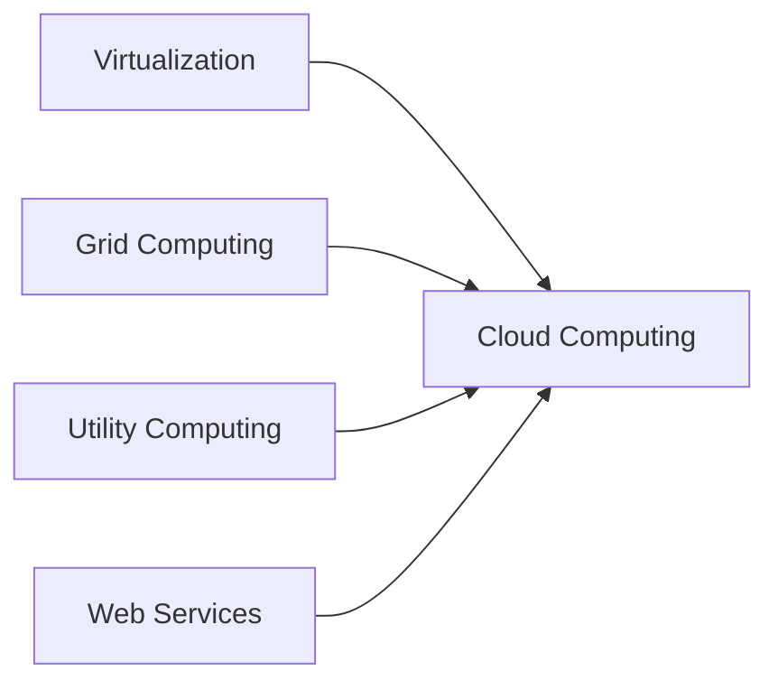
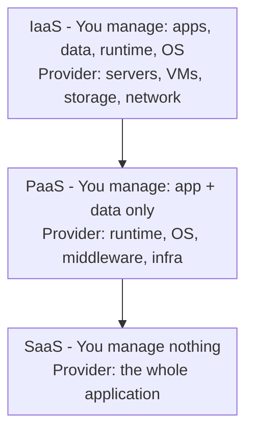
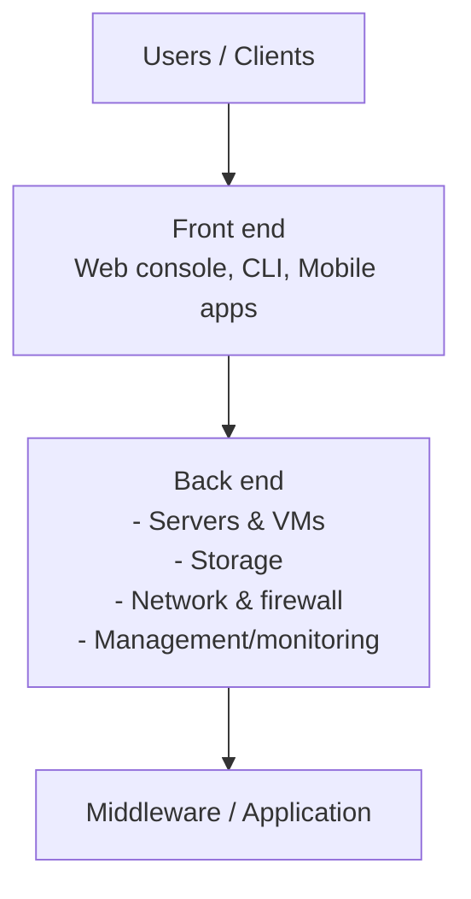

# UNIT 1 — Introduction to Cloud Computing ☁️

> **Cloud and Data Center Technology (DI05016031)** · **4 hrs · 8% weightage**
> **Covers syllabus sections:** 1.1 Trends in Computing · 1.2 Define Cloud Computing · 1.3 Cloud Service Models · 1.4 Deployment Models · 1.5 Desired Features · 1.6 Pros & Cons · 1.7 Applications
> **Related practicals:** [P01](../practicals/writeups/P01_openstack_architecture.md), [P02](../practicals/writeups/P02_cloud_organization_rbac.md)

---

## 🧭 Chapter Roadmap

This unit is the **foundation chapter** — every later unit (virtualization, data centers, security, emerging tech) builds on the service/deployment model vocabulary defined here. It carries the smallest weightage (8%), but it is where **every 3-mark "define" question** in the exam comes from.

| # | Concept | Exam importance | Related |
|---|---------|-----------------|---------|
| 1.1 | Trends: Distributed → Grid → Cluster → Utility → Cloud | ★★★ | — |
| 1.2 | Definition + characteristics of cloud computing | ★★★★★ | — |
| 1.3 | IaaS / PaaS / SaaS (+ cloud architecture) | ★★★★★ | P01 (OpenStack = IaaS) |
| 1.4 | Private / Community / Public / Hybrid deployment | ★★★★ | P02 (org & RBAC) |
| 1.5 | Desired features of a cloud | ★★★ | — |
| 1.6 | Pros and cons of cloud computing | ★★★ | — |
| 1.7 | Applications of cloud computing | ★★★ | — |

### Learning outcomes — after this unit you can:
1. Trace computing from distributed systems to cloud computing and position cloud among them.
2. State the NIST definition of cloud computing and its **five essential characteristics**.
3. Explain and contrast **IaaS, PaaS, SaaS** with examples (and justify why IaaS is the base).
4. Distinguish **public, private, community, hybrid** deployment models and pick one for a business.
5. List desired cloud features, advantages, disadvantages, and applications.

---

## 1.1 Trends in Computing

```
Distributed Computing
   └─► Grid Computing          (heterogeneous, geographically spread, batch)
   └─► Cluster Computing       (homogeneous, same LAN, single job)
   └─► Utility Computing       (pay-per-use metered computing like electricity)
   └─► Cloud Computing         (virtualized, elastic, internet-delivered services)
```

| Paradigm | What it is | Strengths | Weaknesses |
|---|---|---|---|
| **Distributed computing** | Multiple autonomous computers coordinate via messages to act as one system | Scalability, fault tolerance | Complexity, consistency issues (CAP) |
| **Grid computing** | *Heterogeneous* resources, often across *organizations/geographies*, work on *large batch jobs* (scientific computing) | Massive aggregated compute for HPC | Scheduling complexity, unreliable nodes, no central control |
| **Cluster computing** | Group of *homogeneous* servers on a *local network*, tightly coupled, run *one* job (load balancing/HA) | Cheap, high throughput, single management point | Single-site, limited scaling beyond a room |
| **Utility computing** | Computing resources offered **pay-per-use**, metered like electricity/water | Costs reflect usage | Provider dependency, metering standards |
| **Cloud computing** | Virtualized, **on-demand**, internet-delivered pool of resources that can be **scaled elastically** | Everything below (on-demand, elastic, pay-as-you-go) | Internet dependency, security/ownership concerns |

> 💡 **Beyond the textbook:** Cloud computing did not appear from nowhere — it combines *grid* (resource sharing) + *utility* (pay-per-use) + *virtualization* (Unit 2) + *web services*. The phrase "cloud" itself comes from telecom network diagrams where the internet was drawn as a cloud.

## 1.2 Define Cloud Computing

### 1.2.1 The definition (memorize the NIST one — PYQ gold) ⭐⭐

> **NIST SP 800-145:** "Cloud computing is a model for enabling **ubiquitous, convenient, on-demand network access** to a **shared pool of configurable computing resources** (e.g., networks, servers, storage, applications, and services) that can be **rapidly provisioned and released with minimal management effort or service provider interaction**."

Examiner-friendly short version: *Cloud computing = on-demand delivery of IT resources (compute, storage, databases, apps) over the internet, with pay-as-you-go pricing.*

### 1.2.2 Five essential characteristics (NIST) ⭐⭐
| # | Characteristic | Meaning | Example |
|---|---|---|---|
| 1 | **On-demand self-service** | User provisions resources without human interaction | Spin up a VM via web console in 2 min |
| 2 | **Broad network access** | Capabilities available over the network via standard devices | Access from phone, laptop, office |
| 3 | **Resource pooling** | Provider pools resources; multi-tenant; location-independent | Virtual machines share host servers |
| 4 | **Rapid elasticity** | Scale out/in quickly, often automatically | Autoscale web servers during festival traffic |
| 5 | **Measured service** | Usage is metered (storage, CPU, bandwidth) and billed | Pay per GB-month, per vCPU-hour |

### 1.2.3 Roots of cloud computing
1. **Virtualization** (Unit 2) — decouples hardware from software → pooled, movable workloads.
2. **Grid computing** — large-scale distributed resource sharing.
3. **Utility computing** — metered pay-as-you-go delivery.
4. **Web services / SOA** — standard interfaces (REST) make services composable.
5. **Data center automation** (Unit 3) — cheap, software-managed server farms at scale.



## 1.3 Cloud Service Model ⭐⭐

### 1.3.1 The SPI model (SaaS / PaaS / IaaS)


| Layer | You (customer) manage | Provider manages | Examples |
|---|---|---|---|
| **IaaS** (Infrastructure) | Apps, data, runtime, **OS**, middleware | Servers, hypervisors, storage, network, VMs | AWS EC2, Azure VMs, **OpenStack Nova** (P01), GCP Compute Engine |
| **PaaS** (Platform) | **Application + data only** | Runtime (Java/Python/Node), OS, middleware, infra | Google App Engine, AWS Elastic Beanstalk, Heroku, Azure App Service |
| **SaaS** (Software) | *Nothing* (just use it) | The whole application + everything below | Gmail, Google Drive, Office 365, Salesforce, Zoom |

**Justification (PYQ favourite — s_24 Q.1(b)): "IaaS is the base of the cloud computing structure":**
- IaaS is the **foundation layer**: PaaS is built *on top of* IaaS infrastructure, and SaaS apps run on IaaS/PaaS. Without the virtualized compute/storage/network pool that IaaS provides, no platform or software service can exist.
- IaaS exposes the primitive resources (CPU, RAM, disk, net) that both PaaS and SaaS consume; it is the "layer zero" of every cloud stack.

### 1.3.2 Cloud architecture (w_24 Q.1(b))

**Front end:** the user interface the client sees (browser dashboard, mobile app, CLI).
**Back end:** the cloud infrastructure — physical servers, virtualization layer, storage, network, security & management software, governed by a service-level agreement (SLA, Unit 5). The two communicate over the network.

## 1.4 Deployment Models ⭐

| Model | Who uses it | Access | Example |
|---|---|---|---|
| **Public cloud** | Open to general public / multiple tenants | Provider-owned, over the internet | AWS, Azure, GCP |
| **Private cloud** | Single organization | Dedicated infra (on-prem or hosted), VPN/intranet | OpenStack private cloud (P01) |
| **Community cloud** | A *specific community* sharing interests (banks, universities) | Shared by the member orgs | G-cloud for a consortium of banks |
| **Hybrid cloud** | An organization combining public + private | Workloads move between both | Private core + public burst for peak load |

> ⚠️ **Exam trap:** "Community cloud" is often forgotten. It is *between* public and private — shared by several organizations with common concerns. Also remember **multi-cloud** (using several public providers) and **distributed/edge cloud** are modern additions beyond the classic four.

**Which model for a mid-size company?** (s_26 Q.1(b)) — typically **hybrid**: keep sensitive data/apps in a **private** cloud (compliance, control), burst non-critical, variable workloads to **public** cloud (cost, elasticity). Mid-size firms usually lack the capex for a fully private cloud but have sensitive data they do not want 100% in public.

## 1.5 Desired Features of a Cloud (w_24 Q.1(a)) ⭐
1. **On-demand self-service** — provision without contacting the vendor.
2. **Elasticity** — scale up/down automatically with demand.
3. **Pay-as-you-go / measured service** — pay only for what you use.
4. **Ubiquitous access** — reachable from anywhere over standard internet.
5. **Virtualization support** — resources are virtualized and pooled (Unit 2).
6. **Reliability & high availability** — redundant infrastructure, SLAs.
7. **Security & isolation** — multi-tenant isolation, encryption (Unit 5).
8. **Automated management & monitoring** — APIs, dashboards, billing analytics.
9. **Service Level Agreements (SLA)** — guaranteed uptime/performance metrics (Unit 5).

## 1.6 Pros and Cons of Cloud Computing ⭐

| Pros (advantages) | Cons (disadvantages) |
|---|---|
| **Cost saving** — no upfront hardware; OPEX instead of CAPEX | **Vendor lock-in** — migrating between clouds is hard (s_24 Q.3-b-alt) |
| **Elasticity/scalability** — match capacity to demand | **Internet dependency** — outage = no service |
| **Accessibility** — anywhere, any device | **Security/privacy** — data on someone else's servers |
| **Disaster recovery** — cheap replication & backups (s_26 Q.4-b) | **Limited control** — provider decisions affect you |
| **Automatic updates & maintenance** | **Regulatory/compliance** concerns |
| **Global reach** — deploy near users worldwide | **Hidden costs** — egress fees, over-provisioning |

## 1.7 Applications of Cloud Computing (s_25 Q.1(a)) ⭐
1. **Software as a Service apps** — email (Gmail), office suites (Google Docs, Office 365), CRM (Salesforce).
2. **Storage & backup** — Dropbox, Google Drive, AWS S3 (P07), MinIO (P09).
3. **Web hosting & content delivery (CDN)** — static sites, media streaming (Netflix, YouTube).
4. **Big data & analytics** — data lakes, ML training (s_24 Q.5-b, Unit 6).
5. **IoT & mobile backends** — device ingestion, app APIs (Unit 6).
6. **Disaster recovery & business continuity** — replicated backups, failover sites.
7. **Dev & test environments** — CI/CD pipelines, ephemeral test VMs.
8. **E-commerce & online gaming** — elastic web tiers + autoscaling.

---

## 🧠 Deep-Dive Topics

### Deep Dive A: "Justify: IaaS is the base of cloud computing" — full answer chain
1. Cloud stack is **layered**: IaaS → PaaS → SaaS.
2. IaaS virtualizes and pools **physical resources** (servers, storage, networking) via a hypervisor (Unit 2) and exposes them as on-demand VMs.
3. PaaS providers build platforms **on IaaS** (e.g., Google App Engine runs on GCP's compute/storage).
4. SaaS vendors run applications **on PaaS/IaaS** — e.g., Office 365's backend runs on Azure IaaS.
5. Therefore *everything above depends on IaaS*: no IaaS, no PaaS/SaaS. Removing "the base" collapses the structure. **Answer: IaaS is layer zero.**

### Deep Dive B: Private vs public vs hybrid — the 4-factor decision
- **Cost** (capex vs opex), **compliance** (data residency/regulations), **elasticity** (spiky vs predictable load), **control** (customization needs).
- Rule of thumb: *predictable + sensitive → private; spiky + non-sensitive → public; both → hybrid.*

### Deep Dive C: The economics — rent vs buy (s_24 Q.2-b)
For a small/midcap company renting beats buying: a ₹2–5 lakh server sits idle at 10% utilization but costs 100%; cloud VMs can be **scaled to zero** at night, so you pay for ~10% of the equivalent hardware. Also no maintenance staff, no power/cooling, no depreciation risk.

---

## 🚀 Beyond the Textbook (what most classes won't tell you)

1. **NIST SP 800-145 is the exam's "definition" source** — even though GTU doesn't print it, its five characteristics are what examiners expect in a 7-mark "service models in detail" answer.
2. **Serverless (Unit 6) is often called "FaaS"** — technically a PaaS-level abstraction where you don't even manage the app runtime; be careful distinguishing PaaS vs FaaS in exams.
3. **Multi-cloud and cloud repatriation** — many firms *move workloads back* from public cloud (cost surprises) → the "cloud washing" caveat examiners love in pros/cons answers.
4. **Community cloud example to quote:** a group of government agencies sharing a certified cloud for legal reasons — remember "shared compliance burden".
5. **IaaS is cheapest raw unit but "most work"** — a classic exam question: which service model gives maximum control? (IaaS), minimum control? (SaaS).

---

## 📝 PYQ Map — UNIT 1 (all available papers)

| Paper | Q. | Topic | Marks |
|---|---|---|---|
| **Summer 2024** | Q.1(a) | Define Cloud computing; explain any two advantages | 3 |
| | Q.1(b) | List cloud service models; justify IaaS is the base | 4 |
| **Winter 2024** | Q.1(a) | Define cloud computing and state its desirable features | 3 |
| | Q.1(b) | Draw and explain cloud architecture | 4 |
| | Q.1(c) | Explain the cloud service models in detail | 7 |
| **Summer 2025** | Q.1(a) | Define Cloud computing; explain applications | 3 |
| | Q.2(b) | Explain IaaS in detail | 4 |
| | Q.2(b)-alt | Explain PaaS in detail | 4 |
| **Winter 2025** | Q.1(a) | Define Cloud computing; explain any two advantages | 3 |
| | Q.1(b) | Explain Software as a Service (SaaS) | 4 |
| **Summer 2026** | Q.1(a) | Define Cloud computing; explain any two features | 3 |
| | Q.1(b) | Public/private/hybrid deployment; best for mid-size company | 4 |

> 📂 Papers live in [`pyq/cdct/`](../../pyq/cdct/): `s_24.pdf`, `w_24.pdf`, `s_25.pdf`, `w_25.pdf`, `s_26.pdf`.

### ✅ Solved PYQ answers (UNIT 1)

**Q. (w_24 Q.1a / s_26 Q.1a, 3 marks) — Define cloud computing and state its features**
> Cloud computing is an **on-demand delivery model** of computing resources (servers, storage, databases, applications) **over the internet** on a **pay-as-you-go** basis. It is "ubiquitous, convenient, on-demand network access to a shared pool of configurable computing resources that can be rapidly provisioned and released with minimal management effort." **Features:** (1) on-demand self-service, (2) broad network access, (3) resource pooling, (4) rapid elasticity, (5) measured service. (Add two advantages: cost saving by replacing capex with opex; elastic scaling to match demand.)

**Q. (s_24 Q.1b, 4 marks) — List cloud service models. Justify: IaaS is the base of cloud computing**
> The three cloud service models are **IaaS** (virtualized compute/storage/network delivered as VMs — AWS EC2, OpenStack), **PaaS** (a managed runtime where you deploy only code — Google App Engine), and **SaaS** (fully hosted applications — Gmail, Office 365). **Justification:** IaaS is the foundation layer — it virtualizes and pools the physical hardware and exposes raw resources via APIs. PaaS is built *on top of* IaaS, and SaaS applications run on IaaS/PaaS platforms. Without the IaaS base no higher layer can exist — it is "layer zero" of the cloud stack.

**Q. (w_25 Q.1b, 4 marks) — Explain SaaS**
> Software-as-a-Service delivers **complete applications** over the internet, managed end-to-end by the provider. The customer manages nothing — no servers, no OS, no runtime — and simply uses the software via a browser/app, typically on a **subscription** basis. Multi-tenancy lets many customers share one application instance while data is isolated. **Examples:** Gmail, Google Drive, Microsoft Office 365, Salesforce, Zoom. **Advantages:** zero installation/maintenance, access from anywhere, automatic updates; **disadvantages:** least control, vendor lock-in, data resides with the provider.

**Q. (w_24 Q.1c, 7 marks) — Explain the cloud service models in detail**
> **IaaS (Infrastructure as a Service):** provider gives virtualized hardware — VMs, virtual storage, virtual networks — through APIs. Customer installs OS, middleware, and apps, and pays per vCPU-hour/GB-month. *Example:* AWS EC2, OpenStack. *You manage:* OS and above. **PaaS (Platform as a Service):** provider additionally supplies the **runtime environment** (Java/.NET/Python runtimes, databases, middleware); the customer writes and deploys only the **application + data**. *Example:* Google App Engine, Heroku. **SaaS (Software as a Service):** the entire application, its data, and infrastructure are provided and maintained by the vendor; the customer only uses the software through a web interface. *Example:* Gmail, Salesforce. **Comparison:** control decreases and convenience increases from IaaS → PaaS → SaaS; each layer is built on the one below (IaaS is the base).

**Q. (s_26 Q.1b, 4 marks) — Define public, private, hybrid; best model for a mid-size company**
> **Public cloud** — resources owned and operated by a third-party provider, shared by many tenants over the internet (AWS, Azure). **Private cloud** — infrastructure dedicated to a single organization, on-premises or hosted, with the greatest control and security. **Hybrid cloud** — a combination of public and private where workloads and data can move between them. **Best for a mid-size company: hybrid.** It lets the company keep **sensitive/compliance-critical data in the private cloud** while using the **public cloud's elasticity and lower cost** for variable, non-critical workloads (e.g., burst web traffic), balancing cost, control, and security without the full capex of an exclusively private cloud.

**Q. (s_25 Q.1a, 3 marks) — Define Cloud computing and explain its applications**
> Cloud computing is the **delivery of on-demand IT resources (compute, storage, databases, software) over the internet with pay-as-you-go pricing**, from a shared, elastic pool of virtualized resources. **Applications:** (1) email/SaaS office suites (Gmail, Office 365), (2) cloud storage and backup (Drive, S3), (3) web hosting and CDN/media streaming (Netflix, YouTube), (4) big-data analytics and machine learning, (5) IoT and mobile backends, (6) disaster recovery and business continuity, (7) dev/test environments in CI/CD, (8) e-commerce and online gaming.

---

## ✍️ Practice Problems (self-test — answers hidden)

1. State the **NIST definition** of cloud computing and list the five essential characteristics.
2. Draw the cloud architecture (front end / back end) and label 4 components.
3. Justify: *"IaaS is the base of the cloud computing structure."*
4. Differentiate SaaS and PaaS with two examples each.
5. A mid-size firm wants compliance for patient data but cheap scaling for a public website. Which deployment model(s)? Why?
6. List any three desired features of a cloud (w_24 Q.1a) and any three applications (s_25 Q.1a).

<details>
<summary>📌 Model solutions</summary>

1. NIST SP 800-145: "a model for enabling ubiquitous, convenient, on-demand network access to a shared pool of configurable computing resources ... rapidly provisioned and released with minimal management effort." Five characteristics: on-demand self-service, broad network access, resource pooling, rapid elasticity, measured service.
2. **Front end:** browser dashboard / CLI / mobile app. **Back end:** servers & VMs, storage system, network & firewall, management/monitoring software. Communication over the network; governed by SLA.
3. IaaS virtualizes and pools hardware (compute/storage/network). PaaS platforms are built on IaaS; SaaS apps run on IaaS/PaaS. No IaaS → no upper layers. IaaS is layer zero.
4. PaaS: you manage app+data only; provider manages runtime/OS/infra (Google App Engine, Heroku). SaaS: you manage nothing; provider manages the whole app (Gmail, Office 365).
5. **Hybrid cloud** — private for patient data (compliance/control), public for the website's variable traffic (elasticity/cost).
6. Features: on-demand self-service, elasticity, pay-as-you-go, ubiquitous access, virtualization, reliability/SLA, security/isolation. Applications: SaaS email, cloud storage, web hosting/CDN, big data/ML, IoT backends, disaster recovery, dev/test, e-commerce.
</details>

---

## 📖 Glossary of Key Terms

| Term | Definition |
|---|---|
| **Cloud computing** | On-demand, network-delivered, pay-as-you-go computing resources from a shared elastic pool |
| **NIST SP 800-145** | The standard definition + 5 characteristics of cloud computing |
| **On-demand self-service** | Provision resources automatically without human interaction |
| **Rapid elasticity** | Scale resources up/down quickly, often automatically |
| **Measured service** | Metered, billed usage (CPU-hours, GB-months) |
| **Resource pooling** | Multi-tenant sharing of physical resources |
| **IaaS** | Infrastructure as a Service — virtualized hardware (VMs) |
| **PaaS** | Platform as a Service — managed runtime for your app |
| **SaaS** | Software as a Service — fully hosted application |
| **Public cloud** | Provider-owned, multi-tenant, internet-delivered |
| **Private cloud** | Dedicated to one organization |
| **Community cloud** | Shared by a group of organizations with common interests |
| **Hybrid cloud** | Public + private combined; workloads move between them |
| **Multi-tenancy** | Many customers share infrastructure while data is isolated |
| **Vendor lock-in** | Difficulty migrating away from one provider |
| **SLA** | Service Level Agreement — guaranteed uptime/performance metrics |
| **CAPEX / OPEX** | Capital expenditure vs operational expenditure |

---

## 🔗 Curated Resources (per concept)

**Definition & NIST**
- NIST SP 800-145 (the definition): https://csrc.nist.gov/pubs/sp/800-145/final
- NIST cloud computing glossary: https://csrc.nist.gov/glossary

**Service & deployment models**
- AWS "What is cloud computing": https://aws.amazon.com/what-is-cloud-computing/
- Azure cloud service models: https://learn.microsoft.com/en-us/azure/architecture/guide/technology-choices/compute-decision-tree
- GCP cloud computing basics: https://cloud.google.com/learn/what-is-cloud-computing

**IaaS platforms (links to P01/P02)**
- OpenStack docs: https://docs.openstack.org
- AWS IAM / Organizations (P02): https://docs.aws.amazon.com/iam/

**Books (GTU syllabus)**
- Buyya, Broberg & Goscinski, *Cloud Computing: Principles and Paradigms* (Wiley, ISBN 978-0-470-88799-8)
- Buyya, Vecchiola & Selvi, *Mastering Cloud Computing* (McGraw-Hill, ISBN 978-1-25-902995-0)
- Velte, Velte & Elsenpeter, *Cloud Computing: A Practical Approach* (McGraw-Hill, ISBN 978-0-07-068351-8)

**Videos (high yield)**
- *Cloud Computing Explained* — Simply Explained
- *What is IaaS, PaaS, SaaS?* — IBM Technology / ByteByteGo
- *Public vs Private vs Hybrid Cloud* — IBM Technology

---

## 🎥 Video Study Guide (YouTube)

> Search keywords (they never rot like links) + trusted channels, in a sensible watching order.

### 🧑‍🎓 Step 0 — Pick your learning style
| Style | You learn best by | Your path through this unit |
|---|---|---|
| 🎧 **Listener** | short, clear explainers | Watch 1 explainer per topic from the table (3–8 min each) |
| 🛠️ **Builder** | doing it yourself | Do [P01](../practicals/writeups/P01_openstack_architecture.md) & [P02](../practicals/writeups/P02_cloud_organization_rbac.md) after the theory |
| 🧠 **Deep Diver** | the "why" | Watch the NIST definition deep-dives + full playlists |
| 🎓 **Academic** | exam marks | Grind the PYQ map above after the videos |

### 🎬 Step 1 — Watch by topic
| Topic | YouTube search keywords | Best channels |
|---|---|---|
| Intro to cloud computing | `what is cloud computing` · `cloud computing explained in 5 minutes` | Simply Explained, IBM Technology, Fireship |
| NIST definition & characteristics | `nist cloud computing definition five characteristics` | IBM Technology, edureka |
| Service models | `iaas paas saas explained with example` · `cloud service models bytebytego` | ByteByteGo, IBM Technology |
| Deployment models | `public private hybrid cloud deployment models` · `which cloud deployment model` | IBM Technology, Simplilearn |
| Cloud architecture | `cloud computing architecture front end back end` · `cloud architecture diagram explained` | Gate Smashers, edureka |
| Pros/cons & economics | `cloud computing advantages disadvantages` · `cloud vs on-premise cost` | IBM Technology, code with Chris |
| Unit revision (exam) | `cloud computing unit 1 diploma` · `cloud computing 10 minute recap` | Gate Smashers, Neso Academy |

### 🎬 Step 2 — Full playlists (Deep Divers & Academics)
1. *Cloud Computing* — Neso Academy (systematic university-style series).
2. *Cloud Computing Full Course* — freeCodeCamp / Edureka.
3. NPTEL *Cloud Computing* (GTU-recommended): https://archive.nptel.ac.in/courses/106/105/106105167/

### 🎬 Step 3 — Proof you got it (5 min)
- Define cloud computing in one sentence without looking.
- Justify IaaS-as-the-base to a friend in 3 bullet points.
- Pick a deployment model for a clinic + a gaming company and defend it.

---

*Next: [UNIT 2 — Virtualization and Hypervisors](./UNIT_2_Virtualization_and_Hypervisors.md)*
