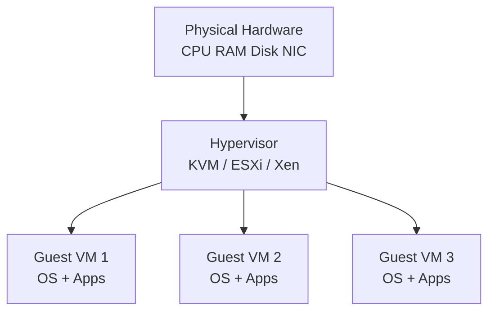

# UNIT 2 — Virtualization and Hypervisors 🖥️

> **Cloud and Data Center Technology (DI05016031)** · **9 hrs · 20% weightage**
> **Covers syllabus sections:** 2.1 Cloud Virtualization · 2.2 Characteristics of Virtualization · 2.3 Types (Hardware/Software/Full/Para/Partial/OS-level) · 2.4 Hypervisors & VMs · 2.5 Virtualization of Clusters & DC Automation
> **Related practicals:** [P03](../practicals/writeups/P03_install_virtualbox_linux_vm.md), [P04](../practicals/writeups/P04_desktop_virtualization_chrome_remote_desktop.md), [P10](../practicals/writeups/P10_docker_first_container.md)

---

## 🧭 Chapter Roadmap

This unit (20%) is **the heaviest-hitting theory chapter** — hypervisors, full/para/partial virtualization and VM management are the most repeated PYQ topics in the entire subject. The practicals P03 (VirtualBox + Linux VM) and P04 (desktop virtualization) are your hands-on anchors; P10 (Docker) proves **OS-level virtualization**.

| # | Concept | Exam importance | Related |
|---|---------|-----------------|---------|
| 2.1 | What is virtualization (in the cloud) | ★★★★★ | P03 |
| 2.2 | Characteristics of virtualization | ★★★★ | — |
| 2.3 | Types: HW/SW/Full/Para/Partial/OS-level | ★★★★★ | P10 (OS-level) |
| 2.4 | Hypervisors Type 1 & 2; VMs | ★★★★★ | P03, P04 |
| 2.5 | Cluster virtualization & DC automation | ★★★ | — |

### Learning outcomes — after this unit you can:
1. Define virtualization and state its characteristics.
2. List and explain the **six types** of virtualization (with pros/cons).
3. Differentiate **full, para, partial** and **hardware vs software** virtualization.
4. Define hypervisors; contrast **Type 1 vs Type 2**; explain how VMs are created and managed.
5. Explain **OS-level virtualization** (containers) and virtualization of clusters.

---

## 2.1 Introduction to Cloud Virtualization ⭐

**Virtualization** is the technique of creating a **virtual (software-based) version of a physical resource** — servers, storage, network, OS — so that multiple isolated "virtual machines" run on one physical machine. The **hypervisor** sits between hardware and guests, allocating CPU/RAM/disk/network on demand.

**Why the cloud needs it (root of everything):** virtualization is what makes **resource pooling, elasticity, and multi-tenancy** (Unit 1) possible. Without it, every tenant would need a dedicated physical server.

## 2.2 Characteristics & Overview of Virtualization ⭐

1. **Partitioning** — one physical machine is split into multiple isolated virtual machines.
2. **Isolation** — a crash/attack in one VM does not affect others.
3. **Encapsulation** — the entire VM (disk, config, memory) is a set of files → portable, backup-able, clone-able.
4. **Hardware independence** — guests don't depend on specific vendor hardware (VMs move between hosts).
5. **Resource allocation** — hypervisor dynamically shares/limits CPU, RAM, I/O per VM.
6. **Higher utilization** — consolidates many under-used servers onto one host (reduces cost/energy).
7. **Rapid provisioning** — a new VM boots from an image in minutes, enabling elasticity.

## 2.3 Types of Cloud Virtualization ⭐⭐

| Type | What is virtualized | Example | Best for |
|---|---|---|---|
| **Hardware virtualization** | The entire physical machine (CPU/RAM/devices) into VMs; each guest runs its **own OS** | KVM, VMware ESXi, Xen, VirtualBox | Full cloud IaaS |
| **Software virtualization** | Applications are separated from the OS (app-level isolation); may emulate instructions | JVM (Java), WINE, app sandboxes | Running legacy/incompatible apps |
| **Full virtualization** | Guest OS runs **unmodified**; hypervisor translates every privileged instruction (with HW assist: VT-x/AMD-V) | KVM (with Intel-VT), VMware ESXi | Maximum compatibility |
| **Para-virtualization** | Guest OS is **modified** to call the hypervisor directly (hypercalls) — no emulation overhead | Xen para-virtual guests, Hyper-V | Higher performance for modified kernels |
| **Partial virtualization** | Only *part* of the address space / some instructions are virtualized; guests need modification | Early IBM M44/44X, some memory-partitioning systems | Legacy research/limited use |
| **OS-level virtualization** | The **kernel** is shared; each container is an isolated userspace (own processes/files/net) | **Docker (P10)**, LXC, Linux Containers | Running many lightweight apps on one kernel |

### Full vs Para vs Partial — the exam comparison (w_25 Q.2-b) ⭐⭐
| Criterion | Full | Para | Partial |
|---|---|---|---|
| Guest OS modification | **No** (unmodified) | **Yes** (kernel modified for hypercalls) | Partial modification needed |
| Performance | Good (needs VT-x/AMD-V for speed) | **Best** (direct hypercalls, no trap/emulate) | Moderate |
| Compatibility | Maximum | Only supported (patched) OSes | Limited set of operations |
| Implementation | Binary translation + HW assist | Hypercall interface | Selective instruction trapping |
| Examples | KVM, VMware ESXi, VirtualBox | Xen (para mode), Hyper-V | Research/early systems |

### Hardware vs Software virtualization (s_24 Q.2-c-alt, s_25 Q.1-c, w_24 Q.2-b-alt) ⭐
- **Hardware virtualization** — the hypervisor virtualizes the *whole machine*: multiple guest OSes run as VMs (hardware-assisted with VT-x/AMD-V). This is what cloud IaaS is built on.
- **Software virtualization** — isolates *applications* from the OS, e.g., a **JVM** lets Java apps run on any platform; **WINE** runs Windows apps on Linux. No full OS per guest; lightweight but app-specific.

### OS-level virtualization (w_25 Q.2-b-alt) — containers ⭐
- All containers **share the host kernel**; the container runtime (Docker) gives each container its own filesystem, processes, network, and PID namespace.
- **Pros:** seconds to start, tiny images (MB), high density (100s per host), low overhead.
- **Cons:** only Linux/Windows kernels (no other OS), weaker isolation than VMs.
- → **P10 proves this:** the `p10-cdct-site` container shares the host kernel yet runs its own app stack.

## 2.4 Hypervisors and Virtual Machines ⭐⭐

### 2.4.1 Hypervisor definition
A **hypervisor (Virtual Machine Monitor, VMM)** is the software layer that creates, runs, and manages virtual machines by allocating physical resources and (for full virtualization) translating privileged instructions.

| Type | Runs on | Speed | Examples |
|---|---|---|---|
| **Type 1 (bare-metal/native)** | Directly **on the hardware** (no host OS) | Highest | KVM (Linux kernel module), VMware ESXi, Microsoft Hyper-V, Xen |
| **Type 2 (hosted)** | **On top of an existing OS** (host OS provides device drivers) | Lower (OS adds overhead) | Oracle VirtualBox, VMware Workstation/Player, Parallels |

> ⚠️ **Exam nuance:** KVM is unusual — it is a *kernel module* of Linux, so it is Type 1 in effect (Linux acts as the hypervisor), even though people sometimes call it Type 1.5. VirtualBox is the canonical **Type 2** example (→ **P03** installs it on Windows).

### 2.4.2 Components of a virtualization environment (s_24 Q.2-a) ⭐
1. **Host machine** — the physical hardware being virtualized.
2. **Hypervisor (VMM)** — allocates resources, manages VMs (CPU/MEM scheduling, I/O emulation).
3. **Guest virtual machines** — each with virtual CPU, RAM, virtual disk, virtual NIC.
4. **Virtual hardware devices** — virtual CPU cores, virtual RAM, `.vdi/.vmdk` disks, virtual adapters.
5. **Virtual network** — virtual bridges/switches (NAT, bridged, host-only).
6. **Management tools** — `virt-manager`, VMware vCenter, VirtualBox Manager, OpenStack Nova (P01).

### 2.4.3 Creating and managing VMs (w_24 Q.2-c-alt, s_25 Q.5-c-alt) ⭐
**Create (steps, mirroring P03):**
1. Download an **OS image (ISO)** and create a **virtual disk** (size, format: VDI/VMDK/QCOW2).
2. Define the VM spec: **vCPU count, RAM, disk, network** (e.g., 2 vCPU, 4 GB, 20 GB).
3. Attach the ISO → **boot → install OS** → configure user/network → remove media.
4. Install **Guest Additions / virtio drivers** for display, clipboard, shared folders.

**Manage:**
- **Start/stop/pause/resume**, **snapshot** (save state to roll back), **clone** (copy a VM), **migrate** (live-move to another host), **resize** (add CPU/RAM/disk), **attach/detach** devices, **backup** the VM files.

## 2.5 Virtualization of Clusters and Data Center Automation ⭐
- **Cluster virtualization:** a *cluster* is a group of servers managed as one. Virtualization lets VMs be the "units" of the cluster → VMs **migrate between physical nodes** (live migration), failed hosts' VMs **restart elsewhere** (HA), and load is **balanced** across hosts (DRS).
- **Data center automation (Unit 3):** hypervisor APIs enable *scripted provisioning* — new VMs are created/removed programmatically (this is what OpenStack Nova + IaC do, P01/P02). Virtualization is the automation enabler: no physical cabling/OS installs per workload.

---

## 🧠 Deep-Dive Topics

### Deep Dive A: The full/para trap-and-emulate story
Full virtualization originally *trapped every privileged instruction* and emulated it in software — slow. Hardware assist (**Intel VT-x / AMD-V**) moved this into the CPU. Para-virtualization instead *changes the guest kernel* to issue **hypercalls** directly to the hypervisor — no trapping at all, hence the best performance, at the cost of a modified kernel. Answering *"which is faster?"* → **para** for compute; full is now competitive with HW assist and is far more compatible.

### Deep Dive B: Why OS-level virtualization beats VMs on density
A VM needs a full guest OS (GBs RAM). A container shares the host kernel and only adds app + libraries (MBs). On a 16 GB server: ~4 VMs vs ~50–100 containers. This is why cloud-native platforms (Kubernetes, Unit 6) standardize on containers.

### Deep Dive C: Hypervisor security (s_26 Q.2-b)
1. **Hypervisor compromise = compromise of ALL guests** — the VMM is the root of trust.
2. **VM escape / breakout** — a guest bug escapes into the hypervisor (CVE-2021-3156-style attacks are rare but critical).
3. **Side-channel attacks** — shared CPU caches (Spectre/Meltdown) leak data across tenants.
4. **Misconfiguration** — exposed management ports, weak creds, unpatched hypervisors.
**Mitigations:** patch promptly, microcode updates, lock down management plane, separate admin network, KVM hardened via SELinux/AppArmor, keep guests up-to-date.

---

## 🚀 Beyond the Textbook (what most classes won't tell you)

1. **"Virtualization ≠ emulation."** Full virtualization with HW assist still executes guest code *natively* most of the time; **emulation** (QEMU TCG) interprets every instruction — a different (slower) beast. Don't mix the terms in exams.
2. **VirtualBox is Type 2, but cloud IaaS uses Type 1** — the practical P03 uses VirtualBox for *teaching*, but production clouds (P01 OpenStack) use KVM. Say that in viva.
3. **Containers are "OS-level virtualization"** — remember the Docker P10 link when the examiner asks which virtualization type containers use.
4. **Live migration** (moves a running VM without downtime) is the superpower of cluster virtualization — vMotion/KVM live-migrate uses pre-copy memory sync. Great "beyond syllabus" example.
5. **The "1 VM per service" anti-pattern** — virtualized sprawl (thousands of idle VMs) is why containerization happened. Good for pros/cons answers.

---

## 📝 PYQ Map — UNIT 2 (all available papers)

| Paper | Q. | Topic | Marks |
|---|---|---|---|
| **Summer 2024** | Q.2(a) | List & explain components of a virtualization environment | 3 |
| | Q.2(c) | Explain hypervisor with its types | 7 |
| | Q.2(a)-alt | Advantages of virtualization | 3 |
| | Q.2(b)-alt | Explain Application-level virtualization | 4 |
| | Q.2(c)-alt | Hardware virtualization in cloud | 7 |
| **Winter 2024** | Q.2(a) | Define virtualization; give characteristics | 3 |
| | Q.2(b) | Para vs full virtualization | 4 |
| | Q.2(c) | Define hypervisors; Type 1 & Type 2 | 7 |
| | Q.2(a)-alt | Types of virtualization; explain one | 3 |
| | Q.2(b)-alt | Hardware and software virtualization | 4 |
| | Q.2(c)-alt | Process of creating & managing VMs | 7 |
| **Summer 2025** | Q.1(c) | Hardware & software virtualization in detail | 7 |
| | Q.1(c)-alt | Cloud virtualization; characteristics | 7 |
| | Q.5(c) | Hypervisors in detail | 7 |
| | Q.5(c)-alt | Virtual Machines; steps to create & manage | 7 |
| **Winter 2025** | Q.2(a) | Characteristics of virtualization | 3 |
| | Q.2(b) | Differentiate Full, Para, Partial virtualization | 4 |
| | Q.2(c) | Hypervisor with its types | 7 |
| | Q.2(a)-alt | Advantages of virtualization | 3 |
| | Q.2(b)-alt | OS-level virtualization | 4 |
| | Q.2(c)-alt | Virtualization of clusters | 7 |
| **Summer 2026** | Q.2(a) | Define virtualization; explain any two characteristics | 3 |
| | Q.2(b) | Security aspects of using a hypervisor | 4 |
| | Q.2(c) | Differentiate full and para virtualization | 7 |
| | Q.2(a)-alt | Explain any three advantages of virtualization | 3 |
| | Q.2(b)-alt | Explain software virtualization | 4 |
| | Q.2(c)-alt | Explain Type II hypervisor | 7 |

### ✅ Solved PYQ answers (UNIT 2)

**Q. (w_24 Q.2a / s_25 Q.1c-alt, 3–7 marks) — Define virtualization and give its characteristics**
> Virtualization is the creation of **software-based virtual versions** of physical resources (servers, storage, network) so that **multiple isolated virtual machines** run on one physical host under a **hypervisor**. **Characteristics:** (1) *Partitioning* — physical resources are split among VMs; (2) *Isolation* — VMs are independent; a fault in one never crashes another; (3) *Encapsulation* — a whole VM is a set of files, making it portable, cloneable and backup-able; (4) *Hardware independence* — guests do not bind to vendor hardware and can migrate between hosts; (5) *Dynamic resource allocation* — the hypervisor shares/limits CPU, RAM, and I/O per VM; (6) *Higher utilization* — many under-used physical servers consolidate into one host, cutting cost and power.

**Q. (w_25 Q.2b, 4 marks) — Differentiate Full, Para, and Partial virtualization**
> **Full virtualization:** guest OS runs *unmodified*; the hypervisor intercepts privileged instructions (with hardware assist VT-x/AMD-V); maximum compatibility; examples KVM, ESXi. **Para-virtualization:** the guest kernel is *modified* to replace privileged instructions with **hypercalls** to the hypervisor directly; fastest execution (no trap-and-emulate); examples Xen, Hyper-V; only patched OSes supported. **Partial virtualization:** only *selected* parts of the system (e.g., memory address space) are virtualized; guests still need modification; rarely used in modern clouds; historical/limited. In short: **no modification (full) → full modification of kernel (para) → partial modification (partial)**, with performance improving as more of the guest cooperates with the hypervisor.

**Q. (w_24 Q.2c / s_24 Q.2c, 7 marks) — Define hypervisors; explain Type 1 and Type 2**
> A **hypervisor (VMM)** is the software that creates, runs and manages virtual machines, allocating CPU, RAM, storage and I/O, and (in full virtualization) translating privileged instructions. **Type 1 (bare-metal):** runs *directly on hardware* with no host OS, giving highest performance and density; used in data centers/clouds. *Examples:* KVM, VMware ESXi, Microsoft Hyper-V, Xen. **Type 2 (hosted):** runs *on top of an existing operating system*, which provides drivers and services, adding overhead; used on desktops/student labs. *Examples:* Oracle VirtualBox, VMware Workstation/Player, Parallels. **Comparison:** Type 1 = performance + security + scale (the cloud standard); Type 2 = ease of installation + flexibility for desktop virtualization (e.g., P03 installs a Linux VM on Windows via VirtualBox).

**Q. (s_26 Q.2b, 4 marks) — Are there security aspects involved with using a hypervisor?**
> Yes. (1) **Hypervisor compromise** — if the VMM is hacked, *all guest VMs* are exposed (single point of trust). (2) **VM escape/breakout** — a malicious guest exploits a hypervisor bug to execute on the host or other VMs. (3) **Side-channel attacks** — shared CPU caches can leak data across co-located tenants (Spectre/Meltdown). (4) **Management-plane risks** — exposed console/API ports, weak credentials, unpatched hypervisor. **Mitigations:** apply security patches and CPU microcode updates, harden and segregate the management network, enforce least-privilege admin access, use SELinux/AppArmor to confine the hypervisor, and keep guest OSes patched.

**Q. (w_25 Q.2b-alt, 4 marks) — Explain OS-level virtualization**
> OS-level virtualization shares a **single host kernel** among all "guests" (containers); each container is an isolated userspace with its own filesystem, processes, network and PID namespace, but no separate OS. The container runtime (e.g., **Docker**, P10) manages namespaces and cgroups. **Advantages:** very fast start-up (seconds), tiny images (MBs), high density (hundreds per host), low overhead and easy portability. **Disadvantages:** all containers must use the host's kernel (cannot run a Windows container on Linux), and isolation is weaker than full VMs. This is exactly the technology behind cloud-native platforms like Kubernetes (Unit 6).

**Q. (w_24 Q.2c-alt, 7 marks) — Explain the process of creating and managing virtual machines**
> **Creating a VM:** (1) choose the guest OS and download its **ISO** image; (2) create a **virtual disk** (choose format VDI/VMDK/QCOW2 and size, e.g., 20 GB); (3) define the VM **specification** — CPU cores (e.g., 2), RAM (e.g., 4 GB), network adapter (NAT/bridged); (4) attach the ISO and **boot** the VM; (5) run the OS installer (language, disk, user account); (6) **remove the installation media** and reboot; (7) install **Guest Additions/virtio drivers** for display, clipboard and shared folders. **Managing:** start/stop/pause/resume, take **snapshots** to roll back to clean states, **clone** for templates, **live-migrate** between hosts, **resize** CPU/RAM/disk, attach/detach virtual devices, and **back up** the VM files (a VM is just a file set).

---

## ✍️ Practice Problems (self-test — answers hidden)

1. State the definition of virtualization and any four characteristics.
2. Compare full, para and partial virtualization on: guest modification, performance, compatibility.
3. "OS-level virtualization" — which practical proves it, and what is shared between containers?
4. Give two Type-1 and two Type-2 hypervisors with one-line justification.
5. Why is a hypervisor a "single point of trust"? List two attack classes and two mitigations.
6. Sequence the steps to create a VM with 2 vCPU / 4 GB / 20 GB disk.

📌 Model solutions

1. Virtualization = creating software-based virtual versions of physical resources so multiple isolated VMs run on one host under a hypervisor. Characteristics: partitioning, isolation, encapsulation, hardware independence, dynamic resource allocation, higher utilization.
2. Full: unmodified guest, HW-assisted, maximum compatibility. Para: modified guest kernel (hypercalls), best performance, only patched OSes. Partial: selected resources virtualized, partial modification, limited use.
3. P10 (Docker). Containers share the host **kernel**; each gets its own filesystem/processes/network namespaces; isolated via namespaces + cgroups.
4. Type 1: KVM (bare-metal kernel module), VMware ESXi (runs directly on hardware), Microsoft Hyper-V. Type 2: Oracle VirtualBox, VMware Workstation/Player (run on a host OS).
5. All guests trust the VMM; if it is compromised all guests are exposed. Attacks: VM escape/breakout, side-channel (cache) attacks, management-plane attacks. Mitigations: patching, hardened management network, least privilege, confinement via SELinux/AppArmor.
6. ISO download → virtual disk (20 GB) → spec (2 vCPU, 4 GB, NAT) → attach ISO → boot/install → remove media → reboot → install Guest Additions.

---

## 📖 Glossary of Key Terms

| Term | Definition |
|---|---|
| **Virtualization** | Software-based virtual versions of physical resources (multiple VMs on one host) |
| **Hypervisor / VMM** | Software layer that creates and manages VMs |
| **Type 1 hypervisor** | Bare-metal hypervisor (KVM, ESXi, Hyper-V, Xen) |
| **Type 2 hypervisor** | Hosted hypervisor (VirtualBox, VMware Workstation) |
| **Full virtualization** | Unmodified guest OS; HW-assisted translation |
| **Para-virtualization** | Modified guest kernel using hypercalls |
| **Partial virtualization** | Only part of the system is virtualized |
| **OS-level virtualization** | Shared kernel; isolated containers (Docker, LXC) |
| **Hardware virtualization** | Whole machine → VMs (cloud IaaS) |
| **Software virtualization** | App-level isolation (JVM, WINE) |
| **Guest OS / Host OS** | OS inside a VM / OS running the hypervisor |
| **Snapshot** | Saved VM state enabling rollback |
| **Live migration** | Moving a running VM between hosts with no downtime |
| **Hypercall** | Direct call from a para-virtual guest to the hypervisor |
| **VM escape** | Guest breaking out into the hypervisor/host |
| **cgroups / namespaces** | Kernel mechanisms isolating containers |

---

## 🔗 Curated Resources (per concept)

**General virtualization**
- VirtualBox manual: https://www.virtualbox.org/manual/
- KVM docs: https://www.linux-kvm.org/page/Documents
- VMware "What is virtualization": https://www.vmware.com/topics/glossary/content/virtualization.html

**Hypervisors**
- Xen project: https://xenproject.org
- Microsoft Hyper-V docs: https://learn.microsoft.com/en-us/virtualization/hyper-v-on-windows/

**OS-level virtualization / containers**
- Docker docs: https://docs.docker.com
- LXC docs: https://linuxcontainers.org

**Security (s_26 Q.2-b)**
- KVM security page: https://www.linux-kvm.org/page/Security
- NIST virtualization security: https://csrc.nist.gov/publications/detail/sp/800-125/final

**Books (GTU syllabus)**
- Sosinsky, *Cloud Computing Bible* (Wiley, ISBN 978-0-470-90356-8) — virtualization chapters
- Buyya, Vecchiola & Selvi, *Mastering Cloud Computing* (McGraw-Hill) — Ch. on virtualization

**Videos (high yield)**
- *What is a Hypervisor?* — IBM Technology
- *Virtualization Explained* — IBM Technology / PowerCert
- *Containers vs VMs* — TechWorld with Nana

---

## 🎥 Video Study Guide (YouTube)

> Search keywords + trusted channels, in watching order.

### 🧑‍🎓 Step 0 — Pick your learning style
| Style | You learn best by | Your path through this unit |
|---|---|---|
| 🎧 **Listener** | short explainers | 1 video per topic below (4–10 min each) |
| 🛠️ **Builder** | doing it | Do [P03](../practicals/writeups/P03_install_virtualbox_linux_vm.md) and [P10](../practicals/writeups/P10_docker_first_container.md) |
| 🧠 **Deep Diver** | the "why" | Full KVM/Xen deep-dives + hypervisor internals videos |
| 🎓 **Academic** | exam marks | Grind the PYQ map; memorise full vs para tables |

### 🎬 Step 1 — Watch by topic
| Topic | YouTube search keywords | Best channels |
|---|---|---|
| Virtualization intro | `virtualization explained` · `what is virtualization` | IBM Technology, PowerCert |
| Hypervisors | `hypervisor type 1 vs type 2 explained` | IBM Technology, CBT Nuggets |
| Full vs para | `full vs para virtualization` · `paravirtualization explained` | Neso Academy, Gate Smashers |
| OS-level / containers | `containers vs virtual machines` · `how docker works namespaces` | TechWorld with Nana, Fireship |
| VM creation (hands-on) | `install ubuntu virtualbox step by step` | freeCodeCamp, NetworkChuck |
| Cluster/HA & migration | `vmware vMotion live migration` · `cluster HA DRS explained` | VMwareVideos, IBM Cloud |
| Revision (exam) | `virtualization unit 2 diploma` · `hypervisor 10 minute recap` | Gate Smashers, Neso Academy |

### 🎬 Step 2 — Full playlists (Deep Divers & Academics)
1. *Virtualization & Hypervisors* — Neso Academy / Gate Smashers (university series).
2. *Docker Tutorial* — TechWorld with Nana (finish it; it feeds Unit 6 too).
3. NPTEL *Cloud Computing* (Unit: virtualization): https://archive.nptel.ac.in/courses/106/105/106105167/

### 🎬 Step 3 — Proof you got it (5 min)
- Explain full vs para to a friend using the words "modified kernel" and "hypercall".
- List 3 characteristics of virtualization from memory.
- Tell someone which hypervisor type VirtualBox is and why cloud uses the other.

---

*Next: [UNIT 3 — Data Center Architecture](./UNIT_3_Data_Center_Architecture.md)*
