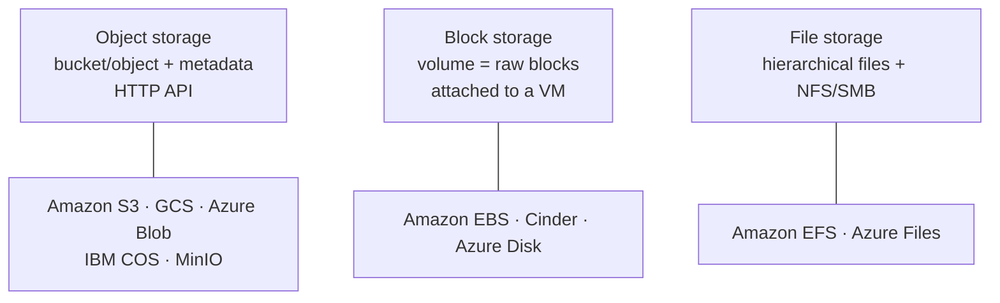
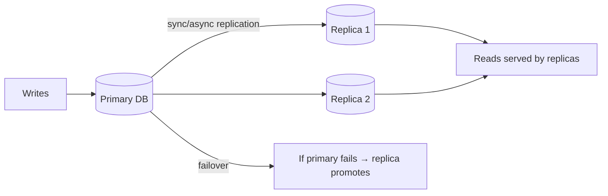

# UNIT 4 — Cloud Storage and Database Services 💾

> **Cloud and Data Center Technology (DI05016031)** · **9 hrs · 20% weightage**
> **Covers syllabus sections:** 4.1 Cloud Storage Solutions (object/block/file, consistency & durability) · 4.2 Cloud Databases (SQL/NoSQL, scaling & replication)
> **Related practicals:** [P06](../practicals/writeups/P06_cloud_databases_comparison.md), [P07](../practicals/writeups/P07_cloud_storage_comparison.md), [P09](../practicals/writeups/P09_minio_secure_object_storage.md)

---

## 🧭 Chapter Roadmap

This unit (20%) is the **storage & database** chapter — hugely PYQ-heavy. Two 7-mark monsters repeat in nearly every paper: **"types of cloud storage"** and **"types of cloud databases"** (SQL vs NoSQL), plus the consistency/durability distinction. P06, P07 and P09 are your practical anchors.

| # | Concept | Exam importance | Related |
|---|---------|-----------------|---------|
| 4.1 | Object vs block vs file storage | ★★★★★ | P07, P09 |
| 4.1 | Data consistency vs durability | ★★★★★ | P07 |
| 4.1 | Storage solutions (S3, GCS, Azure Blob, etc.) | ★★★★ | P07 |
| 4.2 | Cloud databases: SQL vs NoSQL | ★★★★★ | P06 |
| 4.2 | Data scaling & replication | ★★★★ | P06 |

### Learning outcomes — after this unit you can:
1. Define cloud storage and explain **object / block / file** storage with examples.
2. Distinguish **consistency** and **durability** (and justify why each is essential).
3. Compare major storage services (S3, GCS, Azure Blob, IBM COS, MinIO).
4. Explain cloud **database services** and the **SQL vs NoSQL** divide.
5. Explain **data scaling** (vertical/horizontal) and **replication** (HA, read replicas, sharding).

---

## 4.1 Cloud Storage Solutions ⭐⭐

### 4.1.1 The three storage models
| Model | What it stores | How you access it | Ideal for | Examples |
|---|---|---|---|---|
| **Object storage** | Data as **objects** (file + metadata + ID) in **buckets** | HTTP(S) REST / S3 API | Media, backups, data lakes, static sites (huge, unstructured) | **S3, GCS, Azure Blob, IBM COS, MinIO (P09)** |
| **Block storage** | Raw **fixed-size blocks** (volumes) | Attached to a VM like a hard disk (iSCSI/SCSI/NVMe) | OS disks, databases needing low-latency random I/O | AWS EBS, Azure Disk, Cinder (P01) |
| **File storage** | Files in a **hierarchical directory tree** | **NFS / SMB** shares (network mount) | Shared documents, legacy apps, home directories | AWS EFS, Azure Files, NetApp |

### 4.1.2 Consistency and durability ⭐⭐
**Consistency** — *do all readers see the same (latest) data?* **Strong consistency** = every read reflects the latest write; **eventual consistency** = reads may briefly return stale data and converge later. (Funded by the **CAP theorem** — a system can pick at most two of Consistency/Availability/Partition tolerance.)

**Durability** — *is the data safe from loss?* = the probability that data survives failures (disk crash, node loss, region failure) intact. Achieved via **replication** (copies in multiple AZs) and **erasure coding**.

| Criterion | Consistency | Durability |
|---|---|---|
| Question | Is every read the *latest* write? | Is the data *never lost*? |
| Handled by | Replication/sync protocols, quorums | Redundant copies, erasure coding |
| Failure mode | Stale reads, split-brain | Data loss (irrecoverable) |
| Cloud promise | S3/GCS are strongly consistent | 99.999999999% (11 nines) |
| Money-transfer example (s_26 Q.4-b-alt) | Both accounts must reflect the transfer *immediately* | The transfer record must survive forever |

> ⚠️ **Exam trap:** students blur the two. *Durability = survival; consistency = agreement.* A system can be 11-nines durable yet only eventually consistent (e.g., old S3, some NoSQL replicas) — and vice versa.

### 4.1.3 Managed vs unmanaged storage (w_25 Q.4-b)
- **Managed (cloud storage as a service):** provider handles capacity, replication, encryption, lifecycle — you just PUT/GET (S3, GCS, MinIO). Pay per GB/request.
- **Unmanaged:** you provision your own storage (block volumes, self-hosted NAS) and manage RAID, backups, sizing yourself. More control, more work.

### 4.1.4 Major solutions (s_24/s_26 Q.4-a) ⭐
- **Amazon S3** (object), **EBS** (block), **EFS** (file)
- **Google Cloud Storage** (object), **Persistent Disk** (block), **Filestore** (file)
- **Microsoft Azure Blob** (object), **Azure Disk** (block), **Azure Files** (file)
- **IBM Cloud Object Storage**, **MinIO** (self-hosted S3-compatible, P09)
→ Full comparison in [P07](../practicals/writeups/P07_cloud_storage_comparison.md).

## 4.2 Cloud Databases ⭐⭐

### 4.2.1 Database services & their features (s_24/s_26 Q.4-a-alt) ⭐
A **cloud database service** is a database hosted and **managed** by the provider. **Features:** managed provisioning (no install), automated **backups & restore**, **high availability** (multi-AZ failover), **scaling** (vertical/horizontal), **monitoring & patching**, access control/encryption (Unit 5), and pay-per-use pricing. → Full service comparison in [P06](../practicals/writeups/P06_cloud_databases_comparison.md).

### 4.2.2 SQL vs NoSQL ⭐⭐
| Criterion | SQL (relational) | NoSQL |
|---|---|---|
| **Data model** | Tables, rows, fixed schema | Documents/JSON, key-value, wide-column, graph |
| **Schema** | Rigid (migrations needed) | **Flexible** (evolve freely) |
| **Transactions** | **ACID** (strong consistency) | Often **BASE** (eventually consistent) |
| **Scaling** | Vertical + read replicas (hard to shard) | **Horizontal by design** (sharding) |
| **Query** | SQL (joins) | API/map-reduce style |
| **Use cases** | Banking, ERP, e-commerce orders | Real-time apps, IoT, catalogs, caching, analytics |
| **Cloud examples** | **RDS, Cloud SQL, Azure SQL DB, Db2, Oracle ATP** | **MongoDB Atlas, Firebase RTDB** (P06) |

> Remember the practical list P06: RDS / Cloud SQL / Azure SQL / Db2 (SQL) + Firebase RTDB / MongoDB Atlas (NoSQL) + Oracle Autonomous DB (SQL, self-driving).

### 4.2.3 Data scaling and replication (s_24/w_24/s_26 Q.4-c-alt) ⭐⭐
**Scaling**
- **Vertical (scale-up):** bigger VM/CPU/RAM for the single database — easy, limited by max size, downtime to resize.
- **Horizontal (scale-out):** more database nodes — **sharding** splits data by key across nodes (write scaling); **read replicas** serve reads off copies (read scaling).

**Replication**
- **Master–slave / primary–standby:** writes go to primary; copies serve reads / act as failover → **HA + read scaling**.
- **Multi-region replication:** synchronous/async copies in other regions → **durability + DR**.
- **Replication factor:** how many copies exist (e.g., 3 in MongoDB Atlas) → the higher, the more durable.

---

## 🧠 Deep-Dive Topics

### Deep Dive A: "Justify: data consistency is essential in cloud storage" (s_24 Q.4-b)
With a distributed, replicated store, two readers on different replicas could see different values. If a user pays an invoice (debit) and the system shows the balance unchanged, that's an **inconsistency → financial loss / user trust loss**. **Money transfer (s_26 Q.4-b-alt):** both accounts must reflect the debit *and* credit together — if the ledger is inconsistent, a transfer could appear in one account but not the other, breaking correctness. Hence cloud storage must guarantee strong consistency for such transactions (atomicity across replicas), or apply it at the application level (transactions, idempotency).

### Deep Dive B: "Justify: data durability is essential" (s_24 Q.4-b-alt)
Durability is *data survival*. Storage hardware **will fail** (disk MTBF), so the cloud replicates objects across devices and AZs (S3: 11 nines). If durability is absent, one disk/AZ failure **loses customer data forever** — the worst possible cloud failure (no amount of speed/features compensates). **Backup & DR (s_26 Q.4-b):** versioning, lifecycle copies to other regions, and point-in-time restores turn "survive disk loss" into "survive region loss".

### Deep Dive C: BASE vs ACID in one table
| | ACID (SQL) | BASE (NoSQL) |
|---|---|---|
| A | **Atomicity** | **Basically Available** (system always responds) |
| C | **Consistency** | **Soft state** (state may drift over time) |
| I | **Isolation** | **Eventually consistent** (converges) |
| D | **Durability** | (durability still desired!) |

### Deep Dive D: When to shard — worked example
Orders table = 500 GB, single node saturated at write peak. **Option 1 (vertical):** upgrade to a 64-core machine — costly, still one node. **Option 2 (horizontal):** shard on `customer_id` (hash) across 5 nodes → each node 100 GB, writes split 5 ways. **Option 3:** keep a single primary for writes but add 3 **read replicas** for reporting. The best design usually combines sharding + read replicas — the P06 "how to choose" guide captures this.

---

## 🚀 Beyond the Textbook (what most classes won't tell you)

1. **Object storage is NOT a filesystem** — no in-place edits, no directories (prefixes only), no POSIX. That's why file storage (EFS) exists. A classic exam "why three types?" answer.
2. **Erasure coding > replication at scale** — 3 copies = 3× cost; erasure coding (e.g., 6+3 Reed-Solomon) gives ~11 nines at ~1.5× cost. Hyperscalers use both.
3. **"Eventually consistent" still applies to some NoSQL replicas** — while S3/GCS/Blob are all *strongly consistent* now (post-2020), many NoSQL systems keep eventual consistency for latency — hence the CAP trade-off.
4. **Cloud databases are mostly "just managed open-source"** — RDS wraps MySQL/PostgreSQL; Atlas wraps MongoDB. The differentiator is the *managed features*, not the engine. Great for P06 conclusions.
5. **Durability ≠ availability** — you can be durable (data safe) but unavailable (can't reach it during a failover). Exams love this subtle distinction.

---

## 📝 PYQ Map — UNIT 4 (all available papers)

| Paper | Q. | Topic | Marks |
|---|---|---|---|
| **Summer 2024** | Q.4(a) | Define cloud storage; list major solutions | 3 |
| | Q.4(b) | Justify: data consistency is essential in cloud storage | 4 |
| | Q.4(c) | Explain types of cloud databases in detail | 7 |
| | Q.4(a)-alt | Define database services; features | 3 |
| | Q.4(b)-alt | Justify: data durability is essential | 4 |
| | Q.4(c)-alt | Data scaling and replication in detail | 7 |
| **Winter 2024** | Q.4(a) | Define cloud storage; examples | 3 |
| | Q.4(b) | Data consistency vs durability | 4 |
| | Q.4(c) | Types of cloud storage in detail | 7 |
| | Q.4(a)-alt | Define cloud databases; examples | 3 |
| | Q.4(b)-alt | Data scaling and replication | 4 |
| | Q.4(c)-alt | Types of cloud databases | 7 |
| **Summer 2025** | Q.1(b) | Cloud storage solutions; object storage in detail | 4 |
| | Q.3(c) | Types of cloud databases in detail | 7 |
| | Q.3(c)-alt | Data consistency and durability in detail | 7 |
| | Q.4(a) | Role of data scaling | 3 |
| | Q.4(a)-alt | File storage in the cloud | 3 |
| **Winter 2025** | Q.4(a) | Object storage in the cloud | 3 |
| | Q.4(b) | Managed vs unmanaged cloud storage | 4 |
| | Q.4(c) | Durability in cloud computing | 7 |
| | Q.4(a)-alt | Block storage in the cloud | 3 |
| | Q.4(b)-alt | Data scaling with example | 4 |
| | Q.4(c)-alt | Types of cloud databases: SQL & NoSQL | 7 |
| **Summer 2026** | Q.4(a) | Define database services; two features | 3 |
| | Q.4(b) | Justify: backup & DR are essential | 4 |
| | Q.4(c) | Data scaling and replication in detail | 7 |
| | Q.4(a)-alt | Major cloud storage solutions; explain one | 3 |
| | Q.4(b)-alt | Justify: money transfer must be consistent | 4 |
| | Q.4(c)-alt | Types of cloud databases in detail | 7 |

### ✅ Solved PYQ answers (UNIT 4)

**Q. (w_24 Q.4a / s_26 Q.4a-alt, 3 marks) — Define cloud storage. Write examples / list solutions.**
> Cloud storage is a **managed service for storing data in the cloud**, accessed over the internet through APIs or consoles, where the provider handles capacity, replication, encryption and availability, and you **pay per use** (GB-month + requests). It comes in three models: **object storage** (Amazon S3, Google Cloud Storage, Azure Blob, IBM COS, MinIO), **block storage** (Amazon EBS, Azure Disk, Cinder volumes) and **file storage** (Amazon EFS, Azure Files). The S3-style object model is the dominant one for backups, media and data lakes.

**Q. (w_25 Q.4a, 3 marks) — What is object storage in the cloud?**
> Object storage stores data as discrete **objects** inside **buckets**. Each object = **data + metadata** (content type, tags, timestamps) + a **globally unique ID/ETag**, addressed by an HTTP URL (`bucket/key`). There is no hierarchical filesystem and **no in-place modification** — you PUT/GET/DELETE whole objects. It is massively **scalable** (to exabytes), highly **durable** (11 nines via replication/erasure coding), and accessed with the **S3-style REST API**. Examples: Amazon S3, GCS, Azure Blob, IBM COS and the self-hosted **MinIO** (P09). Ideal for media, backups, static websites and data lakes.

**Q. (w_24 Q.4b, 4 marks) — Differentiate data consistency and durability**
> **Consistency** = whether all readers see the **same (latest) data**. Strong consistency means every read reflects the last write; eventual consistency means reads may briefly be stale and then converge. It is a correctness property, handled by replication/consensus and bounded by the **CAP theorem**. **Durability** = whether data is **safe from loss**; the probability that committed data survives disk/node/AZ failures. It is achieved by **replication** and **erasure coding** (e.g., S3's 99.999999999%). Consistency is about *agreement*, durability about *survival*. A store can be durable but only eventually consistent, and a strongly consistent store can still lose data if it isn't durable. Both are essential: consistency keeps money/accounts correct; durability guarantees data is never lost.

**Q. (w_24 Q.4c, 7 marks) — Explain types of cloud storage in detail**
> Cloud storage has three types. **(1) Object storage:** data as objects (data + metadata + ID) in buckets, HTTP/S3 API, no in-place edit; massively scalable and durable — S3, GCS, Azure Blob, IBM COS, MinIO. Used for media, backups, data lakes. **(2) Block storage:** raw fixed-size volumes attached to a VM like a disk; low latency for OS and databases; formatted with a filesystem — EBS, Azure Disk, Cinder. **(3) File storage:** a POSIX-compliant hierarchical filesystem shared over the network via NFS/SMB; multiple VMs mount the same share — EFS, Azure Files. **Choosing:** databases/OS → block; shared documents/legacy → file; huge unstructured data/media/backup → object. Additionally, storage can be **managed** (service does everything) or **unmanaged** (you operate your own volumes), and uses storage **classes/tiers** (hot → cold/archive) to trade cost for access latency (see P07).

**Q. (w_25 Q.4c-alt / s_24 Q.4c, 7 marks) — Types of cloud databases: SQL & NoSQL (in detail)**
> **SQL databases** use tables with **fixed schemas** and the SQL language, guaranteeing **ACID** transactions (Atomicity, Consistency, Isolation, Durability). They scale **vertically** plus with read replicas, and suit strongly consistent transactional apps (banking, ERP, e-commerce). *Cloud examples:* Amazon RDS, Google Cloud SQL, Azure SQL Database, IBM Db2 on Cloud, Oracle Autonomous Database. **NoSQL databases** use flexible models — **document** (JSON; MongoDB Atlas, Firebase RTDB), **key-value** (DynamoDB, Redis), **wide-column** (Cassandra, Bigtable), **graph** (Neptune). They follow **BASE** (basically available, soft state, eventually consistent), have **flexible schemas**, and scale **horizontally by sharding**, suiting high-volume, variable-schema apps (IoT, real-time chat, catalogs, caching). **Choosing (P06 guide):** strong ACID + fixed schema → SQL; flexible schema + huge scale + eventual consistency acceptable → NoSQL.

**Q. (s_24 Q.4c-alt / s_26 Q.4c, 7 marks) — Explain data scaling and replication in detail**
> **Scaling** increases a database's capacity. **Vertical scaling** upgrades the single server (bigger CPU/RAM) — simple but costly and bounded, with resize downtime. **Horizontal scaling** adds nodes: **sharding** partitions data by a shard key across nodes (spreading writes), and **read replicas** serve read traffic from copies. **Replication** copies data to multiple nodes: **primary–standby (master–slave)** — all writes hit the primary, replicas serve reads and take over on failure (**high availability + read scaling**); **synchronous vs asynchronous** replication trade durability/latency; **multi-region replication** adds disaster recovery. **Benefits:** HA (no single point of failure), durability (multiple copies), performance (parallel reads/writes), scalability (grow by adding nodes). **Trade-offs:** more replicas = more cost + eventual-consistency risk if replication is async (see CAP/BASE). Example (s_25 Q.4-b-alt): a 500 GB orders table sharded by `customer_id` across 5 nodes, plus 3 read replicas for analytics, keeps writes and reads scaling while staying available.

---

## ✍️ Practice Problems (self-test — answers hidden)

1. Differentiate object, block and file storage with one example each.
2. "Consistency vs durability" — give the money-transfer justification for consistency and a disk-loss scenario for durability.
3. Name the SQL and NoSQL services from P06; which two are NoSQL?
4. What does sharding split, and what do read replicas do?
5. Why is object storage "not a filesystem"? Give two consequences.
6. Justify: backup and disaster recovery are essential features of cloud storage.

📌 Model solutions

1. Object: whole objects + metadata in buckets, HTTP API (S3). Block: raw volumes attached to a VM (EBS). File: hierarchical NFS/SMB share (EFS).
2. Consistency: money transfer must show the debit and credit together in every replica immediately; inconsistency → wrong balances. Durability: a disk/AZ failure must never lose committed data → replicate/erasure-code.
3. SQL: RDS, Cloud SQL, Azure SQL DB, Db2, Oracle ATP. NoSQL: Firebase RTDB, MongoDB Atlas.
4. Sharding splits data by a shard key across nodes (spreads writes); read replicas are copies serving reads and providing failover.
5. No in-place edit, no directories/POSIX; objects are whole-unit PUT/GET — consequences: can't append, use prefixes not folders, separate file storage for POSIX apps.
6. Hardware fails; regions fail. Backup (versioning, snapshots) + DR (cross-region copies, restore points) turn "survive a disk loss" into "survive a region loss" — without them a single failure means permanent data loss.

---

## 📖 Glossary of Key Terms

| Term | Definition |
|---|---|
| **Object storage** | Bucket/object (data+metadata+ID), HTTP API, exabyte-scale |
| **Block storage** | Raw volumes attached to VMs (EBS, Cinder) |
| **File storage** | POSIX files shared via NFS/SMB (EFS, Azure Files) |
| **Consistency** | All readers see the same latest data |
| **Durability** | Data never lost (11 nines via replication/erasure coding) |
| **CAP theorem** | Consistency, Availability, Partition tolerance — choose two |
| **Eventual consistency** | Reads converge to latest state over time |
| **ACID / BASE** | Strong transactional guarantees / relaxed NoSQL guarantees |
| **Managed storage/DB** | Provider handles ops; you pay per use |
| **Unmanaged storage/DB** | You operate the resource yourself |
| **SQL / NoSQL** | Relational tables+ACID / flexible-model horizontal DBs |
| **Vertical scaling** | Bigger single machine (scale-up) |
| **Horizontal scaling** | More nodes (scale-out) |
| **Sharding** | Splitting data by key across nodes |
| **Read replicas** | Copies serving reads + failover |
| **Replication factor** | Number of copies of the data |
| **Storage class/tier** | Hot → cold/archive cost-vs-latency tiers |
| **Backup & DR** | Point-in-time copies + cross-region recovery |

---

## 🔗 Curated Resources (per concept)

**Storage fundamentals**
- AWS storage overview (S3/EBS/EFS): https://aws.amazon.com/products/storage/
- Google Cloud storage options: https://cloud.google.com/storage/docs/choosing-a-storage-option
- Azure storage types: https://learn.microsoft.com/en-us/azure/storage/common/storage-introduction

**Consistency & durability**
- CAP theorem (Brewer): https://en.wikipedia.org/wiki/CAP_theorem
- S3 strong consistency announcement: https://aws.amazon.com/blogs/aws/amazon-s3-update-strong-read-after-write-consistency/
- AWS "Data durability" S3 FAQ: https://aws.amazon.com/s3/faqs/

**Cloud databases (P06 links)**
- RDS: https://aws.amazon.com/rds/ · Cloud SQL: https://cloud.google.com/sql · Azure SQL: https://azure.microsoft.com/products/azure-sql/database/ · Db2: https://www.ibm.com/cloud/db2 · Firebase: https://firebase.google.com/docs/database · Atlas: https://www.mongodb.com/products/platform/atlas-database · Oracle ATP: https://www.oracle.com/autonomous-database/

**MinIO (P09)**
- MinIO docs: https://min.io/docs/minio/linux/index.html

**Books (GTU syllabus)**
- Sosinsky, *Cloud Computing Bible* (Wiley) — storage & DB chapters
- Buyya, Vecchiola & Selvi, *Mastering Cloud Computing* — storage chapter

**Videos (high yield)**
- *Object vs Block vs File storage* — IBM Technology / AWS
- *SQL vs NoSQL explained* — IBM Technology
- *Database scaling: sharding & replication* — ByteByteGo

---

## 🎥 Video Study Guide (YouTube)

> Search keywords + trusted channels, in watching order.

### 🧑‍🎓 Step 0 — Pick your learning style
| Style | You learn best by | Your path through this unit |
|---|---|---|
| 🎧 **Listener** | short explainers | 1 video per topic (4–10 min each) |
| 🛠️ **Builder** | doing it | Do [P09](../practicals/writeups/P09_minio_secure_object_storage.md) (MinIO hands-on) |
| 🧠 **Deep Diver** | the "why" | Watch consistency/durability + CAP deep dives |
| 🎓 **Academic** | exam marks | Nail the two 7-mark monsters from the PYQ map |

### 🎬 Step 1 — Watch by topic
| Topic | YouTube search keywords | Best channels |
|---|---|---|
| Storage types | `object vs block vs file storage` · `s3 vs ebs vs efs` | IBM Technology, AWS, TechTarget |
| Consistency | `strong vs eventual consistency` · `cap theorem for beginners` | ByteByteGo, Martin Kleppmann |
| Durability | `how s3 achieves 11 nines durability` · `erasure coding vs replication` | AWS, ByteByteGo |
| SQL vs NoSQL | `sql vs nosql explained` · `when to use nosql` | IBM Technology, ByteByteGo |
| Database services | `amazon rds vs aurora` · `managed databases explained` | AWS Online Tech Talks, ByteByteGo |
| Scaling & replication | `database sharding explained` · `read replicas explained` | ByteByteGo, TechWorld with Nana |
| MinIO (P09) | `minio docker s3` · `minio bucket policy sse` | MinIO official, Just me and Opensource |
| Revision (exam) | `cloud storage database unit 4 diploma` · `nosql 10 minute recap` | Gate Smashers, Neso Academy |

### 🎬 Step 2 — Full playlists (Deep Divers & Academics)
1. *Database Scaling* — ByteByteGo (sharding, replication, distributed SQL).
2. *SQL & NoSQL fundamentals* — freeCodeCamp / Neso Academy.
3. NPTEL *Cloud Computing* (storage unit): https://archive.nptel.ac.in/courses/106/105/106105167/

### 🎬 Step 3 — Proof you got it (5 min)
- Give the money-transfer argument for consistency AND a disk-loss argument for durability in one minute.
- Name the 3 storage models and one cloud service each from memory.
- Explain why Atlas (NoSQL) shards horizontally while RDS scales vertically.

---

*Next: [UNIT 5 — Cloud Security and Compliance](./UNIT_5_Cloud_Security_and_Compliance.md)*
