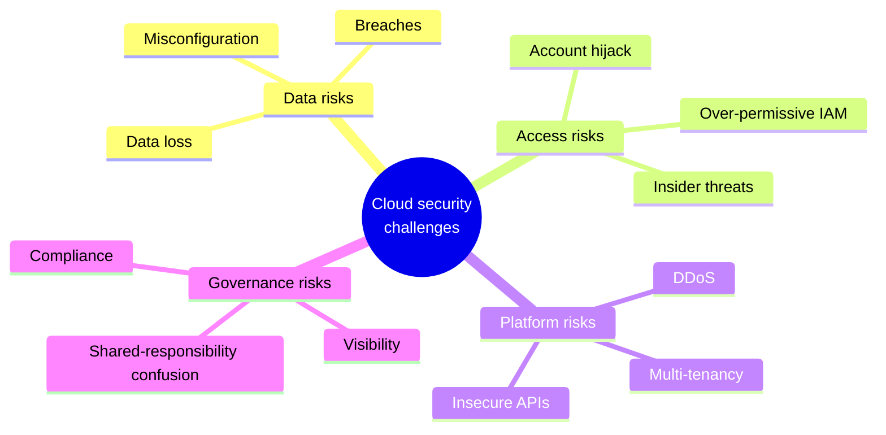
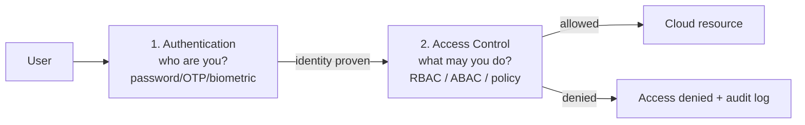
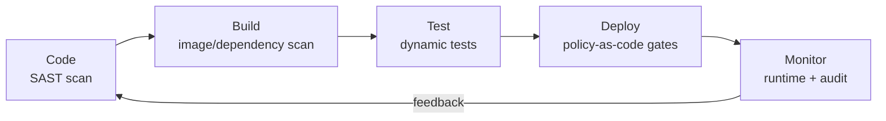

# UNIT 5 — Cloud Security and Compliance 🔐

> **Cloud and Data Center Technology (DI05016031)** · **6 hrs · 14% weightage**
> **Covers syllabus sections:** 5.1 Security in the Cloud (challenges, IAM, access control & authentication) · 5.2 Data Security in Cloud (technologies) · 5.3 Securing Private & Public Cloud Architecture (SLA metrics, DevSecOps)
> **Related practicals:** [P02](../practicals/writeups/P02_cloud_organization_rbac.md) (IAM RBAC), [P09](../practicals/writeups/P09_minio_secure_object_storage.md) (encryption + access control), [P08](../practicals/writeups/P08_cloudsim_secure_file_sharing.md) (secure file sharing)

---

## 🧭 Chapter Roadmap

Unit 5 (14%) is the **security** chapter. Every single paper asks a security question — the three repeated killers are **cloud security challenges (7m)**, **access control and authentication (7m)**, and **DevSecOps (7m)**. IAM, data-security technologies and SLA metrics round it out. P02 (IAM policy) and P09 (encryption + IAM users in MinIO) give you hands-on anchors.

| # | Concept | Exam importance | Related |
|---|---------|-----------------|---------|
| 5.1 | Cloud security challenges | ★★★★★ | — |
| 5.1 | Identity & Access Management (IAM) | ★★★★★ | P02, P09 |
| 5.1 | Access control vs authentication | ★★★★★ | P02 |
| 5.2 | Data security technologies | ★★★★★ | P08, P09 |
| 5.3 | SLA metrics | ★★★★ | — |
| 5.3 | DevSecOps | ★★★★★ | P10 |

### Learning outcomes — after this unit you can:
1. List and explain the **cloud security challenges**.
2. Explain **identity and access management** and distinguish **authentication** from **access control**.
3. Explain the **technologies for data security** (encryption, masking, DLP, key management…).
4. Explain how to **secure private and public cloud architectures**.
5. Define **SLAs and their metrics**.
6. Explain **DevSecOps** and how it differs from plain DevOps.

---

## 5.1 Security in the Cloud ⭐⭐

### 5.1.1 Cloud security challenges (s_24/w_25 Q.5c, w_24 Q.5a, s_25 Q.2a) ⭐⭐
**Cloud security** = the protection of data, applications and infrastructure in a cloud environment (confidentiality, integrity, availability — **CIA**) against threats, using provider + customer controls. Main challenges:

| # | Challenge | What it means |
|---|---|---|
| 1 | **Data breaches / leaks** | Unauthorized access to stored or transmitted data (misconfigured buckets, leaked keys) |
| 2 | **Misconfiguration** | Open buckets, over-permissive IAM roles, exposed ports |
| 3 | **Insecure APIs / interfaces** | The management consoles and REST APIs are attack surfaces |
| 4 | **Account hijacking** | Stolen credentials → attacker controls your cloud account |
| 5 | **Insider threats** | Employees/partners with legitimate access misuse it |
| 6 | **Shared responsibility confusion** | Customer assumes the provider secures *their* apps/data (it doesn't) |
| 7 | **DDoS / availability attacks** | Flooding services → downtime (violates Availability) |
| 8 | **Data loss** | Accidental deletion, weak backup/DR |
| 9 | **Limited visibility & compliance** | Hard to see/audit everything; regulatory rules must still be met |
| 10 | **Multi-tenancy risk** | Weak isolation lets one tenant affect another |

### 5.1.2 Identity and Access Management (IAM) (s_24 Q.5a-alt, s_25 Q.2c, w_24 Q.5b) ⭐⭐
**IAM** = the discipline of managing **who** (identity) is allowed to do **what** (authorization) **where**. Components: **users, groups, roles, permissions/policies, and MFA**. In AWS (P02): you create an **IAM user**, put it in a **group**, attach a **policy** (JSON allow/deny statements), and enforce **least privilege**. Role of IAM: central authentication, fine-grained access control, auditability, and meeting compliance. → hands-on in [P02](../practicals/writeups/P02_cloud_organization_rbac.md).

### 5.1.3 Authentication vs Access Control (s_24 Q.5a, s_25 Q.2a-alt, w_25 Q.5c-alt, s_26 Q.5c) ⭐⭐
- **Authentication ("who are you?")** — verifying identity via **something you know** (password/PIN), **have** (OTP, smart card), **are** (biometrics), or **do** (behavior). Multi-factor = combine two+.
- **Access control ("what may you do?")** — deciding *after* identity is proven whether the user may perform an action. Models: **MAC, DAC, RBAC, ABAC**.

**Justification that they are different (s_24 Q.5a):** proving "I am Ramesh" (authentication) does not grant permission to touch everything — Ramesh may *see* a document but not *delete* it. Authentication answers identity; access control answers authorization. A system that authenticates but never authorizes is as insecure as one that authorizes without authenticating — you need both layers (defense in depth).

## 5.2 Data Security in Cloud ⭐⭐
### 5.2.1 Technologies for data security (w_24 Q.5c, s_25 Q.5b-alt) ⭐⭐
1. **Encryption** — at rest (AES-256 SSE) and in transit (TLS/SSL): ciphertext is useless without the key. (P09: MinIO SSE-S3 with AES-256; P08: encrypt/decrypt in CloudSim.)
2. **Key management (KMS)** — central storage/rotation of encryption keys (AWS KMS, MinIO KMS).
3. **Identity & Access Management** — least-privilege policies (P02).
4. **Tokenization & data masking** — replace/obscure sensitive fields (credit-card numbers, PII).
5. **DLP (Data Loss Prevention)** — detect & block sensitive data leaving the environment.
6. **Firewalls, IDS/IPS, WAF** — network perimeter + app-layer filtering.
7. **Audit & monitoring** — CloudTrail/CloudWatch-style logging, alerts, SIEM.
8. **Backup & DR** — versioning, snapshots, cross-region copies.

## 5.3 Securing Private and Public Cloud Architecture ⭐
### 5.3.1 Metrics for SLAs (w_25 Q.5a, s_25 Q.5b) ⭐
**SLA (Service Level Agreement)** = the formal contract between provider and customer defining the guaranteed **service level** and the **penalty** when it isn't met. Metrics (measurable, SLO-based):
- **Availability/uptime %** — e.g., 99.9% ≈ 8.77 hrs downtime/yr
- **RTO / RPO** — Recovery Time/Point Objective (DR)
- **Latency & throughput** — response time, requests/sec
- **Error rate** — % of failed requests
- **Durability / data-loss rate**
- **Support response time** — ticket SLA
- **Monthly/annual reporting & credits** — how violations are compensated

### 5.3.2 DevSecOps (s_24/s_25/s_26 Q.5c-alt, 7m) ⭐⭐
**DevSecOps (Development, Security, Operations)** = baking **security into every stage** of the DevOps pipeline ("shift left") instead of bolting it on at the end.
- **In DevSecOps** security is everyone's job: code scanning (SAST) at commit, dependency/image scanning at build (Docker images!), secret scanning, IaC policy-as-code, and continuous compliance in CI/CD.
- **In traditional DevOps** security is a final gate → late, slow, and costly fixes.

> ⚠️ **DevSecOps mantra:** "Every pipeline step is a security checkpoint — shift security **left**, not to the end." This pairs with P10 (Docker image hygiene: small images, no secrets in image, pinned base images).

---

## 🧠 Deep-Dive Topics

### Deep Dive A: "Justify: authentication and access control are two different aspects" (s_24 Q.5a)
Authentication verifies identity; access control limits action. Two attack stories prove the difference: (1) **weak authentication + perfect authorization** — someone steals Ramesh's password, so the system believes he *is* Ramesh, and the (correct) access rules then let the attacker do everything Ramesh can → MFA should stop this; (2) **strong authentication + weak authorization** — every user authenticates with a biometric, but a single over-broad IAM policy lets any employee read the salary file → least-privilege RBAC should stop this. Security needs both layers because each protects against a different failure.

### Deep Dive B: Hypervisor security (s_26 Q.2b — cross-link to Unit 2)
Because all VMs on a host share the hypervisor, a **hypervisor compromise = compromise of every guest**. Security aspects: keep hypervisor patched & minimal (attack surface reduction), restrict management interfaces, isolate guests (micro-segmentation), protect against **VM escape** (a guest breaking out to the host), secure live migration traffic, and monitor for "same-host co-location" risks in multi-tenant clouds.

### Deep Dive C: Shared Responsibility Model
| Layer | Provider (public cloud) | Customer |
|---|---|---|
| Physical security, hardware, hypervisor | ✅ | |
| OS, patches, network config inside VM | | ✅ |
| Data, access, IAM policies | | ✅ |
| Managed services (S3, RDS) | Security **of** service | Security **in** service (data, keys, policies) |

Misunderstanding this boundary is itself a listed cloud security challenge — and the single most common cause of breaches.

### Deep Dive D: SLA arithmetic examiners love
99.9% uptime = **8 h 45 min** downtime/year; 99.99% = **52.6 min**/year; 99.999% ("five nines") = **5.3 min**/year. A 3-mark question often asks to compute or compare these.

---

## 🚀 Beyond the Textbook

1. **MinIO's `mc admin policy attach` is IAM-in-miniature** — the same "user → policy → resource" model as AWS IAM; P09 proves it (read-only user denied PUT, admin user allowed).
2. **P08 (CloudSim) shows encryption as application code** — real clouds do it twice: provider SSE + customer KMS keys (envelope encryption).
3. **Zero Trust is the modern slogan** — "never trust, always verify": every request authenticated/authorized regardless of network (matches 5.1.3).
4. **DevSecOps tooling is what the exam won't tell you** — SAST (SonarQube), SCA (Dependabot), container scanning (Trivy), IaC scanners (Checkov), CI (GitHub Actions/Jenkins).
5. **Security is a cost center that can save money** — compliance failures (e.g., data protection law fines) dwarf the cost of prevention; this is the "benefits of cloud security" answer for s_26 Q.5a.

---

## 📝 PYQ Map — UNIT 5 (all available papers)

| Paper | Q. | Topic | Marks |
|---|---|---|---|
| **Summer 2024** | Q.5(a) | Justify: authentication and access control are different aspects of security | 3 |
| | Q.5(c) | Explain cloud security challenges | 7 |
| | Q.5(a)-alt | Role of identity access management | 3 |
| | Q.5(c)-alt | Explain DevSecOps (Development Security and Operations) | 7 |
| **Winter 2024** | Q.5(a) | Define cloud security; list challenges for cloud security | 3 |
| | Q.5(b) | Short note on Identity Management and Access Control | 4 |
| | Q.5(c) | Technologies used for data security in cloud | 7 |
| **Summer 2025** | Q.2(a) | Which are cloud security challenges? | 3 |
| | Q.2(c) | Explain Identity and Access Management in detail | 7 |
| | Q.2(a)-alt | Need for access control and authentication in cloud | 3 |
| | Q.2(c)-alt | Explain DevSecOps in detail | 7 |
| | Q.5(b)-alt | What is Data Security in Cloud? Explain in detail | 4 |
| **Winter 2025** | Q.5(a) | Metrics for Service Level Agreements (SLAs) | 3 |
| | Q.5(c) | Explain cloud security challenges | 7 |
| | Q.5(a)-alt | Explain securing private and public cloud architecture | 3 |
| | Q.5(c)-alt | Access control and authentication in cloud computing | 7 |
| **Summer 2026** | Q.2(b) | Security aspects involved with using a hypervisor | 4 |
| | Q.5(a) | List the benefits of cloud security | 3 |
| | Q.5(c) | Access control and authentication in cloud computing | 7 |
| | Q.5(a)-alt | List the cloud security challenges | 3 |
| | Q.5(c)-alt | Explain DevSecOps (Development Security and Operations) | 7 |

### ✅ Solved PYQ answers (UNIT 5)

**Q. (w_24 Q.5a, 3 marks) — Define cloud security. List challenges.**
> Cloud security is the set of policies, controls and technologies that protect **data, applications and infrastructure** in the cloud — preserving **confidentiality, integrity and availability (CIA)** across provider and customer layers. Challenges include: data breaches, misconfigured storage/security, insecure APIs, account hijacking, insider threats, **shared-responsibility confusion**, DDoS/availability attacks, data loss, weak multi-tenant isolation, and compliance/visibility limits.

**Q. (s_24 Q.5a, 3 marks) — Justify: authentication and access control are two different aspects of security.**
> Authentication answers *"who are you?"* (verify identity by password, OTP, biometrics), while access control answers *"what may you do?"* (grant/deny actions on resources, via RBAC/ABAC policies). Proof they differ: a user can authenticate successfully yet still be denied every action — proving identity does not imply permission. Likewise, a system that grants permissions without verifying identity lets anyone impersonate. Both are independent layers: authentication fails are stopped by strong MFA; authorization failures are stopped by least-privilege IAM. Defense-in-depth requires both.

**Q. (s_25 Q.2c, 7 marks) — Explain Identity and Access Management in detail.**
> IAM is the framework that manages **identities** (who you are) and their **permissions** (what they may do) across cloud resources. **Components:** users (a person/app), groups (collections of users sharing permissions), roles (permission sets assumed by users/services, e.g., EC2→S3), and **policies** (JSON documents with Allow/Deny actions on resources, following **least privilege**). **Working:** a request is authenticated, then the IAM engine evaluates all policies against the action → Allow or Deny (explicit Deny always wins). **Services:** AWS IAM, Azure AD/Entra ID, OpenStack Keystone. **Role of IAM (s_24 Q.5a-alt):** centralized authentication, fine-grained access control, MFA, audit trail and compliance. **Hands-on:** [P02](../practicals/writeups/P02_cloud_organization_rbac.md) builds an IAM policy allowing EC2 control + S3 read but denying IAM changes; [P09](../practicals/writeups/P09_minio_secure_object_storage.md) does the same with `mc admin policy` on MinIO.

**Q. (w_24 Q.5c, 7 marks) — Explain the technologies used for data security in cloud.**
> (1) **Encryption:** data at rest (AES-256, e.g., S3 SSE-S3 — done in P09) and data in transit (TLS/SSL). (2) **Key management (KMS):** centralized creation, rotation and protection of keys. (3) **IAM / access control:** least-privilege policies deciding who reads/writes (P02). (4) **Tokenization and masking:** replace sensitive values (PII, card numbers) with tokens. (5) **DLP:** detect/prevent sensitive data from leaving the cloud. (6) **Network security:** firewalls, IDS/IPS, WAFs, VPC isolation. (7) **Audit & monitoring:** logs (CloudTrail), metrics, SIEM alerts. (8) **Backup & DR:** snapshots, versioning, cross-region replication. Layered together these give **defense in depth**: even if one control fails, the others still protect the data.

**Q. (s_25 Q.5b, 4 marks / w_25 Q.5a, 3 marks) — SLA: full form, explanation and metrics.**
> **SLA = Service Level Agreement** — the contract between provider and customer stating guaranteed service levels and the penalties if they're missed. It is backed by measurable **SLOs**. **Key metrics:** availability/uptime % (99.9% ≈ 8 h 45 m down/year), **latency and throughput**, **error rate**, **durability** (11 nines), **RTO/RPO** for disaster recovery, support response time, and reporting/credit mechanism for breaches. SLAs let customers *prove* and *price* quality, e.g., "99.99% availability or you get service credits."

**Q. (w_25 Q.5a-alt, 3 marks) — Explain securing private and public cloud architecture.**
> **Public cloud** is secured via the **shared responsibility model**: provider protects the physical platform (hardware, hypervisor, managed services), while the customer secures their part — IAM/MFA, VPC isolation/firewalls, encryption, data policies, monitoring and compliance audits. **Private cloud** (on-premise) has a *single* owner responsible for *everything* — physical security, hypervisors, network, OS, apps — but benefits from full control. **Best practice for both:** defense in depth — network security (firewalls, VPN, micro-segmentation), access control (IAM + RBAC + MFA), data protection (encryption at rest/in transit, DLP), continuous monitoring/auditing, and IaC-managed security rules.

**Q. (s_24 Q.5c-alt, 7 marks) — Explain DevSecOps.**
> DevSecOps = **Development + Security + Operations**: integrating security into every stage of the software delivery pipeline — *"shifting security left"* — rather than a final check. **How it works:** at *commit*, static code analysis (SAST) and secret scanning; at *build*, dependency and **container-image scanning** (Docker, P10); at *test*, dynamic scanning; at *deploy*, **policy-as-code** gates and IaC security scans (Terraform/CloudFormation); in *production*, runtime monitoring, audit and automated response — with feedback looping back to developers. **Benefits:** early detection (cheap to fix), continuous compliance, fewer breaches, faster releases without sacrificing security. **DevOps vs DevSecOps:** DevOps automates build→deploy; DevSecOps makes security a *continuous, automated* part of that flow instead of a manual end gate.

---

## ✍️ Practice Problems (self-test — answers hidden)

1. List any five cloud security challenges and give one real fix for each.
2. "Authentication and access control are different" — give two attack stories that prove it.
3. What is the shared responsibility model? Who is responsible for an S3 bucket's data policy?
4. Compute downtime per year for 99.9% vs 99.99% availability.
5. Name five data-security technologies and match each to a practical (P02/P08/P09 where possible).
6. What makes DevSecOps different from DevOps? Name one scan at each pipeline stage.
7. List four SLA metrics and explain what "99.99% availability" promises.

📌 Model solutions

1. Breach → encryption+least privilege; misconfig → policy-as-code scans; insecure APIs → MFA+API gateways; hijacking → MFA; insider → audit+DLP; DDoS → WAF/rate limiting; data loss → backups; multi-tenancy → strong isolation.
2. Stolen password = weak authentication beats perfect authorization; over-broad policy = strong authentication can't stop an authorized insider.
3. Provider: physical/hypervisor/platform. Customer: their data, access, IAM, in-VM config. For an S3 bucket: customer owns data + bucket policy.
4. 99.9% → 525.6 min ≈ 8.76 h; 99.99% → 52.56 min ≈ 0.88 h.
5. Encryption → P09 (SSE-S3) & P08 (encrypt cloudlet); IAM → P02 & P09 users/policies; KMS → P09 `MINIO_KMS_SECRET_KEY`; DLP/audit → P09 IAM deny logs; backup/DR → versioning in P09/P07.
6. DevSecOps shifts security left into every CI/CD stage; SAST at commit, image scan at build, policy-as-code at deploy, runtime monitoring in prod.
7. Availability %, latency, error rate, durability, RTO/RPO, support response. 99.99% = ~52.6 min max downtime per year, else penalty/credits.

---

## 📖 Glossary of Key Terms

| Term | Definition |
|---|---|
| **Cloud security** | Protection of data/apps/infra in the cloud (CIA) |
| **CIA triad** | Confidentiality, Integrity, Availability |
| **Authentication** | Verifying identity ("who are you?") |
| **Access control** | Granting/denying actions ("what may you do?") |
| **IAM** | Identity & Access Management: users, groups, roles, policies |
| **Least privilege** | Grant only the minimum permissions needed |
| **RBAC / ABAC** | Role-based / attribute-based access control |
| **MFA** | Multi-factor authentication |
| **SSE / TLS** | Server-side encryption / transport encryption |
| **KMS** | Key Management Service |
| **DLP** | Data Loss Prevention |
| **Shared responsibility** | Provider vs customer security split |
| **SLA / SLO** | Service Level Agreement / Objective |
| **Availability %** | Uptime guarantee (99.9% ≈ 8.8 h/yr down) |
| **RTO / RPO** | Recovery Time / Recovery Point Objective |
| **DevSecOps** | Security integrated into DevOps ("shift left") |
| **SAST / SCA** | Static analysis / software composition (dependency) analysis |
| **Hypervisor escape** | Guest breaking out to host (Unit 2 link) |
| **Zero Trust** | Never trust, always verify |

---

## 🔗 Curated Resources (per concept)

**Cloud security challenges & model**
- AWS shared responsibility model: https://aws.amazon.com/compliance/shared-responsibility-model/
- OWASP Cloud Security / CSA top threats: https://cloudsecurityalliance.org/ (Top Threats series)

**IAM & access control**
- AWS IAM docs: https://docs.aws.amazon.com/IAM/latest/UserGuide/introduction.html
- OpenStack Keystone: https://docs.openstack.org/keystone/latest/

**Data security technologies**
- S3 SSE: https://docs.aws.amazon.com/AmazonS3/latest/userguide/serv-side-encryption.html
- MinIO encryption & KMS: https://min.io/docs/minio/linux/operations/server-side-encryption.html

**SLA & DevSecOps**
- SLA metrics guide (Wikipedia): https://en.wikipedia.org/wiki/Service-level_agreement
- DevSecOps (Red Hat): https://www.redhat.com/en/topics/devops/what-is-devsecops

**Books (GTU syllabus)**
- Sosinsky, *Cloud Computing Bible* (Wiley) — security & compliance chapters
- Buyya et al., *Mastering Cloud Computing* — security chapter

**Videos (high yield)**
- *Cloud Security Challenges* — IBM Technology
- *IAM explained* — AWS / Stephane Maarek
- *DevSecOps explained* — IBM Technology

---

## 🎥 Video Study Guide (YouTube)

> Search keywords + trusted channels, in watching order.

### 🧑‍🎓 Step 0 — Pick your learning style
| Style | You learn best by | Your path through this unit |
|---|---|---|
| 🎧 **Listener** | short explainers | 1 video per topic (5–10 min each) |
| 🛠️ **Builder** | doing it | Redo [P02](../practicals/writeups/P02_cloud_organization_rbac.md) + [P09](../practicals/writeups/P09_minio_secure_object_storage.md) |
| 🧠 **Deep Diver** | the "why" | Shared-responsibility + zero-trust deep dives |
| 🎓 **Academic** | exam marks | Master the three 7-mark monsters from the PYQ map |

### 🎬 Step 1 — Watch by topic
| Topic | YouTube search keywords | Best channels |
|---|---|---|
| Security challenges | `cloud security challenges` · `cloud security risks` | IBM Technology, Simplilearn |
| IAM | `aws iam explained` · `what is iam` | AWS, Stephane Maarek, TechWorld with Nana |
| Auth vs access | `authentication vs authorization` | IBM Technology, freeCodeCamp |
| Data security tech | `data security in cloud` · `encryption at rest in transit` | IBM Technology, AWS |
| SLA | `what is an sla` · `sla metrics 99.9` | IBM Technology |
| DevSecOps | `devsecops explained` · `shift left security` | IBM Technology, Nana |
| Hypervisor security | `hypervisor security vm escape` | SANS, IBM Technology |
| Revision | `cloud security unit 5 diploma` | Gate Smashers, Neso Academy |

### 🎬 Step 2 — Full playlists (Deep Divers & Academics)
1. *Cloud Security Fundamentals* — IBM Technology playlist.
2. *IAM & Security on AWS* — freeCodeCamp / ExamPro.
3. NPTEL *Cloud Computing* (security unit): https://archive.nptel.ac.in/courses/106/105/106105167/

### 🎬 Step 3 — Proof you got it (5 min)
- Recite 5 security challenges + one fix each in one minute.
- Explain the auth-vs-access-control difference using one attack story.
- Draw the DevSecOps pipeline and name a scan per stage.

---

*Next: [UNIT 6 — Emerging Technologies with Cloud Computing](./UNIT_6_Emerging_Technologies_with_Cloud_Computing.md)*
