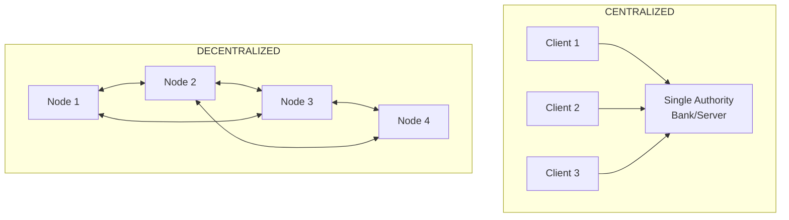
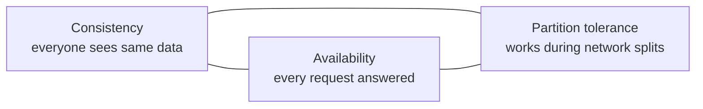
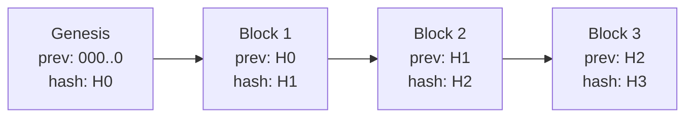
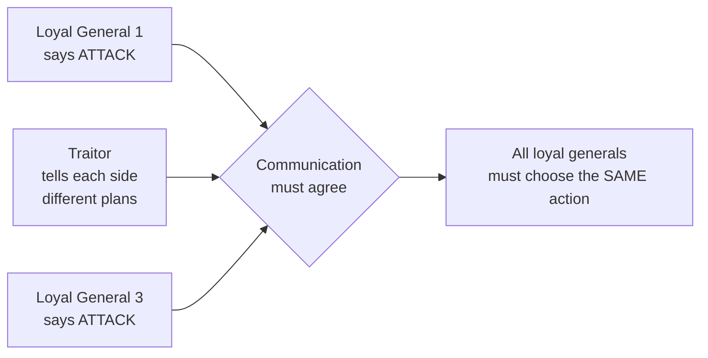

# UNIT 1 — Foundations of Decentralization 🏛️

> **Foundation of Blockchain (DI05016051)** · **10 hrs · 20% weightage**
> **Covers syllabus sections:** 1.1 Cryptography (money & centralization, hash functions, digital signatures, CAP theorem) · 1.2 Anatomy of a Block · 1.3 Network Consensus
> **Related practicals:** [P01](../practicals/writeups/P01_cryptographic_hash_avalanche.md), [P02](../practicals/writeups/P02_public_private_keys_digital_signatures.md), [P03](../practicals/writeups/P03_basic_blockchain_python.md), [P04](../practicals/writeups/P04_merkle_tree.md)

---

## 🧭 Chapter Roadmap

This unit is the **foundation of the entire subject**. Every question in later units (Bitcoin, Ethereum, DAOs) traces back to something in this chapter. If you master these ~10 concepts cold, the rest of the syllabus becomes easy.

| # | Concept | Exam importance | Code demo |
|---|---------|-----------------|-----------|
| 1.1 | Centralized vs Decentralized | ★★★ | — |
| 1.2 | Cryptographic hash functions (SHA-256) | ★★★★★ | P01 |
| 1.3 | Public-key crypto & digital signatures | ★★★★★ | P02 |
| 1.4 | CAP theorem | ★★★★ | — |
| 1.5 | Anatomy of a block | ★★★★ | P03 |
| 1.6 | Merkle trees | ★★★★★ | P04 |
| 1.7 | DLT vs traditional DBs | ★★★ | — |
| 1.8 | Byzantine Generals problem | ★★★★ | — |
| 1.9 | P2P networks | ★★★ | — |
| 1.10 | Why we need consensus | ★★★★ | — |

### Learning outcomes — after this unit you can:
1. Explain *why* money moved from gold to crypto, and what "decentralization" actually means.
2. Prove (and demonstrate in code) the six properties of a cryptographic hash.
3. Explain how public/private keys and digital signatures give **authenticity, integrity, non-repudiation**.
4. State and apply the **CAP theorem** to blockchains.
5. Draw the anatomy of a block and explain the cryptographic chain link.
6. Build and explain a **Merkle tree** and an O(log n) membership proof.
7. Explain the **Byzantine Generals problem** and why consensus is the "magic" that makes decentralized systems work.

---

## 1.1 Cryptography: From Money to Decentralization

### 1.1.1 The Evolution of Money — why blockchain exists

Money has gone through four revolutions, each solving a problem of the previous stage:

```
Barter ──► Commodity money ──► Fiat money ──► Digital (bank) money ──► Cryptocurrency
(goods↔goods)  (gold/silver)    (govt-issued)   (bank ledgers)        (2009, Bitcoin)
```

| Stage | Problem it solved | New problem created |
|---|---|---|
| **Barter** | — | Double coincidence of wants (I have rice, you have fish — do we both want what the other has?) |
| **Commodity money (gold)** | Common store of value | Heavy to carry, divisible with difficulty, centralized banks started storing it → **trust** required |
| **Fiat money** | No backing needed, easy to print/spend | Governments/banks can **inflate** it, freeze accounts, exclude people; a **central authority** controls everything |
| **Digital bank money** | Speed, global reach | Still **centralized** — a single bank (or SWIFT, PayPal) is a trusted third party & a single point of failure |
| **Cryptocurrency** | No trusted third party; scarcity by code; permissionless | Volatility, self-custody responsibility, scalability limits |

> 💡 **Beyond the textbook:** In 2008, the global financial crisis destroyed trust in banks. Bitcoin's whitepaper ("Bitcoin: A Peer-to-Peer Electronic Cash System") by the pseudonymous **Satoshi Nakamoto** was published in October 2008 — the genesis block was mined on **3 January 2009** and contains the newspaper headline *"Chancellor on brink of second bailout for banks"* — a direct political statement against centralized banking.

### 1.1.2 Centralized vs Decentralized Systems



| Criterion | Centralized | Decentralized |
|---|---|---|
| Who owns the ledger | One organization | Nobody / everyone (shared copies) |
| Who writes data | Admin | Consensus of nodes |
| Trust model | Trust the operator ("I trust the bank") | Trust the math ("I don't need to trust anyone") |
| Failure | Single point of failure | Resilient — other nodes keep working |
| Censorship | Possible (bank can block you) | Very hard (no single target) |
| Efficiency | Fast, cheap | Slower, more overhead |
| Example | Bank, Google, government registry | Bitcoin, Ethereum, BitTorrent |

> ⚠️ **Common misconception:** *Decentralized* ≠ *distributed*.
> - **Distributed** = the system is spread across multiple machines (even Google's databases are distributed).
> - **Decentralized** = *control and decision-making* are spread across independent actors who do not trust each other.
> A system can be distributed but centralized (e.g., a big tech company's global cloud). Blockchain must be **both** distributed (many nodes) and decentralized (no single controller).

### 1.1.3 Cryptographic Hash Functions — the "glue" of blockchain ⭐

A **hash function** takes any input (any size) and produces a fixed-size output called a **digest**. Cryptographic hash functions add hard-to-achieve security properties.

**SHA-256** (Secure Hash Algorithm, 256-bit) — the workhorse of Bitcoin:
- Output: **256 bits = 32 bytes = 64 hexadecimal characters**
- Based on the Merkle–Damgård structure; designed by NSA, standardized by NIST (FIPS 180-4)
- Bitcoin actually uses **double SHA-256**: `SHA256(SHA256(x))`

```python
import hashlib
print(hashlib.sha256(b"hello").hexdigest())
# 2cf24dba5fb0a30e26e83b2ac5b9e29e1b161e5c1fa7425e73043362938b9824
```

#### The SIX properties (memorize these — guaranteed exam question) ⭐⭐

| Property | Meaning | Why it matters in blockchain |
|---|---|---|
| ① **Deterministic** | Same input → same hash, always | Anyone can re-verify a block's hash |
| ② **Fixed output length** | Any input → 256 bits | Hashing links in a chain are all the same size |
| ③ **Pre-image resistance** | Can't find input from hash (one-way) | A hash reveals nothing about the original data |
| ④ **Second pre-image resistance** | Given input & hash, can't find *different* input with same hash | Can't forge a fake block matching a published hash |
| ⑤ **Collision resistance** | Can't find *any two* inputs with same hash | No two blocks/txs can share an identity |
| ⑥ **Avalanche effect** | 1-bit change in input → ~50% of output bits flip | Tampering is immediately obvious |

> 🔬 **See it live:** [P01](../practicals/writeups/P01_cryptographic_hash_avalanche.md) runs this in Python — changing `Hello, World!` → `Hello, World?` flips **113 of 256 bits**.

> 💡 **Beyond the textbook:** The "birthday attack" — because of the **birthday paradox**, finding a collision in an *n*-bit hash requires only ~2^(n/2) tries, not 2^n. That's why we use 256-bit hashes (128-bit collision resistance) and why old 64-bit hashes (MD5) are broken.

### 1.1.4 Public-Key Cryptography & Digital Signatures ⭐⭐

**Symmetric crypto:** one shared key encrypts and decrypts. Problem: how do two strangers *share* the key safely?

**Asymmetric (public-key) crypto** solves this — you get a mathematically-linked **key pair**:
- **Private key** (`sk`) — secret, signs / decrypts. Never leaves your device.
- **Public key** (`pk`) — derived from private, shared freely, verifies / encrypts.

The relationship is **one-way** (a "trapdoor"): computing `pk` from `sk` is easy; the reverse requires solving the **elliptic-curve discrete logarithm problem**, which is computationally infeasible.

**ECDSA** (Elliptic Curve Digital Signature Algorithm) — used by Bitcoin & Ethereum on curve **secp256k1**.

```
Signing (Alice)                          Verification (Bob)
msg ──► hash ──► sign(sk, hash)          msg ──► hash
              ──► (r, s) signature      signature (r,s) ──► verify(pk, hash)
                                        → VALID only if Alice's sk signed it
```

**What a signature guarantees:**
| Property | Meaning |
|---|---|
| **Authenticity** | The message really came from the private-key holder |
| **Integrity** | Tamper with the message → signature fails |
| **Non-repudiation** | The signer can't deny signing (only they hold `sk`) |

> ⚠️ **Exam trap:** ECDSA signatures are **non-deterministic** — a random nonce `k` means the same message signed twice gives *different* `(r,s)` values. If you see two identical signatures for the same message, something is wrong (a leaked `k` leaks the private key — this is how PS3's ECDSA was broken in 2010).

> 🔬 **See it live:** [P02](../practicals/writeups/P02_public_private_keys_digital_signatures.md) generates a key pair, signs, and proves tampered messages & wrong keys are rejected.

### 1.1.5 The CAP Theorem ⭐

In any **distributed** system you can have at most **two of three** guarantees:



| Property | Definition |
|---|---|
| **Consistency** | Every read returns the *latest* write (all nodes agree at every instant) |
| **Availability** | Every request gets a *response* (even if it may be stale) |
| **Partition tolerance** | The system *keeps working* when nodes can't talk to each other |

**The insight (Eric Brewer, 2000):** Network partitions (splits) are *unavoidable* in real networks. So you must choose:

- **CP** (consistency + partition tolerance): during a split, refuse to serve the minority side to avoid conflicting data → **blockchains choose CP**
- **AP** (availability + partition tolerance): during a split, keep answering (maybe with stale data); reconcile later → most NoSQL databases (Cassandra, DynamoDB)

**Blockchain and CAP:** During a partition, the two sides may produce *different* blocks (temporarily inconsistent). When the partition heals, the **longest chain wins** and one side's blocks are orphaned — the system sacrificed **availability** to preserve **consistency**.

> 💡 **Beyond the textbook:** "Eventual consistency" (a PYQ term!) means: if no new updates arrive, all nodes *eventually* converge to the same state. Bitcoin is eventually consistent — your transaction "confirms" after ~6 blocks, i.e., the system has converged. See solved PYQ below (w_24 Q.4a).

---

## 1.2 The Anatomy of a Block ⭐

### 1.2.1 Block fields

A blockchain is literally a **linked list of hash-linked records**:

| Field | Meaning | Example |
|---|---|---|
| **Index** | Position in the chain (0 = genesis) | `1` |
| **Timestamp** | When the block was created | `2026-07-31 10:00:00 UTC` |
| **Data** | Transactions or payload | `"Student A sends 1 coin to B"` |
| **Previous hash** | Hash of the previous block ← the *link* | `bdb16bbff0518dcc…` |
| **Nonce** | Number used once (for PoW — Unit 2) | `0` |
| **Hash** | SHA-256 of everything above | `00a017f696a0fdba…` |



**Why this creates tamper-evidence (the single most important idea in this unit):**

```
hash_n = SHA256(index + timestamp + data + prev_hash + nonce)
```

1. The **previous hash is inside** the current block's hash input.
2. Change any byte of block *i* → its hash changes (avalanche).
3. Block *i+1* still stores the *old* `prev_hash` → mismatch → whole chain flagged invalid.
4. To "fix" it, an attacker must re-hash **every subsequent block**, and (in PoW) re-mine each at current difficulty. The cumulative work makes this uneconomical.

> 🔬 **See it live:** [P03](../practicals/writeups/P03_basic_blockchain_python.md) — change `"sends 1 coin"` → `"sends 100 coins"` in a block and the validator instantly rejects the chain.

### 1.2.2 Merkle Trees — efficient data verification ⭐⭐

Hashing all transactions together is wasteful: to prove *one* transaction belongs, you'd need *all* transactions. A **Merkle tree** solves this.

**Construction (bottom-up):**
1. **Leaves** = `SHA256(tx)` for each transaction
2. **Parent** = `SHA256(left || right)` (sorted so `left < right`)
3. Repeat until one node remains → **Merkle root**
4. Odd count? Duplicate the last leaf (Bitcoin convention)

```mermaid
flowchart TB
    R[Merkle Root = H(h01 + h23)] --> h01[H01 = H(h0 + h1)]
    R --> h23[H23 = H(h2 + h3)]
    h01 --> h0[H0 = SHA256(tx0)]
    h01 --> h1[H1 = SHA256(tx1)]
    h23 --> h2[H2 = SHA256(tx2)]
    h23 --> h3[H3 = SHA256(tx3)]
```

**Why it's brilliant:**
- The **root** commits to *all* transactions in one 256-bit value (stored in the block header).
- To prove tx2 ∈ block, you only need the **sibling path** `{h3, h01}` → recompute root and compare. That's **log₂(n)** hashes, not *n* — this is a **Merkle proof**.
- Light clients (**SPV wallets**) download only block headers, get a short Merkle proof from a full node, and verify their transaction was included — without downloading the whole chain.

> 🔬 **See it live:** [P04](../practicals/writeups/P04_merkle_tree.md) — builds trees for 4 and 5 transactions and shows a tampered leaf changes the root.

> 💡 **Beyond the textbook:** Ethereum doesn't use a plain Merkle tree — it uses a **Merkle-Patricia Trie** for its state, allowing efficient *light-client proofs of state* (balances, storage) in addition to transactions. Know the difference if asked "how does Ethereum store state?".

### 1.2.3 Distributed Ledger Technology (DLT) vs Traditional Databases

| Criterion | Traditional Database | DLT / Blockchain |
|---|---|---|
| **Ownership** | Single organization | Shared among participants |
| **Write permission** | Admin / central authority | Consensus protocol |
| **History** | Overwritable / mutable | **Append-only** (immutable) |
| **Trust** | Trust the operator | Trust the protocol (crypto + consensus) |
| **Failure** | Single point of failure | Fault-tolerant (n−1 nodes can fail) |
| **Transparency** | Internal | Open to all participants |
| **Speed** | Very fast | Slower (replicated everywhere) |
| **Example** | MySQL, Oracle | Bitcoin, Ethereum, Hyperledger Fabric |

**When a blockchain is *not* the answer** (exam "limits of blockchain"): private data is a compliance risk, extremely high transaction throughput needed, no need for a shared/trusted record, regulatory constraints.

---

## 1.3 Network Consensus

### 1.3.1 The Byzantine Generals Problem ⭐⭐

**The problem (Leslie Lamport, 1982):** Several divisions of the Byzantine army are camped around an enemy city. The generals must agree on a common plan — **attack** or **retreat**. They communicate only by messages, but **some generals are traitors** who will send conflicting messages to create chaos. How can the loyal generals reach reliable agreement?



**Key findings:**
1. If generals send only messages, agreement is impossible with **3 generals and 1 traitor**.
2. In general: to tolerate `f` traitors, you need **at least 3f + 1** loyal parties (so 3f+1 total, with f faulty) — this is the classic result behind **PBFT**.
3. Cryptographically **signed** messages improve this (you can't impersonate a loyal general).

**Why it matters to blockchain:** A blockchain is a bunch of "generals" (nodes) who don't trust each other and must agree on which transactions are valid and in what order — otherwise the whole system falls apart. **Consensus algorithms are the solution to the Byzantine Generals problem.**

### 1.3.2 Peer-to-Peer (P2P) Network Architecture

- Nodes connect **directly to each other** (a mesh), not through a central server.
- **Gossip/flooding:** new transactions and blocks propagate node-to-node; each node validates before relaying.
- **Full nodes** store the entire ledger and enforce all rules.
- Result: no single point of failure, no central target, censorship-resistant.

> 💡 **Beyond the textbook:** Bitcoin nodes talk on port 8333 over TCP; a node connects to ~8-125 peers. The network is *permissionless* — anyone can run a node, which is what makes Bitcoin hard to kill. In permissioned chains (Unit 4, Hyperledger Fabric) the "P2P network" is restricted to approved members.

### 1.3.3 Why We Need Consensus (agreement)

In a centralized system, the boss decides. In a decentralized one, **nobody is the boss** — so we need a **formal agreement rule** every honest node follows:

```
"Which block is valid?"  →  Consensus rule answers
"Which chain is the truth?"  →  The one with most accumulated work/stake
```

**Properties we want from consensus:**
- **Safety** — honest nodes never disagree on the same block (no double-spend)
- **Liveness** — the network keeps making progress (new blocks keep coming)
- **Fault tolerance** — works despite Byzantine/faulty nodes

**Two big families** (detail in Unit 2):
- **PoW (Proof of Work)** — spend energy; probability of deciding ∝ hashrate. Used by Bitcoin.
- **PoS (Proof of Stake)** — lock tokens; probability of deciding ∝ stake. Used by Ethereum (post-2022).

---

## 🧠 Deep-Dive Topics

### Deep Dive A: The full "why does tampering fail" chain of reasoning
1. Block data is hashed → any change to data changes the hash.
2. The new hash doesn't match the block's stored hash → invalid.
3. Even if recomputed, the next block's `prev_hash` still points to the old hash → invalid.
4. Fixing the whole chain requires re-mining (PoW) every block after the tampered one.
5. The attacker would need more cumulative hashing power than the entire honest network → infeasible.
> This is why a blockchain's security comes from **hash chaining + consensus work**, not from encryption of the data (blockchain data is public, not encrypted!).

### Deep Dive B: Merkle proof — worked example
4-tx block: `H0 H1 H2 H3` → `H01 = H(H0,H1)`, `H23 = H(H2,H3)` → `Root = H(H01,H23)`.
To prove **tx2**:
- Provide `tx2`, `H3`, `H01`.
- Verifier computes `H2 = SHA256(tx2)`, then `H23 = H(H2, H3)`, then `Root' = H(H01, H23)`.
- If `Root' == stored root` → tx2 is in the block. ✅
- Only **3** hashes were needed for 4 txs; for 1,000,000 txs only **20** hashes (log₂ 10⁶ ≈ 20).

### Deep Dive C: CAP theorem, applied
Say the network splits into Side A and Side B (a partition). A miner on each side mines a new block → two different chains exist briefly.
- **Availability choice** (AP): both sides keep accepting transactions. On heal → conflict → resolve by longest chain → transactions from the losing side are dropped/reverted.
- **Consistency choice** (CP): the minority side stops accepting new writes during the partition. Blockchain picks this. Result: you might temporarily be *unavailable* to transact (nodes waiting for the split to heal), but the network never accepts two conflicting truths forever.
- "**Eventual consistency**" = after the partition heals and no new blocks arrive, all nodes converge on the same chain.

---

## 🚀 Beyond the Textbook (what most classes won't tell you)

1. **Hashes don't "encrypt" anything.** Blockchain data is *public by design*. Privacy is a *separate* feature (zksnarks, mixers) added on top. Never write "blockchain encrypts data" in an exam — it's a common wrong answer.
2. **The first-ever double-spend risk:** because Bitcoin hashes are probabilistic (PoW), the "6 confirmations" rule is a *practical* heuristic, not a guarantee. It only holds while the attacker has <50% hashrate.
3. **Merkle roots vs "all hashes concatenated":** some textbooks simplify to `SHA256(tx1+tx2+…)`. Real systems use Merkle trees specifically so *individual* transactions can be proven in O(log n) without downloading everything.
4. **The genesis block's `prev_hash` is 64 zeros** — it's a sentinel meaning "nothing before me." This special-case is how the chain knows where to start validating.
5. **Non-deterministic signatures are a feature, not a bug.** Random `k` prevents signature-reuse attacks. But if the RNG is weak (see: Android Bitcoin wallet bug, 2013), the same `k` across two signatures reveals the private key in one line of algebra.
6. **Exam-hack memory aid for the 6 hash properties:** "**D**eterministic **F**ixed **P**re-image-resistant, **S**econd-preimage, **C**ollision, **A**valanche" → **DF PSCA** → remember "**D**o **F**ind **P**eople **S**igning **C**ode **A**ll-day."

---

## 📝 PYQ Map — UNIT 1 (all available papers)

| Paper | Q# | Question | Weight | In this unit? |
|---|---|---|---|---|
| w_24 | Q.1(a) | Short note: Distributed Ledger | 3 | ✅ §1.2.3 |
| w_24 | Q.1(c) | Explain Consistency, Availability, Partition tolerance | 7 | ✅ §1.1.5 |
| w_24 | Q.1(c-alt) | Explain Asymmetric Encryption Model with example | 7 | ✅ §1.1.4 |
| w_24 | Q.2(a) | Define: Public key, Private key, Digital Signature | 3 | ✅ §1.1.4 |
| w_24 | Q.3(c-alt) | What is SHA-256 and its use in Bitcoin? | 7 | ✅ §1.1.3 |
| w_24 | Q.4(a) | Explain Bitcoin and eventual consistency | 3 | ✅ §1.1.5 |
| w_24 | Q.4(c) | Define Merkle Tree, explain how it works | 7 | ✅ §1.2.2 |
| s_24 | Q.1(a) | Benefits of distributed ledger systems | 3 | ✅ §1.2.3 |
| s_24 | Q.1(b) | Define: 1) Blockchain 2) Distributed systems | 4 | ✅ §1.1.2 |
| s_24 | Q.4(b) | Explain classic Byzantine generals problem | 4 | ✅ §1.3.1 |
| s_24 | Q.4(c) | Process of Merkle tree creation with example | 7 | ✅ §1.2.2 |
| s_25 | Q.1(b) | Explain Distributed Ledger in detail | 4 | ✅ §1.2.3 |
| s_25 | Q.1(c) | Define Blockchain, describe applications & limits | 7 | ✅ §1.1.2 |
| s_25 | Q.1(c-alt) | Short note: CAP Theorem in Blockchain | 7 | ✅ §1.1.5 |
| s_25 | Q.2(a) | Explain Data Structure of a Blockchain | 3 | ✅ §1.2.1 |
| s_25 | Q.2(b) | Benefits of Decentralization | 4 | ✅ §1.1.2 |
| s_25 | Q.4(b) | What is hashing? How useful in Bitcoin? | 4 | ✅ §1.1.3 |
| s_25 | Q.4(c) | Short note: Merkle Tree | 7 | ✅ §1.2.2 |
| s_25 | Q.4(c-alt) | Byzantine generals + PBFT | 7 | ✅ §1.3.1 |
| s_26 | Q.1(b) | Define: 1) Blockchain 2) Distributed systems | 4 | ✅ §1.1.2 |
| w_25 | Q.1(a) | Define: Blockchain | 3 | ✅ §1.1.2 |
| w_25 | Q.1(b) | Explain asymmetric key encryption model | 4 | ✅ §1.1.4 |
| w_25 | Q.1(c) | Applications, limits, challenges of Blockchain | 7 | ✅ §1.1.2 |
| w_25 | Q.1(c-alt) | Consistency, Availability, Partition tolerance | 7 | ✅ §1.1.5 |
| w_25 | Q.2(a) | Define: Decentralized network, Wallet | 3 | ✅ §1.1.2 |
| w_25 | Q.2(b) | Core components of blockchain | 4 | ✅ §1.2 |
| w_25 | Q.2(c-alt) | Structure of the blockchain | 4 | ✅ §1.2.1 |

> 📂 Papers live in [`pyq/fbc/`](../../pyq/fbc/): `s_24.pdf`, `w_24.pdf`, `s_25.pdf`, `w_25.pdf`, `s_26.pdf`.

### ✅ Solved PYQ answers (UNIT 1)

**Q. (w_24 Q.1a, 3 marks) — Short note: Distributed Ledger**
> A distributed ledger (DLT) is a database that is **shared, replicated, and synchronized** across multiple nodes in a peer-to-peer network, with **no central administrator**. Each participant keeps a copy of the ledger; updates are agreed via **consensus**. Characteristics: (1) decentralization of control, (2) immutability (append-only), (3) transparency among participants, (4) fault tolerance. Applications: cryptocurrencies, supply-chain tracking, land records, identity management. Examples: Bitcoin, Ethereum, Hyperledger Fabric.

**Q. (w_24 Q.4a, 3 marks) — Explain Bitcoin and eventual consistency**
> Bitcoin is a decentralized cryptocurrency using a public blockchain. **Eventual consistency** means: if no new updates arrive, all copies of the ledger converge to the same state over time. Bitcoin achieves it because during a network partition two conflicting blocks may be created; when the partition heals, nodes adopt the **longest valid chain**, orphaning the other side's blocks. Transactions are considered settled only after ~**6 confirmations**, by which point the network has converged. Bitcoin therefore is **CP** (consistency + partition tolerance) and *eventually* consistent, not immediately consistent.

**Q. (w_24 Q.2a, 3 marks) — Define: Public key, Private key, Digital signature**
> **Public key:** the shareable half of an asymmetric key pair, derived from the private key, used to verify signatures / encrypt data. **Private key:** the secret half, known only to the owner, used to create signatures / decrypt data; must never be shared. **Digital signature:** a cryptographic value `(r, s)` produced by signing a message hash with the private key; verifiable by anyone holding the public key. It provides **authenticity** (sender identity), **integrity** (message unaltered) and **non-repudiation** (sender cannot deny).

**Q. (s_25 Q.4c, 7 marks) — Short note: Merkle Tree**
> A Merkle tree is a **binary hash tree** where leaves are `SHA256(transaction)` and each parent is the hash of its two children concatenated, up to a single **Merkle root**. Construction: hash each tx → pair-and-hash repeatedly → root; odd leaves are duplicated. The root is stored in the block header and commits to every transaction. **Membership proof:** a verifier needs only the sibling path (log₂ n hashes) to recompute the root — used by SPV/light clients. **Properties:** tamper-evident (changing one tx changes the root), efficient (O(log n) proofs), compact (one 32-byte commitment for thousands of txs).

**Q. (s_24 Q.4b, 4 marks) — Explain classic Byzantine generals problem**
> In the Byzantine Generals problem, several generals camped around a city must agree on whether to **attack or retreat**. They communicate only by message, but some generals are **traitors** who send contradictory messages to different recipients to prevent agreement. Lamport showed that with only messages, agreement is impossible with **3 generals and 1 traitor**; to tolerate `f` traitors you need **at least 3f+1** total participants. It models the core difficulty of distributed consensus: **nodes that don't trust each other must agree on one truth**. Blockchains solve it with **consensus algorithms** (PoW/PoS/PBFT) that make dishonest behaviour expensive or impossible.

**Q. (s_24 Q.1b / s_26 Q.1b, 4 marks) — Define: 1) Blockchain 2) Distributed system**
> **(1) Blockchain:** a decentralized, distributed, **append-only digital ledger** composed of blocks linked by cryptographic hashes. Each block stores data (transactions), a timestamp, the **hash of the previous block**, and a nonce. Because each block commits to the previous one, the record is **immutable and tamper-evident**; additions require **consensus** among network nodes. **(2) Distributed system:** a collection of independent computers (nodes) that appear to users as a single coherent system, communicating and coordinating via messages. Key challenges are consistency, fault tolerance and concurrency; examples: distributed databases, CDNs, and blockchain networks.

---

## ✍️ Practice Problems (self-test — answers upside-down)

1. **List** the six properties of a cryptographic hash function and give a one-line blockchain use for each.
2. Alice signs a message and sends `(msg, sig)` to Bob. Bob changes one character and forwards it to Carol with the same signature. What happens when Carol verifies? Why?
3. A blockchain has 8,192 transactions in one block. How many hashes are needed to prove tx #5000 is in the block?
4. During a network partition, a bank system and a blockchain both keep running. Explain which is AP and which is CP, and why.
5. Why can't a node simply edit the data in block 3 of an existing chain and re-broadcast it?
6. Give the key-pair generation and signing equation *conceptually*: what does a verifier compare to accept a signature?

<details>
<summary>📌 Model solutions</summary>

1. **Deterministic** (re-verification) · **Fixed length** (uniform linking) · **Pre-image resistance** (one-way) · **Second pre-image resistance** (no forgery) · **Collision resistance** (unique identity) · **Avalanche** (tamper detection).
2. Carol's verification **fails**. Signatures bind to the exact message; any change to the message changes the hash, so the signature no longer matches. This demonstrates **integrity**.
3. **13 hashes** (log₂ 8192 = 13).
4. Blockchain: **CP** — it stops serving the minority side rather than risk two truths. Bank system (replicated DB) is typically **AP** — serves requests during partition, reconciles later.
5. Editing block 3 changes its hash; block 4's stored `prev_hash` would no longer match, and every subsequent block becomes invalid. Re-hashing all later blocks requires re-mining them at current PoW difficulty — uneconomical for an attacker without majority hashrate.
6. The verifier recomputes the message hash, takes the `(r, s)` signature and the public key, and runs the ECDSA verification equation; it returns "valid" iff the signature was produced by the private key corresponding to that public key over the exact message.
</details>

---

## 📖 Glossary of Key Terms

| Term | Definition |
|---|---|
| **Hash / Digest** | Fixed-size output of a hash function |
| **SHA-256** | 256-bit cryptographic hash (NSA, NIST); used by Bitcoin |
| **Avalanche effect** | ~50% of output bits flip when 1 input bit changes |
| **Pre-image resistance** | Cannot reverse a hash to recover input |
| **Collision** | Two different inputs producing the same hash |
| **Asymmetric crypto** | Key pair: private (sign) + public (verify) |
| **ECDSA / secp256k1** | Digital signature algorithm / curve used by Bitcoin & Ethereum |
| **Non-repudiation** | Signer cannot deny having signed |
| **CAP theorem** | Consistency, Availability, Partition tolerance — choose two |
| **Eventual consistency** | System converges to the same state once updates stop |
| **Genesis block** | Block 0, hard-coded start of the chain |
| **Merkle tree / root** | Binary hash tree / its single top hash |
| **Merkle proof** | O(log n) sibling hashes proving a leaf's membership |
| **SPV / Light client** | Client storing only headers + Merkle proofs |
| **DLT** | Distributed ledger technology — shared, replicated ledger |
| **Byzantine fault** | Node that behaves arbitrarily/maliciously |
| **3f+1** | Minimum participants to tolerate f Byzantine faults |
| **PBFT** | Practical Byzantine Fault Tolerance (permissioned consensus) |
| **Consensus** | The rule by which distributed nodes agree on one state |
| **P2P network** | Nodes connect directly; no central server |
| **PoW / PoS** | Proof of Work / Proof of Stake (Unit 2 deep dive) |

---

## 🔗 Curated Resources (per concept)

**Hash functions & SHA-256**
- hashlib docs: https://docs.python.org/3/library/hashlib.html
- SHA-2 (NIST): https://csrc.nist.gov/pubs/fips/180-4/upd1/final
- Visual hash playground (CyberChef): https://gchq.github.io/CyberChef/
- 3Blue1Brown "how hashing works": search *3blue1brown bitcoin*

**Keys & signatures**
- `cryptography` ECDSA docs: https://cryptography.io/en/latest/hazmat/primitives/asymmetric/ec/
- *Mastering Bitcoin* Ch. 4 (free): https://github.com/bitcoinbook/bitcoinbook
- ECDSA article: https://en.wikipedia.org/wiki/Elliptic_Curve_Digital_Signature_Algorithm

**CAP theorem**
- Original explanation (Brewer): https://mwhittaker.github.io/blog/an_illustrated_proof_of_the_cap_theorem/
- Good visual primer: https://en.wikipedia.org/wiki/CAP_theorem

**Blocks & Merkle trees**
- *Mastering Bitcoin* Ch. 9: https://github.com/bitcoinbook/bitcoinbook/blob/develop/ch09.asciidoc
- Interactive blockchain (Anders Brownworth): https://andersbrownworth.com/blockchain/
- Merkle tree article: https://en.wikipedia.org/wiki/Merkle_tree

**Byzantine generals & consensus**
- Original Lamport paper: https://lamport.azurewebsites.net/pubs/byz.pdf
- Illustrated Byzantine fault: https://en.wikipedia.org/wiki/Byzantine_fault

**Videos (high yield)**
- *But how does bitcoin actually work?* — 3Blue1Brown
- *How does a blockchain work?* — Simply Explained
- *Proof of Work vs Proof of Stake* — Finematics

---

## 🎥 Video Study Guide (YouTube)

> Don't like reading? Me neither. This is your **structured video path** for the whole unit — better than the syllabus because it tells you *exactly what to search* and *what to watch first*, in a sensible order. Everything below is search keywords (they never rot like links do) + channels you can trust.

### 🧑‍🎓 Step 0 — Pick your learning style

| Style | You learn best by | Your path through this unit |
|---|---|---|
| 🎧 **Listener** | short, clear explainers | Watch 1 explainer per topic from the table below (3–8 min each) |
| 🛠️ **Builder** | writing code yourself | Watch the build-along video → then run [P01–P04](../README.md) code and break them |
| 🔧 **Tinkerer** | experimenting & demos | Watch demo videos → change a bit/letter and re-run the Python practicals |
| 🧠 **Deep Diver** | full theory, "why" | Watch the whole-unit playlists at the bottom (university-level depth) |
| 🧭 **Explorer** | breadth & curiosity | Watch the classic "how it works" explainers first, then follow your curiosity |
| 🎓 **Academic** | exam marks | Watch the revision/GTU-style videos, then grind the PYQ map above |

### 🎬 Step 1 — Watch by topic (search these on YouTube)

| Topic | YouTube search keywords (copy-paste ready) | Best channels | Style served |
|---|---|---|---|
| Why money → crypto & decentralization | `evolution of money bitcoin` · `why bitcoin was created 2008 crisis` · `centralized vs decentralized systems explained` | Real Vision, TED-Ed, 99% Invisible | 🧭 Explorer |
| What is a blockchain (30-sec mental model) | `how does a blockchain work simply explained` · `blockchain explained in 5 minutes` | Simply Explained, Fireship | 🧭 + 🎧 |
| Cryptographic hashes & SHA-256 | `sha-256 explained` · `what is a cryptographic hash` · `hash avalanche effect demo` | Computerphile, Simply Explained | 🎧 Deep Diver |
| Public-key crypto & digital signatures | `public key cryptography explained` · `digital signatures explained with example` · `ecdsa elliptic curve explained` | Computerphile, Art of the Problem, 3Blue1Brown | 🧠 Deep Diver |
| CAP theorem | `cap theorem explained` · `cap theorem database` · `cap theorem blockchain eventual consistency` | ByteByteGo, System Design Primer | 🎓 Academic |
| Block structure & tamper-evidence | `blockchain block structure` · `what is a genesis block` · `why is blockchain tamper proof` | Simply Explained, Blockgeeks | 🎧 |
| Build your own blockchain (hands-on) | `build a blockchain in python tutorial` · `blockchain from scratch python` | freeCodeCamp, "build-your-own" devs (e.g., David Gerard style tutorials) | 🛠️ Builder |
| Merkle trees | `merkle tree explained` · `merkle tree bitcoin spv light client` · `build merkle tree python` | Simply Explained, Computerphile, Coding Train (visual) | 🔧 + 🛠️ |
| Byzantine generals & fault tolerance | `byzantine generals problem explained` · `byzantine fault tolerance bft` · `distributed consensus explained` | Computerphile, Fireship, Martin Kleppmann | 🧠 Deep Diver |
| Why we need consensus | `proof of work vs proof of stake` · `what is consensus in blockchain` · `how bitcoin mining works` | Finematics, 3Blue1Brown, Simply Explained | 🧠 + 🎓 |
| Whole-unit revision (exam mode) | `blockchain fundamentals full course` · `blockchain unit 1 for beginners diploma` · `blockchain 10 minute recap` | MIT OCW, freeCodeCamp, Gate Smashers, Neso Academy | 🎓 Academic |

### 🎬 Step 2 — Full playlists (for Deep Divers & Academics)

1. **"MIT 15.S12 Blockchain and Money — full course"** (Prof. Gary Gensler) — the single best structured course; watch the lectures matching this unit's topics.
2. **"Andreas Antonopoulos bitcoin lectures / meetups"** — deep, intuitive developer-level explanations of hashing, keys, and decentralization.
3. **"CryptoZombies"** — interactive/gamified; perfect if you're a Tinkerer who wants to learn by building.

### 🎬 Step 3 — Proof you got it (5 min)

- Can you explain the avalanche effect to a friend using the word "flip"? (Use the P01 demo if stuck.)
- Run [P02](../practicals/writeups/P02_public_private_keys_digital_signatures.md) and predict which verification fails when you tamper with the message.
- Re-tell the Byzantine Generals story in your own words — if you can, the concept is yours.

---

*Next: [UNIT 2 — Bitcoin & The Proof-of-Work Era](./UNIT_2_Bitcoin_and_PoW.md)*
