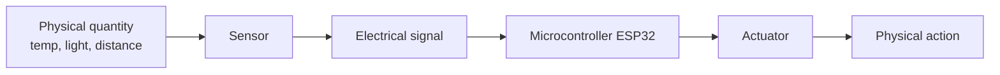
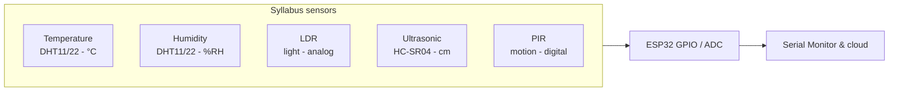
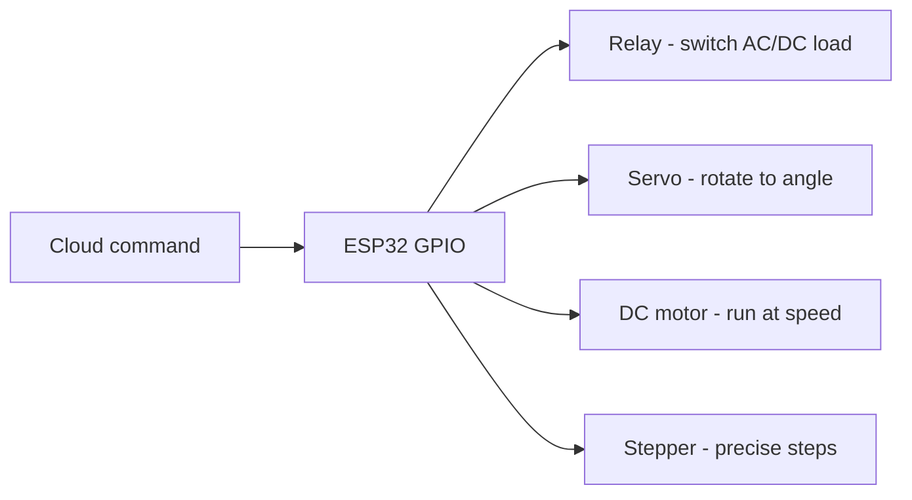

# UNIT 2 — IoT Sensors, Actuators and Hardware Platforms 🔧

> **Hands on Practice using IoT (DI05016071)** · **6 hrs · 25% weightage**
> **Covers syllabus sections:** 2.1 Introduction to Sensors · 2.2 Role of Sensors in IoT · 2.3 Classification of Sensors (Temperature, Humidity, LDR, Ultrasonic, PIR) · 2.4 Introduction to Actuators · 2.5 Role of Actuators · 2.6 Classification (Relay, Servo, DC, Stepper) · 2.7 Hardware Platforms (Arduino UNO, ESP32, Raspberry Pi)
> **Related practicals:** [P02](../practicals/writeups/P02_compare_hardware_platforms_esp32_pinout.md), [P04](../practicals/writeups/P04_external_led_blink_toggle.md), [P05](../practicals/writeups/P05_pir_ldr_sensor_interface.md), [P06](../practicals/writeups/P06_dht_temperature_humidity_sensor.md), [P07](../practicals/writeups/P07_ultrasonic_distance_sensor.md)

---

## 🧭 Chapter Roadmap

25% weightage — the **sensor/actuator theory** for every practical you will ever run in the lab. The exam loves "compare the sensors", "classify actuators", and "platform comparison" tables. Build them here once, reuse them forever.

```
UNIT 2: Sensors, Actuators & Hardware Platforms
├── 2.1 Introduction to Sensors                 ⭐ (transducer concept)
├── 2.2 Role of Sensors in IoT                  ⭐⭐ (sense→process→act loop)
├── 2.3 Classification of Sensors               ⭐⭐⭐ (5 sensors in detail)
│     ├── 2.3.1 Temperature sensor
│     ├── 2.3.2 Humidity sensor
│     ├── 2.3.3 LDR sensor
│     ├── 2.3.4 Ultrasonic sensor
│     └── 2.3.5 PIR motion sensor
├── 2.4 Introduction to Actuators               ⭐⭐
├── 2.5 Role of Actuators in IoT                ⭐⭐ (the "act" side)
├── 2.6 Classification of Actuators             ⭐⭐⭐ (Relay · Servo · DC · Stepper)
└── 2.7 Hardware Platforms                      ⭐⭐⭐ (UNO vs ESP32 vs Pi + ESP32 pinout)
      ├── 2.7.1 Arduino UNO
      ├── 2.7.2 ESP32 (dual-core, GPIO, pinout)
      └── 2.7.3 Raspberry Pi
```

### Learning outcomes — after this unit you can:
1. Define **sensor**, **actuator**, and **transducer** and give the IoT loop *sense → process → act*.
2. Classify the **5 sensors** in the syllabus and quote each one's output type, pins, and application.
3. Classify the **4 actuators** and pick the right one for a job (relay = switch, servo = angle, DC = speed, stepper = position).
4. Compare **Arduino UNO, ESP32 and Raspberry Pi** and justify when each is used.
5. Draw the **ESP32 pinout** and list its GPIO/ADC/PWM capabilities (exam + viva favourite).

---

## 2.1 Introduction to Sensors ⭐

> **Short definition (memorize):** A **sensor** is a device that **detects a physical quantity** (temperature, light, distance, motion, moisture) and **converts it into an electrical signal** (voltage, current, resistance) that a microcontroller can read.

Key vocabulary:
- **Transducer** — any device converting one form of energy to another (a sensor is a transducer; so is a speaker).
- **Analog sensor** — output is a continuous voltage (LDR divider → 0–4095 ADC). P05.
- **Digital sensor** — output is discrete HIGH/LOW or a protocol (PIR → HIGH/LOW; DHT → 40-bit single-wire). P05/P06.
- **Resolution / accuracy / range / response time** — the spec sheet numbers examiners love.



## 2.2 Role of Sensors in IoT ⭐⭐

Sensors are the **Sensing layer** (Unit 1) — the "eyes and ears" of IoT. Without them there is no data, no automation:

1. **Data acquisition** — convert the physical world into numbers.
2. **Enable automation** — decisions depend on sensor readings (pump ON when soil < threshold, P13).
3. **Monitoring & alerts** — dashboards and threshold alerts (P10–P13).
4. **Feed cloud analytics** — the data that ThingSpeak/Blynk graph comes from sensors.
5. **Close the loop** — sensor value → controller → actuator action (P14).

## 2.3 Classification of Sensors ⭐⭐⭐ (the five syllabus sensors)

| Sensor | Measures | Output to MCU | Pin/interface | Practical |
|---|---|---|---|---|
| **Temperature (DHT11/22, LM35, DS18B20)** | °C | Digital (1-wire / 40-bit) or analog | DATA pin | P06 |
| **Humidity (DHT11/22)** | %RH | Same single-wire frame | DATA pin | P06 |
| **LDR (photoresistor)** | Light intensity | Analog (voltage divider) | ADC pin | P05 |
| **Ultrasonic (HC-SR04)** | Distance | Time-of-flight pulse (TRIG/ECHO) | 2 GPIO | P07 |
| **PIR (HC-SR501)** | Infrared motion | Digital HIGH/LOW | GPIO | P05 |

### 2.3.1 Temperature sensor ⭐⭐
- **Working:** resistance/voltage changes with temperature (thermistor, or semiconductor band-gap in LM35/DHT).
- **DHT11:** 0–50 °C, ±2 °C, 1 °C resolution, digital, cheap — used all over this course.
- **DHT22:** −40–80 °C, ±0.5 °C, 0.1 °C resolution.
- **Applications:** weather station, greenhouse control, server-room monitoring, P14.

### 2.3.2 Humidity sensor ⭐⭐
- **Working:** moisture changes the capacitance/resistance of the sensing element; DHT returns relative humidity (%RH).
- **DHT11 spec:** 20–90 %RH, ±5 %.
- **Applications:** agriculture (P13/P14), HVAC, food storage, smart home comfort.

### 2.3.3 LDR (Light Dependent Resistor) ⭐⭐
- **Working:** resistance **decreases in bright light, increases in darkness** (CdS photoconductor).
- **Read via voltage divider** (LDR + 10 kΩ) → ADC (P05).
- **Applications:** street-light auto-control, P05, smart lighting (P14 idea).

### 2.3.4 Ultrasonic sensor (HC-SR04) ⭐⭐
- **Working:** emits 40 kHz pulses from TRIG; times the **echo**; `distance = (time × speed of sound)/2`.
- **Range:** 2–400 cm; needs 5 V; **ECHO output can be 5 V → use a divider to protect ESP32** (P07).
- **Applications:** tank/fill level (P11), parking sensors, obstacle avoidance.

### 2.3.5 PIR motion sensor (HC-SR501) ⭐⭐
- **Working:** detects changes in **infrared radiation** from warm bodies (passive — it does not emit).
- **Output:** HIGH when motion detected, LOW when still; two pots (sensitivity, delay) + H/L trigger jumper.
- **Applications:** security, smart-home occupancy (P05), automatic lights.



## 2.4 Introduction to Actuators ⭐⭐

> **Short definition:** An **actuator** converts an **electrical control signal into physical motion or action**. It is the "hands" of the IoT system — it makes something *happen*.

| | Sensors | Actuators |
|---|---|---|
| Direction | Physical world → electrical signal | Electrical signal → physical action |
| Analogy | Eyes/ears | Hands/muscles |
| Examples | DHT, PIR, LDR | Relay, servo, DC motor, stepper |

## 2.5 Role of Actuators in IoT ⭐⭐

1. **Execute decisions** — the controller's decision becomes an action (pump on, light on).
2. **Close the control loop** — sensor → decide → actuate → re-measure (hysteresis in P14).
3. **Provide remote control** — phone commands reach the actuator via cloud (P09, P12).
4. **Physical output** — motion, switching, positioning (fans, locks, valves, motors).



## 2.6 Classification of Actuators ⭐⭐⭐

| Actuator | Type of action | Control signal | Best for | Practical |
|---|---|---|---|---|
| **Relay** | Electrical ON/OFF switch | Digital HIGH/LOW | Switching pumps, fans, AC mains | P09, P14 |
| **Servo motor** | Rotates to a precise angle (0–180°) | PWM pulse width | Steering, pan/tilt, flaps | — |
| **DC motor** | Continuous rotation, speed control | PWM duty cycle + H-bridge | Wheels, fans, pumps | — |
| **Stepper motor** | Moves in discrete steps | Step/direction pulses | Printers, CNC, precise positioning | — |

### 2.6.1 Relay ⭐⭐
- An **electromagnetic switch**: a small coil current opens/closes isolated contacts (COM–NO/NC).
- Lets a 3.3 V ESP32 safely switch **230 V AC or 12 V DC loads**.
- ⚠️ **Most ESP32 relay boards are LOW-active** (drive IN LOW to energise) — inverted logic vs LEDs.
- Applications: pump control (P14), home appliances (P09).

### 2.6.2 Servo motor ⭐⭐
- Contains a DC motor + gearbox + feedback potentiometer; the controller sets the angle via a **PWM pulse** (~1 ms = 0°, ~1.5 ms = 90°, ~2 ms = 180°).
- Applications: robotic arms, camera tilt, window/door openers.

### 2.6.3 DC motor ⭐⭐
- Continuous rotation; speed set by **PWM duty cycle**, direction by an **H-bridge** (L298N/DRV8833) because a GPIO cannot supply motor current.
- Applications: drone motors, conveyor belts, robot wheels, water pumps.

### 2.6.4 Stepper motor ⭐⭐
- Moves in **fixed angular steps** (e.g., 1.8°/step = 200 steps/rev); position is repeatable without a sensor.
- Needs a **stepper driver** (A4988/ULN2003) and step/direction pulses.
- Applications: 3D printers, CNC, curtain/blind positioning.

## 2.7 Hardware Platforms for IoT ⭐⭐⭐

### 2.7.1 Arduino UNO
- 8-bit ATmega328P @ 16 MHz, 2 KB RAM, 32 KB Flash, 14 digital + 6 analog pins.
- **No Wi-Fi/Bluetooth** — needs shields. The teaching board for basic digital/analog I/O.

### 2.7.2 ESP32 (the star of this course)
- 32-bit, **dual-core** Xtensa LX6 @ 240 MHz, 520 KB SRAM, 4 MB Flash, **Wi-Fi + Bluetooth on-chip**.
- ~25 usable GPIO, **2 × 12-bit ADC**, 2 × 8-bit DAC, hardware **PWM (LEDC)** on most pins.
- Runs via Arduino IDE (Unit 3) or ESP-IDF/FreeRTOS.
- **Pinout essentials (memorise):**
  - Input-only ADC pins: **GPIO 34, 35, 36, 39** (no pull-up, no output).
  - Common safe outputs: **GPIO 4, 5, 18, 26** (LEDs, relays).
  - I²C: SDA GPIO 21, SCL GPIO 22. · SPI: MOSI 23, MISO 19, SCK 18, SS 5.
  - Onboard LED: GPIO 2. · All GPIO are **3.3 V logic**.

```
ESP32 DevKit V1 (30-pin) — key pins only
┌────────────────────────────────────────────┐
│ 3V3   GND   36  39  34  35  32  33  25  26│
│ 27   14   12   13  15   2   4   0   5  18 │
│ 19   21   22   23  (SDA=21 SCL=22)         │
│ RX0 TX0  EN   (USB)                       │
└────────────────────────────────────────────┘
       input-only: 34 35 36 39
```

### 2.7.3 Raspberry Pi
- A **full Linux computer** (4-core ARM, 1–8 GB RAM) with a 40-pin GPIO header.
- Can run databases, brokers, cameras, web servers — but needs an OS, more power, and is not a bare-metal controller.
- Role in IoT: **edge gateway / hub** aggregating ESP32 nodes.

### Comparison (the exam table)

| Feature | Arduino UNO | ESP32 | Raspberry Pi |
|---|---|---|---|
| Type | 8-bit MCU | 32-bit dual-core SoC | Linux computer |
| CPU / RAM | 16 MHz / 2 KB | 240 MHz / 520 KB | 4-core ARM / 1–8 GB |
| Wi-Fi/BT | ❌ | ✅ built-in | ✅ |
| ADC | 10-bit ×6 | 12-bit ×2 | none (add-on) |
| Best for | Basic I/O learning | IoT nodes with Wi-Fi | Edge computing / gateway |
| Cost | ~₹500 | ~₹600 | ~₹4,000 |

---

## 🧠 Deep-Dive Topics

### Deep Dive A: "sense → decide → act" with hysteresis (how P14 really works)
The loop that makes IoT "smart": read soil (sensor) → decide "dry" (controller) → switch relay (actuator) → water soaks in → read again. **Hysteresis** (P14 uses `SOIL_DRY = 2000` to turn ON but `SOIL_OK = 2600` to turn OFF) prevents the relay from chattering around a single threshold. This one concept answers half the viva questions on P13/P14.

### Deep Dive B: Choosing the right actuator for the job
- Need to switch 230 V? → **relay** (isolation). Need a camera to point at 90°? → **servo** (angle). Need a wheel to spin continuously? → **DC motor + H-bridge**. Need 3D-printer precision? → **stepper**. Exam questions usually give you a scenario and ask you to name the actuator — this decision table is the answer.

### Deep Dive C: ADC realities on ESP32
- 12-bit ADC = 0–4095 over 0–3.3 V, so each step ≈ 0.8 mV. The ESP32 ADC is **non-linear near the rails** and shares the ADC2 block with the Wi-Fi radio — which is why good designs (P05/P13) use **ADC1 pins (GPIO 34–39)** for sensors.

---

## 🚀 Beyond the Textbook

1. **A sensor alone is useless** — every sensor needs *conditioning* (voltage divider for LDR/soil, pull-up for DHT, level shifter for 5 V ECHO). The FOB-grade lab skill is reading the datasheet's "output" line.
2. **Sensors drift and lie** — DHT11 checksums catch corrupt frames (P06); filters/medians are used in industry. P07's NewPing library exists precisely to filter noisy echos.
3. **The relay is an electromagnetic actuator** — many students call it a "switch". Say "electromechanical actuator" in viva and you sound like you understand the taxonomy.
4. **ESP32 beats UNO on price in India** (~₹600 vs ~₹500) yet adds Wi-Fi + BT — the reason the syllabus chose it for all practicals.
5. **GPIO 0 is special** — holding it LOW during reset puts the chip in download/bootloader mode (P03's "hold BOOT" trick). Never use GPIO 0 as a plain output without knowing this.

---

## 🎯 High-Yield Exam Topics (likely GTU-style questions)

1. Define **sensor** and **actuator** with examples. (3–4 m) ⭐⭐⭐
2. Short note: **classification of sensors** (any four with working + application). (7 m) ⭐⭐⭐
3. Explain the working of **PIR motion sensor**. (3–4 m) ⭐⭐⭐
4. Explain the working of **ultrasonic distance sensor** with the distance formula. (4 m) ⭐⭐⭐
5. Short note: **actuators — relay, servo, DC, stepper**. (7 m) ⭐⭐⭐
6. **Compare Arduino UNO, ESP32 and Raspberry Pi** for IoT. (7 m) ⭐⭐⭐
7. Explain **ESP32 features** (dual-core, memory, GPIO, Wi-Fi/BT). (4–7 m) ⭐⭐⭐
8. Working principle of an **LDR** and its use in street lighting. (3–4 m) ⭐⭐
9. Difference between **analog and digital sensors**. (3 m) ⭐⭐
10. Explain **DHT11 vs DHT22** differences. (3 m) ⭐⭐
11. How does a **relay** let a 3.3 V MCU switch a 230 V load? (4 m) ⭐⭐
12. Why does ESP32 use **input-only pins GPIO 34–39**? (3 m) ⭐⭐

### ✅ Solved model answers (highest-yield)

**Q2. (7 m) — Short note: classification of sensors (with working & application).**
> **Temperature sensor (DHT11):** uses a thermistor/semiconductor whose resistance varies with temperature; returns °C as a 40-bit digital frame. Applications: weather stations, greenhouses. **Humidity sensor (DHT11/22):** senses moisture via a capacitive element; returns %RH; used in agriculture and HVAC. **LDR:** a CdS photoresistor whose resistance decreases in bright light; read via a voltage divider into an ADC; used for automatic street lighting. **Ultrasonic (HC-SR04):** emits 40 kHz pulses and times the echo; `distance = (time × speed of sound)/2`; used for tank level and parking sensors. **PIR (HC-SR501):** detects infrared changes from warm moving bodies; digital HIGH/LOW output; used for security and occupancy. Common principle: all five convert a physical quantity into an electrical signal readable by the ESP32.

**Q4. (4 m) — Working of ultrasonic sensor + formula.**
> The HC-SR04 has TRIG and ECHO pins. The ESP32 sends a 10 µs HIGH pulse on TRIG; the module emits 8 ultrasonic pulses at 40 kHz. When the waves reflect off an object and return, the sensor raises ECHO HIGH for the round-trip time `t`. Since sound travels at ~343 m/s (0.0343 cm/µs) and the wave goes out and back, the distance is: **`distance_cm = (t_µs / 2) × 0.0343`**. Range is 2–400 cm; the division by 2 is the classic trap — without it you get double the real distance.

**Q6. (7 m) — Compare Arduino UNO, ESP32 and Raspberry Pi.**
> **Arduino UNO:** an 8-bit ATmega328P microcontroller at 16 MHz with 2 KB RAM and 14 digital/6 analog pins; no networking on-chip; simple and cheap — best for basic sensor/LED teaching. **ESP32:** a 32-bit dual-core Xtensa LX6 SoC at 240 MHz with 520 KB SRAM, 4 MB flash and built-in Wi-Fi + Bluetooth; ~25 GPIO with 12-bit ADCs, DAC and hardware PWM — the ideal IoT *node*. **Raspberry Pi:** a full Linux single-board computer (4-core ARM, up to 8 GB RAM) with a 40-pin GPIO header; runs Python/Node and can act as a *gateway* aggregating ESP32 nodes, but consumes more power and needs an OS. Selection rule: UNO for basics, ESP32 for Wi-Fi IoT nodes, Pi for edge processing/gateways.

---

## ✍️ Practice Problems (self-test — answers hidden)

1. Classify the five syllabus sensors by output type (analog/digital) and give the pin interface for each.
2. Write the ultrasonic distance formula and explain why we divide by 2.
3. Which actuator would you choose for: (a) switching a 230 V fan, (b) pointing a camera at 45°, (c) wheels of a robot, (d) a 3D printer axis?
4. List four features of ESP32 (not specs of other boards).
5. Why are GPIO 34–39 called "input-only"? What does that mean for a sketch?
6. DHT11 vs DHT22 — give 4 differences.
7. Define transducer, sensor, actuator — and place each in the sense-process-act loop.
8. A relay is "LOW-active" on most ESP32 boards. What does that mean in code?

<details>
<summary>📌 Model solutions</summary>

1. DHT11/22 — digital (single-wire 40-bit), DATA pin; LDR — analog, ADC via divider; HC-SR04 — digital pulses (TRIG/ECHO); PIR — digital HIGH/LOW, GPIO.
2. `d = (t/2) × 0.0343` cm; sound travels out and back, so the half-time is the one-way distance.
3. (a) Relay, (b) Servo, (c) DC motor + H-bridge, (d) Stepper motor.
4. Dual-core 240 MHz · Wi-Fi + Bluetooth on-chip · 12-bit ADC (2 channels) · hardware PWM/LEDC on most pins · input-only ADC1 pins 34–39.
5. They are wired only to the ADC1 input block — no output driver, no pull-ups; you can only `analogRead()`/`digitalRead()` them.
6. Range (0–50 vs −40–80 °C), accuracy (±2 vs ±0.5 °C), resolution (1 vs 0.1 °C), sample rate (1 vs 2 Hz).
7. Transducer = any energy converter; sensor = transducer measuring a physical quantity; actuator = transducer producing motion; loop: sensor→controller→actuator.
8. The relay energises when the pin is LOW, so `digitalWrite(pin, LOW)` switches the load ON (inverted vs an LED).
</details>

---

## 📖 Glossary of Key Terms

| Term | Definition |
|---|---|
| **Sensor** | Device converting a physical quantity into an electrical signal |
| **Actuator** | Device converting a control signal into physical action |
| **Transducer** | Any device converting one form of energy to another |
| **Analog sensor** | Continuous voltage output read by ADC (LDR, soil) |
| **Digital sensor** | Discrete output / protocol (PIR, DHT) |
| **DHT11 / DHT22** | Digital temp+humidity sensors (accuracy/resolution differ) |
| **LDR** | Light-dependent resistor; resistance falls in light |
| **HC-SR04** | Ultrasonic distance sensor (TRIG/ECHO, 2–400 cm) |
| **PIR / HC-SR501** | Passive-infrared motion detector |
| **Relay** | Electromagnetic switch (COM/NO/NC); isolates load |
| **Servo motor** | PWM-controlled rotation to a set angle |
| **DC motor** | Continuous rotation; speed via PWM, direction via H-bridge |
| **Stepper motor** | Discrete angular steps; needs a driver |
| **H-bridge** | Circuit that reverses motor polarity for direction |
| **ADC** | Analog-to-digital converter (ESP32: 12-bit, 0–4095) |
| **PWM (LEDC)** | Pulse-width modulation; duty cycle controls power/speed |
| **Strapping pin** | GPIO affecting boot behaviour (GPIO 0, 12, 15) |
| **Arduino UNO** | 8-bit teaching microcontroller, no networking |
| **Raspberry Pi** | Linux single-board computer used as gateway/edge |
| **Hysteresis** | Two thresholds (ON/OFF) to prevent chattering |

---

## 🔗 Curated Resources (per concept)

**Sensors (official/data sources)**
- DHT11 datasheet (Aosong): https://www.mouser.com/datasheet/2/758/DHT11-Technical-Data-Sheet-Translated-Version-1143054.pdf
- HC-SR04 datasheet (SparkFun): https://cdn.sparkfun.com/datasheets/Sensors/Proximity/HCSR04.pdf
- PIR sensor guide (Adafruit): https://learn.adafruit.com/pir-passive-infrared-proximity-motion-sensor
- LDR / photocell guide (Adafruit): https://learn.adafruit.com/photocells

**Actuators**
- Relay guide (Electronics Hub): https://www.electronicshub.org/relay/
- Servo motor basics: https://www.jameco.com/Jameco/workshop/HowServoMotorsWork.html
- Stepper motor guide (Adafruit): https://learn.adafruit.com/all-about-stepper-motors

**Hardware platforms**
- Arduino UNO official: https://docs.arduino.cc/hardware/uno-rev3/
- ESP32 official docs (Espressif): https://docs.espressif.com/projects/esp-idf/en/latest/esp32/
- Raspberry Pi docs: https://www.raspberrypi.com/documentation/
- ESP32 pinout reference: https://randomnerdtutorials.com/esp32-pinout-reference-gpios/

**Videos (high yield)**
- Random Nerd Tutorials ESP32 playlists · Paul McWhorter Arduino/ESP32 course · DroneBot Workshop motor/sensor tutorials.

---

## 🎥 Video Study Guide (YouTube)

> Don't like reading? Me neither. This is your **structured video path** for the whole unit — better than the syllabus because it tells you *exactly what to search* and *what to watch first*, in a sensible order. Everything below is search keywords (they never rot like links do) + channels you can trust.

### 🧑🎓 Step 0 — Pick your learning style

| Style | You learn best by | Your path through this unit |
|---|---|---|
| 🎧 **Listener** | short, clear explainers | Watch 1 explainer per topic from the table below (3–8 min each) |
| 🛠️ **Builder** | wiring things yourself | Watch a sensor tutorial → then run [P05](../practicals/writeups/P05_pir_ldr_sensor_interface.md)–[P07](../practicals/writeups/P07_ultrasonic_distance_sensor.md) |
| 🔧 **Tinkerer** | experimenting & demos | Watch demo videos → swap sensors on the breadboard and compare |
| 🧠 **Deep Diver** | full theory, "why" | Watch the whole-unit playlists at the bottom (university-level depth) |
| 🧭 **Explorer** | breadth & curiosity | Watch "how X works" explainers first, then follow your curiosity |
| 🎓 **Academic** | exam marks | Watch the revision/GTU-style videos, then grind the High-Yield questions above |

### 🎬 Step 1 — Watch by topic (search these on YouTube)

| Topic | YouTube search keywords (copy-paste ready) | Best channels | Style served |
|---|---|---|---|
| What are sensors & actuators | `sensors and actuators explained` · `what is a transducer` · `sensors types and working` | RealPars, The Engineering Mindset, Edureka | 🎧 + 🧠 |
| Temperature & humidity (DHT) | `dht11 temperature humidity sensor tutorial` · `dht11 vs dht22 explained` · `esp32 dht11 serial monitor` | Random Nerd Tutorials, DroneBot Workshop, Core Electronics | 🛠️ Builder |
| LDR / light sensor | `ldr sensor working principle` · `ldr with esp32 arduino tutorial` · `photoresistor explained` | The Engineering Mindset, DroneBot Workshop | 🎧 + 🔧 |
| Ultrasonic HC-SR04 | `hc-sr04 ultrasonic sensor tutorial` · `how ultrasonic distance sensor works` · `esp32 hc-sr04 distance` | DroneBot Workshop, Core Electronics, Paul McWhorter | 🛠️ Builder |
| PIR motion sensor | `pir sensor working explained` · `hc-sr501 pir tutorial` · `esp32 pir motion sensor` | DroneBot Workshop, Random Nerd Tutorials | 🔧 + 🛠️ |
| Actuators: relay, servo, DC, stepper | `how a relay works` · `servo motor explained` · `dc motor with l298n h-bridge` · `stepper motor a4988 tutorial` | DroneBot Workshop, The Engineering Mindset, HowToMechatronics | 🛠️ + 🧠 |
| Arduino UNO vs ESP32 vs Raspberry Pi | `arduino vs esp32 vs raspberry pi` · `which board should i choose` · `esp32 pinout explained` | Andreas Spiess, Core Electronics, EEVblog | 🧭 Explorer |
| ESP32 deep dive | `esp32 dual core freertos` · `esp32 adc tutorial` · `esp32 pwm ledc` | Andreas Spiess, Random Nerd Tutorials | 🧠 Deep Diver |
| Whole-unit revision (exam mode) | `iot sensors actuators unit revision` · `esp32 features for exams` · `sensors actuators full course` | Neso Academy, Gate Smashers, edureka! | 🎓 Academic |

### 🎬 Step 2 — Full playlists (for Deep Divers & Academics)

1. **"Paul McWhorter — Arduino / ESP32 for beginners"** — the best structured hands-on course; watch the sensor and actuator lessons.
2. **"Random Nerd Tutorials — ESP32 projects playlist"** — every sensor in this unit wired to ESP32 with full sketches.
3. **"DroneBot Workshop — motors & sensors"** — superb demos of relays, servos, DC and stepper motors.

### 🎬 Step 3 — Proof you got it (5 min)

- Without looking: name the output (analog/digital) and pin interface of all five sensors.
- Explain to a friend *why* HC-SR04 divides by 2 — if the formula makes sense, the concept is yours.
- Pick an actuator for a ceiling fan, a robot arm, and a 3D printer, and justify each choice.

---

*Next: [UNIT 3 — Introduction to ESP32 & Development with Arduino IDE](./UNIT_3_ESP32_and_Arduino_IDE_Development.md)*
