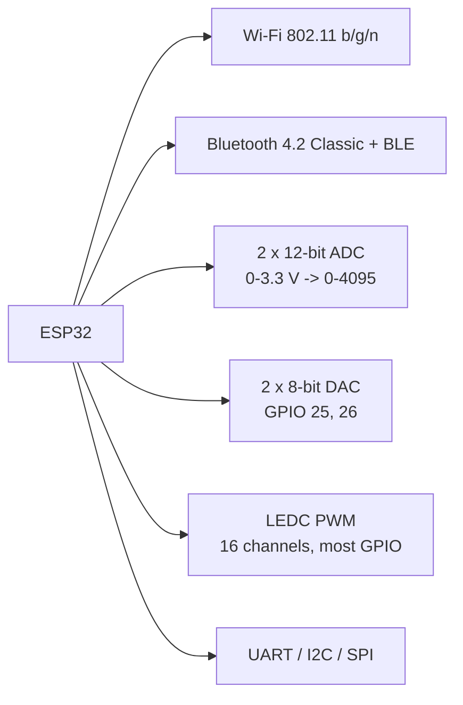
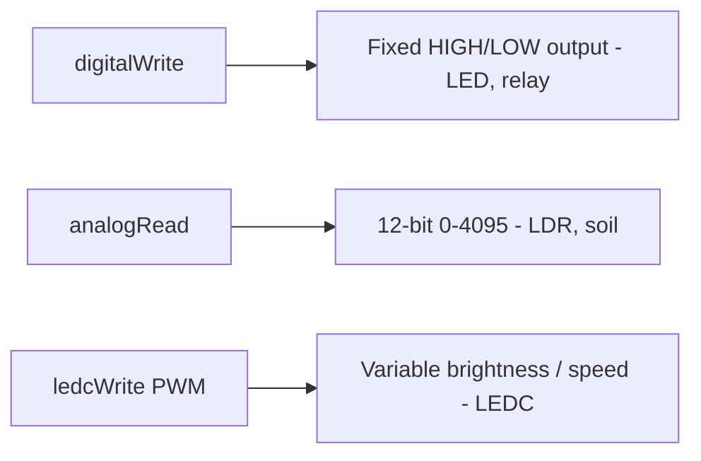

# UNIT 3 — Introduction to ESP32 & Development with Arduino IDE ⚡

> **Hands on Practice using IoT (DI05016071)** · **9 hrs · 35% weightage**
> **Covers syllabus sections:** 3.1 Introduction to ESP32 (overview, features, dual-core, memory, peripherals) · 3.2 Development Environment (Arduino IDE, board package, drivers, ports) · 3.3 GPIO Programming (pins, digital I/O, ADC, PWM) · 3.4 Core Libraries & Wi-Fi Programming · 3.5 Basic Interfacing (LED, push button, DHT sensor, actuators)
> **Related practicals:** [P03](../practicals/writeups/P03_arduino_ide_setup_esp32.md), [P04](../practicals/writeups/P04_external_led_blink_toggle.md), [P05](../practicals/writeups/P05_pir_ldr_sensor_interface.md), [P06](../practicals/writeups/P06_dht_temperature_humidity_sensor.md), [P07](../practicals/writeups/P07_ultrasonic_distance_sensor.md)

---

## 🧭 Chapter Roadmap

**35% — the heaviest unit in the subject.** Almost every practical (P03–P07) is pure ESP32 + Arduino IDE. If you can draw the ESP32 feature list, explain `setup()`/`loop()`, read a pin, and connect Wi-Fi, you have already scored the practical ESE. Nail this unit.

```
UNIT 3: ESP32 & Arduino IDE
├── 3.1 Introduction to ESP32                  ⭐⭐⭐ (feature list = guaranteed)
│     ├── 3.1.1 Overview & features
│     ├── 3.1.2 Dual-core processor
│     ├── 3.1.3 Memory organisation
│     └── 3.1.4 Built-in peripherals (Wi-Fi, BT, ADC, DAC, PWM)
├── 3.2 Development Environment                ⭐⭐⭐ (P03: step-by-step setup)
│     ├── 3.2.1 Installing Arduino IDE
│     ├── 3.2.2 Board package & drivers
│     └── 3.2.3 IDE interface & tools
├── 3.3 GPIO Programming                       ⭐⭐⭐ (setup()/loop() + pins)
│     ├── 3.3.1 GPIO pins, numbering
│     ├── 3.3.2 Digital input & output
│     ├── 3.3.3 Analog input (ADC)
│     └── 3.3.4 Analog output / PWM
├── 3.4 Core Libraries & Wi-Fi                 ⭐⭐⭐ (WiFi.h: connect + IP)
│     ├── 3.4.1 ESP32 core libraries & Library Manager
│     └── 3.4.2 Wi-Fi library, status, IP
└── 3.5 Basic Interfacing Concepts             ⭐⭐⭐ (LED · button · DHT · relay)
      └── 3.5.1-3.5.4 The four basic circuits
```

### Learning outcomes — after this unit you can:
1. List and explain **ESP32 features**: dual-core CPU, memory, and the built-in Wi-Fi/BT/ADC/DAC/PWM peripherals.
2. Recreate the **Arduino IDE setup** for ESP32 from memory (P03): board URL → Boards Manager → driver → port.
3. Explain `setup()` vs `loop()`, `pinMode()`/`digitalWrite()`/`digitalRead()`/`analogRead()`, and **PWM**.
4. Write a Wi-Fi connection block and explain `WL_CONNECTED`, `localIP()` and reconnection.
5. Draw the four **basic interfacing circuits**: LED, push button, DHT, relay.

---

## 3.1 Introduction to ESP32 ⭐⭐⭐

### 3.1.1 Overview & features
The **ESP32** is Espressif Systems' flagship **system-on-chip (SoC)** for IoT: a low-cost, low-power microcontroller with **Wi-Fi and Bluetooth on the same die**.

| Feature | Spec (ESP32 / DevKit V1) |
|---|---|
| CPU | 2 × Xtensa LX6 32-bit cores @ up to 240 MHz |
| SRAM | 520 KB |
| Flash | 4 MB (on DevKit) |
| Wi-Fi | 802.11 b/g/n (2.4 GHz) |
| Bluetooth | BT 4.2 Classic + BLE |
| ADC | 2 × 12-bit SAR (0–4095) |
| DAC | 2 × 8-bit (GPIO 25, 26) |
| PWM | LEDC: 16 channels, on most pins |
| Interfaces | UART×3, I²C×2, SPI×3, I²S, CAN, touch |
| Operating voltage | 3.3 V |
| Deep sleep | ~10 µA |
| Price | ≈ ₹400–800 (DevKit) |

### 3.1.2 Dual-core processor architecture ⭐⭐⭐ (viva favourite)
Two Xtensa LX6 cores, both 32-bit, clocked up to 240 MHz, sharing memory and peripherals:

| Core | Nickname | Job |
|---|---|---|
| **Core 0** | PRO_CPU (protocol) | Wi-Fi / Bluetooth protocol stacks |
| **Core 1** | APP_CPU (application) | Runs your Arduino `loop()` |

**Why it matters:** the Wi-Fi stack never blocks your sensor code — that is why an ESP32 can stream sensor data (P08) while still responding instantly to MQTT commands (P09). Under the hood, **FreeRTOS** schedules tasks across both cores.

### 3.1.3 Memory organization of ESP32
```
ESP32 memory map (simplified)
┌─────────────────────────────────────────┐
│ Internal SRAM: 520 KB  (data + stack)   │
│  - 320 KB data SRAM                     │
│  - 128 KB cache/program                  │
│  - 8 KB RTC fast/slow (deep sleep data)  │
├─────────────────────────────────────────┤
│ External Flash: 4 MB (DevKit)           │
│  - holds sketch + SPIFFS/LittleFS files │
│  - partitioned: bootloader/app/OTA      │
└─────────────────────────────────────────┘
```
- Variables live in **SRAM** (lost on power-off); sketches and files live in **Flash** (persistent).
- **4 MB Flash is partitioned** (bootloader + app + OTA) — visible in Arduino IDE under **Tools → Partition Scheme**.

### 3.1.4 Built-in peripherals: Wi-Fi, Bluetooth, ADC, DAC, PWM ⭐⭐⭐



| Peripheral | Purpose | Code call |
|---|---|---|
| **Wi-Fi** | Connect to networks / internet | `WiFi.begin(ssid, pass)` |
| **Bluetooth** | BLE beacons/health wearables | `BLEDevice` lib |
| **ADC** | Read analog sensors (LDR, soil) | `analogRead(pin)` → 0–4095 |
| **DAC** | True analog voltage out (audio) | `dacWrite(pin, val)` |
| **PWM** | Fake analog: LED dim, servo, motor speed | `ledcSetup()` / `ledcWrite()` |

## 3.2 ESP32 Development Environment ⭐⭐⭐ (the P03 walkthrough)

### 3.2.1 Installing Arduino IDE
Download Arduino IDE 2.x from **arduino.cc/software** (Windows/macOS/Linux). Free, cross-platform, bundles a code editor, compiler, uploader and Serial Monitor.

### 3.2.2 Configuring for ESP32 — the two magic steps (memorize!)

| Step | What you do | Where |
|---|---|---|
| 1 | Add the Espressif board URL | **File → Preferences → Additional boards manager URLs** → `https://espressif.github.io/arduino-esp32/package_esp32_index.json` |
| 2 | Install the board package | **Tools → Board → Boards Manager → search `esp32` → Install "esp32 by Espressif"** |
| 3 | Install the USB driver | CP2102 (Silicon Labs) or CH340 (WCH), depending on the board's USB-UART chip |
| 4 | Select board + port | **Tools → Board → ESP32 Dev Module** · **Tools → Port → COMxx** |
| 5 | Verify | Upload **Blink** (onboard LED = GPIO 2) |

> ⚠️ **Boot-mode gotcha:** if upload fails with "Failed to connect to ESP32", hold the **BOOT** (GPIO 0) button while uploading, or lower Upload Speed to 115200.

### 3.2.3 Arduino IDE interface and tools
- **Sketch editor** — tabbed `.ino` files.
- **Verify (✓)** — compiles locally.
- **Upload (→)** — compiles and flashes over USB.
- **Serial Monitor / Serial Plotter** — live text / graph from `Serial.print()` (the "expected output" of P04–P07).
- **Library Manager** — installs "DHT sensor library by Adafruit", "NewPing", "PubSubClient", "Blynk" (used in every practical).

## 3.3 GPIO Programming using ESP32 ⭐⭐⭐

### 3.3.1 GPIO pins & numbering
- GPIOs are numbered **GPIO0–GPIO39** (the silkscreen number = the GPIO number; there is no separate Arduino-style mapping).
- **3.3 V logic**, most are digital I/O with optional internal pull-ups/pull-downs.
- **Special pins to respect:**

| Pin(s) | Constraint |
|---|---|
| 34, 35, 36, 39 | **Input-only** (no output, no pull-up) |
| 0, 12, 15 | **Strapping pins** — affect boot behaviour |
| 1, 3 | UART0 (Serial) — used for programming |
| 2 | Onboard LED (DevKit V1) |

### 3.3.2 Digital input & digital output ⭐⭐⭐
The four functions that power every practical:

```cpp
pinMode(pin, OUTPUT);              // configure as output (P04 LED)
digitalWrite(pin, HIGH);           // drive 3.3 V
digitalWrite(pin, LOW);            // drive 0 V

pinMode(pin, INPUT);               // configure as input (P05 PIR)
int val = digitalRead(pin);        // HIGH or LOW
```

### 3.3.3 Analog input using ADC ⭐⭐⭐
- `analogRead(pin)` → **0–4095** (12-bit) for 0–3.3 V.
- Use **ADC1 pins (GPIO 32–39)** for sensors to avoid Wi-Fi interference (ADC2 is shared with the radio).
- Example: LDR divider on GPIO 34 → `analogRead(34)` (P05).

### 3.3.4 Analog output / PWM concepts ⭐⭐⭐
- The ESP32 has **no analog voltage output on most pins** — it fakes it with **PWM (LEDC)**:
  - `ledcSetup(channel, freq, resolution)` → `ledcAttachPin(pin, channel)` → `ledcWrite(channel, duty)`.
  - Duty 0–255 (8-bit) → average voltage 0–3.3 V → LED brightness / motor speed.
- True analog out exists on only **GPIO 25 & 26 (DAC)**.



## 3.4 ESP32 Core Libraries and Wi-Fi Programming ⭐⭐⭐

### 3.4.1 ESP32 core libraries & Library Manager
Installing "esp32 by Espressif" adds the **core libraries** you `#include`:
- `WiFi.h` — connect to networks.
- `HTTPClient.h` — HTTP GET/POST (P10, P11, P13).
- `Wire.h` — I²C (I2C sensors).
- `SPI.h` — SPI.
- `BluetoothSerial.h` — classic BT serial.

**Library Manager** (`Tools → Manage Libraries`) installs third-party libs — exact names used in this course:
| Library | Used for |
|---|---|
| DHT sensor library by Adafruit (+ Unified Sensor) | P06, P08, P10, P12–P14 |
| NewPing by Tim Eckel | P07, P11 |
| PubSubClient by Nick O'Leary | P08, P09, P14 |
| Blynk by Volodymyr Shymanskyy | P12 |

### 3.4.2 Wi-Fi library: connecting + checking status ⭐⭐⭐ (the block to memorise)

```cpp
#include <WiFi.h>
const char* ssid = "YOUR_WIFI_SSID";
const char* password = "YOUR_WIFI_PASSWORD";

WiFi.begin(ssid, password);                 // start connecting
while (WiFi.status() != WL_CONNECTED) {     // wait for connection
  delay(500);
  Serial.print(".");
}
Serial.println(WiFi.localIP());             // print assigned IP
```

| Function | Meaning |
|---|---|
| `WiFi.begin(ssid, pass)` | Start connecting (non-blocking) |
| `WiFi.status()` | Returns `WL_CONNECTED` when online |
| `WiFi.localIP()` | The IP address assigned to the ESP32 |
| `WiFi.disconnect()` / `WiFi.reconnect()` | Manual control / retry |
| `WiFi.mode(WIFI_STA)` | Station mode (connect to a router) |

> 💡 **Auto-reconnect pattern** (used by P08/P09/P14): wrap MQTT in a `reconnect()` loop that retries while `WiFi.status() != WL_CONNECTED`.

## 3.5 Basic Interfacing Concepts ⭐⭐⭐ (the four starter circuits)

### 3.5.1 LED interfacing (P04)
`GPIO 26 → 220 Ω → LED anode → LED cathode → GND`. Current limited by the resistor; `digitalWrite(26, HIGH/LOW)`.

### 3.5.2 Push button interfacing
```
3V3 ── button ── GPIO 4 ── 10 kΩ ── GND
(press → GPIO reads HIGH; pull-down keeps it LOW when idle)
```
Or use the internal pull-up: `pinMode(4, INPUT_PULLUP)` and read LOW when pressed. Debounce with `delay(50)`.

### 3.5.3 Sensor interfacing — temperature & humidity (P06)
`DHT DATA → GPIO 4` with a **4.7 kΩ–10 kΩ pull-up** to 3V3; read via the Adafruit DHT library; **≥ 2 s between reads**.

### 3.5.4 Actuator interfacing basics (P09/P14)
`GPIO 26 → Relay IN`; relay contacts switch the load (pump/fan). Most boards are **LOW-active** — `digitalWrite(pin, LOW)` = load ON. For motors: **H-bridge** (direction) + PWM (speed).

---

## 🧠 Deep-Dive Topics

### Deep Dive A: The two cores and FreeRTOS — what the Arduino core hides
When you write `setup()`/`loop()`, the Arduino-ESP32 core runs your code on **Core 1** while **Core 0** quietly runs the Wi-Fi/BT protocol tasks. The core even allows real parallelism via `xTaskCreatePinnedToCore()`. For viva: "the Wi-Fi stack runs on Core 0, my loop on Core 1 — that's why networking doesn't block sensing."

### Deep Dive B: Pull-ups and the input-only pins — wiring mistakes that break sketches
- GPIO 34–39 have **no internal pull-ups**, so a floating LDR/button reads random values — always add an external resistor or use a voltage divider.
- DHT's DATA line needs an **external pull-up** (open-drain protocol).
- Push buttons work best with `INPUT_PULLUP` (active-LOW) to avoid external resistors.

### Deep Dive C: Why PWM, not true analog?
LEDs/motors want a variable *power*, not a variable *voltage*. PWM chops the 3.3 V rail at high frequency and the *average* determines brightness/speed. The ESP32's 16 LEDC channels let you dim LEDs and drive servos/motors from any digital pin — with **true** DAC only on GPIO 25/26.

### Deep Dive D: The boot sequence — why "hold BOOT" works (P03)
At reset, the strapping pins (notably **GPIO 0**) are sampled: if GPIO 0 is held LOW, the chip enters **download mode** and the flasher can write new firmware; otherwise it boots the app from flash. That is the entire reason the "hold BOOT while uploading" trick works.

---

## 🚀 Beyond the Textbook

1. **The ESP32 is an SoC, not "just a chip"** — Wi-Fi/BT radio, dual CPUs, crypto accelerator, touch and CAN share one die. Espressif's ESP-IDF (C framework) is the professional alternative to Arduino.
2. **Why no `analogWrite()` on ESP32:** the Arduino UNO function does not exist in the ESP32 core — you must use `ledcWrite()`. A common compile error students hit (and a great viva anecdote).
3. **OTA updates** (over-the-air) are built into the ESP32 partition scheme — real products push firmware updates over Wi-Fi, not USB. Mentioning OTA in a "deployment challenge" answer (Unit 1) scores extra.
4. **`WiFi.status()` vs MQTT `connected()`:** Wi-Fi being up does NOT mean the broker is reachable — P08's `reconnect()` loop checks MQTT separately. Two different layers of connectivity!
5. **The 15-second ThingSpeak limit is a cloud constraint, not hardware** — the ESP32 can publish every second; the platform throttles. Know which layer imposes which limit (viva favourite).

---

## 🎯 High-Yield Exam Topics (likely GTU-style questions)

1. Short note: **features of ESP32**. (7 m) ⭐⭐⭐
2. Explain the **dual-core architecture** of ESP32. (4 m) ⭐⭐⭐
3. Explain the **memory organization** of ESP32. (4–7 m) ⭐⭐⭐
4. Short note: **built-in peripherals** of ESP32 (Wi-Fi, BT, ADC, DAC, PWM). (7 m) ⭐⭐⭐
5. Write the steps to **configure Arduino IDE for ESP32** and install drivers. (4–7 m) ⭐⭐⭐ (≈ P03)
6. Explain **`setup()` and `loop()`** with a blink example. (3–4 m) ⭐⭐⭐ (≈ P04)
7. Explain **digital input and output** programming with examples. (4 m) ⭐⭐⭐ (≈ P04/P05)
8. Explain **analog input using ADC** in ESP32. (4 m) ⭐⭐⭐ (≈ P05)
9. Explain **PWM / analog output** concepts in ESP32. (4 m) ⭐⭐⭐
10. Write the **Wi-Fi connection code** for ESP32 and explain the status functions. (4–7 m) ⭐⭐⭐ (≈ P08)
11. How is **library management** done in Arduino IDE? Name the libraries used in this course. (3–4 m) ⭐⭐
12. Explain the **input-only pins and strapping pins** of ESP32. (3 m) ⭐⭐

### ✅ Solved model answers (highest-yield)

**Q1. (7 m) — Short note: features of ESP32.**
> The ESP32 is Espressif's IoT SoC. Key features: **(1) Dual-core CPU** — two Xtensa LX6 cores up to 240 MHz (Core 0 runs Wi-Fi/BT, Core 1 runs the user program). **(2) Memory** — 520 KB SRAM and, on DevKits, 4 MB external flash with a partitionable layout (app + OTA). **(3) Wireless** — 802.11 b/g/n Wi-Fi and Bluetooth 4.2 Classic + BLE on-chip. **(4) Analogue peripherals** — two 12-bit SAR ADCs (0–3.3 V → 0–4095), two 8-bit DACs (GPIO 25/26). **(5) PWM (LEDC)** — 16 channels on most GPIOs for LED dimming, servos and motor speed. **(6) Interfaces** — UART×3, I²C×2, SPI×3, I²S, CAN, and capacitive touch. **(7) Low power** — deep sleep ~10 µA for battery nodes. **(8) Cost** — under ₹600, making it the standard IoT node in this course.

**Q5. (4–7 m) — Configure Arduino IDE for ESP32 + install drivers.**
> (1) Install Arduino IDE 2.x from arduino.cc. (2) In **File → Preferences**, paste the Espressif board-manager URL `https://espressif.github.io/arduino-esp32/package_esp32_index.json` into "Additional boards manager URLs". (3) In **Tools → Board → Boards Manager**, search `esp32` and install **"esp32 by Espressif Systems"**. (4) Install the correct **USB-to-serial driver**: CP210x (Silicon Labs) or CH340 (WCH), depending on the chip near the board's USB port. (5) Connect the board, select **Tools → Board → ESP32 Dev Module** and the matching **Port**. (6) Upload the Blink example (onboard LED on GPIO 2) to verify. If upload fails, hold the **BOOT** button or reduce the upload speed.

**Q10. (4–7 m) — Wi-Fi connection code for ESP32 with status functions.**
> ```cpp
> #include <WiFi.h>
> const char* ssid = "NETWORK";
> const char* password = "PASSWORD";
> void setup() {
>   Serial.begin(115200);
>   WiFi.begin(ssid, password);              // start connecting
>   while (WiFi.status() != WL_CONNECTED) {  // wait until online
>     delay(500);
>     Serial.print(".");
>   }
>   Serial.print("IP: ");
>   Serial.println(WiFi.localIP());          // show assigned IP
> }
> ```
> Explanation: `WiFi.begin()` starts a non-blocking connection; `WiFi.status()` returns `WL_CONNECTED` once joined; `WiFi.localIP()` gives the DHCP-assigned address printed on the Serial Monitor. Real sketches (P08/P09) wrap this in a `reconnect()` loop so the device reconnects automatically if the network drops.

---

## ✍️ Practice Problems (self-test — answers hidden)

1. List 6 ESP32 features and state which two make it "IoT-ready" over the Arduino UNO.
2. What is stored in SRAM vs Flash? Why does `millis()` reset on reboot but your sketch does not?
3. Which pins are input-only, and why does P05/P13 deliberately use GPIO 34?
4. Write the code to read a push button with an internal pull-up and print PRESSED/RELEASED.
5. Why doesn't `analogWrite()` compile on ESP32? What do you use instead?
6. Draw the ESP32 memory map (SRAM / RTC / external flash) and label partitions.
7. A sketch connects to Wi-Fi but MQTT still fails — what is the difference between `WiFi.status()` and `client.connected()`?
8. What is a strapping pin and why does holding GPIO 0 LOW at boot enter download mode?

<details>
<summary>📌 Model solutions</summary>

1. Dual-core 240 MHz, 520 KB SRAM, Wi-Fi b/g/n, BT+BLE, 12-bit ADC ×2, 8-bit DAC ×2, LEDC PWM, UART/I²C/SPI, deep sleep, low cost. IoT-ready = on-chip **Wi-Fi + Bluetooth**.
2. SRAM = volatile variables (lost on reset); Flash = the program + partitions (persistent). `millis()` is a counter in RAM → resets; the sketch lives in flash → survives.
3. GPIO 34, 35, 36, 39. GPIO 34 is an ADC1 input-only pin — avoids Wi-Fi/ADC2 conflicts and cannot be damaged by a sensor output.
4. `pinMode(4, INPUT_PULLUP); int v = digitalRead(4); if (v == LOW) Serial.println("PRESSED");` (active-LOW).
5. The ESP32 core has no `analogWrite()` — use `ledcSetup(ch, freq, res); ledcAttachPin(pin, ch); ledcWrite(ch, duty)`.
6. 520 KB SRAM (data/stack), 8 KB RTC RAM, 4 MB external flash partitioned into bootloader / app / OTA / filesystem.
7. `WiFi.status()` = link to the router; `client.connected()` = MQTT link to the broker. Wi-Fi up ≠ broker reachable (that's P08's `reconnect()`).
8. A pin sampled at reset to select boot mode; GPIO 0 LOW = download (flash) mode, HIGH = normal boot.
</details>

---

## 📖 Glossary of Key Terms

| Term | Definition |
|---|---|
| **ESP32** | Espressif IoT SoC: dual-core LX6 + Wi-Fi/BT on-chip |
| **DevKit V1** | Common 30-pin ESP32 development board |
| **Core 0 / Core 1** | Protocol core (Wi-Fi/BT) / application core (user code) |
| **SRAM** | Volatile memory holding runtime variables (520 KB) |
| **Flash** | Persistent storage (4 MB), holds sketch + partitions |
| **Partition scheme** | Flash layout: bootloader, app, OTA, filesystem |
| **ADC** | Analog-to-digital converter (12-bit, 0–4095) |
| **DAC** | Digital-to-analog converter (8-bit, GPIO 25/26) |
| **PWM / LEDC** | Pulse-width modulation for dimming/speed/servos |
| **Strapping pin** | GPIO sampled at boot (0, 12, 15) that selects boot mode |
| **Input-only pin** | GPIO 34–39: read-only, no pull-up, no output |
| **Boards Manager URL** | Espressif JSON link enabling ESP32 support in Arduino IDE |
| **CP2102 / CH340** | USB-UART bridge chips whose drivers are needed |
| **Sketch** | An Arduino program (`.ino`) with `setup()` + `loop()` |
| **Serial Monitor** | IDE tool showing `Serial.print()` output at 115200 baud |
| **Library Manager** | IDE tool to install libraries (DHT, NewPing, PubSubClient, Blynk) |
| **`WL_CONNECTED`** | Status returned by `WiFi.status()` when joined to a network |
| **`localIP()`** | Returns the ESP32's assigned IP address |
| **`INPUT_PULLUP`** | Enables the internal pull-up resistor for a pin |
| **`ledcWrite()`** | Writes a PWM duty cycle to an LEDC channel |

---

## 🔗 Curated Resources (per concept)

**Official ESP32 docs (Espressif)**
- ESP32 overview & datasheet: https://www.espressif.com/en/products/socs/esp32
- ESP-IDF programming guide: https://docs.espressif.com/projects/esp-idf/en/latest/esp32/
- Arduino-ESP32 core docs: https://docs.espressif.com/projects/arduino-esp32/en/latest/
- Espressif board-manager JSON (the URL from P03): https://espressif.github.io/arduino-esp32/package_esp32_index.json

**Arduino IDE**
- Arduino IDE download: https://www.arduino.cc/en/software
- Arduino language reference: https://www.arduino.cc/reference/en/

**Drivers**
- CP210x drivers (Silicon Labs): https://www.silabs.com/developers/usb-to-uart-bridge-vcp-drivers
- CH340 driver (WCH): https://www.wch-ic.com/downloads/CH341SER_ZIP.html

**Tutorials**
- ESP32 getting started (Random Nerd Tutorials): https://randomnerdtutorials.com/getting-started-with-esp32/
- ESP32 pinout reference: https://randomnerdtutorials.com/esp32-pinout-reference-gpios/
- ESP32 ADC (Random Nerd Tutorials): https://randomnerdtutorials.com/esp32-adc-analog-read-arduino-ide/
- ESP32 PWM (Random Nerd Tutorials): https://randomnerdtutorials.com/esp32-pwm-arduino-ide/

**Books (from GTU syllabus)**
- Rajkamal, *Internet of Things: Architecture and Design Principles*, McGraw Hill, 2017.
- Rahul Dubey, *An Introduction to Internet of Things: Connecting Devices, Edge Gateway, and Cloud*, 2019.

**Videos (high yield)**
- Andreas Spiess ESP32 deep-dives · DroneBot Workshop ESP32 courses · Random Nerd Tutorials ESP32 playlists.

---

## 🎥 Video Study Guide (YouTube)

> Don't like reading? Me neither. This is your **structured video path** for the whole unit — better than the syllabus because it tells you *exactly what to search* and *what to watch first*, in a sensible order. Everything below is search keywords (they never rot like links do) + channels you can trust.

### 🧑🎓 Step 0 — Pick your learning style

| Style | You learn best by | Your path through this unit |
|---|---|---|
| 🎧 **Listener** | short, clear explainers | Watch 1 explainer per topic from the table below (3–8 min each) |
| 🛠️ **Builder** | wiring things yourself | Watch the setup video → then run [P03](../practicals/writeups/P03_arduino_ide_setup_esp32.md)–[P07](../practicals/writeups/P07_ultrasonic_distance_sensor.md) and break them |
| 🔧 **Tinkerer** | experimenting & demos | Watch demo videos → change pins/values and re-upload the practical sketches |
| 🧠 **Deep Diver** | full theory, "why" | Watch the whole-unit playlists at the bottom (university-level depth) |
| 🧭 **Explorer** | breadth & curiosity | Watch the "ESP32 vs other boards" explainers first, then follow your curiosity |
| 🎓 **Academic** | exam marks | Watch the revision/GTU-style videos, then grind the High-Yield questions above |

### 🎬 Step 1 — Watch by topic (search these on YouTube)

| Topic | YouTube search keywords (copy-paste ready) | Best channels | Style served |
|---|---|---|---|
| What is an ESP32 | `esp32 explained` · `esp32 features specifications` · `what can you do with esp32` | Andreas Spiess, DroneBot Workshop, Core Electronics | 🧭 + 🎧 |
| ESP32 vs other boards | `esp32 vs arduino vs raspberry pi` · `which board should i choose for iot` | Andreas Spiess, Core Electronics, EEVblog | 🧭 Explorer |
| Arduino IDE setup for ESP32 | `install esp32 in arduino ide` · `esp32 board manager install` · `cp2102 ch340 driver install` | Random Nerd Tutorials, DroneBot Workshop | 🛠️ Builder |
| setup() / loop() & blink | `arduino setup and loop explained` · `esp32 blink onboard led tutorial` · `arduino programming basics` | Paul McWhorter, Programming Electronics Academy | 🛠️ + 🎧 |
| Digital input/output | `arduino digital read button tutorial` · `esp32 digitalwrite digitalread` · `push button pull up pull down` | Paul McWhorter, DroneBot Workshop | 🔧 + 🛠️ |
| ADC & analog input | `esp32 analog read adc tutorial` · `adc explained arduino` · `esp32 adc input only pins` | Random Nerd Tutorials, Andreas Spiess | 🧠 + 🛠️ |
| PWM & analog output | `pwm explained arduino` · `esp32 pwm ledc tutorial` · `dim an led with pwm` | The Engineering Mindset, DroneBot Workshop | 🎧 + 🛠️ |
| Wi-Fi on ESP32 | `esp32 wifi connect tutorial` · `esp32 wifi library localip` · `esp32 reconnect wifi auto` | Random Nerd Tutorials, DroneBot Workshop | 🛠️ Builder |
| Dual core & FreeRTOS | `esp32 dual core freertos tutorial` · `esp32 multitasking` · `esp32 cores explained` | Andreas Spiess, G6EJD | 🧠 Deep Diver |
| Whole-unit revision (exam mode) | `esp32 features exam notes` · `esp32 unit 3 diploma` · `arduino ide setup esp32 full lecture` | Neso Academy, Gate Smashers, edureka! | 🎓 Academic |

### 🎬 Step 2 — Full playlists (for Deep Divers & Academics)

1. **"Random Nerd Tutorials — ESP32 Tutorials"** — the closest thing to this unit's practicals: setup, GPIO, ADC, PWM, Wi-Fi, every sensor.
2. **"Andreas Spiess — ESP32 and ESP8266 deep dives"** — the *why* behind the hardware: dual cores, low power, Wi-Fi internals.
3. **"Paul McWhorter — Arduino/ESP32 full course"** — a structured beginner-to-intermediate path for builders.

### 🎬 Step 3 — Proof you got it (5 min)

- Recite the ESP32 feature list from memory in 30 seconds.
- Re-draw the Arduino IDE setup flow (URL → Boards Manager → driver → port) on paper.
- Explain to a friend why "hold BOOT" fixes an upload failure — if you can, the boot sequence is yours.

---

*Next: [UNIT 4 — IoT Communication Protocols and Networking](./UNIT_4_IoT_Communication_Protocols_and_Networking.md)*
