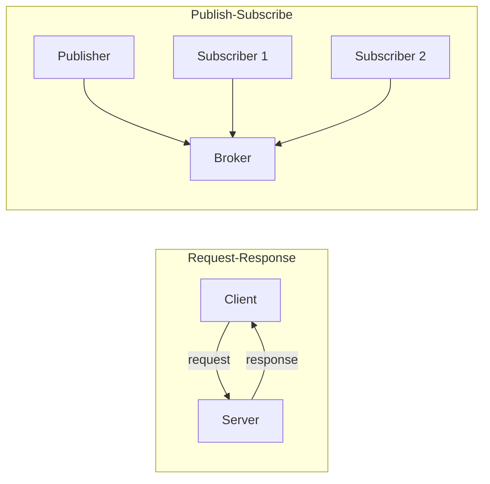
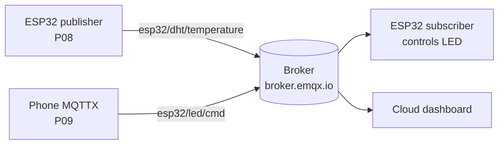
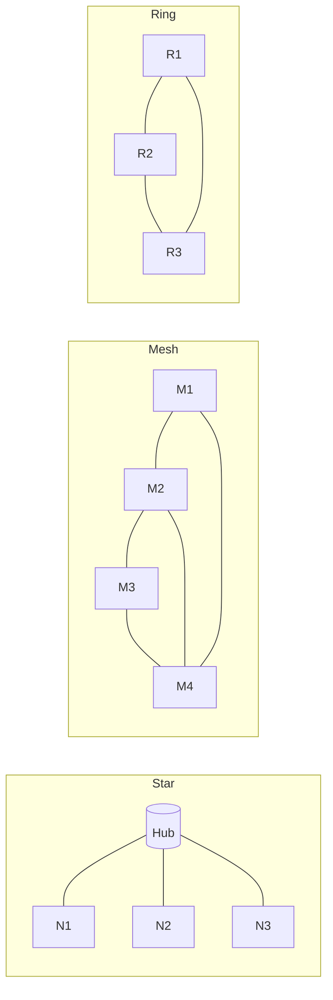
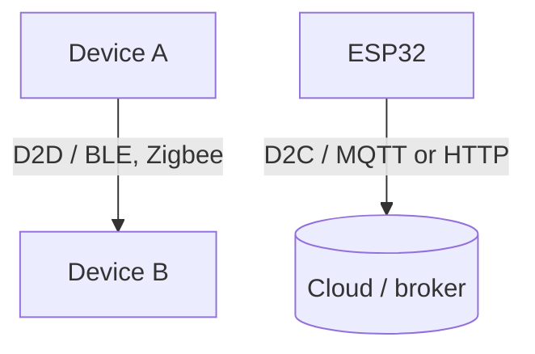

# UNIT 4 — IoT Communication Protocols & Networking 📡

> **Hands on Practice using IoT (DI05016071)** · **4 hrs · 10% weightage**
> **Covers syllabus sections:** 4.1 IoT Communication Models · 4.2 Wireless Technologies (BLE, Zigbee) · 4.3 Protocols (MQTT, CoAP, XMPP) · 4.4 Sensor Network Topologies (Star, Mesh, Ring) · 4.5 Device-to-Device & Device-to-Cloud
> **Related practicals:** [P08](../practicals/writeups/P08_esp32_mqtt_publisher.md), [P09](../practicals/writeups/P09_esp32_mqtt_subscriber_remote_control.md), [P14](../practicals/writeups/P14_mini_project_smart_agriculture_guide.md)

---

## 🧭 Chapter Roadmap

Only 10% weightage, but **MQTT is the protocol of P08, P09 and P14** — you *will* be grilled on it in the practical viva. The exam table to master: MQTT vs CoAP vs XMPP, BLE vs Zigbee, and the three topologies. Build them here, reuse everywhere.

```
UNIT 4: Communication Protocols & Networking
├── 4.1 IoT Communication Models              ⭐⭐ (request-response, pub/sub, push-pull, exclusive pair)
├── 4.2 Wireless Communication Technologies    ⭐⭐⭐ (BLE vs Zigbee)
│     ├── 4.2.1 Bluetooth Low Energy (BLE)
│     └── 4.2.2 Zigbee
├── 4.3 IoT Communication Protocols           ⭐⭐⭐ (MQTT · CoAP · XMPP)
│     ├── 4.3.1 MQTT — the protocol of P08/P09/P14
│     ├── 4.3.2 CoAP
│     └── 4.3.3 XMPP
├── 4.4 Sensor Network Topologies             ⭐⭐⭐ (Star · Mesh · Ring)
└── 4.5 Device-to-Device / Device-to-Cloud    ⭐⭐ (two of the four communication patterns)
```

### Learning outcomes — after this unit you can:
1. Name and explain the **4 IoT communication models**.
2. Compare **BLE vs Zigbee** on range, data rate, power and use case.
3. Explain **MQTT** in detail (topics, broker, QoS, retained) — the practicals P08/P09 depend on it.
4. Contrast **MQTT vs CoAP vs XMPP** — the classic 7-mark table.
5. Draw **Star, Mesh and Ring topologies** and pick one for a given scenario.

---

## 4.1 IoT Communication Models ⭐⭐

How IoT devices interact. The four standard models (IETF classification):

| Model | How it works | Example in this course |
|---|---|---|
| **Request–Response** | Client asks, server answers (HTTP) | P10: ESP32 GET → ThingSpeak |
| **Publish–Subscribe** | Devices publish to topics; broker forwards to subscribers | P08/P09: ESP32 ↔ broker.emqx.io |
| **Push–Pull** | Producers push to a buffer/queue; consumers pull at their pace | Sensor → queue → dashboard |
| **Exclusive Pair** | One-to-one direct link between two devices | Bluetooth headset ↔ phone |



> 💡 **Viva link:** the ESP32 practicals *combine* models — P14 uses publish–subscribe (sensor → broker → phone) *and* request–response (ThingSpeak GET). Being able to say which model each practical uses is free marks.

## 4.2 Wireless Communication Technologies ⭐⭐⭐

### 4.2.1 Bluetooth Low Energy (BLE)
- Low-power version of Bluetooth (v4.0+), part of **BT 4.2** on the ESP32.
- Short range (**~10 m**), low data rate (**~1–2 Mbps**), designed for battery nodes that sleep.
- **GATT model:** peripherals (sensors) advertise; a central (phone) connects and reads characteristics.
- Use cases: fitness bands, beacons, health wearables, phone–ESP32 pairing.

### 4.2.2 Zigbee
- Built on **IEEE 802.15.4**, operates in **2.4 GHz**, low power, **mesh networking** built in.
- Range ~10–100 m per node but **multi-hop mesh** extends it across a building.
- Low data rate (250 kbps); perfect for sensor/control networks that must be robust.
- Use cases: smart-home hubs (Philips Hue), industrial sensor meshes, building automation.

| Criterion | BLE | Zigbee |
|---|---|---|
| Standard base | Bluetooth 4.0+ | IEEE 802.15.4 |
| Band | 2.4 GHz | 2.4 GHz |
| Range | ~10 m | 10–100 m (mesh multi-hop) |
| Data rate | ~1–2 Mbps | ~250 kbps |
| Topology | Point-to-point / star | **Mesh** |
| Power | Low | Very low |
| Use case | Wearables, beacons | Home/industrial sensor mesh |

> 💡 **Exam one-liner:** "BLE = one wearable talking to a phone; Zigbee = hundreds of sensors talking to each other through a mesh."

## 4.3 IoT Communication Protocols ⭐⭐⭐

### 4.3.1 MQTT (Message Queuing Telemetry Transport) — the star of the course ⭐⭐⭐

> **Short definition (memorize):** MQTT is a lightweight **publish/subscribe** messaging protocol for constrained devices over unreliable networks, using a central **broker** to route messages on **topics**.

**How it works (P08/P09/P14):**
1. Publisher connects to the broker → **CONNECT/CONNACK**.
2. Publisher sends messages to a **topic**, e.g. `esp32/dht/temperature`.
3. Subscribers that subscribed to that topic receive it.
4. The two sides never know each other — the **broker** decouples them.

**Key concepts:**

| Term | Meaning | In the practicals |
|---|---|---|
| **Broker** | Central message router | `broker.emqx.io:1883` (P08/P09) |
| **Topic** | Textual address, hierarchical | `esp32/led/cmd`, `agri/esp32/data` |
| **Publish** | Send a message to a topic | P08 publishes temp/humidity |
| **Subscribe** | Register interest in a topic | P09 subscribes to `esp32/led/cmd` |
| **QoS 0/1/2** | At-most-once / at-least-once / exactly-once | P08–P09 use QoS 0 |
| **Retained message** | Last value stored for new subscribers | Dashboard shows last reading |
| **Will message** | Published automatically if device dies | Device-down alerts |

**Why MQTT wins:** tiny 2-byte header, one long-lived connection (low latency), push delivery (no polling), QoS + retained for reliability, pub/sub scales to thousands of nodes.



### 4.3.2 CoAP (Constrained Application Protocol)
- REST-like (GET/PUT/POST/DELETE) but runs over **UDP** — designed for constrained nodes (RFC 7252).
- Uses **confirmable/unconfirmable** messages + simple retransmission instead of TCP.
- Great for one-shot sensor reads; less suited to long-lived push like MQTT.
- **MQTT vs CoAP:** TCP vs UDP · broker vs direct · pub/sub vs request/response.

### 4.3.3 XMPP (Extensible Messaging and Presence Protocol)
- Open XML-based protocol, originally **instant messaging** (Jabber).
- Extensible via custom XML stanzas — supports presence, pub/sub (XEP-0060).
- **Heavier** than MQTT/CoAP (XML overhead) — not ideal for battery IoT, still used where chat-style presence matters (smart-home controllers, some industrial apps).

### The comparison table (memorise this)

| Criterion | MQTT | CoAP | XMPP |
|---|---|---|---|
| Transport | TCP | UDP | TCP |
| Model | Publish/Subscribe | Request/Response | Message + Presence + Pub/Sub |
| Broker | Required | Not required (client-server) | Server-based |
| Message format | Binary (compact) | Binary (CoAP over UDP) | **XML** (heavy) |
| Header overhead | ~2 bytes | ~4 bytes | Large (XML) |
| Power efficiency | Good | Best (UDP, no connection) | Poor |
| Best for | Sensor fleets, control (P08/P09) | Constrained one-shot reads | Chat-like, presence apps |

## 4.4 Sensor Network Topologies ⭐⭐⭐

| Topology | Layout | Pros | Cons | Best for |
|---|---|---|---|---|
| **Star** | All nodes → central hub | Simple, low latency, easy to manage | Single point of failure (hub) | Wi-Fi home networks, BLE |
| **Mesh** | Nodes connect to many neighbours | Robust, self-healing, wide coverage | Complex routing, more power | Zigbee, large sensor fields |
| **Ring** | Each node to two neighbours in a loop | Cheap cabling, deterministic | One break can isolate the ring (unless 2 rings) | Ring topologies in industrial backbones |



> 💡 **Viva application:** your classroom ESP32s to a Wi-Fi router = **star**. A Zigbee farm network where every node relays = **mesh**. P14's design (ESP32 → Wi-Fi router → cloud) is a star, and can be extended to a mesh with multiple nodes.

## 4.5 Device-to-Device and Device-to-Cloud Communication ⭐⭐

Two of the four standard IoT communication patterns:

| Pattern | Description | Example |
|---|---|---|
| **Device-to-Device (D2D)** | Direct communication, no intermediary | Two ESP32s over BLE; Zigbee nodes in a mesh |
| **Device-to-Cloud (D2C)** | Device connects directly to a cloud service over IP | ESP32 → ThingSpeak HTTP (P10); ESP32 → MQTT broker (P08) |
| *(Device-to-Gateway)* | Device → gateway → cloud | ESP32 → Raspberry Pi gateway → cloud |
| *(Back-end data sharing)* | Cloud service ↔ cloud service | ThingSpeak ↔ external analytics |



---

## 🧠 Deep-Dive Topics

### Deep Dive A: MQTT QoS 0/1/2 — the three delivery contracts
- **QoS 0 (at-most-once):** fire and forget — a sensor reading lost on a bad link is fine. Used in P08/P09.
- **QoS 1 (at-least-once):** receiver acknowledges; sender retries → duplicates possible.
- **QoS 2 (exactly-once):** a 4-way handshake guarantees no duplicates — for payments/commands that must not repeat.
Exam question: "which QoS for a light switch?" → QoS 0 is usually acceptable (a repeated OFF is harmless).

### Deep Dive B: Why MQTT needs a broker (and what it buys you)
The broker decouples *time* (publisher and subscriber need not be online together — the broker queues), *space* (they don't know each other's addresses), and *synchronisation* (both just follow the topic contract). That single idea — **the topic, not the peer, is the address** — is why P09 can control the LED from a phone the ESP32 has never met.

### Deep Dive C: Mesh vs Star in a real farm (P14 extension)
A 1 km farm with one Wi-Fi router (star) has dead zones. A Zigbee mesh lets sensor nodes relay each other's packets so every node reaches the gateway. This is the standard answer for "how would you scale your mini-project?" in the P14 viva.

---

## 🚀 Beyond the Textbook

1. **MQTT over TLS (port 8883)** is what production systems use — the public brokers also offer WebSocket (port 8083) so *browsers* can subscribe. Mentioning TLS = security-aware answer (Unit 1 tie-in).
2. **CoAP runs on UDP but adds a REST layer** — it is sometimes called "HTTP for constrained devices." Know that HTTP = TCP + heavy headers; CoAP = UDP + tiny headers.
3. **The ESP32 supports all three wireless techs in Unit 4** — Wi-Fi (b/g/n) for MQTT/HTTP, BLE for wearables, and it can host a Zigbee radio as a coordinator via ESP32-Zigbee-SDK. The practicals only use Wi-Fi, but the hardware can do more.
4. **Retained messages make dashboards instant**: when a subscriber (or Blynk/ThingSpeak bridge) connects, the broker immediately delivers the *last* value on each topic — no waiting for the next publish.
5. **`test.mosquitto.org` and `broker.emqx.io` are public brokers** — anyone can publish/subscribe. That's great for labs but a security risk in production; the "weak device/cloud security" challenge (Unit 1) in action.

---

## 🎯 High-Yield Exam Topics (likely GTU-style questions)

1. Short note: **MQTT protocol** (broker, topic, QoS, retained). (7 m) ⭐⭐⭐
2. **Compare MQTT, CoAP and XMPP**. (4–7 m) ⭐⭐⭐
3. Short note: **IoT communication models** (four models). (4–7 m) ⭐⭐⭐
4. **BLE vs Zigbee** — comparison. (4 m) ⭐⭐⭐
5. Short note: **sensor network topologies** (star, mesh, ring). (4 m) ⭐⭐⭐
6. Explain **Device-to-Device and Device-to-Cloud** communication. (3–4 m) ⭐⭐
7. Explain **MQTT QoS levels** 0, 1, 2. (3–4 m) ⭐⭐
8. Why is MQTT preferred over HTTP for IoT? (4 m) ⭐⭐
9. What is a **broker** and what is a **topic** in MQTT? (3 m) ⭐⭐
10. Which topology would you choose for a smart-home Zigbee network and why? (3 m) ⭐⭐

### ✅ Solved model answers (highest-yield)

**Q1. (7 m) — Short note: MQTT protocol.**
> MQTT (Message Queuing Telemetry Transport) is a lightweight **publish/subscribe** protocol for constrained IoT devices over unreliable networks. It runs over **TCP (default port 1883, TLS 8883)** and uses a central **broker** to route messages. Components: **(1) Broker** — the server that receives publications and forwards them to subscribers (e.g., broker.emqx.io). **(2) Topic** — a hierarchical text address such as `esp32/dht/temperature`; publishers send to it and subscribers register on it. **(3) QoS** — 0 (at-most-once), 1 (at-least-once), 2 (exactly-once). **(4) Retained messages** — the broker stores the last value on a topic for new subscribers. **(5) Will message** — a message published automatically if a device disconnects unexpectedly. Advantages: ~2-byte header overhead, one persistent connection (low latency), push delivery, and pub/sub decoupling that scales to thousands of nodes — which is why the practicals P08/P09/P14 use it.

**Q2. (4–7 m) — Compare MQTT, CoAP and XMPP.**
> **MQTT:** TCP, publish/subscribe with a broker, binary compact messages (~2-byte header), best for sensor fleets and control commands (P08/P09). **CoAP:** UDP, REST-style request/response (GET/POST/PUT/DELETE) modelled on HTTP, ~4-byte header, confirmable/unconfirmable messages with retransmission — best for constrained one-shot reads. **XMPP:** TCP, XML-based messaging with presence support (originally chat/Jabber), extensible via stanzas, but the XML overhead makes it heavy for battery devices. Selection rule: MQTT for continuous streaming + control, CoAP for lightweight request/response over UDP, XMPP where presence/chat semantics are required.

**Q4. (4 m) — BLE vs Zigbee.**
> **BLE (Bluetooth Low Energy)** is a low-power version of Bluetooth 4.0+ operating in 2.4 GHz with ~10 m range and ~1–2 Mbps data rate; it uses a GATT peripheral/central model, suits wearables, beacons and one-to-one phone pairing. **Zigbee** is built on IEEE 802.15.4 (2.4 GHz), with ~250 kbps and 10–100 m per node, but its **native mesh topology** lets nodes relay each other's packets for whole-building coverage. BLE = a wearable talking to a phone; Zigbee = hundreds of sensors in a self-healing mesh (smart-home hubs, industrial sensor networks).

---

## ✍️ Practice Problems (self-test — answers hidden)

1. Name the four IoT communication models and give one example each.
2. Draw the MQTT pub/sub flow with a publisher, broker, and two subscribers.
3. Explain QoS 0 vs QoS 2 — which guarantees no duplicates?
4. Your 2 km farm needs sensor coverage with no dead zones. Star or mesh? Why?
5. Why does MQTT work over a flaky link better than HTTP?
6. Which protocol is "REST over UDP"? Give two properties.
7. What is a retained message and what practical problem does it solve?
8. In P09, the phone and the ESP32 have never met — how does the phone still control the LED?

<details>
<summary>📌 Model solutions</summary>

1. Request–Response (HTTP GET → ThingSpeak), Publish–Subscribe (MQTT broker), Push–Pull (queue between producers/consumers), Exclusive Pair (Bluetooth direct link).
2. Publisher → broker(topic) → subscribers; broker decouples the two sides.
3. QoS 2 (4-way handshake, exactly-once) prevents duplicates; QoS 0 is fire-and-forget.
4. Mesh — nodes relay each other's packets, giving multi-hop coverage with no single point of failure; a star would have dead zones far from the router.
5. One long-lived connection + tiny headers → lower overhead and reconnection cost than HTTP's per-request connections and ~500-byte headers.
6. CoAP — runs over UDP, REST-like methods with confirmable/unconfirmable delivery.
7. The broker stores the last value on a topic and sends it to every new subscriber — a dashboard shows the latest sensor value instantly, without waiting for the next publish.
8. Pub/sub decoupling: both connect to the same broker; the phone publishes to `esp32/led/cmd` and the ESP32 subscribes to it. Neither knows the other's address — only the topic contract matters.
</details>

---

## 📖 Glossary of Key Terms

| Term | Definition |
|---|---|
| **MQTT** | Lightweight publish/subscribe protocol over TCP |
| **Broker** | Server routing MQTT messages between clients |
| **Topic** | Hierarchical text address for MQTT messages |
| **Publish** | Sending a message to a topic |
| **Subscribe** | Registering to receive messages on a topic |
| **QoS** | Quality of Service (0/1/2) — delivery guarantee level |
| **Retained message** | Last value on a topic stored for new subscribers |
| **Will message** | Automatic message on unexpected disconnect |
| **CoAP** | Constrained Application Protocol — REST-like over UDP |
| **XMPP** | XML-based messaging & presence protocol (Jabber) |
| **BLE** | Bluetooth Low Energy — short-range, low-power |
| **Zigbee** | IEEE 802.15.4 low-power mesh networking standard |
| **Communication model** | Interaction pattern (request-response, pub/sub, push-pull, exclusive pair) |
| **Star topology** | All nodes connect to a central hub |
| **Mesh topology** | Nodes interconnect; self-healing multi-hop |
| **Ring topology** | Each node connects to two neighbours in a loop |
| **D2D** | Device-to-Device direct communication |
| **D2C** | Device-to-Cloud direct connection over IP |
| **GATT** | BLE data model (services/characteristics) |
| **TCP / UDP** | Connection-oriented / connectionless transport protocols |

---

## 🔗 Curated Resources (per concept)

**MQTT (official)**
- MQTT.org — spec & intro: https://mqtt.org/
- MQTT v3.1.1 spec (OASIS): https://docs.oasis-open.org/mqtt/mqtt/v3.1.1/os/mqtt-v3.1.1-os.html
- HiveMQ MQTT essentials: https://www.hivemq.com/mqtt-essentials/
- EMQX public broker (used in practicals): https://www.emqx.com/en/mqtt/public-mqtt5-broker

**CoAP & XMPP**
- CoAP RFC 7252: https://datatracker.ietf.org/doc/html/rfc7252
- CoAP intro (Eclipse Californium): https://www.eclipse.org/californium/
- XMPP standards: https://xmpp.org/

**Wireless technologies**
- BLE intro (Bluetooth SIG): https://www.bluetooth.com/learn-about-bluetooth/tech-overviews/
- Zigbee (CSA): https://csa-iot.org/all-solutions/zigbee/

**Topologies & communication models**
- IoT communication models (IETF): https://datatracker.ietf.org/doc/html/rfc7452
- Network topology basics (Cisco): https://www.cisco.com/c/en/us/solutions/small-business/resource-center/networking/network-topologies.html

**Tutorials**
- ESP32 MQTT pub/sub (Random Nerd Tutorials): https://randomnerdtutorials.com/esp32-mqtt-publish-subscribe-arduino-ide/
- MQTTX client: https://mqttx.app/

**Videos (high yield)**
- HiveMQ MQTT fundamentals series · Simply Explained MQTT explainer · Andreas Spiess on LoRa/ESP32 mesh.

---

## 🎥 Video Study Guide (YouTube)

> Don't like reading? Me neither. This is your **structured video path** for the whole unit — better than the syllabus because it tells you *exactly what to search* and *what to watch first*, in a sensible order. Everything below is search keywords (they never rot like links do) + channels you can trust.

### 🧑🎓 Step 0 — Pick your learning style

| Style | You learn best by | Your path through this unit |
|---|---|---|
| 🎧 **Listener** | short, clear explainers | Watch 1 explainer per topic from the table below (3–8 min each) |
| 🛠️ **Builder** | wiring things yourself | Watch the MQTT build-along → then run [P08](../practicals/writeups/P08_esp32_mqtt_publisher.md)–[P09](../practicals/writeups/P09_esp32_mqtt_subscriber_remote_control.md) |
| 🔧 **Tinkerer** | experimenting & demos | Watch demo videos → publish custom topics from MQTTX and watch them route |
| 🧠 **Deep Diver** | full theory, "why" | Watch the whole-unit playlists at the bottom (university-level depth) |
| 🧭 **Explorer** | breadth & curiosity | Watch the "how MQTT works" explainers first, then follow your curiosity |
| 🎓 **Academic** | exam marks | Watch the revision/GTU-style videos, then grind the High-Yield questions above |

### 🎬 Step 1 — Watch by topic (search these on YouTube)

| Topic | YouTube search keywords (copy-paste ready) | Best channels | Style served |
|---|---|---|---|
| Communication models | `iot communication models explained` · `request response publish subscribe iot` · `iot architecture communication` | edureka!, Neso Academy | 🎧 + 🎓 |
| MQTT (mental model) | `what is mqtt simply explained` · `mqtt protocol explained` · `mqtt vs http for iot` | Simply Explained, HiveMQ, Fireship | 🎧 Deep Diver |
| MQTT hands-on | `esp32 mqtt publish subscribe tutorial` · `mqttx app tutorial` · `mosquitto mqtt broker setup` | Random Nerd Tutorials, DroneBot Workshop | 🛠️ Builder |
| MQTT QoS & retained | `mqtt qos 0 1 2 explained` · `mqtt retained messages` · `mqtt will message` | HiveMQ, Bevywise | 🧠 Deep Diver |
| CoAP | `coap protocol explained` · `coap vs mqtt` · `coap iot tutorial` | Real Time Logic, edureka! | 🧠 + 🎓 |
| XMPP | `xmpp protocol explained` · `xmpp vs mqtt` | PowerCert Animated Videos, edureka! | 🎧 |
| BLE | `bluetooth low energy explained` · `ble protocol tutorial` · `esp32 bluetooth low energy` | Andreas Spiess, Random Nerd Tutorials | 🧠 + 🛠️ |
| Zigbee | `zigbee explained` · `zigbee mesh network how it works` · `zigbee vs wifi vs ble` | PowerCert, Andreas Spiess, Techquickie | 🧭 + 🎧 |
| Topologies | `network topologies star mesh ring` · `mesh network explained` · `zigbee mesh topology demo` | PowerCert, Techquickie, DroneBot Workshop | 🎧 + 🔧 |
| Whole-unit revision (exam mode) | `iot protocols and networking unit notes` · `mqtt coap xmpp comparison exam` · `iot communication protocols full lecture` | Neso Academy, Gate Smashers, edureka! | 🎓 Academic |

### 🎬 Step 2 — Full playlists (for Deep Divers & Academics)

1. **"HiveMQ — MQTT Essentials"** — a complete, chapter-by-chapter MQTT course (broker, topics, QoS, retained, will).
2. **"Andreas Spiess — ESP32 networking & LoRa"** — deep dives into BLE, mesh and low-power radio on the exact hardware of this course.
3. **"edureka! — IoT protocols & communication"** — broad university-level coverage of models, protocols and topologies.

### 🎬 Step 3 — Proof you got it (5 min)

- Explain MQTT to a friend using only the words *topic*, *broker*, *publish*, *subscribe*.
- Sketch the star, mesh and ring topologies from memory.
- Open MQTTX and subscribe to a topic your ESP32 (P08) is publishing — if the values appear, the protocol is yours.

---

*Next: [UNIT 5 — IoT Cloud Platforms and Applications of IoT](./UNIT_5_IoT_Cloud_Platforms_and_Applications.md)*
