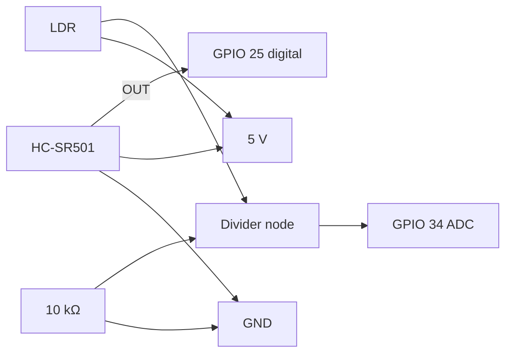

# P05 — PIR Motion Sensor (Digital Input) + LDR (Analog Input)

**Subject:** Hands on Practice using IoT | **Unit:** 3 | **Approx. Hrs:** 2
**PrO (verbatim):** *Develop and test interfacing of a PIR Motion Sensor (Digital Input) and an LDR Sensor (Analog Input) with the ESP32, and read their values.*

---

## 1. Objective
- Interface a **PIR motion sensor** (digital input) and read motion state.
- Interface an **LDR (light dependent resistor)** as an analog input and read light level via ADC.
- Print both values on the Serial Monitor.

## 2. Theory (exam-ready)

### 2.1 PIR motion sensor (HC-SR501)
- **PIR = Passive Infrared.** Detects changes in infrared radiation caused by a moving warm body (human/animal).
- Three pins: **VCC (5 V/3.3 V) · OUT (digital) · GND**.
- Output is **HIGH when motion is detected**, LOW when idle.
- Two on-board potentiometers: **sensitivity** (distance) and **time-delay** (how long OUT stays HIGH).
- Two trigger modes: **H (repeatable/hold)** and **L (single/non-repeatable)** — move the jumper to H for continuous re-trigger while someone is present.

### 2.2 LDR + voltage divider (analog input)
- An **LDR** has resistance that **falls in bright light, rises in darkness** (CdS photoresistor).
- We cannot read resistance directly — build a **voltage divider** with a fixed resistor (10 kΩ) and read the mid-point with the **12-bit ADC**:

```
 3.3 V ── LDR ──┬── 10 kΩ ── GND
                │
             GPIO 34  (analog input, 0–4095)
```

- Reading ≈ **4095 in darkness** (LDR high resistance → almost no drop across it... actually depends on divider orientation) and **low in bright light**. With LDR on top: dark → high reading; bright → low reading. Convert to a 0–100 "light %" for readability.

> ⚠️ **Pin rule:** use an **ADC1 input-only pin** (GPIO 34/35/36/39) for the LDR so the ADC is not shared with the Wi-Fi radio.

## 3. Circuit / Wiring
| ESP32 pin | Component |
|---|---|
| **5V** | PIR VCC (or 3V3) |
| **GPIO 25** | PIR OUT (digital input) |
| **GND** | PIR GND |
| **3V3** | LDR + fixed 10 kΩ divider |
| **GPIO 34** | Divider mid-point (analog input) |
| **GND** | Divider ground |



## 4. Code
```cpp
// P05 — PIR motion (digital input) + LDR light level (analog input)
// PIR OUT  -> GPIO 25
// LDR divider mid-point -> GPIO 34 (ADC1, input-only)

const int pirPin = 25;          // digital input
const int ldrPin = 34;          // analog input (12-bit ADC)

void setup() {
  Serial.begin(115200);
  pinMode(pirPin, INPUT);       // PIR output is a digital signal
  pinMode(ldrPin, INPUT);       // ADC pin (no internal pull needed)
  Serial.println("P05: PIR + LDR interface started.");
}

void loop() {
  int motion = digitalRead(pirPin);     // HIGH = motion, LOW = idle
  int raw = analogRead(ldrPin);         // 0..4095

  // Invert to a friendly 0-100 "light %" (0 = dark, 100 = bright)
  int lightPct = map(raw, 0, 4095, 100, 0);
  lightPct = constrain(lightPct, 0, 100);

  Serial.print("Motion: ");
  Serial.print(motion == HIGH ? "DETECTED" : "none");
  Serial.print("  |  LDR raw: ");
  Serial.print(raw);
  Serial.print("  |  Light: ");
  Serial.print(lightPct);
  Serial.println(" %");

  delay(500);                   // sample twice per second
}
```

> Full sketch: [`p05_pir_ldr_sensor.ino`](../code/p05_pir_ldr_sensor.ino)

## 5. Expected Serial Output
> ⚠️ **Not an actual run** — expected behaviour, not captured output. On hardware, wave a hand in front of the PIR and cover/uncover the LDR:

```
P05: PIR + LDR interface started.
Motion: none  |  LDR raw:  301  |  Light: 93 %
Motion: DETECTED  |  LDR raw:  295  |  Light: 93 %
Motion: DETECTED  |  LDR raw: 3620  |  Light: 12 %    <- hand covers LDR
Motion: none  |  LDR raw:  300  |  Light: 93 %
```

**Interpretation:** `Motion` flips to `DETECTED` only while a warm body moves; the LDR raw value rises (towards 4095) when covered because the divider node voltage rises in darkness.

## 6. Verify on Hardware (checklist)
- [ ] Waving a hand 1–3 m away makes `Motion: DETECTED` appear.
- [ ] PIR stays LOW when the room is still (or after the delay potentiometer expires).
- [ ] Covering the LDR with a finger raises `LDR raw` and lowers `Light %`.
- [ ] Shining a phone torch on the LDR lowers `LDR raw` and raises `Light %`.
- [ ] Adjust PIR potentiometers: sensitivity (distance) and hold-time (delay).
- [ ] Swap the PIR jumper between H and L modes and observe re-trigger behaviour.

## 7. Conclusion
PIR gave a clean **HIGH/LOW** digital signal (motion state) and the LDR voltage divider produced a **0–4095 analog value** proportional to light. Reading one digital + one analog sensor on the same ESP32 is the exact pattern used later in Smart Home (P09/P12) and Smart Agriculture (P13/P14) applications.

## 8. Viva Q&A
1. **What does PIR stand for?** — Passive Infrared; it detects infrared radiation changes, not visible motion.
2. **Why is the LDR read through a resistor divider?** — The ADC reads voltage, not resistance; the divider converts resistance change to voltage change.
3. **Why GPIO 34 for analog?** — Input-only ADC1 pin; keeps the ADC away from Wi-Fi interference and avoids boot-constraint pins.
4. **What is the ADC resolution?** — 12-bit → 0–4095 (0–3.3 V).
5. **What do the two PIR potentiometers adjust?** — Sensitivity (distance) and hold time (delay).
6. **Is the LDR reading linear?** — No — approximate/logarithmic; we only use it as a relative brightness indicator.

## 9. Resources
- ESP32 ADC docs: https://docs.espressif.com/projects/esp-idf/en/latest/esp32/api-reference/peripherals/adc.html
- PIR sensor guide (Adafruit): https://learn.adafruit.com/pir-passive-infrared-proximity-motion-sensor
- LDR/photoresistor guide: https://learn.adafruit.com/photocells
- ESP32 analog input tutorial: https://randomnerdtutorials.com/esp32-adc-analog-read-arduino-ide/
