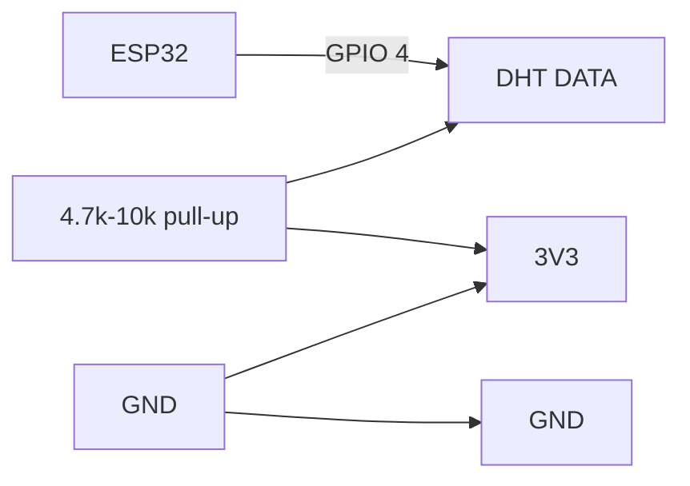

# P06 — DHT11/DHT22 Temperature & Humidity Sensor

**Subject:** Hands on Practice using IoT | **Unit:** 3 | **Approx. Hrs:** 2
**PrO (verbatim):** *Write and execute a program to interface the DHT11/DHT22 (Temperature and Humidity) sensor with the ESP32 using specific sensor libraries.*

---

## 1. Objective
- Interface a **DHT11** (or DHT22) sensor with the ESP32.
- Install and use the **Adafruit DHT sensor library** (specific library via Library Manager).
- Read **temperature (°C)** and **humidity (%)** and print to Serial Monitor.

## 2. Theory (exam-ready)

### 2.1 DHT11 vs DHT22
| Feature | DHT11 | DHT22 |
|---|---|---|
| Humidity range / accuracy | 20–90 %RH ±5 % | 0–100 %RH ±2 % |
| Temperature range / accuracy | 0–50 °C ±2 °C | −40–80 °C ±0.5 °C |
| Resolution | 1 °C / 1 % | 0.1 °C / 0.1 % |
| Sampling rate | 1 reading per second (max) | 2 readings per second |
| Cost | Very cheap | Slightly more |

### 2.2 Single-wire digital protocol
- DHT uses a **proprietary 1-wire-like protocol**: after the host pulls the data line low for ~18 ms, the sensor replies with 40 bits: `8× humidity integer + 8× humidity decimal + 8× temp integer + 8× temp decimal + 8× checksum`.
- The **checksum** = lower 8 bits of (hum_int + hum_dec + temp_int + temp_dec); the library verifies it and discards corrupt readings.
- **3 pins:** VCC · DATA (with 4.7 kΩ–10 kΩ pull-up to VCC) · GND.

> ⚠️ **DHT22 caution:** the sensor is **very slow** (needs ≥2 s between reads). If you sample faster it returns `NaN` — always `delay(2000)` between reads.

## 3. Library Installation (via Library Manager)
1. **Tools → Manage Libraries…** (Ctrl+Shift+I).
2. Search **`DHT sensor library`** → install **"DHT sensor library by Adafruit"**.
3. It prompts to install the dependency **"Adafruit Unified Sensor"** → click **Install All**.
   - This dependency is required; it provides the shared sensor datatype (`sensors_event_t`).

## 4. Circuit / Wiring
| ESP32 pin | DHT11 pin |
|---|---|
| **3V3** | VCC |
| **GPIO 4** | DATA (with 4.7 kΩ–10 kΩ pull-up resistor to 3V3) |
| **GND** | GND |



## 5. Code
```cpp
// P06 — DHT11/DHT22 temperature & humidity with Adafruit DHT library
// DATA -> GPIO 4, pull-up 4.7k-10k to 3V3
// Libraries: "DHT sensor library" by Adafruit + "Adafruit Unified Sensor"

#include <DHT.h>
#include <DHT_U.h>

#define DHTPIN 4               // data pin on GPIO 4
#define DHTTYPE DHT11          // change to DHT22 if using a DHT22

DHT dht(DHTPIN, DHTTYPE);      // create DHT object

void setup() {
  Serial.begin(115200);
  Serial.println("P06: DHT sensor interface started.");
  dht.begin();                 // initialise the sensor
}

void loop() {
  // Allow the sensor 2 seconds between reads (DHT requirement)
  delay(2000);

  float h = dht.readHumidity();     // humidity in %
  float t = dht.readTemperature();  // temperature in °C

  // Check for invalid reading (NaN) -> wire/library/checksum problem
  if (isnan(h) || isnan(t)) {
    Serial.println("Failed to read from DHT sensor!");
    return;
  }

  Serial.print("Humidity: ");
  Serial.print(h);
  Serial.print(" %");
  Serial.print("  |  Temperature: ");
  Serial.print(t);
  Serial.println(" *C");
}
```

> Full sketch: [`p06_dht_sensor.ino`](../code/p06_dht_sensor.ino)

## 6. Expected Serial Output
> ⚠️ **Not an actual run** — representative expected values for a room (~27 °C):

```
P06: DHT sensor interface started.
Humidity: 58.00 %  |  Temperature: 27.00 *C
Humidity: 58.00 %  |  Temperature: 27.00 *C
Humidity: 59.00 %  |  Temperature: 27.00 *C
... (one line every 2 seconds)
```

**Interpretation:** values update every 2 s. DHT11 gives integer resolution (27.00), DHT22 gives one decimal (27.40). If the sensor is unplugged you see `Failed to read from DHT sensor!` every 2 s.

## 7. Verify on Hardware (checklist)
- [ ] Values appear once per 2 s and stay plausible (humidity 30–90 %, temp 20–35 °C indoors).
- [ ] Breathe on the sensor → humidity rises within a few seconds.
- [ ] Touch the sensor (warm finger) → temperature rises slowly.
- [ ] Reduce `delay(2000)` to `delay(500)` → you get `NaN`/`Failed to read` (proves the 2 s rule).
- [ ] Disconnect the pull-up resistor → persistent `Failed to read` (checksum errors).
- [ ] Confirm both libraries listed in Sketch → Include Library → Manage Libraries (installed).

## 8. Conclusion
With the Adafruit DHT library the whole single-wire protocol, timing and checksum are handled internally — the sketch just calls `readHumidity()`/`readTemperature()`. This same DHT data is what MQTT publishing (P08) and the cloud practicals (P10, P13) upload.

## 9. Viva Q&A
1. **Which libraries are needed?** — *DHT sensor library by Adafruit* and its dependency *Adafruit Unified Sensor*.
2. **How many data bits does DHT send?** — 40 bits (16 humidity + 16 temperature + 8 checksum).
3. **Why the pull-up resistor on DATA?** — The DHT uses open-drain signalling; the pull-up defines the idle HIGH level.
4. **Why does DHT need 2 s between reads?** — Its internal conversion/update rate is ~0.5–1 Hz; faster reads return NaN.
5. **DHT11 accuracy?** — ±2 °C / ±5 %RH; DHT22 is ±0.5 °C / ±2 %RH.
6. **What does `isnan()` check?** — That the read returned a valid number (not Not-a-Number).

## 10. Resources
- Adafruit DHT library on GitHub: https://github.com/adafruit/DHT-sensor-library
- Adafruit Unified Sensor library: https://github.com/adafruit/Adafruit_Sensor
- DHT11 datasheet: https://www.mouser.com/datasheet/2/758/DHT11-Technical-Data-Sheet-Translated-Version-1143054.pdf
- ESP32 + DHT tutorial: https://randomnerdtutorials.com/esp32-dht11-dht22-temperature-humidity-sensor-arduino-ide/
