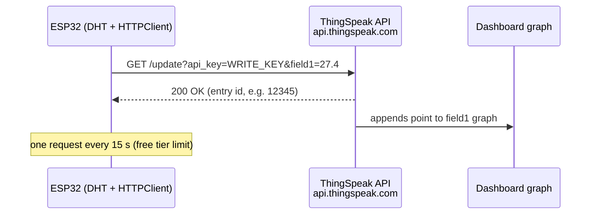

# P10 — HTTP GET/POST to ThingSpeak (Temperature Data to Cloud)

**Subject:** Hands on Practice using IoT | **Unit:** 5 | **Approx. Hrs:** 2
**PrO (verbatim):** *Write and execute a program using HTTP GET/POST API methods to send ESP32 Temperature sensor data to the cloud platform for storage and graphical visualization.*

---

## 1. Objective
- Create a **ThingSpeak channel** and read its **Write API Key**.
- Send DHT11 temperature to the cloud using **HTTP GET** (ThingSpeak update API).
- See the data **graphically** on the ThingSpeak dashboard.

## 2. Theory (exam-ready)

### 2.1 HTTP APIs — GET vs POST
| Method | Purpose | In this practical |
|---|---|---|
| **GET** | Fetch data / simple requests; parameters in the URL | `https://api.thingspeak.com/update?api_key=KEY&field1=27.4` |
| **POST** | Send data in the request body | Alternative with the same URL but body parameters |

ThingSpeak accepts both; GET keeps the sketch short (the classic "HTTP GET API method" for IoT), POST is preferred when payloads grow (JSON).

### 2.2 ThingSpeak
- A free **IoT analytics platform** (MathWorks). Each **channel** has up to **8 fields**.
- **Write API Key:** proves you may write to the channel (put it in the URL).
- **Read API Key:** lets others (dashboards, apps) read the channel.
- **Update limit:** free accounts accept one update every **15 seconds**.
- Public channel settings: make the channel public to see graphs without login.



## 3. Setup — ThingSpeak Channel (do once)
1. Sign up at **https://thingspeak.com/** (free; MathWorks account).
2. **Channels → My Channels → New Channel**.
3. Fill: **Name** = `ESP32 Temp Lab`; enable **Field 1** and name it **Temperature**.
4. Save → open the channel → tab **API Keys** → copy the **Write API Key**.
5. (Optional) **Settings → Share → Make public** so your graphs are visible without login.

## 4. Libraries to Install
1. **"DHT sensor library by Adafruit"** + **"Adafruit Unified Sensor"** (P06).
2. `HTTPClient` and `WiFi` are part of the **ESP32 core** — no extra install needed.

## 5. Circuit / Wiring
Reuse P06 wiring: DHT DATA → **GPIO 4** (+ pull-up to 3V3), VCC → 3V3, GND → GND. No new hardware.

## 6. Code
```cpp
// P10 — HTTP GET to ThingSpeak: upload DHT11 temperature for graphing
// DHT DATA -> GPIO 4 · HTTPClient + WiFi (ESP32 core)
// Library: DHT sensor library (Adafruit) + Unified Sensor

#include <WiFi.h>
#include <HTTPClient.h>
#include <DHT.h>

const char* ssid = "YOUR_WIFI_SSID";
const char* password = "YOUR_WIFI_PASSWORD";

// >>> REPLACE WITH YOUR THINGSPEAK CHANNEL'S WRITE API KEY <<<
String apiKey = "XXXXXXXXXXXXXXXX";   // 16 hex chars, e.g. ABCDEF1234567890

#define DHTPIN 4
#define DHTTYPE DHT11
DHT dht(DHTPIN, DHTTYPE);

const char* server = "api.thingspeak.com";
const unsigned long INTERVAL = 20000;   // 20 s (> 15 s free-tier minimum)

unsigned long lastSend = 0;

void setup() {
  Serial.begin(115200);
  dht.begin();

  WiFi.begin(ssid, password);
  Serial.print("Connecting to Wi-Fi");
  while (WiFi.status() != WL_CONNECTED) {
    delay(500);
    Serial.print(".");
  }
  Serial.println();
  Serial.print("Connected, IP: ");
  Serial.println(WiFi.localIP());
}

void loop() {
  unsigned long now = millis();
  if (now - lastSend < INTERVAL) return;
  lastSend = now;

  float t = dht.readTemperature();
  if (isnan(t)) {
    Serial.println("DHT read failed, skipping upload");
    return;
  }

  HTTPClient http;
  String url = String("http://") + server + "/update?api_key=" + apiKey +
               "&field1=" + String(t, 1);

  http.begin(url);                 // HTTP GET (ThingSpeak update API)
  int code = http.GET();

  if (code == 200) {
    Serial.print("Uploaded temp=");
    Serial.print(t, 1);
    Serial.print(" *C  -> HTTP 200, entry ");
    Serial.println(http.getString());
  } else {
    Serial.print("Upload failed, HTTP code: ");
    Serial.println(code);
  }
  http.end();
}
```

> Full sketch: [`p10_thingspeak_http_temperature.ino`](../code/p10_thingspeak_http_temperature.ino)

> 💡 **POST variant (for the writeup, mention it):** replace the URL method with the same URL but use `http.POST(url)` after setting headers, or better, `http.begin(server, "/update"); http.addHeader("Content-Type", "application/x-www-form-urlencoded"); http.POST("api_key=KEY&field1=27.4")`. Same data, body instead of URL.

## 7. Expected Serial Output
> ⚠️ **Not an actual run** — expected behaviour:

```
Connecting to Wi-Fi......
Connected, IP: 192.168.1.42
Uploaded temp=27.4 *C  -> HTTP 200, entry 152398421
Uploaded temp=27.5 *C  -> HTTP 200, entry 152398522
... (every 20 s)
```

**On the dashboard:** Channel → **Private View** → Field 1 chart shows one rising/falling point every 20 s.

## 8. Verify on Hardware (checklist)
- [ ] HTTP 200 returned with a numeric entry id (not `-1` — that means bad key/URL).
- [ ] Field 1 chart on ThingSpeak gains a point every 20 s.
- [ ] Warm the sensor with your hand → the next point jumps up on the graph.
- [ ] Double-check the API key: wrong key gives HTTP **401/404** or entry `-1`.
- [ ] Keep the interval ≥ 15 s, else ThingSpeak throttles (`-1` responses).
- [ ] Optional: make the channel public and view the embeddable chart widget.

## 9. Conclusion
Using the ThingSpeak **update API** over HTTP GET, the ESP32 stored live temperature in the cloud with zero MQTT broker. ThingSpeak handled storage + graphing, so the "Data Processing" and "Application" layers of the IoT architecture (P01) were now delivered by a real cloud platform — the pattern continues for P11 (ultrasonic) and P13 (multi-sensor).

## 10. Viva Q&A
1. **What does the Write API Key do?** — Authenticates the ESP32 to write to your channel.
2. **GET vs POST for ThingSpeak?** — GET puts parameters in the URL; POST puts them in the request body. Both work for the update API.
3. **Why the 15-second minimum interval?** — ThingSpeak's free tier rate limit.
4. **What does HTTP response `-1` mean?** — The request failed (bad key, no internet, throttled) — the server never returned 200.
5. **How many fields does a channel have?** — Up to 8.
6. **What is Field 1 used for here?** — Temperature (°C).

## 11. Resources
- ThingSpeak: https://thingspeak.com/
- ThingSpeak docs (channels & API keys): https://docs.thingspeak.com/en/
- ThingSpeak HTTP API reference: https://docs.thingspeak.com/en/reference/http/
- ESP32 HTTPClient docs: https://docs.espressif.com/projects/arduino-esp32/en/latest/api/httpclient.html
- ESP32 + ThingSpeak tutorial: https://randomnerdtutorials.com/esp32-thingspeak/
