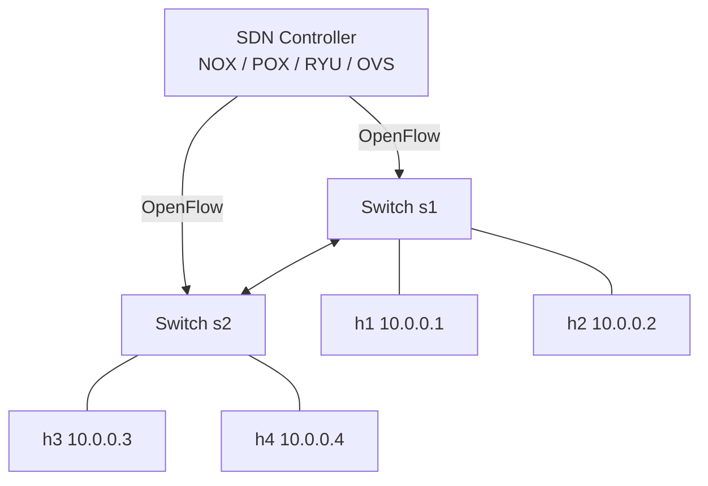
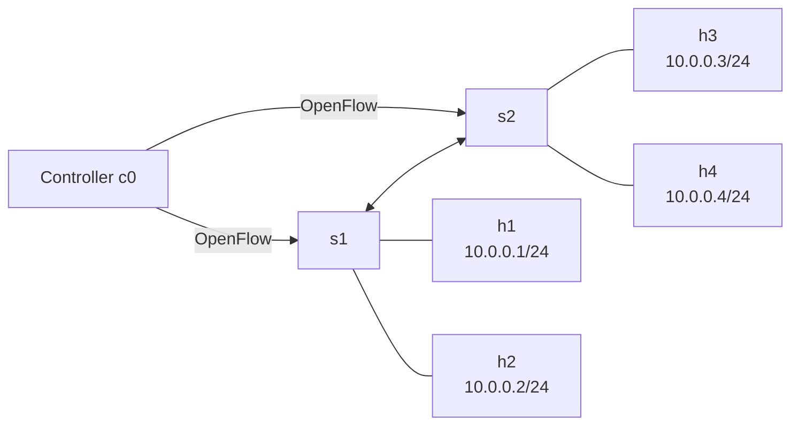

# Practical 5 — Virtual SDN Lab with Mininet (Live on Endeavour OS)
**Cloud and Data Center Technology | Unit 3 | ~4 hrs**

---

## 🎯 Aim
**Run a virtual SDN lab with Mininet on this Linux machine**

- Create 2‑switch, 4‑host topology via Python script
- Verify SDN data‑path with full‑mesh ping
- Explore with Mininet CLI, inspect OpenFlow flows
- Capture cross‑switch ICMP with Wireshark
- *One‑line VM install shown at end for lab submission*

---

## 📚 Theory: SDN — Control Plane vs Data Plane



| Plane | Role | Example |
|-------|------|---------|
| **Control** | Decides *where* packets go | Controller computes routes, pushes flow rules |
| **Data** | Actually forwards packets | Switches match‑and‑forward per flow table |

**OpenFlow** = southbound protocol (controller ↔ switch)

---

## 🏗️ Mininet Architecture (runs natively here)

| Component | Implementation |
|-----------|----------------|
| **Host** | Linux network namespace (isolated stack, own IPs) |
| **Switch** | Open vSwitch (kernel module) – `ovs-vswitchd` |
| **Link** | veth pairs, optionally TCLink (rate/delay) |
| **Controller** | Built‑in reference controller `c0` (or external RYU/ONOS) |

> All on **one Linux kernel** – no VMs, no hypervisor. Endeavour OS already has `mininet` and `openvswitch` installed.

---

## 🗺️ Our Topology: 2 Switches, 4 Hosts



- h1,h2 → s1 | h3,h4 → s2 | s1 ↔ s2 interconnect
- Single subnet: **10.0.0.0/24**
- Default controller **c0** (reference controller)

---

## 🐍 Python Script Walkthrough

```python
# File: p05_mininet_2switch_4host.py
from mininet.topo import Topo
from mininet.net import Mininet
from mininet.link import TCLink
from mininet.cli import CLI
from mininet.log import setLogLevel

class TwoSwitchFourHostTopo(Topo):
    def build(self):
        s1 = self.addSwitch("s1")
        s2 = self.addSwitch("s2")
        h1 = self.addHost("h1", ip="10.0.0.1/24")
        h2 = self.addHost("h2", ip="10.0.0.2/24")
        h3 = self.addHost("h3", ip="10.0.0.3/24")
        h4 = self.addHost("h4", ip="10.0.0.4/24")
        self.addLink(h1, s1)
        self.addLink(h2, s1)
        self.addLink(h3, s2)
        self.addLink(h4, s2)
        self.addLink(s1, s2)

def run():
    setLogLevel("info")
    net = Mininet(topo=TwoSwitchFourHostTopo(), link=TCLink)
    net.addController("c0")
    net.start()
    print(">>> switches:", net.switches)
    print(">>> hosts   :", net.hosts)
    print(">>> Ping test (full mesh)")
    print(net.pingAll())
    print(">>> h1 -> h4 connectivity")
    print(net["h1"].cmd("ping -c 3 10.0.0.4"))
    CLI(net)
    net.stop()

if __name__ == "__main__":
    run()
```

**Key points**
- `Topo.build()` = declarative topology definition
- `TCLink` = enables bandwidth/delay shaping later
- `net.addController("c0")` = starts reference OpenFlow controller
- `CLI(net)` = drops to interactive `mininet>` prompt

---

## ▶️ Run the Topology (live)

```bash
sudo python3 p05_mininet_2switch_4host.py
```

> Watch: topology creation → controller start → switch connect → `pingAll` → CLI prompt

---

## 🖥️ Expected Output (on this machine)

```
*** Creating network
*** Adding controller
*** Adding hosts: h1 h2 h3 h4
*** Adding switches: s1 s2
*** Adding links: (h1,s1) (h2,s1) (h3,s2) (h4,s2) (s1,s2)
*** Configuring hosts
*** Starting controller
*** Starting 2 switches
>>> Ping test (full mesh)
h1 -> h2 h3 h4
h2 -> h1 h3 h4
h3 -> h1 h2 h4
h4 -> h1 h2 h3
*** Results: 0% dropped (12/12 received)
>>> h1 -> h4 connectivity
PING 10.0.0.4 ... 3 packets transmitted, 3 received, 0% packet loss
mininet>
```

**Interpretation:** `0% dropped` = controller programmed flows on **both** switches; h1→h4 crossed s1→s2

---

## 🔧 Mininet CLI Commands Demo

| Command | Purpose |
|---------|---------|
| `nodes` | List all hosts & switches |
| `links` | Show virtual links (veth pairs) |
| `net` | Topology + IPs + ports |
| `h1 ifconfig` | Inspect h1's virtual NIC |
| `h1 ping -c 3 h4` | Cross‑switch ping |
| `h2 traceroute h3` | Show path h2→s1→s2→h3 |
| `s1 dpctl dump-flows` | **OpenFlow flow table on s1** ← *key SDN proof* |
| `xterm h1` | Terminal inside h1 namespace |
| `exit` | Stop network, cleanup |

---

## 🔬 Wireshark: Capture ICMP Across Switches

1. **Start Wireshark** → Capture on `any` (all virtual interfaces)
2. **Filter:** `icmp`
3. **In Mininet CLI:** `h1 ping -c 5 h3`
4. **Stop capture** → Observe:
   - Echo Request: 10.0.0.1 → 10.0.0.3
   - Echo Reply: 10.0.0.3 → 10.0.0.1
   - Packets traverse **s1 → s2** inter‑switch link

> Proves data path works end‑to‑end across controller‑programmed switches

---

## 📊 OpenFlow Flow Table (s1 dpctl dump-flows)

```
NXST_FLOW reply (xid=0x4):
 cookie=0x0, duration=12.3s, table=0, n_packets=6, n_bytes=504, idle_age=1, priority=100,ip,in_port=1,nw_dst=10.0.0.3 actions=output:3
 cookie=0x0, duration=12.3s, table=0, n_packets=6, n_bytes=504, idle_age=1, priority=100,ip,in_port=3,nw_dst=10.0.0.1 actions=output:1
 cookie=0x0, duration=15.1s, table=0, n_packets=2, n_bytes=168, idle_age=10, priority=0 actions=CONTROLLER:65535
```

**What this shows**
- Controller **learned** flows after first ARP/ICMP exchange
- `priority=100` = specific match (IP + in_port) → `output:port`
- `priority=0` = table‑miss → send to CONTROLLER (Packet‑In)
- **Control plane decided; data plane forwards**

---

## 🖥️ VM Setup for Lab Submission (one‑liner)

```bash
# Inside a fresh Ubuntu 22.04/24.04 VM (VirtualBox)
sudo apt update && sudo apt install -y mininet openvswitch-switch
mn --version          # verify
# Copy the same .py script and run: sudo python3 p05_mininet_2switch_4host.py
```

---

## ✅ Conclusion & Viva Prep

### Delivered
- ✅ Mininet running natively, topology script executed
- ✅ 2‑switch, 4‑host SDN fabric operational
- ✅ `pingAll`: **0% dropped (12/12)**
- ✅ Cross‑switch ping (h1→h4, h1→h3) verified
- ✅ `dpctl dump-flows` shows controller‑installed OpenFlow rules
- ✅ Wireshark captures ICMP traversing inter‑switch link
- ✅ VM install command shown

### Viva Questions
1. **What is Mininet?** — Network emulator using Linux namespaces & veth pairs
2. **SDN definition?** — Control/data plane separation; OpenFlow southbound
3. **Why namespaces?** — Isolated network stacks per host on one kernel
4. **`pingAll` proves?** — Full L2/L3 connectivity across emulated SDN fabric
5. **Controller vs switch?** — Controller = logic (compute routes); Switch = match‑and‑forward per flow rules
6. **What does `dpctl dump-flows` show?** — Learned flow entries: match fields + actions
7. **Why Open vSwitch over user switch?** — Kernel‑datapath, full OpenFlow support, performance
8. **Mininet vs simulator (ns‑3)?** — Mininet runs real kernel code, real switch daemons; ns‑3 models protocols in user space

---

## 📎 Resources
- Mininet: http://mininet.org
- Walkthrough: https://github.com/mininet/mininet/wiki/Documentation
- OpenFlow spec: https://opennetworking.org/software-defined-standards/specifications/

---

<!--
SPEAKER NOTES (visible in VS Code Markdown Preview):
- F1 → "Markdown: Open Preview to the Side"
- Terminal right, slides left
- Mermaid diagrams render automatically
- Scroll with arrows while speaking
-->