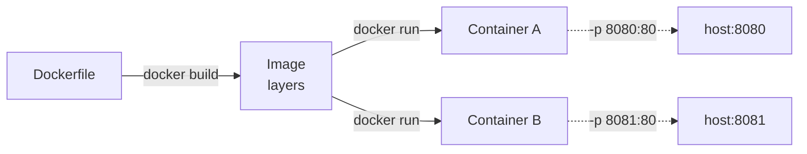

# Practical 10 — Creating & Executing First Container (Flask App via Docker Desktop) — Live on Endeavour OS
**Cloud and Data Center Technology | Unit 6 | ~4 hrs**

---

## 🎯 Aim
**Create and run containers with Docker Desktop on this Linux host**

- Verify Docker Desktop / Engine (`docker version`)
- Run `hello-world` (smoke test)
- Run nginx web server (detached, port published) – reference
- Write a **Flask** application + `Dockerfile`, build image, run container
- Capture HTTP traffic with Wireshark
- Demonstrate `docker logs` / `docker exec`
- Show Docker Desktop dashboard live
- *One‑line VM install shown at end for lab submission*

> ✅ All commands below run natively on this Endeavour OS machine (Docker Desktop installed via AUR `docker-desktop`). If `docker ps` fails, start Desktop: `systemctl --user start docker-desktop` or start the standalone Engine: `sudo systemctl start docker`.

---

## 📚 Theory: Container vs Virtual Machine

| Aspect | **Container** | **Virtual Machine** |
|--------|---------------|---------------------|
| OS | Shares host kernel | Full guest OS |
| Hypervisor | None (OS‑level virt) | Type 1/2 hypervisor |
| Startup | Seconds | Minutes |
| Image size | MBs (layered) | GBs |
| Isolation | Namespaces + cgroups | Hardware‑level |



**Key terms**
- **Image** = read‑only layered template
- **Container** = running instance with writable top layer
- **Dockerfile** = recipe (`FROM`, `WORKDIR`, `COPY`, `RUN`, `EXPOSE`, `CMD`)
- **`-p 8080:80`** = publish container port 80 on host port 8080

---

## 🐳 Ensure Docker Desktop / Engine Is Running

```bash
# On Endeavour OS with Docker Desktop (systemd user service)
systemctl --user start docker-desktop   # starts the Desktop VM + CLI context
# OR if using plain Engine:
sudo systemctl start docker

docker version                  # must show Client + Server
docker info                     # storage driver, cgroups, containers, images
```

> Both Client and Server versions must appear → Docker ready.  
> Open **Docker Desktop** → whale icon → **Dashboard** → *Containers* tab (keep it visible during demo).

---

## 📋 Step 1: hello-world

```bash
docker run --rm hello-world
```

**What happens**
1. Client → daemon
2. Daemon pulls `hello-world` from Docker Hub
3. Creates container, runs executable, streams output
4. Container exits, `--rm` removes it automatically

**Proves:** pull → create → run → exit works end‑to‑end

---

## 🌐 Step 2: nginx Web Server (reference)

```bash
docker run -d -p 8080:80 --name p10-nginx nginx
curl -s -o /dev/null -w "%{http_code}\n" http://localhost:8080/
docker ps
```

| Flag | Meaning |
|------|---------|
| `-d` | Detached (background) |
| `-p 8080:80` | Host 8080 → Container 80 |
| `--name` | Friendly name |

**Expected**
```
HTTP 200
NAMES        IMAGE    STATUS         PORTS
p10-nginx    nginx    Up X seconds   0.0.0.0:8080->80/tcp
```

> In **Docker Desktop → Containers** you’ll see `p10-nginx` with live logs and port mapping.

---

## 🛠️ Step 3: Flask App – Source & Dockerfile

### Directory layout
```
practicals/code/
└── p10_flask_app/
    ├── app.py
    ├── requirements.txt
    └── Dockerfile
```

### app.py
```python
# p10_flask_app/app.py
from flask import Flask
app = Flask(__name__)

@app.route("/")
def hello():
    return "<h1>Hello from Flask in a container! 🚀</h1>"

if __name__ == "__main__":
    app.run(host="0.0.0.0", port=80)
```

### requirements.txt
```
flask==3.0.3
```

### Dockerfile
```dockerfile
# p10_flask_app/Dockerfile
FROM python:3-alpine          # tiny base (~50 MB)
WORKDIR /app
COPY requirements.txt .
RUN pip install --no-cache-dir -r requirements.txt
COPY app.py .
EXPOSE 80                     # document port
CMD ["python", "app.py"]
```

---

## ▶️ Build & Run Flask Image

```bash
cd practicals/code
docker build -t p10-flask-app -f p10_flask_app/Dockerfile p10_flask_app
docker run -d -p 8081:80 --name p10-flask p10-flask-app
curl -s http://localhost:8081/
docker ps
```

**Build output shows layers**
```
#1 [internal] load build definition
#2 [internal] load metadata for python:3-alpine
#3 [1/5] FROM python:3-alpine
#4 [2/5] WORKDIR /app
#5 [3/5] COPY requirements.txt .
#6 [4/5] RUN pip install --no-cache-dir -r requirements.txt
#7 [5/5] COPY app.py .
#8 exporting to image → p10-flask-app:latest
```

**Run output**
```
HTTP 200
<h1>Hello from Flask in a container! 🚀</h1>
NAMES        IMAGE           STATUS         PORTS
p10-nginx    nginx           Up X seconds   0.0.0.0:8080->80/tcp
p10-flask    p10-flask-app   Up Y seconds   0.0.0.0:8081->80/tcp
```

> Open **http://localhost:8081** → Flask page renders.  
> **Docker Desktop** now lists **both** containers with live log tails.

---

## 🔬 Wireshark: Capture HTTP Traffic to Flask

1. **Start Wireshark** → Capture on `lo` (loopback)  
2. **Filter:** `tcp.port == 8081` or `http`  
3. **Trigger:** `curl -v http://localhost:8081/`  
4. **Stop capture** → Observe:
   - `GET / HTTP/1.1` from host
   - `HTTP/1.1 200 OK` with HTML body
   - Source port → 8081, destination → ephemeral

> Proves container serves traffic on published host port via Docker’s DNAT (iptables)

---

## 🔍 Container Inspection Commands

| Command | Purpose |
|---------|---------|
| `docker images` | List local images |
| `docker ps -a` | All containers (incl. exited) |
| `docker logs p10-flask` | View Flask startup + access log |
| `docker exec -it p10-flask sh` | Shell inside running container |
| `docker stop p10-flask && docker rm p10-flask` | Stop & remove container |
| `docker rmi p10-flask-app` | Remove image |

---

## 🖥️ VM Setup for Lab Submission (one‑liner)

```bash
# Inside a fresh Ubuntu 22.04/24.04 VM (VirtualBox)
curl -fsSL https://get.docker.com | sh
sudo usermod -aG docker $USER
newgrp docker                 # or log out/in
docker version                # verify Client + Server
# Copy the p10_flask_app/ folder and run the three steps above
```

---

## ✅ Conclusion & Viva Prep

### Delivered
- ✅ `docker version` — Engine verified
- ✅ `hello-world` — pull/create/run/exit works
- ✅ `nginx` on 8080 — detached, port published, HTTP 200
- ✅ **Flask app** → layered build → run on 8081
- ✅ `curl` + browser verification
- ✅ Wireshark: HTTP GET/200 captured on published port
- ✅ `docker logs`, `docker exec` demonstrated
- ✅ Docker Desktop dashboard shown live
- ✅ VM install command shown

### Viva Questions
1. **Image vs container?** — Image = read‑only template; Container = running instance
2. **VM vs container?** — VM = guest OS + hypervisor; Container = shares host kernel (OS‑level virt)
3. **`-p 8080:80` does what?** — Publishes container port 80 to host port 8080
4. **What is a Dockerfile?** — Declarative recipe to build an image (`FROM`/`COPY`/`RUN`/`CMD`…)
5. **Why `python:3-alpine`?** — Small (~50 MB), fast pull, minimal attack surface
6. **`EXPOSE` vs `-p`?** — `EXPOSE` documents; `-p` actually publishes/maps
7. **How does Docker achieve isolation?** — Linux namespaces (PID, NET, MNT…) + cgroups (resource limits)
8. **What does `docker build` output show about layers?** — Each instruction = layer; cached if unchanged; `COPY` creates new layer
9. **What does `--rm` do?** — Auto‑removes container on exit (cleanup)
10. **What is the Docker daemon?** — Background service managing images, containers, networks, volumes via REST API
11. **What does `docker exec` do?** — Runs a new process inside an existing container’s namespaces
12. **How does Docker Desktop differ from plain Engine?** — Bundles Engine + CLI + Compose + Kubernetes + GUI dashboard; on Linux runs a lightweight VM for consistent UX

---

## 📎 Resources
- Docker Get Started: https://docs.docker.com/get-started/
- Dockerfile Reference: https://docs.docker.com/reference/dockerfile/
- Docker Hub: https://hub.docker.com
- Docker Desktop: https://www.docker.com/products/docker-desktop/

---

<!--
SPEAKER NOTES (visible in VS Code Markdown Preview):
- F1 → "Markdown: Open Preview to the Side"
- Terminal right, slides left
- Mermaid renders in preview
- Scroll with arrows while speaking
-->