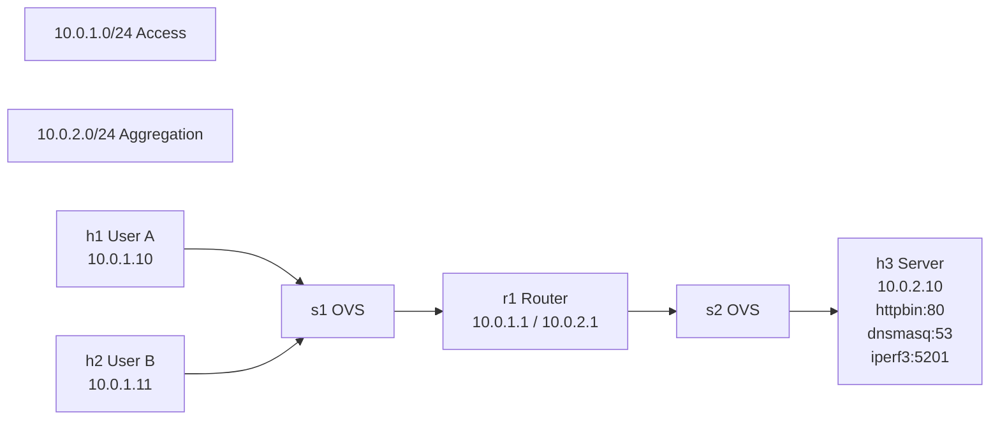

# P11 — Realistic Multi-Service Traffic Flow in Mininet SDN Lab

**Subject:** Cloud and Data Center Technology | **Unit:** III, VI | **Approx. Hrs:** 4
**PrO:** Simulate and analyze realistic multi-service traffic flow in an emulated SDN data center network with router, switches, and application servers; capture and analyze packets at each hop using Wireshark.

---

## 1. Objective
- Build a realistic data-center topology: two clients → access switch → router → aggregation switch → server.
- Deploy real application services on the server: HTTP API (`httpbin`), DNS (`dnsmasq`), throughput test (`iperf3`).
- Generate concurrent traffic from two clients to different services.
- Capture packets at four strategic points (client, router ingress, router egress, server).
- Analyze flows in Wireshark: DNS, HTTP, TCP handshake, router forwarding/NAT, iperf3 stream.
- Demonstrate SDN data-plane forwarding, L3 routing, NAT, and application-layer protocols.

---

## 2. Theory (Exam-Ready)

### 2.1 SDN Data Plane vs Control Plane
- **Control plane** (controller) computes forwarding rules; **data plane** (switches) only match‑and‑forward.
- In Mininet the default OpenFlow controller (`controller`) installs reactive flows after the first packet (ARP/ICMP).

### 2.2 Mininet Internals
| Concept | Implementation |
|---------|----------------|
| Host    | Linux **network namespace** (own interfaces, routing table, ARP cache). |
| Switch  | **Open vSwitch** (OVS) kernel datapath + user‑space `ovs-vswitchd`. |
| Link    | **veth pair** (virtual Ethernet) connecting two namespaces or a namespace and OVS. |
| Controller | Userspace OpenFlow controller (reference `controller`, or POX/RYU). |

### 2.3 Linux Kernel Router
- A normal host namespace with **two interfaces** in different subnets.
- `sysctl -w net.ipv4.ip_forward=1` enables IPv4 forwarding.
- `iptables -t nat -A POSTROUTING -o <out_iface> -j MASQUERADE` performs source NAT so the server sees the router’s IP (10.0.2.1) as source.

### 2.4 Protocols in This Lab
| Protocol | Port | Role in Demo |
|----------|------|--------------|
| DNS (UDP/TCP) | 53 | `dnsmasq` resolves `api.local → 10.0.2.10`. |
| HTTP/1.1 | 80 | `httpbin` provides `/get`, `/uuid` JSON endpoints. |
| TCP (iperf3) | 5201 | Long‑lived throughput stream, shows congestion window. |
| ICMP | – | Optional ping/traceroute for connectivity check. |

### 2.5 What Wireshark Will Show
- **DNS**: Query (A api.local) → Response (A 10.0.2.10).
- **HTTP**: TCP 3‑way handshake → GET → 200 OK + JSON.
- **Router NAT**: On `r1-eth0` source IP = 10.0.1.10; on `r1-eth1` source IP = 10.0.2.1.
- **iperf3**: Continuous data segments, ACKs, window scaling.

---

## 3. Topology Diagram



**ASCII + IP Plan**

```
┌─────────────────────────────────────────────────────────────────┐
│                     10.0.1.0/24 (Access)                        │
│  h1 (User A) ────┐                                              │
│      10.0.1.10   │                                              │
│                  s1 (OVS)                                       │
│  h2 (User B) ────┤      10.0.1.1                                │
│      10.0.1.11   │                                              │
└────────┬─────────┘                                              │
         │ r1-eth0: 10.0.1.1/24                                   │
         ▼                                                         │
┌─────────────────────────────────────────────────────────────────┐
│                        ROUTER r1                                 │
│   sysctl net.ipv4.ip_forward=1                                   │
│   iptables -t nat -A POSTROUTING -o r1-eth1 -j MASQUERADE       │
└────────┬────────────────────────────────────────────────────────┘
         │ r1-eth1: 10.0.2.1/24
         ▼
┌─────────────────────────────────────────────────────────────────┐
│                     10.0.2.0/24 (Aggregation)                   │
│                          s2 (OVS)                               │
│                           │                                     │
│                    h3 (Server)                                  │
│                    10.0.2.10/24                                 │
│   Services: httpbin:80  dnsmasq:53  iperf3:5201                │
└─────────────────────────────────────────────────────────────────┘
```

**Interface Mapping (Mininet auto‑assigns)**

| Node | Interface | IP / Netmask | Connected To |
|------|-----------|--------------|--------------|
| h1   | h1-eth0   | 10.0.1.10/24 | s1 |
| h2   | h2-eth0   | 10.0.1.11/24 | s1 |
| r1   | r1-eth0   | 10.0.1.1/24  | s1 |
| r1   | r1-eth1   | 10.0.2.1/24  | s2 |
| h3   | h3-eth0   | 10.0.2.10/24 | s2 |
| s1   | –         | –            | h1, h2, r1-eth0 |
| s2   | –         | –            | h3, r1-eth1 |

---

## 4. Prerequisites (Install on Host / VM)

```bash
# Arch/EndeavourOS (your machine)
sudo pacman -S --noconfirm mininet wireshark-qt wireshark-cli tcpdump iperf3 dnsmasq python-pip
pip install gunicorn httpbin
# Add user to wireshark group (already done)
newgrp wireshark   # or log out/in
```

> **Note:** All commands below are run *inside* the Mininet CLI or in xterm windows spawned from it. The host only launches the topology script.

---

## 5. Step‑by‑Step Manual Procedure (30‑minute Video Flow)

### 5.1 Launch the Topology
```bash
cd /mnt/work/college/sem_5/docs/CDCT/practicals/code
sudo python3 p11_mininet_router_topology.py
```
Expected: Mininet starts, prints `*** Creating network`, adds controller, hosts, switches, links, then drops to `mininet>` prompt.

### 5.2 Verify Topology & Configure Router
In the Mininet CLI:
```bash
mininet> net
mininet> nodes
mininet> links
mininet> r1 sysctl -w net.ipv4.ip_forward=1
mininet> r1 iptables -t nat -A POSTROUTING -o r1-eth1 -j MASQUERADE
mininet> r1 ip route show
```
Expected: `net.ipv4.ip_forward = 1` and a NAT rule in `POSTROUTING` chain.

### 5.3 Start Packet Captures (4 terminals)
Open **four** separate terminals (or `xterm` from Mininet) and run:

**Terminal 1 – Client A (h1)**
```bash
sudo tcpdump -i h1-eth0 -w /tmp/h1_clientA.pcap -s 0 -U
```

**Terminal 2 – Router Ingress (r1-eth0)**
```bash
sudo tcpdump -i r1-eth0 -w /tmp/r1_ingress.pcap -s 0 -U
```

**Terminal 3 – Router Egress (r1-eth1)**
```bash
sudo tcpdump -i r1-eth1 -w /tmp/r1_egress.pcap -s 0 -U
```

**Terminal 4 – Server (h3)**
```bash
sudo tcpdump -i h3-eth0 -w /tmp/server.pcap -s 0 -U
```
*Leave them running; `-U` makes writes packet‑by‑packet for live tailing.*

### 5.4 Start Server Services (on h3)
In the Mininet CLI (or an `xterm h3`):
```bash
mininet> h3 pip3 install --quiet gunicorn httpbin
mininet> h3 apt-get update && apt-get install -y dnsmasq iperf3
mininet> h3 gunicorn -b 0.0.0.0:80 httpbin:app &
mininet> h3 dnsmasq --port=53 --address=/api.local/10.0.2.10 --no-daemon &
mininet> h3 iperf3 -s &
```
Verify:
```bash
mininet> h3 netstat -tlnp | grep -E '80|53|5201'
```
You should see three listeners.

### 5.5 Client A Tests (h1)
```bash
mininet> h1 dig @10.0.2.10 api.local +short
# Expect: 10.0.2.10

mininet> h1 curl -v http://api.local/get
# Expect: HTTP 200 with JSON containing "origin": "10.0.2.1" (router NAT IP)
```

### 5.6 Client B Tests (h2)
```bash
mininet> h2 dig @10.0.2.10 api.local +short
mininet> h2 curl -v http://api.local/uuid
mininet> h2 iperf3 -c 10.0.2.10 -t 10
```
The iperf3 run lasts ~10 s and prints bandwidth.

### 5.7 Stop Captures & Collect PCAPs
In each capture terminal press `Ctrl+C`. Files are in `/tmp/`:
- `h1_clientA.pcap`
- `r1_ingress.pcap`
- `r1_egress.pcap`
- `server.pcap`

Copy them to a safe location for analysis:
```bash
mkdir -p ~/mininet_captures
cp /tmp/*.pcap ~/mininet_captures/
```

### 5.8 Wireshark Analysis Walkthrough
Open each PCAP in Wireshark (`wireshark ~/mininet_captures/*.pcap`). Apply the filters from **Section 7** and follow the narration script in **Section 7.2**.

---

## 6. Exact Commands Reference (Copy‑Paste Ready)

### 6.1 Topology Launch
```bash
cd /mnt/work/college/sem_5/docs/CDCT/practicals/code
sudo python3 p11_mininet_router_topology.py
```

### 6.2 Router Configuration
```bash
r1 sysctl -w net.ipv4.ip_forward=1
r1 iptables -t nat -A POSTROUTING -o r1-eth1 -j MASQUERADE
```

### 6.3 Capture Commands (run in separate shells)
```bash
# Client A
sudo tcpdump -i h1-eth0 -w /tmp/h1_clientA.pcap -s 0 -U
# Router ingress
sudo tcpdump -i r1-eth0 -w /tmp/r1_ingress.pcap -s 0 -U
# Router egress
sudo tcpdump -i r1-eth1 -w /tmp/r1_egress.pcap -s 0 -U
# Server
sudo tcpdump -i h3-eth0 -w /tmp/server.pcap -s 0 -U
```

### 6.4 Server Service Startup (on h3)
```bash
h3 pip3 install --quiet gunicorn httpbin
h3 apt-get update && apt-get install -y dnsmasq iperf3
h3 gunicorn -b 0.0.0.0:80 httpbin:app &
h3 dnsmasq --port=53 --address=/api.local/10.0.2.10 --no-daemon &
h3 iperf3 -s &
```

### 6.5 Client Test Commands
```bash
# Client A (h1)
h1 dig @10.0.2.10 api.local +short
h1 curl -v http://api.local/get

# Client B (h2)
h2 dig @10.0.2.10 api.local +short
h2 curl -v http://api.local/uuid
h2 iperf3 -c 10.0.2.10 -t 10
```

---

## 7. Wireshark Analysis Guide (Video Narration Script)

### 7.1 Essential Display Filters
| # | Filter | What It Shows |
|---|--------|---------------|
| 1 | `dns` | DNS query/response for `api.local`. |
| 2 | `http` | HTTP GET `/get`, `/uuid` and JSON responses. |
| 3 | `tcp.flags.syn==1` | Every TCP 3‑way handshake. |
| 4 | `ip.src==10.0.1.10 && ip.dst==10.0.2.10` | h1→server **before** NAT (router ingress). |
| 5 | `ip.src==10.0.2.1 && ip.dst==10.0.2.10` | Router→server **after** NAT (router egress). |
| 6 | `tcp.port==5201` | iperf3 data stream, window scaling. |
| 7 | `icmp` | Any ping/traceroute packets. |
| 8 | `ip.addr==10.0.1.10 && ip.addr==10.0.2.10` | Full h1↔server conversation (both directions). |

### 7.2 Timestamped Narration (30‑min Video)

| Time | Action | Wireshark View | Narration |
|------|--------|----------------|-----------|
| 0:00‑2:00 | Show topology diagram | – | “Two clients, access switch, Linux router with NAT, aggregation switch, server running three real services.” |
| 2:00‑5:00 | Launch Mininet, `net` | – | “Each host is a network namespace; switches are OVS.” |
| 5:00‑8:00 | Router config (forwarding + NAT) | – | “Enable IP forwarding, add MASQUERADE so server sees router IP.” |
| 8:00‑12:00 | Start 4 tcpdumps | – | “Capture at every hop: client, router in, router out, server.” |
| 12:00‑15:00 | Start services on h3 | – | “gunicorn httpbin on 80, dnsmasq on 53, iperf3 on 5201.” |
| 15:00‑20:00 | Client A: dig + curl | Open `h1_clientA.pcap`, filter `dns` → `http` | “DNS resolves api.local → 10.0.2.10. TCP handshake, HTTP GET, JSON response. Note source IP still 10.0.1.10 here.” |
| 20:00‑25:00 | Client B: dig + curl + iperf3 | Open `r1_ingress.pcap` & `r1_egress.pcap`, filter `ip.src==10.0.1.11` then `ip.src==10.0.2.1` | “Same DNS, different HTTP endpoint. iperf3 shows long‑lived TCP stream. At router egress source IP changed to 10.0.2.1 (NAT).” |
| 25:00‑28:00 | Stop captures, copy PCAPs | – | “Clean shutdown, files ready for offline analysis.” |
| 28:00‑30:00 | Wireshark tour (4 files) | Apply filters 1‑8 across files | “Follow each flow end‑to‑end. Show NAT, TTL decrement, TCP congestion window.” |

---

## 8. Expected PCAP Contents

| File | Key Packets |
|------|-------------|
| `h1_clientA.pcap` | DNS query/response (h1→r1), TCP SYN/SYN‑ACK/ACK, HTTP GET/200, TCP FIN. |
| `r1_ingress.pcap` | Same as above **plus** packets from h2 (second client). Source IPs 10.0.1.10 / 10.0.1.11. |
| `r1_egress.pcap` | All packets leaving router toward server. Source IP **rewritten to 10.0.2.1** (NAT). TTL decremented by 1. |
| `server.pcap` | DNS queries from router IP, HTTP requests from 10.0.2.1, iperf3 stream from 10.0.2.1. Replies go back to 10.0.2.1. |

---

## 9. Troubleshooting

| Symptom | Cause | Fix |
|---------|-------|-----|
| `dig` times out | dnsmasq not listening on 53 | `h3 netstat -ulnp | grep :53` – ensure dnsmasq started with `--port=53`. |
| `curl` returns “Failed to connect” | httpbin not bound to 0.0.0.0:80 | Check `gunicorn -b 0.0.0.0:80`. |
| No packets on `r1_ingress.pcap` | Wrong interface name | In Mininet run `r1 ifconfig` to see exact names (`r1-eth0`, `r1-eth1`). |
| NAT not visible | MASQUERADE rule missing | Verify `r1 iptables -t nat -L -n -v`. |
| `iperf3` hangs | Firewall on host blocking 5201 | Mininet namespaces have no host firewall; ensure server `iperf3 -s` running. |
| Wireshark shows “TCP ACKed unseen segment” | Capture started after flow began | Start tcpdumps **before** launching client commands. |

---

## 10. Viva Q&A (Advanced)

1. **What is the difference between an OVS switch and the Linux kernel router used here?**
2. **Explain how Mininet implements network isolation for each host.**
3. **Why does the server see source IP 10.0.2.1 instead of 10.0.1.10?**
4. **Describe the OpenFlow flow‑table learning process when the first ARP/ICMP crosses the switch.**
5. **What happens to TTL at each hop in this topology?**
6. **How does `dnsmasq` resolve `api.local` without a zone file?**
7. **In the iperf3 stream, what TCP congestion‑control algorithm is used by default on Linux?**
8. **If you replaced the Linux router with an OVS switch + OpenFlow controller, what extra steps would be needed?**
9. **How would you add bandwidth/delay constraints to the links for a more realistic WAN emulation?**
10. **What are the limitations of Mininet for performance testing compared to a physical testbed?**

---

## 11. Resources
- Mininet Walkthrough: https://github.com/mininet/mininet/wiki/Documentation
- Open vSwitch docs: https://docs.openvswitch.org/
- httpbin: https://httpbin.org/
- dnsmasq man page: http://www.thekelleys.org.uk/dnsmasq/docs/dnsmasq-man.html
- iperf3: https://iperf.fr/
- Wireshark Display Filters: https://www.wireshark.org/docs/wsug_html_chunked/ChWorkBuildDisplayFilterSection.html
- Linux Network Namespaces: https://man7.org/linux/man-pages/man7/network_namespaces.7.html

---

*End of P11 documentation.*