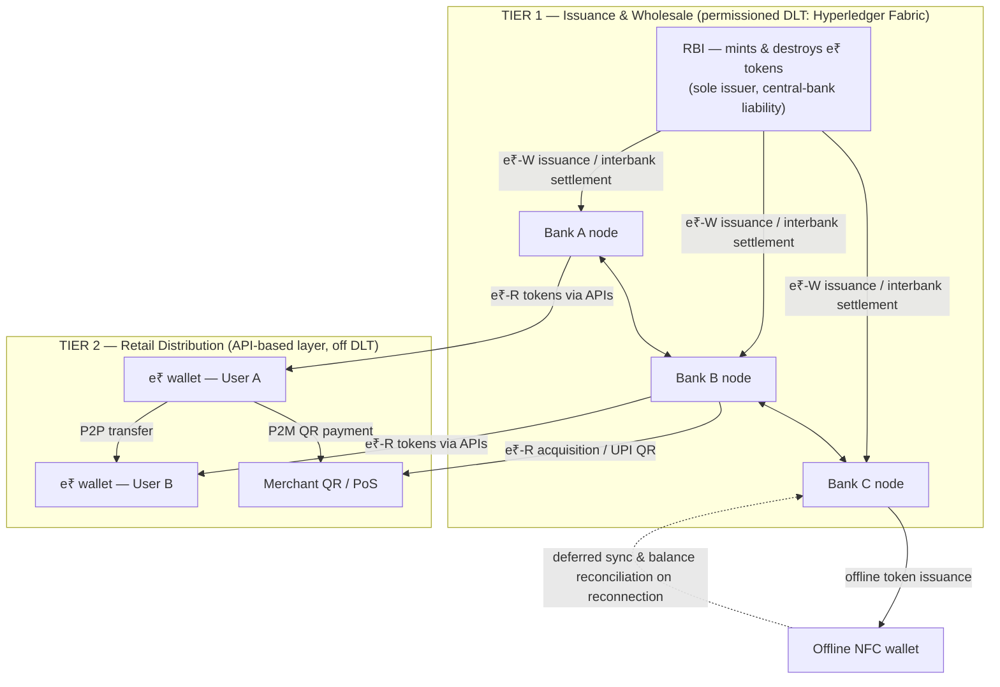
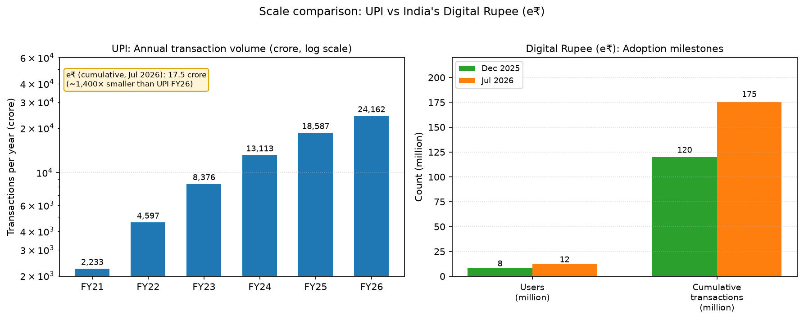

# Case Study: Blockchain Technology in India's Digital Rupee (e₹) — RBI's Central Bank Digital Currency

**Subject:** Fundamentals of Blockchain (Foundation of Blockchain — GTU Diploma IT, Sem 5)
**Type:** Group assignment case study | **Status:** Data current as of August 2026

---

## 1. Background

India's journey towards a Central Bank Digital Currency (CBDC) began formally in October 2020, when the Reserve Bank of India (RBI) constituted an Internal Working Group to study the design and implementation architecture for a digital rupee, which submitted its report in February 2021. The Union Budget announced on February 1, 2022 declared that a "Digital Rupee" would be launched from FY 2022-23 onwards, and the government subsequently notified amendments to the Reserve Bank of India Act, 1934 to bring digital currency within the legal definition of "bank note" ([Concept Note](https://www.rbi.org.in/scripts/PublicationReportDetails.aspx?ID=1218)). On October 7, 2022, the RBI released its [Concept Note on Central Bank Digital Currency](https://www.rbi.org.in/Scripts/BS_PressReleaseDisplay.aspx?prid=54510), outlining objectives, design choices (wholesale vs retail, direct vs indirect model, token vs account-based), benefits, and risks of the e₹.

The first pilot, e₹-Wholesale (e₹-W), commenced on **November 1, 2022** with nine banks — SBI, Bank of Baroda, Union Bank of India, HDFC Bank, ICICI Bank, Kotak Mahindra Bank, Yes Bank, IDFC First Bank and HSBC — for settlement of secondary-market transactions in government securities ([RBI press release](https://www.rbi.org.in/Scripts/BS_PressReleaseDisplay.aspx?prid=54616)). The e₹-Retail (e₹-R) pilot began on **December 1, 2022** with four banks (SBI, ICICI, Yes Bank, IDFC First Bank) across four cities — Mumbai, New Delhi, Bengaluru and Bhubaneswar — later extended to eight banks and 13 cities ([RBI press release](https://rbi.org.in/Scripts/BS_PressReleaseDisplay.aspx?prid=54773)).

Current status is significant yet modest. By end-March 2025 the retail pilot covered **17 banks and 60 lakh users**, with e₹ in circulation rising to ₹1,016 crore ([ET](https://economictimes.indiatimes.com/tech/technology/e-rupee-in-circulation-grows-to-over-rs-1000-crore-rbi-exploring-cross-border-cbdc-pilots/articleshow/121485395.cms)); by December 2025 retail transactions had crossed **120 million** worth ₹28,000 crore, with over **8 million users** ([Business Standard](https://www.business-standard.com/finance/news/retail-cbdc-transactions-hit-120-mn-value-crosses-28-000-crore-rbi-dg-125120501178_1.html)); and by July 2026 the pilot had reached **12 million users** and **175 million transactions** worth nearly ₹400 billion (~$4.8 billion) ([CNBC-TV18](https://www.cnbctv18.com/economy/india-pushing-rupee-internationalisation-through-local-currency-pacts-rbi-governor-19936799.htm)). In August 2026, Deputy Governor Rohit Jain asserted that CBDC "is actually being used for actual transactions. It is only for namesake that it is a pilot" ([The Hindu](https://www.thehindu.com/business/cbdc-and-uli-make-further-inroads-state-govts-show-increasing-interest-rbi-dy-governor-rohit-jain/article71309304.ece)).

## 2. Problem Statement

India's payment and currency landscape, despite being among the world's most advanced, suffers from structural inefficiencies that a CBDC was designed to address. First, **physical cash is expensive to manage**: printing, transporting, storing, and destroying currency imposes recurring costs on the state and banks, and cash cannot generate transaction data for policy. Second, despite banking penetration, **financial inclusion gaps persist** — millions of unbanked and underbanked citizens, especially in rural areas, lack access to safe, interest-free, state-guaranteed digital money. Third, India needed **programmable money** — funds that governments and banks can bind to a purpose (subsidies, targeted credit) to prevent diversion — which ordinary bank money cannot natively support ([Concept Note](https://www.rbi.org.in/scripts/PublicationReportDetails.aspx?ID=1218)). Fourth, **cross-border payments remain slow and costly**: India is the world's largest recipient of remittances, yet correspondent-banking chains impose high fees and multi-day turnaround ([Business Standard](https://www.business-standard.com/markets/capital-market-news/rbi-to-explore-commencing-cbdc-pilots-on-cross-border-payments-125052901288_1.html)). Fifth, the RBI sees an unregulated cryptocurrency risk: private virtual currencies "sit at substantial odds to the historical concept of money," so a sovereign digital alternative offers the benefits of digital money without the associated risks ([Business Standard](https://www.business-standard.com/article/markets/rbi-to-launch-digital-rupee-on-pilot-basis-soon-issues-concept-note-122100701037_1.html)).

Crucially, **UPI alone could not solve these problems**. UPI is a payment *instruction* layer that moves commercial-bank deposits; it offers no settlement finality in central-bank money (interbank settlement is deferred), carries bank rather than sovereign credit risk, cannot be programmed or tokenised for purpose-bound use, and requires internet connectivity. The e₹, by contrast, is a token-based legal tender that is a direct claim on the RBI with immediate settlement finality — "an electronic version of cash" ([Concept Note](https://www.rbi.org.in/scripts/PublicationReportDetails.aspx?ID=1218)). As Deputy Governor T. Rabi Sankar explains, "CBDC is a form of currency, whereas UPI is a payment instrument... CBDC can be tokenised and programmed, enabling use cases that... payment systems cannot support" ([CBPN interview](http://cbpn.currencyresearch.com/blog/2026/04/24/in-conversation-with-t-rabi-sankar-deputy-governor-reserve-bank-of-india)).

## 3. Objectives

The RBI's Concept Note and successive policy statements define the following objectives for the e₹:

1. **Reduce cash dependency** — lower the operational costs of physical currency management (printing, logistics, storage, destruction) by offering a digital form of sovereign currency that is "easier, faster and cheaper" than banknotes ([Concept Note](https://www.rbi.org.in/scripts/PublicationReportDetails.aspx?ID=1218)).
2. **Improve monetary policy transmission** — real-time, granular data on digital currency usage and the ability to distribute funds instantly can give the central bank better visibility into money demand and velocity, supporting evidence-based policy.
3. **Enable real-time, low-cost settlement** — e₹-W eliminates the need for settlement-guarantee infrastructure and collateral in interbank markets by settling in central-bank money ([RBI e₹-W release](https://www.rbi.org.in/Scripts/BS_PressReleaseDisplay.aspx?prid=54616)).
4. **Provide safe digital money** — the e₹ is a direct liability of the RBI (not of a commercial bank), ensuring zero issuer default risk and "trust, safety and settlement finality" akin to cash ([RBI e₹-R release](https://rbi.org.in/Scripts/BS_PressReleaseDisplay.aspx?prid=54773)).
5. **Support programmable subsidies and welfare** — purpose-bound tokens that ensure funds are spent only for designated purposes (e.g., PDS food subsidies, agricultural input support), reducing leakage in government transfers ([New Indian Express](https://www.newindianexpress.com/business/2026/Aug/07/digital-rupee-struggles-programmable-cbdc-comes-to-rescue)).
6. **Enhance cross-border payment efficiency** — faster, cheaper, more transparent cross-border payments via bilateral and multilateral CBDC linkages, given India's status as the world's largest remittance recipient ([BIS](https://www.bis.org/press/p240701.htm)).

A stated secondary motive is offering citizens an alternative to unregulated virtual currencies without their volatility and illicit-use risks ([The Hindu](https://www.thehindu.com/business/Economy/explained-rbis-concept-note-on-introducing-cbdcs/article66004865.ece)).

## 4. Technology Used

The e₹ is not a pure blockchain product; it is a **hybrid architecture** in which a permissioned DLT powers the core issuance layer while a conventional, API-based infrastructure carries retail traffic. The table below summarises the technology stack ([PwC India](https://www.pwc.in/research-and-insights-hub/future-of-digital-currency-in-india.html); [LF Decentralized Trust](https://www.lfdecentralizedtrust.org/hubfs/LFDT_CBDC%20ebook_V3-1.pdf)):

| Technology | Purpose |
|---|---|
| Hyperledger Fabric (DLT) | Core wholesale layer; RBI-to-bank token issuance and e₹-W interbank settlement on a permissioned DLT |
| API-based infrastructure | Retail layer — deliberately *not* on DLT; UPI-inspired APIs handle high-volume wallet transactions |
| NPCI / UPI integration | Interoperability with existing payment rails; e₹ wallets can scan UPI QR codes for P2M payments ([Business Standard](https://www.business-standard.com/finance/personal-finance/rbi-s-offline-digital-rupee-is-here-pay-with-digital-rupee-even-without-internet-125101300699_1.html)) |
| Digital wallets | e₹ wallets (bank apps) store tokens on mobile devices; wallet recovery supported if the device is lost |
| Encryption & cryptography | End-to-end encryption, digital signatures and hardware security modules for transaction security and privacy |
| Offline NFC | Near-field communication for tap-based offline payments, plus telecom-assisted offline mode with minimal signal ([Business Standard](https://www.business-standard.com/finance/personal-finance/rbi-s-offline-digital-rupee-is-here-pay-with-digital-rupee-even-without-internet-125101300699_1.html)) |
| Smart contracts / programmability | Purpose-bound tokens, conditional payments, expiry/geo-restricted funds for welfare and credit use cases ([New Indian Express](https://www.newindianexpress.com/business/2026/Aug/07/digital-rupee-struggles-programmable-cbdc-comes-to-rescue)) |
| Cloud infrastructure | Hosting and managing DLT and API nodes; NPCI provides the CBDC technology platform ([CBPN interview](http://cbpn.currencyresearch.com/blog/2026/04/24/in-conversation-with-t-rabi-sankar-deputy-governor-reserve-bank-of-india)) |

The retail layer was kept off DLT "primarily because of scalability and throughput challenges related to this technology," while the wholesale layer uses Fabric because it serves the small set of banks issuing tokens ([PwC India](https://www.pwc.in/research-and-insights-hub/future-of-digital-currency-in-india.html)).

## 5. Working Process / Architecture

The RBI adopted the **two-tier (indirect) model** recommended in the Concept Note: the central bank is the sole issuer and tracks only wholesale holdings, while banks act as distribution intermediaries handling KYC, wallet management and customer service — mirroring how physical currency is managed ([Concept Note](https://www.rbi.org.in/scripts/PublicationReportDetails.aspx?ID=1218)).



The transaction lifecycle proceeds in six steps:

```
 STEP 1            STEP 2                STEP 3                STEP 4               STEP 5              STEP 6
 RBI mints e₹      Banks acquire         Banks distribute      User A sends e₹      Settlement          Offline (NFC)
 tokens on the     e₹-W from RBI         e₹-R to users         to User B (P2P)      is final in          tap transfer with
 wholesale DLT     against debit to      via digital wallets   or Merchant (P2M)    real / near-real-    deferred sync:
 (Fabric) pool     their reserve        on the API retail     using wallet app      time in central-     value moves to a
                   accounts             layer                  or merchant QR       bank money           secure element;
                                                                                                        balance reconciled
                                                                                                        when connectivity
                                                                                                        returns
```

Because e₹-R is token-based with immediate wallet-to-wallet transfer, payment and settlement collapse into a single step — the key difference from UPI, where the message is instant but interbank settlement is deferred.

## 6. Role of Blockchain / DLT

Hyperledger Fabric was chosen for the wholesale layer because it is a **permissioned, identity-based DLT** — only RBI-designated banks hold nodes, membership is enforced through certificates, and consensus (Raft/orderer-based) provides deterministic, immediate finality, unlike the probabilistic finality of public chains ([LF Decentralized Trust](https://www.lfdecentralizedtrust.org/hubfs/LFDT_CBDC%20ebook_V3-1.pdf); [PwC India](https://www.pwc.in/research-and-insights-hub/future-of-digital-currency-in-india.html)). The wholesale segment involves only banks, enabling DLT's auditability without throughput constraints: every e₹-W transaction is an immutable, replicated, jointly-verified ledger entry, giving the RBI and banks transparent, tamper-evident records of interbank settlement.

The retail layer, however, is **intentionally NOT on DLT**. Public/permissionless blockchains (Bitcoin, Ethereum) cannot meet a national retail payments requirement — throughput of ~7–30 tps versus UPI's 763 million transactions per day ([The Hindu BusinessLine](https://www.thehindubusinessline.com/money-and-banking/upi-clocks-record-2366-billion-transactions-in-july-as-everyday-usage-powers-growth/article71294981.ece)) — and even permissioned DLT consensus "requires additional overhead which is the primary reason why DLT enables lower transactions than conventional architectures" ([Concept Note](https://www.rbi.org.in/scripts/PublicationReportDetails.aspx?ID=1218)). The hybrid design therefore gives India blockchain benefits (immutability, auditability, cryptographic security, conditional/programmable settlement) in the core layer where they matter, and conventional scalability where it matters.

| Feature | Digital Rupee (e₹) | UPI | Cash | Bitcoin |
|---|---|---|---|---|
| Issuer / liability | RBI — central-bank liability | Bank deposits — bank liability | RBI — central-bank liability | None — algorithmic issuance |
| Form | Token-based digital currency | Account-based payment rail | Physical notes & coins | Permissionless public DLT currency |
| Settlement | Immediate finality in central-bank money | Instant messaging; deferred interbank settlement | Immediate physical handover | Probabilistic finality (~10–60 min) |
| Offline usability | Yes — NFC tap, telecom-assisted | No — requires internet | Always | No |
| Programmability | Yes — purpose-bound tokens | Limited | None | Yes — smart-contract layers |
| Interest paid | No | Interest on underlying bank balance | No | No |
| Anonymity | Tiered anonymity (planned/limited) | Low — fully KYC-linked | High | Pseudonymous |
| Typical scale | ~12M users, 175M cumulative txns (Jul 2026) | 24,162 cr txns in FY26; 763M/day | N/A | ~7 tps; ~2.5 cr txns in FY26-equivalent periods |
| Price volatility | None (fiat parity) | N/A | None | Very high |
| Legal tender | Yes | No (a payment system) | Yes | Not legal tender in India |

## 7. Security Measures

Security is embedded at all four layers of the e₹ stack:

- **Double-spending prevention.** In the DLT core, token balances are atomic and consensus-validated: the ledger permits a token transfer only if the sender's balance is sufficient, and the same token can never be presented twice. In the retail layer, the centralised token ledger (the "digital vault") performs the same check before wallet balances update ([PwC India](https://www.pwc.in/research-and-insights-hub/future-of-digital-currency-in-india.html)).
- **Offline transaction security.** Offline NFC transfers happen on the device's secure element; because the network cannot be consulted, RBI caps offline transaction value, and balances are reconciled against the vault on reconnection, with any conflict resolved against the authoritative central record ([Business Standard](https://www.business-standard.com/finance/personal-finance/rbi-s-offline-digital-rupee-is-here-pay-with-digital-rupee-even-without-internet-125101300699_1.html)).
- **Encryption.** Wallet-to-wallet transfers are protected by transport-layer encryption and digital signatures; issuing operations sit behind hardware security modules (HSMs) — standard central-bank-grade cryptographic controls.
- **Minting/burn control.** Only the RBI can create or destroy e₹ tokens, giving the central bank absolute control over the money supply in digital form and preserving monetary sovereignty.
- **Tiered anonymity.** The Concept Note seeks "reasonable anonymity for small value transactions akin to anonymity associated with physical cash," balancing privacy with AML/CFT compliance; all current pilot users are fully KYC-verified, with tiered anonymity planned ([Concept Note](https://www.rbi.org.in/scripts/PublicationReportDetails.aspx?ID=1218)).
- **Device binding and authentication.** E₹ wallets are bound to the registered device and protected by multi-factor authentication; lost-device wallet recovery is supported through the issuing bank.
- **Fraud controls.** Banks apply the same fraud-management, transaction-monitoring and AML/CFT frameworks used for UPI and net banking, augmented by RBI's Digital Payment Intelligence Platform being built to identify suspicious transactions in real time ([RBI Annual Report](https://www.rbi.org.in/scripts/AnnualReportPublications.aspx?Id=1469)).

## 8. Benefits Achieved

- **Real-time settlement with finality.** e₹ payments transfer central-bank money outright at the moment of the transaction — unlike UPI, where the user-facing message is instant but interbank settlement is processed later. This is the e₹'s core technical superiority over the existing rails ([PwC India](https://www.pwc.in/research-and-insights-hub/future-of-digital-currency-in-india.html)).
- **Reduced cash costs.** The CBDC directly supports the policy objective of lowering currency-management costs; note-printing expenses themselves fell 23.5% in FY26 even as cash circulation rose ([ET](https://economictimes.indiatimes.com/news/economy/finance/retail-central-bank-digital-currency-in-circulation-falls-by-24-in-fy26/articleshow/131394155.cms)).
- **Financial inclusion.** As token-based digital cash, e₹ requires no bank account to transact and works offline — "extending usability in low-connectivity zones" ([ETBFSI](https://bfsi.economictimes.indiatimes.com/articles/rbis-cbdc-retail-pilot-surpasses-60-lakh-users-introduces-offline-and-programmable-features/121482944)). India is among the first countries globally to operationalise an offline CBDC usable without continuous connectivity ([Business Standard](https://www.business-standard.com/finance/personal-finance/rbi-s-offline-digital-rupee-is-here-pay-with-digital-rupee-even-without-internet-125101300699_1.html)).
- **Programmable welfare.** Purpose-bound e₹ is delivering real outcomes: PDS food subsidies redeemable only for eligible commodities at fair-price shops in Gujarat, Puducherry and Chandigarh; Gujarat's G-SAFAL scheme restricting livelihood assistance to permitted agricultural inputs; bank-deployed programmable loans (e.g., machinery loans spendable only on machinery) ([ET](https://economictimes.indiatimes.com/news/economy/finance/retail-central-bank-digital-currency-in-circulation-falls-by-24-in-fy26/articleshow/131394155.cms); [New Indian Express](https://www.newindianexpress.com/business/2026/Aug/07/digital-rupee-struggles-programmable-cbdc-comes-to-rescue)).
- **24/7 availability and outage resilience.** The DLT core and offline modes make the e₹ available around the clock, including in scenarios where electricity or telecom networks fail — a resilience argument the Concept Note explicitly makes for retail CBDCs ([Concept Note](https://www.rbi.org.in/scripts/PublicationReportDetails.aspx?ID=1218)).
- **Policy data.** Systematic, aggregated transaction data supports better-informed monetary and payments policy; RBI's Survey on Usage of Digital Payments shows 52% of users already transact digitally ([RBI Annual Report](https://www.rbi.org.in/scripts/AnnualReportPublications.aspx?Id=1469)).

## 9. Challenges & Limitations

The central challenge is **adoption**. As of July 2026 the e₹ has ~12 million users and 175 million cumulative transactions ([CNBC-TV18](https://www.cnbctv18.com/economy/india-pushing-rupee-internationalisation-through-local-currency-pacts-rbi-governor-19936799.htm)) — against a population of ~1.4 billion — while UPI alone processed **24,162 crore transactions** (₹314 lakh crore) in FY26, capturing ~86% of retail digital payments and ~49% of global real-time payment volume ([PIB](https://www.pib.gov.in/PressReleasePage.aspx?lang=2&PRID=2257087&reg=3); [RBI Annual Report](https://www.rbi.org.in/scripts/AnnualReportPublications.aspx?Id=1469)). The scale gap is stark:



*Figure 1: Annual UPI transaction volume (log scale) versus cumulative e₹ adoption (data: [PIB/NPCI](https://www.pib.gov.in/PressReleasePage.aspx?lang=2&PRID=2257087&reg=3), [Business Standard](https://www.business-standard.com/finance/news/retail-cbdc-transactions-hit-120-mn-value-crosses-28-000-crore-rbi-dg-125120501178_1.html), [CNBC-TV18](https://www.cnbctv18.com/economy/india-pushing-rupee-internationalisation-through-local-currency-pacts-rbi-governor-19936799.htm))*

In FY26 the value of retail e₹ in circulation actually **fell 24.08%** to ₹771.66 crore ([ET](https://economictimes.indiatimes.com/news/economy/finance/retail-central-bank-digital-currency-in-circulation-falls-by-24-in-fy26/articleshow/131394155.cms)). Specific challenges include:

- **UPI competition.** UPI is free, instantaneous, ubiquitous (703 banks) and entrenched — bankers concede "UPI is such a hit that it has overshadowed everything" ([New Indian Express](https://www.newindianexpress.com/business/2026/Aug/07/digital-rupee-struggles-programmable-cbdc-comes-to-rescue)).
- **Zero interest.** e₹ earns no interest, so holders rationally keep funds in bank deposits and use UPI against them, "a disincentive to hold" similar to cash ([Concept Note](https://www.rbi.org.in/scripts/PublicationReportDetails.aspx?ID=1218)).
- **Digital literacy.** An MDPI survey finds only 9% of respondents actually use e₹ despite 60% awareness, with digital financial literacy the strongest adoption predictor ([MDPI](https://www.mdpi.com/1911-8074/19/4/235)).
- **Privacy vs AML.** Balancing cash-like anonymity for small transactions with traceability for AML/CFT remains an unresolved design tension.
- **Disintermediation risk.** If households shift deposits to e₹ en masse, bank funding and credit creation could shrink — a financial-stability concern the Concept Note analyses.
- **Scalability and missing killer use case.** Full nationwide rollout demands massive throughput; and save for programmability, no retail use case yet exists that UPI cannot already do.

## 10. Outcomes & Future Roadmap

Despite modest retail uptake, the pilot has achieved systemic impact and clear forward momentum. **Pilot results:** 175 million transactions (~₹400 billion) since launch; 12 million users; e₹ minted in note denominations (₹500 notes dominate circulation at ₹857 crore, FY25); e₹-W expanded from G-Sec settlement to the inter-bank borrowing market with four standalone primary dealers added ([ET](https://economictimes.indiatimes.com/tech/technology/e-rupee-in-circulation-grows-to-over-rs-1000-crore-rbi-exploring-cross-border-cbdc-pilots/articleshow/121485395.cms)). RBI launched a **retail CBDC sandbox** in October 2025 for fintechs to build and test solutions ([Reuters](https://www.reuters.com/world/india/indias-central-bank-launches-digital-currency-retail-sandbox-2025-10-08/)), and non-bank entities have been allowed to offer e₹ wallets to close the last-mile gap ([CBPN interview](http://cbpn.currencyresearch.com/blog/2026/04/24/in-conversation-with-t-rabi-sankar-deputy-governor-reserve-bank-of-india)).

The roadmap centres on programmability, offline capability, tokenisation and cross-border payments. FY26 saw DBT and PDS subsidy pilots (Gujarat, Puducherry, Chandigarh), the **Unified Markets Interface (UMI)** platform piloting tokenisation of certificates of deposit, and a digital-asset MoU with the Monetary Authority of Singapore ([ET](https://economictimes.indiatimes.com/news/economy/finance/retail-central-bank-digital-currency-in-circulation-falls-by-24-in-fy26/articleshow/131394155.cms); [Mint](https://www.livemint.com/industry/banking/rbi-to-expand-e-rupee-pilot-to-include-cross-border-payments-welfare-transfers-and-domestic-retail-11780056262903.html)). On cross-border rails, India is part of **Project Nexus**, the BIS scheme connecting instant payment systems (India, Malaysia, Philippines, Singapore, Thailand incorporated Nexus Global Payments in 2025) ([BIS](https://www.bis.org/about/bisih/topics/fmis/nexus.htm)), and an **observing member of Project mBridge**, the multi-CBDC DLT platform that reached MVP stage in 2024 ([BIS](https://www.bis.org/about/bisih/topics/cbdc/mcbdc_bridge.htm)). Bilateral retail-CBDC pilots with the UAE (a top remittance corridor) and Singapore are being operationalised ([Mint](https://www.livemint.com/industry/banking/rbi-to-expand-e-rupee-pilot-to-include-cross-border-payments-welfare-transfers-and-domestic-retail-11780056262903.html)), and Governor Malhotra is promoting rupee internationalisation and local-currency MoUs globally ([CNBC-TV18](https://www.cnbctv18.com/economy/india-pushing-rupee-internationalisation-through-local-currency-pacts-rbi-governor-19936799.htm)). Expert consensus: e₹ will **complement**, not compete with, UPI — "CBDC and UPI are differently placed. Programmable CBDC offers capabilities that UPI cannot" ([New Indian Express](https://www.newindianexpress.com/business/2026/Aug/07/digital-rupee-struggles-programmable-cbdc-comes-to-rescue)).

## 11. Conclusion

India's Digital Rupee pilot is a qualified success. As infrastructure, it has validated every core promise: real-time settlement in central-bank money, offline usability, programmability for welfare, and growing institutional uptake — RBI officials describe it as "on the ground being used" rather than a mere pilot ([The Hindu](https://www.thehindu.com/business/cbdc-and-uli-make-further-inroads-state-govts-show-increasing-interest-rbi-dy-governor-rohit-jain/article71309304.ece)). As a retail product, however, it remains marginal — 12 million users and a 24% decline in circulation in FY26 show that UPI's lock-in, the zero-interest feature and digital-literacy gaps outweigh the e₹'s technical merits for ordinary consumers ([ET](https://economictimes.indiatimes.com/news/economy/finance/retail-central-bank-digital-currency-in-circulation-falls-by-24-in-fy26/articleshow/131394155.cms)).

Technically, the e₹ is a **genuine but limited blockchain innovation**: a hybrid system in which Hyperledger Fabric delivers immutability, transparency and conditional settlement in the interbank core, while a non-DLT API layer handles retail scale — precisely the pragmatic split the RBI's Concept Note predicted. For mass adoption, India needs: a clear retail incentive or killer use case (programmability for DBT appears to be it), tiered anonymity that makes e₹ meaningfully different from UPI, wider offline rollout, deeper digital-literacy efforts, and live cross-border corridors (Nexus, UAE, Singapore) that create demand UPI cannot serve. The final verdict: the Digital Rupee will not displace UPI, but as the sovereign digital-money layer of India's public infrastructure, programmable and cross-border capable, it is likely to become essential where trust in the state, purpose-bound money, and global interoperability are what matter.

---

## References

1. RBI, *Concept Note on Central Bank Digital Currency* (Oct 7, 2022) — https://www.rbi.org.in/Scripts/BS_PressReleaseDisplay.aspx?prid=54510
2. RBI, *Concept Note* (full text) — https://www.rbi.org.in/scripts/PublicationReportDetails.aspx?ID=1218
3. RBI Press Release, *Operationalisation of e₹-W pilot* (Oct 31, 2022) — https://www.rbi.org.in/Scripts/BS_PressReleaseDisplay.aspx?prid=54616
4. RBI Press Release, *Launch of e₹-R pilot* (Nov 29, 2022) — https://rbi.org.in/Scripts/BS_PressReleaseDisplay.aspx?prid=54773
5. PwC India, *Future of digital currency in India* — https://www.pwc.in/research-and-insights-hub/future-of-digital-currency-in-india.html
6. LF Decentralized Trust, *Central Bank Digital Currencies ebook* — https://www.lfdecentralizedtrust.org/hubfs/LFDT_CBDC%20ebook_V3-1.pdf
7. The Hindu BusinessLine, *UPI clocks record 23.66 billion transactions in July* (Aug 1, 2026) — https://www.thehindubusinessline.com/money-and-banking/upi-clocks-record-2366-billion-transactions-in-july-as-everyday-usage-powers-growth/article71294981.ece
8. PIB, *UPI completes 10 years* (Apr 30, 2026) — https://www.pib.gov.in/PressReleasePage.aspx?lang=2&PRID=2257087&reg=3
9. ET, *Retail CBDC in circulation falls by 24% in FY26* (May 29, 2026) — https://economictimes.indiatimes.com/news/economy/finance/retail-central-bank-digital-currency-in-circulation-falls-by-24-in-fy26/articleshow/131394155.cms
10. ET, *E-rupee in circulation grows to over Rs 1,000 crore* (May 29, 2025) — https://economictimes.indiatimes.com/tech/technology/e-rupee-in-circulation-grows-to-over-rs-1000-crore-rbi-exploring-cross-border-cbdc-pilots/articleshow/121485395.cms
11. Business Standard, *Retail CBDC transactions hit 120 mn, value crosses ₹28,000 crore* (Dec 5, 2025) — https://www.business-standard.com/finance/news/retail-cbdc-transactions-hit-120-mn-value-crosses-28-000-crore-rbi-dg-125120501178_1.html
12. CNBC-TV18, *India pushing rupee internationalisation* (Jul 1, 2026) — https://www.cnbctv18.com/economy/india-pushing-rupee-internationalisation-through-local-currency-pacts-rbi-governor-19936799.htm
13. The Hindu, *CBDC and ULI make further inroads* (Aug 5, 2026) — https://www.thehindu.com/business/cbdc-and-uli-make-further-inroads-state-govts-show-increasing-interest-rbi-dy-governor-rohit-jain/article71309304.ece
14. Business Standard, *RBI's offline digital rupee is here* (Oct 13, 2025) — https://www.business-standard.com/finance/personal-finance/rbi-s-offline-digital-rupee-is-here-pay-with-digital-rupee-even-without-internet-125101300699_1.html
15. Reuters, *India's central bank launches digital currency retail sandbox* (Oct 8, 2025) — https://www.reuters.com/world/india/indias-central-bank-launches-digital-currency-retail-sandbox-2025-10-08/
16. New Indian Express, *Digital rupee struggles; programmable CBDC comes to rescue* (Aug 7, 2026) — https://www.newindianexpress.com/business/2026/Aug/07/digital-rupee-struggles-programmable-cbdc-comes-to-rescue
17. Mint, *RBI to expand e-Rupee pilot* (May 29, 2026) — https://www.livemint.com/industry/banking/rbi-to-expand-e-rupee-pilot-to-include-cross-border-payments-welfare-transfers-and-domestic-retail-11780056262903.html
18. BIS, *Project Nexus: enabling instant cross-border payments* — https://www.bis.org/about/bisih/topics/fmis/nexus.htm
19. BIS Press Release, *Project Nexus blueprint* (Jul 1, 2024) — https://www.bis.org/press/p240701.htm
20. BIS, *Project mBridge reached MVP stage* — https://www.bis.org/about/bisih/topics/cbdc/mcbdc_bridge.htm
21. BIS Press Release, *Project mBridge reaches MVP* (Jun 5, 2024) — https://www.bis.org/press/p240605.htm
22. Central Bank Payments News, *In conversation with T. Rabi Sankar* (Apr 24, 2026) — http://cbpn.currencyresearch.com/blog/2026/04/24/in-conversation-with-t-rabi-sankar-deputy-governor-reserve-bank-of-india
23. ETBFSI, *CBDC retail pilot surpasses 60 lakh users* (May 29, 2025) — https://bfsi.economictimes.indiatimes.com/articles/rbis-cbdc-retail-pilot-surpasses-60-lakh-users-introduces-offline-and-programmable-features/121482944
24. RBI, *Annual Report 2025-26* — https://www.rbi.org.in/scripts/AnnualReportPublications.aspx?Id=1469
25. MDPI JRFM, *Does Information Nudge Make the e-Rupee More Adoptable?* (2026) — https://www.mdpi.com/1911-8074/19/4/235
26. The Hindu, *Explained: RBI's concept note on CBDCs* (Oct 15, 2022) — https://www.thehindu.com/business/Economy/explained-rbis-concept-note-on-introducing-cbdcs/article66004865.ece