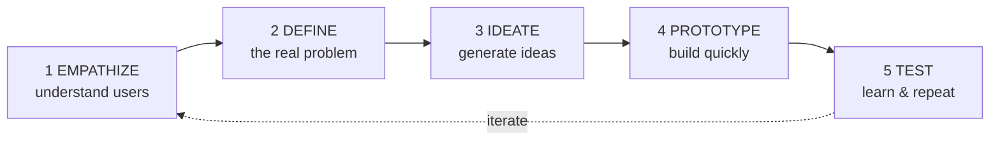
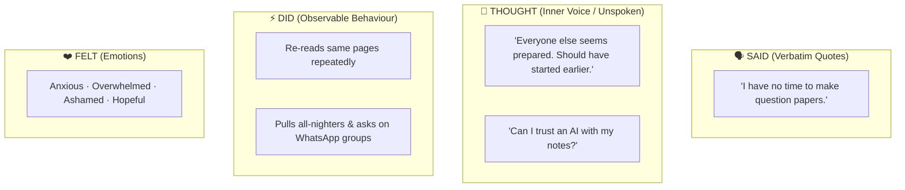
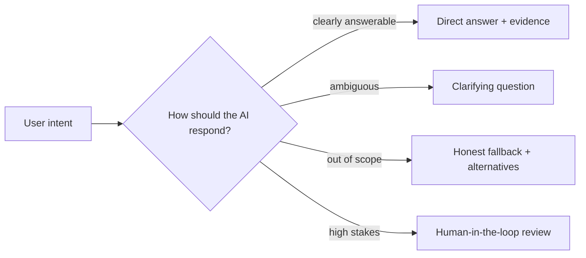
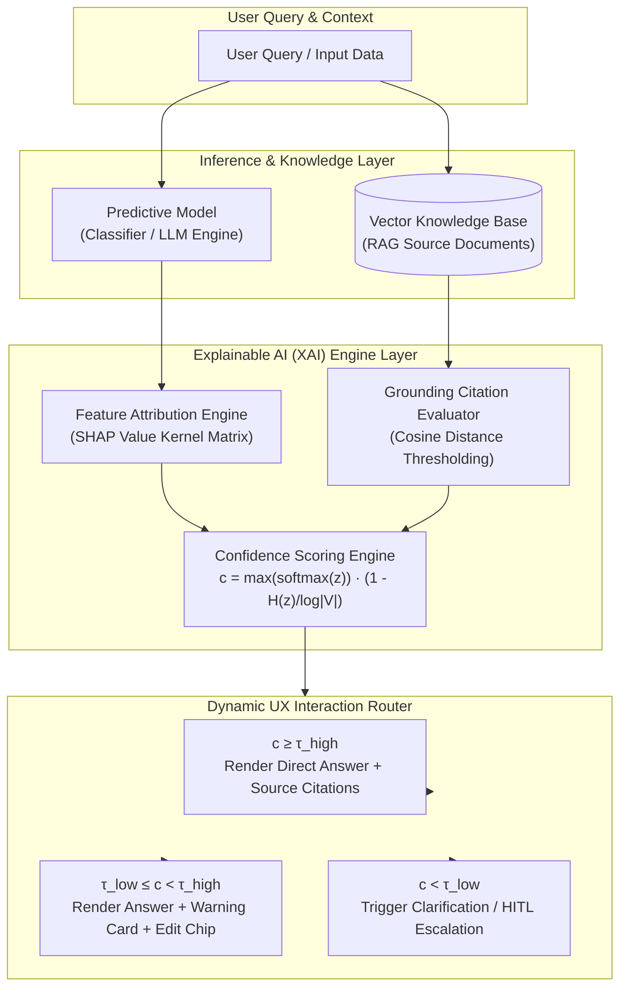
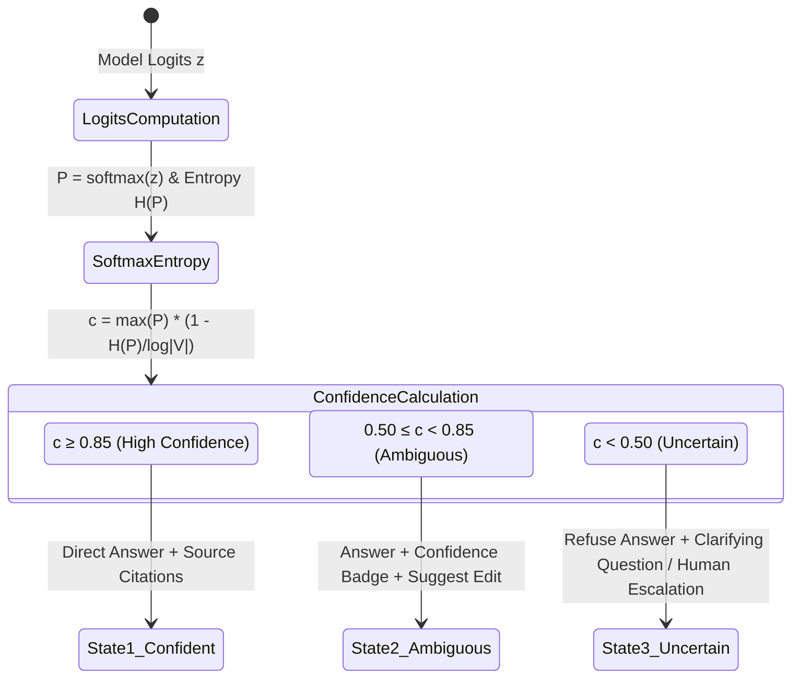
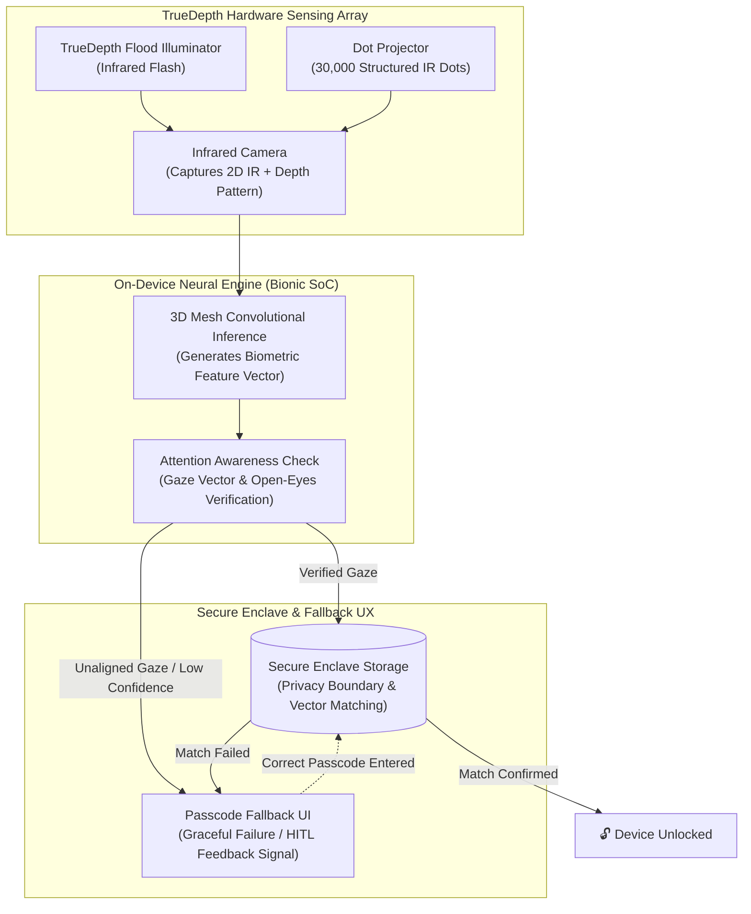

# UNIT 2 — Design Thinking & Human-Centred AI 🎨

> **AI Product Design (DI05016021)** · **7 hrs · 16% weightage**
> **Covers syllabus sections:** 2.1 Design Thinking · 2.2 Empathy Mapping · 2.3 User Persona · 2.4 Problem Statement · 2.5 Customer Journey · 2.6 UX principles for AI · 2.7 Human-AI interaction design · 2.8 Bias in AI · 2.9 Explainable AI
> **Related practicals:** [[P04 — Persona Empathy Journey|P04]], [[P05 — Interaction Flow Wireframe|P05]]

---

## 🧭 Chapter Roadmap

```
UNIT 2 — Design Thinking & Human-Centred AI
├── 2.1 The Design Thinking process (5 stages)   ★★★★★  ← "name the 5 stages"
├── 2.2 Empathy Mapping                           ★★★★★  ← P04
├── 2.3 User Persona Development                  ★★★★★  ← P04
├── 2.4 Problem Statement Writing                 ★★★★   ← P01
├── 2.5 Customer Journey Mapping                  ★★★★   ← P04
├── 2.6 UX principles for AI systems              ★★★★   ← P05
├── 2.7 Human-AI interaction design               ★★★★   ← P05
├── 2.8 Bias in AI systems (basic)                ★★★★   ← P12
└── 2.9 Explainable AI (XAI)                      ★★★
```

### Learning outcomes — after this unit you can:
1. Name and describe the **5 stages of Design Thinking** and where AI fits into each.
2. Build an **empathy map** and read its four quadrants for design insight.
3. Create a **user persona** grounded in research.
4. Write a **problem statement** that is user-centred and measurable.
5. Draw a **customer journey map** with pain points and opportunities.
6. Apply **UX principles specific to AI** (set expectations, show confidence, explain output).
7. Explain **bias** and **explainability** in plain words and say why designers must care.

---

## 2.1 Introduction to Design Thinking ⭐⭐

**Design Thinking** is a *human-centred* approach to innovation: understand the user deeply, define the real problem, then build and test solutions quickly. It's a **mindset + process**, not a tool.

**The 5 stages (Stanford d.school) — memorise the sequence and the verbs:**



| Stage | What you do | AI product example (StudyMate) |
|---|---|---|
| **1. Empathize** | Observe/interview users; understand their world | Interview 5 students about exam-week revision |
| **2. Define** | Narrow to one problem statement | "Students can't self-test from their own notes fast" |
| **3. Ideate** | Brainstorm many solutions, then pick | 20 ideas → summariser + quiz + chat |
| **4. Prototype** | Build a cheap, fast version | Glide clickable prototype (P10) |
| **5. Test** | Put it in front of users, watch, learn | Observe Riya using it; note where she gets stuck |

> [!tip] Key exam point
> Design Thinking is **iterative, not linear** — the loop-back arrow from Test to Empathize is the whole point. Failing *early and cheaply* in Test is success, not failure.

## 2.2 Empathy Mapping ⭐⭐

An **empathy map** captures *what a user says, thinks, does, and feels* at a moment, to build understanding before designing. It's organised around 4 quadrants.



**Design guidance:**
- **Said ≠ Thought.** The unspoken quadrant (fear, shame, distrust) is the *design gold* — that's where differentiated products are born.
- **Did** — watch behaviour, don't trust self-reports ("I study daily" ≠ 10 pm phone scrolling).
- Use the map to **empathize with the user, not sympathize** — you're hunting *needs*, not agreeing with complaints.

## 2.3 User Persona Development ⭐

A **persona** is a research-backed *archetype* of your target user: one page that makes the team design for a real person, not "everyone". (Full worked examples in P04.)

**Anatomy of a good persona:**
| Field | Why it exists | StudyMate example (Riya) |
|---|---|---|
| **Name / age / context** | Humanises the archetype | Riya Patel, 19, Diploma IT Y2 |
| **Situation & routine** | Grounds design in real life | Mobile data limits, 2–3 hr evening study |
| **Goals** | What "success" looks like for them | Pass with 70%+, feel prepared, save hours |
| **Frustrations** | The pain your product removes | Scattered notes, no fast self-testing, awkward class doubts |
| **AI literacy** | Tells you how to talk to them | Uses ChatGPT occasionally, privacy-wary |
| **Motivators / objections** | What makes them buy / quit | Would pay ₹100–200/mo if grounded in *her* notes |

> [!warning] Exam trap
> a persona is NOT a stereotype. Every row must trace to an interview, survey, or analytics observation. "We assumed" = zero marks; "from 5 student interviews + support tickets" = full marks.

## 2.4 Problem Statement Writing ⭐⭐

A **problem statement** is one clear sentence describing *who* is struggling, *what* they struggle with, and *why it matters* — without proposing a solution.

**Template (P.R.O.B.E. — see P01 §5):**

> "**[Who]** + **[root behaviour that hurts them]** + **[measured impact]** + **[implied opportunity]**."

**Weak → strong examples:**
- ❌ "Students find studying difficult." (vague, no who/how)
- ❌ "We need a chatbot." (a solution, not a problem)
- ✅ "Final-year diploma students lose 4–5 hours per exam week re-reading scattered notes and discovering knowledge gaps only on exam day, because they have no fast way to self-test from their own material."

**The 4 checks:** (1) names a *specific* user, (2) describes a *behaviour*, (3) has *measurable* impact, (4) is solvable by *AI* (involves understanding/generating language, images or speech at scale).

## 2.5 Customer Journey Mapping ⭐

A **customer journey map** is a timeline of the user's experience across stages — *before, during, and after* using your product — annotated with touchpoints, emotions, pain points 🔴 and opportunities 🟢.

| Stage | Discover | Sign up & upload | Get summary | Take quiz | Come back |
|---|---|---|---|---|---|
| **Actions** | Sees ad/reel | Creates account, uploads PDF | Reads summary | Answers 10 MCQs | Returns before next exam |
| **Pain 🔴** | Ads feel scammy | Privacy doubt, upload friction | Long wait, generic output | Too-easy/out-of-syllabus Qs | Forgets app exists |
| **Opportunity 🟢** | Student testimonial | Guest mode, "try a dummy file" | "Grounded in YOUR notes ✓" badge | Adaptive difficulty | Exam reminders, streak |

**Rules:**
- Start the journey **before the product** (discovery) and end **after** (retention) — a map that begins at login is half a map.
- Every 🔴 pain must map to ≥1 🟢 opportunity; unmatched pains are missed requirements.
- One **metric per stage** makes the map testable (P06 turns these into priorities).

## 2.6 UX Principles for AI Systems ⭐⭐

AI UX adds principles on top of classic UX (the syllabus wants the AI-specific ones). Microsoft's "Guidelines for Human-AI Interaction" is the canonical source — the exam-friendly subset:

| Principle | Meaning | StudyMate application |
|---|---|---|
| **Set expectations** | Tell the user *before* the AI acts | "Summary ready in ~30 s" on the upload screen |
| **Ground output in data** | Show *why*/where the answer came from | Citation `[slide 14]` on every chat answer |
| **Show confidence / limits** | Don't fake certainty | Honest fallback: "Not in your notes. Want a general explanation?" |
| **Let the user steer** | Regenerate, retry, correct | 👍/👎, "retake weak questions", "explain my mistakes" |
| **Be consistent** | Same AI behaviour every time | Fixed naming of features; no silent model switches |
| **Support efficient correction** | Make fixing AI output cheap | One-tap "use my uploaded notes instead" |

> [!tip] The one-line exam answer
> *AI UX exists because AI is probabilistic — the design job is to manage user trust and expectations around a system that can be wrong.*

## 2.7 Human-AI Interaction Design

**Human-AI interaction design** = designing *conversations and collaboration* between people and AI, not just screens. Where classic UI gives commands, AI UI holds a **dialogue**.



**Design patterns you must be able to name:**
1. **Clarification** — when intent is ambiguous, ask one short question instead of guessing.
2. **Grounded answers** — cite the source (reduces hallucination trust damage).
3. **Escalation** — hand off to a human when the AI hits its limit (HITL from Unit 1).
4. **Explanations** — tell the user *what the system did*, briefly ("This quiz focuses on your 3 weakest topics").
5. **Repair** — "That wasn't helpful — what would help?" flows that let the user redirect.

## 2.8 Bias in AI Systems (basic understanding) ⭐

**AI bias** = systematic, unfair preference in AI output caused by *biased training data* (or design choices), not by the machine "choosing" to be unfair.

**How bias enters the pipeline (the 3 sources you must name):**
| Source | Example |
|---|---|
| **Biased training data** | Model trained on mostly one language/region under-serves Gujarati-medium students |
| **Biased labels/decisions by humans** | Historical hiring data that favoured a group → AI copies it |
| **Biased product design** | A study app that ranks/scores students unfairly by design |

**Why it matters in products (exam angle):**
- Bias creates **harm and unfairness** for real users (loan denial, unfair grading).
- It **breaks trust** and can **violate law** (Unit 5 governance, Unit 6 discrimination).
- The **fix starts at design**: fair data collection, testing output across groups, and refusing features that *sort* people by a model's single score. (P11/P12 turn this into a policy + risk plan.)

> [!warning] Exam trap
> bias is NOT "the model is evil". Bias is *inherited* — from data, labels, or design. An answer that blames "bad AI" alone is half marks.

## 2.9 Explainable AI (XAI — conceptual overview)

**Explainable AI (XAI)** = the ability to explain *in human terms* how and why an AI produced a result. Not every model can explain itself (a 1-billion-parameter network can't "say why") — so XAI is a **design practice** that picks *which explanations users actually need*.

| Technique (conceptual) | What it does | StudyMate example |
|---|---|---|
| **Grounding/citations** | Point at the source data | `[slide 14]` on an answer |
| **Feature attribution** | Show which inputs mattered most | "This quiz targets topics you scored low in" |
| **Confidence indicators** | Show certainty | "Answered from your notes · Medium confidence" |
| **Simple rule summaries** | Explain the decision logic | "We prioritise chapters with ≤1 attempt and low scores" |
| **Human review trail** | Show a person checked it | "Reviewed by your teacher" badge |

**Why XAI matters:** trust, accountability, debugging (bad output becomes findable), and *regulation* (Unit 5: the EU AI Act and DPDP-style rules increasingly demand explainability for consequential AI).

> **The one-liner:** *Explainability is not showing the maths — it's giving the user the right amount of honest, plain-language context for their level and stakes.*

---

## 🧠 Deep-Dive Topics

### Deep Dive A: Design Thinking vs. the Waterfall mindset
Waterfall: requirements → build → ship (user appears at the end). Design Thinking: build *cheap things* fast and show users early. For AI products this matters even more because the AI output is *unpredictable* — you must prototype interactions (P10's Glide mock) before you pay for model engineering. One sentence: *Design Thinking de-risks AI products by testing the experience before building the intelligence.*

### Deep Dive B: From journey pain → MVP feature (the thread across practicals)
P04's journey map lists 🔴 pains; P06's MoSCoW turns them into Must/Should/Could; P10's prototype lets you *test* the hypothesis cheaply. Trace one: "privacy doubt at upload" → "guest mode + visible 'no one else sees this' copy" → Glide toggle in Settings → measured by upload-completion rate. This one chain connects Units 2–4 and is exactly what a viva panel wants to hear.

### Deep Dive C: Bias vs Explainability — they're linked
You cannot audit bias (2.8) or guarantee accountability (2.9) without *some* explanation of decisions. Consequential AI (loans, marks, hiring) therefore demands both: explainability is the *tool*; bias-auditing is the *goal*. Regulators (Unit 5) now treat the pair as one requirement.

---

## 🚀 Beyond the Textbook (what most classes won't tell you)

1. **Design Thinking is 30+ years old.** Rooted in IDEO's work and Stanford's d.school; the "5 stages" are a simplified teaching version — industry uses messy iterations.
2. **The empathy map's "Thoughts" quadrant is where startups win.** Everyone collects "Says"; almost nobody collects the unspoken fear (privacy, shame, status). That gap = product differentiation.
3. **AI personas are different.** You also need a **"system persona"** — how the AI *presents itself* (tone, memory, when it says "I don't know"). It's a real design artifact, not science fiction.
4. **"Do no harm" defaults:** when in doubt, AI systems should *reduce* certainty (refuse, ask, defer) rather than fake it — this single rule prevents most AI UX disasters.
5. **Explainability has a cost.** Full explanations are expensive to build and confusing to show; good design gives *the minimum explanation the stakes demand* (a citation for a quiz answer, a human for a loan).
6. **Exam-hack memory aid for the 5 stages:** "**E**very **D**esigner **I**nvents **P**rototypes **T**oday" → Empathize · Define · Ideate · Prototype · Test.

---

## 🎯 High-Yield Exam Topics (no PYQ papers exist for this new subject — these are the likely GTU-style questions)

**Likely questions (short notes / 4 marks):**
1. List and explain the **5 stages of Design Thinking**.
2. What is an **empathy map**? Explain its four quadrants.
3. What is a **user persona**? Give the key fields.
4. What is a **customer journey map**? Explain its components.
5. What makes a **problem statement** effective?
6. List **UX principles for AI systems** (any 4).
7. What is **Explainable AI**? Give two techniques.
8. What is **AI bias**? Name two sources.
9. Differentiate **classic UX vs AI UX**.
10. Why is Design Thinking called **iterative**?

**Likely long questions (7 marks):**
11. Explain Design Thinking with the 5 stages and show how each stage applies to designing an AI product.
12. "Empathy Map + Persona + Journey Map" — explain all three and how they connect for an AI product.
13. Explain how **human-AI interaction design** principles apply to a conversational AI product (use StudyMate as example).

**Solved model answers (exam style):**

**Q. 7 marks — Explain the 5 stages of Design Thinking and apply them to an AI product.**
> (1) **Empathize** — research the user deeply: interviews, observation, empathy maps. For an AI study app we interview students about exam-week behaviour. (2) **Define** — synthesise findings into one problem statement: "Students can't self-test quickly from their own notes and discover gaps only on exam day." (3) **Ideate** — brainstorm solutions without judgement: summariser, quiz generator, chatbot, study planner; then shortlist. (4) **Prototype** — build a cheap clickable version (e.g., Glide) to test the flow without building the AI. (5) **Test** — put it in front of users, watch them fail, and iterate back to Empathize. The process is **iterative**: feedback from testing sharpens the problem definition and next prototype, making failure early and cheap rather than late and expensive.

**Q. 4 marks — What is an empathy map? Explain the four quadrants.**
> An empathy map is a 4-quadrant visual tool that captures what a user **Says**, **Thinks**, **Does** and **Feels** at a key moment, to build deep understanding before designing. **Says:** verbatim quotes ("I have no time to make question papers"). **Thinks:** the unspoken inner voice ("Everyone else seems prepared"). **Does:** observable behaviour (re-reading the same pages, all-nighters). **Feels:** emotions (anxiety, overwhelm, hope). The value is in the gaps — what a user *says* often differs from what they *think* (e.g., a student says "I'm fine" but thinks "I'm behind"). Those unspoken needs are where differentiated product ideas come from.

**Q. 7 marks — Explain UX principles for AI systems with examples.**
> Because AI output is **probabilistic**, AI UX must manage trust and expectations. Key principles: (1) **Set expectations before the AI acts** — e.g., an upload screen saying "summary ready in ~30 seconds" prevents impatience. (2) **Ground output in user data** — a chat answer citing `[slide 14]` lets the user verify and builds trust. (3) **Show confidence and limits** — an honest "Not in your notes" fallback instead of a confident guess. (4) **Let the user steer** — 👍/👎 ratings, "retake weak questions", regenerate buttons. (5) **Support efficient correction** — one-tap fixes rather than retyping. (6) **Make behaviour consistent** — the same wording and model behaviour across screens. Together these turn a probabilistic black box into a predictable, trustworthy collaborator — which is the goal of human-centred AI.

---

## ✍️ Practice Problems (self-test — answers hidden)

1. Order the 5 stages and explain what the loop-back arrow from Test means.
2. Write a problem statement for "a grocery-delivery app" that passes all four checks.
3. List 3 "Thoughts" (unspoken) a student might have that they would never say to a designer.
4. A banking app uses AI to approve credit cards. Which 3 UX-for-AI principles matter most, and why?
5. Explain how an empathy map, persona, and journey map *relate* — which one feeds which?
6. Give one example each of bias from data, bias from labels, and bias from design.

<details>
<summary>📌 Model solutions</summary>

1. Empathize → Define → Ideate → Prototype → Test. The arrow means Test reveals new user insights, so you loop back to Empathize/Define and refine — Design Thinking is a cycle, not a one-pass process.
2. "Working professionals in metros spend 30+ minutes daily buying groceries but waste ₹500–800/month on impulse purchases because they can't easily compare price-per-unit across stores." (specific user ✓ behaviour ✓ measurable ✓ solvable by data/AI ✓).
3. "I'm behind everyone", "I don't understand and I'm embarrassed to ask", "If I upload my notes, someone might see them", "I'm afraid my effort won't be enough".
4. (1) Explain the decision (explainability — a rejected applicant deserves a reason); (2) show confidence (a "score + factors" view, not a bare yes/no); (3) human-in-the-loop escalation for appeals — high stakes demand human review.
5. Research → Empathy Map (captures the moment) → Persona (synthesises who the user is) → Journey Map (spreads the user across time). Persona answers *who*, empathy map *what's in their head*, journey map *when/where the pain happens*; P04 builds all three together.
6. Data bias: a resume model trained mostly on men under-ranks women. Label bias: historically-biased loan approvals taught the model to repeat them. Design bias: a study app that surfaces only "high-predicted-score" students ignores others (that's why StudyMate refuses to rank students).
</details>

---

## 📖 Glossary of Key Terms

| Term | Definition |
|---|---|
| **Design Thinking** | A human-centred, iterative innovation process (Empathize → Define → Ideate → Prototype → Test) |
| **Empathy map** | 4-quadrant tool capturing Says / Thinks / Does / Feels |
| **Persona** | Research-backed archetype of a target user |
| **Problem statement** | One user-centred, measurable sentence defining the problem (not the solution) |
| **Customer journey map** | Time-ordered user experience with touchpoints, pains 🔴 and opportunities 🟢 |
| **Touchpoint** | Any place the user meets the product (screen, email, ad) |
| **AI UX principles** | Design rules for probabilistic systems: expectations, grounding, confidence, steering |
| **Human-AI interaction** | Designing dialogue/collaboration between people and AI |
| **Clarification** | Asking one short question when user intent is ambiguous |
| **Escalation / HITL** | Handing a task to a human when AI can't do it safely |
| **AI bias** | Systematic unfairness inherited from data, labels, or design |
| **XAI / Explainability** | Making AI decisions understandable in human terms |
| **Grounding / citation** | Pointing AI output back to its source data |

---

## 🔗 Curated Resources (per concept)

**Design Thinking**
- Stanford d.school: https://dschool.stanford.edu
- "What is Design Thinking?" — Interaction Design Foundation: https://www.interaction-design.org/literature/topics/design-thinking
- IDEO Design Kit (methods bank): https://www.designkit.org

**Empathy / Personas / Journey**
- NN/g Empathy Map: https://www.nngroup.com/articles/empathy-mapping/
- NN/g Journey Map: https://www.nngroup.com/articles/journey-mapping-101/
- NN/g Personas: https://www.nngroup.com/articles/personas/
- Google People + AI Guidebook (AI-specific personas): https://pair.withgoogle.com

**UX for AI**
- Microsoft HAX Guidelines: https://www.microsoft.com/en-us/research/publication/guidelines-for-human-ai-interaction/
- NN/g "AI & UX": https://www.nngroup.com/articles/human-ai-interaction/
- Fable/UXPA resources on inclusive design: search *inclusive design ai ux*

**Bias & Explainability**
- "Bias in AI" explainers (IBM): search *ibm what is ai bias* 
- Explainable AI overview (Google): https://cloud.google.com/explainable-ai
- The Alignment Problem — Brian Christian (book from your syllabus)

## 🎥 Video Study Guide (YouTube)

> Don't like reading? Me neither. This is your **structured video path** for the whole unit — better than the syllabus because it tells you *exactly what to search* and *what to watch first*, in a sensible order. Everything below is search keywords (they never rot like links do) + channels you can trust.

### 🧑‍🎓 Step 0 — Pick your learning style

| Style | You learn best by | Your path through this unit |
|---|---|---|
| 🎧 **Listener** | short, clear explainers | Watch 1 explainer per topic from the table below (3–8 min each) |
| 🛠️ **Builder** | doing design artifacts | Do [[P04 — Persona Empathy Journey|P04]] and [[P05 — Interaction Flow Wireframe|P05]] after each explainer |
| 🔧 **Tinkerer** | templates & practice | Download persona/empathy/journey templates and fill them for a product you like |
| 🧠 **Deep Diver** | full theory, "why" | Watch the d.school + NN/g playlists at the bottom |
| 🧭 **Explorer** | breadth & curiosity | Watch "design thinking in real companies" case studies first |
| 🎓 **Academic** | exam marks | Grind the High-Yield list above → write the 5 stages and UX principles from memory |

### 🎬 Step 1 — Watch by topic (search these on YouTube)

| Topic | YouTube search keywords (copy-paste ready) | Best channels | Style served |
|---|---|---|---|
| Design Thinking 101 | `design thinking process explained` · `5 stages of design thinking stanford` · `design thinking in 5 minutes` | Stanford d.school, IDEO U, Interaction Design Foundation | 🎧 Listener |
| Empathy mapping | `empathy map tutorial` · `empathy mapping ux example` | NN/g, CareerFoundry, AJ&Smart | 🛠️ Builder |
| Personas | `ux persona tutorial` · `how to create user personas` · `persona vs empathy map` | NN/g, CareerFoundry, Jesse Showalter | 🔧 Tinkerer |
| Problem statements | `ux problem statement example` · `how to write a problem statement ux` | NN/g, CareerFoundry | 🎓 Academic |
| Journey mapping | `customer journey map tutorial ux` · `journey map pain points opportunities` | NN/g, AJ&Smart, The Futur | 🔧 + 🧭 |
| UX for AI | `ux for ai products` · `designing ai experiences` · `human ai interaction guidelines` | NN/g, Google Design, Figma | 🧠 Deep Diver |
| Human-AI interaction | `human in the loop design` · `conversational ai ux design` · `chatbot ux design patterns` | NN/g, IBM Technology, Google Design | 🧠 Deep Diver |
| AI bias | `ai bias explained` · `algorithmic bias examples` · `bias in machine learning` | IBM Technology, TED-Ed, Veritasium | 🎧 Listener |
| Explainable AI | `explainable ai xai explained` · `why ai decisions need explanations` | IBM Technology, Google Cloud Tech | 🎧 + 🧠 |
| Whole-unit revision | `design thinking full course` · `ux design fundamentals full course` · `human centered ai course` | freeCodeCamp, Stanford eCorner, d.school | 🎓 Academic |

### 🎬 Step 2 — Full playlists (for Deep Divers & Academics)

1. **"Stanford d.school / IDEO U — Design Thinking playlists"** — the originators; watch the case-study talks on Empathize/Prototype.
2. **"NN/g — UX methods (personas, journey maps, empathy)"** — Nielsen Norman Group's method videos, short and exam-relevant.
3. **"freeCodeCamp — UX Design full course"** — a complete breadth course if you want the whole design field at once.

### 🎬 Step 3 — Proof you got it (5 min)

- Say the 5 stages aloud in order and one sentence on each — then draw the iteration arrow and explain it.
- Fill a one-quadrant empathy map for a *friend's* study habits in 60 seconds; ask them to confirm the "Thinks" column.
- Answer the classic viva: "Why must AI UX be different from normal app UX?" (Hint: probabilistic output → trust and expectations.)

---

*Next: [[Unit 3 — AI Product Strategy and OpenAI Integration|UNIT 3 — AI Product Strategy & OpenAI Integration]]*

---


---

## 📖 Historical Context & Motivation

Classical UX engineering emerged during the personal computing revolution of the 1980s and 1990s, codified by pioneers such as Jakob Nielsen and Don Norman. This traditional paradigm rested on **deterministic interaction design**: a user executed a precise command (e.g., clicking a menu item, saving a file) and received an immediate, deterministic, and predictable system response. Direct manipulation heuristics (affordances, feedback, error prevention) assumed that the system state was fully controlled by explicit programmatic logic.

However, the proliferation of statistical machine learning and generative deep learning fundamentally shattered the deterministic UX model. When software became probabilistic, system responses could no longer be strictly predicted or hardcoded. Users faced novel cognitive friction: machine hallucinations, confidence variations, algorithmic bias, and non-transparent decision-making. 

To bridge this trust deficit, the discipline of **Human-Centered AI (HCAI)** emerged at the intersection of Stanford d.school Design Thinking and statistical machine learning. HCAI shifts the design goal from *automating human tasks* to *empowering human agency*. Design Thinking provides the iterative framework (Empathize, Define, Ideate, Prototype, Test) necessary to explore user needs before training models, while AI-specific UX principles (expectation setting, grounded explanations, low-friction correction channels) transform opaque "black-box" models into transparent, collaborative digital partners.

---

## 🔬 Deep Dive: System Architecture

### Architecture of an Explainable AI (XAI) & Human-AI Interaction Pipeline

To make non-deterministic AI decisions transparent and trustworthy to human users, production systems deploy an **Explainable AI (XAI) Orchestration Layer** situated between the core inference engine and the frontend UI.



#### 1. Feature Attribution via SHAP (SHapley Additive exPlanations)
For analytical models (e.g., credit risk, clinical diagnostics), explainability requires quantifying the exact marginal contribution of each input feature to the final prediction. Production XAI architectures employ **KernelSHAP** or **TreeSHAP**, rooted in cooperative game theory.

Given a model $f$ and a feature subset $S \subseteq N$ (where $N$ is the total set of input features), the Shapley value $\phi_i$ for feature $i$ is defined as:
$$\phi_i(f, x) = \sum_{S \subseteq N \setminus \{i\}} \frac{|S|!(|N| - |S| - 1)!}{|N|!} \left[ f_x(S \cup \{i\}) - f_x(S) \right]$$

- $f_x(S)$ is the conditional expectation of the model prediction given only the features in subset $S$.
- The term $\frac{|S|!(|N| - |S| - 1)!}{|N|!}$ represents the probability weight of choosing subset $S$ in a random permutation of features.
- The XAI server aggregates feature attribution scores $\phi_i$, sorts them by absolute magnitude, and passes the top-$k$ factors to the UI as plain-language explanation cards (e.g., *"Score lowered due to late payments in Q3"*).

#### 2. Grounding & Semantic Distance Computation (RAG Evidence Verification)
For generative text models, explainability requires verifying that outputs are strictly grounded in user-provided source data to mitigate hallucinations. The RAG grounding engine calculates the Cosine Similarity distance between the generated claim embedding $\mathbf{v}_{gen} \in \mathbb{R}^d$ and retrieved document chunk embeddings $\mathbf{v}_{doc} \in \mathbb{R}^d$:
$$\text{CosineSimilarity}(\mathbf{v}_{gen}, \mathbf{v}_{doc}) = \frac{\mathbf{v}_{gen} \cdot \mathbf{v}_{doc}}{\|\mathbf{v}_{gen}\|_2 \|\mathbf{v}_{doc}\|_2}$$

If $\text{CosineSimilarity} < \theta_{grounding}$, the interaction router appends an unverified warning flag or triggers a human-in-the-loop (HITL) fallback workflow.

#### 3. Confidence-Driven Interaction State Machine
Rather than presenting raw probabilities, the system translates internal model uncertainty into discrete UX states:



---

## 🏢 Real-World Case Study: How Apple Designed Face ID with Human-Centered AI & Safety

### Background & System Challenge
When Apple introduced the iPhone X in 2017, replacing the deterministic Touch ID fingerprint reader with a probabilistic facial recognition system (Face ID), the design team faced a monumental Human-AI Challenge. The user experience had to feel instant and invisible, function across extreme lighting variations and physical appearance changes (glasses, hats, beards), and guarantee a false acceptance rate lower than 1 in 1,000,000 — all while addressing severe user privacy and safety concerns.



### Human-Centered System Architecture
Apple solved this through a tightly integrated hardware-software architecture engineered strictly around Human-AI interaction guidelines:

1. **Hardware Depth Sensing (Data Quality):** A TrueDepth camera system projects 30,000 infrared dots onto the user's face. An IR camera reads the dot pattern, capturing a 3D depth mesh alongside a 2D infrared image. This prevents 2D photo spoofing (a primary failure mode of early facial recognition).
2. **On-Device Neural Engine (Privacy-by-Design):** Raw facial mesh data is processed locally inside a hardware-isolated Secure Enclave using deep neural networks. Facial biometric embeddings never leave the device, eliminating cloud data breach risks and fulfilling the privacy minimisation principle.
3. **Attention Awareness (Safety & Intent Heuristic):** To prevent malicious unlocking (e.g., unlocking a sleeping person's phone), the AI model measures eye gaze direction. Unless the neural network confirms that the user's eyes are open and directed at the screen, unlocking is suppressed.
4. **Adaptive Continuous Learning (System Resilience):** As a user grows a beard, changes hairstyle, or ages, the model continuously updates its stored mathematical representation. If a facial match yields a medium-confidence score and the user subsequently enters their passcode correctly, the Neural Engine uses the passcode entry as a **human-in-the-loop validation signal** to immediately update its facial vector weights.
5. **Graceful Fallback UX:** When lighting is inadequate or confidence fails, the system smoothly transitions back to the deterministic passcode screen, setting clear operational boundaries without user frustration.

---

## 📝 End-of-Chapter Exercises

### Exercise 1: Formulating a Measurable AI Problem Statement & Journey Map
A major telehealth startup wants to introduce an AI voice agent to screen incoming triage calls. 
- **(a)** Using the P.R.O.B.E. template, write a rigorous, user-centered problem statement identifying the user archetype, target behavior, quantified impact, and AI opportunity.
- **(b)** Construct a 5-stage Customer Journey Map (Discovery $\to$ Onboarding $\to$ AI Triage $\to$ Diagnosis Review $\to$ Follow-up). For each stage, plot the user's emotional state curve, identify two pain points ($\color{red}\text{Pain}$), and formulate two human-AI interaction opportunities ($\color{green}\text{Opportunity}$).

### Exercise 2: Algorithmic Audit & SHAP Value Analysis for Bias
An AI talent recruitment system uses a machine learning classifier $f(x)$ to screen engineering job applicants. An external audit yields the following selection rate table across demographic groups:

| Demographic Subgroup | Total Applicants ($N$) | Recommended by AI ($\hat{Y}=1$) | Selection Rate ($p$) |
|---|---|---|---|
| Group A (Majority) | 10,000 | 2,400 | 0.24 |
| Group B (Minority) | 2,500 | 350 | 0.14 |

- **(a)** Calculate the **Disparate Impact Ratio (DIR)**:
  $$\text{DIR} = \frac{P(\hat{Y}=1 \mid \text{Group B})}{P(\hat{Y}=1 \mid \text{Group A})}$$
  Determine whether the system violates the standard 80% legal threshold ($\text{DIR} < 0.80$).
- **(b)** Explain how feature attributions computed via SHAP values could isolate whether proxy variables (e.g., university name or gaps in employment history) are driving the demographic disparity.

### Exercise 3: Designing a Repair and Fallback Interaction Pipeline
Design a state machine diagram for an AI study app's conversational doubt-solving assistant handling student queries.
- **(a)** Specify exact rules for intent clarification (when user prompt is ambiguous), grounded answer presentation (when context is retrieved with high confidence), and graceful human escalation (when 2 consecutive repair attempts fail).
- **(b)** Draft the exact microcopy shown to the user for each of these three interaction states, ensuring adherence to Microsoft HAX Guidelines for Human-AI Interaction.

