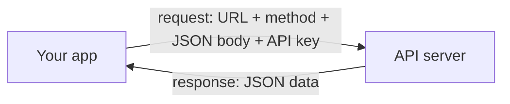
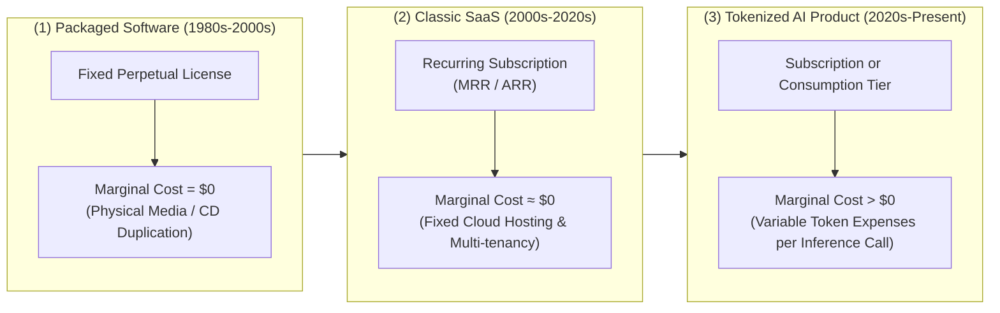
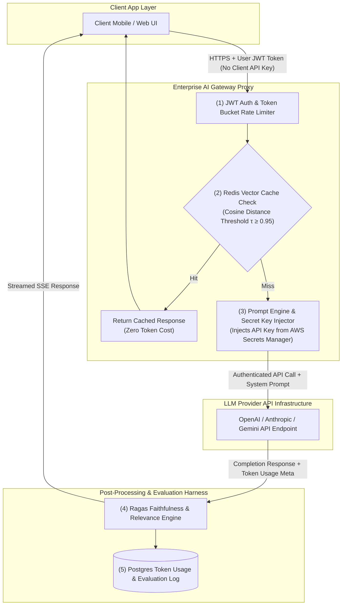
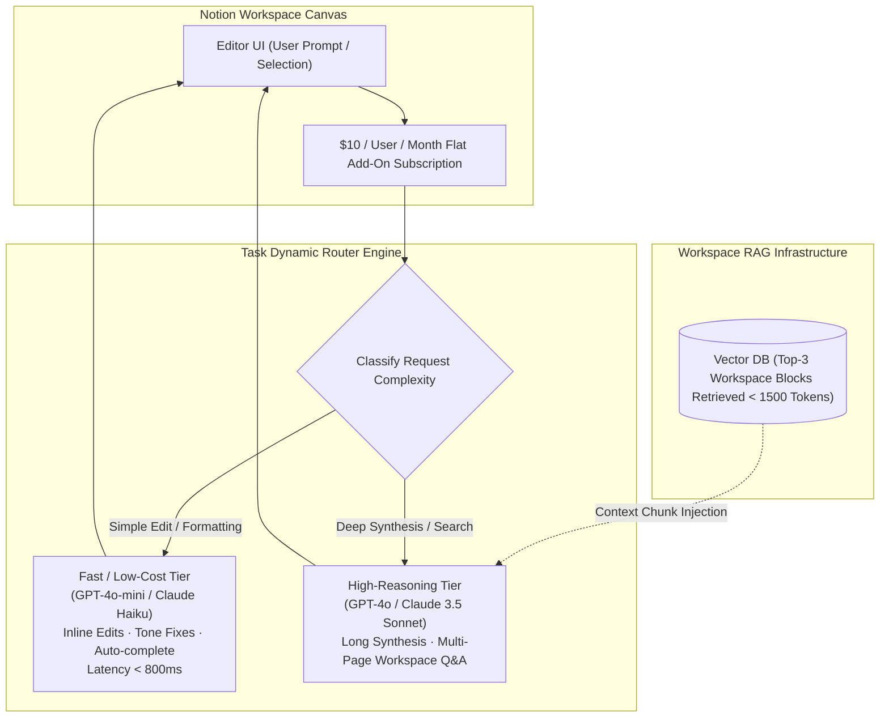

# UNIT 3 — AI Product Strategy & OpenAI Integration 🧭

> **AI Product Design (DI05016021)** · **8 hrs · 18% weightage**
> **Covers syllabus sections:** 3.1 Product lifecycle · 3.2 MVP · 3.3 Feature prioritization · 3.4 AI monetization · 3.5 Business Model Canvas · 3.6 API concept · 3.7 OpenAI API concepts · 3.8 API key security · 3.9 Token cost awareness · 3.10 AI evaluation
> **Related practicals:** [[P06 — Mvp Feature Prioritization|P06]], [[P07 — Business Model Canvas|P07]], [[P08 — Ai Integration Plan|P08]]

---

## 🧭 Chapter Roadmap

```
UNIT 3 — AI Product Strategy & OpenAI Integration
├── 3.1 Product lifecycle management           ★★★★
├── 3.2 Minimum Viable Product (MVP)           ★★★★★  ← P06
├── 3.3 Feature prioritization                 ★★★★★  ← P06 (MoSCoW + matrix)
├── 3.4 AI monetization models                 ★★★★   ← P07
├── 3.5 Business Model Canvas                  ★★★★   ← P07 (9 blocks)
├── 3.6 Introduction to APIs                   ★★★★
├── 3.7 Understanding AI APIs (OpenAI)         ★★★★
├── 3.8 API key & security awareness           ★★★★   ← P08
├── 3.9 Token cost awareness                   ★★★★★  ← P08 (math!)
└── 3.10 Basic AI evaluation methods           ★★★★
```

### Learning outcomes — after this unit you can:
1. Describe the **product lifecycle** and where AI products fit.
2. Define an **MVP** and prioritise features (**MoSCoW**, effort×impact).
3. Compare **AI monetization models** and justify one for a product.
4. Fill a **Business Model Canvas** (all 9 blocks).
5. Explain **APIs** and how **AI APIs** (e.g., OpenAI) work conceptually.
6. Explain **API-key security** and **token costs** with worked examples.
7. Design a simple **evaluation plan** (output quality, user feedback, test checklist).

---

## 3.1 Product Lifecycle Management

A product is born, grows, matures, and (maybe) declines. **Product lifecycle management (PLM)** = steering the product through these stages with the right decisions at each.

| Stage | What happens | AI product example (StudyMate) |
|---|---|---|
| **1. Introduction** | Launch the MVP to early users | Ship summariser + quiz (P06 scope); measure signups |
| **2. Growth** | Scale, add "Should" features, optimise | Add chat (F2), local-language support, campus growth |
| **3. Maturity** | Optimise cost/margin, retain users | Cut token costs (P08), semester plans (P07), reduce churn |
| **4. Decline / pivot** | Refresh, pivot, or retire features | Exam-season churn → new features or new segment |

**AI-specific twist:** because costs (tokens) and quality (model versions) keep changing, AI products revisit lifecycle decisions more often. A "mature" AI product constantly re-evaluates its model choice — the model is a living component, not a shipped artefact.

> [!tip] Exam one-liner
> *PLM is about matching product decisions to the stage — an MVP decision that's right in Introduction is wrong in Maturity (and vice-versa).*

## 3.2 Minimum Viable Product (MVP) ⭐

An **MVP** is the *smallest product version that delivers core value to real users and lets you test your riskiest assumption* — not the cheapest thing you can build.

**The two mistakes students make:**
- ❌ MVP = "half-finished everything" (no core value, nothing learnable).
- ❌ MVP = "full product with everything" (too slow, too expensive).

**StudyMate MVP (from P06):** upload → summary → 10-question quiz → weak-topic tags. One core promise tested: *"A student can prepare for an exam from their own notes in minutes."* Everything else (chat, study planner, export) is the roadmap.

**Why MVP first:** fail fast and cheap (Design Thinking's Prototype→Test), get real feedback instead of guesses, and spend money only on features the data proves.

## 3.3 Feature Prioritization ⭐

You can't build everything; prioritization decides *what ships now*. Two exam tools:

**MoSCoW**
| Label | Meaning | Test |
|---|---|---|
| **Must** | Product fails without it | Not shipping it kills the core value |
| **Should** | Important, ship soon | High value, medium effort |
| **Could** | Nice to have | Ship if time/budget allows |
| **Won't (now)** | Explicitly deferred/cut | Written down so nobody re-adds it by accident |

**Effort × Impact matrix**
```text
        HIGH IMPACT
             ▲
   QUICK WIN │  STRATEGIC BET    ← ship first  ← plan carefully
   ⭐ F1 F3 F5│  🚀 F2 F10
   LOW EFFORT └──────────────────► HIGH EFFORT
   FILL-IN    │  MONEY PIT       ← ship when idle  ← CUT
   F9 F12     │  F11
```

| Quadrant | Action |
|---|---|
| **Quick win** (low effort, high impact) | Build immediately |
| **Strategic bet** (high effort, high impact) | Plan and schedule carefully |
| **Fill-in** (low effort, low impact) | Build when nothing better to do |
| **Money pit** (high effort, low impact) | Cut — it burns budget |

> **Rule:** every feature must trace back to a *persona goal or journey pain point* (P04). An orphan feature is scope creep.

## 3.4 AI Monetization Models ⭐

| Model | How it works | Pros | Cons | StudyMate relevance |
|---|---|---|---|---|
| **SaaS / Subscription** | Flat recurring fee | Predictable revenue, feels unlimited | Churn; seasonality | Primary model (₹199/mo, ₹799/semester) |
| **Freemium** | Free core + paid tier | Huge acquisition, easy trial | Conversion pressure; free-tier token cost | Primary — free caps control cost |
| **Usage-based (per API call / token)** | Pay for consumption | Fair, tracks real cost | Unpredictable bills; billing complexity | Bulk/enterprise only |
| **One-time licence** | Pay once, use forever | Simple | No recurring revenue; API costs keep coming | Not viable for LLM products |

**The AI twist:** the dominant cost is **tokens** (each use costs money). So pricing must be designed *backwards from cost*: free tier must be capped hard, and paid tiers must price above cost-to-serve (P07 §5 unit economics).

> **Exam favourite — "Why is usage-based bad for students?"** Because token bills are unpredictable; students panic-churn. Freemium + subscription smooths the spike.

## 3.5 Business Model Canvas (BMC) ⭐

The **BMC** (Osterwalder) is a one-page, 9-block description of how a business creates, delivers, and captures value. Learn all 9 in order (P07 fills it for StudyMate):

```
┌───────────────┬──────────────┬──────────────┬──────────────┬──────────────┐
│ KEY           │ KEY          │ VALUE        │ CUSTOMER     │ CUSTOMER     │
│ PARTNERSHIPS  │ ACTIVITIES   │ PROPOSITION  │ RELATIONSHIPS│ SEGMENTS     │
│ (who we       │ (what we do  │ (the one     │ (how we      │ (who uses /   │
│ borrow        │ daily)       │ outcome we   │ serve them)  │ who pays)     │
│ capability)   │ + KEY        │ deliver)     │              │              │
│               │ RESOURCES    │              │              │              │
│               │ (what we own)│              │              │              │
├───────────────┴──────────────┴──────────────┴──────────────┴──────────────┤
│ COST STRUCTURE (what it costs — AI: tokens dominate!)                      │
│ REVENUE STREAMS (where money comes from — which model §3.4)                │
└────────────────────────────────────────────────────────────────────────────┘
```

**Exam tips:** (1) Value Proposition is a *measurable outcome sentence*, not a feature list. (2) For AI products, the **Cost Structure** must explicitly list API/token costs. (3) Segments separate *users* from *payers* when they differ.

## 3.6 Introduction to the API Concept ⭐

**API** (Application Programming Interface) = a contract that lets one piece of software talk to another without either knowing the other's internals.



- **The analogy:** a waiter in a restaurant. You (the app) order via the waiter (API) from the kitchen (server); you don't enter the kitchen.
- **Request anatomy:** endpoint (URL), method (GET/POST), headers (auth/API key), body (data/parameters).
- **Response:** usually **JSON** (key-value data).
- **Why APIs matter for AI products:** you don't build AI — you *call* AI. The OpenAI API (and Gemini/Claude equivalents) is a waiter between your product and a world-class model.

## 3.7 Understanding AI APIs (OpenAI API — concepts only)

The syllabus wants **concepts**, not code. Know this pipeline:

```
Your prompt (+ context) ──► request to API ──► model generates ──► response
        │                                                    │
        └──────────── tokens sent (input) ────────── tokens returned (output)
```

**Conceptual API call (what happens, not the code):**
1. You send: your instruction/prompt (the "system prompt" + user content) and **parameters** (model name, temperature, max tokens).
2. The provider runs the model and returns: the generated **completion** + **usage stats** (prompt tokens, completion tokens).
3. **Temperature** = creativity knob (0 = deterministic/repeatable, 1+ = creative/random). Quizzes use low temperature; creative writing uses high.

**Chat completions (the API shape to know):** messages with *roles*:
- **system** — instructions to the model ("You are a study assistant. Answer only from the uploaded notes.").
- **user** — the student's question.
- **assistant** — the model's replies (kept for multi-turn conversation).

> [!warning] Exam trap
> the API has no memory. If you want the chatbot to "remember", *you* must send the conversation history with every call — and longer history = more tokens = more cost.

## 3.8 Basic API Key & Security Awareness ⭐

**API key** = your secret credential proving your account can bill the API. Leaking it = someone else spending *your* money (and possibly abusing your quota).

**The non-negotiables (memorise all 6):**
1. **Keys live server-side only** — never in app code, mobile bundles, or browser code (they can be extracted).
2. **Use environment variables / secret managers** — not hard-coded strings.
3. **Restrict keys** — to the endpoints/features they need (least privilege).
4. **Rotate keys** — regularly and after any suspected leak.
5. **Monitor usage** — alert on unexpected cost spikes (a leaked key spends fast).
6. **Rate-limit users** — per-user caps so a single account (or attacker) can't burn the whole budget.

> [!tip] Beyond the textbook
> your app should *never forward its key to users*. The standard pattern is a **server-side proxy**: the app's backend holds the key, adds rate limits, logging, and content filtering, then calls the AI API on the user's behalf (this is exactly the P08 plan for StudyMate).

## 3.9 Cost Awareness in AI Products — the Token Concept ⭐⭐

**Token** = the unit of text an LLM reads/writes (≈ ¾ of an English word, ~3–4 characters). Models are priced **per token** — *input tokens* (your prompt) and *output tokens* (the answer) are billed separately.

**Worked example (StudyMate — the exact maths you can repeat):**

| Request | Input tokens | Output tokens | Rough cost* |
|---|---|---|---|
| Summarise a 10-page PDF | ~8,000 | ~900 | ≈ ₹0.007 |
| Generate a 10-question quiz | ~2,500 | ~1,200 | ≈ ₹0.005 |
| 5 grounded chat turns | ~4,000 | ~400 | ≈ ₹0.004 |

*\*Example pricing ≈ ₹0.63 per 1M input tokens, ₹2.5 per 1M output tokens (small "mini" model tier). Prices change — the *method* is what's examined.*

**Why costs explode (the 4 leak points):**
1. **Long prompts** — every extra context token is paid on *every* call (conversation history grows).
2. **Retries/regeneration** — each "try again" is a new paid call.
3. **Abuse/bots** — unlimited free usage = attackers burn your key.
4. **Big models** — a "smart" model can cost 10–50× a "mini" model.

**Cost controls every AI product needs:** cap free-tier usage, choose the smallest model that passes evaluation, cache repeated results, and watch the dashboard weekly.

## 3.10 Basic AI Evaluation Methods ⭐

An AI product must be *evaluated continuously* — "it works in my demo" is not a standard. The syllabus's three lenses:

### 3.10.1 Output quality checking
| Check | What you test | StudyMate example |
|---|---|---|
| **Correctness** | Is the content actually right? | Quiz answers match the source notes |
| **Relevance** | Is it on-topic? | Summary covers the chapter's real topics |
| **Consistency** | Same input → same quality? | 10 quizzes from the same PDF are all usable |
| **Groundedness** | Does it stick to the user's data? | Citations match the actual pages |

### 3.10.2 User feedback
- **Explicit:** 👍/👎 ratings, star ratings, "report a problem".
- **Implicit:** quiz completion %, retake rate, time-on-page, drop-off at each screen.
- **Outcome:** do students actually improve (scores rise across attempts)?
- Feedback feeds the **feedback loop** (Unit 1) and, when bad, should *block* the output (e.g., a flagged quiz question goes to human review — HITL).

### 3.10.3 Simple testing checklist (write this for your own product)
```
[ ] 1. Golden test set: 20 fixed inputs with expected outputs (re-run after any model change)
[ ] 2. Random sample: pull N outputs per week and manually grade quality
[ ] 3. Edge cases: empty input · very long input · non-English text · malicious prompt
[ ] 4. Cost check: tokens used per session vs budget per user (P08)
[ ] 5. Latency check: chat < 3 s, summary < 30 s
[ ] 6. Regressions: nothing broke after model/provider update (pinned version compare)
```

---

## 🧠 Deep-Dive Topics

### Deep Dive A: Pricing backwards from token cost
Start from cost-to-serve, not from "what students will pay". Work: heavy user ≈ 200 requests/month ≈ ₹6–7 in tokens + ~₹5 hosting → round to ₹20 cost → charge ₹199 (price anchored on *value*, margin ~90%+). Free tier must stay under ~5 requests/day so a bot can't bankrupt you. This one calculation connects P07 (pricing) and P08 (cost math).

### Deep Dive B: The API proxy pattern (security end-to-end)
User → your backend (holds key, rate-limits, filters, logs) → OpenAI API → backend → user. Why the proxy is mandatory: (1) key stays secret, (2) you can enforce P12 mitigations (moderation, caps) *before* and *after* the model call, (3) you can swap models (GPT → Gemini → Claude) without changing the user-facing app. This is the security spine of Unit 3 that Unit 6's mitigations hang on.

### Deep Dive C: Evaluation = the loop's regulator
Every feedback signal (3.10.2) that enters the loop (1.3) must be *quality-gated*: a malicious or wrong rating should not steer the model. Evaluation is therefore not a one-time QA step but a **permanent watchdog** on the feedback loop — bad output must be caught before it becomes training signal. Ties Unit 3 → Unit 6 (logging/monitoring).

---

## 🚀 Beyond the Textbook (what most classes won't tell you)

1. **The API bill is a business-model decision.** Some products deliberately choose a *worse but cheaper* model so the free tier survives; "best model" is rarely the right column to optimise.
2. **Temperature is a product setting, not a code detail.** Quiz apps run near 0; creative copy runs high; the product team owns this knob, not just the engineer.
3. **Conversation memory costs money.** Every history token is re-sent per turn — that's why real chatbots summarise old messages ("context compaction").
4. **"Per-request" pricing hides the real unit: per-session.** A student's session = summary + 3 chats + 2 quiz attempts ≈ 6 requests ≈ 15,000+ tokens. Evaluate per-*session*, not per-request.
5. **The BMC's cost block often reverses intuitions.** For StudyMate, *engineering* is fixed; *tokens* scale with usage — so the business scales worse than a normal SaaS unless usage is metered. Knowing this one fact is a strong viva answer.
6. **Exam-hack memory aid for BMC's 9 blocks:** "**K**eep **V**aluable **C**ustomers **C**leverly, **R**un **P**rofitable **R**evenue" — roughly: Key Partners/Activities/Resources → Value proposition → Customer Segments/Relationships/Channels → Revenue Streams (Cost is the bottom bar).

---

## 🎯 High-Yield Exam Topics (no PYQ papers exist for this new subject — these are the likely GTU-style questions)

**Likely questions (short notes / 4 marks):**
1. Define **MVP** with an example.
2. Explain **MoSCoW** prioritization.
3. Explain the **Effort × Impact matrix**.
4. Compare **subscription, freemium, and usage-based** monetization.
5. What is an **API**? Explain request and response.
6. What is an **API key**? State three security rules.
7. Explain the **token** concept and why it matters for cost.
8. List the stages of the **product lifecycle**.
9. What is the **Business Model Canvas**? Name its 9 blocks.
10. Explain three ways to **evaluate AI output quality**.

**Likely long questions (7 marks):**
11. Explain **MVP** and show how you would prioritise features for an AI product (MoSCoW + effort×impact with an example).
12. Explain the **9 blocks of the Business Model Canvas** with an AI product as the example.
13. Explain how you would control **cost** and **security** while integrating the OpenAI API into a product.

**Solved model answers (exam style):**

**Q. 7 marks — MVP and feature prioritization for an AI product.**
> An **MVP** is the smallest version of a product that delivers core value to real users and tests the riskiest assumption — it is not a half-built full product. For StudyMate the riskiest assumption is: *"a student can prepare from their own notes in minutes"* — so the MVP ships upload → summary → 10-question quiz → weak-topic tags, and nothing else. **Prioritization tools:** (1) **MoSCoW** splits the backlog into Must (upload, summary, quiz, weak tags — product fails without them), Should (chat, explain-mistakes, local-language support), Could (study planner, exports, streaks), Won't-now (shareable score cards). (2) The **Effort × Impact matrix** plots every feature; quick wins (low effort, high impact) ship first, strategic bets (high/high) are planned, fill-ins (low/low) ship when idle, and money pits (high effort/low impact) are cut. Both tools force the team to defend *why* a feature made the MVP against the product goal.

**Q. 4 marks — Explain the token concept and cost awareness.**
> A **token** is the unit of text an LLM reads or writes — roughly ¾ of an English word (about 3–4 characters). Models bill **per token**, and input (prompt) and output (completion) tokens are charged separately. For example, summarising a 10-page PDF uses ~8,000 input + ~900 output tokens, costing only a few paise on a cheap model — but costs scale with *every* request. **Cost leaks:** long prompts (conversation history re-sent each turn), retries/regeneration (each is a new paid call), abuse/bots, and choosing unnecessarily large models. **Controls:** cap free-tier usage, pick the smallest model that passes evaluation, cache repeated results, and monitor the dashboard weekly. This is why AI product pricing must be designed backwards from token cost.

**Q. 4 marks — What is an API key? Three security rules.**
> An **API key** is a secret credential that identifies your account and bills usage to it when your software calls an API (e.g., the OpenAI API). If it leaks, others can spend your money and abuse your quota. **Security rules:** (1) **Never ship keys in the client** — keep them server-side only, in environment variables or a secret manager, never in app/mobile/browser code. (2) **Restrict and rotate** — scope the key to the endpoints it needs (least privilege) and rotate it regularly or after any suspected leak. (3) **Monitor and rate-limit** — watch for unexpected cost spikes and cap per-user usage so a single account or attacker cannot burn the entire budget. The safe pattern is a server-side proxy: the backend holds the key, adds rate limits and logging, and calls the AI API on the user's behalf.

---

## ✍️ Practice Problems (self-test — answers hidden)

1. Sort these into Must/Should/Could/Won't for a food-delivery app: live order tracking, tipping feature, reorder favourite, robot couriers.
2. A model costs 10× more per token but is 20% more accurate. When is the cheap model still the right choice?
3. You find an API key in a public GitHub repo. List the first 4 actions in order.
4. Compute: free tier allows 3 quiz requests/day, each ≈ 4,000 tokens total. A bot makes 100 requests. What's the token burn and how is it prevented?
5. Name the 3 evaluation lenses (§3.10) and one metric each for StudyMate's quiz feature.
6. Why is "one-time licence" almost always wrong for LLM products?

<details>
<summary>📌 Model solutions</summary>

1. Must: live order tracking (core value). Should: reorder favourite. Could: tipping. Won't (now): robot couriers — write it down so it doesn't creep back.
2. The cheap model — if your users don't notice the difference, you're paying 10× for nothing. Evaluate on your *own* golden test set; buy quality only where your metrics prove it matters.
3. (1) Revoke/rotate the key immediately; (2) audit usage/costs for unusual activity; (3) find where it leaked (git history) and scrub it; (4) add monitoring + secret scanning to prevent recurrence.
4. 400,000 tokens in a day from one account. Prevention: per-user rate limits + daily caps + anomaly alerts + possibly CAPTCHA (this is P12 R7).
5. Output quality: correctness against the source notes (grounding check). User feedback: quiz completion % and 👍/👎 on questions. Testing checklist: run a fixed golden set of 20 questions after every model/prompt change.
6. LLM costs are recurring (every use costs tokens); a one-time fee means costs grow forever while revenue stops. Usage-based/subs are the only sustainable models.
</details>

---

## 📖 Glossary of Key Terms

| Term | Definition |
|---|---|
| **Product lifecycle** | Introduction → Growth → Maturity → Decline/pivot |
| **MVP** | Smallest product version that delivers core value and tests the riskiest assumption |
| **MoSCoW** | Must / Should / Could / Won't (now) prioritization |
| **Effort × Impact matrix** | Quadrant plot: quick win · strategic bet · fill-in · money pit |
| **Monetization model** | How the product makes money: subscription, freemium, usage-based, licence |
| **Business Model Canvas** | 9-block one-page business description (Osterwalder) |
| **Value proposition** | The measurable outcome you deliver to a segment |
| **API** | Interface contract between software systems (request/response) |
| **Endpoint** | The URL an API call targets |
| **JSON** | Key-value data format used in API responses |
| **API key** | Secret credential that identifies your account and bills usage |
| **System prompt** | Instructions to the model (system role) |
| **Temperature** | Creativity knob: 0 = deterministic, higher = more random |
| **Token** | Unit of text billed by LLM APIs (~¾ word) |
| **Cost-to-serve** | What serving one user actually costs (tokens + hosting) |
| **Golden test set** | Fixed inputs with expected outputs; re-run after any change |
| **Groundedness** | Whether AI output sticks to the user's provided data |

---

## 🔗 Curated Resources (per concept)

**Product strategy & lifecycle**
- Y Combinator "Startup School" — how to think about products/MVPs: https://www.startupschool.org
- Lean Product & Lean Analytics — Ben Yoskovitz & Alistair Croll (your syllabus book)
- The Mom Test (how to talk to users): https://www.momtestbook.com

**MVP & prioritization**
- MoSCoW (Agile Business Consortium): https://www.agilebusiness.org/business-analysis/techniques/moscow-prioritisation/
- RICE scoring (Intercom): https://www.intercom.com/blog/rice-simple-prioritization-for-product-managers/

**Business Model Canvas**
- Strategyzer (official BMC): https://www.strategyzer.com/library/the-business-model-canvas
- *Business Model Generation* — Osterwalder & Pigneur

**APIs & OpenAI**
- OpenAI platform docs (concepts): https://platform.openai.com/docs
- OpenAI pricing (tokens): https://openai.com/api/pricing/
- OpenAI Playground (experiment with prompts/temperature): https://platform.openai.com/playground

**Evaluation & security**
- "How to evaluate LLMs" (guidance): search *llm evaluation metrics golden set eval*
- OWASP API Security Top 10: https://owasp.org/www-project-api-security/

## 🎥 Video Study Guide (YouTube)

> Don't like reading? Me neither. This is your **structured video path** for the whole unit — better than the syllabus because it tells you *exactly what to search* and *what to watch first*, in a sensible order. Everything below is search keywords (they never rot like links do) + channels you can trust.

### 🧑‍🎓 Step 0 — Pick your learning style

| Style | You learn best by | Your path through this unit |
|---|---|---|
| 🎧 **Listener** | short, clear explainers | Watch 1 explainer per topic from the table below (3–8 min each) |
| 🛠️ **Builder** | building things | Do [[AIPD — Overview|P06–P08]] templates as you watch; try the OpenAI Playground |
| 🔧 **Tinkerer** | experimenting | Play with temperature/token settings in the Playground and watch costs change |
| 🧠 **Deep Diver** | full theory, "why" | Watch the product-strategy playlists at the bottom + pricing deep dives |
| 🧭 **Explorer** | breadth & curiosity | Watch Y Combinator talks on MVPs and pricing first |
| 🎓 **Academic** | exam marks | Grind the High-Yield list → write the 9 BMC blocks and token maths from memory |

### 🎬 Step 1 — Watch by topic (search these on YouTube)

| Topic | YouTube search keywords (copy-paste ready) | Best channels | Style served |
|---|---|---|---|
| Product lifecycle & strategy | `product lifecycle stages explained` · `product strategy for startups` · `lean product lifecycle` | Y Combinator, 50minds, Lenny's Podcast | 🎧 Listener |
| MVP | `what is a minimum viable product` · `mvp vs prototype difference` · `build your mvp fast` | Y Combinator, 50minds, freeCodeCamp | 🧭 Explorer |
| Feature prioritization | `moscow prioritization technique` · `rice scoring method explained` · `product prioritization frameworks` | Product School, Canny, Product Plan | 🎓 Academic |
| Monetization / pricing AI | `how to price ai products` · `saas pricing models explained` · `freemium vs subscription` | a16z, Lenny's Podcast, Paddle | 🧠 Deep Diver |
| Business Model Canvas | `business model canvas explained` · `business model canvas tutorial 9 blocks` | Strategyzer, Alexander Osterwalder, The Futur | 🎧 Listener |
| APIs 101 | `what is an api explained` · `rest api for beginners` · `api request response json` | freeCodeCamp, ByteByteGo, Programming with Mosh | 🧭 + 🛠️ |
| OpenAI API concepts | `openai api tutorial for beginners` · `chat completions api explained` · `system prompt temperature tokens` | OpenAI (official), freeCodeCamp, Fireship | 🛠️ Builder |
| API security | `api key security best practices` · `how to keep api keys secret` · `leaked api keys github` | ByteByteGo, OWASP, David Bombal | 🎧 Listener |
| Token costs | `llm token costs explained` · `gpt tokens pricing how it works` · `reduce llm api costs` | a16z, Finematics, Maven Analytics | 🧠 Deep Diver |
| Evaluation | `how to evaluate llm output quality` · `eval set llm testing` · `prompt evaluation checklist` | OpenAI, Hugging Face, Weights & Biases | 🧠 + 🎓 |
| Whole-unit revision | `ai product manager full course` · `product management fundamentals full course` | Product School, 50minds, freeCodeCamp | 🎓 Academic |

### 🎬 Step 2 — Full playlists (for Deep Divers & Academics)

1. **"Y Combinator — Startup School / How to start a startup"** — MVPs, pricing, and product strategy from the people who fund the world's biggest AI products.
2. **"Product School — Product Management free sessions"** — feature prioritization, monetization, and business models taught by working PMs.
3. **"freeCodeCamp — APIs and OpenAI"** — if you're the Builder type, the hands-on API tutorials here turn concepts into muscle memory.

### 🎬 Step 3 — Proof you got it (5 min)

- Write the 9 BMC blocks on paper from memory, then label StudyMate's entry in each.
- Compute the cost of a 4,000-token quiz request on a "mini" model from memory (method, not price).
- Explain to a friend why "one-time licence" is wrong for LLM products and why the API key must live server-side.

---

*Next: [[Unit 4 — AI in Social Media and Digital Experience|UNIT 4 — AI in Social Media & Digital Experience]]*

---


---

## 📖 Historical Context & Motivation

The economics of software products have evolved through three distinct technological eras:

1. **The Packaged Software Era (1980s–2000s):** Software was delivered as compiled binaries on physical media (CD-ROMs) or perpetual licenses. Capital expenditure was heavily front-loaded into R&D, while the marginal cost of software duplication and distribution was zero ($C_{marginal} = 0$). Products matured slowly through multi-year release cycles.
2. **The Software-as-a-Service (SaaS) Era (2000s–2020s):** Cloud infrastructure (AWS, Azure) enabled continuous delivery and multi-tenant architectures. Monetization shifted to predictable recurring subscription fees (MRR/ARR). Operating costs were dominated by fixed engineering salaries and sub-linear compute hosting costs. Marginal cost per user request remained near-zero.
3. **The Tokenized AI Product Era (2020s–Present):** The rise of API-driven Foundation Models (OpenAI, Anthropic, Google Cloud AI) fundamentally altered software unit economics. In an AI-native product, **every single user interaction incurs a non-zero marginal cost** ($C_{marginal} > 0$) paid to infrastructure or model providers in the form of **billed tokens**.



This structural shift renders traditional SaaS product strategy obsolete. Product managers cannot simply maximize user engagement without bound, as uncapped engagement scales operating expenditure proportionally. Building a viable AI product requires aligning **feature prioritization (MoSCoW)**, **API architecture (Server-Side Proxy)**, and **business model design (BMC)** directly with token economics, API key security, and continuous evaluation frameworks.

---

## 🔬 Deep Dive: System Architecture

### Enterprise AI Gateway, Token Economic Math & Evaluation Architecture

To deploy LLMs safely and cost-effectively in production, systems utilize a **Server-Side AI API Proxy Gateway** coupled with an automated evaluation harness.



#### 1. Mathematical Formulation of Context Window Token Inflation
In a multi-turn conversational product, the client re-transmits the conversation history on every API call to maintain session state. Let $L_{sys}$ be the system prompt length in tokens, $L_{user}$ be the average user message length, $L_{assistant}$ be the average assistant response length, and $k$ be the turn index.

The total prompt input tokens $T_{input}(k)$ for turn $k$ is given by:
$$T_{input}(k) = L_{sys} + \sum_{i=1}^{k-1} \left( L_{user, i} + L_{assistant, i} \right) + L_{user, k}$$

Assuming constant average turn lengths $L_{turn} = L_{user} + L_{assistant}$:
$$T_{input}(k) = L_{sys} + (k-1) \cdot L_{turn} + L_{user}$$

The **cumulative token expenditure** $C_{total}(K)$ across a conversation of $K$ turns scales quadratically:
$$C_{total}(K) = \sum_{k=1}^K \left[ p_{in} \cdot T_{input}(k) + p_{out} \cdot L_{assistant} \right]$$
$$C_{total}(K) = K \cdot \left( p_{in} L_{sys} + p_{out} L_{assistant} + p_{in} L_{user} \right) + p_{in} L_{turn} \frac{K(K-1)}{2} = \mathcal{O}(K^2)$$

- **Engineering Mitigation:** Production architectures employ **Context Window Compaction**. When turn history reaches $K_{threshold}$, an auxiliary fast LLM summarizes turns $1 \dots K-2$ into a static summary vector of length $L_{summary} \ll (K-2)L_{turn}$, resetting the cost curve from quadratic $\mathcal{O}(K^2)$ back to linear $\mathcal{O}(K)$.

#### 2. Automated AI RAG Evaluation Metrics (Ragas Framework)
To evaluate product quality continuously without human labelers, automated evaluation architectures compute statistical alignment metrics over retrieved context $C$, generated answer $A$, and ground truth $G$:

- **Faithfulness Score ($S_{faith}$):** Quantifies whether the generated answer $A$ is strictly derived from retrieved context $C$. Let $A = \{s_1, s_2, \dots, s_m\}$ be the set of decomposed atomic statements in the output.
  $$S_{faith} = \frac{|\{s_i \in A \mid s_i \text{ is inferable from } C\}|}{|A|}$$

- **Answer Relevance Score ($S_{rel}$):** Measures whether the response addresses the prompt $Q$. The evaluation model generates $n$ artificial questions $q_i$ from answer $A$, computing average embedding similarity to $Q$:
  $$S_{rel} = \frac{1}{n} \sum_{i=1}^n \frac{\mathbf{v}_{q_i} \cdot \mathbf{v}_Q}{\|\mathbf{v}_{q_i}\|_2 \|\mathbf{v}_Q\|_2}$$

---

## 🏢 Real-World Case Study: How Notion Built Notion AI & Managed Token Unit Economics

### Background & Product Strategy
In early 2023, Notion launched **Notion AI**, integrating generative text capabilities directly into its workplace document canvas. The core product challenge was strategic and financial: how to incorporate high-cost LLM capabilities into a productivity tool without destroying the company's existing high gross margins (80%+ SaaS benchmark), while maintaining fast UI response times (< 2 seconds).



### Strategic & Technical Implementation
Notion executed a masterclass in AI product strategy across three core pillars:

1. **Monetization Model Choice (Add-On Flat Subscription):** Notion rejected usage-based token billing (which induces user "bill anxiety" and friction) in favor of a **$10/user/month flat add-on subscription**. To protect against power-user cost abuse, they established a server-side "fair use" rate-limiting policy managed dynamically by their proxy infrastructure.
2. **Model Tiering & Dynamic Task Routing:** Rather than routing all user actions to top-tier, expensive models, Notion built an internal request router:
   - **Low-Latency / Low-Cost Tasks:** Inline grammar fixes, tone adjustments, and basic completions were routed to lightweight, fast models (e.g., GPT-4o-mini class), operating at ~1/15th the token cost.
   - **High-Reasoning Tasks:** Long-form synthesis, multi-page database search, and complex code generation were routed to flagship models (GPT-4o or Claude 3.5 Sonnet).
3. **Context Truncation & Workspace RAG:** To prevent document contexts from blowing out API costs, Notion engineered a custom RAG engine. Instead of feeding entire multi-megabyte workspaces into prompt context, the system embeds workspace blocks into a vector database, retrieving only the top-3 relevant paragraphs ($<1,500$ tokens) prior to generation.

---

## 📝 End-of-Chapter Exercises

### Exercise 1: Business Model Canvas & Unit Economics Modeling for an AI SaaS Startup
You are founding an AI legal contract analysis startup ("LexiAI").
- **(a)** Fill out all **9 blocks of the Business Model Canvas (BMC)**, explicitly highlighting Key Partnerships (LLM API vendors), Key Resources (proprietary legal dataset), and Cost Structure (token API expenses vs cloud hosting).
- **(b)** The startup charges users a subscription fee of $R = \$49/\text{month}$. On average, an active user submits 120 contract review requests per month. Each request consumes $8,000$ prompt input tokens and generates $1,000$ output tokens. The API provider charges $p_{in} = \$2.50 / 1,000,000$ tokens and $p_{out} = \$10.00 / 1,000,000$ tokens. Fixed infrastructure and hosting cost per user is $C_{fixed} = \$3.00/\text{month}$. Calculate:
  1. Monthly API token cost per active user ($C_{tokens}$).
  2. Gross Profit Margin percentage ($M_{gross} = \frac{R - (C_{tokens} + C_{fixed})}{R} \times 100\%$).
  3. Maximum allowable monthly request volume per user before the customer becomes unprofitable ($M_{gross} < 0$).

### Exercise 2: Mathematical Analysis of Context Window Inflation & Summarization Triggers
A customer support agent maintains session state across multi-turn chats. The system prompt is $L_{sys} = 500$ tokens. Each user turn is $L_{user} = 150$ tokens, and each assistant response is $L_{assistant} = 250$ tokens.
- **(a)** Compute the exact total input tokens sent to the API during turn $k = 1, 5, 10, \text{ and } 20$ under an uncompacted full-history architecture.
- **(b)** If an automatic summarization trigger collapses turns $1 \dots 8$ into a single $L_{summary} = 200$ token context block at the end of turn 8, compute the input token savings achieved on turn 10.

### Exercise 3: Designing a Production-Grade Secure API Proxy & Evaluation Pipeline
Design a software specification for a backend Node.js / Python API Proxy service that sits between a mobile application and the OpenAI API.
- **(a)** Write a step-by-step control flow pseudocode for handling an incoming client request. The flow must include: JWT authentication, IP rate limiting using a token bucket algorithm, secret API key injection from environment variables, streaming token response handling, and post-execution token usage logging to SQL.
- **(b)** Explain how you would implement a daily automated regression testing script using a "Golden Test Set" of 50 fixed prompt-response pairs to catch model degradation or prompt drift following API model version updates.

