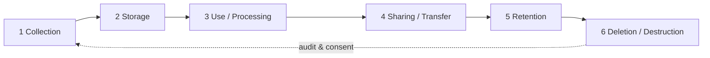
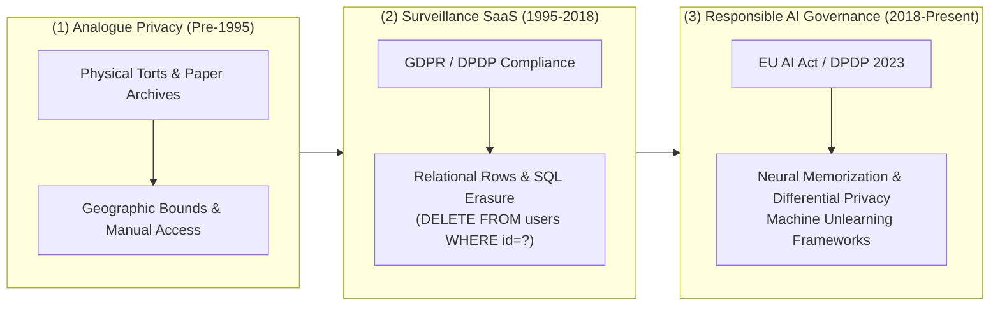
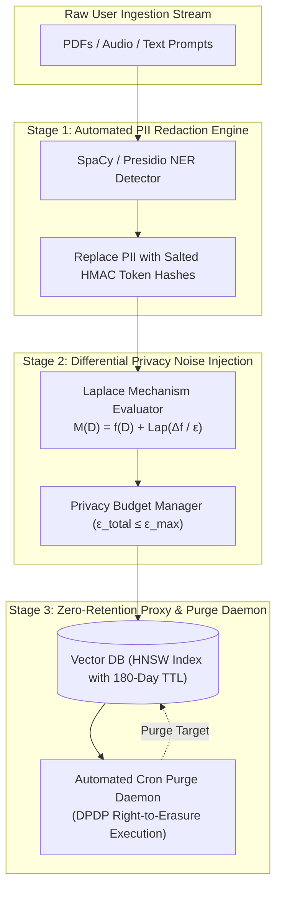
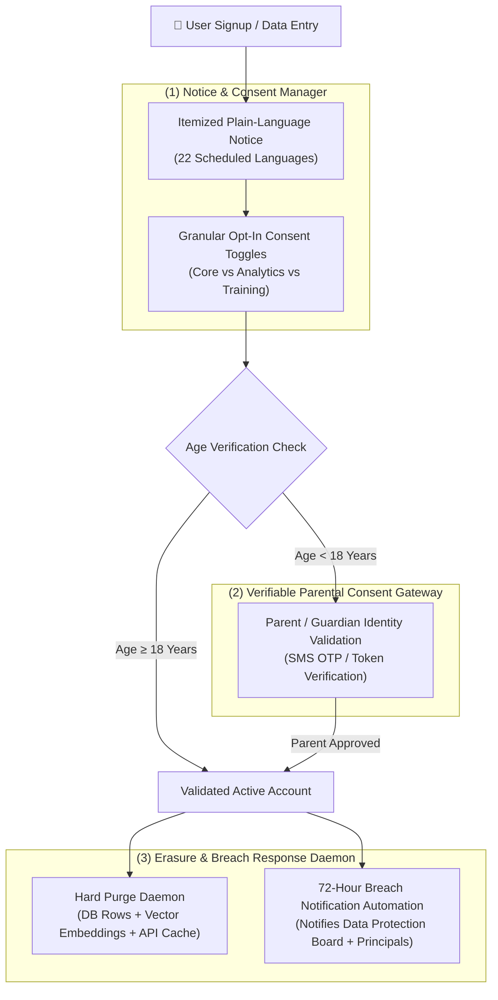
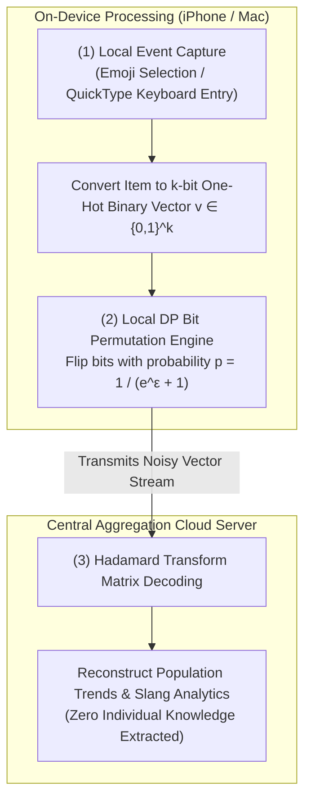

# UNIT 5 — Privacy, Data Governance & Responsible AI 🛡️

> **AI Product Design (DI05016021)** · **6 hrs · 13% weightage**
> **Covers syllabus sections:** 5.1 Data privacy · 5.2 Personal vs sensitive data · 5.3 Data lifecycle · 5.4 Data minimisation · 5.5 Anonymisation · 5.6 Transparency & consent · 5.7 Responsible AI principles · 5.8 Indian data protection law (DPDP) · 5.9 AI governance (organisational)
> **Related practicals:** [[P03 — Data Components|P03]], [[P11 — Data Protection Ethics Policy|P11]]

---

## 🧭 Chapter Roadmap

```
UNIT 5 — Privacy, Data Governance & Responsible AI
├── 5.1 Data privacy concepts                  ★★★★★
├── 5.2 Personal vs sensitive data             ★★★★★  ← classify first!
├── 5.3 Data lifecycle in AI systems           ★★★★
├── 5.4 Data minimisation principle            ★★★★
├── 5.5 Data anonymisation (basic)             ★★★★
├── 5.6 Transparency & user consent            ★★★★★  ← P11
├── 5.7 Responsible AI principles              ★★★★
├── 5.8 Indian data protection law (DPDP)      ★★★★
└── 5.9 AI governance (organisational)         ★★★
```

### Learning outcomes — after this unit you can:
1. Define **data privacy** and explain why AI intensifies the stakes.
2. Classify **personal vs sensitive** data and apply the classification to a product.
3. Describe the **data lifecycle** (collection → storage → use → sharing → deletion).
4. Explain **data minimisation** and **anonymisation** with examples.
5. Explain **transparency** and **consent** and draft plain-language consent copy.
6. List the **responsible AI principles**.
7. Give a basic overview of the **Indian DPDP Act 2023** (data fiduciary, consent, children's data, breach notice).
8. Describe **AI governance** at the organisational level.

---

## 5.1 Data Privacy Concepts

**Data privacy** = the right of individuals to control *who* collects their data, *what* is collected, *how* it is used, and *when* it is deleted.

**Why AI makes privacy harder (the exam paragraph):**
1. **Volume** — AI needs huge datasets (every chat, every upload, every click).
2. **Inference** — AI can *derive* sensitive facts from non-sensitive ones (your study app predicts your exam performance; your browsing reveals your health).
3. **Reuse** — data collected for one purpose gets re-purposed (your notes become training data).
4. **Third parties** — AI products depend on API providers (P08), multiplying who touches the data.

> [!tip] Exam one-liner
> *Privacy is not about hiding data — it's about control: the user decides what, why, and for how long.* A product that treats privacy as a legal checkbox, not a design principle, fails this unit.

## 5.2 Personal vs Sensitive Data ⭐

| Type | Definition | Examples | Protection level |
|---|---|---|---|
| **Personal data** | Any data identifying a natural person | Name, email, roll number, phone, IP address | Normal — still consent-based |
| **Sensitive personal data** | Personal data whose misuse causes serious harm | Health data, financial data, biometrics, caste/religion/political views, **children's data** | High — special rules, stricter consent |

**The DPDP Act 2023 framing (India):**
- **Data principal** — the person whose data it is (the student).
- **Data fiduciary** — the entity deciding how/why data is processed (StudyMate's company).
- **Personal data** vs **sensitive personal data** — DPDP gives *children's data* an important status: processing requires **verifiable parental consent** (relevant for an EdTech product serving 17–18-year-olds!).
- **Special duties** on data fiduciaries for sensitive data: stricter consent and security obligations.

**Why this matters for StudyMate (P03):** a student's uploaded PDF is *usually* non-personal — but it can *contain* personal or sensitive details (IDs, medical certificates). So StudyMate must **classify at upload time** and treat the upload stream as "potentially sensitive."

## 5.3 Data Lifecycle in AI Systems

Every dataset travels a lifecycle; governance means having a *policy at every stage* (this is the skeleton of P11).



| Stage | Governance question | StudyMate answer |
|---|---|---|
| **1. Collection** | Do we need it? (minimisation) | Only the PDF + profile, nothing else |
| **2. Storage** | Encrypted? Access-controlled? | Encrypted at rest, per-user namespacing |
| **3. Use** | Only for stated purpose? | Summaries/quizzes only — no selling |
| **4. Sharing** | Who sees it? (API vendors!) | DPA with API provider; no training on user data |
| **5. Retention** | How long? | 6 months after last login (P11) |
| **6. Deletion** | Fully gone? (incl. indexes/derived data) | Purge doc + index + cached summaries |

> **Exam favourite:** "Data lifecycle" appears in two of your practicals (P03 inventory, P11 DPP) — learn the 6 stages cold.

## 5.4 Data Minimisation Principle

**Data minimisation** = collect and process *only the data necessary* for a stated purpose, for the shortest time needed.

**The 4 rules:**
1. **Purpose-before-data** — decide the purpose first; data collection follows it.
2. **Collect less** — StudyMate doesn't need location, contacts, or device ID to summarise notes.
3. **Keep shorter** — delete what you don't need, when you don't need it (retention schedule).
4. **Share less** — send only the necessary chunks to the API (RAG already does this: it sends relevant pages, not the whole library).

> **Why examiners love it:** it's the *cheapest* and *strongest* privacy control — no data means no breach. "We collect less because we don't need more" is a full-marks sentence.

## 5.5 Data Anonymisation (basic concept)

**Anonymisation** = removing/altering identifiers so an individual can *no longer be identified*, even with other data combined.

| Technique (basic) | What it does | Example |
|---|---|---|
| **Removal / masking** | Delete or hide identifiers | Replace names with codes |
| **Aggregation** | Report only group statistics | "72% of students scored >60%" (no individuals) |
| **Generalisation** | Coarsen values | Age 19 → "18–21 bracket" |
| **Perturbation / noise** | Add small random errors | Off-by-±1 on counts |
| **Pseudonymisation** | Replace identifiers with random tokens (reversible) | User 8472 instead of "Riya Patel" |

> [!warning] Exam trap — the key difference
> - **Anonymisation** = irreversible — no re-identification possible → data is no longer "personal data".
> - **Pseudonymisation** = reversible with a key → STILL personal data (just harder to match).
> Also: **anonymity can be defeated** — "re-identification attacks" combine several anonymised datasets. So anonymisation is *risk reduction*, not a guarantee.

## 5.6 Transparency and User Consent ⭐

**Transparency** = telling users clearly *what* happens to their data, in plain language, at the moment it matters.
**Consent** = their *active, informed, specific* agreement to that processing.

**Consent rules (memorise):**
1. **Informed** — plain language a 17-year-old understands (no legalese).
2. **Specific** — separate consent per purpose (analytics ≠ marketing ≠ improvement).
3. **Freely given** — no bundled "accept everything" checkbox; no dark patterns.
4. **Revocable** — as easy to withdraw as to give (a live toggle in Settings).
5. **Recorded** — you must be able to *prove* consent was given.

**StudyMate example (P11):** a one-line notice before upload — *"We read your PDF only to answer you. We never sell it. We don't train models on it."* — plus separate toggles for analytics and marketing, all revocable in Settings (see P05 wireframe).

> **Exam one-liner:** *Notice tells you what will happen; consent is your active agreement. An AI product needs both — and the consent must be revocable at every stage of the data lifecycle.*

## 5.7 Responsible AI Principles

**Responsible AI** = building and operating AI in ways that are *fair, transparent, accountable, and safe*. The syllabus's principles (memorise with one action each — P11 turns these into a policy):

| Principle | Meaning | Testable action (StudyMate) |
|---|---|---|
| **Fairness** | No unfair bias; equal-quality service | Quiz content from the student's *own* material; equal quality in Hindi/Gujarati |
| **Transparency** | Users know AI is involved and why | "AI-generated" labels + citations on answers |
| **Explainability** | Decisions can be understood | "This quiz targets your 3 weakest topics" |
| **Accountability** | A human owns the outcomes | Named owner per AI surface; human review lane |
| **Privacy & security** | Data protected by design | Encryption, minimisation, deletion (this unit) |
| **Safety / robustness** | Works reliably, handles bad input | Output moderation, honest fallbacks (Unit 6) |
| **Human oversight** | Humans can intervene/override | Human-in-the-loop review (Unit 1) |

> [!tip] The unifying sentence
> *Responsible AI is not one feature — it's the practice of treating every AI decision as if a human must answer for it.*

## 5.8 Overview of Indian Data Protection Law (basic idea) ⭐

**Digital Personal Data Protection (DPDP) Act 2023** — India's main personal-data law. You need the *basic idea*, in these terms:

| Concept | Meaning |
|---|---|
| **Applies to** | Processing of digital personal data in India (or of Indians) |
| **Data principal** | The individual whose data it is |
| **Data fiduciary** | The entity that decides purpose/means of processing (our startup) |
| **Consent** | The lawful basis for most processing — informed, specific, freely given, revocable |
| **Notice** | Fiduciary must inform the principal before collecting |
| **Children's data** | Processing requires **verifiable parental consent** |
| **Rights of the principal** | Access, correction, erasure, grievance redressal |
| **Breach notification** | Fiduciary must notify the Board **and affected principals** on a data breach |
| **Data Protection Board** | The regulator that investigates and fines violations |

**The exam-safe summary:** *DPDP gives individuals rights over their personal data and puts duties on fiduciaries — notice, consent, security, breach notification, and special protection for children's data. For an AI product, that means designing consent flows and a breach runbook from day one, not as an afterthought.*

> [!warning] Exam trap
> don't quote *sections* or *numbers* you don't know. Say "basic idea" level facts (consent, children's data, breach notice, Data Protection Board) — accuracy beats fake precision.

## 5.9 Basic AI Governance (organisational level)

**AI governance** = the *structures and processes* an organisation puts in place to steer AI responsibly — who decides, who audits, who's accountable.

| Governance element | What it is | Example at a StudyMate startup |
|---|---|---|
| **Policy** | Written rules for AI use | AI Ethical Usage Policy (P11) |
| **Roles & accountability** | Named owners per AI system | One owner per feature (summariser, chat, quiz) |
| **Risk management** | Ongoing assessment & mitigation | Risk matrix (P12), reviewed quarterly |
| **Data governance** | Who can access/change data | Access control, audit logs (P08) |
| **Review boards** | A body that approves risky AI | A 3-person ethics/review lane for flagged content |
| **Audit & monitoring** | Evidence that controls work | Logs, evaluations (P08/P12), annual review |
| **Incident response** | What happens when AI fails | Breach + AI-failure runbooks (P11/P12) |

> **Exam one-liner:** *Governance is accountability made structural — if nobody owns an AI system, nobody can answer for it.*

---

## 🧠 Deep-Dive Topics

### Deep Dive A: Re-identification — why "anonymised" isn't safe by itself
Take three "anonymised" datasets: quiz scores (by pseudonym), device analytics (by install ID), and a public college merit list. A join on timestamps + behaviour can **re-identify** a student. That's why anonymisation is graded as *risk reduction* and why strong products use *aggregation + access control + minimisation together*. This is the exact reasoning P03's risk table uses.

### Deep Dive B: Consent in the age of AI inference
The hard problem: you consent to "upload my notes to summarise them", but the *AI inference* (predicting your exam readiness, grouping you with similar students) is a new purpose. Governance answer: **purpose limitation** — the product must define purposes *before* collection and re-ask before any *new* purpose (new consent). StudyMate's "improve with my history" toggle exists precisely for this.

### Deep Dive C: Children's data and EdTech (the DPDP detail that matters here)
Diploma students are often 17–18. DPDP treats data of minors specially: **verifiable parental consent** for processing. An EdTech product must therefore: age-gate at signup, obtain/verify parent consent for under-18s, and avoid targeted advertising at children. This is the single most likely "application" question linking DPDP to our running product.

---

## 🚀 Beyond the Textbook (what most classes won't tell you)

1. **Privacy-by-design isn't optional regulation — it's cheaper engineering.** Fixing a breach after launch costs ~100× more than building minimisation in first. Examiners award this "business case" argument marks.
2. **"Consent walls" are dying.** Forcing "accept or leave" is a dark pattern; regulators treat it as coercion. Design consent *as a product feature* (easy, per-purpose, honest) and you also get better signup conversion.
3. **The API layer is a governance blind spot.** Your fancy policy can be defeated by a vendor clause that says "we train on your prompts." The vendor contract (P08) *is* part of your governance.
4. **Anonymisation techniques have known failure modes.** Masking + aggregation is strong; simple "delete the name" is weak (re-identification). Say the *technique*, not just the word "anonymised".
5. **Regulation is converging globally.** GDPR (EU), DPDP (India), and the EU AI Act all push the same direction: consent, explainability, human oversight. One sentence on convergence = a sophisticated answer.
6. **Exam-hack memory aid for the 6 data-lifecycle stages:** "**C**ollect, **S**tore, **U**se, **S**hare, **R**etain, **D**elete" → **CSUSRD** → "**C**areful **S**tudents **U**nderstand **S**trong **R**etention **D**uties."

---

## 🎯 High-Yield Exam Topics (no PYQ papers exist for this new subject — these are the likely GTU-style questions)

**Likely questions (short notes / 4 marks):**
1. What is **data privacy**? Why is it harder for AI products?
2. Differentiate **personal vs sensitive personal data** with examples.
3. Explain the **data lifecycle** in an AI system.
4. What is **data minimisation**? Give two examples.
5. What is **data anonymisation**? Differentiate anonymisation vs pseudonymisation.
6. Explain **transparency and consent** with an example of consent copy.
7. List the **responsible AI principles** (any 5).
8. Basic idea of the **Indian DPDP Act 2023** — key terms and duties.
9. What is **AI governance** at the organisational level?
10. Why is **children's data** protected specially?

**Likely long questions (7 marks):**
11. Explain **data privacy for an AI product** — privacy concepts, personal vs sensitive data, minimisation and anonymisation, with StudyMate examples.
12. Explain the **DPDP Act 2023** in basic terms and apply it to an AI study app (consent, children's data, breach notification).
13. "Responsible AI + governance" — explain the principles and the organisational structures that enforce them.

**Solved model answers (exam style):**

**Q. 7 marks — Explain data privacy in AI systems with the DPDP framing.**
> **Data privacy** is the right of individuals to control the collection, use, sharing and deletion of their data. **Why AI intensifies privacy risk:** (1) volume — AI needs huge datasets; (2) inference — AI derives sensitive facts from non-sensitive data; (3) reuse — collected data gets re-purposed (e.g., notes becoming training data); (4) third parties — AI products depend on API providers. Under the **DPDP Act 2023**, the **data principal** (the student) has rights over **personal data** (name, email) and **sensitive personal data** (health, financial, biometrics, children's data); the **data fiduciary** (our product) must give **notice**, obtain **consent** (specific, informed, revocable), secure the data, notify **breaches** within the legal timeline, and obtain **verifiable parental consent** for children's data. For StudyMate, this means a plain-language notice before upload, separate per-purpose consent toggles, encryption, a 6-month retention schedule, and a 72-hour breach-notification runbook.

**Q. 4 marks — Differentiate personal vs sensitive data with examples, and minimisation.**
> **Personal data** is any data that identifies a person — name, email, phone, roll number, IP address — and requires consent-based, secure processing. **Sensitive personal data** is personal data whose misuse causes serious harm — health records, financial data, biometrics, caste/religion/political views, and **children's data** — and is subject to stricter rules (stronger consent, higher security; parental consent for minors). Example: StudyMate's chat history is *personal*; a student's uploaded medical certificate would be *sensitive*. **Data minimisation** is the principle of collecting only what is necessary for a stated purpose: StudyMate collects only the PDF and a profile (not location or contacts), retains it 6 months, and sends only relevant chunks to the API — less data means less risk and lower breach impact.

**Q. 4 marks — Explain transparency and consent with an example.**
> **Transparency** means telling users, in plain language, what will happen to their data before processing; **consent** is their active, specific, informed and freely-given agreement, which must be **revocable** at any time. Rules: consent must be separate per purpose (analytics, marketing, improvement are different purposes), never buried in a bundled checkbox, and as easy to withdraw as to give. Example: before uploading notes, StudyMate shows — *"We read your PDF only to answer you. We never sell it. We don't train models on it."* — and Settings holds separate live toggles for analytics and marketing. This is transparency and consent *designed in*, not a link in a privacy policy footer.

---

## ✍️ Practice Problems (self-test — answers hidden)

1. Classify these as personal / sensitive / neither: (a) Aadhaar number, (b) exam roll number, (c) "student scored 8/10" with no name, (d) biometric fingerprint, (e) phone number.
2. A user asks to delete their account. List the derived artifacts you must also delete for deletion to be honest.
3. Why is pseudonymisation NOT anonymisation?
4. Draft 2 sentences of consent copy for "we use your quiz history to improve question quality" — readable by a 17-year-old.
5. StudyMate stores "student X studies between 10 pm and 1 am." How could this be *inferred* to be sensitive even though it's just "usage data"?
6. Name 3 governance structures an organisation needs beyond writing a policy document.

<details>
<summary>📌 Model solutions</summary>

1. (a) Sensitive (official identifier — financial/identity harm); (b) personal (identifies); (c) neither (aggregated/non-personal); (d) sensitive (biometric); (e) personal.
2. The account, uploaded PDFs, the document index/vector embeddings, cached summaries, chat history, quiz history, analytics rows tied to them, and backup copies — otherwise "deleted" data lives on in derived systems.
3. Pseudonymisation replaces identifiers with random tokens but keeps a mapping key, so re-identification is possible — legally it remains personal data. Anonymisation is irreversible — no key, no re-identification (subject to re-identification-attack risk).
4. Example: "We look at your quiz answers to make future questions better for you. You can switch this off anytime in Settings — it won't change your plan."
5. Regular late-night usage, combined with course and repeated-failure patterns, could *infer* sleep deprivation / stress — AI turns "usage data" into health-adjacent inferences, which is exactly why purpose limitation and inference review matter.
6. Named owners per AI system; a review board approving risky AI; access-control + audit logging; incident-response runbooks; a monitoring/evaluation cadence (audit evidence).
</details>

---

## 📖 Glossary of Key Terms

| Term | Definition |
|---|---|
| **Data privacy** | User control over collection, use, sharing, deletion of data |
| **Personal data** | Data identifying a person (name, email, phone) |
| **Sensitive personal data** | Data whose misuse causes serious harm (health, finance, biometrics, children's data) |
| **Data principal** | The person whose data is processed |
| **Data fiduciary** | The entity that decides purpose/means of processing |
| **Data lifecycle** | Collect → Store → Use → Share → Retain → Delete |
| **Data minimisation** | Collect/keep/process only what a stated purpose needs |
| **Anonymisation** | Irreversible de-identification |
| **Pseudonymisation** | Reversible token replacement (still personal data) |
| **Re-identification** | Combining datasets to re-identify "anonymous" people |
| **Aggregation** | Reporting group statistics instead of individuals |
| **Generalisation** | Coarsening values (age 19 → 18–21) |
| **Transparency** | Clear plain-language notice about data handling |
| **Consent** | Specific, informed, freely-given, revocable agreement |
| **Responsible AI** | Fair, transparent, accountable, safe AI operation |
| **DPDP Act 2023** | India's personal-data law (notice, consent, children's data, breach notice) |
| **Verifiable parental consent** | DPDP requirement for processing children's data |
| **AI governance** | Structures/processes: policy, owners, risk, audit, review boards |
| **Purpose limitation** | Data used only for the purposes declared at collection |

---

## 🔗 Curated Resources (per concept)

**Privacy concepts**
- "Privacy by Design" (original 7 principles, Ann Cavoukian): search *privacy by design 7 foundational principles*
- Electronic Frontier Foundation privacy explainers: https://www.eff.org/issues/privacy

**DPDP / India law**
- MeitY DPDP overview: https://www.meity.gov.in/data-protection-framework
- DPDP explainers: search *dpdp act 2023 explained data principal data fiduciary consent children*

**Responsible AI**
- Google AI Principles: https://ai.google/responsibility/principles/
- EU AI Act overview (official): https://artificialintelligenceact.eu
- NIST AI Risk Management Framework: https://www.nist.gov/itl/ai-risk-management-framework
- *The Alignment Problem* — Brian Christian (your syllabus book)

**Governance & practice**
- Google People + AI Guidebook (privacy chapter): https://pair.withgoogle.com
- OWASP Privacy / data-protection guidance: search *owasp privacy principles data protection*

## 🎥 Video Study Guide (YouTube)

> Don't like reading? Me neither. This is your **structured video path** for the whole unit — better than the syllabus because it tells you *exactly what to search* and *what to watch first*, in a sensible order. Everything below is search keywords (they never rot like links do) + channels you can trust.

### 🧑‍🎓 Step 0 — Pick your learning style

| Style | You learn best by | Your path through this unit |
|---|---|---|
| 🎧 **Listener** | short, clear explainers | Watch 1 explainer per topic from the table below (3–8 min each) |
| 🛠️ **Builder** | producing artifacts | Draft the [[P11 — Data Protection Ethics Policy|P11]] DPP + ethics policy as you watch |
| 🔧 **Tinkerer** | applying to examples | Take a real app (Instagram/WhatsApp) and classify its data per §5.2 |
| 🧠 **Deep Diver** | full theory, "why" | Watch the privacy-law and re-identification deep dives below |
| 🧭 **Explorer** | breadth & curiosity | Watch "data privacy in the age of AI" panel talks first |
| 🎓 **Academic** | exam marks | Grind the High-Yield list above; write personal-vs-sensitive and DPDP terms from memory |

### 🎬 Step 1 — Watch by topic (search these on YouTube)

| Topic | YouTube search keywords (copy-paste ready) | Best channels | Style served |
|---|---|---|---|
| Data privacy basics | `data privacy explained` · `what is data privacy vs security` · `privacy by design explained` | TED-Ed, IBM Technology, EFF | 🎧 Listener |
| Personal vs sensitive data | `personal data vs sensitive data gdpr` · `sensitive personal data examples` · `special category data explained` | IT Governance, GDPR in a Nutshell, IBM | 🎓 Academic |
| Data lifecycle | `data lifecycle management explained` · `data governance lifecycle stages` | IBM Technology, DataCamp | 🎧 Listener |
| Anonymisation | `data anonymization explained` · `pseudonymization vs anonymization` · `re-identification attacks on anonymous data` | TED-Ed, Computerphile, StatQuest | 🧠 Deep Diver |
| Consent & transparency | `what is consent gdpr` · `consent management best practices` · `dark patterns consent` | IT Governance, Dark Patterns, NN/g | 🧠 + 🎓 |
| Responsible AI | `responsible ai principles explained` · `fairness transparency accountability ai` · `trustworthy ai framework` | Google (official), IBM Technology, Microsoft | 🎧 Listener |
| DPDP Act 2023 (India) | `dpdp act 2023 explained` · `india data protection law summary` · `digital personal data protection act simplified` | Cyble, Securiti, Lawful (Indian channels) | 🎓 Academic |
| AI governance | `ai governance explained` · `corporate ai governance framework` · `who is accountable for ai decisions` | Stanford HAI, IBM Technology, World Economic Forum | 🧠 Deep Diver |
| Privacy in AI products | `privacy for ai products` · `privacy preserving ai` · `designing privacy into ml systems` | Google Cloud Tech, a16z, Stanford HAI | 🧠 + 🧭 |
| Whole-unit revision | `data protection full course` · `privacy and ai course` · `responsible ai full course` | freeCodeCamp, Stanford Online, MIT OCW | 🎓 Academic |

### 🎬 Step 2 — Full playlists (for Deep Divers & Academics)

1. **"GDPR / DPDP in practice — IT Governance & Securiti playlists"** — regulation turned into real checklists; short videos.
2. **"Stanford HAI — Responsible AI / AI ethics lectures"** — the academic depth on fairness, governance, and policy.
3. **"freeCodeCamp — Data & Privacy courses"** — structured breadth if you want the whole field at once.

### 🎬 Step 3 — Proof you got it (5 min)

- Classify 5 everyday data items (personal / sensitive / neither) in 60 seconds — and explain why "usage time" can become sensitive via inference.
- Recite the 6 data-lifecycle stages and the DPDP terms (principal, fiduciary, consent, children's data, breach notice) from memory.
- Explain to a friend why deleting an account must also delete the *index* and *cached summaries* — not just the row in a table.

---

*Next: [[Unit 6 — AI Threats and Mitigation Strategies|UNIT 6 — AI Threats & Mitigation Strategies]]*

---


---

## 📖 Historical Context & Motivation

The governance of personal data has evolved through three major legislative and technological eras:

1. **The Pre-Digital Analogue Era (Prior to 1995):** Privacy law was governed by classical tort law (e.g., Warren and Brandeis's 1890 definition of "the right to be left alone"). Physical paper records were naturally constrained by geographic boundaries, manual storage access, and high physical extraction costs.
2. **The Web 2.0 & Surveillance Capitalism Era (1995–2018):** The rise of web search engines, cloud computing, and social media platforms enabled mass user profiling. Personal data became the economic fuel for targeted advertising. Regulators responded with foundational data privacy frameworks, culminating in the European Union’s **GDPR (2018)**. GDPR introduced formal concepts of data controllers, processors, explicit consent, and strict rights (access, erasure, portability).
3. **The Foundation Model & AI Governance Era (2018–Present):** Deep learning and generative AI disrupted classical privacy frameworks. Foundation models trained on petabytes of scraped internet data introduce non-trivial privacy failure modes: **memorization attacks** (extracting raw training data via prompt probing), **algorithmic inference** (deriving sensitive medical or political attributes from non-sensitive metadata), and the challenge of **Machine Unlearning** (fulfilling a "Right to be Forgotten" request when data is embedded within billions of non-linear neural network parameters).



In response, modern jurisdictions enacted AI-aware legislation, such as India's **Digital Personal Data Protection (DPDP) Act 2023** and the **EU AI Act (2024)**. Operating a modern AI product requires embedding **Privacy-by-Design**, statistical anonymization (Differential Privacy), and formal AI governance into the architecture before model ingestion.

---

## 🔬 Deep Dive: System Architecture

### Differential Privacy Engine & Production Data Lifecycle Architecture

To guarantee privacy during model training and data analytics, production architectures employ **Differential Privacy (DP)** — a mathematical framework providing provable privacy guarantees independent of an adversary's background knowledge.



#### 1. Mathematical Formulation of $(\epsilon, \delta)$-Differential Privacy
A randomized algorithm $\mathcal{M}$ provides $(\epsilon, \delta)$-differential privacy if, for all neighboring datasets $D, D'$ differing by at most one individual's record, and for all possible output subsets $S \subseteq \text{Range}(\mathcal{M})$:
$$\mathbb{P}[\mathcal{M}(D) \in S] \le e^\epsilon \cdot \mathbb{P}[\mathcal{M}(D') \in S] + \delta$$

- **Privacy Budget ($\epsilon$):** Controls the upper bound on information leakage. Smaller $\epsilon$ values yield stronger privacy guarantees but add higher noise.
- **Failure Probability ($\delta$):** The probability that the privacy guarantee fails entirely (typically set to $\delta \ll \frac{1}{|D|}$).

#### 2. The Laplace Mechanism for Numeric Query Anonymization
To compute aggregate statistics (e.g., average student score per chapter) without leaking individual student performance, the system adds calibrated Laplacian noise proportional to the query's $L_1$ global sensitivity $\Delta f$:
$$\Delta f = \max_{D, D'} \|f(D) - f(D')\|_1$$

$$\mathcal{M}(D) = f(D) + \text{Lap}\left( \frac{\Delta f}{\epsilon} \right)$$
where $\text{Lap}(b)$ is a random variable drawn from the Laplace distribution with scale parameter $b = \frac{\Delta f}{\epsilon}$:
$$p(x) = \frac{1}{2b} \exp\left( -\frac{|x|}{b} \right)$$

#### 3. Indian DPDP Act 2023 Technical Compliance Pipeline
Under India’s DPDP Act 2023, systems processing personal data of Indian citizens must enforce strict algorithmic workflows:



---

## 🏢 Real-World Case Study: How Apple Implemented Differential Privacy in iOS & macOS

### Background & Challenge
Apple processes billions of daily telemetry data points from iOS devices (popular emoji trends, QuickType keyboard dictionary additions, web search deep links, energy consumption spikes). Traditional telemetry pipelines uploaded raw user interactions to central servers, creating immense privacy vulnerabilities and potential target databases for hackers and state surveillance.



### Technical Implementation: Local Differential Privacy (LDP)
Rather than adding noise at the server level (**Global DP**), Apple engineered **Local Differential Privacy (LDP)** directly on consumer hardware:

1. **On-Device Data Encoding:** When a user types a new word, the text is mapped into a high-dimensional binary one-hot vector $\mathbf{v} \in \{0, 1\}^k$.
2. **Local Noise Perturbation:** Before the vector leaves the iPhone's RAM, the LDP engine flips each bit with a probability derived from the device's allocated privacy budget $\epsilon$:
   $$P(\text{Flip Bit}) = \frac{1}{e^\epsilon + 1}$$
3. **Plausible Deniability:** Because noise is added on-device, any individual packet intercepted in transit or seized from Apple’s servers is mathematically ambiguous. It is impossible to prove whether a specific user typed a given word or whether the bit was flipped by the random noise generator.
4. **Server-Side Hadamard Reconstruction:** Apple's telemetry servers aggregate millions of noisy vectors, applying Hadamard transform matrix decoding to reconstruct population-wide frequency distributions (e.g., identifying trending new slang words) with high statistical precision, while preserving zero knowledge about individual users.

---

## 📝 End-of-Chapter Exercises

### Exercise 1: Mathematical Analysis of Differential Privacy Budget ($\epsilon$)
A medical AI system executes three sequential statistical queries over a patient clinical database using Laplace Noise addition. Query 1 allocates $\epsilon_1 = 0.2$, Query 2 allocates $\epsilon_2 = 0.5$, and Query 3 allocates $\epsilon_3 = 0.3$.
- **(a)** Using the **Basic Composition Theorem** of Differential Privacy, calculate the total privacy loss bound $\epsilon_{total} = \sum_{i=1}^3 \epsilon_i$.
- **(b)** If the system administrator sets a strict maximum global privacy budget of $\epsilon_{max} = 1.5$ per patient record per day, calculate the remaining privacy budget available for subsequent queries. Explain what happens when $\epsilon_{total}$ exceeds $\epsilon_{max}$.

### Exercise 2: Compliance Architecture under Indian DPDP Act 2023 for EdTech
You are designing the data pipeline for an Indian EdTech platform serving high school diploma students aged 16 to 18 years.
- **(a)** Define the legal roles under DPDP 2023 for: the student (**Data Principal**), the EdTech startup (**Data Fiduciary**), and the parent/guardian.
- **(b)** Draft a technical compliance plan detailing how your application will enforce **Verifiable Parental Consent** for users under 18 years, including SMS OTP verification, parental consent withdrawal toggles, and mandatory prohibition of targeted behavioral advertising.

### Exercise 3: Machine Unlearning & Right-to-be-Forgotten Data Audit
A student deletes their account from an LLM-powered study assistant product.
- **(a)** Itemize every storage location and artifact layer where the student's data resides (Relational User DB, Raw Document S3 Buckets, Chunked Vector Embeddings in HNSW index, Server Logs, LLM Fine-Tuning Datasets, API Provider Logs).
- **(b)** Formulate an automated deletion verification script (pseudocode) that purges vector embeddings from a vector database by `user_id` tag and invalidates cached summary keys in Redis, ensuring full compliance with erasure mandates.

