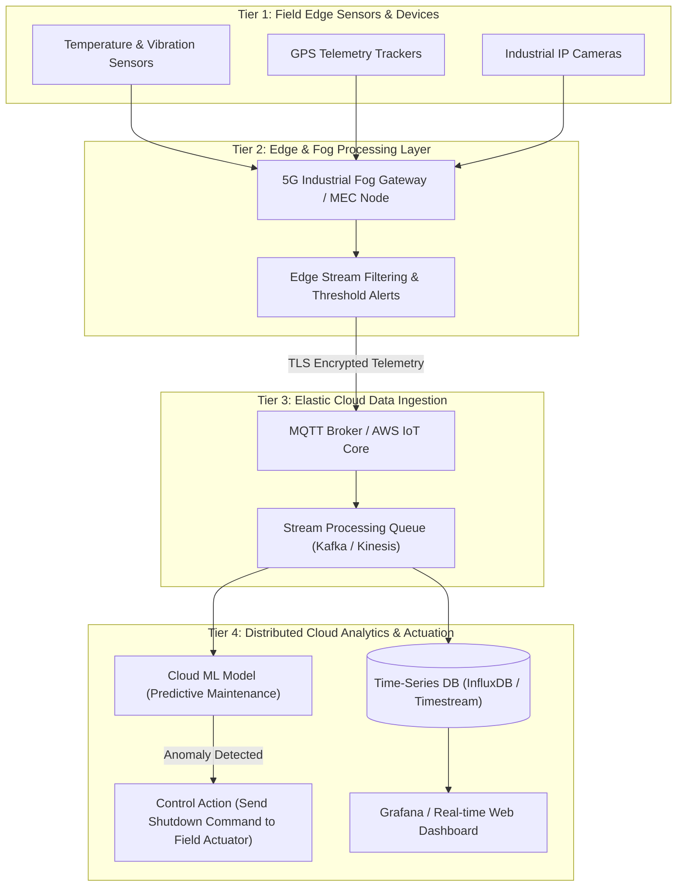
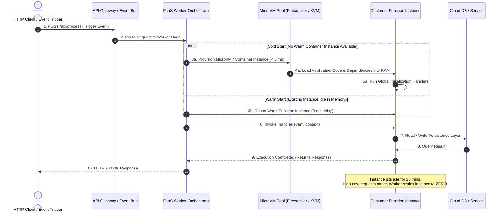
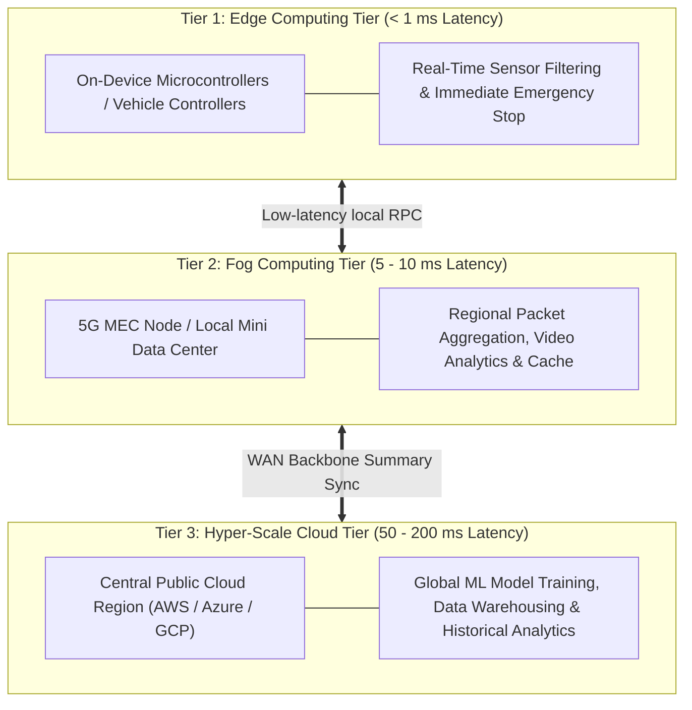
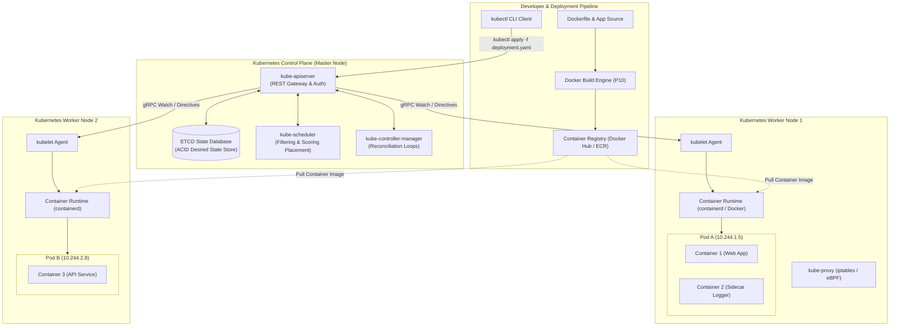
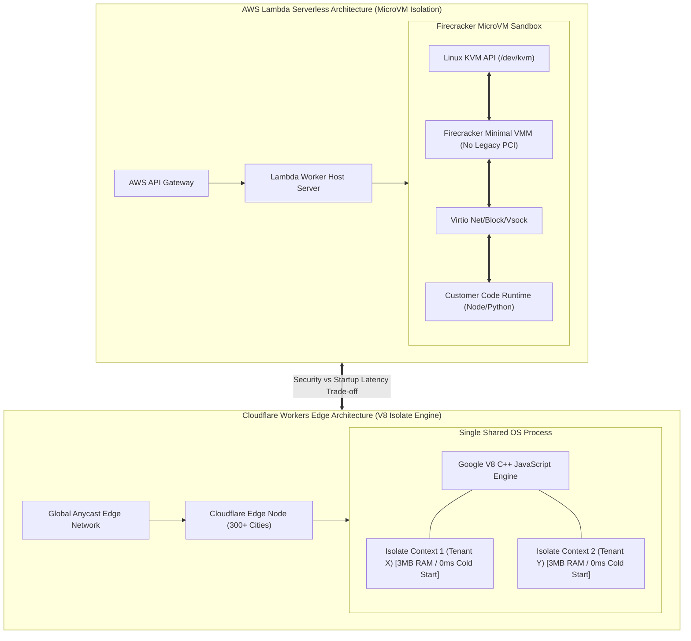

# UNIT 6 — Emerging Technologies with Cloud Computing 🚀

> **Cloud and Data Center Technology (DI05016031)** · **8 hrs · 18% weightage**
> **Covers syllabus sections:** 6.1 Mobile cloud computing (MCC) · 6.2 Sensor and IoT cloud · 6.3 Serverless Computing · 6.4 Edge and Fog Computing · 6.5 AI & ML with Cloud Computing · 6.6 Distributed Ledger Technology (DLT) · 6.7 5G and Cloud-Native Networking · 6.8 Kubernetes and Containers
> **Related practicals:** [[P10 — Docker First Container|P10]] (Docker image + container — RAN for real), [[P05 — Mininet Virtual Sdn Lab|P05]], [[P08 — Cloudsim Secure File Sharing|P08]]

---

## 🧭 Chapter Roadmap

Unit 6 (18%) is the "**everything new**" chapter — the exam's favourite 7-markers are **Edge vs Fog**, **Serverless**, **Containers/Docker** (your P10, which ran for real!), and **DLT**, plus 4-markers on **Kubernetes** and **Edge importance**. MCC, IoT and 5G have not appeared *yet* — expect them in future papers. Containers/Kubernetes is the single most repeated practical-to-exam bridge (P10).

| # | Concept | Exam importance | Related |
|---|---------|-----------------|---------|
| 6.1 | Mobile Cloud Computing (MCC) | ★★★ (not yet asked) | — |
| 6.2 | Sensor & IoT cloud | ★★★ (not yet asked) | P05 (SDN) |
| 6.3 | Serverless computing | ★★★★★ | P10 |
| 6.4 | Edge & Fog computing | ★★★★★ | — |
| 6.5 | AI/ML with cloud | ★★★★ | — |
| 6.6 | DLT with cloud | ★★★★ | P09 (append-only logs) |
| 6.7 | 5G & cloud-native networking | ★★★ | P05 |
| 6.8 | Kubernetes & Containers | ★★★★★ | P10 |

### Learning outcomes — after this unit you can:
1. Define **MCC** and explain how mobile + cloud combine.
2. Explain the **sensor/IoT cloud** architecture and its value.
3. Define **serverless computing** and list its advantages.
4. Differentiate **edge vs fog computing** and explain how fog works.
5. Explain AI/ML's role in the cloud.
6. Explain **DLT/blockchain with cloud computing**.
7. Explain 5G + cloud-native networking at a conceptual level.
8. Define **containers** and **Kubernetes**, and recall the Docker image→container steps (P10).

---

## 6.1 Mobile Cloud Computing (MCC) ⭐
**MCC** = delivering cloud services (compute, storage, apps) to **mobile devices** over the network, pushing heavy processing off the device into the cloud.
- **Benefits:** mobile devices lack battery/compute/storage → offload work; universal access; scalability; app stores as SaaS distribution; pay-per-use.
- **Challenges:** wireless **latency & bandwidth**, battery drain of wireless radios, weak connectivity, security/privacy, heterogeneity of devices.
- **Examples:** Google Drive/Photos backup & processing, Siri/Alexa (speech → cloud AI), mobile banking, Flutter/web apps.

## 6.2 Sensor and IoT Cloud ⭐
An **IoT cloud** ingests data from huge numbers of sensors/devices, stores and analyzes it, and returns control decisions.



**Why cloud?** sensors generate massive, continuous data that can't be stored on-device; the cloud gives **elastic storage, stream processing, ML analytics and global dashboards**. Examples: smart meters, smart parking, vehicle telematics, agriculture monitoring (soil sensors → cloud advisory).

## 6.3 Serverless Computing ⭐⭐
**Serverless** = run code **without provisioning or managing servers**; the cloud provider runs containers on demand, **auto-scales to zero**, and you **pay only for execution time** (per invocation, GB-seconds).
- **Event-driven:** function triggers on HTTP call, file upload, message, timer.
- **FaaS examples:** AWS Lambda, Google Cloud Functions, Azure Functions.
- **Advantages (w_24 Q.5a-alt):** no server management; **auto-scaling** (even to zero); **pay-per-use** (cheap for sporadic load); faster deployment; built-in HA; focus on code not infra.
- **Limitations:** cold starts, stateless functions, execution timeouts, vendor lock-in.



## 6.4 Edge and Fog Computing ⭐⭐

**Edge computing** = processing data **near the source** (on the device or a nearby edge server) to cut **latency** and bandwidth.
**Fog computing** = an **intermediate layer** between edge devices and the cloud — a distributed set of fog nodes (routers, gateways, mini-servers) that aggregate, filter and pre-process before forwarding to the cloud.



### Edge vs Fog (s_24 Q.1c / w_24 Q.5b-alt) ⭐⭐
| Criterion | Edge computing | Fog computing |
|---|---|---|
| Where processing happens | On/near the **device** (edge node) | In an **intermediate layer** between edge and cloud |
| Latency | Lowest (device-local) | Low (network edge, not device) |
| Scale | Per-device/local | Distributed across many nodes |
| Relation to cloud | Can work standalone | Always bridges edge → cloud |
| Analogy | Thinking in your head | A middleman who filters and forwards |

**Why Edge is important (s_25 Q.3a / s_26 Q.5b):** real-time decisions (autonomous vehicles, surgery, AR) can't wait for a round-trip to a far data center; saves bandwidth (only send anomalies); privacy (sensitive data stays local); works offline; cheaper than streaming everything to cloud.

## 6.5 AI and Machine Learning with Cloud Computing ⭐⭐
**Role of ML in the cloud (s_24 Q.5b / s_25 Q.3a-alt):** ML needs huge **data + massive compute**, exactly what cloud provides:
- **On-demand GPU/TPU clusters** for training models.
- **Managed AI/ML services** (SageMaker, Vertex AI, Azure ML) — no infra setup.
- **Elastic data storage** for datasets; **serverless inference** endpoints.
- Ready-made AI: speech/text (chatbots), vision, translation, recommendation.
**Justification that cloud aids ML:** a small team can rent 8 GPUs for a weekend to train a model, then scale inference to a million users — buying that hardware would cost lakhs and sit idle. Cloud turns ML into a pay-per-use utility (matches Unit 1 utility-computing roots).

## 6.6 Distributed Ledger Technology (DLT) with Cloud (s_24 Q.1c-alt, w_25 Q.5b-alt) ⭐⭐
**DLT** = a decentralized database replicated across many nodes, where records (blocks/transactions) are **append-only, tamper-evident and agreed by consensus** — no single authority. **Blockchain** is the best-known DLT (a chain of cryptographically linked blocks).
**How it combines with cloud:**
- **Blockchain-as-a-Service (BaaS):** Azure Blockchain, AWS Managed Blockchain, Oracle Blockchain — provider hosts the DLT network.
- **Cloud hosts DLT nodes** — cheap elastic storage/compute; multi-region for node distribution.
- **Use cases:** **auditable logs & provenance** (recall P09's append-only style object storage and audit!), supply-chain tracking, digital identity, **immutable compliance records**, smart contracts (insurance claims).
- **Why together?** DLT guarantees tamper-evidence; cloud guarantees scalability, availability and managed ops.

## 6.7 5G and Cloud-Native Networking ⭐
**5G** = fifth-gen mobile network: very high bandwidth (multi-Gbps), **ultra-low latency (<5–10 ms)**, massive device density — the connectivity substrate for IoT, edge and autonomous systems. **Cloud-native networking** = networking built as software on cloud principles (SDN/NFV — recall Unit 3): virtualized, automated, API-driven, service-meshes, Kubernetes CNI. Together: 5G connects the devices, the cloud runs the intelligence, SDN (P05) manages the fabric programmatically.

## 6.8 Kubernetes and Containers ⭐⭐
**Container (w_24 Q.5c-alt):** a **lightweight, isolated, portable runtime** that packages an application **with its dependencies** (code, runtime, libraries, config) into one image; shares the host OS kernel (OS-level virtualization, Unit 2); starts in seconds. Build with a **Dockerfile → image → run** (your P10, real output).

**Kubernetes (k8s)** = the open-source **container-orchestration platform**: deploys, scales, heals and load-balances containers across a cluster.
- **Pods** (smallest unit, one+ containers), **Nodes** (worker machines), **Deployments** (desired state), **Services** (stable network access), **auto-scaling & self-healing**, **rolling updates**.
- **Justify: Kubernetes is essential (s_24/s_25 Q.4b):** containers alone give portability but not management; k8s automates deployment, scaling, failover and updates of hundreds of containers — essential for real cloud-native production workloads (and Docker Desktop/Compose is only the single-host start, P10).



---

## 🧠 Deep-Dive Topics

### Deep Dive A: Steps to create an image and run a Docker container (w_24 Q.5c-alt, 7 marks — P10!)
1. **Write the `Dockerfile`** — e.g., `FROM nginx:alpine` + `COPY p10_site/index.html /usr/share/nginx/html/index.html` (P10's actual Dockerfile).
2. **Build the image:** `docker build -t p10-cdct-site .` → layers are cached, reproducible.
3. **Verify:** `docker images` shows `p10-cdct-site`.
4. **Run a container:** `docker run -d --name p10-cdct-site-run -p 8081:80 p10-cdct-site`.
5. **Verify it works:** `curl -I localhost:8081` → **HTTP/1.1 200 OK** (real captured output).
6. **Manage:** `docker ps`, `docker logs`, `docker stop`, `docker rm`.
7. **Tear down** after testing. ✅ *This exact flow was executed for real in [[P10 — Docker First Container|P10]].*

### Deep Dive B: "Fog computing — how does it work?" (s_26 Q.1c)
1. Sensors/devices generate data continuously.
2. A **fog node** (router/gateway/mini-server) receives data, applies **local rules** — filters noise, aggregates, triggers immediate low-latency actions (e.g., shut valve on pressure spike).
3. Only **summarized/anomalous data** is forwarded to the cloud.
4. Cloud runs **deep analytics**, learns policies, and **updates fog node rules**.
5. Result: latency for urgent decisions ≈ local; analytics capacity ≈ cloud; bandwidth cost low.

### Deep Dive C: Serverless vs containers (exam favourite)
| | Serverless (FaaS) | Containers |
|---|---|---|
| Unit | Function | Container (image) |
| Scaling | **To zero** when idle | Manual or via k8s (min > 0) |
| Management | Fully managed | You manage cluster (or use k8s) |
| State | Stateless by design | Can be stateful (volumes) |
| Cost | Pay per invocation | Pay per running VM/instance |
| Best for | Event-driven, sporadic | Long-running services |

### Deep Dive D: The three-layer latency story
Cloud-only = 100 ms+ round trip → bad for autonomous braking. Add **edge** = device-local <5 ms → emergency decisions. Add **fog** = filter/aggregate in the middle → only meaningful data hits the cloud. This is the entire rationale of 6.4, and pairs with 6.7 (5G makes low-latency wireless practical).

---

## 🚀 Beyond the Textbook

1. **Containers ≠ VMs (link to Unit 2):** VMs each carry a guest OS (GBs); containers share the host kernel (MBs) — that's why 30 containers boot in seconds where 30 VMs take minutes. P10 proved image size and instant start.
2. **Kubernetes is the "Linux of the cloud"** — the industry standard every cloud sells as managed service (EKS/GKE/AKS); knowing `docker build/run` (P10) is the correct first step toward it.
3. **Serverless functions are still containers underneath** — Lambda/Functions run your code inside managed containers; serverless just hides the plumbing.
4. **Edge + 5G + IoT are one story, not three topics** — devices (IoT) + low-latency network (5G) + near-source compute (edge/fog) + cloud brain = smart city/industry 4.0. Examiners love this "connect the units" answer.
5. **DLT in cloud ≠ crypto hype** — the syllabus's angle is auditable ledgers + BaaS for compliance, supply chain and identity. P09's immutable audit-style object store is a relatable 1-to-1 analogy.
6. **MCC & IoT cloud: not yet asked** — define + one diagram + one example each; they're easy 3-mark insurance for future papers.

---

## 📝 PYQ Map — UNIT 6 (all available papers)

| Paper | Q. | Topic | Marks |
|---|---|---|---|
| **Summer 2024** | Q.1(c) | Differentiate between edge and fog computing | 7 |
| | Q.1(c)-alt | Explain distributed ledger technology in cloud computing | 7 |
| | Q.5(b) | Role of ML in the cloud; justify cloud aids ML | 4 |
| | Q.5(b)-alt | Define Kubernetes; justify it's essential for cloud computing | 4 |
| **Winter 2024** | Q.5(a)-alt | Define serverless computing; advantages | 3 |
| | Q.5(b)-alt | Differentiate edge and fog computing | 4 |
| | Q.5(c)-alt | Define containers; steps to build image + run docker container | 7 |
| **Summer 2025** | Q.3(a) | Why is Edge Computing important? | 3 |
| | Q.3(a)-alt | Role of Machine Learning in Cloud Computing | 3 |
| | Q.4(b) | Define Kubernetes; justify it's essential | 4 |
| | Q.4(b)-alt | Explain Serverless Computing | 4 |
| **Winter 2025** | Q.1(c) | Explain Fog computing in cloud computing | 7 |
| | Q.5(b) | Explain Serverless Computing | 4 |
| | Q.5(b)-alt | Explain DLT with Cloud Computing | 4 |
| **Summer 2026** | Q.1(c) | Explain fog computing; how does it work? | 7 |
| | Q.1(c)-alt | Explain serverless computing technology | 7 |
| | Q.5(b) | Define Edge Computing; explain its importance | 4 |
| | Q.5(b)-alt | Define and explain Kubernetes | 4 |

### ✅ Solved PYQ answers (UNIT 6)

**Q. (w_24 Q.5a-alt, 3 marks) — Define serverless computing. List advantages.**
> Serverless computing is a cloud execution model where **developers run code without provisioning or managing servers** — the provider dynamically runs the code in managed containers on **events** (HTTP, upload, timer), scaling up **or to zero** automatically, and you **pay only for the execution time consumed**. Advantages: no server management, automatic elasticity (even to zero), pay-per-use (ideal for unpredictable/sporadic traffic), faster deployment, built-in availability, and developer focus on code rather than infrastructure. Examples: AWS Lambda, Azure Functions, Google Cloud Functions.

**Q. (s_26 Q.1c, 7 marks) — Explain fog computing. How does it work?**
> Fog computing is a **distributed intermediate layer between edge devices and the cloud** — a network of fog nodes (routers, gateways, local mini-servers) that provide compute, storage and networking close to the data source. **How it works:** (1) sensors/devices stream data; (2) fog nodes apply **local intelligence** — filter noise, aggregate, run immediate low-latency rules (e.g., trip a valve on a pressure spike); (3) only **summarized/anomalous data** is forwarded to the cloud; (4) the cloud does deep analytics and **pushes updated policies back** to fog nodes. **Why:** urgent decisions don't wait for a distant data center (lower latency), bandwidth cost drops, and the cloud stays uncluttered — it complements (not replaces) edge and cloud in a three-tier architecture (see Unit 6 diagram).

**Q. (s_24 Q.1c, 7 marks) — Differentiate between edge and fog computing.**
> **Edge computing** processes data **on or right beside the device** producing it — lowest latency, works even offline, per-device/local scale. **Fog computing** is a **middle layer**: a distributed set of fog nodes (gateways, routers, local servers) that sit *between* the devices and the cloud, filtering/aggregating data before forwarding. | Edge = device-adjacent processing; Fog = network-edge processing layer. | Edge latency is lowest; fog latency is low but it adds one hop. | Edge can function standalone; fog's purpose is to **bridge** edge → cloud. | Analogy: edge = thinking in your head; fog = a local manager who summarizes before reporting to headquarters. | Both reduce latency/bandwidth; edge is the closest layer, fog the connective tissue, cloud the analytics brain (Deep Dive B).

**Q. (s_26 Q.5b, 4 marks) — Define Edge Computing and explain its importance.**
> Edge computing = processing data **near its source** (on the device or a nearby edge server) rather than sending everything to a central cloud. **Importance:** (1) **ultra-low latency** for real-time decisions — autonomous vehicles, industrial control, AR; (2) **bandwidth savings** — only anomalies travel to the cloud; (3) **privacy** — sensitive data stays local; (4) **offline resilience** — keeps working without connectivity; (5) cost reduction by cutting cloud egress/processing. It does not replace the cloud — it feeds it the interesting data.

**Q. (w_24 Q.5c-alt, 7 marks) — Define Containers. Steps to create an image and execute a Docker container (with example).**
> A **container** is a lightweight, isolated, portable runtime that packages an application **with all its dependencies** (code, runtime, libraries, config) as an **image**, sharing the host OS kernel (OS-level virtualization). **Steps (as done for real in P10):** (1) Write a **Dockerfile** — `FROM nginx:alpine` and `COPY p10_site/index.html /usr/share/nginx/html/`; (2) `docker build -t p10-cdct-site .` builds the image from layers; (3) `docker images` lists it; (4) **execute a container** with `docker run -d --name p10-cdct-site-run -p 8081:80 p10-cdct-site`; (5) verify with `curl -I localhost:8081` → **HTTP/1.1 200 OK**; (6) manage with `docker ps`, `docker logs`, `docker stop`, `docker rm`. **Result:** the site runs in an isolated container on port 8081, portable to any machine with Docker.

**Q. (s_24 Q.5b-alt, 4 marks) — Define Kubernetes. Justify: it is an essential component of cloud computing.**
> **Kubernetes** is the open-source **container-orchestration platform** that automates deployment, scaling, networking and management of containerized applications across a cluster (nodes). **Justification:** containers (P10) give portability but nothing manages them at scale — Kubernetes provides **self-healing** (restarts failed containers), **auto-scaling** (based on load), **rolling updates** (zero-downtime), **service discovery/load balancing**, and **declarative desired-state** management. In modern cloud-native production, hundreds of containers run across many machines — no human can manage that; Kubernetes is what makes large-scale containerized clouds operable, hence essential.

**Q. (s_24 Q.1c-alt, 7 marks) — Explain Distributed Ledger Technology in cloud computing.**
> **DLT** is a decentralized database replicated across many nodes where records are **append-only, tamper-evident and agreed by consensus** (no single authority); **blockchain** is its most famous form (cryptographically chained blocks). **With cloud computing:** (1) **Blockchain-as-a-Service (BaaS)** — AWS Managed Blockchain, Azure Blockchain, Oracle — the provider hosts/operates the DLT network; (2) clouds give cheap elastic nodes and multi-region distribution for the ledger; (3) cloud storage complements on-chain data. **Use cases:** immutable audit/compliance logs, supply-chain provenance, digital identity, smart contracts (auto-executing insurance/escrow). **Why together:** DLT guarantees trust/integrity; the cloud guarantees scale, availability and managed ops — a tamper-proof ledger that is still elastic and always-on.

**Q. (s_24 Q.5b, 4 marks) — Role of ML in the cloud; justify cloud aids ML.**
> ML needs **massive data and massive compute** — the cloud supplies both on demand. **Role:** on-demand **GPU/TPU clusters** for training, **managed ML services** (SageMaker, Vertex AI, Azure ML), elastic storage for datasets, serverless inference endpoints, and ready-made AI (chatbots, vision, translation, recommendation). **Justification:** a small team can rent a GPU cluster for a weekend to train a model, then scale inference to a million users — buying equivalent hardware costs crores and sits idle; the cloud turns ML into a **pay-per-use utility** (the same utility-computing idea from Unit 1). Without elastic cloud resources, ML would stay confined to big corporations.

---

## ✍️ Practice Problems (self-test — answers hidden)

1. Define MCC; give two challenges.
2. Draw the IoT-cloud pipeline (sensor → cloud → action).
3. List 4 serverless advantages; when is serverless NOT a good fit?
4. Edge vs Fog: give one sentence each + one analogy.
5. "5G + edge + cloud" — explain how the three cooperate in a smart city.
6. Write the exact Docker commands (P10) from Dockerfile to running container.
7. Why is Kubernetes essential if we already have containers?
8. DLT + cloud: give two use cases; what does each side contribute?

<details>
<summary>📌 Model solutions</summary>

1. MCC = mobile devices using cloud compute/storage. Challenges: wireless latency/bandwidth, battery drain, connectivity, security.
2. Sensors → gateway/edge → cloud ingest (queue) → storage → analytics/ML → control to actuators + dashboards.
3. No server mgmt, auto-scale-to-zero, pay-per-use, fast deploy. Not for: long-running heavy workloads, strict cold-start latency, stateful apps.
4. Edge = device-adjacent compute (thinking in your head). Fog = intermediate layer that filters/forwards (a middleman manager).
5. 5G gives low-latency wireless; edge does instant local decisions; cloud does deep analytics/control loops (and fog aggregates between).
6. `docker build -t p10-cdct-site .` → `docker images` → `docker run -d --name p10-cdct-site-run -p 8081:80 p10-cdct-site` → `curl -I localhost:8081` → `docker stop/rm`.
7. Containers need management at scale — k8s automates scheduling, scaling, self-healing, rolling updates, service discovery.
8. Use cases: supply-chain provenance, immutable compliance/audit logs. DLT gives tamper-evidence/trust; cloud gives scale/availability/managed BaaS.
</details>

---

## 📖 Glossary of Key Terms

| Term | Definition |
|---|---|
| **MCC** | Mobile cloud computing: mobile devices offload compute/storage to the cloud |
| **IoT cloud** | Cloud backend ingesting/analyzing sensor data and driving actuators |
| **Serverless / FaaS** | Run code without servers; scale to zero; pay per invocation |
| **Cold start** | First-invocation latency when a function instance spins up |
| **Edge computing** | Processing at/near the data source |
| **Fog computing** | Intermediate layer between edge and cloud (gateways/nodes) |
| **DLT** | Decentralized append-only tamper-evident ledger |
| **Blockchain** | Chain of cryptographically linked blocks (a DLT) |
| **BaaS** | Blockchain-as-a-Service (managed DLT in the cloud) |
| **5G** | High-bandwidth ultra-low-latency mobile network |
| **Cloud-native** | Apps/networks built on cloud principles (SDN/NFV, containers) |
| **Container** | Lightweight isolated app + dependencies, shares host kernel |
| **Image** | Immutable template built from a Dockerfile |
| **Kubernetes (k8s)** | Container orchestration: deploy/scale/heal |
| **Pod / Node** | Smallest k8s unit / worker machine |
| **Smart contract** | Self-executing program on a DLT |
| **GPU/TPU cluster** | Cloud-provided accelerator for ML training |

---

## 🔗 Curated Resources (per concept)

**Serverless**
- AWS Lambda: https://aws.amazon.com/lambda/ · serverlessland.com

**Edge & Fog**
- OpenFog Consortium / IEEE fog computing: https://www.iiconsortium.org/vertical-markets/fog-computing/
- Cloudflare edge glossary: https://www.cloudflare.com/learning/serverless/glossary/what-is-edge-computing/

**Containers & Kubernetes**
- Docker docs (getting started): https://docs.docker.com/get-started/
- Kubernetes docs: https://kubernetes.io/docs/concepts/overview/
- K8s essentials (why orchestration): https://kubernetes.io/docs/concepts/overview/what-is-kubernetes/

**DLT / Blockchain**
- AWS Managed Blockchain: https://aws.amazon.com/managed-blockchain/

**IoT / 5G**
- AWS IoT: https://aws.amazon.com/iot/ · 5G explained (Wikipedia): https://en.wikipedia.org/wiki/5G

**ML on cloud**
- Amazon SageMaker: https://aws.amazon.com/sagemaker/ · Google Vertex AI: https://cloud.google.com/vertex-ai

**Books (GTU syllabus)**
- Sosinsky, *Cloud Computing Bible* (Wiley) — emerging tech chapter
- Buyya et al., *Mastering Cloud Computing* — IoT + edge chapters

**Videos (high yield)**
- *Serverless vs containers* — IBM Technology
- *Edge vs Fog computing* — IBM Technology
- *Kubernetes in 10 minutes* — TechWorld with Nana

---

## 🎥 Video Study Guide (YouTube)

> Search keywords + trusted channels, in watching order.

### 🧑‍🎓 Step 0 — Pick your learning style
| Style | You learn best by | Your path through this unit |
|---|---|---|
| 🎧 **Listener** | short explainers | 1 video per topic (5–10 min each) |
| 🛠️ **Builder** | doing it | Rebuild + rerun [[P10 — Docker First Container|P10]] (it ran for real!) |
| 🧠 **Deep Diver** | the "why" | Edge-vs-fog + DLT-cloud deep dives |
| 🎓 **Academic** | exam marks | Master serverless, edge/fog, containers, DLT from the PYQ map |

### 🎬 Step 1 — Watch by topic
| Topic | YouTube search keywords | Best channels |
|---|---|---|
| MCC | `mobile cloud computing` | Simplilearn, Gate Smashers |
| IoT cloud | `iot cloud architecture` · `aws iot core` | IBM Technology, AWS |
| Serverless | `serverless computing explained` · `faas vs containers` | IBM Technology, TechWorld with Nana |
| Edge & Fog | `edge vs fog computing` · `what is fog computing` | IBM Technology, Simplilearn |
| ML in cloud | `cloud computing machine learning` | Google Cloud Tech, IBM Technology |
| DLT / blockchain cloud | `distributed ledger technology` · `blockchain as a service` | IBM Technology, Simply Explained |
| 5G & cloud-native | `5g and edge computing` · `cloud native networking` | IBM Technology |
| Docker (P10) | `docker build dockerfile nginx` · `docker for beginners` | TechWorld with Nana, freeCodeCamp |
| Kubernetes | `kubernetes explained in 10 minutes` | TechWorld with Nana, IBM Technology |
| Revision | `cloud unit 6 serverless edge fog containers` | Gate Smashers, Neso Academy |

3. NPTEL *Cloud Computing* (emerging tech unit): https://archive.nptel.ac.in/courses/106/105/106105167/

---

## 📖 Historical Context & Motivation

The evolution of cloud computing has progressed through distinct abstraction frontiers: from physical bare-metal servers to virtual machines (IaaS, Unit 2), container microservices (Docker/Kubernetes), and event-driven Serverless Function-as-a-Service (FaaS). While full hypervisor virtual machines provide hardware-level multi-tenant security boundaries, their heavy OS footprints (requiring full kernel boots, gigabytes of RAM, and seconds-to-minutes startup latencies) rendered them unsuitable for ephemeral event-driven microservices. In 2013, **Docker** popularized OS-level virtualization using Linux kernel primitives (`namespaces` and `cgroups`), enabling lightweight containers that boot in milliseconds and share a host kernel. To orchestrate containerized fleets across hyper-scale data centers, Google open-sourced **Kubernetes** in 2014 based on its internal Borg container manager.

Simultaneously, the physical constraints of centralized cloud data centers hit latency limits imposed by the speed of light ($c \approx 3 \times 10^8\text{ m/s}$). Transmitting raw data from millions of Internet of Things (IoT) sensors, autonomous vehicles, and industrial robotics back to distant cloud regions created round-trip network latencies of 50–200 ms and consumed unsustainable WAN backbone bandwidth. To solve this, **Edge Computing** (processing data directly on edge devices) and **Fog Computing** (a distributed intermediate tier of local gateways and 5G Multi-Access Edge Computing - MEC nodes) emerged to filter, aggregate, and process time-critical data in sub-millisecond windows. Today, serverless micro-VMs (e.g., AWS Firecracker), edge AI inference, 5G network slicing, and Distributed Ledger Technology (DLT / Blockchain-as-a-Service) represent the converging frontiers of cloud-native systems.

---

## 🔬 Deep Dive: System Architecture

### MicroVM Isolation (AWS Firecracker), Kubernetes Reconciliation Loops, and 3-Tier Latency Architecture

Emerging cloud architectures bridge low-latency edge nodes with hyper-scale container orchestration using lightweight micro-virtualization and control loops.

```mermaid
flowchart TB
    subgraph EdgeFogTier["3-Tier Latency Hierarchy (Edge -> Fog -> Cloud)"]
        EdgeDev["Tier 1: Edge Devices<br/>(IoT Sensors, Video Cameras)<br/>[Latency < 1 ms]"]
        FogNode["Tier 2: Fog Gateways / 5G MEC<br/>(Local Edge Servers)<br/>[Latency 5 - 10 ms]"]
        CloudCore["Tier 3: Core Cloud Data Center<br/>(Hyper-Scale Aggregation)<br/>[Latency 50 - 200 ms]"]
        EdgeDev -- "High-frequency raw streams" --> FogNode
        FogNode -- "Aggregated summaries & anomalies" --> CloudCore
    end
    subgraph FirecrackerArch["Serverless MicroVM Engine (AWS Firecracker)"]
        KVMDev["Linux KVM Kernel API (/dev/kvm)"]
        MicroVM["Firecracker MicroVM Process<br/>(Minimal VMM, No PCI/ACPI, < 5 MB RAM)"]
        GuestFunc["Ephemeral Customer Function (Lambda / FaaS)"]
        KVMDev <--> MicroVM <--> GuestFunc
    end
```mermaid
sequenceDiagram
    autonumber
    actor Dev as Developer (kubectl / CI/CD)
    participant API as kube-apiserver
    participant ETCD as ETCD Datastore
    participant Sched as kube-scheduler
    participant Ctrl as ReplicaSet Controller
    participant Kubelet as Worker Node Kubelet
    participant CRI as Container Runtime (containerd)

    Dev->>API: 1. `kubectl apply -f nginx-deployment.yaml` (Desired Replicas = 3)
    API->>ETCD: 2. Save Manifest Desired State (ACID Transaction)
    ETCD-->>API: 3. Manifest Persisted
    API-->>Dev: 4. Deployment Created (HTTP 201 Created)
    
    Ctrl->>API: 5. Watch Event: Unfulfilled Replicas (Actual: 0, Desired: 3)
    Ctrl->>API: 6. Create 3 Pod Specs (State: Pending Scheduling)
    
    loop kube-scheduler Placement Engine
        Sched->>API: 7. Fetch Unscheduled Pods
        Sched->>Sched: 8. Run Filter Predicates (RAM/CPU/Tolerations)
        Sched->>Sched: 9. Run Priority Scoring (Image Locality & Spreading)
        Sched->>API: 10. Bind Pod A to Worker Node 1
    end
    
    Kubelet->>API: 11. Watch Event: Pod A assigned to Node 1
    Kubelet->>CRI: 12. `RunPodSandbox` & `CreateContainer`
    CRI->>CRI: 13. Initialize Linux Namespaces (NET, PID) & Cgroups Limits
    CRI-->>Kubelet: 14. Container Running (IP: 10.244.1.5)
    Kubelet->>API: 15. Update Pod Status -> RUNNING
    API->>ETCD: 16. Reconciled State Persisted (Actual == Desired)
```

#### 1. Serverless MicroVM Architecture: AWS Firecracker Mechanics
Traditional QEMU hypervisor emulators contain over 100,000 lines of code emulating legacy PC hardware (IDE controllers, PCI buses, ACPI tables, Sound cards), creating a large memory footprint (~100 MB) and a broad attack surface.

AWS engineered **Firecracker**, an open-source Virtual Machine Monitor (VMM) written in Rust specifically for serverless workloads (AWS Lambda, AWS Fargate):
- **Stripped Device Model**: Firecracker drops all legacy hardware emulation, exposing only 5 minimal paravirtualized Virtio devices (Virtio-net, Virtio-block, Virtio-vsock, Virtio-balloon, and minimal serial console).
- **Direct Linux KVM Integration**: Interacts directly with `/dev/kvm` via `ioctl` system calls, creating isolated execution contexts inside VMX Non-Root mode (Unit 2).
- **MicroVM Footprint**: Boot time is reduced to **$< 5\text{ ms}$** and memory overhead is constrained to **$< 5\text{ MB}$** per microVM instance, allowing hypervisors to pack tens of thousands of isolated customer serverless functions onto a single physical host node.

#### 2. Kubernetes Control Plane & Declaration Reconciliation Loop
Kubernetes manages containerized workloads across node clusters using a continuous **Reconciliation Loop**:

$$\text{Reconciliation Engine: } \lim_{t \to \infty} \Big( State_{actual}(t) \to State_{desired} \Big)$$

The orchestration lifecycle operates via three core control components:
1. **ETCD Store**: Strongly consistent, distributed key-value store holding the authoritative cluster $State_{desired}$ (YAML spec manifests).
2. **kube-scheduler**: Continuously evaluates unscheduled Pods against cluster worker nodes using a 2-phase pipeline:
   - *Filtering (Predicates)*: Eliminates nodes lacking required CPU/RAM capacity, port bindings, or node selector labels.
   - *Scoring (Priorities)*: Ranks remaining nodes based on resource spreading, image locality, and affinity rules.
3. **Kubelet & Container Runtime Interface (CRI)**: The `kubelet` agent on each worker node watches ETCD via the API server. If a Pod is assigned to its node, `kubelet` invokes the CRI (e.g., `containerd` or `cri-o`) to configure Linux kernel `cgroups` (resource limits) and `namespaces` (PID, NET, MNT, IPC isolation).

---

## 🏢 Real-World Case Study

### AWS Lambda Architecture Powered by Firecracker & Cloudflare Workers Edge Network

Modern serverless computing powers millions of applications globally, handling sudden traffic spikes from zero to millions of requests per second without user infrastructure management.



#### Technical Comparison & Case Study Insights:
1. **AWS Lambda (Hardware-Isolated MicroVMs)**: Executes untrusted customer code by instantiating ephemeral Firecracker microVMs on KVM. This provides hardware-level memory and CPU isolation between multi-tenant workloads, ensuring that even zero-day kernel exploits cannot breach tenant boundaries.
2. **Cloudflare Workers (V8 Isolates at the Edge)**: Replaces microVMs and containers with Google V8 JavaScript Engine **Isolates**. Cloudflare runs thousands of isolate contexts within a single shared OS process across 300+ global edge data centers. This achieves **zero cold-start latency** (0 ms startup) and extremely low memory overhead (~3 MB per isolate), permitting microsecond execution right at the network edge.

---

## 📝 End-of-Chapter Exercises

### Exercise 1: Serverless Memory Allocation & Cost Optimization Mathematics
An AWS Lambda serverless function exhibits an execution runtime $T(m)$ that scales inversely with allocated memory $m$ (in MB), modeled by the equation:

$$T(m) = \frac{4000}{m} + 0.05 \quad \text{seconds}$$

AWS Lambda billing charges \$0.0000166667 per GB-second of compute execution, plus \$0.20 per million requests.
- (a) Derive the total cost function $Cost(m)$ for executing 1,000,000 function invocations as a function of allocated memory $m \in [128, 10240]\text{ MB}$.
- (b) Calculate the optimal memory allocation $m^*$ that minimizes total monetary execution cost.
- (c) Calculate the execution runtime $T(m^*)$ and explain why increasing memory allocation can paradoxically *reduce* total serverless billing costs.

### Exercise 2: Edge vs. Fog vs. Cloud Offloading Optimization Algorithm
An autonomous vehicle generates $B = 100\text{ MB/sec}$ of high-definition camera frames. The system can execute video analytics locally on the vehicle's Edge Processor, offload to a 5G Fog MEC Node, or transmit to a Cloud Data Center.

| Execution Tier | Processing Capacity ($C_i$) | Round-Trip Network Latency ($L_i$) | Energy Cost per MB ($E_i$) |
|---|---|---|---|
| **Tier 1: Edge (Vehicle)** | 10 MB/sec | 0 ms | 15 Joules/MB |
| **Tier 2: Fog (5G MEC)** | 50 MB/sec | 8 ms | 4 Joules/MB |
| **Tier 3: Cloud DC** | $\infty$ (Unconstrained) | 80 ms | 1 Joule/MB |

- (a) Formulate an optimization problem that minimizes total energy consumption subject to a hard latency deadline constraint of $T_{max} = 20\text{ ms}$ per processing batch.
- (b) Determine the exact percentage breakdown of frame data allocated to Edge, Fog, and Cloud tiers.
- (c) Re-evaluate the allocation if a 5G network outage increases Fog latency $L_2$ to 50 ms.

### Exercise 3: Kubernetes Custom Scheduler Scoring Engine Algorithm
Write Python-style pseudo-code for a custom `kube-scheduler` plugin module that scores worker nodes for deploying a distributed AI ML inference Pod requiring 1 GPU and 16 GB RAM.
- (a) Write function `filter_nodes(pod_spec, node_list)` that filters out nodes lacking hardware GPU drivers or possessing insufficient unallocated RAM.
- (b) Write function `score_nodes(pod_spec, filtered_nodes)` that ranks nodes using a balanced resource allocation score:

$$Score(Node) = 50 \times \left(1 - \frac{RAM_{alloc}}{RAM_{total}}\right) + 50 \times \left(1 - \frac{GPU_{alloc}}{GPU_{total}}\right)$$

- (c) Explain how your scheduler scoring function prevents GPU memory fragmentation across heterogeneous worker nodes.

### Exercise 4: Docker Container cgroups & Namespace Isolation Analysis
A developer runs a Docker container using command:
`docker run -d --name app --cpus="1.5" --memory="512m" -p 8080:80 nginx:alpine`
- (a) Detail the specific Linux kernel `namespaces` created for this container (PID, NET, MNT, IPC, UTS, USER) and explain what hardware/system resources each namespace isolates.
- (b) Explain how the Linux kernel `cgroups` (control groups) subsystem enforces the `--cpus="1.5"` constraint using Completely Fair Scheduler (CFS) parameters (`cpu.cfs_quota_us` and `cpu.cfs_period_us`).
- (c) Analyze the failure mode and system response (Kernel OOM Killer) when the Nginx container attempts to allocate 600 MB of RAM exceeding its 512 MB cgroup limit.

