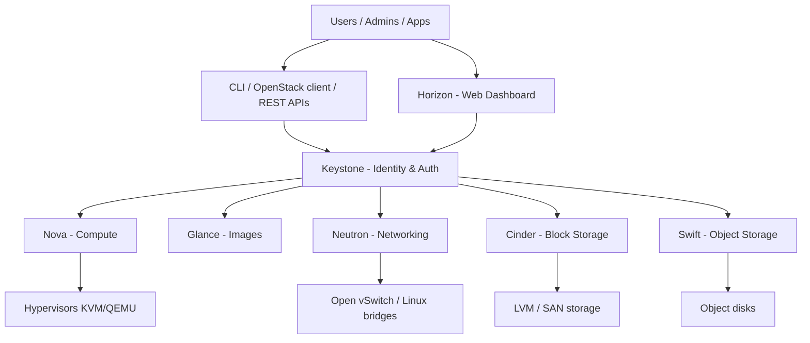

# P01 — Architecture Study: OpenStack (IaaS Cloud Platform)

**Subject:** Cloud and Data Center Technology | **Unit:** 1 | **Approx. Hrs:** 2
**PrO (verbatim):** *Sketch out and analyze the architecture of Openstack/ Eucalyptus/ OpenNebula/ KVM and identify different entities to understand the structure of it.*

---

## 1. Objective
- Understand the layered architecture of an open-source IaaS cloud platform.
- **Deep dive:** OpenStack — draw its architecture and explain each core component.
- Compare OpenStack against Eucalyptus, OpenNebula and KVM.
- Identify the **entities** (projects, users, flavors, images, instances, networks, volumes) that make up the system.

## 2. Theory (exam-ready)

### 2.1 What is OpenStack?
OpenStack is a **free, open-source software platform for cloud computing**, primarily deployed as an **IaaS** (Infrastructure-as-a-Service) solution. It controls large pools of **compute, storage, and networking resources** through a set of **API-driven services**. OpenStack is written mostly in Python and is used by companies like CERN, OVHcloud, and large telecom operators. Each component has its own project name (Nova, Neutron, …) and talks to the others over REST APIs plus a message bus (RabbitMQ).

### 2.2 High-level layers

## 3. Architecture — core components

### 3.1 Component table
| Service | Project | Role | Port |
|---|---|---|---|
| **Identity** | **Keystone** | Authentication, tokens, **projects, users, roles**, service catalogue | 5000 (v3) |
| **Compute** | **Nova** | Create/manage **VM instances**; schedules on hypervisors | 8774 |
| **Image** | **Glance** | Store & serve **VM images** (QCOW2, RAW, ISO) | 9292 |
| **Networking** | **Neutron** | Networks, subnets, routers, security groups, LBaaS, FIP | 9696 |
| **Block Storage** | **Cinder** | Persistent **volumes** (attach to instances) | 8776 |
| **Object Storage** | **Swift** | Scalable **object/blob** storage (DLO/SLO, S3-like) | 8080 |
| **Dashboard** | **Horizon** | Web UI for everything above | 80/443 (Apache) |
| **Orchestration** | **Heat** | Stack templates (HOT) — IaC for OpenStack | 8004 |
| **Telemetry** | **Ceilometer** | Metering / metering data for billing & autoscaling | 8777 |

### 3.2 Control plane vs data plane
- **Control plane (stateless services):** Keystone, Nova API, Neutron API, Cinder API, Glance API — they keep state in databases (**MySQL/MariaDB**) and send messages over **RabbitMQ**. You can run many replicas behind a load balancer.
- **Data plane (compute & storage):** nova-compute (runs on every hypervisor host with **KVM/QEMU**), neutron agents (L2/L3/DHCP on network nodes), cinder-volume (on storage nodes). These actually move data.
- Message flow: *Horizon → Keystone (auth) → Nova API → RabbitMQ → nova-scheduler → nova-compute → KVM*, pulling the image from Glance and wiring Neutron ports + Cinder volumes.

### 3.3 Launch-an-instance workflow (traces the entities)
1. **Horizon** shows login → user authenticates against **Keystone**, gets a **token** and is bound to a **project** with a **role**.
2. User picks a **flavor** (CPU/RAM/disk template), an **image** (from **Glance**), a **network** (from **Neutron**) and a **keypair**.
3. **Nova** asks Glance for the image, Neutron for ports/security groups, Cinder for a boot volume.
4. nova-scheduler places the instance on a host with free capacity; nova-compute creates the VM on **KVM**.
5. Result: a running **instance** with an IP — all state visible in Horizon.

### 3.4 Entities to identify (viva list)
| Entity | What it is | Example |
|---|---|---|
| **Project (tenant)** | Isolation boundary / container of resources | `student-proj-5` |
| **User / Role** | Account and its permission (admin, member, reader) | `alice` / `admin` |
| **Flavor** | Hardware template for an instance | `m1.small` = 1 vCPU, 2 GB, 20 GB |
| **Image** | Bootable VM template (Glance) | `Ubuntu-24.04.qcow2` |
| **Instance** | A running VM (Nova) | `web-server-01` |
| **Network / Subnet / Router** | L2/L3 topology (Neutron) | `net-a` 10.0.0.0/24 |
| **Security group** | Firewall rules on ports | allow SSH 22 |
| **Volume** | Persistent block device (Cinder) | 10 GB volume |
| **Keypair** | SSH public key injected into instances | `alice-key` |

## 4. Comparison: OpenStack vs Eucalyptus vs OpenNebula vs KVM
| Criterion | **OpenStack** | **Eucalyptus** | **OpenNebula** | **KVM** |
|---|---|---|---|---|
| Type | IaaS cloud platform | AWS-compatible IaaS | IaaS cloud manager | Bare hypervisor |
| Scope | Many services (compute+net+storage) | EC2/S3 clones | VM orchestration | VM execution only |
| Hypervisor | KVM/QEMU, Xen, VMware, LXC | KVM/Xen (managed) | KVM, Xen, VMware | (it *is* the hypervisor) |
| API | Own REST + AWS-ish EC2/S3 | AWS EC2/S3 API | OpenNebula API | libvirt |
| Multi-tenant IAM | Keystone (RBAC) | Eucalyptus IAM | Users/groups per host | No (kernel feature) |
| Networking | Neutron (advanced SDN) | VLAN/Eucalyptus net | 3 modes (bridged/VLAN) | Linux bridge/OVS |
| Best for | Enterprise/multi-service clouds | AWS-compatible private clouds | Small/medium virtualisation mgmt | Per-host virtualisation (the base layer) |
| Ease of setup | Complex | Medium | Simple | Very simple |

> Key takeaway: **KVM is the foundation** (the hypervisor that actually runs VMs); OpenStack/OpenNebula/Eucalyptus are **managers** on top of it. OpenStack is the most complete — that is why it is the deep dive here.

## 5. Hands-on (optional)
- DevStack single-node test cloud: `sudo ./stack.sh` → https://docs.openstack.org/devstack/latest/
- Or `kolla-ansible` for a real multi-node deployment: https://docs.openstack.org/kolla-ansible/latest/

## 6. Expected Deliverable (report skeleton)
1. Title, aim, date.
2. One labelled architecture diagram (3.2 control/data plane).
3. Component table (3.1) with a one-line role per service.
4. Entity table (3.4) with 6–8 entities explained.
5. Comparison table (4) with reasoning for choosing OpenStack.
6. Conclusion.

## 7. Viva Q&A
1. **What is Keystone?** — Identity service: users, projects, roles, tokens, service catalogue.
2. **What does Nova do?** — Manages instances (create, start, stop, delete) and schedules them on hypervisors.
3. **Nova vs Swift?** — Nova = compute (VMs); Swift = object storage (files/blobs).
4. **What is a flavor?** — A template defining vCPU/RAM/disk for an instance.
5. **Type 1 vs Type 2 hypervisor (link to Unit 2)?** — KVM is Type 1-ish (KVM is a kernel module); VirtualBox is Type 2 (runs on an OS).

## 8. Resources
- OpenStack docs: https://docs.openstack.org
- OpenStack component overview: https://www.openstack.org/software/
- DevStack: https://docs.openstack.org/devstack/latest/
- Eucalyptus: https://en.wikipedia.org/wiki/Eucalyptus_(software)
- OpenNebula docs: https://docs.opennebula.io
- KVM docs: https://www.linux-kvm.org/page/Documents
- KVM (libvirt) virtualization guide: https://libvirt.org

---

---

## 🐛 Failure Modes & Debugging (Real-World Experience)

> [!bug] What goes wrong in production?
> When running **Openstack Architecture** in a real environment, it almost never works perfectly the first time. 
> 
> **Common Edge Cases to Test:**
> 1. **Network partitions:** What happens to this code if the Wi-Fi drops halfway through execution?
> 2. **Malformed Inputs:** How does the system behave if fed null values, extremely large datasets, or unexpected data types?
> 3. **Resource Exhaustion:** Does this script handle memory leaks or rate-limiting from APIs?

## 🔬 Extension Challenge

> [!example] Prove your expertise
> To truly master this practical, try modifying the code to achieve the following:
> - **Add robust error handling** (try/catch blocks) and structured logging instead of print statements.
> - **Parameterize the inputs** so the script can be run dynamically from the CLI without hardcoding values.
> - **Optimize it:** Can you reduce the execution time or memory footprint?

## 🎯 Key Takeaways

- **What is Keystone?** — Identity service: users, projects, roles, tokens, service catalogue.
- **What does Nova do?** — Manages instances (create, start, stop, delete) and schedules them on hypervisors.
- **Nova vs Swift?** — Nova = compute (VMs); Swift = object storage (files/blobs).
- **What is a flavor?** — A template defining vCPU/RAM/disk for an instance.

> [!tip] Viva Prep
> Be ready to explain the *why* behind each step, not just the output.
