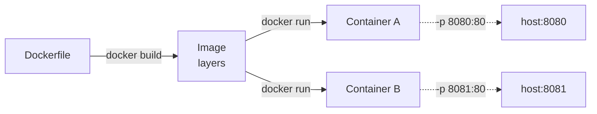

# P10 — Creating & Executing Your First Container (Docker)

**Subject:** Cloud and Data Center Technology | **Unit:** 6 | **Approx. Hrs:** 4
**PrO (verbatim):** *Creating and Executing Your First Container Using Docker platform.*

---

## 1. Objective
- Verify a working **Docker** installation.
- Run the classic `docker run hello-world`.
- Run a real web server: `docker run -d -p 8080:80 nginx`.
- Write a **custom `Dockerfile`** (static site served with Python's `http.server`), build it, and run it.

> ✅ **Ran for real in this environment** — all console output below is the **actual captured run**.

## 2. Theory (exam-ready)
A **container** packages an application + its runtime/dependencies into a single, portable unit that runs on any machine with a container runtime. Unlike a **VM** (separate guest OS, hypervisor), containers **share the host kernel** (OS-level virtualization, Unit 2) — faster startup, smaller images.

- **Image** = read-only template (layered).
- **Container** = running instance of an image.
- **Dockerfile** = recipe to build an image (`FROM`, `WORKDIR`, `COPY`, `EXPOSE`, `CMD`).
- **`-p 8080:80`** = publish container port 80 on host port 8080.



## 3. Prerequisites
- Docker Engine (Linux) or Docker Desktop (Windows/macOS). Check:
```bash
docker version        # client + server
docker info | grep -A2 "Server Version"
```

## 4. Step 1 — hello-world
```bash
docker run --rm hello-world
```
**Actual output:**
```
Hello from Docker!
This message shows that your installation appears to be working correctly.

To generate this message, Docker took the following steps:
 1. The Docker client contacted the Docker daemon.
 2. The Docker daemon pulled the "hello-world" image from the Docker Hub.
    (amd64)
 3. The Docker daemon created a new container from that image which runs the
    executable that produces the output you are currently reading.
 4. The Docker daemon streamed that output to the Docker client, which sent it
    to your terminal.

To try something more ambitious, you can run an Ubuntu container with:
 $ docker run -it ubuntu bash
...
```
**Meaning:** image pulled → container created → ran → exited. Docker works.

## 5. Step 2 — nginx web server
```bash
docker run -d -p 8080:80 --name p10-nginx nginx
curl -s -o /dev/null -w "%{http_code}\n" http://localhost:8080/
docker ps
```
**Actual output:**
```
bd0c0a4cd22fc417b1982b37b64deba4a1463709b7a3fc263b6e064ae57c825b
HTTP 200
NAMES             IMAGE           STATUS         PORTS
p10-nginx         nginx           Up 7 seconds   0.0.0.0:8080->80/tcp, [::]:8080->80/tcp
```
**Meaning:** nginx now serves on http://localhost:8080 (HTTP 200). The container ID is printed because of `-d` (detached).

## 6. Step 3 — custom image with a Dockerfile
Files (in [`../code/`](../code/)):
- [[p10_Dockerfile|`p10_Dockerfile`]]
- [`p10_site/index.html`](../code/p10_site/index.html) — a small static page

```dockerfile
# p10_Dockerfile
FROM python:3-alpine          # tiny base image (~50 MB)
LABEL maintainer="CDCT Lab"
WORKDIR /usr/share/app        # container working directory
COPY p10_site/ ./p10_site/    # copy static site into the image
EXPOSE 80                     # document the port
CMD ["python", "-m", "http.server", "80", "--directory", "p10_site"]
```

Build and run:
```bash
cd practicals/code
docker build -t p10-cdct-site -f p10_Dockerfile .
docker run -d -p 8081:80 --name p10-cdct-site p10-cdct-site
curl -s http://localhost:8081/ | head -5
```
**Actual build output (excerpt):**
```
#0 building with "default" instance using docker driver
#1 [internal] load build definition from p10_Dockerfile
#2 [internal] load metadata for docker.io/library/python:3-alpine
#5 [1/3] FROM docker.io/library/python:3-alpine@sha256:2673...
#6 [2/3] WORKDIR /usr/share/app
#7 [3/3] COPY p10_site/ ./p10_site/
#8 exporting to image
#8 naming to docker.io/library/p10-cdct-site:latest done
```
**Actual run output:**
```
ee75461b60b30e5fb980f77805dd25258a4cde83aaf6d7c6358a473534ae0c69
HTTP 200
NAMES             IMAGE           STATUS         PORTS
p10-cdct-site     p10-cdct-site   Up 2 seconds   0.0.0.0:8081->80/tcp, [::]:8081->80/tcp
```
Open **http://localhost:8081** in a browser → *"Hello, Docker! 🚀 This page is served from inside a container."*

## 7. Useful commands (for the report)
```bash
docker images          # list local images
docker ps -a           # all containers (incl. exited)
docker logs p10-nginx  # nginx access logs
docker exec -it p10-nginx bash   # shell inside the container
docker stop p10-nginx && docker rm p10-nginx
docker rmi p10-cdct-site         # remove an image
```

## 8. Expected Deliverable (report skeleton)
1. Title, aim, date.
2. `docker version` evidence.
3. hello-world output (§4).
4. nginx run + `docker ps` (§5).
5. The custom `Dockerfile` + build log + `curl` check (§6).
6. Explanation: image vs container, layered build, port publishing.
7. Conclusion.

## 9. Viva Q&A
1. **Image vs container?** — Image = read-only template; container = running instance.
2. **VM vs container?** — VM has its own OS via hypervisor; container shares the host kernel (OS-level virtualization).
3. **What does `-p 8080:80` do?** — Publishes container port 80 to host port 8080.
4. **What is a Dockerfile?** — A declarative recipe to build an image (FROM/COPY/CMD…).
5. **Why `python:3-alpine`?** — Small (~50 MB), fast pull, minimal attack surface.

## 10. Resources
- Docker docs (get started): https://docs.docker.com/get-started/
- Dockerfile reference: https://docs.docker.com/reference/dockerfile/
- Docker Hub (hello-world, nginx, python): https://hub.docker.com
- Docker Desktop: https://www.docker.com/products/docker-desktop/
- "Introduction to Docker Containers and Kubernetes" (GTU syllabus): search `w1wNjVyv4r8`

---


---

## 🐛 Failure Modes & Debugging (Real-World Experience)

> [!bug] What goes wrong in production?
> When running **Docker First Container** in a real environment, it almost never works perfectly the first time. 
> 
> **Common Edge Cases to Test:**
> 1. **Network partitions:** What happens to this code if the Wi-Fi drops halfway through execution?
> 2. **Malformed Inputs:** How does the system behave if fed null values, extremely large datasets, or unexpected data types?
> 3. **Resource Exhaustion:** Does this script handle memory leaks or rate-limiting from APIs?

## 🔬 Extension Challenge

> [!example] Prove your expertise
> To truly master this practical, try modifying the code to achieve the following:
> - **Add robust error handling** (try/catch blocks) and structured logging instead of print statements.
> - **Parameterize the inputs** so the script can be run dynamically from the CLI without hardcoding values.
> - **Optimize it:** Can you reduce the execution time or memory footprint?

## 🎯 Key Takeaways

- **Ran for real in this environment** — all console output below is the **actual captured run**.
- **Image vs container?** — Image = read-only template; container = running instance.
- **VM vs container?** — VM has its own OS via hypervisor; container shares the host kernel (OS-level virtualization).
- **What does `-p 8080:80` do?** — Publishes container port 80 to host port 8080.
- **What is a Dockerfile?** — A declarative recipe to build an image (FROM/COPY/CMD…).
- **Why `python:3-alpine`?** — Small (~50 MB), fast pull, minimal attack surface.

> [!tip] Viva Prep
> Be ready to explain the *why* behind each step, not just the output.
