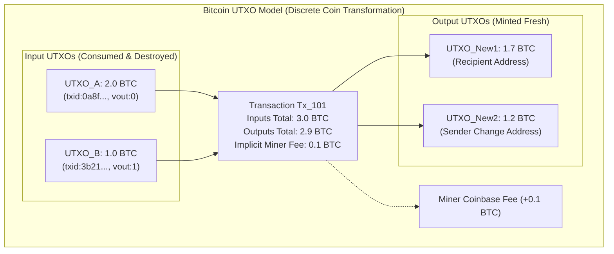
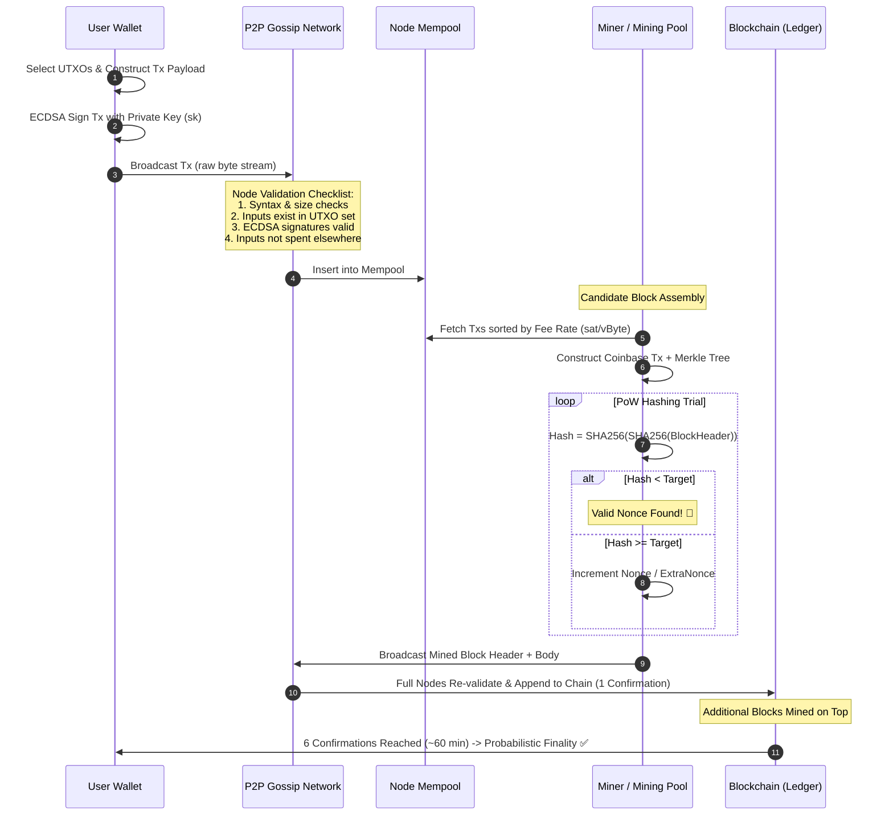
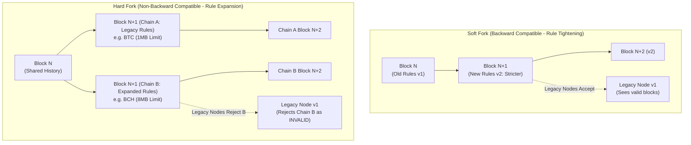
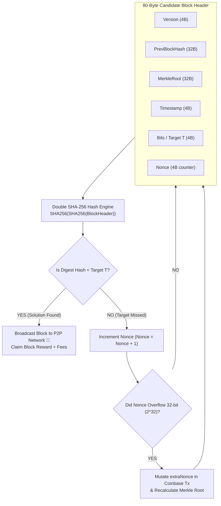
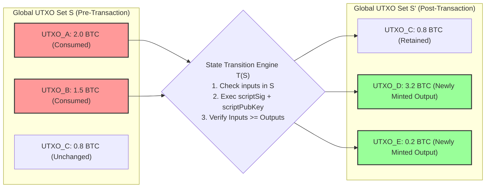
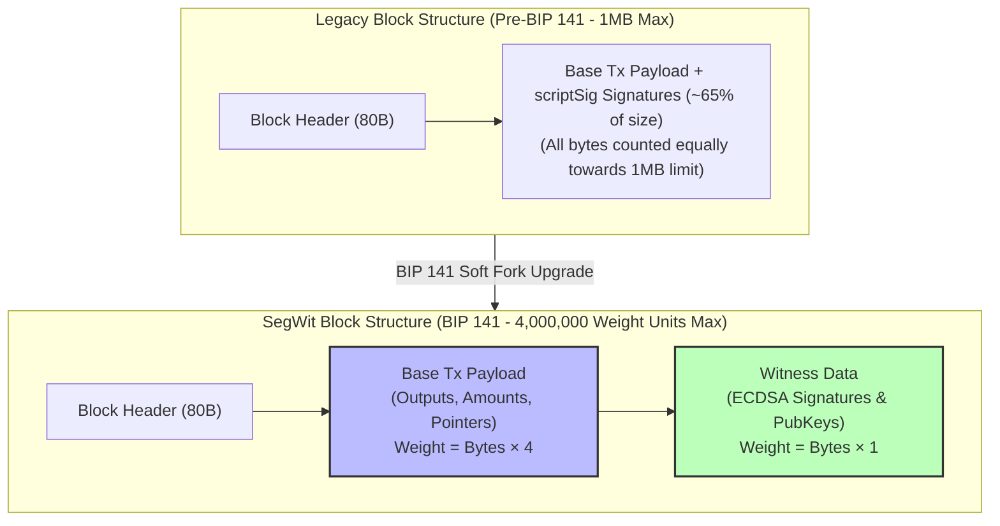

# UNIT 2 — Bitcoin & The Proof-of-Work Era ⛏️

**Syllabus weightage:** 8 hrs / 15% | **Related practicals:** [[P05 — Nonce Mining Difficulty|P05]], [[P06 — Wallets Mnemonic Bip39|P06]]
**Star guide:** ⭐ = likely asked · ⭐⭐ = very likely · ⭐⭐⭐ = practically guaranteed in some form

---

## 🧭 Chapter Roadmap

```
UNIT 2: Bitcoin & Proof-of-Work
├── 2.1 The Bitcoin Protocol
│     ├── 2.1.1 UTXO model vs Account model      ⭐⭐ (every year: define UTXO)
│     └── 2.1.2 Bitcoin wallets: hot vs cold, seed phrases  ⭐
├── 2.2 Mining & Game Theory
│     ├── 2.2.1 Proof of Work & "Difficulty"      ⭐⭐⭐ (7-mark favourite)
│     ├── 2.2.2 Life cycle of a transaction       ⭐⭐⭐ (mempool → block)
│     └── 2.2.3 Mining incentives: rewards & halving  ⭐⭐
└── 2.3 Advanced Consensus
      ├── 2.3.1 Proof of Stake & Slashing         ⭐⭐ (PoW vs PoS = 4-marker staple)
      ├── 2.3.2 PoW vs PoS comparison             ⭐⭐⭐
      └── 2.3.3 The role of forks in consensus    ⭐⭐ (hard vs soft fork)
```

### Learning outcomes — after this unit you can:
- Explain exactly how a Bitcoin transaction travels from wallet → mempool → block → confirmations
- Define UTXO, difficulty, halving, slashing, finality, minting and use each correctly in an answer
- Compare **PoW vs PoS** on energy, security, entry cost and finality (the classic 4-marker)
- Distinguish hard fork vs soft fork and explain why forks exist
- Draw the block-lifecycle / mining flow diagrams that examiners award marks for

---

## 2.1 The Bitcoin Protocol

### 2.1.1 UTXO Model vs Account Model ⭐⭐

> **Short definition (memorize this sentence):** A **UTXO (Unspent Transaction Output)** is a "coin" — an output of a previous transaction that has not yet been spent. Bitcoin has **no account balances**; the network only knows which outputs are unspent.

Bitcoin launched **January 2009** by pseudonymous **Satoshi Nakamoto** (whitepaper published Oct 2008). Supply is hard-capped at **21 million BTC**. One BTC divides down to 10⁻⁸ — the smallest unit is the **satoshi** (`1 BTC = 100,000,000 satoshi`).

Think of UTXOs like **cash bills**:
- You can't spend "half a note" — you pay with whole notes and get **change** back.
- A transaction **consumes** whole UTXOs as *inputs*, and creates fresh UTXOs as *outputs* (recipient + your change).



| Aspect | UTXO (Bitcoin) | Account (Ethereum) |
|---|---|---|
| What is stored | Set of unspent outputs | Account balances + nonce |
| A transaction | Spends old UTXOs, mints new ones | Debits sender, credits receiver |
| Double-spend check | Each UTXO spent exactly once | Nonce prevents replay |
| Privacy | Better — new address per payment | Balances linkable to an address |
| Parallelism | High (independent UTXOs) | Lower (shared state conflicts) |
| Smart-contract friendliness | Harder (scripting is limited) | Native (EVM accounts) |
| Analogy | Cash + change | Bank ledger |

**Exam trick:** If a question asks *"Why is UTXO called unspent?"* — an output is only a UTXO until a transaction spends it; once spent it becomes an input record and is removed from the unspent set.

### 2.1.2 Bitcoin Wallets: Hot vs Cold Storage & Seed Phrases ⭐

A wallet is **a collection of keys** — it never "contains" coins; it contains the *right to spend* them.

| | Hot wallet | Cold wallet |
|---|---|---|
| Keys on | Internet-connected device | Offline device / paper |
| Examples | Exchange apps, MetaMask, mobile wallets | Hardware wallets (Ledger, Trezor), paper |
| Convenience | High — instant transactions | Low — must sign then broadcast |
| Security risk | Exposure to hacks/malware | Much safer (keys never online) |
| Best for | Daily spending, small amounts | Long-term storage of large amounts |

**Seed phrase (BIP39):** A wallet derives all its keys deterministically from a **12 or 24-word seed phrase** (e.g. `abandon … about`). 
- One phrase → one deterministic tree of addresses.
- **Anyone who knows the phrase controls every derived address** — write it on paper, never type it into a website. See [[P06 — Wallets Mnemonic Bip39|P06]] to build one yourself.
- Mnemonic → entropy → `HMAC-SHA512` (passphrase "mnemonic") → 512-bit seed → master key → child keys (BIP32/44 derivation paths).

---

## 2.2 Mining & Game Theory

### 2.2.1 Proof of Work & the Concept of "Difficulty" ⭐⭐⭐

**Mining** is the act of finding a valid block header by brute force. A block header contains the Merkle root, timestamp, previous-hash, version, and a **nonce** the miner can change freely.

```
Goal: find nonce such that
      SHA256( SHA256( block_header ) )  <  Target

Smaller target  ⇒  more leading zeros required  ⇒  exponentially harder
```

- **Difficulty** = how much harder mining is now vs the easiest-ever target.
- The network **re-targets difficulty every 2016 blocks** (~2 weeks) so that blocks arrive roughly every **10 minutes** regardless of total hashrate.
- If miners add machines → blocks arrive faster → difficulty rises; if miners leave → difficulty falls.
- Because hashing is one-way, miners can't "cheat" by predicting a winning nonce — expected work = `Target/2²⁵⁶` hashes. (Try it in [[P05 — Nonce Mining Difficulty|P05]].)

### 2.2.2 The Life Cycle of a Transaction (Mempool → Block) ⭐⭐⭐

This is the single most-asked diagram in UNIT 2. Draw it and label every arrow:



Key exam vocabulary for the mempool stage:
- **Mempool** = the pool of valid-but-unconfirmed transactions every node holds.
- **Fee rate (fee/vByte)** = a tx's priority; miners pack the most profitable txs first.
- **Confirmation** = a block containing your tx has been mined and built upon. 1 confirmation = your tx is in 1 block.
- **Finality** = the point past which a transaction cannot realistically be reversed. Bitcoin's is **probabilistic** (~6 blocks ≈ 1 hour); PoS chains have explicit finality gadgets.
- **Double-spend** = same UTXO spent twice. Nodes drop the second spend; only the first to reach a mined block is valid.

### 2.2.3 Mining Incentives: Block Rewards & Halving ⭐⭐

Why do miners behave honestly instead of attacking? **Because honesty pays more.**

1. **Block reward** — newly minted BTC to the winning miner. Started at 50 BTC; **halved every 210,000 blocks (~4 years):** 50 → 25 (2012) → 12.5 (2016) → 6.25 (2020) → **3.125 (2024)**.
2. **Transaction fees** — the difference between inputs and outputs of every tx they include.
3. **Game theory** — attacking (double-spend / reorg) requires spending electricity on an industrial scale, and succeeds only if the attacker already controls ~50%+ of hashrate. When honest, a miner earns steadily; when attacking, they risk massive sunk cost for a one-time gain.
4. By ~**2140** the block reward hits 0; miners will be paid **only by fees** — the fee market keeps the chain secure.

```
WHY THE HALVING MATTERS (exam-worthy):
supply inflow halved every 4 years → if demand is constant,
the inflation pressure halves → historically coincides with price
appreciation. Also: 21M cap ≈ 2140, enforced purely by code.
```

---

## 2.3 Advanced Consensus Mechanisms

### 2.3.1 Proof of Stake (PoS) — Energy Efficiency & "Slashing" ⭐⭐

PoS replaces *electricity* with *capital at risk*:

- **Validators** lock (stake) tokens — Ethereum requires **32 ETH** per validator.
- A validator is selected **pseudorandomly, weighted by stake** to propose the next block; a committee **attests** (votes) on it.
- **Slashing** = economic punishment. If a validator signs conflicting blocks (equivocation) or mis-attests, a proof of the misbehaviour is submitted and part of their stake is **burned**.
- Because an attacker must control ≥50% of staked ETH, the attack cost equals buying half the network — and a successful attack destroys the value of the very tokens they stole. **The attack becomes economically self-defeating.**

Ethereum switched from PoW to PoS in **The Merge (Sept 2022)**, cutting its energy use by ~99.95%.

### 2.3.2 Comparison: PoW vs PoS ⭐⭐⭐

This table **is** the 4-mark answer. Learn it as two-column facts, not prose.

| Criterion | Proof of Work (Bitcoin) | Proof of Stake (Ethereum) |
|---|---|---|
| Resource spent | Electricity + ASICs | Staked tokens (ETH) |
| Security bound | Majority of hashrate | Majority of staked value |
| Energy consumption | Very high | Very low (≈99% less) |
| Entry cost | Buy ASIC hardware | 32 ETH minimum validator |
| Penalty for cheating | Sunk energy (already wasted) | Slashing — stake burned |
| Block proposer | First miner to solve | Randomly chosen validator |
| Finality | Probabilistic (~6 blocks) | Explicit finality (fast, near-instant) |
| "Nothing at stake" problem | Not applicable | Historically debated; solved by slashing |
| Decentralization pressure | Mining-pool centralization | Large-staker centralization |

### 2.3.3 The Role of Forks in Consensus ⭐⭐

A **fork** = a divergence in the chain. Two flavours:

| | Soft fork | Hard fork |
|---|---|---|
| Compatibility | Backward-compatible — old nodes still accept new blocks | Not backward-compatible — chain splits |
| Who must upgrade | Only miners/producers | Everyone (miners + users) |
| Example | SegWit (2017) tightened block rules | Bitcoin Cash (2017), Ethereum Classic (2016, after the DAO hack) |
| Result | One chain, old nodes work | Two separate chains + two coins |

- **Accidental fork:** two miners solve at the same height → network converges on the longest chain; the loser's block is **orphaned**.
- **Planned hard fork:** a community rule change (bigger blocks, fix a hack) that old software can't follow → the chain splits; holders of the original coin usually receive the new coin 1:1.
- Exam line: *"A hard fork is a permanent divergence; a soft fork is a tightening of rules old nodes can still obey."*



---

## 🧠 Deep-Dive Topics

### Deep Dive A: Mempool → block, minute by minute
1. Wallet builds the tx: inputs = your UTXOs; outputs = recipient + change; fee = `inputs − outputs`.
2. Nodes verify: signatures valid? inputs unspent? → passes → enters **mempool**.
3. Miners rank mempool by **fee/vByte** and fill a candidate block (~1 MB, ~2–3k tx).
4. PoW loop: `nonce++` until `SHA256(SHA256(header)) < target`.
5. Winner broadcasts the block; every peer **re-validates each tx** before relaying.
6. Confirmation depth grows as new blocks stack on top. At 6 blocks (~1 hr) a reorg is practically impossible — this is Bitcoin's "finality".

### Deep Dive B: 51% attack — what an attacker actually can and cannot do
- To rewrite history, an attacker re-mines the target block **plus every following block** while the honest network mines too — a race they must win over and over.
- With ~51% hashrate they eventually win the race → **double-spend** their own coins (spend, get goods, then orphan the spend).
- **They cannot** forge signatures, spend others' coins, or create coins out of thin air — because signatures are unforgeable and supply is capped by consensus.
- Cost: huge electricity + lost block rewards during the attack + destroyed market confidence.

### Deep Dive C: Halving math (a 3-marker hidden in a 7-marker)
- `210,000 blocks × 10 min ≈ 4 years` per cycle.
- Cumulative supply after n halvings: `21M × (1 − 0.5ⁿ)` (only ~94% mined so far; remaining tail drags to ~2140).
- Mining is a **business**: revenue = `block reward + fees`, cost = electricity + hardware amortization. Miners break even at `breakeven_price = cost / BTC_mined`.

### Deep Dive D: Why slashing fixes "nothing at stake"
In pure PoS, a validator could theoretically vote on **every** competing chain for free ("nothing at stake") → no convergence. Slashing makes it **economically fatal** to vote on the wrong chain, so rational validators only vote on the one true chain. This is the same game-theoretic trick PoW does with energy — PoS does it with collateral.

---

## 🚀 Beyond the Textbook (what most classes won't tell you)

- **Difficulty ≠ complexity.** The network *wants* ~10-min blocks; difficulty is just the feedback knob. If the hashrate doubled today, difficulty roughly doubles within 2 weeks.
- **The 21M cap is not "hard-coded" everywhere** — it emerges from the halving rule (`50 → 25 → …`), which is the real consensus rule.
- **A seed phrase is a password to a whole tree of addresses.** Losing it = losing every address derived from it; no support ticket can help.
- **"Confirmations" is a trust threshold, not a rule.** 6 is convention (probability of double-spend success drops below ~0.1%). Exchanges pick their own (some use 3 for small txs).
- **Mining pools ≠ miners.** Most individual miners join pools; the pool operator constructs the block — a *de facto* centralization point Satoshi didn't foresee.

---

## 📝 PYQ Map — UNIT 2 (all available papers)

| Paper | Q. | Topic | Marks |
|---|---|---|---|
| **Winter 2024** | Q.3(a) | Short note: Consensus Mechanism | 3 |
| | Q.3(b) | Compare Hard Fork vs Soft Fork | 4 |
| | Q.3(c) | What is PoW? How does it work? | 7 |
| | Q.3(a)-alt | Short note: Block Rewards | 3 |
| | Q.3(b)-alt | 51% attack — what & how it works | 4 |
| | Q.3(c)-alt | What is PoS? How does it work? | 7 |
| | Q.5(a) | Short note: Bitcoin Scripting | 3 |
| | Q.5(a)-alt | Short note: Bitcoin Mining | 3 |
| **Summer 2025** | Q.3(a) | Define Consensus Mechanism, explain any one | 3 |
| | Q.3(b) | Why is forking needed? Types of forks | 4 |
| | Q.3(c) | Explain bitcoin mining (working, difficulty, benefits) | 7 |
| | Q.3(a)-alt | Differentiate soft fork vs hard fork | 3 |
| | Q.3(b)-alt | Importance of Finality in blockchain | 4 |
| | Q.3(c)-alt | Short note: 51% attack | 7 |
| | Q.5(a) | List & explain cryptocurrency wallets | 3 |
| **Summer 2026** | Q.3(a) | Explain "mining" wrt blockchain | 3 |
| | Q.3(b) | Differentiate PoW and PoS | 4 |
| | Q.3(c) | Consensus mechanisms — list & explain | 7 |
| | Q.3(a)-alt | Explain "minting" wrt blockchain | 3 |
| | Q.3(b)-alt | Differentiate soft vs hard fork | 4 |
| | Q.3(c)-alt | 51% attack wrt blockchain | 7 |
| **Winter 2025** | Q.3(a) | Define consensus; list consensus algorithms | 3 |
| | Q.3(b) | Explain Sybil attack with example | 4 |
| | Q.3(c) | Explain PoS in detail | 7 |
| | Q.3(a)-alt | Role of bitcoin miners | 3 |
| | Q.3(b)-alt | 51% attack with example | 4 |
| | Q.3(c)-alt | Explain PoW in detail | 7 |
| **Summer 2024** | Q.3(a) | Define "Confirmation" and "Finality" | 3 |
| | Q.3(b) | Differentiate PoW and PoS | 4 |
| | Q.3(c) | Explain 51% attack | 7 |
| | Q.3(a)-alt | Define "Hard fork" and "Soft fork" | 3 |
| | Q.3(b)-alt | List consensus types; explain any one | 4 |
| | Q.3(c)-alt | Explain Sybil attack | 7 |
| | Q.2(b)-alt | Types of wallets + factors for selecting a wallet | 4 |

### ✅ Solved PYQ answers (UNIT 2)

**W25 Q.3(b) — Explain Sybil attack with example (4 marks).**
> A **Sybil attack** is when a single attacker creates **many fake identities (nodes)** to gain disproportionate influence over a peer-to-peer network, pretending to be many independent participants. Since blockchain relies on distributed nodes for consensus, a Sybil attacker who floods the network with thousands of malicious nodes can:
> - Isolate honest nodes and control which data they receive (censorship),
> - Surround a victim so their transactions only pass through attacker-controlled nodes,
> - Block the propagation of blocks/transactions.
> **Example:** In a decentralized network where each node gets one vote, an attacker creates 10,000 fake nodes to win most votes. Bitcoin resists Sybil attacks not by identity checks but by **proof-of-work** — creating fake nodes costs nothing, but creating fake *hash power* costs real electricity. So Sybil resistance in Bitcoin = economic cost per unit of influence.

**S25 Q.3(c) — Explain bitcoin mining in detail (7 marks).**
> Bitcoin mining is the process of adding new blocks to the blockchain by solving a computational puzzle, called **Proof of Work**. **Working:** miners group valid transactions from the mempool into a candidate block. Each miner then repeatedly changes the block header's **nonce** and hashes it (`SHA256(SHA256(header))`) until the resulting hash is **less than the current target**. The target is chosen so that on average **one block is found every 10 minutes**. When a miner finds a valid nonce, they broadcast the block; every node verifies the hash and the transactions before adding it to the chain, and miners begin mining on top of it. **Difficulty:** the target is adjusted every **2016 blocks (~2 weeks)** to keep block time near 10 minutes as the total hashrate rises or falls. More hashrate → smaller target (harder). **Benefits/security:** mining enforces consensus (everyone agrees on one canonical chain), secures against double-spending (rewriting history requires redoing the PoW work), resists Sybil attacks (influence costs electricity, not fake identities), and **incentivizes honest behaviour** through the block reward and transaction fees — attacking would be economically irrational because it costs more than it can earn.

**S26 Q.3(a)-alt — Explain "minting" wrt blockchain (3 marks).**
> **Minting** is the process of creating new coins/tokens directly on-chain. In **Proof of Stake** systems, minting (also called *forging*) replaces PoW mining: validators lock (stake) their tokens and are pseudorandomly chosen — weighted by the size of their stake — to validate a block and, in return, **receive newly created coins and transaction fees**. Unlike mining, minting consumes almost no electricity because no computational puzzle is solved; security comes instead from the economic stake the validator risks being **slashed** if they misbehave. Minting is also used to create NFTs: *minting an NFT* means writing its unique metadata onto the blockchain so it becomes an owned, tradeable token.

**S26 Q.3(b) — Differentiate PoW and PoS (4 marks).**
> 1. **Resource used:** PoW spends electricity/computational power; PoS locks up staked tokens (capital).
> 2. **Block proposer selection:** In PoW the first miner to find a valid hash wins; in PoS a validator is selected pseudorandomly, weighted by stake.
> 3. **Security basis:** PoW is secure while no entity controls 51% of hashrate; PoS is secure while no entity controls 51% of staked value.
> 4. **Energy:** PoW consumes very high energy; PoS uses ≈99% less, making it far more eco-friendly.
> 5. **Penalty for misbehaviour:** PoW loses wasted electricity; PoS loses part of the stake through **slashing**.
> 6. **Finality:** PoW finality is probabilistic (~6 blocks); PoS can achieve faster, explicit finality. Examples: Bitcoin uses PoW; Ethereum (post-Merge, 2022) uses PoS.

**S25 Q.3(b)-alt — Importance of Finality (4 marks).**
> **Finality** is the guarantee that a transaction, once confirmed, will never be reversed or altered. Its importance in blockchain:
> 1. **Prevents double-spending** — after finality, the same coins cannot be re-spent, so merchants can safely release goods/services.
> 2. **Economic settlement** — payments (especially large ones) need certainty; without finality no business would accept crypto as payment.
> 3. **Protects against chain reorgs/51% attacks** — finality marks the point beyond which rewriting history becomes impractical.
> 4. **Defines the trust model** — Bitcoin gives *probabilistic finality* (deeper confirmations → higher certainty, conventionally 6 blocks ≈ 1 hour), while PoS chains (e.g. Ethereum's Casper) provide *explicit/economic finality* almost immediately. A system without finality cannot serve as a reliable ledger or store of value.

**S24 Q.3(b) — Differentiate PoW and PoS (4 marks)** — see solved S26 Q.3(b) above (same skill, reuse the six-point table).

---

## ✍️ Practice Problems (self-test — answers upside-down)

1. (3) Define UTXO. Why does the "U" in UTXO matter to double-spend prevention?
2. (4) Compare hot and cold wallets. Which one would you use for your life savings and why?
3. (7) With a diagram, explain the life cycle of a bitcoin transaction from signing to finality.
4. (4) A network's hashrate triples. What happens to difficulty and average block time over the next few weeks?
5. (3) What is the block reward in 2026? When does the next halving occur (≈)?
6. (7) "PoS secures the chain with slashing instead of electricity." Justify.
7. (3) Differentiate Confirmation vs Finality.
8. (4) Why would a 51% attacker still be unable to steal other users' bitcoins?

<details>
<summary>**Click for answers**</summary>

1. UTXO = Unspent Transaction Output, an output of a prior tx not yet spent. It can be spent exactly once; the "unspent" flag is what the network tracks, so a second spend of the same output is immediately invalid.
2. Cold (hardware/paper) — keys never touch the internet, so they survive malware/hacks; hot wallets are only for small day-to-day amounts.
3. See Deep Dive A + the mempool→block diagram: sign → broadcast → validate → mempool → fee-ranked mining → PoW → broadcast/verify → confirmations → probabilistic finality.
4. Blocks arrive ~3× faster → difficulty rises at the next 2016-block retarget (~1/3 of 2 weeks) → block time returns to ~10 min.
5. 3.125 BTC (halved April 2024). Next halving ≈ 2028 (block 1,050,000).
6. Validators stake real tokens; equivocation/mis-attesting triggers slashing (burned stake). Attack cost = 51% of staked value, and success destroys the stolen tokens' value — economically self-defeating.
7. Confirmation = tx is included in a block (and blocks stacked on it); Finality = point beyond which reversal is practically/technically impossible.
8. Signatures are unforgeable — attackers can only reorder their *own* spends (double-spend), never forge a spend of someone else's coins.

</details>

---

## 📖 Glossary of Key Terms

| Term | One-line meaning |
|---|---|
| UTXO | Unspent Transaction Output — a spendable "coin" |
| Mempool | Pool of valid, unconfirmed transactions |
| Nonce | Number a miner varies to change the header hash |
| Target / Difficulty | Threshold the block hash must beat / how hard that is now |
| Block reward | Newly minted BTC given to the winning miner |
| Halving | Reward cut by 50% every 210,000 blocks (~4 years) |
| Confirmation | One block built on top of your tx |
| Finality | Point past which a tx can't realistically be reversed |
| Double-spend | Spending the same UTXO twice |
| Orphan block | Valid block that lost the longest-chain race |
| Staking | Locking tokens as validator collateral |
| Slashing | Burning a validator's stake for misbehaviour |
| Hard fork | Non-backward-compatible split creating two chains |
| Soft fork | Backward-compatible tightening of rules |
| Sybil attack | One attacker impersonating many nodes |
| Minting | Creating coins/validating blocks in PoS |

---

## 🔗 Curated Resources (per concept)

- **UTXO & transactions:** *Mastering Bitcoin* (Andreas Antonopoulos) Ch. 5–6; https://mempool.space (watch a live tx enter the mempool)
- **Mining & difficulty:** *Mastering Bitcoin* Ch. 8; https://bitcoin.org/bitcoin.pdf §4–5
- **Halving history:** https://bitcoin.halving.help (all four halvings)
- **PoS & The Merge:** https://ethereum.org/en/developers/docs/consensus-mechanisms/pos/
- **Forks:** *Mastering Bitcoin* Ch. 10; https://www.investopedia.com/terms/h/hard-fork.asp
- **51% attack (real case):** Ethereum Classic 51% attacks 2020 — Bitcoin Magazine coverage

---

## 🎥 Video Study Guide (YouTube)

> Your video path for the whole unit — exact keywords to search (links rot, keywords don't) + channels you can trust.

### 🧑‍🎓 Step 0 — Pick your learning style

| Style | You learn best by | Your path through this unit |
|---|---|---|
| 🎧 **Listener** | short, clear explainers | 1 explainer per topic in the table below |
| 🛠️ **Builder** | writing code yourself | Watch the build-along → run [[P05 — Nonce Mining Difficulty|P05]] & [[P06 — Wallets Mnemonic Bip39|P06]], then break them |
| 🔧 **Tinkerer** | experimenting & demos | Watch demo videos → change the difficulty/halving constants in P05 and watch blocks slow/speed |
| 🧠 **Deep Diver** | full theory, "why" | Playlists at the bottom (university-level depth) |
| 🧭 **Explorer** | breadth & curiosity | Classic "how bitcoin works" explainers first |
| 🎓 **Academic** | exam marks | Watch revision videos → grind the PYQ map above |

### 🎬 Step 1 — Watch by topic (search these on YouTube)

| Topic | YouTube search keywords (copy-paste ready) | Best channels | Style served |
|---|---|---|---|
| What is bitcoin (overview) | `what is bitcoin explained simply` · `how bitcoin works 5 minutes` | Simply Explained, 3Blue1Brown | 🧭 Explorer |
| UTXO model | `utxo vs account model` · `what is utxo bitcoin` · `bitcoin unspent transaction outputs` | Bitcoin Dev, Blockgeeks | 🎧 + 🎓 |
| Wallets & seed phrases | `how bitcoin wallets work` · `bip39 seed phrase explained` · `hot vs cold wallet` | Andreas Antonopoulos, Simply Explained | 🎓 Academic |
| Mining & difficulty | `bitcoin mining explained` · `proof of work explained` · `bitcoin difficulty explained` | Computerphile, 3Blue1Brown, Fireship | 🧠 Deep Diver |
| Mempool → block | `bitcoin mempool explained` · `how a bitcoin transaction is confirmed` · `fee rate priority mempool` | Coin Bureau, Bitcoin Dev | 🧭 + 🎧 |
| Halving economics | `bitcoin halving explained` · `why bitcoin halving matters` · `bitcoin halving history` | Coin Bureau, Real Vision | 🎓 Academic |
| Build your own (hands-on) | `build a blockchain in python` · `bitcoin from scratch python code` · `proof of work python implementation` | freeCodeCamp, build-along devs | 🛠️ Builder |
| PoS & slashing | `proof of stake explained` · `what is slashing ethereum` · `ethereum merge how it works` | Finematics, Simply Explained, Coin Bureau | 🧠 + 🎧 |
| PoW vs PoS | `proof of work vs proof of stake` · `pow vs pos which is better` | Finematics, Coin Bureau | 🎓 Academic |
| 51% attack & Sybil | `51 percent attack explained` · `sybil attack explained with example` · `how to double spend bitcoin` | Computerphile, Simply Explained | 🧠 Deep Diver |
| Forks | `hard fork vs soft fork bitcoin` · `bitcoin cash fork explained` · `what is a fork in blockchain` | Simply Explained, Blockgeeks | 🎓 Academic |
| Whole-unit revision | `bitcoin and proof of work full lecture` · `cryptocurrency basics full course` · `bitcoin mining exam revision` | MIT OCW, freeCodeCamp, Gate Smashers, Neso Academy | 🎓 Academic |

### 🎬 Step 2 — Full playlists (for Deep Divers & Academics)

1. **"MIT 15.S12 Blockchain and Money"** — the Bitcoin & money lectures are the definitive treatment of this unit.
2. **"Andreas Antonopoulos — Bitcoin overview & technical deep dives"** — best developer-grade intuition for UTXOs, mining, and keys.
3. **"3Blue1Brown — But how does Bitcoin actually work?"** (single video) — the one video that makes PoW click.

### 🎬 Step 3 — Proof you got it (5 min)

- Run [[P05 — Nonce Mining Difficulty|P05]], crank the difficulty up, and watch the mining time explode — that's the 10-minute-block idea in miniature.
- Re-draw the mempool → block → confirmations diagram from memory.
- Explain to a friend why a 51% attacker can double-spend *their own* coins but can't steal yours.

---

*Next: [[Unit 3 — Ethereum and Smart Contracts|UNIT 3 — Ethereum & Smart Contracts]]*

---


---

## 📖 Historical Context & Motivation

The inception of Bitcoin in 2008 emerged against the backdrop of the global financial crisis, which exposed structural vulnerabilities in modern fractional-reserve banking and centralized monetary authorities. Prior digital currency initiatives—such as David Chaum’s DigiCash (1989), Adam Back’s Hashcash (1997), Wei Dai’s *b-money* (1998), and Nick Szabo’s *Bit Gold* (1998)—pioneered fundamental concepts like blind signatures, cryptographic proof-of-work, and decentralized accounting. However, each system faltered on a critical bottleneck: the inability to achieve distributed consensus over transaction ordering without relying on a centralized clearing authority or exposing the network to Sybil identities.

Satoshi Nakamoto resolved this decade-old impasse by unifying peer-to-peer gossip networking, asymmetric public-key cryptography, and an incentive-compatible Proof-of-Work (PoW) consensus engine known as Nakamoto Consensus. Nakamoto linked ledger finality to physical thermodynamics: miners must expend unforgeable computational work (energy) to alter history, converting electrical power into economic security. Crucially, Nakamoto rejected traditional account-based balances in favor of an **Unspent Transaction Output (UTXO)** architecture modeled after physical banknotes. By treating currency as discrete cryptographic objects that are completely consumed and reminted in atomic state transitions, Bitcoin eliminated double-spending and established the world's first permissionless, trustless monetary network.

---

## 🔬 Deep Dive: System Architecture

### Nakamoto Consensus Mechanics, Difficulty Retargeting, and UTXO State Graphs

Bitcoin’s architecture is driven by three interconnected components: the Proof-of-Work trial engine, the automated difficulty adjustment algorithm (DAA), and the global UTXO state transition function.

#### 1. Proof-of-Work Engine and Mining Probability Model
A candidate block header $\mathcal{B}$ consists of six fixed fields:
$$\mathcal{B} = \langle \text{Version}, \text{HashPrevBlock}, \text{HashMerkleRoot}, \text{Time}, \text{Bits}, \text{Nonce} \rangle$$
Totaling 80 bytes. To mine a valid block, a miner must discover a 32-bit `Nonce` (and potentially mutate the extraNonce in the coinbase transaction) such that:
$$H(\mathcal{B}) = \text{SHA256}(\text{SHA256}(\mathcal{B})) < \mathcal{T}$$
where $\mathcal{T}$ is a 256-bit unsigned integer target extracted from the compact 32-bit `Bits` header field.



The probability $p$ of any single hash trial satisfying the target inequality is:
$$p = \frac{\mathcal{T}}{2^{256}}$$

Let $\mathcal{H}$ denote the aggregate network hashrate (hashes per second). Mining behaves as a continuous-time Poisson process with arrival rate parameter:
$$\lambda = \frac{\mathcal{H} \cdot \mathcal{T}}{2^{256}}$$

The probability $P$ of finding at least one valid block within time interval $\Delta t$ follows the exponential distribution:
$$P(T \le \Delta t) = 1 - e^{-\lambda \Delta t}$$

To enforce a mean block inter-arrival time of $\mathbb{E}[\Delta t] = 600\text{ seconds}$ (10 minutes), the network dynamically adjusts target $\mathcal{T}$.

#### 2. Difficulty Adjustment Algorithm (DAA) Mathematics
Every $\Delta N = 2016$ blocks (an epoch of approximately 14 days), every full node independently updates the target:
$$\mathcal{T}_{\text{new}} = \mathcal{T}_{\text{old}} \times \frac{\sum_{i=1}^{2016} \Delta t_i}{2016 \times 600}$$
where $\sum \Delta t_i = t_{2016} - t_0$ is the actual wall-clock elapsed time measured by block timestamps between the first and last block of the epoch.

To prevent instability caused by extreme hashrate fluctuations, a boundary clamping factor of $4$ is strictly enforced:
$$\mathcal{T}_{\text{new}} \in \left[ \frac{1}{4}\mathcal{T}_{\text{old}}, \, 4\mathcal{T}_{\text{old}} \right]$$

#### 3. UTXO State Transition Function
The global state $\mathcal{S}$ of the Bitcoin blockchain is formally defined as the set of all active Unspent Transaction Outputs:
$$\mathcal{S} = \{ \text{UTXO}_1, \text{UTXO}_2, \dots, \text{UTXO}_k \}$$
where each $\text{UTXO}_i = \langle \text{TxID}, \text{vout}, \text{Value}, \text{scriptPubKey} \rangle$.

A transaction $T$ transitions state $\mathcal{S}$ to $\mathcal{S}'$ via transformation $T(\mathcal{S}) \to \mathcal{S}'$:
1. **Input Validation**: $T$ specifies inputs $\mathbf{I} = \{ \text{in}_1, \dots, \text{in}_m \}$. For each $\text{in}_j$, the node verifies $\text{in}_j \in \mathcal{S}$. If any input is missing from $\mathcal{S}$, the transaction is rejected as a double-spend.
2. **Script Execution**: For each input, the node executes $\text{scriptSig} \parallel \text{scriptPubKey}$ on a stack machine. Evaluation must return `TRUE` without execution errors.
3. **Value Conservation**:
   $$\sum_{j=1}^m \text{Value}(\text{in}_j) \ge \sum_{l=1}^n \text{Value}(\text{out}_l)$$
   The explicit difference defines the implicit miner transaction fee $F = \sum \text{Value}(\text{in}) - \sum \text{Value}(\text{out})$.
4. **State Mutation**:
   $$\mathcal{S}' = (\mathcal{S} \setminus \mathbf{I}) \cup \mathbf{O}$$



#### 4. Fork Choice & Heavy-Chain Rule
If two miners discover valid blocks at the same height, a temporary fork occurs. Nakamoto consensus resolves forks by requiring all nodes to select the chain containing the highest **Cumulative Chainwork** $W$, defined as:
$$W = \sum_{i=1}^H \frac{2^{256}}{\mathcal{T}_i + 1}$$
Nodes track block headers and automatically perform a chain reorganization (reorg) if an alternate valid chain accumulates greater work $W$.

---

## 🏢 Real-World Case Study

### The Segregated Witness (SegWit, BIP 141) Upgrade and the Bitcoin Cash Hard Fork

In 2017, Bitcoin faced a severe scalability bottleneck. The protocol’s hard-coded 1 megabyte maximum block size limit capped throughput at approximately 3 to 7 transactions per second (TPS). As adoption surged, mempools overflowed, driving transaction fees above $50 per transfer.



#### The Technical Solution: BIP 141 (Segregated Witness)
Core developers proposed **Segregated Witness (SegWit)** as a soft fork. SegWit separated signature script data (`scriptSig`) from the transaction base payload into a distinct `witness` structure appended at the end of the block.
- **Transaction Malleability Fix**: Because signatures were removed from the transaction hash calculation (`txid`), third parties could no longer alter non-essential signature bits to change a pending transaction's ID. This enabled zero-risk Layer-2 payment channels (the Lightning Network).
- **Block Weight Accounting**: SegWit introduced Block Weight Units ($\text{WU}$). Base transaction data was weighted at 4 units per byte, while witness data was weighted at 1 unit per byte:
  $$\text{Block Weight} = (\text{Base Bytes} \times 4) + (\text{Witness Bytes} \times 1) \le 4,000,000 \text{ WU}$$
  This effectively expanded block capacity to $\approx 2.2 \text{ MB}$ equivalent without breaking legacy node verification rules (soft-fork compatibility).

#### The Ideological & Protocol Split: Bitcoin Cash (BCH)
A faction of miners and enterprise operators rejected SegWit, advocating instead for scaling Layer-1 directly by increasing the base block size parameter. On August 1, 2017, this group executed a non-backward-compatible **Hard Fork**, creating **Bitcoin Cash (BCH)** with an initial 8 MB (later 32 MB) block limit. Because BCH modified base block validation rules, legacy nodes rejected BCH blocks as invalid, resulting in two permanently independent blockchains sharing a identical pre-fork UTXO history.

---

## 📝 End-of-Chapter Exercises

### Exercise 1: Difficulty Adjustment & Epoch Retargeting
At block height $840,000$, a major technological breakthrough doubles global hashrate overnight from $\mathcal{H}_0 = 300\text{ EH/s}$ to $\mathcal{H}_1 = 600\text{ EH/s}$ ($1\text{ EH/s} = 10^{18}\text{ hashes/sec}$).
1. Calculate the actual elapsed time (in days and hours) required to mine the 2,016 blocks of this retargeting epoch under the new hashrate $\mathcal{H}_1$.
2. Calculate the exact target adjustment ratio $\frac{\mathcal{T}_{\text{new}}}{\mathcal{T}_{\text{old}}}$ computed by the network DAA at block height $842,016$.
3. Compute the expected average block arrival time immediately following the retarget boundary.

### Exercise 2: SegWit Virtual Byte (vByte) & Transaction Fee Calculation
A user constructs a Native SegWit (P2WPKH) transaction consuming 2 inputs and creating 2 outputs.
- Base transaction payload size (version, input pointers, outputs, locktime) = $210\text{ bytes}$.
- Witness payload size (signatures and public keys) = $140\text{ bytes}$.

1. Calculate the total **Block Weight** in Weight Units ($\text{WU}$) for this transaction.
2. Calculate the transaction size in **Virtual Bytes** ($\text{vBytes}$), defined as $\text{vSize} = \left\lceil \frac{\text{Weight}}{4} \right\rceil$.
3. If the prevailing mempool fee rate is $35\text{ sat/vByte}$, calculate the absolute fee in satoshis and in BTC ($1\text{ BTC} = 10^8\text{ satoshis}$). Compare this fee to what a legacy non-SegWit transaction of $350\text{ bytes}$ would pay at the same fee rate.

### Exercise 3: Nakamoto 51% Attack Probability Derivation
An attacker possessing a fraction $q = 0.35$ of total network hashrate attempts to double-spend a merchant who requires $z = 6$ confirmations ($p = 1 - q = 0.65$).

Nakamoto modeled the attacker’s probability of successfully catching up from $z$ blocks behind using the Poisson distribution formula:
$$P = 1 - \sum_{k=0}^{\infty} \frac{\lambda^k e^{-\lambda}}{k!} \left(1 - \left(\frac{q}{p}\right)^{\max(z-k, 0)}\right) \quad \text{where } \lambda = z \frac{q}{p}$$

1. Compute the expected progress parameter $\lambda$.
2. Calculate the numerical probability $P$ that the attacker successfully overrides the 6-block chain.
3. Determine the minimum number of confirmations $z'$ the merchant must demand to reduce the attacker’s success probability below $1\%$.

### Exercise 4: PoW vs. PoS Economic Security & Slashing Mechanics
Compare the capital cost of attacking Bitcoin (PoW) versus Ethereum (PoS).
1. Suppose Bitcoin’s hashrate is $500\text{ EH/s}$. If an ASIC miner delivers $100\text{ TH/s}$ at a cost of $\$1,500$ per unit, calculate the hardware capital expenditure ($\text{CapEx}$) required to command $51\%$ of global hashrate.
2. Suppose Ethereum has $32,000,000\text{ ETH}$ total active stake. At an ETH price of $\$3,000$, calculate the capital required to acquire $51\%$ of total stake.
3. Explain why Casper FFG's **slashing protocol** (slashing up to $100\%$ of staked ETH and permanently ejecting the validator node upon double-signing) fundamentally alters the economic cost of an attack relative to PoW, where an attacker retains their ASIC hardware after a failed reorg attempt.

## ⚡ Quick Revision

> [!abstract]+ One-page summary — review this before the exam

> - **The Bitcoin Protocol**
>   - **UTXO Model vs Account Model**
>   - **Bitcoin Wallets: Hot vs Cold Storage & Seed Phrases**
> - **Mining & Game Theory**
>   - **Proof of Work & the Concept of "Difficulty"**
>   - **The Life Cycle of a Transaction (Mempool → Block)**
>   - **Mining Incentives: Block Rewards & Halving**
> - **Advanced Consensus Mechanisms**
>   - **Proof of Stake (PoS) — Energy Efficiency & "Slashing"**
>   - **Comparison: PoW vs PoS**
>   - **The Role of Forks in Consensus**
> - **Deep-Dive Topics**
>   - **Deep Dive A: Mempool → block, minute by minute**
>   - **Deep Dive B: 51% attack — what an attacker actually can and cannot do**
>   - **Deep Dive C: Halving math (a 3-marker hidden in a 7-marker)**
>   - **Deep Dive D: Why slashing fixes "nothing at stake"**
> - **🚀 Beyond the Textbook (what most classes won't tell you)**
> - **✍ Practice Problems (self-test — answers upside-down)**

### 📌 Key Definitions

- **cash bills** — - You can't spend "half a note" — you pay with whole notes and get **change** back.
- **a collection of keys** — it never "contains" coins; it contains the *right to spend* them.
- **Block reward** — newly minted BTC to the winning miner. Started at 50 BTC; **halved every 210,000 blocks (~4 years):** 50 → 25 (2012) → 12.5 (2016) → 6.25 (2020) → **3.125 (2024)**.
- **Transaction fees** — the difference between inputs and outputs of every tx they include.
- **Game theory** — attacking (double-spend / reorg) requires spending electricity on an industrial scale, and succeeds only if the attacker already controls ~50%+ of hashrate. When honest, a miner earns steadily; when attacking, they risk massive sunk cost for a one-time gain.
- **only by fees** — the fee market keeps the chain secure.
- **business** — revenue = `block reward + fees`, cost = electricity + hardware amortization. Miners break even at `breakeven_price = cost / BTC_mined`.
- **The 21M cap is not "hard-coded" everywhere** — it emerges from the halving rule (`50 → 25 → …`), which is the real consensus rule.
- **proof-of-work** — creating fake nodes costs nothing, but creating fake *hash power* costs real electricity. So Sybil resistance in Bitcoin = economic cost per unit of influence.
- **Prevents double-spending** — after finality, the same coins cannot be re-spent, so merchants can safely release goods/services.
- **Economic settlement** — payments (especially large ones) need certainty; without finality no business would accept crypto as payment.
- **Protects against chain reorgs/51% attacks** — finality marks the point beyond which rewriting history becomes impractical.
- **Defines the trust model** — Bitcoin gives *probabilistic finality* (deeper confirmations → higher certainty, conventionally 6 blocks ≈ 1 hour), while PoS chains (e.g. Ethereum's Casper) provide *explicit/economic finality* almost immediately. A system without finality cannot serve as a reliable ledger or store of value.
- **S24 Q.3(b) — Differentiate PoW and PoS (4 marks)** — see solved S26 Q.3(b) above (same skill, reuse the six-point table).
- **"MIT 15.S12 Blockchain and Money"** — the Bitcoin & money lectures are the definitive treatment of this unit.

---

## 🧠 Active Recall

*Test yourself — click a question to reveal the answer. Try to answer BEFORE peeking!*

> [!question]- Q1: Define **cash bills**.
> - You can't spend "half a note" — you pay with whole notes and get **change** back.

> [!question]- Q2: Define **a collection of keys**.
> it never "contains" coins; it contains the *right to spend* them.

> [!question]- Q3: Define **Block reward**.
> newly minted BTC to the winning miner. Started at 50 BTC; **halved every 210,000 blocks (~4 years):** 50 → 25 (2012) → 12.5 (2016) → 6.25 (2020) → **3.125 (2024)**.

> [!question]- Q4: Define **Transaction fees**.
> the difference between inputs and outputs of every tx they include.

> [!question]- Q5: Define **Game theory**.
> attacking (double-spend / reorg) requires spending electricity on an industrial scale, and succeeds only if the attacker already controls ~50%+ of hashrate. When honest, a miner earns steadily; when attacking, they risk massive sunk cost for a one-time gain.

> [!question]- Q6: Define **only by fees**.
> the fee market keeps the chain secure.

> [!question]- Q7: Define **business**.
> revenue = `block reward + fees`, cost = electricity + hardware amortization. Miners break even at `breakeven_price = cost / BTC_mined`.

> [!question]- Q8: Define **The 21M cap is not "hard-coded" everywhere**.
> it emerges from the halving rule (`50 → 25 → …`), which is the real consensus rule.

> [!question]- Q9: Define **proof-of-work**.
> creating fake nodes costs nothing, but creating fake *hash power* costs real electricity. So Sybil resistance in Bitcoin = economic cost per unit of influence.

> [!question]- Q10: Define **Prevents double-spending**.
> after finality, the same coins cannot be re-spent, so merchants can safely release goods/services.

> [!question]- Q11: Explain **The Bitcoin Protocol** in 3-4 sentences.
> *(Write your answer, then check the section above)*

> [!question]- Q12: Explain **Mining & Game Theory** in 3-4 sentences.
> *(Write your answer, then check the section above)*

> [!question]- Q13: Compare: **What is stored** vs **Set of unspent outputs** on the basis of Aspect.
> What is stored | Set of unspent outputs | Account balances + nonce

> [!question]- Q14: Compare: **A transaction** vs **Spends old UTXOs, mints new ones** on the basis of Aspect.
> A transaction | Spends old UTXOs, mints new ones | Debits sender, credits receiver

> [!question]- Q15: Compare: **Double-spend check** vs **Each UTXO spent exactly once** on the basis of Aspect.
> Double-spend check | Each UTXO spent exactly once | Nonce prevents replay


---

## 📇 Flashcards (Spaced Repetition)

> [!info] How to use
> Install the **Spaced Repetition** plugin → these cards auto-sync into your review queue.
> Format: Question on top, `?` separator, answer below.

#flashcards

What is **cash bills**?
?
- You can't spend "half a note" — you pay with whole notes and get **change** back.

What is **a collection of keys**?
?
it never "contains" coins; it contains the *right to spend* them.

What is **Block reward**?
?
newly minted BTC to the winning miner. Started at 50 BTC; **halved every 210,000 blocks (~4 years):** 50 → 25 (2012) → 12.5 (2016) → 6.25 (2020) → **3.125 (2024)**.

What is **Transaction fees**?
?
the difference between inputs and outputs of every tx they include.

What is **Game theory**?
?
attacking (double-spend / reorg) requires spending electricity on an industrial scale, and succeeds only if the attacker already controls ~50%+ of hashrate. When honest, a miner earns steadily; when attacking, they risk massive sunk cost for a one-time gain.

What is **only by fees**?
?
the fee market keeps the chain secure.

What is **business**?
?
revenue = `block reward + fees`, cost = electricity + hardware amortization. Miners break even at `breakeven_price = cost / BTC_mined`.

What is **The 21M cap is not "hard-coded" everywhere**?
?
it emerges from the halving rule (`50 → 25 → …`), which is the real consensus rule.

What is **proof-of-work**?
?
creating fake nodes costs nothing, but creating fake *hash power* costs real electricity. So Sybil resistance in Bitcoin = economic cost per unit of influence.

What is **Prevents double-spending**?
?
after finality, the same coins cannot be re-spent, so merchants can safely release goods/services.

What is **Economic settlement**?
?
payments (especially large ones) need certainty; without finality no business would accept crypto as payment.

What is **Protects against chain reorgs/51% attacks**?
?
finality marks the point beyond which rewriting history becomes impractical.

What is **Defines the trust model**?
?
Bitcoin gives *probabilistic finality* (deeper confirmations → higher certainty, conventionally 6 blocks ≈ 1 hour), while PoS chains (e.g. Ethereum's Casper) provide *explicit/economic finality* almost immediately. A system without finality cannot serve as a reliable ledger or store of value.

What is **S24 Q.3(b) — Differentiate PoW and PoS (4 marks)**?
?
see solved S26 Q.3(b) above (same skill, reuse the six-point table).

What is **"MIT 15.S12 Blockchain and Money"**?
?
the Bitcoin & money lectures are the definitive treatment of this unit.
