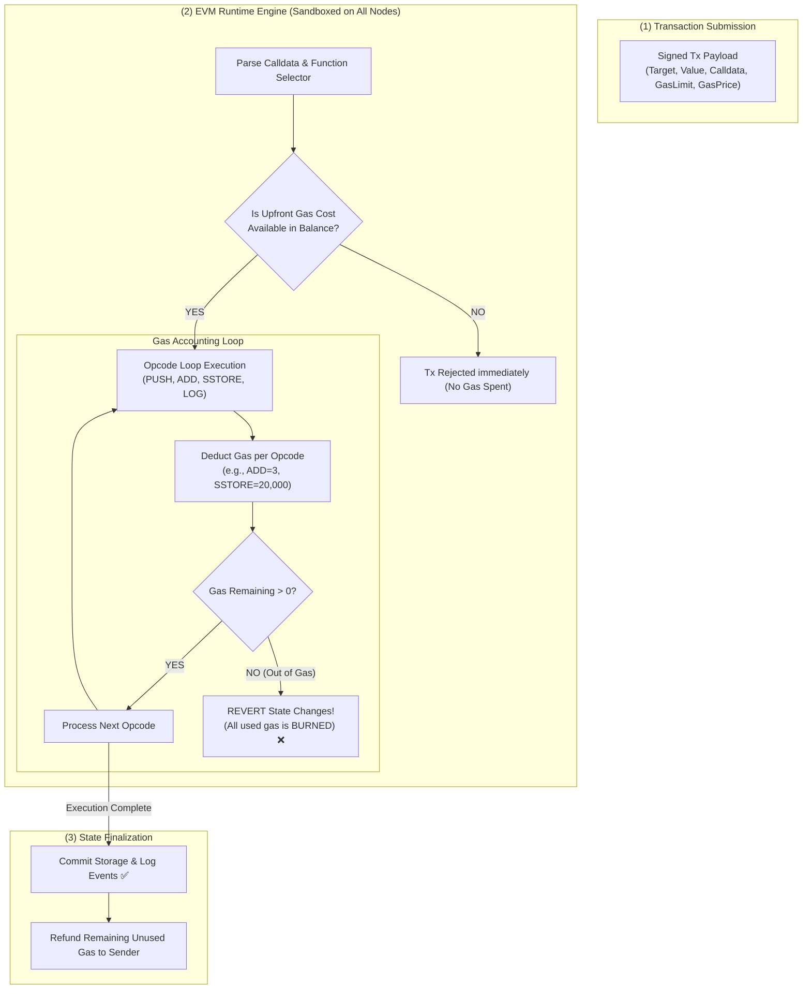
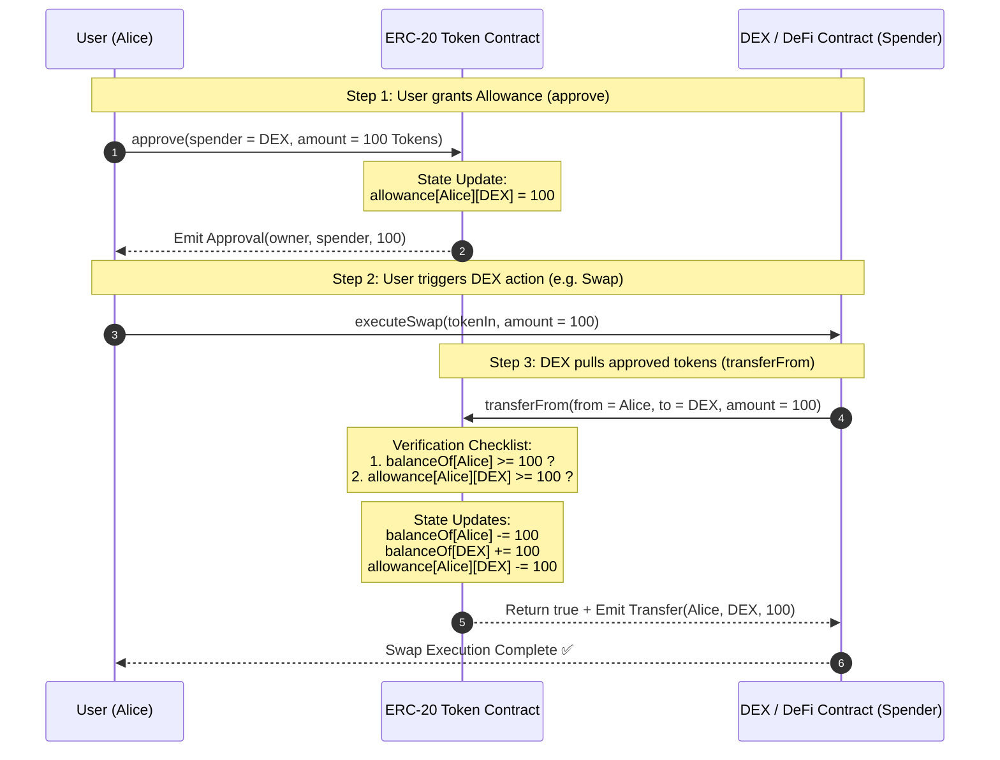
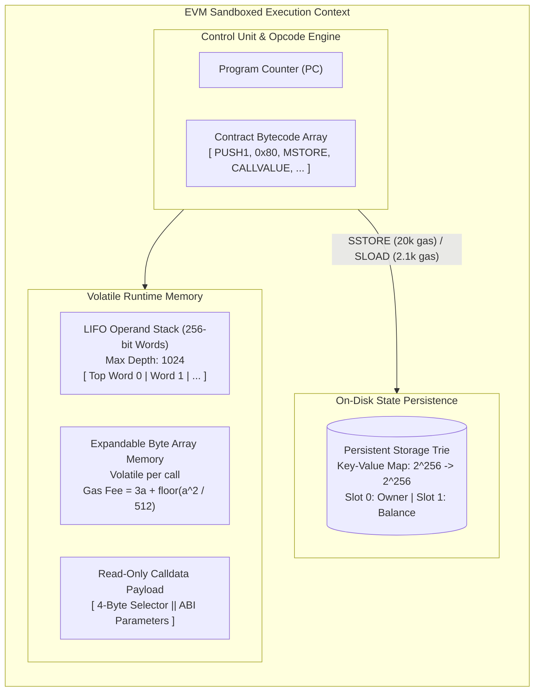
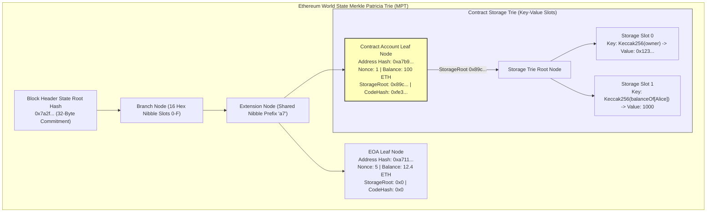

# UNIT 3 — Ethereum & Smart Contracts 🟣

**Syllabus weightage:** 12 hrs / **30%** — the biggest unit. | **Related practicals:** [[P07 — Smart Contract Evm|P07]], [[P08 — Erc20 Token|P08]]
**Star guide:** ⭐ = likely · ⭐⭐ = very likely · ⭐⭐⭐ = practically guaranteed in some form

---

## 🧭 Chapter Roadmap

```
UNIT 3: Ethereum & Smart Contracts  (30% — biggest marks chunk)
├── 3.1 Ethereum Essentials
│     ├── 3.1.1 Ethereum Virtual Machine (EVM) & Gas Fees  ⭐⭐
│     └── 3.1.2 Ether (ETH) vs Tokens (ERC-20 basics)      ⭐⭐⭐ (adv/disadv asked 4×)
├── 3.2 Introduction to Solidity
│     ├── 3.2.1 Syntax: variables, functions, mappings     ⭐⭐
│     ├── 3.2.2 Writing "Hello World" smart contract       ⭐ (→ P07)
│     ├── 3.2.3 Compiling & deploying on a testnet (Remix) ⭐
│     └── 3.2.4 Introduction to MetaMask                   ⭐
└── Related concepts examiners love from this unit:
      ├── Smart contracts: definition, features, working   ⭐⭐⭐
      ├── Bitcoin vs Ethereum / Blockchain vs Bitcoin      ⭐⭐⭐
      ├── dApps                                           ⭐⭐
      └── ERC-20 advantages & disadvantages                ⭐⭐⭐
```

### Learning outcomes — after this unit you can:
- Explain the **EVM** (the "world computer") and why **gas** exists
- Define ETH, tokens, and ERC-20; list the standard's advantages & disadvantages (repeated 4 times in PYQ!)
- Read and write basic Solidity — variables, functions, mappings (see P07/P08)
- Compare **Bitcoin vs Ethereum** and **Blockchain vs Bitcoin** cleanly (both asked)
- Explain smart-contract features, working mechanism, and applications

---

## 3.1 Ethereum Essentials

### 3.1.1 Ethereum Virtual Machine (EVM) & Gas Fees ⭐⭐

**Ethereum** (Vitalik Buterin, 2015) is a *programmable blockchain*: anyone can deploy **code that runs exactly as written**. Bitcoin answers "who spent what?"; Ethereum answers "what did this program compute?"

- The **EVM (Ethereum Virtual Machine)** is the runtime that executes every smart contract, on every full node, identically. It makes Ethereum a **"world computer"** — deterministic, tamper-proof, decentralized.
- Every contract call costs **gas** — a fee paid in ETH measured per operation. **Why gas exists:**
  1. **Prevents infinite loops** — a contract that loops forever would otherwise stall nodes; gas runs out and execution stops.
  2. **Compensates miners/validators** for computing your contract.
  3. **Prices scarce compute** — more complex operations cost more gas (`SSTORE` ≫ `ADD`).
- Gas math: `tx cost = gasUsed × gasPrice`. `gasLimit` is your budget ceiling; unused gas is refunded. A gas-starved tx reverts but **still burns the used gas**.
- Gas helps **Turing-complete-but-bounded** execution: the EVM can compute anything, but only within a paid budget.



### 3.1.2 Ether (ETH) vs Tokens (ERC-20 basics) ⭐⭐⭐

| | ETH (native) | ERC-20 token (programmable) |
|---|---|---|
| What is it | Native currency of Ethereum | A smart contract defining its own ledger |
| Lives in | Protocol-level balance | Contract storage (a mapping of balances) |
| Who creates | The network itself (mining/staking) | Anyone — deploy a contract |
| Used for | Paying gas, staking, store of value | Anything: stablecoins (USDC), project coins, utility |
| Transfer | Native transfer opcode | Function call `transfer(to, amount)` |

**ERC-20** = the standard interface every token contract must implement so wallets/exchanges handle it uniformly:
`totalSupply()`, `balanceOf()`, `transfer()`, `transferFrom()`, `approve()`, `allowance()` + events `Transfer`, `Approval`. (See [[P08 — Erc20 Token|P08]].)



**Advantages of ERC-20 (S24 Q.5(a), S26 Q.4(b)-alt, S25 Q.5(b)):**
1. **Interoperability** — standard interface works in every wallet/exchange instantly.
2. **Easy creation** — anyone can launch a token with a few lines of code; no ICO required for basic use.
3. **Liquidity & market depth** — listed on all major exchanges, huge adoption.
4. **Reusability** — developers inherit battle-tested standards instead of writing token logic.
5. **Smart-contract composability** — ERC-20s plug into DeFi (lending, DEXes) directly.

**Disadvantages of ERC-20 (S24 Q.5(a)-alt, S26 Q.4(b)):**
1. **ERC-20 transfer vs transferFrom bug** — naive contracts accept tokens but can't move them ("stuck tokens" forever).
2. **No refund on failed transfer** — sending tokens to a contract that can't receive them locks them permanently.
3. **No built-in minting limit / governance** — the deployer controls supply; rug pulls possible.
4. **Approval phishing** — unlimited `approve()` grants let scammers drain wallets.
5. **Blockchain congestion** — gas spikes during network stress make small transfers unviable.

---

## 3.2 Introduction to Solidity

**Solidity** = the main smart-contract language, C-like syntax, compiled to EVM bytecode.

### 3.2.1 Solidity Syntax: Variables, Functions, and Mappings ⭐⭐

```solidity
// SPDX-License-Identifier: MIT
pragma solidity ^0.8.19;

contract Counter {
    uint public count;                    // state variable (persisted on-chain)
    mapping(address => uint) public scores; // key → value storage

    function increment() public {         // mutates state → costs gas
        count += 1;
    }

    function setScore(address who, uint s) external {  // external = cheaper caller-side
        scores[who] = s;
    }

    function readScore(address who) public view returns (uint) {  // view = free
        return scores[who];
    }
}
```

- **Types:** `uint`/`int` (sizes 8–256), `bool`, `address`, `bytes`, `string`, arrays, structs, **mappings**.
- **Visibility:** `public` (auto-getter), `private` (contract only), `internal` (contract + derived), `external` (only outside).
- **Storage & gas:** `storage` (persistent, expensive) vs `memory` (temporary, cheap) vs `calldata`.
- **`view`/`pure`** functions read nothing / modify nothing → **free**, no gas.
- **`msg.sender`** = the caller's address (the "who" of every call) — the backbone of access control.
- **Events** (`emit`) are cheap logs dApps read off-chain to track what happened.

### 3.2.2 Writing "Hello World" — the classic first contract

```solidity
// SPDX-License-Identifier: MIT
pragma solidity ^0.8.19;

contract HelloWorld {
    string public message = "Hello, Blockchain!";

    function setMessage(string calldata newMsg) public {
        message = newMsg;
    }
}
```
Deployed in Remix → a `setMessage` call costs gas; `message()` reads are free. Full walkthrough with screenshots in [[P07 — Smart Contract Evm|P07]].

### 3.2.3 Compiling & Deploying on a Testnet (Remix IDE) ⭐

1. **Remix IDE** (`remix.ethereum.org`) — browser IDE; compile tab turns Solidity → ABI + bytecode.
2. Compile → check the green check; ABI is what external tools need to call your contract.
3. **Deploy** → pick environment:
   - *JavaScript VM* — instant, fake, for learning.
   - *Injected Provider (MetaMask)* → deploy to a **testnet** (Sepolia) with **faucet ETH** (free test coins).
4. Testnet = mainnet replica, costs nothing real. Every contract call there behaves identically to mainnet.

### 3.2.4 Introduction to MetaMask ⭐

- MetaMask = browser extension **wallet** → holds your private keys, signs transactions, shows balances.
- Connects dApps to Ethereum via **Injected Provider** (the dApp never sees your private key; MetaMask signs for you).
- Parts: account address (`0x…`), secret recovery phrase (12 words = your seed), network switcher (Mainnet/Sepolia/…), gas controls.
- Security rule: the seed phrase **never leaves MetaMask**; "support agents" and "validation sites" asking for it are scams.

---

## 🧠 Deep-Dive Topics

### Deep Dive A: The EVM execution model, step by step
1. A user calls `transfer(...)` on a token contract via MetaMask.
2. MetaMask builds the calldata + signs it; the tx is broadcast.
3. Every node runs the SAME bytecode on the SAME state → deterministic result. This determinism is what lets nodes agree without trusting each other.
4. Gas is deducted as each opcode runs; if the budget runs out, execution **reverts** (state rolled back), but the spent gas is gone.
5. Result: the contract's storage updated, an event emitted, and all nodes store the identical new state. The "world computer" is really *millions of parallel copies agreeing on one answer*.

### Deep Dive B: Why ERC-20 "transfer vs transferFrom" matters (the stuck-token bug)
- `transfer()` moves YOUR tokens to a recipient.
- `approve(spender, amount)` + `transferFrom(spender→sender→to)` lets a *third party* (a DEX contract) pull tokens you approved.
- Classic bug: contract asks users to `transfer()` directly but the contract never gets custody → tokens arrive at the contract address and are **unrecoverable** (no function to move them). This is why P08 follows the standard strictly.

### Deep Dive C: Bitcoin vs Ethereum — the 4-marker answer, memorized
| | Bitcoin | Ethereum |
|---|---|---|
| Purpose | Decentralized digital cash | Programmable "world computer" |
| Programming | Limited Bitcoin Script (not Turing-complete) | Solidity → EVM (Turing-complete, gas-bounded) |
| Model | UTXO | Account balance |
| Consensus | PoW (mining) | PoS (since The Merge 2022) |
| Block time | ~10 min | ~12 sec |
| Assets | BTC only | ETH + unlimited ERC-20 tokens/NFTs |
| Fees | Fee market, byte-size based | Gas per operation |

**Blockchain vs Bitcoin** — *Blockchain* is the distributed-ledger *technology*; *Bitcoin* is one specific *application* built on it (its first and largest). Blockchain exists without Bitcoin; Bitcoin doesn't exist without blockchain.

### Deep Dive D: Smart contracts — definition, features, working, applications (the 7-marker)
- **Definition:** a self-executing program stored on the blockchain that runs exactly as written, automatically enforcing an agreement without intermediaries.
- **Features:** (1) self-executing/automatic, (2) immutable once deployed, (3) trustless (no middleman), (4) transparent (public code + state), (5) deterministic, (6) decentralized.
- **Working:** developer writes contract in Solidity → compiles to bytecode → deploys (pays gas) → the EVM stores code on-chain → users trigger it via transactions/function calls → nodes execute deterministically → state changes + events → anyone can verify the outcome. Nobody — not even the deployer — can stop it once live.
- **Applications:** payments & escrow, DeFi (lending, DEX, stablecoins), NFTs & gaming, supply-chain provenance, identity, DAO governance, insurance (parametric payouts).

---

## 🚀 Beyond the Textbook (what most classes won't tell you)

- **"World computer" is a metaphor with a huge asterisk:** it's *incredibly slow and expensive* vs a normal computer — every opcode executes in parallel on every node, so you pay for redundancy.
- **You can't "change" a deployed contract.** You deploy a *new* version and migrate users — hence the "proxy contract" pattern in production.
- **A failed tx still costs money.** Users don't see the *state* roll back and assume refunds; only unused gas is returned.
- **ERC-20 is why DeFi exploded** — a single standard made composable finance (DEX→lending→stablecoin) possible.
- **Testnet ETH is free** (faucets). "I can't afford to learn" is never true for this unit.

---

## 📝 PYQ Map — UNIT 3 (all available papers)

| Paper | Q. | Topic | Marks |
|---|---|---|---|
| **Summer 2024** | Q.5(a) | Advantages of ERC-20 | 3 |
| | Q.5(b) | Working mechanism of a smart contract | 4 |
| | Q.5(c) | Smart contract — definition, features, applications | 7 |
| | Q.5(a)-alt | Disadvantages of ERC-20 | 3 |
| | Q.5(b)-alt | Steps to launch a DAO | 4 |
| | Q.5(c)-alt | DAO — advantages & disadvantages | 7 |
| **Winter 2024** | Q.4(b) | How does a smart contract work? | 4 |
| | Q.4(b)-alt | Types of smart contracts | 4 |
| | Q.5(b) | dApps — what & how they work | 4 |
| **Summer 2025** | Q.4(b) | Differentiate Blockchain and Bitcoin | 4 |
| | Q.5(b) | Advantages & disadvantages of ERC-20 | 4 |
| | Q.5(a)-alt | Tokenized vs token-less blockchain | 3 |
| **Summer 2026** | Q.4(b) | Disadvantages of ERC-20 | 4 |
| | Q.4(b)-alt | Advantages of ERC-20 | 4 |
| | Q.5(b)-alt | Steps to launch a DAO | 4 |
| | Q.5(a)-alt | Key features & applications of CORDA | 3 |
| **Winter 2025** | Q.4(b) | Compare Bitcoin and Ethereum | 4 |
| | Q.5(a) | Types of decentralization | 3 |
| | Q.5(b) | Working of a smart contract | 4 |
| | Q.5(a)-alt | Define smart contract + list features | 3 |
| | Q.5(b)-alt | Compare DAO vs Traditional organization | 4 |

### ✅ Solved PYQ answers (UNIT 3)

**W25 Q.5(b) — Working of a smart contract (4 marks).**
> A smart contract works through the following steps: **1. Authoring** — the contract is written in Solidity (variables, functions, mappings) defining the rules of the agreement. **2. Compilation** — it is compiled into EVM bytecode plus an ABI that describes its interface. **3. Deployment** — the bytecode is deployed to the blockchain in a transaction, paying gas; the code becomes permanently stored at a contract address, and **nobody can alter it**. **4. Invocation** — users trigger functions by sending transactions (e.g. `transfer`, `approve`, game moves); every call specifies the sender (`msg.sender`). **5. Execution** — each full node runs the same bytecode against the same state in the EVM, producing the **same deterministic result**, so nodes reach consensus without trusting each other. **6. Settlement & events** — state (storage/mappings) is updated, events are emitted for off-chain apps, and the outcome is permanently recorded. The contract acts as a **trustless escrow**: it enforces the coded rules automatically, with no human intermediary.

**S24 Q.5(c) — What is a smart contract? Features & applications (7 marks).**
> **Definition:** A smart contract is a self-executing computer program stored on the blockchain that automatically enforces and executes the terms of an agreement when predefined conditions are met, without needing a trusted third party. **Features:** (1) *Automatic & self-executing* — no human approval step; (2) *Immutable* — once deployed it cannot be changed, guaranteeing reliability; (3) *Trustless* — parties need not trust each other, only the code; (4) *Transparent* — code and state are public and verifiable by anyone; (5) *Deterministic* — same inputs always give the same output, enabling consensus; (6) *Decentralized* — runs on every node, so there is no single point of failure. **Working (brief):** written in Solidity → compiled to EVM bytecode → deployed in a transaction paying gas → triggered by function calls → executed identically on all nodes. **Applications:** digital payments & escrow (funds released on condition), DeFi (lending, decentralized exchanges, stablecoins like USDC), NFTs & gaming assets, supply-chain provenance tracking, insurance with automatic payouts, DAO governance voting, and identity management.

**S26 Q.4(b) — Disadvantages of ERC-20 (4 marks).**
> 1. **Token-transfer bug:** ERC-20 has separate `transfer()` and `transferFrom()`; contracts that receive tokens but only implement `transfer()` cannot move them, permanently **locking funds**.
> 2. **No refund on failed transfer:** tokens sent to a contract address that cannot receive them are **lost forever**.
> 3. **No supply or governance limits:** the deploying contract controls minting, enabling dilution or **rug-pull** schemes.
> 4. **Approval-phishing risk:** users granting unlimited `approve()` let malicious contracts drain their entire balance later.
> 5. **Congestion sensitivity:** during network congestion, high gas fees make micro-transactions uneconomical.

**W25 Q.4(b) — Compare Bitcoin and Ethereum (4 marks).** — see Deep Dive C table (memorize the 6 rows).

**S24 Q.5(a)-alt — Disadvantages of ERC-20 (3 marks).** — take any 3 of the 5 points above.

**S25 Q.5(a)-alt — Tokenized vs token-less blockchain (3 marks).**
> A **tokenized blockchain** issues its own digital tokens to incentivize the network and transfer value (e.g. Bitcoin's BTC, Ethereum's ETH and ERC-20 tokens); tokens fuel transaction fees, staking, and DAO voting. A **token-less (or token-free) blockchain** has **no native cryptocurrency**; it is designed purely for enterprise data sharing, with access controlled by permissioned identity rather than token economics (e.g. **Hyperledger Fabric**, CORDA — permissioned networks where participants are known). In short: tokenized = public, incentive-driven, crypto-priced; token-less = permissioned, identity-driven, no coins.

---

## ✍️ Practice Problems (self-test — answers upside-down)

1. (3) What is the EVM? Why is gas required to run a contract?
2. (4) Differentiate ETH and ERC-20 tokens.
3. (7) With a diagram/flow, explain how a smart contract is created and executed.
4. (4) List and explain any four ERC-20 functions.
5. (3) Why can `view` functions be called without paying gas?
6. (4) Differentiate Blockchain and Bitcoin.
7. (3) What is MetaMask? Why must the seed phrase never be shared?
8. (4) Write a minimal Solidity contract with a `mapping` and a function that updates it.

<details>
<summary>**Click for answers**</summary>

1. EVM = Ethereum Virtual Machine, the runtime executing every smart contract on every node deterministically. Gas exists to (a) stop infinite loops, (b) pay validators, (c) price scarce compute — and to keep the "world computer" Turing-complete *but* budget-bounded.
2. ETH is Ethereum's native currency (pays gas, stake, store of value); ERC-20 tokens are programmable contracts implementing a standard interface (balanceOf/transfer/approve) — used for stablecoins, project coins, utility.
3. Author → compile (bytecode+ABI) → deploy (gas) → store at address → users call functions (`msg.sender`) → EVM runs deterministically on all nodes → state updated + events → immutable, verifiable.
4. `totalSupply()`, `balanceOf(addr)`, `transfer(to, amount)`, `transferFrom(from,to,amount)` (needs `approve()`), `allowance(owner,spender)` — the last two enable third-party contracts (DEXes) to pull funds.
5. `view` functions only read state and return data to the caller's local node — nothing is broadcast or stored, so no computation is executed on-chain and no gas is charged.
6. Blockchain = the underlying distributed-ledger technology (blocks, hashes, consensus); Bitcoin = one application built on it — a decentralized digital cash system. Blockchain is the platform; Bitcoin is a specific instance.
7. MetaMask = browser-extension wallet holding your private keys and signing transactions. The seed phrase derives all keys — anyone who has it owns everything, and there is no recovery or customer support.
8. See the `Counter` contract in §3.2.1 — a `mapping(address => uint) public scores` + `setScore()`/`readScore()` demonstrates it.

</details>

---

## 📖 Glossary of Key Terms

| Term | One-line meaning |
|---|---|
| EVM | Ethereum Virtual Machine — the deterministic runtime for smart contracts |
| Gas | Unit of computation cost paid in ETH to run contract code |
| Gas limit / gas price | Max gas you budget / amount you pay per unit |
| ETH | Ethereum's native cryptocurrency |
| ERC-20 | Standard interface for fungible tokens |
| Solidity | Main smart-contract programming language |
| State variable | Data permanently stored on-chain by a contract |
| Mapping | Key→value storage structure in Solidity |
| msg.sender | Address that called the current function |
| ABI | Application Binary Interface — how apps call a contract |
| Testnet / faucet | Free practice network / service giving free test ETH |
| MetaMask | Browser wallet that signs transactions for dApps |
| dApp | Decentralized application (frontend + smart contracts) |
| Immutable | Cannot be changed after deployment |

---

## 🔗 Curated Resources (per concept)

- **Ethereum & EVM:** https://ethereum.org/en/developers/docs/evm/
- **Gas:** https://ethereum.org/en/developers/docs/gas/ | *Mastering Ethereum* Ch. 1, 13
- **ERC-20 spec:** https://eips.ethereum.org/EIPS/eip-20
- **Solidity docs (official):** https://docs.soliditylang.org/
- **Remix IDE:** https://remix.ethereum.org | **Sepolia faucet:** https://faucet.sepolia.dev
- **MetaMask:** https://metamask.io (only ever install from the official store)
- **Smart contracts:** https://ethereum.org/en/smart-contracts/

---

## 🎥 Video Study Guide (YouTube)

> Your video path for the whole unit — exact keywords to search + channels you can trust.

### 🧑‍🎓 Step 0 — Pick your learning style

| Style | You learn best by | Your path through this unit |
|---|---|---|
| 🎧 **Listener** | short, clear explainers | 1 explainer per topic in the table below |
| 🛠️ **Builder** | writing code yourself | Watch the build-along → deploy [[P07 — Smart Contract Evm|P07]] & [[P08 — Erc20 Token|P08]] in Remix |
| 🔧 **Tinkerer** | experimenting & demos | Deploy on Sepolia with a faucet; break the token contract and watch reverts |
| 🧠 **Deep Diver** | full theory, "why" | Playlists at the bottom |
| 🧭 **Explorer** | breadth & curiosity | Start with "how ethereum works" explainers |
| 🎓 **Academic** | exam marks | Revision videos → grind the PYQ map above |

### 🎬 Step 1 — Watch by topic (search these on YouTube)

| Topic | YouTube search keywords (copy-paste ready) | Best channels | Style served |
|---|---|---|---|
| Ethereum overview | `what is ethereum explained` · `ethereum in 5 minutes` · `how ethereum works` | Simply Explained, Fireship | 🧭 Explorer |
| EVM | `ethereum virtual machine explained` · `what is the evm` · `evm vs bitcoin script` | Fireship, Finematics, Coin Bureau | 🧠 Deep Diver |
| Gas fees | `ethereum gas fees explained` · `why are gas fees so high` · `how gas works ethereum` | Coin Bureau, Finematics | 🎧 + 🎓 |
| ETH vs tokens / ERC-20 | `erc20 tokens explained` · `ethereum token standard` · `what is an erc 20 token` | Simply Explained, Finematics | 🎓 Academic |
| Solidity basics | `solidity for beginners` · `learn solidity in 1 hour` · `solidity functions variables mappings` | freeCodeCamp, Dapp University, EatTheBlocks | 🛠️ Builder |
| Build hello world contract | `deploy your first smart contract remix` · `hello world solidity remix tutorial` | Dapp University, freeCodeCamp | 🛠️ Builder |
| Testnets & MetaMask | `how to use metamask 2026` · `sepolia testnet faucet how to get free eth` · `deploy contract on testnet` | EatTheBlocks, Coin Bureau | 🔧 + 🛠️ |
| Smart contracts deep | `what are smart contracts` · `how smart contracts work` · `smart contract use cases` | Simply Explained, Finematics, Coin Bureau | 🧠 Deep Diver |
| Bitcoin vs Ethereum | `bitcoin vs ethereum` · `btc vs eth comparison` | Coin Bureau, Finematics | 🎓 Academic |
| dApps | `what are dapps` · `how dapps work explained` · `decentralized applications examples` | Finematics, Simply Explained | 🎧 + 🧭 |
| Whole-unit revision | `ethereum and smart contracts full course` · `solidity full course for beginners` · `blockchain ethereum exam revision` | MIT OCW, freeCodeCamp, Gate Smashers, Neso Academy | 🎓 Academic |

### 🎬 Step 2 — Full playlists (for Deep Divers & Academics)

1. **"freeCodeCamp — Learn Solidity and smart contracts"** (long-form course) — the fastest way to become a Builder.
2. **"MIT 15.S12 Blockchain and Money — Ethereum & smart contracts lectures"** — exam-grade theory of this unit.
3. **"EatTheBlocks — Solidity & smart contract testing"** — if you want to Tinker beyond the syllabus.

### 🎬 Step 3 — Proof you got it (5 min)

- Deploy the [[P08 — Erc20 Token|P08 token]] on Sepolia and mint/transfer to yourself.
- Explain to a friend why a failed transaction still costs gas.
- Say the 6 rows of the Bitcoin vs Ethereum table from memory.

---

*Next: [[Unit 4 — Enterprise and Private Blockchains|UNIT 4 — Enterprise & Private Blockchains]]*

---


---

## 📖 Historical Context & Motivation

While Bitcoin demonstrated that a peer-to-peer network could achieve decentralized consensus over a financial transaction ledger, its domain-specific scripting language (`Script`) was intentionally limited. Lacking loops, recursive execution, dynamic memory, and state persistence across transactions, Bitcoin’s design prevented arbitrary code execution to protect nodes from Denial-of-Service (DoS) and infinite loop attacks. In 1994, computer scientist Nick Szabo had conceptualized "smart contracts"—self-executing digital protocols that automatically enforce contract terms—yet their practical deployment remained impossible without a trust-minimized, stateful execution engine.

In late 2013, Vitalik Buterin published the Ethereum Whitepaper, proposing a general-purpose, stateful virtual machine embedded within a blockchain protocol. Launched in July 2015, Ethereum introduced the **Ethereum Virtual Machine (EVM)**, transforming the blockchain from a single-application payment ledger into a universal **"World Computer."** To solve the Computer Science Halting Problem—preventing malicious actors from stalling network nodes with infinite loops—Ethereum introduced **Gas Economics**, requiring users to purchase computational execution units with Ether (ETH). This innovation enabled developers to deploy arbitrary, Turing-complete smart contracts (in languages like Solidity), laying the groundwork for Decentralized Finance (DeFi), autonomous protocols, and programmable digital assets.

---

## 🔬 Deep Dive: System Architecture

### EVM Runtime Mechanics, Memory/Storage Layout, EIP-1559 Gas Economics, and State Tries

Ethereum’s system architecture is defined by the stateful execution model of the EVM, its specialized memory structures, the dynamic EIP-1559 fee engine, and Merkle Patricia Tries.

#### 1. EVM Architecture & Execution Environment
The EVM is a deterministic, stack-based virtual machine operating on a $256$-bit word size (optimized for native 256-bit cryptographic operations like Keccak-256 and elliptic curve arithmetic). Execution occurs isolated inside sandboxed environments on every full node.



##### Data Regions
1. **Stack**: A Last-In-First-Out (LIFO) stack containing up to 1,024 words ($256$ bits each). All arithmetic and logical opcodes (`ADD`, `MUL`, `SSTORE`, `JUMP`) operate on top stack elements.
2. **Memory**: A linearly expandable, volatile byte array instantiated per message call. Memory expansion incurs a gas fee that scales quadratically:
   $$C_{\text{mem}}(a) = 3a + \left\lfloor \frac{a^2}{512} \right\rfloor$$
   where $a$ is the memory allocation in 32-byte words.
3. **Storage**: A persistent, key-value mapping ($2^{256}$ keys to $2^{256}$ values) assigned to each contract account, backed on disk by the global state trie. Storage writes (`SSTORE`) are computationally expensive, costing $20,000\text{ gas}$ when allocating a zero-to-nonzero slot, incentivizing lean state usage.
4. **Calldata**: A read-only, unmodifiable byte array containing the execution payload (function selector + ABI-encoded parameters) passed by the transaction caller.

#### 2. EIP-1559 Dynamic Fee Market Mathematics
EIP-1559 replaced Ethereum's legacy first-price auction fee model with an algorithmic, dynamic fee structure designed to stabilize transaction costs and burn base network fees.

Total fee per transaction is computed as:
$$\text{Fee}_{\text{total}} = \text{GasUsed} \times \left( \text{BaseFee} + \min(\text{PriorityFee}, \, \text{MaxFee} - \text{BaseFee}) \right)$$

##### BaseFee Volatility Formula
The protocol targets a block gas usage of $\text{GasTarget} = 15,000,000\text{ gas}$ (with a maximum gas limit of $\text{GasMax} = 30,000,000\text{ gas}$). After block $n$, the base fee for block $n+1$ updates strictly according to:
$$\text{BaseFee}_{n+1} = \text{BaseFee}_n \times \left( 1 + \frac{1}{8} \cdot \frac{\text{GasUsed}_n - \text{GasTarget}}{\text{GasTarget}} \right)$$

- If block $n$ is $100\%$ full ($\text{GasUsed}_n = 30\text{M}$), $\text{BaseFee}$ increases by exactly $+12.5\%$.
- If block $n$ is completely empty ($\text{GasUsed}_n = 0$), $\text{BaseFee}$ decreases by exactly $-12.5\%$.
- **Fee Burning**: The entire $\text{BaseFee} \times \text{GasUsed}$ amount is permanently burned (transferred to `0x000...0`), removing ETH from circulation and establishing a deflationary monetary mechanism during high network activity.

#### 3. Merkle Patricia Trie (MPT) State Representation
Ethereum represents its entire global state using a modified 16-ary **Hexary Merkle Patricia Trie**. The state trie maps 32-byte Keccak-256 account address hashes to RLP-encoded account states:
$$\text{AccountState} = \langle \text{Nonce}, \, \text{Balance}, \, \text{StorageRoot}, \, \text{CodeHash} \rangle$$

For Contract Accounts, `StorageRoot` points to a distinct internal Merkle Patricia Trie containing the contract’s persistent key-value storage slots, enabling $O(\log N)$ cryptographic proof of arbitrary storage values.



---

## 🏢 Real-World Case Study

### The Uniswap V2 Automated Market Maker (AMM) & Constant Product Mechanics

Before Automated Market Makers (AMMs), decentralized exchanges relied on traditional central limit order books (CLOBs), which failed on public blockchains due to prohibitive gas costs for order placement, cancellation, and matching.

```mermaid
graph TD
    subgraph AMM["Uniswap V2 Pair Protocol (ETH / USDC Pool)"]
        direction TB
        RESERVES["Liquidity Pool Reserves<br/>Reserve X: 500 ETH | Reserve Y: 1,500,000 USDC<br/>Constant Product Invariant: K = X × Y = 750,000,000"]
        
        subgraph SWAP["(1) Standard Token Swap Execution"]
            TRADER["Trader (Alice)"] -- "Deposit ΔX = 10 ETH" --> FEE_ENGINE["Fee Engine (0.3% Fee = 0.03 ETH)<br/>Effective Swap Input: ΔX_net = 9.97 ETH"]
            FEE_ENGINE --> POOL_MUTATION["Updated Invariant Evaluation:<br/>(X + 0.997·ΔX) × (Y - ΔY) = K"]
            POOL_MUTATION -- "Payout ΔY = 29,331.4 USDC" --> TRADER
        end

        subgraph FLASH["(2) Flash Swap Atomic Execution (Callback)"]
            ARBITRAGEUR["Arbitrageur / Bot"] -- "Borrow 100 ETH (Zero Upfront Collateral)" --> PAIR_CONTRACT["UniswapV2Pair.sol"]
            PAIR_CONTRACT -- "Execute Callback: uniswapV2Call()" --> BOT_LOGIC["Execute Arbitrage across External DEXes"]
            
            BOT_LOGIC --> REPAY_CHECK{"Did Bot Repay 100 ETH + 0.3% Fee<br/>OR Equivalent USDC before Tx Ends?"}
            REPAY_CHECK --> |"YES"| SUCCESS["Atomic Tx Succeeded ✅ (Keep Arbitrage Profit)"]
            REPAY_CHECK --> |"NO"| REVERT["EVM REVERTS ENTIRE TX! ❌ (No Loss to Pool)"]
        end
    end

    style RESERVES fill:#ffb,stroke:#333,stroke-width:2px
    style SWAP fill:#eef,stroke:#333,stroke-width:1px
    style FLASH fill:#fee,stroke:#333,stroke-width:1px
```



#### Constant Product Invariant: $x \cdot y = k$
Uniswap V2 solved liquidity provision by executing trades against liquidity pools governed by the constant product formula:
$$x \cdot y = k$$
where $x$ is the pool's balance of Token $A$, $y$ is the balance of Token $B$, and $k$ is the invariant product.

#### Swap Execution & Fee Mathematics
When a trader swaps $\Delta x$ of Token $A$ to receive $\Delta y$ of Token $B$, Uniswap deducts a $0.3\%$ transaction fee ($\gamma = 0.997$) that accrues directly to liquidity providers.

The post-trade invariant equation is:
$$(x + \gamma \Delta x)(y - \Delta y) = k = x \cdot y$$

Solving for output amount $\Delta y$:
$$\Delta y = \frac{y \cdot \gamma \Delta x}{x + \gamma \Delta x}$$

#### Flash Swaps & Atomic Execution
Uniswap V2 contracts (`UniswapV2Pair.sol`) allow users to withdraw any amount of token reserves instantly without up-front collateral, provided that by the end of the transaction execution frame (via the `uniswapV2Call` callback), the borrower either:
1. Returns the exact borrowed tokens plus the 0.3% fee.
2. Pays the equivalent value in the counter-pair token based on $x \cdot y = k$.

If the condition fails, the EVM reverts the entire transaction atomically, restoring state as if the borrow never occurred.

---

## 📝 End-of-Chapter Exercises

### Exercise 1: EIP-1559 Gas Pricing & ETH Burn Calculation
A complex smart contract interaction consumes $250,000\text{ gas}$. The current block header specifies a $\text{BaseFee} = 50\text{ gwei}$. The user configures their wallet with $\text{MaxFeePerGas} = 75\text{ gwei}$ and $\text{MaxPriorityFeePerGas} = 3\text{ gwei}$. ($1\text{ ETH} = 10^9\text{ gwei}$).

1. Calculate the effective gas price ($G_{\text{effective}}$) paid per unit gas.
2. Compute the total transaction fee paid by the user in ETH.
3. Calculate the exact breakdown of ETH permanently **burned** versus ETH awarded to the block validator as a priority tip.
4. If the current block uses $27,000,000\text{ gas}$ out of a $30,000,000\text{ max limit}$, calculate the updated $\text{BaseFee}$ for the subsequent block.

### Exercise 2: Solidity Storage Slot Layout Optimization
Consider the following unoptimized Solidity state variable declarations:

```solidity
contract Warehouse {
    uint128 public totalWeight;    // Variable 1
    uint256 public maxCapacity;     // Variable 2
    uint128 public itemID;          // Variable 3
    address public supervisor;      // Variable 4
    bool public operational;        // Variable 5
}
```

1. Analyze EVM 32-byte storage slot packing rules and list which variables occupy each slot index ($0, 1, 2 \dots$). How many total 32-byte storage slots does this contract consume?
2. Rewrite the variable declarations in an optimized order that packs variables efficiently into the minimum possible number of 32-byte slots.
3. Calculate the absolute gas savings achieved during contract deployment resulting from eliminating unnecessary `SSTORE` allocations (assuming $20,000\text{ gas}$ per initialized storage slot).

### Exercise 3: Constant Product AMM Trade & Slippage Analysis
A Uniswap V2 liquidity pool holds $x = 500\text{ ETH}$ and $y = 1,500,000\text{ USDC}$.

1. Calculate the initial marginal price of $1\text{ ETH}$ in terms of USDC before trading.
2. A trader submits a swap of $\Delta x = 50\text{ ETH}$ into the pool (using fee multiplier $\gamma = 0.997$). Calculate the exact net output amount $\Delta y$ of USDC returned to the trader.
3. Calculate the effective price per ETH realized by the trader during this swap.
4. Calculate the percentage price slippage experienced by the trader relative to the initial marginal price.

### Exercise 4: Delegatecall Proxy Storage Collision Audit
A developer implements an upgradeable proxy architecture using Solidity:

```solidity
contract Proxy {
    address public implementation; // Slot 0
    address public owner;          // Slot 1
    
    fallback() external payable {
        (bool success, ) = implementation.delegatecall(msg.data);
        require(success);
    }
}

contract LogicV1 {
    address public owner;          // Slot 0
    uint256 public totalVotes;     // Slot 1

    function setOwner(address _newOwner) external {
        owner = _newOwner;
    }
}
```

1. Trace the EVM execution context when a user calls `setOwner(0x123...)` on the `Proxy` contract. Which proxy storage slot gets overwritten?
2. Explain the vulnerability known as **Storage Collision** in `delegatecall` proxies.
3. Show how the EIP-1967 standard mitigates this vulnerability by using fixed, pseudo-random storage slots (e.g., `bytes32(uint256(keccak256("eip1967.proxy.implementation")) - 1)`).

## ⚡ Quick Revision

> [!abstract]+ One-page summary — review this before the exam

> - **Ethereum Essentials**
>   - **Ethereum Virtual Machine (EVM) & Gas Fees**
>   - **Ether (ETH) vs Tokens (ERC-20 basics)**
> - **Introduction to Solidity**
>   - **Solidity Syntax: Variables, Functions, and Mappings**
>   - **Writing "Hello World" — the classic first contract**
>   - **Compiling & Deploying on a Testnet (Remix IDE)**
>   - **Introduction to MetaMask**
> - **Deep-Dive Topics**
>   - **Deep Dive A: The EVM execution model, step by step**
>   - **Deep Dive B: Why ERC-20 "transfer vs transferFrom" matters (the stuck-token bug)**
>   - **Deep Dive C: Bitcoin vs Ethereum — the 4-marker answer, memorized**
>   - **Deep Dive D: Smart contracts — definition, features, working, applications (the 7-marker)**
> - **🚀 Beyond the Textbook (what most classes won't tell you)**
> - **✍ Practice Problems (self-test — answers upside-down)**
> - **📖 Glossary of Key Terms**
>   - **🧑‍🎓 Step 0 — Pick your learning style**
>   - **🎬 Step 1 — Watch by topic (search these on YouTube)**

### 📌 Key Definitions

- **30%** — the biggest unit. | **Related practicals:** [[P07 — Smart Contract Evm|P07]], [[P08 — Erc20 Token|P08]]
- **"world computer"** — deterministic, tamper-proof, decentralized.
- **gas** — a fee paid in ETH measured per operation. **Why gas exists:**
- **Prevents infinite loops** — a contract that loops forever would otherwise stall nodes; gas runs out and execution stops.
- **Prices scarce compute** — more complex operations cost more gas (`SSTORE` ≫ `ADD`).
- **Interoperability** — standard interface works in every wallet/exchange instantly.
- **Easy creation** — anyone can launch a token with a few lines of code; no ICO required for basic use.
- **Liquidity & market depth** — listed on all major exchanges, huge adoption.
- **Reusability** — developers inherit battle-tested standards instead of writing token logic.
- **Smart-contract composability** — ERC-20s plug into DeFi (lending, DEXes) directly.
- **ERC-20 transfer vs transferFrom bug** — naive contracts accept tokens but can't move them ("stuck tokens" forever).
- **No refund on failed transfer** — sending tokens to a contract that can't receive them locks them permanently.
- **No built-in minting limit / governance** — the deployer controls supply; rug pulls possible.
- **Approval phishing** — unlimited `approve()` grants let scammers drain wallets.
- **Blockchain congestion** — gas spikes during network stress make small transfers unviable.
- **Blockchain vs Bitcoin** — *Blockchain* is the distributed-ledger *technology*; *Bitcoin* is one specific *application* built on it (its first and largest). Blockchain exists without Bitcoin; Bitcoin doesn't exist without blockchain.
- **ERC-20 is why DeFi exploded** — a single standard made composable finance (DEX→lending→stablecoin) possible.
- **1. Authoring** — the contract is written in Solidity (variables, functions, mappings) defining the rules of the agreement. **2. Compilation** — it is compiled into EVM bytecode plus an ABI that describes its interface. **3. Deployment** — the bytecode is deployed to the blockchain in a transaction, paying gas; the code becomes permanently stored at a contract address, and **nobody can alter it**. **4. Invocation** — users trigger functions by sending transactions (e.g. `transfer`, `approve`, game moves); every call specifies the sender (`msg.sender`). **5. Execution** — each full node runs the same bytecode against the same state in the EVM, producing the **same deterministic result**, so nodes reach consensus without trusting each other. **6. Settlement & events** — state (storage/mappings) is updated, events are emitted for off-chain apps, and the outcome is permanently recorded. The contract acts as a **trustless escrow**: it enforces the coded rules automatically, with no human intermediary.
- **W25 Q.4(b) — Compare Bitcoin and Ethereum (4 marks).** — see Deep Dive C table (memorize the 6 rows).
- **S24 Q.5(a)-alt — Disadvantages of ERC-20 (3 marks).** — take any 3 of the 5 points above.
- **"EatTheBlocks — Solidity & smart contract testing"** — if you want to Tinker beyond the syllabus.

---

## 🧠 Active Recall

*Test yourself — click a question to reveal the answer. Try to answer BEFORE peeking!*

> [!question]- Q1: Define **30%**.
> the biggest unit. | **Related practicals:** [[P07 — Smart Contract Evm|P07]], [[P08 — Erc20 Token|P08]]

> [!question]- Q2: Define **"world computer"**.
> deterministic, tamper-proof, decentralized.

> [!question]- Q3: Define **gas**.
> a fee paid in ETH measured per operation. **Why gas exists:**

> [!question]- Q4: Define **Prevents infinite loops**.
> a contract that loops forever would otherwise stall nodes; gas runs out and execution stops.

> [!question]- Q5: Define **Prices scarce compute**.
> more complex operations cost more gas (`SSTORE` ≫ `ADD`).

> [!question]- Q6: Define **Interoperability**.
> standard interface works in every wallet/exchange instantly.

> [!question]- Q7: Define **Easy creation**.
> anyone can launch a token with a few lines of code; no ICO required for basic use.

> [!question]- Q8: Define **Liquidity & market depth**.
> listed on all major exchanges, huge adoption.

> [!question]- Q9: Define **Reusability**.
> developers inherit battle-tested standards instead of writing token logic.

> [!question]- Q10: Define **Smart-contract composability**.
> ERC-20s plug into DeFi (lending, DEXes) directly.

> [!question]- Q11: Explain **Ethereum Essentials** in 3-4 sentences.
> *(Write your answer, then check the section above)*

> [!question]- Q12: Explain **Introduction to Solidity** in 3-4 sentences.
> *(Write your answer, then check the section above)*

> [!question]- Q13: Compare: **What is it** vs **Native currency of Ethereum** on the basis of ETH (native).
> What is it | Native currency of Ethereum | A smart contract defining its own ledger

> [!question]- Q14: Compare: **Lives in** vs **Protocol-level balance** on the basis of ETH (native).
> Lives in | Protocol-level balance | Contract storage (a mapping of balances)

> [!question]- Q15: Compare: **Who creates** vs **The network itself (mining/staking)** on the basis of ETH (native).
> Who creates | The network itself (mining/staking) | Anyone — deploy a contract


---

## 📇 Flashcards (Spaced Repetition)

> [!info] How to use
> Install the **Spaced Repetition** plugin → these cards auto-sync into your review queue.
> Format: Question on top, `?` separator, answer below.

#flashcards

What is **30%**?
?
the biggest unit. | **Related practicals:** [[P07 — Smart Contract Evm|P07]], [[P08 — Erc20 Token|P08]]

What is **"world computer"**?
?
deterministic, tamper-proof, decentralized.

What is **gas**?
?
a fee paid in ETH measured per operation. **Why gas exists:**

What is **Prevents infinite loops**?
?
a contract that loops forever would otherwise stall nodes; gas runs out and execution stops.

What is **Prices scarce compute**?
?
more complex operations cost more gas (`SSTORE` ≫ `ADD`).

What is **Interoperability**?
?
standard interface works in every wallet/exchange instantly.

What is **Easy creation**?
?
anyone can launch a token with a few lines of code; no ICO required for basic use.

What is **Liquidity & market depth**?
?
listed on all major exchanges, huge adoption.

What is **Reusability**?
?
developers inherit battle-tested standards instead of writing token logic.

What is **Smart-contract composability**?
?
ERC-20s plug into DeFi (lending, DEXes) directly.

What is **ERC-20 transfer vs transferFrom bug**?
?
naive contracts accept tokens but can't move them ("stuck tokens" forever).

What is **No refund on failed transfer**?
?
sending tokens to a contract that can't receive them locks them permanently.

What is **No built-in minting limit / governance**?
?
the deployer controls supply; rug pulls possible.

What is **Approval phishing**?
?
unlimited `approve()` grants let scammers drain wallets.

What is **Blockchain congestion**?
?
gas spikes during network stress make small transfers unviable.

What is **Blockchain vs Bitcoin**?
?
*Blockchain* is the distributed-ledger *technology*; *Bitcoin* is one specific *application* built on it (its first and largest). Blockchain exists without Bitcoin; Bitcoin doesn't exist without blockchain.

What is **ERC-20 is why DeFi exploded**?
?
a single standard made composable finance (DEX→lending→stablecoin) possible.

What is **1. Authoring**?
?
the contract is written in Solidity (variables, functions, mappings) defining the rules of the agreement. **2. Compilation** — it is compiled into EVM bytecode plus an ABI that describes its interface. **3. Deployment** — the bytecode is deployed to the blockchain in a transaction, paying gas; the code becomes permanently stored at a contract address, and **nobody can alter it**. **4. Invocation** — users trigger functions by sending transactions (e.g. `transfer`, `approve`, game moves); every call specifies the sender (`msg.sender`). **5. Execution** — each full node runs the same bytecode against the same state in the EVM, producing the **same deterministic result**, so nodes reach consensus without trusting each other. **6. Settlement & events** — state (storage/mappings) is updated, events are emitted for off-chain apps, and the outcome is permanently recorded. The contract acts as a **trustless escrow**: it enforces the coded rules automatically, with no human intermediary.

What is **W25 Q.4(b) — Compare Bitcoin and Ethereum (4 marks).**?
?
see Deep Dive C table (memorize the 6 rows).

What is **S24 Q.5(a)-alt — Disadvantages of ERC-20 (3 marks).**?
?
take any 3 of the 5 points above.
