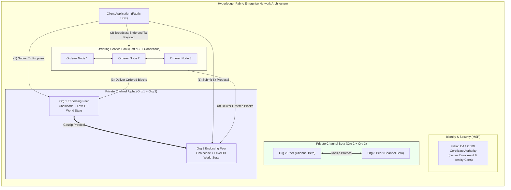
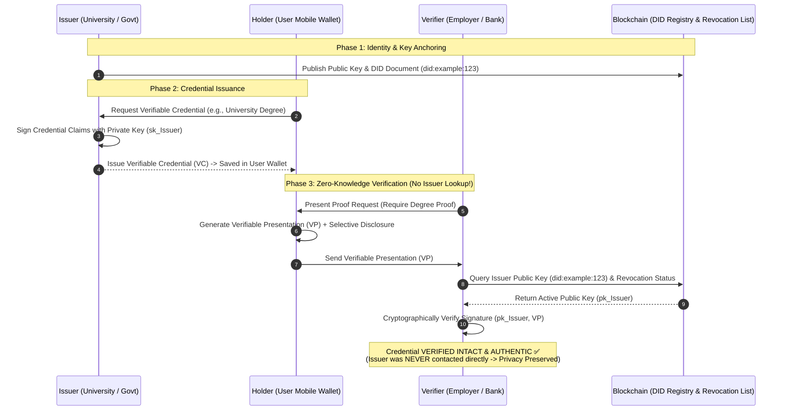
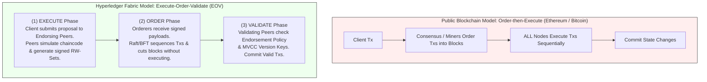
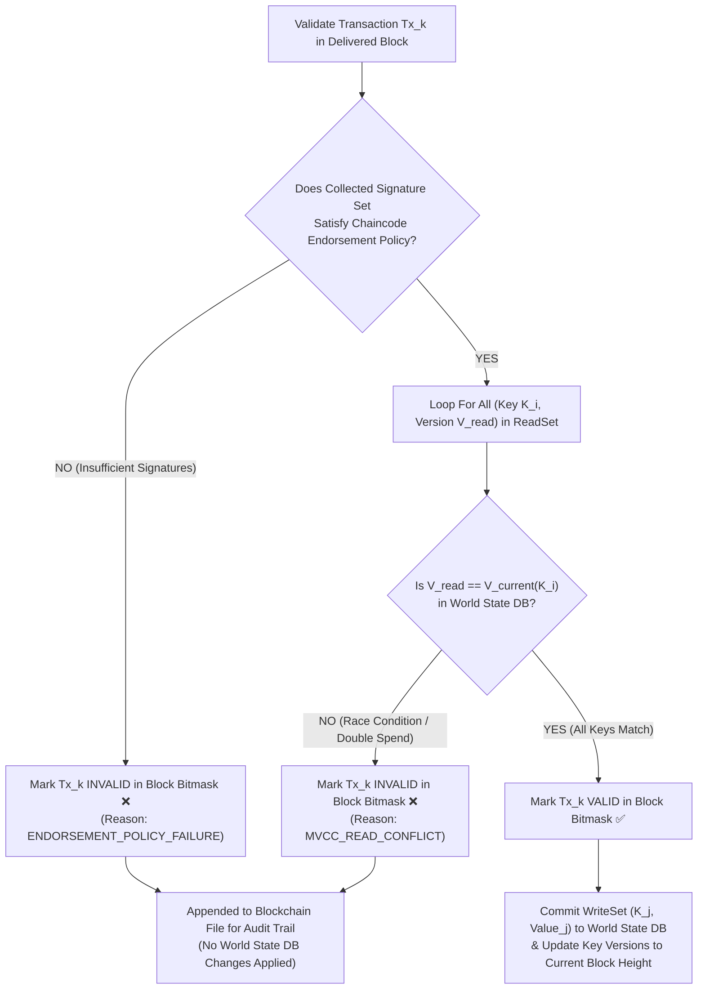
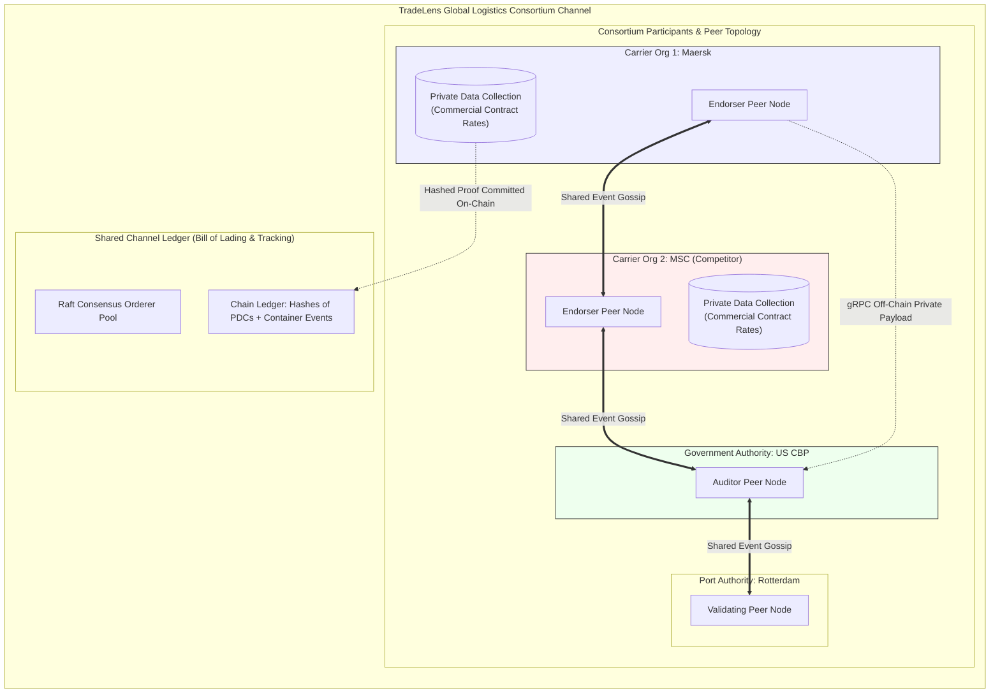

# UNIT 4 — Enterprise & Private Blockchains 🏢

**Syllabus weightage:** 7 hrs / 20% | **Related practicals:** none directly (conceptual + P07-style tools)
**Star guide:** ⭐ = likely · ⭐⭐ = very likely · ⭐⭐⭐ = practically guaranteed in some form

---

## 🧭 Chapter Roadmap

```
UNIT 4: Enterprise & Private Blockchains
├── 4.1 Hyperledger Fabric
│     ├── 4.1.1 Public vs Private (Permissioned) Blockchains  ⭐⭐⭐ (asked every year)
│     ├── 4.1.2 Hyperledger architecture: Peers, Orderers, Channels  ⭐⭐
│     └── 4.1.3 Introduction to Chaincode                      ⭐
├── 4.2 Enterprise Use Cases
│     ├── 4.2.1 Supply Chain Management — tracking provenance  ⭐
│     ├── 4.2.2 Blockchain in Healthcare — secure patient records ⭐
│     └── 4.2.3 Identity Management — Self-Sovereign Identity  ⭐
└── Bonus exam topics in this zone:
      ├── Hyperledger projects / layers (Sawtooth, Indy, Fabric, ...)  ⭐⭐
      ├── Hyperledger advantages & disadvantages                 ⭐⭐⭐
      └── Sidechain                                             ⭐⭐
```

### Learning outcomes — after this unit you can:
- Contrast **public vs permissioned (private)** blockchains on access, identity, speed, trust
- Explain **Hyperledger Fabric** architecture — peers, orderers, channels — and what **chaincode** is
- List Hyperledger projects/layers and weigh Hyperledger's advantages vs disadvantages (repeated 3×)
- Describe enterprise use cases: supply chain, healthcare, and Self-Sovereign Identity
- Define a **sidechain** with its two-way peg (a favourite diagram question)

---

## 4.1 Hyperledger Fabric

### 4.1.1 Public vs Private (Permissioned) Blockchains ⭐⭐⭐

| Criterion | Public (permissionless) | Private (permissioned) |
|---|---|---|
| Who can read | Anyone | Only authorized members |
| Who can transact | Anyone (pseudonymous) | Only vetted participants |
| Identity | Pseudonymous keys | Known identities / certificates |
| Consensus | PoW / PoS (open) | Practical BFT / Raft among peers |
| Speed | Slow (Bitcoin ~7 TPS, ETH ~15–30 TPS) | Fast (thousands of TPS) |
| Energy | Very high | Low (no mining) |
| Trust model | Trustless, game-theoretic | Trust between known parties |
| Privacy | Transactions public | Data visible only to members |
| Examples | Bitcoin, Ethereum | Hyperledger Fabric, CORDA, Quorum |
| Best for | Open money & global apps | Regulated enterprises & consortia |

**Why enterprises choose permissioned:** GDPR/data confidentiality (patient records, trade secrets), throughput, deterministic settlement, and accountable known actors — a government or bank chain **cannot** let anonymous miners validate patient data.

### 4.1.2 Hyperledger Architecture: Peers, Orderers, and Channels ⭐⭐

**Hyperledger** = an open-source family of enterprise blockchains hosted by the **Linux Foundation** (not a single product). Its flagship framework is **Fabric**. Fabric's architecture separates *who endorses a transaction* from *who orders it*:



- **Peers** — store the ledger and run **chaincode** (smart contracts). Peers *endorse* transactions by simulating them and signing the proposed result.
- **Orderers** — sort transactions and cut them into blocks; they never execute code, only sequence (this is Fabric's **"execute-order-validate"** model, unlike Ethereum's execute-everywhere).
- **Channels** — private sub-networks; only members of a channel see its data. Competitors can share one Fabric network yet keep separate channels (e.g. buyer–supplier channel vs regulator channel).
- **Membership Service Provider (MSP)** — the identity/authorization backbone: X.509 certificates decide who belongs to an organization and what they may do.

### 4.1.3 Introduction to Chaincode ⭐

- **Chaincode** = Hyperledger's name for a smart contract: a program (Go, Node.js, Java) that reads/updates the ledger state through the Fabric SDK API.
- It runs in a **sandboxed container**, separate from the peer, for isolation.
- `PUT_STATE` / `GET_STATE` operate on key–value world state; every change is also appended to the **blockchain** for auditability (a dual ledger: *world state* for speed + *blockchain* for history).

---

## 4.2 Enterprise Use Cases

### 4.2.1 Supply Chain Management: Tracking Provenance ⭐

- Each product move = a transaction; each handler (farmer → processor → distributor → retailer) writes a signed record.
- Result: an **immutable provenance trail** — origin, certifications, temperature history, customs — visible to all permissioned members.
- **Value:** instant authenticity checks (stops counterfeit goods), dispute-free recalls, audit compliance, and consumer trust (scan-to-verify).
- Famous implementation: **Walmart + IBM Food Trust** traced a mango from farm to store in *seconds* instead of a week.

### 4.2.2 Blockchain in Healthcare: Secure Patient Records ⭐

- Patient data lives in silos across hospitals; patients don't own it.
- A permissioned chain gives **patient-controlled access**: the patient's record is referenced on-chain, with **consent-based sharing** via keys — no hospital can expose another's data.
- **Benefits:** patient-held identity, tamper-proof audit trail of who accessed what, interoperability between providers, clinical-trial data integrity.
- **Constraints (why it stays permissioned):** GDPR/DPDP compliance, on-chain storage of raw records is undesirable — store *hashes + pointers*, not the data itself.

### 4.2.3 Identity Management: Self-Sovereign Identity (SSI) ⭐

- **SSI:** you own your digital identity; no central authority (govt, bank, Google) controls it.
- A **verifiable credential** (e.g. your degree) is issued by a trusted issuer, signed cryptographically, and stored in your **digital wallet**.
- You present it to a verifier who checks the signature **without calling the issuer** — decentralized, private, portable.
- Blockchain anchors the issuer's public keys / revocation lists so trust is auditable. Example: Aadhaar-linked but *not* Aadhaar-held — SSI decouples identity from the issuing database.



---

## 🧠 Deep-Dive Topics

### Deep Dive A: Hyperledger's "execute-order-validate" vs Ethereum's model
- **Ethereum:** every node executes every tx → deterministic but slow.
- **Fabric:** only the *endorsing peers* simulate the tx (execute) → the **orderer** sequences (order) → peers check endorsements against the channel policy before committing (validate). Result: near-linear scaling and privacy because non-members never see the tx. This is why Fabric reaches thousands of TPS where Ethereum reaches tens.

### Deep Dive B: Hyperledger projects & layers (asked as "list" 3-marker)
- **Frameworks:** **Fabric** (general enterprise, permissioned), **Sawtooth** (modular, PoET consensus), **Besu** (Ethereum-compatible enterprise client), **Indy** (self-sovereign identity), **Iroha** (mobile-friendly, simple assets).
- **Tooling:** **Caliper** (benchmarking), **Bevel** (devOps deployment), **Cactus** (cross-blockchain integration), **Avalon** (off-chain trusted compute).
- **Hyperledger technology layers** (S26 Q.4-alt(a)): (1) **Consensus layer** (agreement on order), (2) **Smart contract / chaincode layer** (business logic), (3) **Communication layer** (P2P gossip), (4) **Data store abstraction** (ledger storage), (5) **Identity management** (MSP/crypto), (6) **Policy management** (endorsement policies).

### Deep Dive C: Sidechain — definition, two-way peg, use cases (the 7-marker)
- **Definition:** a separate blockchain that runs **parallel** to a main chain and is **pegged** to it, letting assets move back and forth while the sidechain does things the main chain can't (faster blocks, cheaper fees, new features).
- **Two-way peg mechanism:**
  1. You send main-chain coins to a **locked address** (they're frozen on the main chain).
  2. A proof-of-lock is relayed to the sidechain → equivalent tokens are minted there.
  3. You use/settle on the sidechain.
  4. To return: burn the sidechain tokens → proof relayed back → main chain unlocks your coins.
- **Uses:** scaling (move load off the main chain), experimenting with new features without risking mainnet, cheaper micro-transactions. Example: Liquid Network (sidechain of Bitcoin); Polygon was a "sidechain-style" scaling solution for Ethereum.

### Deep Dive D: Public vs permissioned — the "why not just a database?" exam answer
Why does an enterprise need a blockchain and not a shared SQL database? Because a consortium has **no single trusted operator** — competitors won't let one party own the DB. A permissioned chain gives: (1) *multi-party trust* via consensus, (2) *immutable audit trail* no member can rewrite, (3) *cryptographic identity* and granular channel privacy. That's the honest answer examiners look for — it's not about decentralization, it's about **shared trust among rivals**.

---

## 🚀 Beyond the Textbook (what most classes won't tell you)

- **Hyperledger is a Linux Foundation project, not a company** — "Hyperledger" ≠ "one blockchain"; it's ~10 sibling projects.
- **Permissioned ≠ private in the sense you think:** *permissioned* means who can join/transact is controlled; *private* means who can *see data* is controlled (via channels). Fabric is both, but the two words aren't synonyms.
- **Enterprises rarely use PoW** — they use **PBFT/Raft** because members are known and settlement must be instant, not probabilistic.
- **The 51% attack is basically irrelevant to permissioned chains** — you can't rent hashrate to attack a chain where validators are vetted companies.
- **Real supply-chain chains are boring and that's the point** — most of the "blockchain" value is the shared, tamper-proof audit log, not crypto tokens.

---

## 📝 PYQ Map — UNIT 4 (all available papers)

| Paper | Q. | Topic | Marks |
|---|---|---|---|
| **Winter 2024** | Q.2(b) | Public blockchain — advantages & disadvantages | 4 |
| | Q.2(b)-alt | Private blockchain — advantages & disadvantages | 4 |
| | Q.2(a)-alt | Short note: Sidechain | 3 |
| | Q.4(a) | Describe Byzantine Fault Tolerance | 3 |
| | Q.5(c) | Hyperledger — explain with advantages & disadvantages | 7 |
| **Summer 2025** | Q.4(a) | Types of Hyperledger projects | 3 |
| | Q.2(b)-alt | Sidechain in detail | 4 |
| | Q.5(b)-alt | Advantages & disadvantages of Hyperledger | 4 |
| **Summer 2026** | Q.2(a) | Define & explain permissioned blockchain | 3 |
| | Q.4(a) | List types of Hyperledger projects | 3 |
| | Q.4(a)-alt | List Hyperledger technology layers | 3 |
| | Q.5(a) | Advantages of Hyperledger | 3 |
| | Q.5(a)-alt | Key features & applications of CORDA | 3 |
| **Summer 2024** | Q.2(a) | Define & explain permissionless blockchain | 3 |
| | Q.2(a)-alt | Define & explain permissioned blockchain | 3 |
| | Q.2(c)-alt | Sidechain in detail with diagrams | 7 |
| | Q.4(a) | Define Merkle Tree and Hyperledger | 3 |
| | Q.4(a)-alt | List types of Hyperledger projects | 3 |
| | Q.4(b)-alt | Explain PBFT in detail | 4 |

### ✅ Solved PYQ answers (UNIT 4)

**W24 Q.5(c) — Explain Hyperledger with its advantages and disadvantages (7 marks).**
> **Hyperledger** is an open-source umbrella of enterprise blockchain frameworks and tools hosted by the Linux Foundation, designed for **permissioned** business networks. Flagship frameworks include **Fabric**, **Sawtooth**, **Besu**, **Indy** and **Iroha**; Fabric is the most used. It uses a **peer–orderer architecture** with **channels** for private data, **MSP certificates** for identity, and **chaincode** (Go/Node/Java) for business logic, following an **execute-order-validate** consensus model. **Advantages:** (1) *Permissioned access* — only vetted organizations participate, enabling GDPR/DPDP-compliant data handling; (2) *Privacy* — channels keep data visible only to authorized members; (3) *High performance* — thousands of TPS since there is no mining/PoW; (4) *Modularity* — pluggable consensus, identity, and storage; (5) *Enterprise support* — backed by IBM/Walmart ecosystem (Food Trust, TradeLens lineage); (6) *Known identities* — accountability via certificates. **Disadvantages:** (1) *Complex setup* — steep learning curve and heavy devOps (Docker, ordering service, MSP); (2) *Less decentralization* — trust is concentrated in the consortium members; (3) *No native cryptocurrency* — token-less design limits open incentive models; (4) *Smaller developer/tooling ecosystem* than public chains; (5) *Membership centralization* — the MSP itself is a trust anchor that must be protected.

**S26 Q.5(a) — Advantages of Hyperledger (3 marks).** — take any 3: permissioned access, channel-based privacy, high throughput (no PoW), modular pluggable architecture, known/accountable identities, Linux Foundation backing, production-proven in supply chain & banking.

**S25 Q.2(b)-alt — Explain sidechain in detail (4 marks).** — see Deep Dive C: definition, two-way peg (lock on main → mint on side → burn to return → unlock), and use cases (scaling, experimentation, cheap micro-tx). A 4-marker wants the definition + the peg flow; a 7-marker adds the diagram.

**S24 Q.2(a)-alt — Define & explain permissioned blockchain (3 marks).**
> A **permissioned blockchain** restricts who may join the network and participate in consensus. Participants are **pre-vetted** organizations or individuals who receive **cryptographic identities (certificates)**; a membership service decides who can read, write, and validate. Consensus is run by a small set of trusted validators (often PBFT or Raft), which makes it **fast and low-energy** compared to public chains. Because identities are known, data can be kept **confidential to specific members** (via channels). Examples: **Hyperledger Fabric** and **CORDA**. Trade-off: less decentralization and openness, but far better for regulated enterprise use (banking, healthcare, supply chains) where accountability and privacy are mandatory.

**S24 Q.4(b)-alt — Explain Practical Byzantine Fault Tolerance (PBFT) in detail (4 marks).**
> **PBFT** is a consensus algorithm for **permissioned** networks that tolerates up to `f` faulty/malicious nodes among `3f+1` total. It works in **phases**: (1) **Pre-prepare** — the primary node proposes an ordered block/request to all replicas; (2) **Prepare** — each replica broadcasts that it accepts the proposal; (3) **Commit** — a replica commits when it sees `2f+1` prepare messages, then broadcasts commit; (4) **Execute** — nodes apply the block when `2f+1` commits arrive. Because there are **no proofs-of-work**, PBFT reaches **instant, deterministic finality** (no probabilistic confirmations), at the cost of O(n²) message overhead — which is fine for tens of validators but not for thousands of anonymous nodes. Used by Hyperledger Fabric, CORDA, and Tendermint-style chains.

**S26 Q.5(a)-alt — Key features & applications of CORDA (3 marks).**
> **CORDA** (R3) is an enterprise blockchain designed for **regulated industries**, especially finance. **Key features:** (1) *Peer-to-peer data sharing* — transactions are seen only by the involved parties, not broadcast to the network (unlike Fabric's ledger-everywhere model); (2) *Notary clusters* provide uniqueness validation (double-spend prevention) without seeing transaction data; (3) *Legal prose + smart contract* — every state carries legal language enforceable in court; (4) *Modelled on accounting* — states move like obligations, using a UTXO-style model. **Applications:** trade finance, cross-border payments, syndicated lending, and central-bank digital currency (CBDC) pilots.

---

## ✍️ Practice Problems (self-test — answers upside-down)

1. (3) Differentiate public and permissioned blockchain on *any three* criteria.
2. (4) Explain the roles of peers, orderers, and channels in Hyperledger Fabric.
3. (7) Explain sidechain with a two-way peg diagram and its applications.
4. (3) What is chaincode? How is it different from a normal smart contract deployment?
5. (4) Why do enterprises pick permissioned chains over public chains despite losing decentralization?
6. (3) List any three Hyperledger frameworks with a one-line purpose each.
7. (4) Explain Self-Sovereign Identity with a simple flow.
8. (3) What is PBFT and how many faulty nodes can it tolerate with 10 total?

<details>
<summary>**Click for answers**</summary>

1. Access (anyone vs vetted), identity (pseudonymous vs certificates), consensus (PoW/PoS vs PBFT/Raft), speed/energy (slow+high vs fast+low), privacy (public data vs channel-limited). Examples: Ethereum vs Fabric.
2. Peers store the ledger and run chaincode (endorsing); orderers sequence transactions into blocks without executing them; channels are private sub-networks whose data is visible only to their members.
3. See Deep Dive C — definition, lock→mint→burn→unlock peg, and scaling/experimentation/cheap-tx use cases.
4. Chaincode is Hyperledger's smart contract (Go/Node/Java), run in a sandboxed container, executed only by endorsing peers under execute-order-validate — not by every node globally like Ethereum.
5. Known accountable actors, confidential channel-level data (GDPR), high throughput, deterministic settlement, and a shared-trust model among competitors with no single DB owner.
6. Fabric (general enterprise), Sawtooth (modular/PoET), Besu (Ethereum-compatible enterprise), Indy (SSI identity), Iroha (simple mobile assets).
7. Issuer signs a verifiable credential → stored in your wallet → you present to a verifier → verifier checks the signature against the issuer's on-chain public key, no central lookup.
8. PBFT tolerates `f` faults where `n = 3f+1`; with 10 nodes, f = 3 → tolerates 3 faulty/malicious nodes.

</details>

---

## 📖 Glossary of Key Terms

| Term | One-line meaning |
|---|---|
| Permissioned blockchain | Network where joining & validating require prior authorization |
| Hyperledger | Linux Foundation's open-source family of enterprise blockchain tools |
| Fabric | Hyperledger's flagship permissioned framework |
| Peer | Node that stores the ledger & runs chaincode |
| Orderer | Node that sequences transactions into blocks |
| Channel | Private sub-network isolating data between members |
| MSP | Membership Service Provider — certificate-based identity/authorization |
| Chaincode | Hyperledger's smart contract (Go/Node/Java) |
| PBFT | Practical Byzantine Fault Tolerance — instant-finality permissioned consensus |
| Sidechain | Parallel chain pegged to a main chain via two-way peg |
| Two-way peg | Lock-on-main / mint-on-side / burn-to-return mechanism |
| SSI | Self-Sovereign Identity — user-owned verifiable identity |
| Verifiable credential | Signed digital claim you can present without the issuer |
| CORDA | R3's enterprise chain for regulated finance |

---

## 🔗 Curated Resources (per concept)

- **Hyperledger Fabric docs (official):** https://hyperledger-fabric.readthedocs.io/
- **Fabric architecture (peers/orderers/channels):** https://hyperledger-fabric.readthedocs.io/en/latest/arch_overview.html
- **Hyperledger project list:** https://www.hyperledger.org/projects
- **PBFT paper:** Castro & Liskov, "Practical Byzantine Fault Tolerance" (1999), MIT
- **Sidechains (EIP-3000 / Liquid):** https://blockstream.com/liquid/
- **SSI:** W3C Verifiable Credentials spec — https://www.w3.org/TR/vc-data-model/
- **Walmart Food Trust case study:** IBM Hyperledger case studies

---

## 🎥 Video Study Guide (YouTube)

> Your video path for the whole unit — exact keywords to search + channels you can trust.

### 🧑‍🎓 Step 0 — Pick your learning style

| Style | You learn best by | Your path through this unit |
|---|---|---|
| 🎧 **Listener** | short, clear explainers | 1 explainer per topic in the table below |
| 🛠️ **Builder** | hands-on systems | Try Fabric's official *first-network* tutorial in Docker |
| 🔧 **Tinkerer** | experimenting & demos | Spin up Fabric test-network, run chaincode samples |
| 🧠 **Deep Diver** | full theory, "why" | Playlists at the bottom |
| 🧭 **Explorer** | breadth & curiosity | Start with "what is hyperledger" explainers |
| 🎓 **Academic** | exam marks | Revision videos → grind the PYQ map above |

### 🎬 Step 1 — Watch by topic (search these on YouTube)

| Topic | YouTube search keywords (copy-paste ready) | Best channels | Style served |
|---|---|---|---|
| Public vs private/permissioned | `public vs private blockchain` · `permissioned vs permissionless blockchain` · `why enterprises use blockchain` | Simply Explained, 101 Blockchains, Coin Bureau | 🎓 Academic |
| What is Hyperledger | `what is hyperledger` · `hyperledger fabric vs ethereum` · `hyperledger explained` | 101 Blockchains, Finematics, IBM Cloud | 🧭 Explorer |
| Fabric architecture | `hyperledger fabric architecture peers orderers channels` · `fabric explained` · `hyperledger fabric consensus` | IBM Technology, 101 Blockchains | 🧠 Deep Diver |
| Chaincode | `hyperledger fabric chaincode tutorial` · `write chaincode go` · `fabcar chaincode` | IBM Technology, freeCodeCamp | 🛠️ Builder |
| Fabric hands-on | `hyperledger fabric first network tutorial` · `run hyperledger fabric test network` · `fabric docker tutorial` | IBM Cloud, CodePulse | 🔧 Tinkerer |
| PBFT & consensus | `practical byzantine fault tolerance explained` · `pbft consensus` · `raft vs pbft` | Martin Kleppmann, Distributed Systems channels | 🧠 Deep Diver |
| Sidechains | `sidechain vs mainchain` · `two way peg bitcoin` · `liquid network explained` · `sidechain scaling` | Finematics, Coin Bureau | 🎓 Academic |
| Supply chain & healthcare use cases | `blockchain supply chain explained` · `walmart blockchain food trust` · `blockchain healthcare patient records` | IBM Technology, Simply Explained | 🧭 + 🎧 |
| Self-sovereign identity | `self sovereign identity explained` · `what is ssid` · `verifiable credentials explained` | 101 Blockchains, Simply Explained | 🎧 + 🎓 |
| Whole-unit revision | `hyperledger and private blockchain full course` · `enterprise blockchain exam revision` · `blockchain for business lecture` | MIT OCW, freeCodeCamp, Gate Smashers, Neso Academy | 🎓 Academic |

### 🎬 Step 2 — Full playlists (for Deep Divers & Academics)

1. **"IBM Technology — Blockchain explained"** — the *enterprise* mindset behind this whole unit.
2. **"Hyperledger — Fabric tutorials"** (official channel) — build the `test-network` and `fabcar` yourself if you're a Builder.
3. **"MIT 15.S12 — permissioned & enterprise lectures"** — the rigorous version of this unit.

### 🎬 Step 3 — Proof you got it (5 min)

- Say the 6-row public-vs-permissioned table from memory.
- Draw peer/orderer/channel layout and the two-way-peg sidechain flow.
- Explain to a friend why a bank would *never* put patient records on a public chain.

---

*Next: [[Unit 5 — Security Emerging Trends Green Energy|UNIT 5 — Security, Emerging Trends & Green Energy]]*

---


---

## 📖 Historical Context & Motivation

As public blockchains gained global traction, financial institutions, global supply chain consortiums, and healthcare organizations recognized the transformative potential of immutable, shared ledger technology. However, early corporate trials attempting to deploy enterprise systems onto public networks like Bitcoin and Ethereum encountered insurmountable technical, legal, and operational barriers:
1. **Confidentiality & Statutory Compliance**: Public blockchains expose all transaction payloads, contract parameters, and account balances to every network node. This violates strict statutory privacy frameworks, including the EU General Data Protection Regulation (GDPR "right to be forgotten") and HIPAA medical privacy laws.
2. **Performance & Determinism**: Public Proof-of-Work and Proof-of-Stake protocols suffer from probabilistic finality (risk of temporary chain reorganizations), high transaction latency, and volatile gas cost economics.
3. **Identity & Governance**: Regulated enterprises cannot permit anonymous, unvetted external nodes to validate institutional state transitions or settle high-value inter-bank clearings.

To address these enterprise requirements, the Linux Foundation established the **Hyperledger Project** in December 2015. Rather than utilizing open, tokenized consensus models, enterprise frameworks like **Hyperledger Fabric** introduced permissioned network architectures governed by Membership Service Providers (MSPs) and PKI digital identities. By replacing public mining with deterministic BFT/Raft consensus and isolating sub-network state inside private **Channels**, enterprise blockchains enabled confidential, high-throughput ($>3,000\text{ TPS}$), legally compliant business-to-business networks.

---

## 🔬 Deep Dive: System Architecture

### Hyperledger Fabric Execute-Order-Validate (EOV) Architecture, Channel Cryptography, and MVCC Validation

Hyperledger Fabric fundamentally departs from the traditional "Order-then-Execute" architecture used by public blockchains, employing an **Execute-Order-Validate (EOV)** execution model paired with cryptographic channel isolation and versioned state validation.

#### 1. Public vs. Enterprise Execution Models



- **Order-then-Execute (Ethereum/Bitcoin)**: Transactions are first broadcast to miners/validators, ordered into blocks, and subsequently executed sequentially by every node in the network. This creates severe performance bottlenecks and forces all smart contracts to be non-deterministic and universally visible.
- **Execute-Order-Validate (Hyperledger Fabric)**: Decouples smart contract execution from consensus block ordering. Execution occurs in parallel prior to block ordering; consensus nodes (Orderers) sequence signed execution results without reading smart contract logic; validating peers commit verified state changes in parallel.

#### 2. The Three-Phase EOV Workflow

##### Phase 1: Execution (Endorsement Phase)
1. **Transaction Proposal**: A client application constructs a proposal to invoke chaincode (smart contract) and signs it using its X.509 cryptographic identity assigned by the Membership Service Provider (MSP).
2. **Simulation**: The client submits the proposal to specific **Endorsing Peers** defined by the target chaincode’s **Endorsement Policy** (e.g., $\text{AND}(\text{Org1.peer}, \text{Org2.peer})$).
3. **Read-Write Set Generation**: Endorsing peers execute the chaincode inside isolated Docker containers over their local copy of the World State (LevelDB or CouchDB). Peers do *not* mutate their local database. Instead, they record all state keys read and modified into a **Read-Write Set ($\text{RW-Set}$)**:
   $$\text{RW-Set} = \langle R_{\text{set}}, \, W_{\text{set}} \rangle$$
   where $R_{\text{set}} = \{ (K_i, v_i) \}$ (key $K_i$ and version tuple $v_i$) and $W_{\text{set}} = \{ (K_j, \text{val}_j) \}$ (key $K_j$ and new value $\text{val}_j$).
4. **Endorsement Signature**: The peer cryptographically signs the proposal response $(\text{RW-Set}, \text{ExecResult})$ and returns it to the client.

##### Phase 2: Ordering Phase
1. **Payload Assembly**: The client collects proposal responses from endorsers. Once the collected signatures satisfy the Endorsement Policy, the client packages them into a transaction payload and submits it to the **Ordering Service**.
2. **Consensus & Block Cutting**: The Ordering Service (operating Raft or BFT consensus) receives transactions from multiple clients, sequences them into a strict chronological order, and groups them into blocks. Orderers do *not* execute chaincode or evaluate transaction contents—they only establish global sequence.

##### Phase 3: Validation and State Commitment (MVCC Check)
1. **Block Broadcast**: The Ordering Service broadcasts assembled blocks to all **Validating Peers** enrolled in the channel.
2. **Endorsement Policy Check**: Validating peers verify that the collected endorsement signatures in each transaction satisfy the chaincode's defined endorsement policy.
3. **Multi-Version Concurrency Control (MVCC) Validation**: To prevent double-spending and race conditions, the peer performs an MVCC version check for every key in the transaction's $R_{\text{set}}$:
   $$\forall (K_i, v_{\text{read}}) \in R_{\text{set}}, \quad \text{Assert } v_{\text{read}} == v_{\text{current}}(K_i)$$
   where $v_{\text{current}}(K_i)$ is the version number of key $K_i$ currently stored in the peer’s active World State DB.



4. **Bitmask Commitment**: If the MVCC check passes, the transaction is marked **VALID**, and its $W_{\text{set}}$ is committed to the World State DB. If the check fails (e.g., a prior transaction in the same block updated key $K_i$), the transaction is marked **INVALID**. Invalid transactions remain permanently written in the block ledger for audit trails but produce zero state changes in the World State DB.

#### 3. Channel Cryptography & Private Data Collections
- **Channels**: A channel is a private "blockchain within a blockchain" established between specific consortium members. Each channel maintains an independent ledger, World State, ordering protocol, and chaincode deployment. Nodes outside the channel cannot detect or decrypt channel traffic.
- **Private Data Collections (PDCs)**: When members on a single channel need to isolate sensitive data (e.g., trade prices), PDCs allow raw private data payloads to be transmitted peer-to-peer off-chain via gRPC, while only the cryptographic hash of the data is committed to the shared channel ledger as proof of state.

---

## 🏢 Real-World Case Study

### TradeLens Shipping Consortium & Walmart Food Trust on Hyperledger Fabric

#### The TradeLens Supply Chain Platform (IBM & Maersk)
Prior to blockchain integration, international container logistics relied on manual paper-based documentation (Bill of Lading, customs releases, health inspection certificates). A single shipment involving ocean carriers, port authorities, customs brokers, and inland freight could require over 200 distinct communication events, leading to costly administrative delays and vulnerability to fraud.



#### Technical Implementation Details
1. **Multi-Organization Consortium Topology**: TradeLens integrated competitors (such as Maersk and MSC), port operators, and global customs agencies (e.g., US Customs and Border Protection) into a single Hyperledger Fabric network.
2. **Channel Architecture & Commercial Confidentiality**: Competitor shipping lines operated endorser peers on shared channels to track container movements. However, to protect commercial pricing strategies, carriers utilized **Private Data Collections (PDCs)**. The contract price and client identity were hashed on-chain, while raw payload data was routed exclusively between the carrier, shipper, and relevant customs authority.
3. **Operational Results**: TradeLens tracked over 2.3 billion shipping events and 35 million digital documents, reducing shipping document processing times by up to $80\%$ and providing real-world proof of permissioned enterprise blockchain viability.

---

## 📝 End-of-Chapter Exercises

### Exercise 1: MVCC Race Condition & Read-Write Set Validation Trace
A Hyperledger Fabric World State database contains two keys: `Item_101` (Value: $100\text{ units}$, Version: $v_1$) and `Item_102` (Value: $50\text{ units}$, Version: $v_1$).

During Phase 1 execution, two client applications submit concurrent transactions $T_A$ and $T_B$ to endorsing peers:
- $T_A$ reads `Item_101` ($v_1$) and writes `Item_101 = 80`.
- $T_B$ reads `Item_101` ($v_1$) and `Item_102` ($v_1$), and writes `Item_102 = 130`.

The Ordering Service sequences both transactions into Block #42 in the order $\langle T_A, \, T_B \rangle$.

1. Write the explicit ReadSet $R_{\text{set}}$ and WriteSet $W_{\text{set}}$ structures for transaction $T_A$ and transaction $T_B$.
2. Trace the step-by-step MVCC validation algorithm executed by a validating peer when processing Block #42.
3. State whether transaction $T_A$ is marked **VALID** or **INVALID**, and explain why.
4. State whether transaction $T_B$ is marked **VALID** or **INVALID**, and explain why.
5. List the final values and version numbers of `Item_101` and `Item_102` committed to the World State DB after Block #42 completes.

### Exercise 2: Design of a Boolean Endorsement Policy
A pharmaceutical supply chain consortium includes four distinct organizations: Manufacturer ($\text{OrgM}$), Distributor ($\text{OrgD}$), Pharmacy ($\text{OrgP}$), and National Regulator ($\text{OrgR}$).

1. Construct the formal Hyperledger Fabric Endorsement Policy expression requiring approval from (Manufacturer AND Distributor) OR (Manufacturer AND Pharmacy), along with mandatory endorsement from the Regulator ($\text{OrgR}$).
2. A client application collects simulation responses signed by peers from $\text{OrgM}$, $\text{OrgD}$, and $\text{OrgP}$, but fails to acquire a signature from $\text{OrgR}$. Explain what occurs during Phase 3 validation when this transaction is processed by channel peers.

### Exercise 3: Sidechain Two-Way Peg Cryptographic Protocol
An enterprise platform uses a 4-of-7 Federated Multi-Signature Two-Way Peg to link an enterprise sidechain to the Ethereum mainchain.

1. Describe the step-by-step cryptographic sequence of events when a user moves $100\text{ Tokens}$ from the mainchain to the sidechain (Lock-and-Mint).
2. Describe the step-by-step sequence when burning tokens on the sidechain to unlock tokens on the mainchain (Burn-and-Unlock).
3. Calculate the minimum number of compromised federation nodes required for an attacker to steal all locked mainchain collateral.
4. Calculate the minimum number of offline federation nodes required to cause a Denial-of-Service (liveness failure) on the cross-chain bridge.

### Exercise 4: Public vs. Permissioned Blockchain System Evaluation
A national healthcare ministry is designing a national digital health record system. Compare a public Ethereum Layer-2 Rollup vs. a permissioned Hyperledger Fabric network across five structural metrics:
1. Data privacy compliance under statutory medical confidentiality laws (e.g., HIPAA / GDPR).
2. Maximum transaction throughput ($\text{TPS}$) and finality latency.
3. Cost predictability and fee stability.
4. Governance model and node operational identity.
5. Resilience against malicious consensus manipulation.

## ⚡ Quick Revision

> [!abstract]+ One-page summary — review this before the exam

> - **Hyperledger Fabric**
>   - **Public vs Private (Permissioned) Blockchains**
>   - **Hyperledger Architecture: Peers, Orderers, and Channels**
>   - **Introduction to Chaincode**
> - **Enterprise Use Cases**
>   - **Supply Chain Management: Tracking Provenance**
>   - **Blockchain in Healthcare: Secure Patient Records**
>   - **Identity Management: Self-Sovereign Identity (SSI)**
> - **Deep-Dive Topics**
>   - **Deep Dive A: Hyperledger's "execute-order-validate" vs Ethereum's model**
>   - **Deep Dive B: Hyperledger projects & layers (asked as "list" 3-marker)**
>   - **Deep Dive C: Sidechain — definition, two-way peg, use cases (the 7-marker)**
>   - **Deep Dive D: Public vs permissioned — the "why not just a database?" exam answer**
> - **🚀 Beyond the Textbook (what most classes won't tell you)**
> - **✍ Practice Problems (self-test — answers upside-down)**
> - **📖 Glossary of Key Terms**
>   - **🧑‍🎓 Step 0 — Pick your learning style**
>   - **🎬 Step 1 — Watch by topic (search these on YouTube)**

### 📌 Key Definitions

- **Peers** — store the ledger and run **chaincode** (smart contracts). Peers *endorse* transactions by simulating them and signing the proposed result.
- **Orderers** — sort transactions and cut them into blocks; they never execute code, only sequence (this is Fabric's **"execute-order-validate"** model, unlike Ethereum's execute-everywhere).
- **Channels** — private sub-networks; only members of a channel see its data. Competitors can share one Fabric network yet keep separate channels (e.g. buyer–supplier channel vs regulator channel).
- **Membership Service Provider (MSP)** — the identity/authorization backbone: X.509 certificates decide who belongs to an organization and what they may do.
- **immutable provenance trail** — origin, certifications, temperature history, customs — visible to all permissioned members.
- **patient-controlled access** — the patient's record is referenced on-chain, with **consent-based sharing** via keys — no hospital can expose another's data.
- **without calling the issuer** — decentralized, private, portable.
- **no single trusted operator** — competitors won't let one party own the DB. A permissioned chain gives: (1) *multi-party trust* via consensus, (2) *immutable audit trail* no member can rewrite, (3) *cryptographic identity* and granular channel privacy. That's the honest answer examiners look for — it's not about decentralization, it's about **shared trust among rivals**.
- **Enterprises rarely use PoW** — they use **PBFT/Raft** because members are known and settlement must be instant, not probabilistic.
- **S26 Q.5(a) — Advantages of Hyperledger (3 marks).** — take any 3: permissioned access, channel-based privacy, high throughput (no PoW), modular pluggable architecture, known/accountable identities, Linux Foundation backing, production-proven in supply chain & banking.
- **S25 Q.2(b)-alt — Explain sidechain in detail (4 marks).** — see Deep Dive C: definition, two-way peg (lock on main → mint on side → burn to return → unlock), and use cases (scaling, experimentation, cheap micro-tx). A 4-marker wants the definition + the peg flow; a 7-marker adds the diagram.
- **phases** — (1) **Pre-prepare** — the primary node proposes an ordered block/request to all replicas; (2) **Prepare** — each replica broadcasts that it accepts the proposal; (3) **Commit** — a replica commits when it sees `2f+1` prepare messages, then broadcasts commit; (4) **Execute** — nodes apply the block when `2f+1` commits arrive. Because there are **no proofs-of-work**, PBFT reaches **instant, deterministic finality** (no probabilistic confirmations), at the cost of O(n²) message overhead — which is fine for tens of validators but not for thousands of anonymous nodes. Used by Hyperledger Fabric, CORDA, and Tendermint-style chains.
- **"IBM Technology — Blockchain explained"** — the *enterprise* mindset behind this whole unit.
- **"MIT 15.S12 — permissioned & enterprise lectures"** — the rigorous version of this unit.

---

## 🧠 Active Recall

*Test yourself — click a question to reveal the answer. Try to answer BEFORE peeking!*

> [!question]- Q1: Define **Peers**.
> store the ledger and run **chaincode** (smart contracts). Peers *endorse* transactions by simulating them and signing the proposed result.

> [!question]- Q2: Define **Orderers**.
> sort transactions and cut them into blocks; they never execute code, only sequence (this is Fabric's **"execute-order-validate"** model, unlike Ethereum's execute-everywhere).

> [!question]- Q3: Define **Channels**.
> private sub-networks; only members of a channel see its data. Competitors can share one Fabric network yet keep separate channels (e.g. buyer–supplier channel vs regulator channel).

> [!question]- Q4: Define **Membership Service Provider (MSP)**.
> the identity/authorization backbone: X.509 certificates decide who belongs to an organization and what they may do.

> [!question]- Q5: Define **immutable provenance trail**.
> origin, certifications, temperature history, customs — visible to all permissioned members.

> [!question]- Q6: Define **patient-controlled access**.
> the patient's record is referenced on-chain, with **consent-based sharing** via keys — no hospital can expose another's data.

> [!question]- Q7: Define **without calling the issuer**.
> decentralized, private, portable.

> [!question]- Q8: Define **no single trusted operator**.
> competitors won't let one party own the DB. A permissioned chain gives: (1) *multi-party trust* via consensus, (2) *immutable audit trail* no member can rewrite, (3) *cryptographic identity* and granular channel privacy. That's the honest answer examiners look for — it's not about decentralization, it's about **shared trust among rivals**.

> [!question]- Q9: Define **Enterprises rarely use PoW**.
> they use **PBFT/Raft** because members are known and settlement must be instant, not probabilistic.

> [!question]- Q10: Define **S26 Q.5(a) — Advantages of Hyperledger (3 marks).**.
> take any 3: permissioned access, channel-based privacy, high throughput (no PoW), modular pluggable architecture, known/accountable identities, Linux Foundation backing, production-proven in supply chain & banking.

> [!question]- Q11: Explain **Hyperledger Fabric** in 3-4 sentences.
> *(Write your answer, then check the section above)*

> [!question]- Q12: Explain **Enterprise Use Cases** in 3-4 sentences.
> *(Write your answer, then check the section above)*

> [!question]- Q13: Compare: **Who can read** vs **Anyone** on the basis of Criterion.
> Who can read | Anyone | Only authorized members

> [!question]- Q14: Compare: **Who can transact** vs **Anyone (pseudonymous)** on the basis of Criterion.
> Who can transact | Anyone (pseudonymous) | Only vetted participants

> [!question]- Q15: Compare: **Identity** vs **Pseudonymous keys** on the basis of Criterion.
> Identity | Pseudonymous keys | Known identities / certificates


---

## 📇 Flashcards (Spaced Repetition)

> [!info] How to use
> Install the **Spaced Repetition** plugin → these cards auto-sync into your review queue.
> Format: Question on top, `?` separator, answer below.

#flashcards

What is **Peers**?
?
store the ledger and run **chaincode** (smart contracts). Peers *endorse* transactions by simulating them and signing the proposed result.

What is **Orderers**?
?
sort transactions and cut them into blocks; they never execute code, only sequence (this is Fabric's **"execute-order-validate"** model, unlike Ethereum's execute-everywhere).

What is **Channels**?
?
private sub-networks; only members of a channel see its data. Competitors can share one Fabric network yet keep separate channels (e.g. buyer–supplier channel vs regulator channel).

What is **Membership Service Provider (MSP)**?
?
the identity/authorization backbone: X.509 certificates decide who belongs to an organization and what they may do.

What is **immutable provenance trail**?
?
origin, certifications, temperature history, customs — visible to all permissioned members.

What is **patient-controlled access**?
?
the patient's record is referenced on-chain, with **consent-based sharing** via keys — no hospital can expose another's data.

What is **without calling the issuer**?
?
decentralized, private, portable.

What is **no single trusted operator**?
?
competitors won't let one party own the DB. A permissioned chain gives: (1) *multi-party trust* via consensus, (2) *immutable audit trail* no member can rewrite, (3) *cryptographic identity* and granular channel privacy. That's the honest answer examiners look for — it's not about decentralization, it's about **shared trust among rivals**.

What is **Enterprises rarely use PoW**?
?
they use **PBFT/Raft** because members are known and settlement must be instant, not probabilistic.

What is **S26 Q.5(a) — Advantages of Hyperledger (3 marks).**?
?
take any 3: permissioned access, channel-based privacy, high throughput (no PoW), modular pluggable architecture, known/accountable identities, Linux Foundation backing, production-proven in supply chain & banking.

What is **S25 Q.2(b)-alt — Explain sidechain in detail (4 marks).**?
?
see Deep Dive C: definition, two-way peg (lock on main → mint on side → burn to return → unlock), and use cases (scaling, experimentation, cheap micro-tx). A 4-marker wants the definition + the peg flow; a 7-marker adds the diagram.

What is **phases**?
?
(1) **Pre-prepare** — the primary node proposes an ordered block/request to all replicas; (2) **Prepare** — each replica broadcasts that it accepts the proposal; (3) **Commit** — a replica commits when it sees `2f+1` prepare messages, then broadcasts commit; (4) **Execute** — nodes apply the block when `2f+1` commits arrive. Because there are **no proofs-of-work**, PBFT reaches **instant, deterministic finality** (no probabilistic confirmations), at the cost of O(n²) message overhead — which is fine for tens of validators but not for thousands of anonymous nodes. Used by Hyperledger Fabric, CORDA, and Tendermint-style chains.

What is **"IBM Technology — Blockchain explained"**?
?
the *enterprise* mindset behind this whole unit.

What is **"MIT 15.S12 — permissioned & enterprise lectures"**?
?
the rigorous version of this unit.
