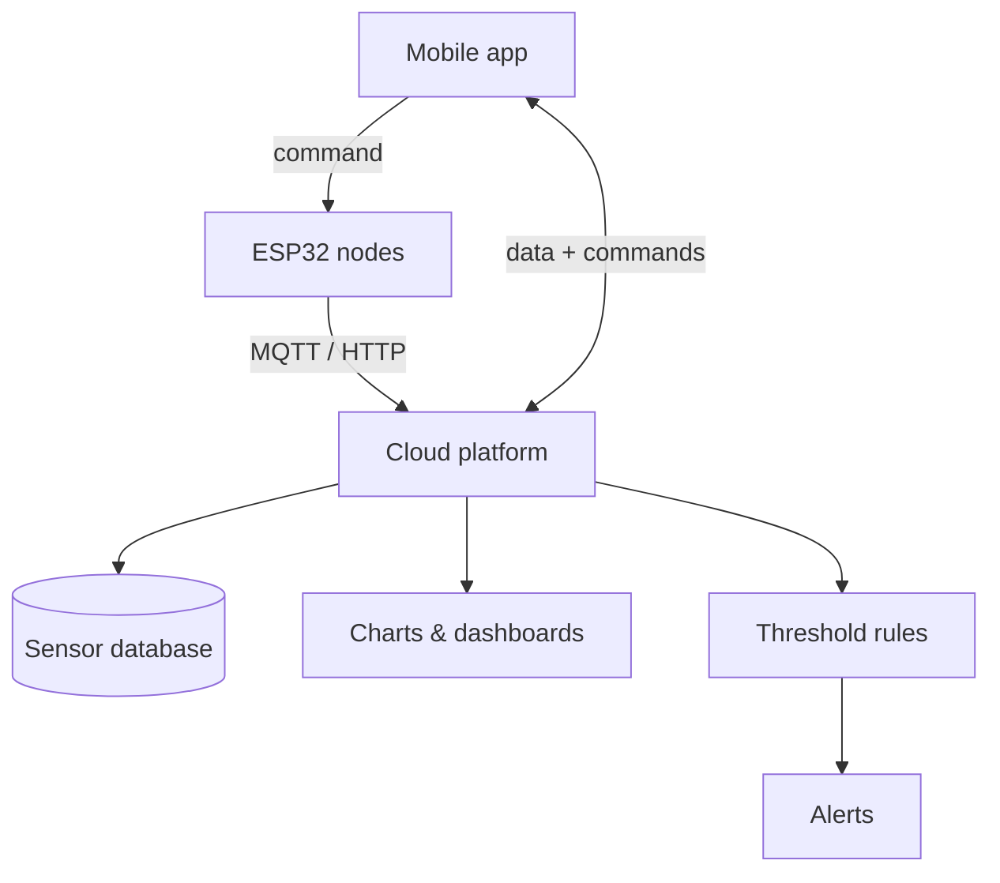
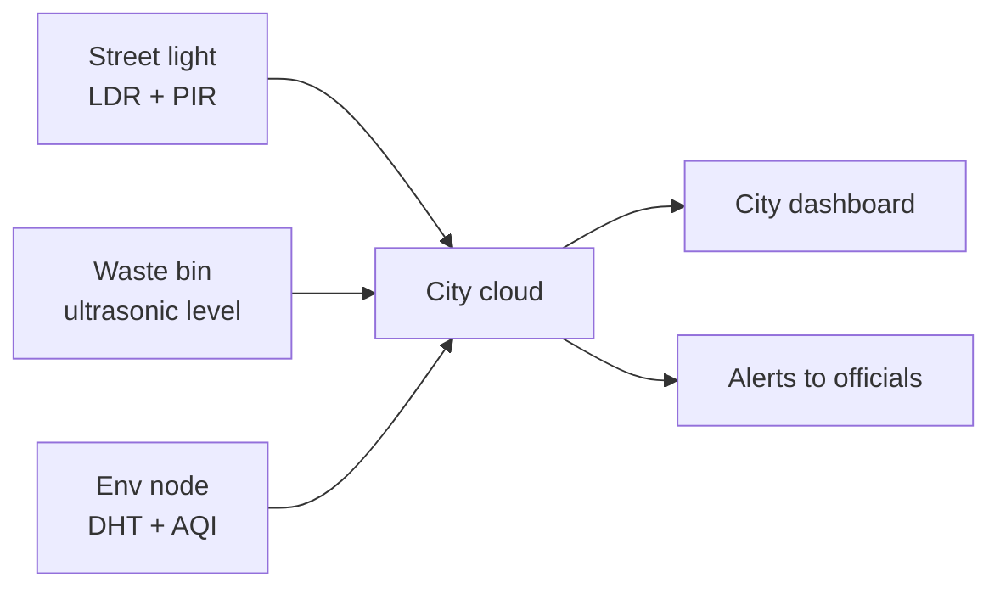
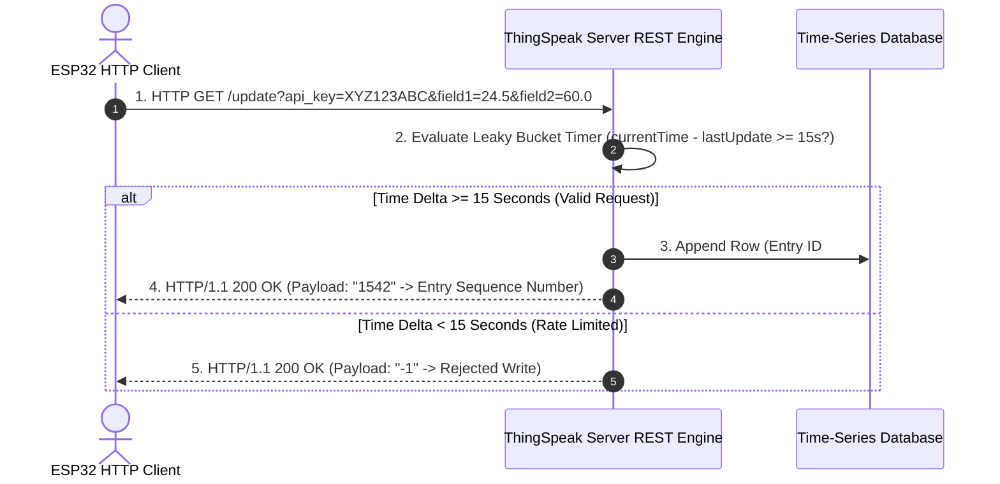
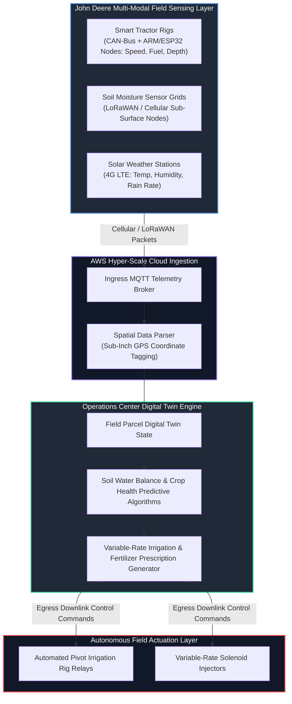

# UNIT 5 — IoT Cloud Platforms & Applications of IoT ☁️

> **Hands on Practice using IoT (DI05016071)** · **7 hrs · 20% weightage**
> **Covers syllabus sections:** 5.1 Cloud Computing (concept, public/private/hybrid) · 5.2 Role of Cloud in IoT · 5.3 Cloud Platforms (ThingSpeak, Blynk IoT, Arduino IoT Cloud) · 5.4 Categories of Applications (Consumer, Commercial, Industrial, Infrastructure, Medical) · 5.5 Smart Home · 5.6 Smart Agriculture · 5.7 Smart Health Monitoring · 5.8 Smart Parking · 5.9 Smart City (street lighting, waste, environmental monitoring)
> **Related practicals:** [[P10 — Thingspeak Http Temperature|P10]], [[P11 — Ultrasonic Thingspeak Cloud|P11]], [[P12 — Blynk Two Way Dashboard|P12]], [[P13 — Soil Moisture Dht Cloud Thresholds|P13]], [[P14 — Mini Project Smart Agriculture Guide|P14]]

---

## 🧭 Chapter Roadmap

20% weightage and **five practicals (P10–P14)** — the cloud unit is where the course turns from "sensors on a desk" into real IoT products. The exam loves the platform names, the application categories, and one specific smart application described end-to-end.

```
UNIT 5: Cloud Platforms & IoT Applications
├── 5.1 Introduction to Cloud Computing            ⭐⭐ (public/private/hybrid)
├── 5.2 Role of Cloud in IoT                       ⭐⭐ (the 4 reasons)
├── 5.3 IoT Cloud Platforms                        ⭐⭐⭐ (ThingSpeak · Blynk · Arduino IoT Cloud)
│     └── 5.3.1 Features + basic implementation (channel/datastream/widget)
├── 5.4 Categories of IoT Applications             ⭐⭐⭐ (5 categories table)
├── 5.5 Smart Home Automation                      ⭐⭐⭐
├── 5.6 Smart Agriculture System                   ⭐⭐⭐ (the P14 project!)
├── 5.7 Smart Health Monitoring                    ⭐⭐
├── 5.8 Smart Parking System                       ⭐⭐
└── 5.9 Smart City Applications                    ⭐⭐ (street lighting · waste · environment)
      └── 5.9.1-5.9.3 the three smart-city systems
```

### Learning outcomes — after this unit you can:
1. Define **cloud computing**, name the **three deployment types**, and state the **role of cloud in IoT**.
2. Compare **ThingSpeak, Blynk IoT and Arduino IoT Cloud** and describe the basic implementation flow of each.
3. Classify IoT applications into the **five categories** (Consumer/Commercial/Industrial/Infrastructure/Medical).
4. Describe **Smart Home, Smart Agriculture, Smart Health, Smart Parking** end-to-end (sensors → cloud → app).
5. Describe the three **Smart City** systems: street lighting, waste management, environmental monitoring.

---

## 5.1 Introduction to Cloud Computing ⭐⭐

> **Definition (memorize):** Cloud computing delivers **computing resources — servers, storage, databases, analytics, software — over the internet on demand**, paying only for what you use ("utility" computing).

**Three deployment types (the exam table):**

| Type | Who owns/manages it | Access | Example |
|---|---|---|---|
| **Public cloud** | A cloud provider (AWS, Azure, Google) | Open to anyone on the internet | ThingSpeak public channel |
| **Private cloud** | A single organisation, dedicated | Only that organisation | A hospital's private patient-data cloud |
| **Hybrid cloud** | Mix of public + private | Sensitive data on-premise, bursts to public | Bank: private ledger + public analytics |

> [!tip] Link to Unit 1 (CAP/architecture)
> the public cloud is a *centralised* system — the "Data Processing" layer of the 4-layer architecture (P01) lives here.

## 5.2 Role of Cloud in IoT ⭐⭐

Why the ESP32 cannot be the whole system:

| Role | What the cloud adds | Practical evidence |
|---|---|---|
| **Storage** | Stores years of sensor history | ThingSpeak fields (P10–P13) |
| **Processing/analytics** | Rules, ML, dashboards run there | Threshold React apps (P13) |
| **Visualization** | Graphs & dashboards accessible anywhere | ThingSpeak/Blynk widgets (P10–P12) |
| **Control/actuation** | Commands routed back to devices | Blynk virtual button (P12), MQTT control (P09) |
| **Scalability** | Millions of devices with one dashboard | — |



## 5.3 IoT Cloud Platforms ⭐⭐⭐ (the three syllabus platforms)

### 5.3.1 ThingSpeak
- **MathWorks** analytics platform; channel-based (up to **8 fields**), free tier.
- Data in via **HTTP GET/POST** (`/update?api_key=KEY&field1=value`) or **MQTT** (`mqtt.thingspeak.com`).
- **Rate limit:** one update per **15 s** (free).
- **Extra tools:** React (threshold-triggered alerts), MATLAB Analysis, public/private channels.
- **Implementation flow (P10/P11):** create channel → copy Write API Key → ESP32 sends `field1=temp` every 20 s → dashboard graphs appear.

### 5.3.2 Blynk IoT (Blynk 2.0)
- Mobile-first IoT platform with a **web console + mobile app**.
- **Template → Datastreams (virtual pins V0, V1…) → Devices → Widgets** (Gauge, Switch, Slider).
- Two-way by design: `Blynk.virtualWrite(V0, value)` up; `BLYNK_WRITE(V1)` down (P12).
- Firmware uses the **Blynk library** with `BLYNK_TEMPLATE_ID` / `BLYNK_AUTH_TOKEN`.

### 5.3.3 Arduino IoT Cloud
- Official Arduino platform; auto-generates **code from a dashboard**, based on **Thing Properties** (like Blynk datastreams).
- Device registered via the **Arduino IoT Cloud** web console; sketch built on the ESP32 core with `ArduinoIoTCloud` + `Arduino_ConnectionHandler` libraries.
- Great for people already at home in the Arduino IDE — you define properties, the IDE generates the connection skeleton.

| Criterion | ThingSpeak | Blynk IoT | Arduino IoT Cloud |
|---|---|---|---|
| Focus | Analytics & graphing | Two-way mobile control | Arduino-centric device cloud |
| Data input | HTTP / MQTT | MQTT (library) | MQTT (auto-generated) |
| Key concept | Channel/field | Template/datastream/widget | Thing/property |
| Best for | Graphs & analysis (P10–P13) | Phone control (P12, P14) | Beginners in Arduino ecosystem |
| Free tier | 15 s updates, 8 fields | Limited devices/datastreams | Limited properties |

## 5.4 Categories of IoT Applications ⭐⭐⭐

| Category | What it covers | Examples |
|---|---|---|
| **Consumer IoT** | Personal/domestic devices | Smart watches, smart speakers, smart-home lights |
| **Commercial IoT** | Business/retail/office | Smart vending machines, retail analytics, office HVAC |
| **Industrial IoT (IIoT)** | Factories/plants | Predictive maintenance, SCADA, robotic assembly |
| **Infrastructure IoT** | Cities & public utilities | Smart street lighting, water/waste grids |
| **Medical IoT** | Healthcare & wearables | Heart-rate monitors, connected infusion pumps, hospital asset tracking |

> [!tip] Viva link
> the P14 mini-project categories — Smart Home (consumer), Smart Agriculture (commercial/industrial), Smart Health (medical), Smart Parking + Smart City (infrastructure). Point at which category your project belongs to.

## 5.5 Smart Home Automation ⭐⭐⭐

**Goal:** comfort, security and energy savings in a home via automated sensing + remote control.

```
PIR (motion) ─┐
LDR (light) ──┼─► ESP32 ──► Blynk/cloud ──► phone app
DHT (climate) ┘                    │
                                   ▼
              "motion + dark" rule ──► relay ──► lights ON
              phone button ──────────► relay ──► fan/AC ON
```

| Component | Device | Practical basis |
|---|---|---|
| Occupancy | PIR sensor | P05 |
| Ambient light | LDR | P05 |
| Climate | DHT11/22 | P06 |
| Actuation | Relay-module lights/fan | P09, P12 |
| Control/dash | Blynk app | P12 |

## 5.6 Smart Agriculture System ⭐⭐⭐ (this is P14)

**Goal:** efficient irrigation — water only when the soil is actually dry.

```
Soil moisture ─┐
DHT temp/hum ──┼─► ESP32 ──► ThingSpeak/Blynk ──► farm dashboard
Ultrasonic (tank) ┘        │
              soil < 2000 ─┴──► relay ──► water pump ON (auto + manual override)
```

| Feature | Implementation |
|---|---|
| Sensing | Soil moisture (GPIO 34), DHT (GPIO 4), optional ultrasonic tank level |
| Decision | Threshold + hysteresis in the ESP32 (edge processing) |
| Actuation | Relay → water pump; manual override from phone (MQTT/Blynk) |
| Cloud | ThingSpeak graphs + alerts; Blynk for control |
| Benefits | ~30% water saved, remote farm monitoring |

> **Exam one-liner:** "Smart Agriculture closes the loop — sensor detects dry soil, the controller starts the pump, and the farmer watches it all from a phone." (Full walkthrough in [[P14 — Mini Project Smart Agriculture Guide|P14]].)

## 5.7 Smart Health Monitoring ⭐⭐

**Goal:** continuous vital-sign tracking with alerts instead of periodic manual checks.

- **Sensors:** heart-rate/SpO2 (MAX30100/MAX30102), body temp (DHT22/MLX90614), motion (PIR/accelerometer).
- **Device:** wearable ESP32/BLE node → cloud.
- **Cloud:** stores vitals, triggers alerts when HR > threshold; doctor sees trends.
- **Examples:** smart watches, elderly fall detection, connected insulin pumps, hospital patient monitoring.

## 5.8 Smart Parking System ⭐⭐

**Goal:** show real-time free/occupied slots and guide drivers, reducing traffic circling.

- **Sensing:** HC-SR04 or inductive loop per slot — `distance < threshold → occupied` (P07/P11 logic).
- **Device:** ESP32 per slot (or multi-slot node) → cloud.
- **Cloud/app:** map of the lot with green/red slots; automated barrier and payment.
- **Exam point:** "occupancy = distance below threshold" is a direct reuse of P11.

## 5.9 Smart City Applications ⭐⭐

### 5.9.1 Smart street lighting 💡
- **LDR** detects dusk → lights ON; **PIR** dims lights when nobody is nearby (P05 sensors!).
- LED lights + central dashboard per-strip; **saves up to 50% energy**.

### 5.9.2 Waste management 🗑️
- **Ultrasonic** inside each bin measures fill level (P11).
- When fill > 80% → alert topic → municipal dashboard lists bins needing pickup → optimised routes.

### 5.9.3 Environmental monitoring 🌦️
- **Weather nodes:** DHT22, rain sensor, air-quality sensor (MQ-135), LDR.
- Continuous upload to ThingSpeak → **predictive alerts** (high AQI, flooding risk, heat wave).



---

## 🧠 Deep-Dive Topics

### Deep Dive A: The ThingSpeak "field1" pipeline (P10–P13, memorise)
`ESP32 → HTTP GET http://api.thingspeak.com/update?api_key=KEY&field1=27.4 → ThingSpeak stores + graphs → dashboard widget`. The 15-second rate limit forces `INTERVAL = 20000` in the sketches; HTTP code 200 + entry-id confirms a successful write; `-1` means bad key/network. This pipeline appears in P10, P11 and P13 — describe it once, reuse it three times.

### Deep Dive B: Blynk's two-way virtual pins (P12)
Datastream V0 = sensor values **up** (`Blynk.virtualWrite(V0, t)`), datastream V1 = phone switch **down** (`BLYNK_WRITE(V1)` → `param.asInt()` → `digitalWrite`). This up/down split is *the* exam answer for "what makes a dashboard two-way?" — and the same pattern reappears in P14's pump control.

### Deep Dive C: Edge vs Cloud decisions (P13/P14)
Thresholds live in **two places**: on the ESP32 (instant, works offline — P13's `ALERT: Soil DRY`) and in the cloud (ThingSpeak React apps, works for all devices at once). Smart design puts *fast safety-critical* decisions at the edge and *analytics* in the cloud — a great "role of cloud" extension answer.

---

## 🚀 Beyond the Textbook

1. **All three platforms speak MQTT underneath.** ThingSpeak, Blynk and Arduino IoT Cloud are *clients* of MQTT brokers (or their own); the ESP32's `PubSubClient` (P08/P09) is the common substrate.
2. **Public brokers vs managed clouds:** `broker.emqx.io` is open (anyone can read your topics); ThingSpeak/Blynk add authentication and storage on top. That's the security difference between P09 and P10.
3. **The free tiers are the limit, not the hardware.** ThingSpeak's 15 s cap and Blynk's datastream limits are *platform* constraints — the ESP32 can publish far faster. Know which layer imposes the limit.
4. **Green IoT is a real angle:** LDR street lights, threshold-based irrigation and low-power deep-sleep nodes all cut energy — a strong line for any "challenges/sustainability" question.
5. **Digital twins** (a live virtual copy of the device state) are the industry extension of a dashboard — ThingSpeak/Blynk are tiny prototypes of that idea.

---

## 🎯 High-Yield Exam Topics (likely GTU-style questions)

1. Define **cloud computing** and explain **public, private, hybrid** clouds. (4–7 m) ⭐⭐⭐
2. Explain the **role of cloud in IoT**. (4 m) ⭐⭐⭐
3. Short note: **ThingSpeak** — channel, fields, API key, implementation. (7 m) ⭐⭐⭐ (≈ P10/P11)
4. Short note: **Blynk IoT** — template, datastreams, virtual pins, two-way control. (7 m) ⭐⭐⭐ (≈ P12)
5. Compare **ThingSpeak, Blynk and Arduino IoT Cloud**. (4 m) ⭐⭐
6. Short note: **categories of IoT applications** (five categories). (4 m) ⭐⭐⭐
7. Describe a **Smart Home Automation** system end-to-end. (7 m) ⭐⭐⭐
8. Describe a **Smart Agriculture** system end-to-end. (7 m) ⭐⭐⭐ (≈ P14)
9. Short note: **Smart Health Monitoring**. (4–7 m) ⭐⭐
10. Short note: **Smart Parking System**. (4 m) ⭐⭐
11. Short note: **Smart City applications** (street lighting, waste management, environmental monitoring). (7 m) ⭐⭐⭐
12. Why is the cloud needed when the ESP32 can already process data? (3–4 m) ⭐⭐

### ✅ Solved model answers (highest-yield)

**Q1. (4–7 m) — Cloud computing: concept + types.**
> Cloud computing delivers computing resources — servers, storage, databases, analytics, software — **over the internet on demand**, billed like a utility. **Public cloud** is owned and operated by a provider (AWS, Azure, Google) and shared by many tenants; **private cloud** is dedicated to a single organisation, giving more control and compliance; **hybrid cloud** combines both — sensitive workloads stay private while elastic workloads run in the public cloud. In IoT, the cloud forms the **data-processing and application layers** of the architecture: it stores sensor history, runs analytics and serves dashboards that the low-power ESP32 node cannot host itself.

**Q3. (7 m) — Short note: ThingSpeak with implementation.**
> ThingSpeak is a free **IoT analytics platform** from MathWorks built around **channels**, each holding up to **8 fields**. Implementation flow (used in P10/P11/P13): (1) create a channel and enable the required fields (e.g., Field 1 = Temperature); (2) copy the **Write API Key** from the API Keys tab; (3) the ESP32 uploads data via HTTP GET — `http://api.thingspeak.com/update?api_key=KEY&field1=27.4` — every 20 s (free tier allows one update per 15 s); (4) ThingSpeak stores each value and plots it on the field's chart; (5) extra features: **React apps** fire alerts when a value crosses a threshold, **MATLAB Analysis** runs custom computations, and channels can be made public or private. A successful write returns HTTP 200 with an entry id; a `-1` response indicates a bad key or throttling.

**Q7. (8 m) — Smart Home Automation end-to-end.**
> A smart home senses its environment, automates responses and allows remote control. **Sensing:** a PIR detects presence, an LDR measures ambient light, and a DHT11 tracks temperature/humidity — all read by an ESP32 (P05/P06). **Processing/decision:** the ESP32 applies rules such as "if motion AND light level low → turn on the light" (threshold logic). **Actuation:** a relay module switches the light/fan (P09/P12). **Cloud & app:** the ESP32 uploads readings to Blynk/ThingSpeak; the user sees a live dashboard and presses a virtual switch to control the appliance from anywhere (P12). **Benefits:** energy saving (lights off when nobody is home), comfort (climate control), and security (motion alerts). This is the **Consumer IoT** category of applications.

---

## ✍️ Practice Problems (self-test — answers hidden)

1. Public, private, hybrid cloud — one line each with an IoT example.
2. List four roles the cloud plays in an IoT system.
3. What is the ThingSpeak free-tier rate limit and how does it shape the sketch's `INTERVAL`?
4. Name the key concept of each platform: ThingSpeak ___, Blynk ___, Arduino IoT Cloud ___.
5. Which category of IoT does each P14 alternative fall into: smart parking, smart health, smart street lighting?
6. Describe Smart Agriculture in four steps (sense → decide → act → show).
7. How does a Blynk virtual button control a GPIO? Name the two Blynk API calls.
8. Give one sensor + one action for each smart-city system (lighting, waste, environment).

<details>
<summary>📌 Model solutions</summary>

1. Public — provider-owned, open (ThingSpeak public channel); Private — single organisation (hospital records); Hybrid — mix (bank private ledger + public analytics).
2. Storage, processing/analytics, visualization/dashboards, remote control/actuation, scalability.
3. One update per 15 s (free) → practical sketches use `INTERVAL = 20000` (20 s) to stay legal.
4. ThingSpeak → **channel/field**; Blynk → **template/datastream/widget**; Arduino IoT Cloud → **thing/property**.
5. Smart parking — infrastructure; smart health — medical; smart street lighting — infrastructure.
6. Sense (soil moisture + DHT) → decide (threshold + hysteresis on ESP32) → act (relay → pump) → show (ThingSpeak/Blynk dashboard + remote override).
7. `Blynk.virtualWrite(V0, value)` pushes sensor data up; `BLYNK_WRITE(V1)` + `param.asInt()` receives the button state down and calls `digitalWrite()`.
8. Lighting — LDR detects dusk → lights ON; Waste — ultrasonic fill level > 80% → pickup alert; Environment — DHT/AQI node → predictive alert.
</details>

---

## 📖 Glossary of Key Terms

| Term | Definition |
|---|---|
| **Cloud computing** | On-demand delivery of computing resources over the internet |
| **Public cloud** | Provider-owned, multi-tenant services (AWS, Azure) |
| **Private cloud** | Dedicated cloud for one organisation |
| **Hybrid cloud** | Combination of public + private |
| **ThingSpeak** | MathWorks IoT analytics platform (channels, 8 fields) |
| **Write API Key** | Secret that authenticates uploads to a channel |
| **Channel** | ThingSpeak container for up to 8 data fields |
| **React app** | ThingSpeak rule that triggers alerts on thresholds |
| **Blynk IoT** | Mobile-first two-way IoT platform (templates, datastreams) |
| **Datastream** | Blynk virtual pin (V0, V1…) with type/unit |
| **`BLYNK_WRITE(Vn)`** | Callback for commands arriving from the cloud |
| **`virtualWrite()`** | ESP32 → cloud value push |
| **Auth token** | Per-device secret for Blynk/Arduino IoT Cloud |
| **Arduino IoT Cloud** | Official Arduino platform (things, properties) |
| **Consumer IoT** | Personal/domestic devices |
| **Commercial IoT** | Retail/office/business systems |
| **Industrial IoT** | Factory/plant automation |
| **Infrastructure IoT** | City utilities and public systems |
| **Medical IoT** | Healthcare devices and wearables |
| **Smart Agriculture** | Sensor-driven irrigation/farming (P14) |
| **Smart Parking** | Occupancy detection for parking lots |
| **Smart street lighting** | LDR/PIR-based energy-saving lights |

---

## 🔗 Curated Resources (per concept)

**Cloud computing**
- Cloud computing basics (AWS): https://aws.amazon.com/what-is-cloud-computing/
- Public/private/hybrid (Google Cloud): https://cloud.google.com/learn/what-is-cloud-computing

**ThingSpeak (official)**
- ThingSpeak: https://thingspeak.com/
- ThingSpeak docs: https://docs.thingspeak.com/en/
- HTTP API reference: https://docs.thingspeak.com/en/reference/http/

**Blynk (official)**
- Blynk IoT: https://blynk.io/
- Blynk docs (quickstart): https://docs.blynk.io/en/
- Blynk library: https://github.com/blynkkk/blynk-library

**Arduino IoT Cloud (official)**
- Arduino IoT Cloud: https://cloud.arduino.cc/
- Arduino IoT Cloud docs: https://docs.arduino.cc/arduino-cloud/

**Applications (Smart Home / City / Health)**
- Smart agriculture systems (FAO/WMO): https://www.fao.org/3/ca6407en/ca6407en.pdf
- Smart city use cases: https://www.ibm.com/topics/smart-cities
- Digital health/IoMT: https://www.who.int/health-topics/health-and-digital-technologies

**Tutorials**
- ESP32 + ThingSpeak: https://randomnerdtutorials.com/esp32-thingspeak/
- ESP32 + Blynk: https://randomnerdtutorials.com/esp32-blynk-iot/
- ESP32 + Arduino IoT Cloud: https://randomnerdtutorials.com/esp32-arduino-iot-cloud/

**Books (from GTU syllabus)**
- David Hanes, *IoT Fundamentals: Networking Technologies, Protocols and Use Cases*, Cisco Press, 2017 — Part on IoT use cases & cloud.
- Arshdeep Bahga & Vijay Madisetti, *Internet of Things: A Hands-on Approach*, 2015 — cloud chapters.
- Adrian McEwen & Hakim Cassimally, *Designing the Internet of Things*, Wiley, 2014.

**Videos (high yield)**
- Random Nerd Tutorials ThingSpeak/Blynk playlists · edureka! IoT cloud tutorials · Simply Explained cloud computing.

---

## 🎥 Video Study Guide (YouTube)

> Don't like reading? Me neither. This is your **structured video path** for the whole unit — better than the syllabus because it tells you *exactly what to search* and *what to watch first*, in a sensible order. Everything below is search keywords (they never rot like links do) + channels you can trust.

### 🧑🎓 Step 0 — Pick your learning style

| Style | You learn best by | Your path through this unit |
|---|---|---|
| 🎧 **Listener** | short, clear explainers | Watch 1 explainer per topic from the table below (3–8 min each) |
| 🛠️ **Builder** | wiring things yourself | Watch the ThingSpeak/Blynk build-alongs → run [[P10 — Thingspeak Http Temperature|P10]]–[[P12 — Blynk Two Way Dashboard|P12]] |
| 🔧 **Tinkerer** | experimenting & demos | Watch demo videos → create your own channel/widgets and push values |
| 🧠 **Deep Diver** | full theory, "why" | Watch the whole-unit playlists at the bottom (university-level depth) |
| 🧭 **Explorer** | breadth & curiosity | Watch the "smart city / smart home" case-study videos first, then follow your curiosity |
| 🎓 **Academic** | exam marks | Watch the revision/GTU-style videos, then grind the High-Yield questions above |

### 🎬 Step 1 — Watch by topic (search these on YouTube)

| Topic | YouTube search keywords (copy-paste ready) | Best channels | Style served |
|---|---|---|---|
| Cloud computing basics | `cloud computing explained simply` · `public private hybrid cloud` · `what is the cloud` | Simply Explained, IBM Technology, PowerCert | 🎧 + 🧭 |
| Cloud + IoT | `role of cloud in iot` · `iot cloud architecture` · `why does iot need cloud` | edureka!, IBM Technology | 🎧 + 🎓 |
| ThingSpeak hands-on | `thingspeak tutorial esp32` · `thingspeak channel setup api key` · `send sensor data to thingspeak` | Random Nerd Tutorials, DroneBot Workshop, Core Electronics | 🛠️ Builder |
| ThingSpeak React & MATLAB | `thingspeak react app tutorial` · `thingspeak matlab analysis` | MathWorks, Paul McWhorter | 🔧 + 🧠 |
| Blynk IoT hands-on | `blynk iot setup tutorial` · `esp32 blynk two way control` · `blynk virtual pin v1 switch` | Random Nerd Tutorials, Core Electronics, Blynk | 🛠️ Builder |
| Arduino IoT Cloud | `arduino iot cloud tutorial esp32` · `arduino cloud things properties` | Random Nerd Tutorials, Arduino | 🛠️ Builder |
| IoT application categories | `iot application domains` · `consumer industrial iot examples` · `types of iot applications` | edureka!, IBM Technology | 🎧 + 🎓 |
| Smart home & agriculture | `smart home automation explained` · `smart agriculture iot system` · `iot irrigation system project` | edureka!, TechTerms, Random Nerd Tutorials | 🧭 Explorer |
| Smart city systems | `smart city explained` · `smart street lighting system` · `smart waste management iot` · `smart parking system iot` | edureka!, TechTerms, Intellipaat | 🧭 + 🎓 |
| Whole-unit revision (exam mode) | `iot cloud platforms unit notes` · `thingspeak blynk comparison` · `iot applications full lecture` | Neso Academy, Gate Smashers, edureka! | 🎓 Academic |

### 🎬 Step 2 — Full playlists (for Deep Divers & Academics)

1. **"edureka! — IoT Full Course / IoT in 10 hours"** — covers cloud, platforms and every application category at university depth.
2. **"Random Nerd Tutorials — ESP32 with ThingSpeak & Blynk playlists"** — the exact hands-on flow of P10–P14, step by step.
3. **"MathWorks — ThingSpeak tutorials"** — official channel, MATLAB Analysis and React apps for the extra-marks tools.

### 🎬 Step 3 — Proof you got it (5 min)

- Describe Smart Agriculture in exactly four steps (sense → decide → act → show) without notes.
- Log into ThingSpeak, create a channel, and push one value with a browser URL — if the graph plots, the platform is yours.
- Name the five IoT application categories and put the P14 alternatives into them.

---

*Back to: [[Unit 1 — Introduction to IoT|UNIT 1 — Introduction to IoT]]*

---


## 📖 Historical Context & Motivation

Early industrial automation and environmental monitoring relied on **local, on-premise SCADA servers** and relational database management systems (RDBMS) such as Microsoft SQL Server or MySQL. These systems were architected around structured SQL tables, static IP network perimeters, and predictable, low-frequency transaction volumes.

As sensor deployment scaled from dozens of factory machines to millions of consumer and municipal IoT nodes, traditional relational databases and local servers failed under three architectural pressures:
1. **Unstructured Time-Series Velocity:** Millions of edge devices streaming high-frequency sensor readings (vibration, current, temperature) created write-heavy database workloads that exhausted traditional RDBMS indexing mechanisms.
2. **Dynamic WAN IP Addressing & NAT Traversal:** Mobile devices, smart home appliances, and agricultural field nodes operate behind dynamic IP NAT routers and cellular firewalls, making direct inbound connections to local servers impossible.
3. **Global Accessibility & Elastic Scaling:** Users demanded real-time access to device dashboards from mobile smartphones anywhere in the world, requiring globally distributed, highly available cloud infrastructures.

In response, specialized **IoT Cloud Platforms** emerged. MathWorks introduced **ThingSpeak** in 2010 to provide cloud-based time-series data storage and MATLAB analytics. In 2014, **Blynk** launched a mobile-first platform abstracting hardware pin control behind virtual software datastreams. Simultaneously, hyper-scale cloud providers launched enterprise suites (**AWS IoT Core**, **Microsoft Azure IoT Hub**, **Google Cloud IoT**) capable of ingesting millions of concurrent MQTT/HTTP message streams, routing data into non-relational time-series databases (e.g., InfluxDB, TimescaleDB), and executing event-driven serverless computations.

---

```mermaid
graph TD
    subgraph EDGE["Physical Edge Node Layer"]
        ESP["ESP32 Microcontroller<br/>(ADC1 Soil / DHT11 Sensor)"]
        RELAY["Active-LOW Relay Driver<br/>(Irrigation Water Pump)"]
    end

    subgraph INGEST["Cloud Ingestion & Gateway Layer"]
        GATEWAY["API Gateway & MQTT Broker<br/>(ThingSpeak / Blynk Cloud Server)"]
    end

    subgraph STORAGE["Cloud Data Storage & Analytics Layer"]
        TSDB[("Time-Series Database<br/>(Historical Sensor Logs)")]
        RULES["Real-time Rules Engine<br/>(ThingSpeak React / Blynk Webhooks)"]
        MATLAB["MATLAB Analytics Engine<br/>(Trend Estimation & Smoothing)"]
    end

    subgraph CONSUMER["User Applications & Interfaces"]
        DASH["Mobile App Dashboards<br/>(Blynk Gauges & Switches)"]
        ALERT["Alerting Services<br/>(SMS, Email, Push Notifications)"]
    end

    ESP -->|"HTTP GET / MQTT Telemetry (20s)"| GATEWAY
    GATEWAY --> TSDB
    GATEWAY --> RULES & MATLAB
    RULES -->|"Threshold Exceeded"| ALERT
    RULES -->|"Update Widgets"| DASH
    DASH -.->"User Manual Switch Downlink (V1)"| GATEWAY
    GATEWAY -.->"MQTT Downlink Command"| ESP
    ESP --> RELAY

    style EDGE fill:#1f2937,stroke:#60a5fa,stroke-width:2px,color:#fff
    style INGEST fill:#111827,stroke:#a78bfa,stroke-width:2px,color:#fff
    style STORAGE fill:#1f2937,stroke:#34d399,stroke-width:2px,color:#fff
    style CONSUMER fill:#111827,stroke:#f59e0b,stroke-width:2px,color:#fff
```

#### 1. Blynk IoT Architecture & Virtual Pin Protocol Mechanics
Blynk IoT decouples physical microcontroller hardware from digital UI widgets (switches, sliders, gauges) using the concept of **Virtual Pins** ($V_0, V_1, \dots, V_{255}$).

```mermaid
sequenceDiagram
    autonumber
    actor Sensor as ESP32 Hardware (ADC Pin 34)
    actor Relay as Physical Relay (GPIO 26)
    participant BlynkLib as ESP32 Blynk Library
    participant Server as Blynk Cloud Server
    actor App as Smartphone Blynk App

    box rgb(30, 41, 59) Upstream Telemetry Flow (ESP32 to Cloud)
    Sensor->>BlynkLib: 1. Read Analog Potential (e.g. 24.5 °C)
    BlynkLib->>Server: 2. Blynk.virtualWrite(V0, 24.5) [Binary TCP Frame]
    Server->>App: 3. Forward Payload to Virtual Pin V0 Gauge Widget
    end

    box rgb(15, 23, 42) Downstream Actuation Control Flow (Cloud to ESP32)
    App->>Server: 4. User toggles Button Widget on Virtual Pin V1 to ON
    Server->>BlynkLib: 5. Push Binary Frame: Hardware Write Command (V1, 1)
    BlynkLib->>BlynkLib: 6. Dispatch BLYNK_WRITE(V1) Macro Callback
    BlynkLib->>Relay: 7. Execute digitalWrite(26, LOW) [Active-LOW Relay ON]
    end
```

##### Protocol Frame Structure
Communication between the ESP32 Blynk library and the Blynk Cloud Server occurs over a binary TCP socket on port 80/443 (or TLS 8080):

```
+-------------------+-------------------+-------------------+-------------------+
| Command (1 byte)  | Message ID (2B)   | Length (2 bytes)  | Body (N bytes)    |
+-------------------+-------------------+-------------------+-------------------+
```
- `Command`: Indicates frame type (e.g., `0x14` = Hardware Write, `0x0F` = Ping).
- `Message ID`: Monotonically increasing sequence number matching requests and responses.
- `Body`: Null-separated string arguments, e.g., `"vw\0 0\0 24.5"` (Virtual Write to Pin $V_0$ with string payload `"24.5"`).

##### Bidirectional Control Mechanics
- **Upstream Telemetry (ESP32 $\rightarrow$ Cloud):** Executed asynchronously via `Blynk.virtualWrite(V0, sensorVal)`. The library serializes the value into a binary frame and pushes it over the TCP socket without blocking execution.
- **Downstream Actuation (Cloud $\rightarrow$ ESP32):** When a user flips a Switch Widget assigned to Virtual Pin $V_1$ on the smartphone app, the Blynk server sends a hardware write command to the ESP32. The underlying Blynk task intercepts the command and dispatches an asynchronous macro callback:

```cpp
// Executed automatically when user interacts with V1 Button on Blynk App
BLYNK_WRITE(V1) {
  int switchState = param.asInt(); // 1 = ON, 0 = OFF
  if (switchState == 1) {
    digitalWrite(RELAY_PIN, LOW);  // Active-LOW Relay ON
  } else {
    digitalWrite(RELAY_PIN, HIGH); // Active-LOW Relay OFF
  }
}
```

---

#### 2. ThingSpeak REST Engine & Rate-Limiting Leaky Bucket
ThingSpeak utilizes a channel-based architecture where each channel contains **8 data fields**, **3 location fields**, and **1 status field**.



##### Rate Limiting Math & Leaky Bucket Algorithm
ThingSpeak enforces a strict rate limit on free tier accounts of **one write update per 15 seconds** ($\Delta t_{\text{min}} = 15\text{ s}$). The server evaluates requests using a leaky bucket algorithm:

```cpp
// Server-side validation pseudocode
if ((currentTime - lastChannelUpdateTimestamp) < 15000) {
  return 0; // Reject request, return HTTP 200 with payload "-1"
} else {
  lastChannelUpdateTimestamp = currentTime;
  writeToDatabase(channelID, fieldValues);
  return entryID; // Return positive entry sequence number
}
```

*Firmware Implementation Constraint:* In ESP32 sketches (`P10`/`P11`/`P13`), polling timers must enforce `const long INTERVAL = 20000;` ($20\text{ seconds}$) to prevent API rejection.

---

#### 3. Closed-Loop Control Architecture: Edge vs. Cloud Decisioning

```mermaid
stateDiagram-v2
    [*] --> Standby: System Boot & Sensor Calibration
    
    state FastEdgeLoop {
        [*] --> ReadADC: Read Soil Moisture ADC1 GPIO 34 (< 1 ms)
        ReadADC --> EvaluateHysteresis: Compare against Thresholds
        
        state EvaluateHysteresis {
            DryCondition: rawADC < 1800 (Soil Dry)
            MoistCondition: rawADC > 2600 (Soil Moisture OK)
            DeadbandCondition: 1800 <= rawADC <= 2600 (Maintain State)
        }
        
        DryCondition --> TurnRelayON: digitalWrite(26, LOW) [Pump ON]
        MoistCondition --> TurnRelayOFF: digitalWrite(26, HIGH) [Pump OFF]
        DeadbandCondition --> ReadADC: Retain Relay State (Prevent Chattering)
    }

    state SlowCloudLoop {
        [*] --> TimerCheck: Interval Timer Check (Every 20 seconds)
        TimerCheck --> TransmitPayload: HTTP GET / MQTT Publish Telemetry
        TransmitPayload --> CloudAnalytics: ThingSpeak React / Blynk Rule Evaluation
        CloudAnalytics --> DispatchNotification: Push Alert if Pump Active > 30 mins
    }

    FastEdgeLoop --> SlowCloudLoop: Asynchronous Telemetry Push (Non-blocking)
```

---

## 🏢 Real-World Case Study

### John Deere Precision Agriculture & Operations Center Cloud Platform

Modern industrial agriculture has transitioned from manual farming to automated data-driven crop management. John Deere’s **Operations Center** processes real-time telemetry from thousands of connected tractors, combines, and field sensor arrays across millions of agricultural acres.



#### Engineering Architecture & Impact
1. **Multi-Modal Data Ingestion:** Telemetry combines physical sensor metrics (soil moisture, temperature) with high-precision GPS spatial coordinates streaming via cellular gateways directly into an AWS cloud infrastructure.
2. **Digital Twin Modeling:** The cloud maintains a **Digital Twin** state of each field parcel, continuously integrating weather forecasts, satellite imagery, and ground sensor data.
3. **Closed-Loop Actuation:** Rather than manually turning on pumps, the cloud engine generates dynamic prescription maps that are pushed down to connected irrigation rigs. Relays and solenoid valves adjust water and fertilizer rates row-by-row, reducing water consumption by over $30\%$ while maximizing crop yields.

---

## 📝 End-of-Chapter Exercises

### Exercise 1: Time-Series Cloud Bandwidth & Database Sizing
A smart municipality deploys 1,500 smart waste bins equipped with ESP32 nodes and ultrasonic level sensors. Each node transmits a JSON telemetry packet containing `bin_id` ($4\text{ bytes}$), `fill_level_cm` ($2\text{ bytes}$), `battery_voltage` ($2\text{ bytes}$), and `timestamp` ($4\text{ bytes}$) every $60\text{ seconds}$.

1. Calculate the raw annual telemetry payload size (in MB) generated by the entire 1,500-bin fleet.
2. Assuming telemetry is uploaded using an **HTTP/1.1 POST API** with a header overhead of $512\text{ bytes}$ per request versus an **MQTT QoS 0** publish over TCP with a header + topic overhead of $22\text{ bytes}$ per message:
   - Calculate the total annual network data transfer (payload + protocol headers) for both protocols in Gigabytes (GB).
   - Determine the total annual network bandwidth saved by adopting MQTT.

### Exercise 2: Hysteresis Edge Control Implementation in C++
Write a complete, production-grade Arduino C++ function `executeHysteresisControl(int rawADC)` for an ESP32 Smart Agriculture node operating on GPIO 34 (Soil Moisture ADC input) and GPIO 26 (Water Pump Relay, Active-LOW):

1. Define lower threshold $ADC_{\text{dry}} = 1800$ and upper threshold $ADC_{\text{moist}} = 2600$.
2. Implement state-retention logic using a `static` variable so that:
   - When `rawADC < 1800`, the relay turns **ON** (`digitalWrite(26, LOW)`).
   - When `rawADC > 2600`, the relay turns **OFF** (`digitalWrite(26, HIGH)`).
   - When `1800 <= rawADC <= 2600`, the relay maintains its current state to prevent relay rapid-cycling ("chattering") caused by ADC signal noise.
3. Include serial debug logging output reflecting state transitions.

### Exercise 3: Cloud Platform Authentication & Security Vulnerability Analysis
An engineer deploys an industrial temperature monitoring system. System A uses ThingSpeak with an unencrypted HTTP REST write key (`http://api.thingspeak.com/update?api_key=WRITE_KEY&field1=val`). System B uses Blynk 2.0 with TLS-encrypted MQTT and a device-specific Auth Token.

1. Describe how an adversary performing a Passive Packet Sniffing attack on the local Wi-Fi router can compromise System A, and detail how the attacker can execute a **Data Pollution Attack** against the cloud channel.
2. Formulate a comprehensive security remediation for System A, detailing how to implement HTTPS with SSL/TLS certificate validation (`WiFiClientSecure`) on the ESP32 to prevent API key interception and Man-In-The-Middle (MITM) attacks.
