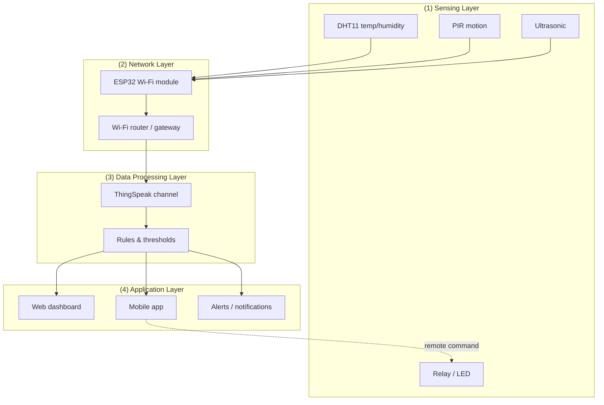

# P01 — Study: 4-Layer IoT Architecture & Real-World Applications

**Subject:** Hands on Practice using IoT | **Unit:** 1 | **Approx. Hrs:** 2
**PrO (verbatim):** *Study the 4-layer IoT architecture and analyse real-world applications like Smart Homes and Industrial IoT.*

---

## 1. Objective
- Understand the **4-layer IoT architecture** and the job of each layer.
- Draw the architecture as both a block diagram and a layered diagram.
- Map a real **Smart Home** system and an **Industrial IoT (IIoT)** system onto the 4 layers.

## 2. Theory (exam-ready)

### 2.1 What is IoT architecture?
IoT is not one device — it is a **chain**: sense → transmit → process → act. The 4-layer model is the standard way to decompose this chain:

| Layer | Also called | Main job | Devices/examples |
|---|---|---|---|
| **1. Sensing Layer** | Perception layer | Collect physical data | Sensors (DHT11, PIR, ultrasonic, LDR, soil moisture), actuators (relay, motor) |
| **2. Network Layer** | Transmission layer | Move data to the cloud | Wi-Fi (ESP32), BLE, Zigbee, 4G/5G, Ethernet, routers, gateways |
| **3. Data Processing Layer** | Middleware / Processing layer | Store, analyse, decide | Cloud servers, ThingSpeak, Blynk, edge computing, databases |
| **4. Application Layer** | Presentation layer | Deliver value to the user | Mobile apps, web dashboards, alert SMS, smart-home control apps |

```
        +---------------------------------------------------------------+
        | APPLICATION LAYER   — dashboards, mobile apps, alerts, control |
        +---------------------------------------------------------------+
                             ▲ data / commands (JSON, HTTP)
        +---------------------------------------------------------------+
        | DATA PROCESSING LAYER — cloud platforms, analytics, DB, rules  |
        +---------------------------------------------------------------+
                             ▲ sensor data (MQTT / HTTP)
        +---------------------------------------------------------------+
        | NETWORK LAYER       — Wi-Fi, BLE, Zigbee, gateway, internet    |
        +---------------------------------------------------------------+
                             ▲ electrical signals (I2C / GPIO / ADC)
        +---------------------------------------------------------------+
        | SENSING LAYER       — sensors & actuators (DHT, PIR, relay)    |
        +---------------------------------------------------------------+
```



> [!tip] Exam one-liner
> the same ESP32 node plays two roles — in the **sensing layer** it reads the sensor, and in the **network layer** it transmits. This is why ESP32 is called an "IoT-ready" microcontroller (built-in Wi-Fi/BT).

### 2.2 Why 4 layers (and not 3 or 5)?
- **3-layer model** (perception → network → application) is the *basic* IoT textbook model.
- **4-layer model** separates **data processing** from **application** — this matters in real systems because a cloud platform (ThingSpeak/Blynk) is a distinct, payable service between the network and the user app.
- **5-layer / "IoT stack" models** (Cisco 7-layer, or perception + transport + processing + application + business) add the *business* layer on top. GTU expects the **4-layer** version for this practical.

## 3. Real-World Application 1 — Smart Home Automation

| Layer | Component in the smart home |
|---|---|
| **Sensing** | PIR motion sensor (room occupancy), DHT22 (room climate), LDR (light level), relay (fan/light switch), door sensor |
| **Network** | ESP32 node's built-in Wi-Fi → home router → internet |
| **Data processing** | Blynk/ThingSpeak channel storing temperature, motion logs; automation rules ("if motion + dark → turn on light") |
| **Application** | Smartphone app showing live room temperature and letting the user toggle lights/AC from anywhere |

**End-to-end flow (exam example):** `PIR detects motion → ESP32 reads GPIO high → publishes MQTT topic home/room1/motion → broker forwards to Blynk → app triggers rule → command topic home/room1/light → ESP32 switches relay ON.`

## 4. Real-World Application 2 — Industrial IoT (IIoT)

| Layer | Component in the factory |
|---|---|
| **Sensing** | Vibration sensor (motor health), temperature sensor (machine), ultrasonic (tank level), limit switches |
| **Network** | Wired Ethernet/Modbus for reliability, Zigbee for sensors, 5G for robots, edge gateway |
| **Data processing** | On-premise SCADA / cloud analytics; predictive-maintenance models flag abnormal vibration patterns |
| **Application** | Control-room dashboard, production manager alerts, maintenance work-orders |

> [!tip] IIoT vs Smart Home difference to quote in viva
> IIoT prioritises **reliability, low latency and deterministic behaviour** (a robot cannot wait 500 ms for a command), so it uses wired/industrial protocols (Modbus, PROFINET) and **edge processing**; Smart Homes tolerate internet latency because comfort, not safety, is at stake.

## 5. Comparison — Smart Home vs Industrial IoT (exam table)

| Criterion | Smart Home | Industrial IoT |
|---|---|---|
| **Sensors** | PIR, DHT, LDR, ultrasonic | Vibration, pressure, motor current, machine vision |
| **Network** | Wi-Fi, BLE (cheap, home router) | Ethernet, Modbus, 5G (deterministic) |
| **Data volume** | Low (tens of readings/min) | High (thousands of telemetry points/sec) |
| **Latency tolerance** | High (comfort) | Low (safety) |
| **Processing** | Cloud-only is fine | Edge + cloud (must react locally) |
| **Example** | Google Nest, Alexa home | GE Predix, Siemens MindSphere |

## 6. Expected Deliverable (report skeleton)
1. Title, aim, date.
2. Draw the 4-layer block diagram (ascii or mermaid) and label each layer's function.
3. One paragraph on each layer with 2 example devices per layer.
4. Smart Home mapping table + end-to-end data flow.
5. IIoT mapping table + end-to-end data flow.
6. Conclusion: one similarity (same 4 layers) and one difference (reliability/latency priorities).

## 7. Conclusion
Every IoT system — from a ₹500 smart plug to a factory — follows the same 4-layer pattern: **sense → network → process → apply**. The layers differ only in the *quality* of each stage (sensor precision, network determinism, processing speed). Understanding the layer boundaries is what lets you design, debug, and explain any IoT solution.

## 8. Viva Q&A
1. **Name the 4 layers of IoT architecture.** — Sensing (perception), Network, Data Processing (middleware), Application.
2. **Which layer is a DHT11 in?** — Sensing layer.
3. **Which layer is ThingSpeak in?** — Data Processing layer.
4. **What is the difference between the 3-layer and 4-layer model?** — The 4-layer model splits "data processing" out as its own layer instead of folding it into the application layer.
5. **Why does IIoT prefer edge processing?** — To meet low-latency, safety-critical response times that cloud round-trips cannot guarantee.

## 9. Resources
- Rajkamal, *Internet of Things: Architecture and Design Principles*, McGraw Hill, 2017 — Ch. on IoT architecture.
- Vijay Madisetti & Arshdeep Bahga, *Internet of Things (A Hands-on Approach)*, 2015 — "IoT Architecture" chapter.
- Cisco IoT architecture blog: https://www.cisco.com/c/en/us/solutions/internet-of-things/iot-architecture.html
- IIoT reference architecture (IIC): https://www.industrialinternetconsortium.org/

---


---

## 🐛 Failure Modes & Debugging (Real-World Experience)

> [!bug] What goes wrong in production?
> When running **Iot Architecture Layers** in a real environment, it almost never works perfectly the first time. 
> 
> **Common Edge Cases to Test:**
> 1. **Network partitions:** What happens to this code if the Wi-Fi drops halfway through execution?
> 2. **Malformed Inputs:** How does the system behave if fed null values, extremely large datasets, or unexpected data types?
> 3. **Resource Exhaustion:** Does this script handle memory leaks or rate-limiting from APIs?

## 🔬 Extension Challenge

> [!example] Prove your expertise
> To truly master this practical, try modifying the code to achieve the following:
> - **Add robust error handling** (try/catch blocks) and structured logging instead of print statements.
> - **Parameterize the inputs** so the script can be run dynamically from the CLI without hardcoding values.
> - **Optimize it:** Can you reduce the execution time or memory footprint?

## 🎯 Key Takeaways

- **chain** — sense → transmit → process → act. The 4-layer model is the standard way to decompose this chain:
- **application** — this matters in real systems because a cloud platform (ThingSpeak/Blynk) is a distinct, payable service between the network and the user app.
- **Name the 4 layers of IoT architecture.** — Sensing (perception), Network, Data Processing (middleware), Application.
- **Which layer is a DHT11 in?** — Sensing layer.
- **Which layer is ThingSpeak in?** — Data Processing layer.
- **Why does IIoT prefer edge processing?** — To meet low-latency, safety-critical response times that cloud round-trips cannot guarantee.

> [!tip] Viva Prep
> Be ready to explain the *why* behind each step, not just the output.
