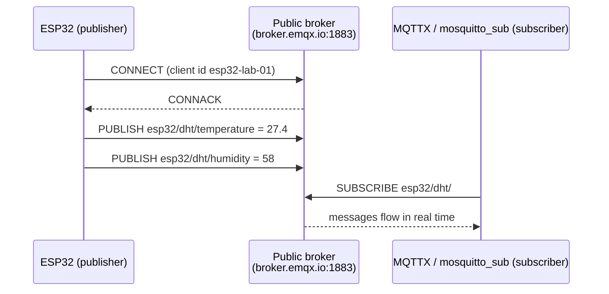

# P08 — ESP32 as MQTT Publisher (Temperature & Humidity)

**Subject:** Hands on Practice using IoT | **Unit:** 4 | **Approx. Hrs:** 2
**PrO (verbatim):** *Develop an IoT application using ESP32 as an MQTT client to publish real-time temperature and humidity data to a public MQTT broker.*

---

## 1. Objective
- Connect the ESP32 to Wi-Fi.
- Use the **PubSubClient** library to act as an MQTT **publisher**.
- Publish DHT11 temperature & humidity to a **public broker** (`broker.emqx.io`) on well-chosen topics.

## 2. Theory (exam-ready)

### 2.1 What is MQTT?
**MQTT = Message Queuing Telemetry Transport** — a lightweight publish/subscribe protocol designed for low-power IoT over unreliable networks (ISO/IEC 20922). Key parts:

| Term | Meaning |
|---|---|
| **Broker** | Central server that routes messages (e.g., `broker.emqx.io`, `test.mosquitto.org`) |
| **Topic** | A text address messages are sent to, e.g. `esp32/dht/temperature` |
| **Publish** | A client sends a message to a topic |
| **Subscribe** | A client tells the broker which topics it wants to receive |
| **QoS 0/1/2** | Quality of Service: at-most-once / at-least-once / exactly-once |
| **Retained message** | Last value on a topic stored by the broker for new subscribers |

- **Ports:** 1883 = plain MQTT · 8883 = MQTT over TLS · 8083/8084 = WebSocket.
- MQTT is ideal here because we only send tiny readings every few seconds and the connection can sleep in between.

### 2.2 Topic naming convention (good practice)
```
<device-type>/<location>/<measurement>
esp32/classroom/temperature
esp32/classroom/humidity
```
Use **hierarchical, human-readable topics** — you will reuse the exact same strings in P09's subscriber.



## 3. Libraries to Install (Library Manager)
1. **"PubSubClient by Nick O'Leary"** — MQTT client for Arduino/ESP32.
2. **"DHT sensor library by Adafruit"** + **"Adafruit Unified Sensor"** — DHT reading (from P06).

## 4. Circuit / Wiring
Reuse the P06 DHT wiring — no new hardware needed:
| ESP32 | DHT11 |
|---|---|
| 3V3 | VCC |
| **GPIO 4** | DATA (+ 4.7 kΩ–10 kΩ pull-up to 3V3) |
| GND | GND |

## 5. Code
```cpp
// P08 — ESP32 as MQTT publisher: DHT11 temp & humidity to a public broker
// DHT DATA -> GPIO 4 · Wi-Fi + PubSubClient
// Libraries: PubSubClient, DHT sensor library (Adafruit) + Unified Sensor

#include <WiFi.h>
#include <PubSubClient.h>
#include <DHT.h>

// ---- Wi-Fi credentials (EDIT THESE) ----
const char* ssid = "YOUR_WIFI_SSID";
const char* password = "YOUR_WIFI_PASSWORD";

// ---- Public MQTT broker ----
const char* mqttServer = "broker.emqx.io";   // or test.mosquitto.org
const int   mqttPort = 1883;

// ---- Topics (reused by P09's subscriber) ----
const char* topicTemp = "esp32/dht/temperature";
const char* topicHum  = "esp32/dht/humidity";

// ---- DHT setup ----
#define DHTPIN 4
#define DHTTYPE DHT11
DHT dht(DHTPIN, DHTTYPE);

WiFiClient espClient;
PubSubClient client(espClient);

unsigned long lastMsg = 0;
const unsigned long INTERVAL = 5000;   // publish every 5 s

void setup() {
  Serial.begin(115200);
  dht.begin();

  WiFi.begin(ssid, password);
  Serial.print("Connecting to Wi-Fi");
  while (WiFi.status() != WL_CONNECTED) {
    delay(500);
    Serial.print(".");
  }
  Serial.println();
  Serial.print("Connected, IP address: ");
  Serial.println(WiFi.localIP());

  client.setServer(mqttServer, mqttPort);
}

void reconnect() {
  // Keep retrying until the broker accepts us
  while (!client.connected()) {
    Serial.print("Attempting MQTT connection...");
    if (client.connect("esp32-lab-01")) {   // unique client id
      Serial.println("connected");
    } else {
      Serial.print("failed, rc=");
      Serial.print(client.state());
      Serial.println(" retrying in 5s");
      delay(5000);
    }
  }
}

void loop() {
  if (!client.connected()) {
    reconnect();
  }
  client.loop();

  unsigned long now = millis();
  if (now - lastMsg > INTERVAL) {
    lastMsg = now;

    float h = dht.readHumidity();
    float t = dht.readTemperature();
    if (isnan(h) || isnan(t)) {
      Serial.println("DHT read failed, skipping publish");
      return;
    }

    // Convert floats to strings and publish
    char tempStr[8], humStr[8];
    dtostrf(t, 4, 1, tempStr);
    dtostrf(h, 4, 1, humStr);

    client.publish(topicTemp, tempStr);
    client.publish(topicHum, humStr);

    Serial.print("Published  temp=");
    Serial.print(tempStr);
    Serial.print(" *C  hum=");
    Serial.print(humStr);
    Serial.println(" %");
  }
}
```

> Full sketch: [[p08_mqtt_publish_dht.ino|`p08_mqtt_publish_dht.ino`]]

## 6. Expected Serial Output
> ⚠️ **Not an actual run** — expected behaviour with a working Wi-Fi and broker:

```
Connecting to Wi-Fi.............
Connected, IP address: 192.168.1.42
Attempting MQTT connection...connected
Published  temp=27.4 *C  hum=58.0 %
Published  temp=27.5 *C  hum=58.0 %
... (one publish every 5 seconds)
```

**Verify on the broker side:** subscribe to `esp32/dht/#` in **MQTTX** or `mosquitto_sub`:
```
mosquitto_sub -h broker.emqx.io -t "esp32/dht/#" -v
→ esp32/dht/temperature 27.4
→ esp32/dht/humidity 58.0
```

## 7. Verify on Hardware (checklist)
- [ ] Wi-Fi connects and prints a valid IP address.
- [ ] `Attempting MQTT connection...connected` appears (rc=0).
- [ ] Both topics publish every 5 s and appear in a subscriber (MQTTX / mosquitto_sub).
- [ ] Values match the Serial Monitor prints.
- [ ] Disconnect the router → ESP32 reconnects automatically (loop's reconnect()).
- [ ] Change `INTERVAL` to 1000 → publishing speeds up (but DHT still needs 2 s between reads).

## 8. Conclusion
The ESP32 published live temperature and humidity as a lightweight MQTT client — Wi-Fi on one core, publish loop on the other. Because MQTT is **publish/subscribe**, *any* subscriber (a phone, P09's ESP32, a cloud bridge) can receive the data without the publisher knowing them — this is the same pattern used by ThingSpeak/Blynk bridges behind the scenes.

## 9. Viva Q&A
1. **What does MQTT stand for?** — Message Queuing Telemetry Transport.
2. **Role of the broker?** — Receives published messages and routes them to all subscribers of the topic.
3. **Default MQTT port?** — 1883 (TLS: 8883).
4. **What is QoS 1?** — At-least-once delivery (message delivered at least once; duplicates possible).
5. **Why a unique client ID?** — The broker rejects two simultaneous connections with the same ID.
6. **Difference between publish and subscribe?** — Publish sends to a topic; subscribe registers interest and receives all messages on that topic.
7. **Name two public brokers.** — broker.emqx.io and test.mosquitto.org.

## 10. Resources
- MQTT official site (spec + intro): https://mqtt.org/
- PubSubClient library: https://github.com/knolleary/pubsubclient
- MQTTX (free desktop/mobile MQTT client): https://mqttx.app/
- EMQX public broker docs: https://www.emqx.com/en/mqtt/public-mqtt5-broker
- ESP32 + MQTT tutorial: https://randomnerdtutorials.com/esp32-mqtt-publish-subscribe-arduino-ide/

---


---

## 🐛 Failure Modes & Debugging (Real-World Experience)

> [!bug] What goes wrong in production?
> When running **Esp32 Mqtt Publisher** in a real environment, it almost never works perfectly the first time. 
> 
> **Common Edge Cases to Test:**
> 1. **Network partitions:** What happens to this code if the Wi-Fi drops halfway through execution?
> 2. **Malformed Inputs:** How does the system behave if fed null values, extremely large datasets, or unexpected data types?
> 3. **Resource Exhaustion:** Does this script handle memory leaks or rate-limiting from APIs?

## 🔬 Extension Challenge

> [!example] Prove your expertise
> To truly master this practical, try modifying the code to achieve the following:
> - **Add robust error handling** (try/catch blocks) and structured logging instead of print statements.
> - **Parameterize the inputs** so the script can be run dynamically from the CLI without hardcoding values.
> - **Optimize it:** Can you reduce the execution time or memory footprint?

## 🎯 Key Takeaways

- **MQTT = Message Queuing Telemetry Transport** — a lightweight publish/subscribe protocol designed for low-power IoT over unreliable networks (ISO/IEC 20922). Key parts:
- **hierarchical, human-readable topics** — you will reuse the exact same strings in P09's subscriber.
- **"PubSubClient by Nick O'Leary"** — MQTT client for Arduino/ESP32.
- **"Adafruit Unified Sensor"** — DHT reading (from P06).
- **Not an actual run** — expected behaviour with a working Wi-Fi and broker:
- **What does MQTT stand for?** — Message Queuing Telemetry Transport.
- **Role of the broker?** — Receives published messages and routes them to all subscribers of the topic.
- **Default MQTT port?** — 1883 (TLS: 8883).

> [!tip] Viva Prep
> Be ready to explain the *why* behind each step, not just the output.
