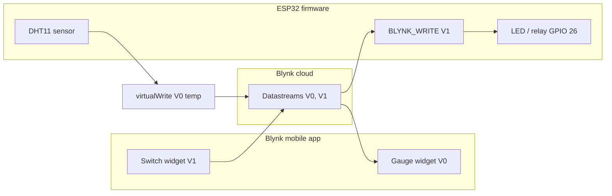

# P12 — Two-Way Mobile Dashboard (Blynk): Monitor & Control

**Subject:** Hands on Practice using IoT | **Unit:** 5 | **Approx. Hrs:** 2
**PrO (verbatim):** *Develop a cloud based two-way mobile dashboard to monitor live sensor data and control physical actuators using virtual buttons.*

---

## 1. Objective
- Set up a **Blynk IoT** cloud template with datastreams and widgets.
- Stream DHT11 temperature **from ESP32 → phone** (monitoring).
- Toggle an LED/relay **from phone → ESP32** via a **virtual button** (control).

## 2. Theory (exam-ready)

### 2.1 Blynk IoT (Blynk 2.0) architecture
Blynk is a cloud platform with a mobile app, a web dashboard, and device-side firmware. Data flows through **virtual pins (V0, V1, …)** mapped to **datastreams** in a device **Template**:

```
Phone app widget ──► Blynk Cloud ──► ESP32 firmware
      ▲                    │               │
      │              datastreams      BLYNK_WRITE(V1)
   gauge on V0   ◄──── virtualWrite(V0, temp)   ◄── DHT sensor
```

| Term | Meaning |
|---|---|
| **Template** | Device model: name, hardware, connection type |
| **Datastream** | A virtual pin (V0, V1…) with a unit/type |
| **Auth token** | Per-device secret that lets the ESP32 connect to the cloud |
| **Widget** | A UI element in the app (Gauge, Button, Slider, Switch) |
| **`BLYNK_WRITE(Vn)`** | Callback fired when the cloud sends a value to pin Vn (control) |
| **`Blynk.virtualWrite(Vn, val)`** | ESP32 sends a value to the cloud (monitoring) |

### 2.2 Why "two-way"?
- **Monitoring path (one-way up):** sensor → `virtualWrite(V0)` → cloud → phone gauge.
- **Control path (one-way down):** phone button → cloud → `BLYNK_WRITE(V1)` → GPIO.
- Both paths run over the same Wi-Fi + Blynk connection — that is what makes the dashboard **two-way**.



## 3. Blynk Cloud Setup (do once — 5 minutes)
1. Create a free account at **https://blynk.io/** (mobile app or web).
2. **Developer → Templates → New Template**:
   - Name: `ESP32 Lab` · Hardware: **ESP32** · Connection: **Wi-Fi** · **Save**.
3. In the template, **Datastreams → New Datastream**:
   - **V0** — Virtual Pin, name `Temperature`, unit `°C`, min 0, max 50.
   - **V1** — Virtual Pin, name `LED Switch`, data type Integer.
4. **Devices → New Device → Create** from template → the **Auth Token** appears (copy it).
5. **Web Dashboard / Mobile Dashboard → Add Widgets**:
   - **Gauge** → select datastream **V0**.
   - **Switch** → select datastream **V1** (it sends `1`/`0`).

## 4. Libraries to Install
1. **"Blynk by Volodymyr Shymanskyy"** (Library Manager) — the Blynk library. It auto-pulls the required `BlynkESP32` support.
2. **"DHT sensor library by Adafruit"** + **"Adafruit Unified Sensor"** (P06).

## 5. Circuit / Wiring
| ESP32 pin | Component |
|---|---|
| 3V3 | DHT VCC |
| **GPIO 4** | DHT DATA (+ 4.7 kΩ–10 kΩ pull-up) |
| GND | DHT GND |
| **GPIO 26** | LED anode via 220 Ω (or relay IN) |
| GND | LED cathode / relay GND |

## 6. Code (template)
```cpp
// P12 — Two-way Blynk dashboard: monitor DHT + control LED from phone
// DHT DATA -> GPIO 4 · LED/relay -> GPIO 26 · Blynk library
// Fill in BLYNK_TEMPLATE_ID, BLYNK_TEMPLATE_NAME, BLYNK_AUTH_TOKEN below.

#define BLYNK_TEMPLATE_ID   "TMPLxxxxxxx"    // from blynk.cloud template
#define BLYNK_TEMPLATE_NAME "ESP32 Lab"
#define BLYNK_AUTH_TOKEN    "your-device-auth-token"

#include <WiFi.h>
#include <Blynk.h>
#include <DHT.h>

char ssid[] = "YOUR_WIFI_SSID";
char pass[] = "YOUR_WIFI_PASSWORD";

const int ledPin = 26;
#define DHTPIN 4
#define DHTTYPE DHT11
DHT dht(DHTPIN, DHTTYPE);

const int vTemp = 0;      // datastream V0: temperature (up)
const int vLed  = 1;      // datastream V1: switch (down)

void setup() {
  Serial.begin(115200);
  pinMode(ledPin, OUTPUT);
  digitalWrite(ledPin, LOW);
  dht.begin();

  Blynk.begin(BLYNK_AUTH_TOKEN, ssid, pass);
}

// Fired when the phone switch on V1 sends a value (0 or 1)
BLYNK_WRITE(V1) {
  int state = param.asInt();          // 1 = ON, 0 = OFF
  digitalWrite(ledPin, state == 1 ? HIGH : LOW);
  Serial.print("V1 switch -> LED ");
  Serial.println(state == 1 ? "ON" : "OFF");
}

void loop() {
  Blynk.run();                        // keep cloud connection alive

  static unsigned long lastRead = 0;
  if (millis() - lastRead > 5000) {   // push temp to cloud every 5 s
    lastRead = millis();
    float t = dht.readTemperature();
    if (!isnan(t)) {
      Blynk.virtualWrite(vTemp, t);   // one-way UP: phone gauge shows it
      Serial.print("Pushed temp to V0: ");
      Serial.println(t);
    }
  }
}
```

> Full sketch: [[p12_blynk_two_way_dashboard.ino|`p12_blynk_two_way_dashboard.ino`]]

> [!warning] Note
> `Blynk.begin()` handles Wi-Fi + cloud connection automatically — no manual `WiFi.begin()` needed (the library manages it internally).

## 7. Expected Serial Output
> ⚠️ **Not an actual run** — expected behaviour:

```
[0] Connecting to WiFi..
[0] WiFi connected, IP: 192.168.1.42
[0] Connecting to blynk.cloud
[0] Connected to blynk.cloud
Pushed temp to V0: 27.4
Pushed temp to V0: 27.4
V1 switch -> LED ON        <- after tapping the phone switch
V1 switch -> LED OFF
Pushed temp to V0: 27.5
```

## 8. Verify on Hardware (checklist)
- [ ] Serial shows `Connected to blynk.cloud`.
- [ ] Phone Gauge widget (V0) updates to the room temperature every 5 s.
- [ ] Tapping the Switch widget (V1) toggles the physical LED instantly.
- [ ] LED state survives a cloud reconnect (or resets — note whichever your firmware does).
- [ ] Open the **web dashboard** in a browser — same widgets work from the PC too.
- [ ] Wrong auth token → `[Blynk] Auth token not found` on serial — fix in code.

## 9. Conclusion
Blynk delivered the complete **two-way** IoT loop in one sketch: DHT data flows up through `virtualWrite(V0)` to a phone gauge, while the phone switch flows down through `BLYNK_WRITE(V1)` to a GPIO. This is the same monitoring + remote-control pattern applied at scale in the Smart Agriculture mini-project (P14).

## 10. Viva Q&A
1. **What are datastreams?** — Typed virtual pins (V0, V1…) that carry values between the device and Blynk cloud.
2. **What does `BLYNK_WRITE(V1)` do?** — Runs whenever the cloud delivers a value to V1 (phone button press).
3. **What does `Blynk.virtualWrite(vTemp, t)` do?** — Sends the temperature value from the ESP32 up to the cloud/phone.
4. **Why is it called "two-way"?** — Data flows both directions: sensor → cloud → phone, and phone → cloud → actuator.
5. **What is the Auth Token?** — A per-device secret used by the firmware to authenticate to blynk.cloud.
6. **What is a Template?** — The reusable device definition (datastreams, widgets, hardware type) that devices are created from.

## 11. Resources
- Blynk IoT docs: https://docs.blynk.io/en/
- Blynk quickstart: https://docs.blynk.io/en/getting-started/quick-start-device
- Blynk library on GitHub: https://github.com/blynkkk/blynk-library
- ESP32 + Blynk guide: https://randomnerdtutorials.com/esp32-blynk-iot/

---


---

## 🐛 Failure Modes & Debugging (Real-World Experience)

> [!bug] What goes wrong in production?
> When running **Blynk Two Way Dashboard** in a real environment, it almost never works perfectly the first time. 
> 
> **Common Edge Cases to Test:**
> 1. **Network partitions:** What happens to this code if the Wi-Fi drops halfway through execution?
> 2. **Malformed Inputs:** How does the system behave if fed null values, extremely large datasets, or unexpected data types?
> 3. **Resource Exhaustion:** Does this script handle memory leaks or rate-limiting from APIs?

## 🔬 Extension Challenge

> [!example] Prove your expertise
> To truly master this practical, try modifying the code to achieve the following:
> - **Add robust error handling** (try/catch blocks) and structured logging instead of print statements.
> - **Parameterize the inputs** so the script can be run dynamically from the CLI without hardcoding values.
> - **Optimize it:** Can you reduce the execution time or memory footprint?

## 🎯 Key Takeaways

- **Developer → Templates → New Template** — - Name: `ESP32 Lab` · Hardware: **ESP32** · Connection: **Wi-Fi** · **Save**.
- **Datastreams → New Datastream** — - **V0** — Virtual Pin, name `Temperature`, unit `°C`, min 0, max 50.
- **Web Dashboard / Mobile Dashboard → Add Widgets** — - **Gauge** → select datastream **V0**.
- **Not an actual run** — expected behaviour:
- **What are datastreams?** — Typed virtual pins (V0, V1…) that carry values between the device and Blynk cloud.
- **What does `BLYNK_WRITE(V1)` do?** — Runs whenever the cloud delivers a value to V1 (phone button press).
- **What does `Blynk.virtualWrite(vTemp, t)` do?** — Sends the temperature value from the ESP32 up to the cloud/phone.
- **Why is it called "two-way"?** — Data flows both directions: sensor → cloud → phone, and phone → cloud → actuator.

> [!tip] Viva Prep
> Be ready to explain the *why* behind each step, not just the output.
