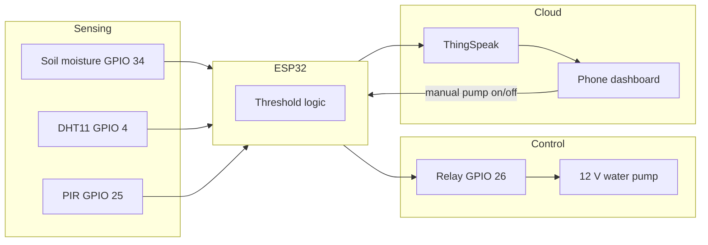

# P14 — Mini-Project: Smart Agriculture System (walkthrough guide)

**Subject:** Hands on Practice using IoT | **Unit:** 5 | **Approx. Hrs:** 4
**PrO (verbatim):** *Develop and demonstrate an IoT-based mini project by designing a smart application such as Smart Home Automation, Smart Agriculture, Smart Health Monitoring, Smart Parking, Smart City Service, Smart Street Lighting, Waste Management, or Environmental Monitoring using suitable sensors, ESP32, cloud platform, and remote monitoring/control features.*

---

## 1. Objective
- Design and build a **Smart Agriculture** system end-to-end: sensing → processing → cloud → remote control.
- Provide a template you can remix into any of the alternative mini-projects in §10.

## 2. Project Overview — "Automated Irrigation & Soil Monitoring"

The system monitors soil moisture, temperature and humidity; it uploads them to the cloud, shows them on a dashboard, and **automatically + remotely** controls a water pump (relay) when the soil gets dry.



## 3. System Requirements / BOM (Bill of Materials)

| # | Component | Qty | Approx. ₹ | Purpose |
|---|---|---|---|---|
| 1 | ESP32 DevKit V1 | 1 | 500 | Main controller + Wi-Fi |
| 2 | DHT11 (or DHT22) | 1 | 150 | Temp + humidity |
| 3 | Capacitive soil moisture sensor (or FC-28) | 1 | 200 | Soil wetness |
| 4 | HC-SR04 ultrasonic (optional) | 1 | 120 | Water-tank level (P11 idea) |
| 5 | PIR motion (optional) | 1 | 120 | Crop/pest intrusion alert |
| 6 | Relay module (1 or 2 ch) | 1 | 120 | Switches pump |
| 7 | Mini water pump (5–12 V) + DC supply | 1 | 250 | Irrigation |
| 8 | Breadboard + jumper wires | 1 set | 150 | Wiring |
| 9 | LEDs + 220 Ω resistors | 4 | 30 | Status indicators |
| 10 | USB micro data cable | 1 | 100 | Programming |

> **Total ≈ ₹1,500–1,700** — well within a group-budget mini project. Reuse the ESP32/lab kit (GTU lab list) to cut costs further.

## 4. Wiring Table

| ESP32 pin | Component | Note |
|---|---|---|
| 3V3 | DHT VCC, soil VCC | Keep 3.3 V for sensors |
| 5V | Relay VCC (and pump power if 5 V) | Relay coil supply |
| **GPIO 4** | DHT DATA | + 4.7 kΩ–10 kΩ pull-up to 3V3 |
| **GPIO 34** | Soil sensor A0 | Input-only ADC1 |
| **GPIO 25** | PIR OUT | Optional |
| **GPIO 26** | Relay IN | LOW-active on most boards |
| **GPIO 2** | Built-in LED (debug) | Onboard |
| GND | All grounds common | DHT, soil, PIR, relay, ESP32 |

> [!warning] Pump safety
> the pump is powered **separately** (12 V supply), never from the ESP32's 5 V pin. The relay's switch contacts (COM → NO) complete the pump's power path; the ESP32 only drives the relay coil.

## 5. Code — Full Project Sketch
```cpp
// P14 — Smart Agriculture: soil moisture + DHT + PIR, auto & remote pump control
// Soil A0 -> GPIO 34 · DHT DATA -> GPIO 4 · PIR -> GPIO 25 · Relay -> GPIO 26
// Libraries: DHT sensor library (Adafruit), Unified Sensor, PubSubClient

#include <WiFi.h>
#include <PubSubClient.h>
#include <DHT.h>

const char* ssid = "YOUR_WIFI_SSID";
const char* password = "YOUR_WIFI_PASSWORD";

// ---- MQTT (public broker) ----
const char* mqttServer = "broker.emqx.io";
const int   mqttPort = 1883;
const char* topicData = "agri/esp32/data";     // publish: sensor JSON
const char* topicPump = "agri/esp32/pump";     // subscribe: "1"/"0" from phone

// ---- Pins ----
#define SOIL_PIN 34
#define DHTPIN 4
#define DHTTYPE DHT11
#define PIR_PIN 25
#define RELAY_PIN 26
#define LED_PIN 2

DHT dht(DHTPIN, DHTTYPE);

// ---- Thresholds (edge processing) ----
const int SOIL_DRY = 2000;      // below -> auto-pump ON
const int SOIL_OK  = 2600;      // above -> auto-pump OFF (hysteresis)
const float TEMP_HOT = 35.0;

bool manualMode = false;        // true = phone controls pump, false = auto
bool pumpState  = false;

WiFiClient espClient;
PubSubClient client(espClient);

unsigned long lastPub = 0;
const unsigned long PUB_MS = 10000;   // publish every 10 s

void setup() {
  Serial.begin(115200);
  dht.begin();
  pinMode(SOIL_PIN, INPUT);
  pinMode(PIR_PIN, INPUT);
  pinMode(RELAY_PIN, OUTPUT);
  pinMode(LED_PIN, OUTPUT);
  digitalWrite(RELAY_PIN, HIGH);      // most relay boards: HIGH = OFF

  WiFi.begin(ssid, password);
  Serial.print("Connecting to Wi-Fi");
  while (WiFi.status() != WL_CONNECTED) {
    delay(500);
    Serial.print(".");
  }
  Serial.println();
  Serial.print("IP: ");
  Serial.println(WiFi.localIP());

  client.setServer(mqttServer, mqttPort);
  client.setCallback(onMqtt);
}

// Phone publishes "1"/"0" to agri/esp32/pump -> manual pump control
void onMqtt(char* topic, byte* payload, unsigned int len) {
  String msg = "";
  for (unsigned int i = 0; i < len; i++) msg += (char)payload[i];

  manualMode = true;                  // any manual command -> manual mode
  if (msg == "1")      setPump(true);
  else if (msg == "0") setPump(false);
  Serial.print("Manual pump command: ");
  Serial.println(msg);
}

void setPump(bool on) {
  pumpState = on;
  digitalWrite(RELAY_PIN, on ? LOW : HIGH);   // LOW-active relay
  digitalWrite(LED_PIN, on ? HIGH : LOW);
  Serial.print("Pump -> ");
  Serial.println(on ? "ON" : "OFF");
}

void reconnect() {
  while (!client.connected()) {
    Serial.print("MQTT...");
    if (client.connect("agri-node-01")) {
      Serial.println("connected");
      client.subscribe(topicPump);
    } else {
      delay(5000);
    }
  }
}

void loop() {
  if (!client.connected()) reconnect();
  client.loop();

  int soil = analogRead(SOIL_PIN);
  float h = dht.readHumidity();
  float t = dht.readTemperature();
  int pir = digitalRead(PIR_PIN);

  // ---- Automatic control with hysteresis (only when NOT manual) ----
  if (!manualMode) {
    if (soil < SOIL_DRY)     setPump(true);   // dry -> irrigate
    else if (soil > SOIL_OK) setPump(false);  // enough water -> stop
  }

  // ---- Publish every 10 s ----
  if (millis() - lastPub > PUB_MS) {
    lastPub = millis();
    if (!isnan(t) && !isnan(h)) {
      String payload = String("{\"temp\":") + String(t, 1) +
                       ",\"hum\":" + String(h, 1) +
                       ",\"soil\":" + String(soil) +
                       ",\"pir\":" + (pir == HIGH ? 1 : 0) +
                       ",\"pump\":" + (pumpState ? 1 : 0) + "}";
      client.publish(topicData, payload.c_str());
      Serial.print("Published: ");
      Serial.println(payload);
    }
  }

  delay(500);
}
```

> Full sketch: [[p14_smart_agriculture_project.ino|`p14_smart_agriculture_project.ino`]]

> [!tip] Design notes (viva material)
> - **Hysteresis** (`SOIL_DRY`/`SOIL_OK`) stops the pump from "chattering" on/off around one threshold.
> - **Manual mode flag** — the phone's pump command overrides automation until the next reset (a safe design choice worth explaining).
> - **JSON payload** on one MQTT topic keeps the broker tidy (vs one topic per field in P08).

## 6. Cloud Dashboard Setup (ThingSpeak)
1. New channel: **Field 1** Temp, **Field 2** Humidity, **Field 3** Soil, **Field 4** Pump state.
2. Bridge MQTT → ThingSpeak (two options):
   - **ThingSpeak MQTT API** (`mqtt.thingspeak.com` with your channel's MQTT API key), or
   - Simply swap the publish block for the P13b-style **HTTP GET** with `&field1=..&field2=..`.
3. Dashboard shows four graphs updating every ~10 s.
4. **React app (bonus):** "Field 3 < 2000 → HTTP POST to a Twilio/IFTTT webhook" — SMS/telegram alert when soil is dry.
5. For a phone control UI, replace MQTT phone publishing with **Blynk** (P12) and re-map V1 → `setPump()`.

## 7. Testing Checklist
- [ ] **Bench test (no water):** sensors print sane values on Serial; relay clicks when soil dries below 2000.
- [ ] **Auto mode:** dip probe in a cup of water → soil > 2600 → pump auto-OFF.
- [ ] **Manual mode:** publish `1`/`0` from MQTTX → pump follows, `manualMode` locks automation.
- [ ] **Cloud:** all four fields update on ThingSpeak every 10 s.
- [ ] **Alerts:** ThingSpeak React fires below the soil threshold (if configured).
- [ ] **Field test:** pump actually draws water when irrigating (verify relay COM/NO wiring first!).
- [ ] **Power test:** ESP32 on USB, pump on its own supply — no brownouts/reboots.

## 8. Expected Serial Output (representative)
> ⚠️ **Not an actual run** — expected behaviour while demoing:

```
Connecting to Wi-Fi......
IP: 192.168.1.42
MQTT...connected
Pump -> ON
Published: {"temp":34.5,"hum":41.0,"soil":1700,"pir":0,"pump":1}
Manual pump command: 0
Pump -> OFF
Published: {"temp":34.5,"hum":41.0,"soil":1710,"pir":0,"pump":0}
```

## 9. Conclusion
Smart Agriculture ties every previous practical together: P05 (PIR), P06 (DHT), P07 (ultrasonic for tank level), P08/P09 (MQTT pub/sub), P10–P13 (cloud + thresholds). The ESP32 both **decides** (threshold/hysteresis) and **executes** (relay→pump), while the cloud provides dashboards and alerts — a complete, demonstrable IoT product in ~₹1,500.

## 10. Alternative Mini-Project Ideas (pick one if you like)

1. **Smart Home Automation** 🏠 — PIR + LDR + DHT on ESP32; relay controls lights/fan; MQTT commands from phone (P09/P12). Auto: "motion + dark → light ON". Reuses every practical unchanged.
2. **Smart Health Monitoring** ❤️ — MAX30102 (heart-rate/SpO2, I2C) + DHT; ESP32 pushes to ThingSpeak; phone/Blynk alerts when HR > threshold. Same cloud plumbing as P13b, new I2C sensor.
3. **Smart Parking System** 🅿️ — 2–3 HC-SR04 over the parking slots (P07); each slot's occupancy (distance < threshold → occupied) sent to ThingSpeak; dashboard shows free/occupied slots, entry barrier relay.
4. **Smart Street Lighting** 💡 — LDR (P05) controls a relay/street-light LED: lights ON at dusk, OFF at dawn; optional PIR dims lights when nobody is near; brightness/state logged to cloud.
5. **Smart Waste Management** 🗑️ — HC-SR04 inside the bin measures fill level (P11); when fill > 80% the ESP32 publishes an alert topic; municipal dashboard lists bins needing pickup.
6. **Environmental Monitoring** 🌦️ — DHT22 + LDR + rain sensor + (optional) MQ-135 air quality on ESP32 → ThingSpeak; thresholds trigger "high AQI" / "rain incoming" alerts; works as a weather station with predictive alerts.

## 11. Viva Q&A
1. **Why hysteresis in the pump control?** — To prevent the relay from toggling rapidly around one threshold (wear + water hammer).
2. **How is the pump powered safely?** — Separate 12 V supply switched by the relay contacts; the ESP32 only drives the relay coil.
3. **What happens if a manual command arrives?** — `manualMode = true`; the phone now controls the pump and auto control is suspended.
4. **Which sensors and which layer of the 4-layer model?** — Soil/DHT/PIR = sensing layer; MQTT+Wi-Fi = network layer; ThingSpeak = data-processing; phone/web = application.
5. **Why MQTT over HTTP for control?** — MQTT is push-based and duplex — the phone can *receive* pump state instantly (P08/P09), and control latency is <1 s.
6. **What is a JSON payload?** — One MQTT message containing all fields (`{"temp":34.5,...}`), parsed by the dashboard — compact and self-describing.

## 12. Resources
- ThingSpeak MQTT API: https://docs.thingspeak.com/en/mqtt/
- PubSubClient: https://github.com/knolleary/pubsubclient
- Relay module guide: https://randomnerdtutorials.com/esp32-relay-module-ac-web-server/
- GTU suggested projects list (this unit): Automated Irrigation & Soil Monitoring, Smart Waste Management, Weather Station with Predictive Alerts, Urban Flood & Water Level Alert System, Smart Agriculture Soil & Pump Automator.
- NPTEL "Introduction to Internet of Things" (suggested MOOC): https://nptel.ac.in/courses/106105166

---


---

## 🐛 Failure Modes & Debugging (Real-World Experience)

> [!bug] What goes wrong in production?
> When running **Mini Project Smart Agriculture Guide** in a real environment, it almost never works perfectly the first time. 
> 
> **Common Edge Cases to Test:**
> 1. **Network partitions:** What happens to this code if the Wi-Fi drops halfway through execution?
> 2. **Malformed Inputs:** How does the system behave if fed null values, extremely large datasets, or unexpected data types?
> 3. **Resource Exhaustion:** Does this script handle memory leaks or rate-limiting from APIs?

## 🔬 Extension Challenge

> [!example] Prove your expertise
> To truly master this practical, try modifying the code to achieve the following:
> - **Add robust error handling** (try/catch blocks) and structured logging instead of print statements.
> - **Parameterize the inputs** so the script can be run dynamically from the CLI without hardcoding values.
> - **Optimize it:** Can you reduce the execution time or memory footprint?

## 🎯 Key Takeaways

- **Total ≈ ₹1,500–1,700** — well within a group-budget mini project. Reuse the ESP32/lab kit (GTU lab list) to cut costs further.
- **Manual mode flag** — the phone's pump command overrides automation until the next reset (a safe design choice worth explaining).
- **Not an actual run** — expected behaviour while demoing:
- **Why hysteresis in the pump control?** — To prevent the relay from toggling rapidly around one threshold (wear + water hammer).
- **How is the pump powered safely?** — Separate 12 V supply switched by the relay contacts; the ESP32 only drives the relay coil.
- **What happens if a manual command arrives?** — `manualMode = true`; the phone now controls the pump and auto control is suspended.
- **Which sensors and which layer of the 4-layer model?** — Soil/DHT/PIR = sensing layer; MQTT+Wi-Fi = network layer; ThingSpeak = data-processing; phone/web = application.
- **Why MQTT over HTTP for control?** — MQTT is push-based and duplex — the phone can *receive* pump state instantly (P08/P09), and control latency is <1 s.

> [!tip] Viva Prep
> Be ready to explain the *why* behind each step, not just the output.
