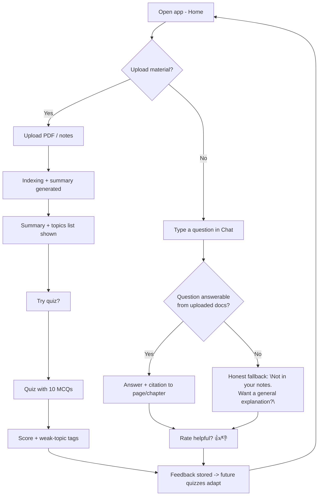

# P05 — AI Interaction Flow & Basic UI Wireframes

**Subject:** AI Product Design | **Unit:** 2 | **Approx. Hrs:** 2
**PrO (verbatim):** *Design AI interaction flow and basic UI wireframe.*

---

## 1. Objective
- Draw the **conversation/interaction flow** of StudyMate (what the user does → what the AI does → what the screen shows).
- Sketch **3–4 ASCII wireframes**: Home, Chat, Results, Settings.
- Explain where AI-specific UI principles apply (set expectations, show confidence, let user correct — Unit 2.6/2.7).

## 2. Interaction Flow (mermaid)



**ASCII flow (answer-sheet friendly):**

```
  HOME ──upload──► UPLOAD ──► INDEXING ──► SUMMARY + TOPICS
    │                                                    │
    │                                                    ▼
    └──ask────► CHAT ──answerable?───► ANSWER + CITATION ──► RATING 👍/👎
                          │                               │
                          └──no ─► HONEST FALLBACK ◄──────┘
                                                              │
                                              feedback → next quiz adapts
```

## 3. Wireframes (ASCII — StudyMate, mobile)

### 3.1 Home
```
┌────────────────────────────┐
│ StudyMate          🔔 👤   │   ← app bar, notifications, profile
├────────────────────────────┤
│ Good evening, Riya ✨      │   ← personalisation
│ "Exam in 12 days · U4 weak"│   ← AI-driven status line
├────────────────────────────┤
│  [+ Upload notes]          │   ← primary action
├────────────────────────────┤
│  📄 Machine Design.pdf   ✓ │
│  📄 DSA unit 3 notes      │   ← recent docs (data layer)
│  ❓ Ask StudyMate...        │   ← chat shortcut
├────────────────────────────┤
│  ▁▂▃▅▇▅▄  Progress this week │   ← feedback-loop visual
└────────────────────────────┘
```

### 3.2 Chat
```
┌────────────────────────────┐
│ ◀ Ask StudyMate        •••  │
├────────────────────────────┤
│ Riya: 10:04               │
│ "Explain Kirchhoff's law   │
│  the way my notes do."     │
│────────────────────────────│
│ StudyMate 10:04            │
│ "Based on Unit 2, slide 14:│
│  KVL: ΣV = 0 in a closed   │
│  loop. In your notes you   │
│  marked this diagram…"     │
│ [slide 14] [👍] [👎]       │   ← citation + rating
│────────────────────────────│
│ StudyMate 10:05            │
│ "This is outside your      │
│  uploads. Want a general   │
│  explanation instead? [Y]  │   ← honest fallback
├────────────────────────────┤
│ Type a question… [Send]    │
└────────────────────────────┘
```

### 3.3 Results (Quiz score card)
```
┌────────────────────────────┐
│ Practice Quiz — Unit 4    │
├────────────────────────────┤
│  8 / 10   ── 80%  🎉       │   ← score
│  Weak topics (from errors) │
│  • Thevenin theorem        │   ← feedback loop output
│  • Source transformation   │
│  [ Explain my mistakes ]   │   ← AI remediation
│  [ Retake only weak q's ]  │   ← loop closes
└────────────────────────────┘
```

### 3.4 Settings / Privacy
```
┌────────────────────────────┐
│ Settings                   │
├────────────────────────────┤
│ Account  •  Plan: Free ▸   │
│ Model: gpt-4o-mini (Auto)  │
│────────────────────────────│
│ Privacy                    │
│ [x] Use my notes for       │
│     improvement            │
│ [ ] Share usage analytics  │
│  Delete my data ▸          │   ← consent controls (P11)
│  Export my notes ▸         │
│────────────────────────────│
│ Danger zone                 │
│  Delete account ▸          │
└────────────────────────────┘
```

## 4. AI-specific UI rules these wireframes follow (Unit 2.6–2.7)

| Rule | Where StudyMate applies it |
|---|---|
| **Set expectations before the AI acts** | Upload screen states *"summary ready in ~30 s"* |
| **Ground outputs in the user's data** | Chat answers carry a `[slide 14]` citation |
| **Show confidence / admit limits** | "Not in your notes" fallback instead of a confident guess |
| **Let the user steer & correct** | 👍/👎 rating + "explain my mistakes" + "retake weak questions" |
| **Explain what the system did** (explainability) | "Weak topics from your 10 answers" is a plain-language explanation |

## 5. Blank Template (copy into `../code/p05_interaction_flow_wireframe_template.md`)

```
# <Product> — Interaction Flow & Wireframes (blank)

## Flow (mermaid/ascii)
[user action] -> [AI action] -> [screen result] -> [feedback]

## Wireframe set
W1 <Screen name>:
  ┌────────────────────────┐
  │                        │
  └────────────────────────┘
W2 <Screen name>: ...
W3 <Screen name>: ...
W4 <Screen name>: ...

## AI-UI rule checklist
| Rule | Where MY product applies it |
```

## 6. Field-by-field explanation (how to redo this for your idea)
- **Interaction flow** = decision tree of *user intent → system response*. Every branch must terminate in a screen the user can see. The "honest fallback" branch is the one most students forget — and examiners love it.
- **Wireframes are boxes, not art.** No colours, no real copy — just layout blocks and labels. Use `[ ]` for buttons, `▸` for navigable rows, `text…` for inputs.
- **4 screens minimum** — choose one screen per lifecycle stage: enter (home), act (chat/upload), result (score/summary), control (settings/privacy). That set proves you designed the whole loop, not one page.
- **Feedback anchors** — each screen should show *where the feedback loop plugs in* (ratings, retake, settings toggles). Otherwise the design is a dead-end diagram.

## 7. Expected Deliverable (report skeleton)
1. Title, aim, date.
2. Interaction-flow diagram (mermaid or ASCII) with all branches labelled.
3. Four ASCII wireframes with labels.
4. AI-UI rule checklist table (section 4) — 4+ rules with your screen names.
5. Conclusion: which 2 wireframe decisions reduce user anxiety most.

## 8. Viva Q&A
1. **Why an "honest fallback" branch?** — LLMs hallucinate when asked out-of-domain; refusing politely (grounded answer or "not in your notes") protects trust and meets explainability expectations.
2. **What is a wireframe vs a mockup vs a prototype?** — Wireframe = low-fidelity layout; mockup = visual design; prototype = clickable/interactive (P10 builds the clickable version).
3. **Where does the feedback loop appear in UI?** — 👍/👎 ratings, "retake weak questions", settings toggles, progress widget.
4. **How do citations help?** — They ground the AI answer in the user's data (reduces hallucination risk perception) and let the user verify — a core human-AI interaction pattern.

## 9. Resources
- "Guidelines for Human-AI Interaction" (Microsoft): https://www.microsoft.com/en-us/research/publication/guidelines-for-human-ai-interaction/
- NN/g "AI + UX" articles: search *nngroup ai ux chat interfaces* and *nngroup conversational user interface*
- Google People + AI Guidebook: https://pair.withgoogle.com
- ASCII wireframe practice: search *ascii wireframe mockup kit* / use `monodraw`-style tools
- Template file: [`p05_interaction_flow_wireframe_template.md`](./p05_interaction_flow_wireframe_template.md.md)

---


---

## 🐛 Failure Modes & Debugging (Real-World Experience)

> [!bug] What goes wrong in production?
> When running **Interaction Flow Wireframe** in a real environment, it almost never works perfectly the first time. 
> 
> **Common Edge Cases to Test:**
> 1. **Network partitions:** What happens to this code if the Wi-Fi drops halfway through execution?
> 2. **Malformed Inputs:** How does the system behave if fed null values, extremely large datasets, or unexpected data types?
> 3. **Resource Exhaustion:** Does this script handle memory leaks or rate-limiting from APIs?

## 🔬 Extension Challenge

> [!example] Prove your expertise
> To truly master this practical, try modifying the code to achieve the following:
> - **Add robust error handling** (try/catch blocks) and structured logging instead of print statements.
> - **Parameterize the inputs** so the script can be run dynamically from the CLI without hardcoding values.
> - **Optimize it:** Can you reduce the execution time or memory footprint?

## 🎯 Key Takeaways

- **3–4 ASCII wireframes** — Home, Chat, Results, Settings.
- **4 screens minimum** — choose one screen per lifecycle stage: enter (home), act (chat/upload), result (score/summary), control (settings/privacy). That set proves you designed the whole loop, not one page.
- **Feedback anchors** — each screen should show *where the feedback loop plugs in* (ratings, retake, settings toggles). Otherwise the design is a dead-end diagram.
- **Why an "honest fallback" branch?** — LLMs hallucinate when asked out-of-domain; refusing politely (grounded answer or "not in your notes") protects trust and meets explainability expectations.
- **What is a wireframe vs a mockup vs a prototype?** — Wireframe = low-fidelity layout; mockup = visual design; prototype = clickable/interactive (P10 builds the clickable version).
- **Where does the feedback loop appear in UI?** — 👍/👎 ratings, "retake weak questions", settings toggles, progress widget.
- **How do citations help?** — They ground the AI answer in the user's data (reduces hallucination risk perception) and let the user verify — a core human-AI interaction pattern.

> [!tip] Viva Prep
> Be ready to explain the *why* behind each step, not just the output.
