# UNIT 2 — Basics of Large Language Models (LLMs) 🧠

> **Artificial Intelligence with Prompt Engineering (DI05016011)** · **6 hrs · 15% weightage**
> **Covers syllabus sections:** 2.1 Introduction to LLMs · 2.2 Working of LLMs (tokens, embeddings, next-word prediction) · 2.3 Popular LLM Models (GPT, Claude, LLaMA, Gemini) · 2.4 Capabilities & Limitations
> **Related practicals:** [P03](./P03%20—%20Llm%20Behavior%20Analysis.md), [P04](./P04%20—%20Llm%20Capabilities%20Limitations%20Hallucinations.md), [P10](./P10%20—%20Ai%20Chatbot%20Api%20Python.md)

---

## 🧭 Chapter Roadmap

This unit explains the *engine* behind every tool you used in Unit 1. It is theory-light on math and heavy on concepts — the exam wants you to explain *how* an LLM works in plain words (tokens, embeddings, next-token prediction) and *why* it fails (hallucination, context window, bias, cost). High recall value: many 3–4 mark definition questions.

| # | Concept | Exam importance | Code demo |
|---|---------|-----------------|-----------|
| 2.1 | Concept of LLMs | ★★★★ | — |
| 2.2 | Training data & parameters | ★★★★ | — |
| 2.3 | Tokens | ★★★★★ | — |
| 2.4 | Embeddings (conceptual) | ★★★★ | P11 (hashed embeddings) |
| 2.5 | How the LLM predicts the next word | ★★★★★ | — |
| 2.6 | GPT / Claude / LLaMA / Gemini | ★★★★ | P10 |
| 2.7 | Hallucination problem | ★★★★★ | P04 |
| 2.8 | Context window limitations | ★★★★ | P03 |
| 2.9 | Bias in AI systems | ★★★★ | P04 |
| 2.10 | Cost of AI models | ★★★ | P10 |

### Learning outcomes — after this unit you can:
1. Define an LLM and explain what "large" and "language model" each mean.
2. Explain training data scale, parameters, and how a model is trained *conceptually* (predict → compare → adjust).
3. Define tokens and embeddings and explain the pipeline tokenize → embed → predict → de-tokenize.
4. Explain *exactly* how an LLM picks the next word (probability distribution + temperature).
5. Compare GPT, Claude, LLaMA, and Gemini on maker, openness, and speciality.
6. Explain the four limitations — hallucination, context window, bias, cost — with examples.
7. Connect the unit to practicals P03 (behavior), P04 (hallucination test), P10 (API calls).

---

## 2.1 Introduction to Large Language Models

### 2.1.1 Concept of LLMs ⭐

**Definition (exam-ready):** A Large Language Model (LLM) is a **deep neural network** — specifically a transformer — trained on **huge amounts of text** to **predict the next token** in a sequence. The skill of predicting text is repurposed into "skills" like answering, summarizing, translating, and writing code, because all of them are, at the core, *generating the next token*.

**Break down the name:**
| Word | Meaning |
|---|---|
| **Large** | Billions of **parameters**; trained on trillions of tokens; needs huge compute |
| **Language** | Trained on human text (and code) — captures grammar, facts, styles, reasoning patterns |
| **Model** | A statistical/mathematical function mapping input (prompt) → output (text) |

**Why LLMs matter:** one model, trained once, can be prompted to do *many* tasks — this is a **foundation model**. Before LLMs, each NLP task needed its own model; now one model handles them all via prompts (the topic of Units 3–4).

### 2.1.2 Training Data and Parameters ⭐⭐

| Concept | Explanation | Approx. scale |
|---|---|---|
| **Training data** | Text scraped from books, web pages, articles, code, forums | Trillions of **tokens** |
| **Parameters** | The learnable numbers (weights & biases) inside the network that store what it "knows" | 1 B – 1 T+ parameters |
| **Context window** | Max tokens the model can "see" in one request (training-time chunk) | 4 K – 1 M+ tokens |
| **Compute** | GPU/TPU time needed for training | Millions of GPU-hours |

**How training works (conceptually — no math needed for exams):**
```
1. SHOW   : feed the model a huge text with some tokens hidden
2. PREDICT: the model guesses the next token
3. COMPARE: measure how wrong the guess was (loss function)
4. ADJUST : nudge billions of parameters to make the guess slightly better
5. REPEAT : trillions of times across the dataset
```
Result: a statistical model where "the most likely next word" is usually the *right* word. **This is why it's "prediction", not "understanding".**

> [!tip] Beyond the textbook
> the scale difference between "training" and "using" is enormous. Training a frontier LLM costs tens of millions of dollars in compute; running one answer (inference) costs fractions of a cent. That's exactly why API pricing (§2.4.4) exists.

## 2.2 Working of LLMs ⭐⭐

### 2.2.1 Tokens ⭐⭐⭐

**Definition:** A **token** is the basic unit of text an LLM reads and writes — usually a **sub-word**, not a whole word.

```
"Prompt engineering is fun!"
→ ["Prompt", " eng", "ineer", "ing", " is", " fun", "!"]
```
(rough example — the exact split depends on the tokenizer/vocabulary)

**Key facts:**
- Text → tokens happens in **tokenization** (Unit 1 §1.6).
- Common words = 1 token; rare words are split into several.
- Tokenization varies by language — English gets ~0.75 tokens/word, but some languages need more tokens per word.
- **Everything is billed in tokens** — input + output (this links §2.4.4).

### 2.2.2 Embeddings (conceptual) ⭐

**Definition:** an **embedding** is a **vector of numbers** (a point in high-dimensional space) that captures the *meaning* of a token. Tokens with similar meanings are close together in this space.

```mermaid
graph TD
    subgraph InputTokens["Input Tokens"]
        T1["king"]
        T2["queen"]
        T3["man"]
        T4["woman"]
        T5["apple"]
    end

    subgraph EmbeddingMatrix["Token Embedding Matrix E ∈ ℝ^{|V| × d_model}"]
        Lookup["Embedding Lookup Table"]
    end

    subgraph HighDimSpace["d_model-Dimensional Semantic Latent Space"]
        subgraph RoyaltyCluster["Royalty / Power Cluster"]
            V1["v('king') = [0.82, 0.45, 0.91, ...]"]
            V2["v('queen') = [0.81, 0.44, 0.12, ...]"]
        end
        
        subgraph GenderAxis["Semantic Vector Arithmetic"]
            Calc["v('king') - v('man') + v('woman') ≈ v('queen')"]
            Sim["Cosine Similarity: cos(θ) = (u · v) / (||u|| ||v||)"]
        end

        subgraph FruitCluster["Semantic Distance Separation"]
            V5["v('apple') = [-0.65, 0.11, -0.88, ...]"]
        end
        
        V1 -. Cosine Distance ~0.15 .-> V2
        V1 -. High Cosine Distance ~0.89 .-> V5
    end

    InputTokens --> Lookup
    Lookup --> HighDimSpace

    style InputTokens fill:#1e1e2e,stroke:#89b4fa;
    style EmbeddingMatrix fill:#181825,stroke:#a6e3a1;
    style HighDimSpace fill:#313244,stroke:#fab387;
```

**Key facts:**
- Trained so that *context* is captured: "bank" (river) and "bank" (money) get **different embeddings** depending on surrounding words.
- Embeddings let the model treat words as **numbers** it can compute with — the bridge between language and math.
- The same idea powers **retrieval** in RAG (P11): documents are embedded, and similar documents land close together, so ranking by distance finds relevant text.

### 2.2.3 How the LLM Predicts the Next Word ⭐⭐⭐

**The core loop (know this cold — guaranteed question):**

```
"Gujarat is famous for its"
   ↓ tokenize
["Gujarat", " is", " famous", " for", " its"]
   ↓ embed each token
vectors → [transformer with attention]
   ↓
probability distribution over the whole vocabulary:
  " food"   0.61
  " beaches" 0.18
  " people"  0.06
  ...
   ↓ sample (temperature decides greediness)
" food"   ← appended to the sequence
   ↓ repeat
…next word… next word… until an end-of-text token appears
```

| Step | What happens |
|---|---|
| **Attention** | The model weighs which earlier tokens matter most for the next word (e.g., the subject a pronoun refers to) |
| **Probability** | Output = one probability per vocabulary token |
| **Sampling** | Picks the token — greedy (always max) or probabilistic (temperature) |
| **Repeat** | The chosen token joins the input; predict again; stop at EOS |

**Why "one token at a time"?** An LLM has no "whole answer" in memory — it *composes* the answer token by token, each step conditioning on everything before it. This is why the prompt (and every earlier token) shapes the whole response — the entire basis of prompt engineering.

> [!warning] Exam trap
> "Does ChatGPT search the internet for its answer?" — **No** (unless a tool is attached). It predicts the most likely tokens from what it learned in training. This single misunderstanding causes most wrong exam answers about LLMs.

## 2.3 Popular LLM Models ⭐

| Model | Maker | Open? | Signature strength |
|---|---|---|---|
| **GPT** (Generative Pre-trained Transformer) | OpenAI | Closed (weights not public) | General chatbot (ChatGPT), strong reasoning/code |
| **Claude** | Anthropic | Closed | Long, nuanced writing; safety-focused |
| **LLaMA** | Meta (META AI) | **Open weights** | Research, self-hosting, fine-tuning |
| **Gemini** | Google DeepMind | Closed | **Multimodal** (text+image+audio+video) |

**Key distinctions:**
- **Open vs closed weights** — LLaMA publishes weights (anyone can run/fine-tune); GPT/Claude/Gemini are API-only.
- **Multimodal vs text-only** — Gemini handles image/audio/video inputs natively; older GPT/Claude were text-only (newer versions add vision).
- **Architecture:** all four are **transformers** — the differences are scale, data, and training techniques.

> [!tip] Beyond the textbook
> "GPT" stands for **Generative Pre-trained Transformer** — you should decode it: *Generative* (creates text), *Pre-trained* (trained on huge data, then tuned), *Transformer* (the 2017 architecture).

## 2.4 Capabilities and Limitations ⭐⭐

**Capabilities:** answer questions, summarize, translate, write code, follow instructions, solve multi-step problems (with prompting), stay on a role/tone.

**Limitations (the four the syllabus demands):**

### 2.4.1 The Hallucination Problem ⭐⭐⭐
**Definition:** an LLM confidently producing **factually wrong or fabricated** content — plausible-sounding but untrue.
- **Why:** it predicts *plausible next tokens*, not verified facts; it has no access to real-time data or a fact-checker.
- **Example:** asked about a non-existent book, it invents a plot, author, and quotes.
- **Mitigation:** grounding via RAG (P11), instructing "answer only from the given text", asking the model to state uncertainty, and always verifying. *(P04 tests exactly this.)*

### 2.4.2 Context Window Limitations ⭐⭐
**Definition:** the maximum number of tokens a model can process in a single request.
- **Problems:** very long documents get **truncated**; information at the start of a long prompt can be "forgotten"; longer contexts cost more.
- **Example:** pasting a 200-page PDF exceeds the window — you must chunk it (the RAG approach, P11).
- **Mitigation:** chunking, summarization, retrieval instead of raw pasting.

### 2.4.3 Bias in AI Systems ⭐⭐
**Definition:** systematic unfairness in model output that mirrors **biases present in training data** (gender, race, culture, region).
- **Why:** training data is a snapshot of the internet — stereotypes and inequalities are baked in.
- **Example:** biased resume-ranking or stereotyped character descriptions.
- **Mitigation:** careful data curation, bias testing, human review, and "Responsible AI" practices (Unit 5 §5.7).

### 2.4.4 Cost of AI Models ⭐
- **Training cost:** enormous compute (millions of GPU-hours).
- **Inference cost:** **per-token billing** — every input and output token costs money.
- **Practical impact:** long prompts, big contexts, and many repeated calls add up (P10/P11 keep prompts small for exactly this reason).
- **Mitigation:** prompt compression, caching, smaller models for simple tasks.

> [!warning] Exam trap
> distinguish the two costs. "Training cost" is a one-time training expense; "inference cost" is per-request and ongoing. Most exam answers conflate them.

---

## 🧠 Deep-Dive Topics

### Deep Dive A: Temperature — the knob that explains non-determinism
At the final step the model outputs probabilities. **Temperature (τ)** reshapes them:
- τ → 0: always pick the top token → same prompt → same answer (deterministic).
- τ = 0.7 (typical): sample from the distribution → creative variety, occasional errors.
- τ high: flatter distribution → wild, sometimes nonsensical output.
This is why P03 (response consistency) finds creative prompts vary but constrained ones don't, and why production code sets τ ≈ 0.

### Deep Dive B: Attention in one paragraph (conceptual)
Attention is a mechanism that computes **how relevant every earlier token is to the token being predicted**. "The cat sat on the mat because it was soft" — when predicting "soft", attention must connect it to "mat" (not "cat"). Attention lets the model look at *all* prior tokens with learned weights, which is what gives transformers their long-range understanding and their name ("attention is all you need").

### Deep Dive C: Embeddings → retrieval (bridge to P11)
If every text maps to a vector, then "closeness" = cosine similarity. RAG (P11) chunks a document, embeds each chunk, embeds the question, and returns the top-k closest chunks. LLM embeddings are the "meaning geometry" that makes this work. Our practical uses hashed character n-grams as a cheap offline stand-in.

---

## 🚀 Beyond the Textbook (what most classes won't tell you)

1. **LLMs memorize, then reason.** Studies show models can "memorize" famous text passages nearly verbatim but fail on the same facts rephrased — evidence that they blend memorization with pattern-matching, not true understanding.
2. **The "pre-training → fine-tuning → alignment" story.** GPT was pre-trained on raw text (predict next token), then fine-tuned on instructions, then *aligned* to be helpful/harmless (RLHF). ChatGPT's politeness is trained, not intrinsic.
3. **Context windows are the current battleground.** Models went from 4K to 1M+ tokens in a few years; the "artifact" tests are all about *using* the whole window (which is why chunking + retrieval still matter).
4. **"Parameters" ≠ "intelligence".** A bigger model is usually better, but data quality, training method, and alignment matter just as much. LLaMA showed that open models can approach closed ones with better data.
5. **Hallucination is a feature of the architecture, not a bug.** Since the model only ever predicts plausible text, "creativity" and "hallucination" are the same mechanism — you can't have one without the other.
6. **Memory aid for limitations: "H-C-B-C"** → **H**allucination, **C**ontext window, **B**ias, **C**ost. (Or "How Can Bad Code?" — whatever sticks.)

---

## 🎯 High-Yield Exam Topics (likely GTU-style — no PYQ papers exist yet)

1. **Define a Large Language Model. What does "large" mean here?** (3/4)
2. **Explain tokens and tokenization with an example.** (3/4)
3. **What are embeddings? Explain conceptually why similar words have similar embeddings.** (4)
4. **Explain how an LLM predicts the next word.** (7)
5. **Explain the role of attention in transformers.** (4)
6. **Write a short note on GPT / Claude / LLaMA / Gemini.** (7)
7. **Explain the hallucination problem in LLMs and how to reduce it.** (4/7)
8. **Explain the context-window limitation.** (3/4)
9. **Explain bias in AI systems with an example.** (4)
10. **Explain why LLMs cost money to use (training vs inference cost).** (3/4)
11. **Differentiate: open-weights vs closed LLMs.** (4)
12. **Explain temperature and why repeated prompts give different answers.** (3/4)

### ✅ Solved model answers (exam style)

**Q. (7 marks) Explain how an LLM predicts the next word.**
> An LLM generates text **one token at a time**. First, the input text is **tokenized** — split into sub-word tokens. Each token is converted into an **embedding** (a vector of numbers capturing meaning). The transformer processes these embeddings using **attention**, which computes how relevant every earlier token is to the token being predicted. The final layer outputs a **probability distribution over the entire vocabulary** — one probability per possible next token. The model then **samples** a token from this distribution (greedy picking the maximum, or probabilistic sampling controlled by **temperature**). The chosen token is appended to the sequence and the whole process **repeats** until an end-of-text token is generated. Example: for "Gujarat is famous for its", the model might assign 61% probability to "food" and 18% to "beaches", then sample "food". This is why the same prompt can give different answers (probabilistic sampling) and why the entire response is shaped by the prompt.

**Q. (4 marks) What are tokens? Why is "a" counted differently from "achievement"?**
> A token is the **basic unit of text** an LLM reads and writes, usually a **sub-word** rather than a whole word. The tokenizer splits text into tokens using a learned vocabulary. Common words map to a single token ("a", "the", "and"); rare or long words are split into several ("achievement" → "achiev" + "ement"). Token counts matter because **(1)** the context window limits the number of tokens per request, and **(2)** API billing is per token (input + output). Languages differ too — a word may be 1–2 tokens in English but more in other languages, affecting both cost and context usage.

**Q. (4 marks) Explain the hallucination problem. How can it be reduced?**
> **Hallucination** is when an LLM produces **confident but factually wrong or fabricated** content. It happens because the model predicts *plausible next tokens* from its training distribution — it never verifies facts and has no real-time access to information. Example: asked about a book that does not exist, it invents an author, plot, and quotes. **Reduction methods:** (1) **grounding with RAG** — retrieve relevant passages from trusted documents and make the model answer only from them (P11); (2) prompting — "answer only from the given text", "say I don't know if unsure"; (3) **verification** — humans cross-check important facts; (4) using lower temperature and asking the model to show its reasoning (chain-of-thought) so errors are visible. Hallucination can be reduced but never fully eliminated.

---

## ✍️ Practice Problems (self-test — answers upside-down)

1. Arrange in order: de-tokenize, sample a token, embed, tokenize, attention.
2. A model's output for the prompt "1+1=" is always "2". Is it deterministic? What temperature setting likely produced this?
3. Which of GPT, Claude, LLaMA, Gemini is open-weight, and why does that matter?
4. Give one mitigation each for hallucination, context overflow, and bias.
5. Why is "ChatGPT searched the web" a wrong explanation for its answer?
6. A document has 50,000 tokens and the model's window is 8,000. What should you do (and which practical implements it)?

<details>
<summary>📌 Model solutions</summary>

1. Tokenize → embed → attention → sample a token → de-tokenize. (Repeat sample→… until EOS.)
2. Yes — deterministic. Temperature ≈ 0 (greedy sampling), because for a trivial arithmetic prompt the top probability dominates anyway.
3. **LLaMA** (Meta) publishes its weights — anyone can run, study, and fine-tune it. GPT/Claude/Gemini are API-only (closed), so you cannot inspect or self-host them.
4. Hallucination → RAG grounding + "answer only from the text" (P11). Context overflow → chunk the document and retrieve the relevant parts (P11). Bias → curated training data + human review + fairness testing.
5. An LLM has no live internet access by default; it predicts the most likely next tokens from patterns learned during training. (Search capability only exists when a tool is explicitly attached.)
6. Chunk the document into overlapping passages, embed them, and retrieve the ~2–3 most relevant chunks per question — the RAG pipeline built in P11.
</details>

---

## 📖 Glossary of Key Terms

| Term | Definition |
|---|---|
| **LLM** | Large Language Model — transformer trained to predict the next token |
| **Token** | Sub-word unit of text an LLM reads/writes |
| **Tokenizer** | Maps text ↔ token IDs |
| **Embedding** | Vector of numbers capturing a token/text's meaning |
| **Attention** | Weights how much each earlier token influences the next one |
| **Transformer** | 2017 architecture built on attention; the base of all modern LLMs |
| **Parameters** | Learnable weights/biases that store what the model "knows" |
| **Temperature** | Sampling knob: 0 = deterministic, high = creative |
| **Context window** | Max tokens a model can process per request |
| **Hallucination** | Confident but false model output |
| **Bias** | Systematic unfairness learned from training data |
| **Inference** | Running the model to generate output (per-request cost) |
| **Pre-training** | Initial training on massive raw text (next-token prediction) |
| **Fine-tuning** | Further training on curated data for specific behaviour |
| **RLHF** | Reinforcement Learning from Human Feedback — alignment step |
| **GPT** | Generative Pre-trained Transformer (OpenAI) |
| **LLaMA** | Meta's open-weight LLM family |
| **Gemini** | Google's multimodal LLM family |
| **Foundation model** | One large pre-trained model adapted to many tasks |

---

## 🔗 Curated Resources (per concept)

**LLMs & how they work**
- *Hands-On Large Language Models* — Jay Alammar & Maarten Grootendorst (GTU-suggested book; Alammar's visual essays are the gold standard)
- "How GPT Models Work" — Jay Alammar blog: https://jalammar.github.io/how-gpt3-works/
- "The Illustrated Transformer" — Jay Alammar: https://jalammar.github.io/illustrated-transformer/
- Hugging Face "How do Transformers work?": https://huggingface.co/learn

**Training & parameters**
- "Language Models are Few-Shot Learners" (Brown et al., 2020): https://arxiv.org/abs/2005.14165
- LLaMA paper (open model): https://arxiv.org/abs/2302.13971
- OpenAI GPT-4 technical report: https://openai.com/research/gpt-4

**Limitations**
- OpenAI system cards / safety: https://openai.com/safety
- Google Responsible AI: https://ai.google/responsibility
- Bias & fairness resources (Hugging Face): https://huggingface.co/learn/llm-course

**Practical tie-ins**
- [P03](./P03%20—%20Llm%20Behavior%20Analysis.md) — prompt variation & consistency experiments
- [P04](./P04%20—%20Llm%20Capabilities%20Limitations%20Hallucinations.md) — hallucination test bank + rubric
- [P10](./P10%20—%20Ai%20Chatbot%20Api%20Python.md) — calling a real LLM via API

---

## 🎥 Video Study Guide (YouTube)

> Don't like reading? Me neither. This is your **structured video path** for the whole unit — better than the syllabus because it tells you *exactly what to search* and *what to watch first*, in a sensible order. Everything below is search keywords (they never rot like links do) + channels you can trust.

### 🧑‍🎓 Step 0 — Pick your learning style

| Style | You learn best by | Your path through this unit |
|---|---|---|
| 🎧 **Listener** | short, clear explainers | Watch 1 explainer per topic from the table below (3–8 min each) |
| 🛠️ **Builder** | writing code yourself | Watch Karpathy's "state of GPT" → run [P10](./P10%20—%20Ai%20Chatbot%20Api%20Python.md) with `--mock` |
| 🔧 **Tinkerer** | experimenting & demos | Run [P03](./P03%20—%20Llm%20Behavior%20Analysis.md) and [P04](./P04%20—%20Llm%20Capabilities%20Limitations%20Hallucinations.md) on a free chatbot |
| 🧠 **Deep Diver** | full theory, "why" | Watch the playlists at the bottom; Karpathy + 3Blue1Brown give the real depth |
| 🧭 **Explorer** | breadth & curiosity | Watch "how LLMs work" explainers first, then follow your curiosity |
| 🎓 **Academic** | exam marks | Watch revision videos, then grind the High-Yield Topics above |

### 🎬 Step 1 — Watch by topic (search these on YouTube)

| Topic | YouTube search keywords (copy-paste ready) | Best channels | Style served |
|---|---|---|---|
| What is an LLM | `large language models explained` · `what is an llm in plain english` · `how llms work for beginners` | Andrej Karpathy, IBM Technology, 3Blue1Brown | 🧠 Deep Diver |
| Tokens & tokenization | `llm tokens explained` · `what is tokenization in nlp` · `gpt tokenizer interactive` | Andrej Karpathy, Fireship, CodeEmporium | 🎧 + 🛠️ |
| Embeddings | `word embeddings explained` · `word2vec explained` · `embeddings for llms` | 3Blue1Brown, StatQuest, Machine Learning Street Talk | 🧠 Deep Diver |
| How LLMs predict next word | `how gpt predicts next word` · `autoregressive language model explained` | Andrej Karpathy, 3Blue1Brown | 🧠 Deep Diver |
| Transformers & attention | `attention is all you need explained` · `transformer architecture explained` · `self attention explained` | 3Blue1Brown, Yannic Kilcher, CodeEmporium | 🧠 Deep Diver |
| The whole training story | `state of gpt` · `how chatgpt is trained rlhf` · `pretraining finetuning alignment llm` | Andrej Karpathy, DeepLearning.AI, AI Explained | 🧠 Deep Diver |
| Model families compared | `gpt vs claude vs llama vs gemini` · `open source llms comparison` | AI Explained, Fireship, Two Minute Papers | 🧭 Explorer |
| Hallucination | `llm hallucination explained` · `why llms hallucinate` · `how to reduce hallucinations rag` | AI Explained, IBM Technology, Two Minute Papers | 🎓 Academic |
| Context windows | `llm context window explained` · `long context models` | AI Explained, Two Minute Papers | 🎧 |
| Bias in AI | `ai bias explained` · `bias in large language models examples` | TED-Ed, Computerphile, Sabine Hossenfelder | 🧭 + 🎧 |
| Cost & scaling laws | `scaling laws llm` · `cost of training gpt 4` · `llm economics inference cost` | Two Minute Papers, AI Explained | 🎓 Academic |
| Whole-unit revision | `llm basics one shot` · `large language models full course` · `how llms work crash course` | freeCodeCamp, Gate Smashers, Neso Academy | 🎓 Academic |

### 🎬 Step 2 — Full playlists (for Deep Divers & Academics)

1. **"Andrej Karpathy — The State of GPT" + "Neural Networks: Zero to Hero"** — the definitive intuition for how LLMs are built and trained; the single best resource for this unit.
2. **"3Blue1Brown — Neural networks / transformers"** — beautiful visual explanations of embeddings, attention, and next-token prediction.
3. **"Hugging Face / freeCodeCamp — LLM course"** — practical, code-forward; pairs well with P10–P12.

### 🎬 Step 3 — Proof you got it (5 min)

- Explain next-token prediction to a friend using "probability distribution" in one breath.
- Run [P04](./P04%20—%20Llm%20Capabilities%20Limitations%20Hallucinations.md) and correctly *predict* which counterfactual question will trigger a hallucination.
- Explain why a 200-page document overflows a context window and what RAG does about it (you'll build it in P11).

---

*Next: [UNIT 3 — Prompt Engineering Fundamentals](./Unit%203%20—%20Prompt%20Engineering%20Fundamentals.md)*

---


---

## 📖 Historical Context & Motivation

Before Large Language Models (LLMs), natural language processing relied on **Recurrent Neural Networks (RNNs)**, such as Long Short-Term Memory (LSTM) networks and Gated Recurrent Units (GRUs). These architectures processed text sequentially, updating a hidden state vector $\mathbf{h}_t = f(\mathbf{h}_{t-1}, x_t)$ at each step $t$. This sequential dependency created a severe computational bottleneck: training could not be parallelized across time steps on modern GPU clusters, limiting models to small datasets and modest parameter counts. Furthermore, RNNs suffered from **vanishing and exploding gradients**, causing them to "forget" context over long sequences despite gating mechanisms.

The watershed moment occurred in 2017 with the landmark paper *"Attention Is All You Need"* (Vaswani et al.), which introduced the **Transformer architecture**. By replacing recurrence entirely with **Self-Attention mechanisms**, Transformers allowed every token in a sequence to attend to every other token simultaneously. This enabled full matrix parallelization during training over GPU/TPU clusters.

```mermaid
graph TD
    subgraph RNN["Legacy Recurrent Architecture (Sequential Bottleneck - O(N))"]
        X1["x_1 ('The')"] --> H1["RNN Cell (h_1)"]
        H1 -->|Sequential Hidden State h_1| H2["RNN Cell (h_2)"]
        X2["x_2 ('cat')"] --> H2
        H2 -->|Sequential Hidden State h_2| H3["RNN Cell (h_3)"]
        X3["x_3 ('sat')"] --> H3
        H3 -->|Vanishing Gradient Horizon| H4["RNN Cell (h_N)"]
    end

    subgraph Transformer["Modern Transformer Architecture (Parallel Matrix Ops - O(1))"]
        BatchInputs["Full Token Sequence Tensor: X ∈ ℝ^{N × d_model}"] --> Proj["Parallel Projection Matrices W_Q, W_K, W_V"]
        Proj --> ParallelMHA["Parallel Multi-Head Self-Attention Matrix (GPU/TPU Grid)"]
        ParallelMHA --> ContextOut["Contextual Matrix Outputs (All Positions Computed Simultaneously)"]
    end

    style RNN fill:#313244,stroke:#f38ba8;
    style Transformer fill:#181825,stroke:#a6e3a1;
```



This breakthrough unlocked unprecedented compute efficiency, giving rise to **Empirical Scaling Laws** (Kaplan et al., 2020; Hoffmann et al., 2022 - Chinchilla). Researchers discovered that model capability scales predictably with compute budget, dataset size, and parameter count. When pre-trained on internet-scale textual corpora via **Causal Language Modeling** (predicting the next token), models with tens or hundreds of billions of parameters exhibited **emergent abilities**—spontaneously performing translation, multi-step reasoning, and code synthesis without task-specific architectural changes.

---

## 🔬 Deep Dive: System Architecture & Mathematical Foundations

### 1. Subword Tokenization & Embedding Topologies
Raw text cannot be processed directly by neural networks; it must be converted into discrete token IDs and mapped into a continuous vector space.

#### A. Byte-Pair Encoding (BPE)
BPE iteratively merges the most frequent pairs of bytes or characters in a corpus to construct a vocabulary $\mathcal{V}$ of size $V$ (typically $32,000$ to $128,000$). Rare words are decomposed into subword fragments (e.g., `"unbelievable"` $\to$ `["un", "believ", "able"]`), eliminating out-of-vocabulary (OOV) tokens while maintaining compact sequence lengths.

#### B. Dense Embeddings & Positional Representations
Tokens $x_t \in \{1, \dots, V\}$ are mapped via an embedding lookup matrix $\mathbf{E} \in \mathbb{R}^{V \times d_{\text{model}}}$ to continuous vectors $\mathbf{e}_t \in \mathbb{R}^{d_{\text{model}}}$. 

Because self-attention is permutation-invariant, positional information must be injected. Modern LLMs use **Rotary Position Embedding (RoPE)** (Su et al., 2021). RoPE encodes relative position by applying a complex rotation matrix to the Query and Key vectors in 2D sub-planes:
$$\mathbf{R}_{\Theta, m}^{2d} = \text{diag}\left( \mathbf{R}_{\theta_1, m}, \mathbf{R}_{\theta_2, m}, \dots, \mathbf{R}_{\theta_{d/2}, m} \right) \quad \text{where } \mathbf{R}_{\theta_k, m} = \begin{pmatrix} \cos m\theta_k & -\sin m\theta_k \\ \sin m\theta_k & \cos m\theta_k \end{pmatrix}$$
This ensures that the inner product $\langle \mathbf{R}_{\Theta, m} \mathbf{q}, \mathbf{R}_{\Theta, n} \mathbf{k} \rangle$ depends strictly on the relative distance $(m - n)$, preserving long-range decay dynamics.

### 2. Multi-Head Scaled Dot-Product Self-Attention
Given an input matrix $\mathbf{X} \in \mathbb{R}^{N \times d_{\text{model}}}$, linear projection matrices create Queries ($\mathbf{Q}$), Keys ($\mathbf{K}$), and Values ($\mathbf{V}$):
$$\mathbf{Q} = \mathbf{X} \mathbf{W}_Q, \quad \mathbf{K} = \mathbf{X} \mathbf{W}_K, \quad \mathbf{V} = \mathbf{X} \mathbf{W}_V \quad (\mathbf{W}_Q, \mathbf{W}_K, \mathbf{W}_V \in \mathbb{R}^{d_{\text{model}} \times d_k})$$

The causal attention weights $\mathbf{A} \in \mathbb{R}^{N \times N}$ and outputs are computed as:
$$\mathbf{A} = \text{Softmax}\left( \frac{\mathbf{Q} \mathbf{K}^T}{\sqrt{d_k}} + \mathbf{M} \right), \quad \text{Output} = \mathbf{A} \mathbf{V}$$

where $\mathbf{M}_{i,j} = 0$ for $j \le i$ and $\mathbf{M}_{i,j} = -\infty$ for $j > i$ (causal masking, preventing tokens from attending to future tokens). Multi-Head Attention splits $\mathbf{Q}, \mathbf{K}, \mathbf{V}$ across $h$ parallel heads, allowing the model to attend to information from different representation subspaces simultaneously.

```mermaid
graph TD
    subgraph InputStage["(1) Input & Position Representation"]
        X["Input Hidden Matrix X ∈ ℝ^{N × d_model}"] --> WQ["Query Projection W_Q"]
        X --> WK["Key Projection W_K"]
        X --> WV["Value Projection W_V"]
        
        WQ --> Q["Queries Q ∈ ℝ^{N × d_k}"]
        WK --> K["Keys K ∈ ℝ^{N × d_k}"]
        WV --> V["Values V ∈ ℝ^{N × d_k}"]

        Q --> RoPE_Q["Rotary Position Embedding (RoPE) R_Θ,m Q"]
        K --> RoPE_K["Rotary Position Embedding (RoPE) R_Θ,n K"]
    end

    subgraph AttentionCore["(2) Causal Scaled Dot-Product Attention"]
        RoPE_Q & RoPE_K --> DotProd["Dot-Product Matrix S = (Q K^T) / √d_k"]
        DotProd --> Mask["Causal Mask M (M_{i,j} = -∞ for j > i)"]
        Mask --> Softmax["Softmax Layer A = Softmax(S + M)"]
        Softmax --> AttnWeight["Attention Weights A ∈ ℝ^{N × N}"]
        AttnWeight & V --> MultV["Weighted Sum Output = A V"]
    end

    subgraph PostProcessing["(3) Feed-Forward & Residual Layering"]
        MultV --> HeadConcat["Multi-Head Concatenation & Linear W_O"]
        HeadConcat --> AddNorm1["Residual Addition + RMSNorm"]
        AddNorm1 --> SwiGLU["SwiGLU Feed-Forward Network (FFN)"]
        SwiGLU --> AddNorm2["Residual Addition + RMSNorm"]
        AddNorm2 --> OutputHidden["Layer Output Matrix H_out"]
    end

    style InputStage fill:#1e1e2e,stroke:#89b4fa;
    style AttentionCore fill:#181825,stroke:#fab387;
    style PostProcessing fill:#313244,stroke:#a6e3a1;
```



### 3. Autoregressive Sampling & Decoding Dynamics
At step $t$, the transformer outputs a raw logit vector $\mathbf{z}_t \in \mathbb{R}^{V}$. The conditional probability for candidate token $v_i \in \mathcal{V}$ is modulated by **Temperature ($\tau$)**:
$$P(x_t = v_i \mid x_{<t}) = \frac{\exp(z_i / \tau)}{\sum_{j=1}^{V} \exp(z_j / \tau)}$$

- **Low Temperature ($\tau \to 0$)**: Sharpens the distribution toward greedy decoding ($\text{argmax}$), producing deterministic, conservative text.
- **High Temperature ($\tau > 1.0$)**: Flattens the distribution, increasing randomness and creativity at the risk of semantic degradation.

#### Nucleus (Top-$p$) Truncation
Rather than sampling from the full vocabulary or a fixed top-$k$, **Nucleus Sampling** dynamically selects the minimal set of top tokens $\mathcal{V}^{(p)} \subset \mathcal{V}$ whose cumulative probability exceeds threshold $p \in (0, 1]$:
$$\sum_{x \in \mathcal{V}^{(p)}} P(x \mid x_{<t}) \ge p$$
Probabilities outside $\mathcal{V}^{(p)}$ are zeroed out and re-normalized, preventing sampling from the long tail of low-probability noise tokens.

### 4. KV-Caching Mechanics in Autoregressive Inference
During generation, token $t$ requires computing attention against all previous tokens $1 \dots t-1$. Without optimization, re-computing Key and Value vectors for all prior tokens at each step yields $O(N^2)$ computational complexity. 

**KV-Caching** stores computed $\mathbf{K}_{1:t-1}$ and $\mathbf{V}_{1:t-1}$ matrices in VRAM. For token $t$, the system only projects the new query $\mathbf{q}_t$, key $\mathbf{k}_t$, and value $\mathbf{v}_t$, appending $\mathbf{k}_t, \mathbf{v}_t$ to the cache. This reduces per-token inference compute from $O(N^2)$ to $O(N)$, transforming generation into a memory-bandwidth-bound operation.

---

## 🏢 Real-World Case Study: Meta's LLaMA 3 Architecture & Enterprise Hosting

### Architectural Innovations in LLaMA 3 (8B / 70B / 405B)
Meta's open-weights LLaMA 3 family demonstrates modern architectural engineering optimized for deployment efficiency:

1. **Grouped-Query Attention (GQA)**: Traditional Multi-Head Attention maintains dedicated Key and Value heads for every Query head ($h_Q = h_K = h_V$). LLaMA 3 uses GQA, sharing single Key/Value heads across groups of Query heads (e.g., 8 Query heads per 1 KV head in 70B). This reduces KV-cache VRAM footprint by $8\times$, enabling batch sizes to expand dramatically during high-throughput enterprise serving.
2. **Expanded Vocabulary & Tiktoken BPE**: LLaMA 3 increased vocabulary size from 32k to 128k tokens. This higher token compression ratio improves generation throughput by ~15% across multilingual and code generation benchmarks.
3. **Rotary Frequency Scaling for Extended Context**: To support 128k context windows without full retraining, LLaMA 3 scales the base frequency $\theta$ in RoPE from $10,000$ to $500,000$, preserving high-frequency attention resolution while accommodating long-range position IDs.

```mermaid
graph TD
    subgraph MHA["Standard Multi-Head Attention (MHA)"]
        Q_MHA["8 Query Heads (Q1..Q8)"] --> K_MHA["8 Key Heads (K1..K8)"] & V_MHA["8 Value Heads (V1..V8)"]
        NoteMHA["VRAM Footprint: 100% (High KV Cache Overhead)"]
    end

    subgraph MQA["Multi-Query Attention (MQA)"]
        Q_MQA["8 Query Heads (Q1..Q8)"] --> K_MQA["1 Single Key Head (K1)"] & V_MQA["1 Single Value Head (V1)"]
        NoteMQA["VRAM Footprint: 12.5% (Maximal Compression, Capacity Loss)"]
    end

    subgraph GQA["Grouped-Query Attention (GQA - LLaMA 3 70B/405B)"]
        subgraph Group1["Group 1"]
            Q1["Q1, Q2, Q3, Q4"] --> K_G1["Key Head K1"] & V_G1["Value Head V1"]
        end
        subgraph Group2["Group 2"]
            Q2_Group["Q5, Q6, Q7, Q8"] --> K_G2["Key Head K2"] & V_G2["Value Head V2"]
        end
        NoteGQA["VRAM Footprint: 25% (Optimal Balance: 8x VRAM Saving vs MHA)"]
    end

    style MHA fill:#313244,stroke:#f38ba8;
    style MQA fill:#1e1e2e,stroke:#89b4fa;
    style GQA fill:#181825,stroke:#a6e3a1,stroke-width:2px;
```



---

## 📝 End-of-Chapter Exercises

### Exercise 1: Transformer Self-Attention Calculation
Consider a single-head self-attention module with $d_k = 2$. Suppose we have a sequence of 2 tokens with projected Queries, Keys, and Values given by:
$$\mathbf{Q} = \begin{pmatrix} 1 & 0 \\ 0 & 2 \end{pmatrix}, \quad \mathbf{K} = \begin{pmatrix} 1 & 1 \\ 0 & 1 \end{pmatrix}, \quad \mathbf{V} = \begin{pmatrix} 2 & 1 \\ 4 & 0 \end{pmatrix}$$

1. Compute the unnormalized score matrix $\mathbf{S} = \mathbf{Q} \mathbf{K}^T$.
2. Apply the scaling factor $\frac{1}{\sqrt{d_k}}$ and the causal mask $\mathbf{M}$ (where $M_{1,2} = -\infty$).
3. Compute the attention weight matrix $\mathbf{A} = \text{Softmax}(\text{Scaled Scores})$.
4. Calculate the final output matrix $\mathbf{O} = \mathbf{A} \mathbf{V}$.

### Exercise 2: KV-Cache VRAM Memory Footprint Calculation
Calculate the exact VRAM required to store the KV-cache for serving a **LLaMA 3 70B** model under the following production load constraints:
- Parameter Specs: $L = 80$ transformer layers, Query heads $h_Q = 64$, KV heads $h_{KV} = 8$, head dimension $d_k = 128$.
- Batch size $B = 32$ concurrent user requests.
- Context window length $N = 8,192$ tokens per request.
- Numerical precision: FP16 (2 bytes per element).

*Hint: $\text{Memory}_{\text{KV}} = 2 \times L \times h_{KV} \times d_k \times N \times B \times \text{BytesPerElement}$. Express your final answer in Gigabytes (GB).*

### Exercise 3: Temperature Modulation & Nucleus Sampling Analysis
Suppose an LLM outputs the following raw logits for candidate tokens $\mathcal{V} = [t_1, t_2, t_3, t_4]$:
$$\mathbf{z} = [6.0, 4.0, 2.0, 0.0]$$

1. Compute the exact Softmax probabilities for each token under Temperature $\tau = 1.0$.
2. Compute the modified Softmax probabilities under Temperature $\tau = 0.5$.
3. Under $\tau = 1.0$, evaluate which tokens belong to the nucleus set $\mathcal{V}^{(p)}$ if top-$p$ threshold is set to $p = 0.85$.

### Exercise 4: Failure Mode Analysis — Context Fragmentation & Hallucination
An enterprise deploys an LLM to analyze 100-page legal contracts. Users report that when crucial clauses are located in the middle of the prompt (e.g., page 50), the model fails to extract them ("Lost-in-the-Middle" effect) and occasionally hallucinates indemnity terms.
1. Explain mathematically and architecturally why self-attention networks degrade in retrieval accuracy at middle positional indices $i \ll N$ despite large nominal context windows.
2. Formulate a technical resolution strategy combining prompt restructuring, attention score bias tuning, and RAG chunking to eliminate middle-context loss.

