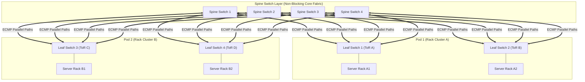
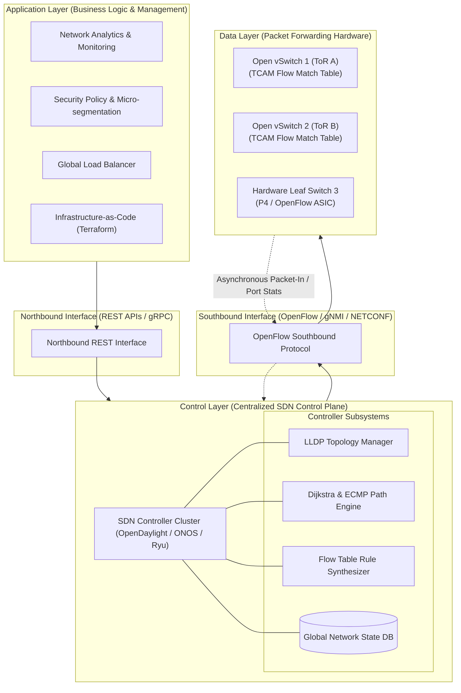
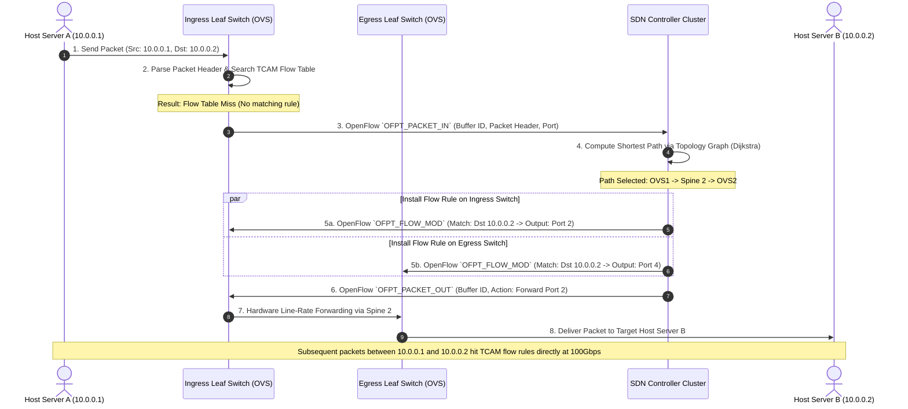
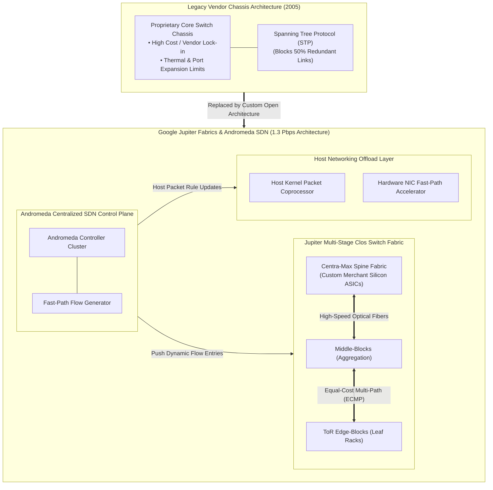

# UNIT 3 — Data Center Architecture 🏢

> **Cloud and Data Center Technology (DI05016031)** · **9 hrs · 20% weightage**
> **Covers syllabus sections:** 3.1 Data Center Fundamentals · 3.2 Data Center Networking (topologies + SDN) · 3.3 Data Center Automation & Scaling (automation, IaC, scalability/elasticity)
> **Related practicals:** [P05](./P05%20—%20Mininet%20Virtual%20Sdn%20Lab.md)

---

## 🧭 Chapter Roadmap

This unit (20%) is where the "**Data Center**" half of the subject name lives. Two mega-topics dominate the PYQs: **SDN architecture** (a 7-mark favourite in every single paper) and **data center network topologies**. P05 (Mininet SDN lab) gives you a hands-on SDN topology.

| # | Concept | Exam importance | Related |
|---|---------|-----------------|---------|
| 3.1 | DC fundamentals: evolution + key components | ★★★ | — |
| 3.2 | DC network topologies (Fat-Tree, Leaf-Spine, ToR) | ★★★★ | — |
| 3.2 | SDN in the data center | ★★★★★ | P05 |
| 3.3 | Automation & IaC (Terraform, Ansible) | ★★★★ | P02 (cloud org automation) |
| 3.3 | Scalability vs elasticity | ★★★★ | Unit 1 |

### Learning outcomes — after this unit you can:
1. Define a data center, trace its evolution, and list its key components.
2. Explain the main data center network topologies (ToR, Leaf-Spine/Fat-Tree, Clos) and pick one.
3. Explain **SDN** architecture (control/data/application planes) with a diagram — and its pros/cons.
4. Explain data center **automation** and **Infrastructure as Code (IaC)** with tools (Terraform, Ansible, Puppet).
5. Differentiate **scalability** and **elasticity**.

---

## 3.1 Data Center Fundamentals

### 3.1.1 Definition & evolution ⭐
A **data center** is a **facility (or cluster of facilities) that houses computer systems, storage systems, and associated networking equipment** along with supporting infrastructure (power, cooling, physical security) to run an organization's IT workloads reliably and at scale.

**Evolution:**
| Era | Milestone |
|---|---|
| 1940s–60s | Huge single mainframes in a room (the original "computer room") |
| 1970s–80s | Client–server + racks of servers; enterprise data centers appear |
| 1990s | Internet/commercial data centers; dot-com server farms |
| 2000s | **Virtualization** → server consolidation, blade servers |
| 2010s–now | **Hyper-scale clouds** (Google, AWS, Azure): tens/hundreds of MW, automated, software-defined |

### 3.1.2 Key components (w_24 Q.3-a-alt) ⭐
| Layer | Components |
|---|---|
| **Compute** | Rack servers, blades, CPUs, GPUs, virtualization hosts |
| **Storage** | SAN/NAS, direct-attached disks, object storage nodes (P07) |
| **Networking** | Switches (ToR/aggregation/core), routers, load balancers, firewalls, cabling (fiber) |
| **Power** | Redundant UPS, diesel/gas generators, dual power feeds (N+1/2N) |
| **Cooling** | CRAC/CRAH units, cold/hot aisle containment, liquid cooling |
| **Management & security** | DCIM, monitoring, CCTV, biometric access, fire suppression, environmental sensors |

## 3.2 Data Center Networking ⭐⭐

### 3.2.1 Network topologies
Data centers connect thousands of servers; topology decides **bandwidth, redundancy, cost, and manageability**.

| Topology | Structure | Pros | Cons | Used in |
|---|---|---|---|---|
| **Traditional 3-tier** | Core → Aggregation → Access switches | Simple, familiar | Oversubscription, SPOF at core, limited east-west bandwidth | Legacy DCs |
| **Top-of-Rack (ToR)** | 1 switch per rack; servers → ToR → core | Short cabling, simple | ToR = per-rack SPOF | Common hybrid |
| **Leaf-Spine (Clos/Fat-Tree)** | Every leaf connects to **every** spine (full mesh); equal paths | **Scale-out**, predictable latency, load balancing via ECMP | More switches/ports cost | Modern & hyper-scale DCs |


**Why Leaf-Spine:** any server reaches any other in at most *2 hops*; adding capacity = add another spine/leaf (scale-out); no single congestion point; east-west (server-to-server) traffic is as fast as north-south.

### 3.2.2 SDN (Software-Defined Networking) in the data center ⭐⭐⭐

**Definition:** SDN **decouples the control plane (decision-making brain) from the data plane (packet forwarding hardware)**. A centralized **SDN controller** programs network switches via a southbound protocol (**OpenFlow**), while applications talk to the controller via northbound APIs.



**The 3 planes:**
| Plane | Function | Devices |
|---|---|---|
| **Application plane** | Business logic via apps (security, routing policies) | Northbound APIs (REST) |
| **Control plane** | Global view; computes routes; pushes flow rules | SDN controller (OpenDaylight, ONOS, Ryu, POX) |
| **Data plane** | Matches & forwards packets per flow table | OpenFlow switches (Open vSwitch — P05!) |

**How a packet flows (P05 proof):** switch gets unknown flow → sends packet-in to controller → controller computes path → installs flow rules on switches → subsequent packets forwarded in hardware at line-rate. In P05, `s1 dpctl dump-flows` shows the installed flows.

**Advantages (w_25 Q.3-b):** central visibility, programmable automation (no CLI-by-CLI config), vendor-neutral hardware, fast path changes (live traffic engineering), easier multi-tenancy/isolation in clouds.
**Disadvantages:** controller = new single point of failure (need clusters), OpenFlow maturity, skill gap, security of the controller plane itself, performance overhead for exotic features.

## 3.3 Data Center Automation and Scaling ⭐⭐

### 3.3.1 Automation in data centers (s_24 Q.3-b)
**Why important:** manual racking/cabling/OS installs cannot scale to thousands of servers; human error causes outages; operators need *speed, consistency, repeatability*.
**What gets automated:** server provisioning (PXE/images), configuration, patching, monitoring/alerting, scaling policies, VM lifecycle (Unit 2), and failover.
> → **Link:** OpenStack (P01) is the automation *control plane* for a data center's virtual resources.

### 3.3.2 Infrastructure as Code (IaC) ⭐⭐
**Definition:** managing and provisioning IT infrastructure **through machine-readable definition files** (code) instead of manual configuration. The same code creates dev/staging/prod consistently and is version-controlled (Git).

| Approach | Model | Tools | Example workflow |
|---|---|---|---|
| **Imperative (procedural)** | "Do these steps in order" | Ansible, Chef, Puppet, shell scripts | `apt install nginx` → copy config → restart service |
| **Declarative (desired state)** | "Make it look like this" | Terraform, CloudFormation, Puppet DSL | `resource "aws_instance" "web" { ami = "…" }` |

```hcl
# Terraform (declarative IaC) - create one cloud VM
resource "aws_instance" "web" {
  ami           = "ami-0abcdef1234567890"
  instance_type = "t2.micro"
  tags = { Name = "cdct-web" }
}
```
**Benefits:** repeatability, versioning, auditability, speed, drift detection, disaster recovery (rebuild in minutes). → *Terraform/Ansible/CloudFormation are the "popular automation tools" the PYQs ask about.*

### 3.3.3 Scalability and elasticity ⭐⭐

| Criterion | Scalability | Elasticity |
|---|---|---|
| What it is | Ability to *handle growth* by adding resources | Ability to *automatically* match resources to current demand (up *and* down) |
| Direction | Scale **up** (bigger machine) or scale **out** (more machines) | Reactive: shrink/grow based on load |
| Automation | Usually planned/manual (capacity planning) | **Automatic** via autoscaling policies/metrics |
| Time horizon | Long-term capacity | Short-term fluctuation handling |
| Analogy | A road made wider to handle more cars | A toll booth that opens/closes lanes as traffic changes |
| Example | Add a 32-core server to a cluster | Autoscale web tier 2→10→2 instances during a festival |

> **Exam one-liner:** *Scalability is the capacity to grow; elasticity is the automation of that growth (and shrink) in real time.* A system can be scalable but not elastic (manual scaling); elastic implies scalable.

---

## 🧠 Deep-Dive Topics

### Deep Dive A: SDN — the full packet-in/packet-out story
1. Host A sends its first packet to switch S1.
2. S1's flow table has no match → S1 sends **OFPT_PACKET_IN** (header + buffer) to the controller.
3. Controller consults its global topology view → decides path A→B → installs **flow entries** on all switches along the path (match: dst IP; action: forward out port X).
4. S1 now forwards A's buffered packet; subsequent packets match the flow rule and are forwarded **without** contacting the controller.
This is exactly what P05's `pingAll` demonstrates — the first ping triggers learning, the rest are forwarded by flows.

### Deep Dive B: Leaf-Spine oversubscription maths
With *k* spine switches and *k* leaves, total uplinks = k×k; each leaf serves N servers. **Oversubscription ratio** = server bandwidth ÷ uplink bandwidth. A ratio of 1:1 (full bisection) is expensive; 3:1 is common. This ratio is what "performance" comparisons of DC fabrics really mean.

### Deep Dive C: IaC imperative vs declarative — which to answer
If the PYQ says "IaC with its **different approaches**" (s_24/w_25 Q.3-c-alt) → give **imperative vs declarative** + tools. If it says "**popular automation tools**" (w_24 Q.3-c-alt) → list **Terraform, Ansible, CloudFormation, Puppet, Chef** with one line each.

### Deep Dive D: Vendor lock-in (s_24 Q.3-b-alt) — a 4-mark "justify" classic
Why it's a major problem: proprietary APIs (AWS vs GCP), data **egress fees**, managed services that don't port (DynamoDB vs Spanner), IAM/policy differences, and retraining cost → *switching clouds = migration cost + lock-in risk*. Mitigations: open standards (S3 API, OpenStack), containers (Unit 6), multi-cloud strategies, IaC to rebuild anywhere.

---

## 🚀 Beyond the Textbook (what most classes won't tell you)

1. **East-west vs north-south traffic** — modern DCs are dominated by server-to-server (east-west) traffic; this is *why* Leaf-Spine replaced the 3-tier tree. Examiners love this as "why do we need better topologies".
2. **ECMP** (Equal-Cost Multi-Path) — Leaf-Spine uses all parallel paths simultaneously; without ECMP the extra links would sit idle. A great "beyond syllabus" sentence.
3. **SDN isn't only OpenFlow** — modern "SDN" includes VXLAN/EVPN overlays and controllers like VMware NSX/OpenDaylight; the control/data separation is the exam-visible part.
4. **DCIM + PUE** — power usage effectiveness (PUE = total power / IT power, ideal 1.0) is the headline green metric of data centers — a strong bonus point in "key components".
5. **Hyperscale DCs run at ~40–45% of top-500 supercomputer performance with commodity hardware** — the whole *data center = software-defined commodity hardware* story behind Unit 3.

---

## 📝 PYQ Map — UNIT 3 (all available papers)

| Paper | Q. | Topic | Marks |
|---|---|---|---|
| **Summer 2024** | Q.3(a) | Define Data Center; list types | 3 |
| | Q.3(b) | Why is data centre automation important? | 4 |
| | Q.3(c) | Explain SDN architecture | 7 |
| | Q.3(a)-alt | Define: Cloud Elasticity, Cloud Scalability | 3 |
| | Q.3(b)-alt | Vendor lock-in is a major problem | 4 |
| | Q.3(c)-alt | IaC with its different approaches | 7 |
| **Winter 2024** | Q.3(a) | Define DC; describe any two types | 3 |
| | Q.3(b) | Scalability vs elasticity in cloud data center | 4 |
| | Q.3(c) | SDN in data center with diagram | 7 |
| | Q.3(a)-alt | Identify & describe key components of a DC | 3 |
| | Q.3(b)-alt | List DC network topologies; explain one | 4 |
| | Q.3(c)-alt | IaC with its popular automation tools | 7 |
| **Summer 2025** | Q.3(b) | Define DC; types; explain one | 4 |
| | Q.3(b)-alt | Cloud scalability in detail | 4 |
| | Q.4(c) | Data center network topologies | 7 |
| | Q.4(c)-alt | SDN architecture | 7 |
| | Q.5(a) | Explain IaC in detail | 3 |
| | Q.5(a)-alt | Automation in data centers | 3 |
| **Winter 2025** | Q.3(a) | Define DC; list types | 3 |
| | Q.3(b) | Advantages & disadvantages of SDN | 4 |
| | Q.3(c) | SDN architecture | 7 |
| | Q.3(a)-alt | List DC network topologies; explain one | 3 |
| | Q.3(b)-alt | Scalability vs elasticity | 4 |
| | Q.3(c)-alt | IaC with its different approaches | 7 |
| **Summer 2026** | Q.3(a) | Define DC; why are DCs important? | 3 |
| | Q.3(b) | Types of data center services | 4 |
| | Q.3(c) | SDN architecture | 7 |
| | Q.3(a)-alt | Differentiate scalability and elasticity | 3 |
| | Q.3(b)-alt | Explain IaC | 4 |
| | Q.3(c)-alt | Data center network topologies | 7 |

### ✅ Solved PYQ answers (UNIT 3)

**Q. (s_24 Q.3a / w_25 Q.3a, 3 marks) — Define Data Center. List types.**
> A **data center** is a facility that houses an organization's **computer systems, storage systems, and networking equipment**, together with supporting power, cooling, and physical security, to reliably run its IT workloads at scale. **Types:** (1) **Enterprise/on-premise data center** — built and run by the organization for its own workloads; (2) **Colocation data center** — third-party facility where an organization rents racks/space; (3) **Managed services / hosting data center** — facility where the provider also manages the infrastructure (IaaS/PaaS style); (4) **Cloud/hyperscale data center** — large provider facilities powering public clouds (AWS, Google, Azure); (5) **Edge data center** — small facilities placed near users to cut latency (Unit 6).

**Q. (w_24 Q.3b / s_26 Q.3a-alt, 3–4 marks) — Scalability vs elasticity in cloud data center**
> **Scalability** is the ability of a system to **handle growing workload** by adding resources — scaling *up* (larger VM) or *out* (more instances); it is typically a *planned, long-term* capacity decision. **Elasticity** is the ability to **automatically provision and release resources to match current demand** in real time — scaling out during a traffic spike and back down when it ends, driven by autoscaling policies and metrics. Scalability answers *"can it grow?"*, elasticity answers *"does it grow (and shrink) by itself?"*. A system can be scalable without being elastic (manual addition); an elastic system is always scalable. Example: a web tier manually adding a server = scalable; AWS Auto Scaling doubling instances at 70% CPU and halving at 30% = elastic.

**Q. (s_24 Q.3c / w_24 Q.3c, 7 marks) — Explain SDN architecture with diagram**
> SDN (**Software-Defined Networking**) separates the **control plane** from the **data plane** and centralizes the brain of the network in a **controller**. It has three planes: **(1) Application plane** — network applications (security policies, load balancing, monitoring) express *what* the network must do through **northbound REST APIs**; **(2) Control plane** — the **SDN controller** (OpenDaylight, ONOS, Ryu, POX) keeps a **global view of the topology**, computes routes, and installs **flow rules**; it talks down via the **southbound protocol OpenFlow**; **(3) Data plane** — **SDN switches** (e.g., Open vSwitch) only **match packets against their flow tables and forward**, with no routing logic. *Diagram:* applications → northbound API → controller → southbound OpenFlow → switches. **Benefits:** centralized visibility, programmability, vendor-neutral hardware, fast network-wide changes. **Risks:** controller becomes a single point of failure and a security target.

**Q. (w_24 Q.3c-alt, 7 marks) — Explain Infrastructure as Code (IaC) with its popular automation tools**
> **IaC** means managing and provisioning infrastructure (servers, VMs, networks, storage) using **machine-readable definition files** (code) rather than manual configuration; the code is version-controlled (Git) so the whole environment is repeatable, auditable, and testable. **Approaches:** *imperative/procedural* (step-by-step scripts — **Ansible, Chef, Puppet**, shell) vs *declarative/desired-state* (describe the end state — **Terraform, AWS CloudFormation, Pulumi**). **Popular tools:** **Terraform** — declarative, multi-cloud provisioning (e.g., `resource "aws_instance" …`); **Ansible** — agentless, YAML playbooks for configuration management; **Puppet/Chef** — mature configuration management with agents; **CloudFormation** — AWS-native templates. **Benefits:** consistency (same code = same infra), speed, versioning, rollback, drift detection, and disaster recovery — rebuild the environment from code in minutes.

**Q. (s_25 Q.4c / s_26 Q.3c-alt, 7 marks) — Explain data center network topologies**
> DC topologies describe how servers and switches connect. **(1) Traditional 3-tier:** Core → Aggregation → Access (campus-style); simple but has oversubscription and a core bottleneck. **(2) Top-of-Rack (ToR):** each rack has its own switch connecting to aggregation/core; short cabling, but the ToR switch is a per-rack single point of failure. **(3) Leaf-Spine (Clos / Fat-Tree):** every **leaf** switch (rack layer) connects to **every spine** switch (core fabric), forming a full mesh; any two servers are at most **two hops** apart, east-west traffic is fast, and capacity grows by adding spines/leaves (**scale-out**). Load balancing across equal paths uses ECMP. **Modern hyperscale DCs use Leaf-Spine** because it delivers predictable latency, no single congestion point, and horizontal scalability. (Draw the diagram from §3.2.1.)

**Q. (s_24 Q.3b, 4 marks) — Why is data centre automation important?**
> Manual data-center operations cannot scale: provisioning one server by hand takes hours-days, and every manual change risks human error. **Automation is important because** it (1) provides **speed** — software can provision thousands of servers/VMs in minutes via APIs and image templates; (2) gives **consistency/repeatability** — the same scripted steps produce identical results every time; (3) **reduces errors and outages** caused by manual configuration; (4) enables **elasticity** — autoscaling policies react to load automatically; (5) supports **IaC** — infrastructure defined as versioned code; (6) automates **monitoring, patching, backup and failover**, lowering operational cost and improving availability.

---

## ✍️ Practice Problems (self-test — answers hidden)

1. Define data center and list 5 key component groups.
2. Draw and label the three planes of SDN. What protocol is southbound?
3. Compare the 3-tier and Leaf-Spine topologies on: hops, east-west traffic, scalability.
4. Differentiate scalability and elasticity with an autoscaling example.
5. IaC: name the declarative and imperative approaches with one tool each.
6. Why is vendor lock-in a "major problem"? Give one mitigation.

<details>
<summary>📌 Model solutions</summary>

1. Compute, storage, networking, power, cooling, management/security.
2. Application (northbound REST) → Control (SDN controller, global view) → Data (OpenFlow switches). Southbound = OpenFlow.
3. 3-tier: up to 3+ hops, poor east-west, limited scale (core bottleneck). Leaf-Spine: ≤2 hops, excellent east-west, scale-out by adding spines/leaves.
4. Scalability = ability to grow (up/out); elasticity = automatic grow+shrink on demand. AWS Auto Scaling (70% CPU → +2, 30% → −2) is elasticity; adding a bigger DB server is scalability.
5. Declarative: Terraform / CloudFormation. Imperative: Ansible / Chef / Puppet.
6. Proprietary APIs, egress fees, non-portable managed services, retraining. Mitigations: open standards (S3 API), containers, multi-cloud, IaC.
</details>

---

## 📖 Glossary of Key Terms

| Term | Definition |
|---|---|
| **Data center** | Facility housing compute, storage, networking + power/cooling/security |
| **PUE** | Power Usage Effectiveness (total power ÷ IT power) |
| **ToR** | Top-of-Rack switch per rack |
| **Leaf-Spine / Clos** | Full-mesh two-layer fabric; every leaf ↔ every spine |
| **Oversubscription** | Ratio of server bandwidth to uplink bandwidth |
| **ECMP** | Equal-Cost Multi-Path load balancing |
| **SDN** | Software-Defined Networking (control/data separation) |
| **Control plane** | The "brain" (controller) deciding where packets go |
| **Data plane** | The "muscle" (switches) forwarding packets |
| **OpenFlow** | Southbound protocol between controller and switches |
| **Northbound API** | Interface between apps and the controller (REST) |
| **Automation** | Scripted/programmatic provisioning & ops |
| **IaC** | Infrastructure as Code — infra defined in files |
| **Imperative / Declarative** | Step-by-step vs desired-state configuration |
| **Terraform / Ansible** | Declarative multi-cloud IaC / agentless YAML config mgmt |
| **Scalability** | Ability to grow (scale up/out) |
| **Elasticity** | Automatic scale up/down with demand |
| **Vendor lock-in** | Hard-to-migrate dependency on one provider |

---

## 🔗 Curated Resources (per concept)

**Data center fundamentals**
- Uptime Institute (tiers, PUE): https://uptimeinstitute.com/tiers
- NIST data center energy: https://www.nist.gov/programs-projects/data-center-optimization

**Networking & SDN**
- Open Networking Foundation (SDN/OpenFlow): https://opennetworking.org
- OpenDaylight docs: https://docs.opendaylight.org
- Leaf-spine architecture (Cisco): https://www.cisco.com/c/en/us/products/collateral/switches/nexus-9000-series-switches/white-paper-c11-737022.html

**IaC / automation**
- Terraform docs: https://developer.hashicorp.com/terraform/docs
- Ansible docs: https://docs.ansible.com
- AWS CloudFormation: https://docs.aws.amazon.com/cloudformation/

**Mininet (P05)**
- Mininet: http://mininet.org
- Mininet wiki: https://github.com/mininet/mininet/wiki

**Books (GTU syllabus)**
- Wu & Buyya, *Cloud Data Centers and Cost Modeling* (Elsevier, ISBN 978-0-12-801413-4)
- Buyya, Vecchiola & Selvi, *Mastering Cloud Computing* — data center chapter

**Videos (high yield)**
- *What is SDN?* — TechField / David Bombal
- *Data center topologies: ToR, Leaf-Spine* — IBM Cloud / TechTarget
- *Terraform explained* — TechWorld with Nana

---

## 🎥 Video Study Guide (YouTube)

> Search keywords + trusted channels, in watching order.

### 🧑‍🎓 Step 0 — Pick your learning style
| Style | You learn best by | Your path through this unit |
|---|---|---|
| 🎧 **Listener** | short explainers | 1 video per topic (4–10 min each) |
| 🛠️ **Builder** | doing it | Run [P05](./P05%20—%20Mininet%20Virtual%20Sdn%20Lab.md) in the lab VM |
| 🧠 **Deep Diver** | the "why" | Watch SDN internals + data center architecture tours |
| 🎓 **Academic** | exam marks | Master the SDN diagram + topology tables from the PYQ map |

### 🎬 Step 1 — Watch by topic
| Topic | YouTube search keywords | Best channels |
|---|---|---|
| DC fundamentals | `what is a data center tour` · `data center components explained` | Google Cloud Tech, Level1Techs |
| Topologies | `leaf spine vs 3 tier architecture` · `data center network topologies` | IBM Cloud, David Bombal, TechTarget |
| SDN intro | `what is software defined networking` · `sdn explained simply` | TechField, PowerCert |
| SDN deep | `sdn architecture control plane data plane` · `openflow explained` | David Bombal, SDxCentral |
| Mininet demo | `mininet tutorial sdn` · `mininet ping topology` | Open Networking Foundation demos, David Bombal |
| IaC | `terraform vs ansible` · `infrastructure as code explained` | TechWorld with Nana, IBM Cloud |
| Scalability/elasticity | `scalability vs elasticity cloud` · `auto scaling explained` | ByteByteGo, AWS Online Tech Talks |
| Revision (exam) | `data center unit 3 diploma` · `sdn 10 minute recap` | Gate Smashers, Neso Academy |

### 🎬 Step 2 — Full playlists (Deep Divers & Academics)
1. *Data Center Networking* — David Bombal (SDN/OpenFlow deep dive).
2. *Infrastructure as Code* — TechWorld with Nana Terraform course.
3. NPTEL *Cloud Computing* (data center unit): https://archive.nptel.ac.in/courses/106/105/106105167/

### 🎬 Step 3 — Proof you got it (5 min)
- Draw the 3-plane SDN diagram from memory and label OpenFlow.
- Explain why Leaf-Spine beats 3-tier for east-west traffic.
- Give one example each of scalability and elasticity from a real cloud.

---

*Next: [UNIT 4 — Cloud Storage and Database Services](./Unit%204%20—%20Cloud%20Storage%20and%20Database%20Services.md)*

---


---

## 📖 Historical Context & Motivation

Enterprise data centers of the late 1990s and early 2000s were built on traditional **3-Tier Hierarchical Architectures** consisting of Core, Aggregation (Distribution), and Access switch layers. This structural design was optimized for *North-South traffic*—data moving vertically between client devices on the public internet and application servers inside the data center. However, as web applications shifted from monolithic desktop software toward distributed, multi-tier web services and microservices architectures (Unit 1), data center traffic patterns inverted. Server-to-server (*East-West traffic*)—driven by parallel database queries, RPC microservice calls, live VM migrations (Unit 2), and distributed map-reduce jobs—began accounting for over 80% of total data center network packets.

```
Traditional 3-Tier Tree Topology (North-South optimized, STP bottlenecks):
  [Core Layer] ◄── Over-subscribed / Single Points of Failure
       │
  [Aggregation Layer] ◄── Spanning Tree Protocol (STP) blocks redundant paths
       │
  [Access Layer (ToR)]

Modern Leaf-Spine / Clos Topology (East-West optimized, ECMP parallel paths):
  [Spine Layer] ◄── Non-blocking, non-oversubscribed matrix
   ╱   │   │   ╲
 [Leaf] [Leaf] [Leaf] [Leaf] ◄── Top-of-Rack Switches
```

Under 3-tier topologies, East-West traffic was forced to traverse up and down the network tree, creating severe bandwidth bottlenecks at core routers. Furthermore, to prevent layer-2 switching loops, data centers relied on the **Spanning Tree Protocol (802.1D STP)**, which intentionally disabled up to 50% of redundant network links, leaving expensive bandwidth capacity completely unutilized. In 2008, Charles Clos's 1953 circuit-switching telephone topology was adapted into computer networking by Al-Fares et al. as the **$k$-port Fat-Tree Clos Topology**, guaranteeing non-blocking bisection bandwidth. Concurrently, Software-Defined Networking (SDN) emerged from Stanford University's Ethane and OpenFlow projects (2007–2008), decoupling the control logic from forwarding switches and enabling centralized, software-programmable data center networks.

---

## 🔬 Deep Dive: System Architecture

### Leaf-Spine Clos Topologies, SDN Control/Data Plane Architecture, and Infrastructure-as-Code Engines

Modern cloud data centers replace hardware-locked, proprietary switches with a software-defined fabric governed by centralized SDN controllers and automated by Infrastructure-as-Code (IaC) engines.

```mermaid
flowchart TB
    subgraph AppPlane["Application Plane (Northbound REST APIs)"]
        IaC[Terraform / Ansible Engine]
        SecPol[Security & Micro-segmentation Apps]
        LBApp[Global Load Balancer Controller]
    end
    subgraph ControlPlane["Control Plane (SDN Controller Cluster)"]
        SDN[SDN Controller Cluster<br/>(OpenDaylight / ONOS / Ryu)]
        FlowEngine[Flow Rule Computation Engine]
        TopoMap[Global Network Topology DB]
        SDN <--> FlowEngine & TopoMap
    end
    subgraph DataPlane["Data Plane (Leaf-Spine Switch Fabric)"]
        Spine1[Spine Switch 1]
        Spine2[Spine Switch 2]
        Leaf1[Leaf Switch 1 (ToR)]
        Leaf2[Leaf Switch 2 (ToR)]
        Spine1 & Spine2 --- Leaf1 & Leaf2
        HostA["Host Server A"] --- Leaf1
        HostB["Host Server B"] --- Leaf2
    end
    AppPlane -- "Northbound REST APIs" --> ControlPlane
    ControlPlane -- "Southbound Protocol (OpenFlow / gNMI)" --> DataPlane
```

#### 1. Topology Mechanics: $k$-Port Fat-Tree Clos Networks
A $k$-port Fat-Tree network is constructed entirely from identical $k$-port commodity switches, organized into three levels: Edge, Aggregation, and Core.
- The network is divided into $k$ **pods**, each containing $(k/2)^2$ servers and two layers of $k/2$ switches (Edge and Aggregation).
- The Core layer consists of $(k/2)^2$ switches. Each Core switch $i$ (where $1 \le i \le k/2$) connects to the $i$-th Aggregation switch in each pod.
- **Maximum Supported Host Capacity**:

$$N_{hosts} = \frac{k^3}{4}$$

- **Non-blocking Bisection Bandwidth**: The total number of Core switches and multi-path links guarantees that if $\frac{N_{hosts}}{2}$ servers attempt to transmit simultaneously to the remaining $\frac{N_{hosts}}{2}$ servers, the network yields a 1:1 oversubscription ratio with zero bandwidth contention, leveraging **Equal-Cost Multi-Path (ECMP)** routing across all parallel paths.

#### 2. SDN Pipeline & Packet-In / Flow-Mod Mechanics
In a Software-Defined Network, physical switches (e.g., Open vSwitch - OVS) contain no autonomous routing protocols (OSPF/BGP). Forwarding is strictly governed by **Ternary Content-Addressable Memory (TCAM)** flow tables populated by the SDN Controller.



When a packet arrives at an ingress Leaf switch:
1. The switch parses packet header tuples (Ingress Port, Source/Destination MAC, VLAN ID, Source/Destination IP, L4 Port).
2. The packet is evaluated sequentially against TCAM flow tables. If a match occurs, the switch updates packet counters and executes the match-action (e.g., `FORWARD:Port3`, `DECAPSULATE_VXLAN`, or `DROP`).
3. If no matching rule exists (**Flow Table Miss**), the switch encapsulates the packet header and sends a `Packet-In` asynchronous message over the **Southbound OpenFlow/gNMI API** to the SDN Controller.
4. The SDN Controller computes the shortest path across its global topology graph using Dijkstra's algorithm, constructs a `Flow-Mod` message, and writes the new flow entry into the switch's TCAM hardware. Subsequent packets follow the hardware TCAM path at line rate without controller intervention.

#### 3. Infrastructure as Code (IaC) State Reconciliation Engine
Data center automation tools (e.g., Terraform) operate via a **Declarative Execution Loop**. Unlike imperative scripts, declarative IaC defines the target $State_{desired}$. The IaC engine executes a three-phase reconciliation pipeline:
1. **Refresh & Inspection**: Queries physical cloud provider APIs to read $State_{actual}$.
2. **Diff Engine Graph Analysis**: Constructs a Directed Acyclic Graph (DAG) of dependency nodes ($N_{resource}$) and computes structural diff:

$$\Delta State = State_{desired} \setminus State_{actual}$$

3. **Graph Execution**: Performs topological sorting on the DAG to execute creation, modification, or destruction API actions concurrently across independent nodes.

---

## 🏢 Real-World Case Study

### Google’s Jupiter Data Center Network & Andromeda SDN Platform

Google operates some of the largest hyper-scale data centers on Earth. By 2015, Google’s traditional vendor-purchased network chassis could not scale to support internal multi-Terabit compute requirements for Search, YouTube, and Bigtable.



#### Engineering Architecture & Achievements:
1. **Custom Merchant Silicon**: Google abandoned proprietary networking hardware, designing custom switch chassis built from cheap commodity merchant silicon chips.
2. **Jupiter Network Fabric**: Built a multi-stage Clos topology delivering **1.3 Petabits per second** of aggregate bisection bandwidth—enough capacity for 300,000 servers to communicate simultaneously at 40 Gbps without oversubscription.
3. **Andromeda Network Virtualization**: Google implemented Andromeda, a software-defined network virtualization stack that offloads packet processing to host CPU software threads and hardware NIC accelerators, installing flow rules dynamically to achieve sub-millisecond tail latency for cross-data-center microservice traffic.

---

## 📝 End-of-Chapter Exercises

### Exercise 1: $k$-Port Fat-Tree Topology & Bisection Bandwidth Construction
Design a complete $k = 6$ Fat-Tree Clos network topology.
- (a) Calculate the total number of Pods, Core switches, Aggregation switches, Edge switches, and maximum host servers supported.
- (b) Draw the structural network graph connecting Core switches to Pod 1 and Pod 2, indicating port numbering.
- (c) Prove mathematically that the network achieves 1:1 non-blocking bisection bandwidth. Calculate the oversubscription ratio if the link count between Aggregation switches and Core switches is reduced by 50%.

### Exercise 2: SDN TCAM Flow Rule Aggregation & Latency Modeling
An SDN controller manages a data center switch with a hardware TCAM limit of 2,048 flow entries. The network experiences a flood of distinct microservice flows belonging to the subnet `10.240.0.0/16`.
- (a) If uncached flows trigger `Packet-In` events taking $t_{controller} = 5\text{ ms}$ round-trip latency, calculate the average packet delivery latency for the first 100 packets of a new TCP connection stream.
- (b) Formulate a CIDR wildcards algorithmic compression strategy that aggregates 512 individual host flow rules (`10.240.1.0` through `10.240.2.255`) into a minimal set of TCAM match-action rules without creating security hole side-effects.

### Exercise 3: Data Center PUE & Thermodynamic Efficiency Optimization
A 50 MW hyper-scale data center exhibits the following electrical power consumption parameters: IT Equipment Load (Servers, Storage, Switches) = 30 MW; Cooling Infrastructure (Chillers, CRAH units, Pumps) = 15 MW; Power Distribution Losses (UPS transformations, PDU step-downs) = 4 MW; Lighting and Auxiliary Facilities = 1 MW.
- (a) Calculate the current Power Usage Effectiveness (PUE) and Data Center Infrastructure Efficiency (DCIE).
- (b) If the data center engineering team replaces mechanical chillers with direct evaporative economizers (free cooling), reducing cooling load by 60%, calculate the new PUE.
- (c) Compute the total annual financial savings in USD assuming an industrial electricity rate of \$0.08 per kilowatt-hour (kWh).

### Exercise 4: Infrastructure as Code (IaC) Dependency Graph Reconciliation
A system architect writes a Terraform module to deploy a microservice stack consisting of 1 VPC, 2 Subnets, 1 Internet Gateway, 4 EC2 instances, 1 Application Load Balancer (ALB), and 1 RDS Database instance.
- (a) Construct the Directed Acyclic Graph (DAG) representing the resource creation dependency sequence.
- (b) Identify which infrastructure resources can be provisioned in parallel by the IaC execution engine during Phase 3 graph execution.
- (c) Analyze the failure cascade if a manual configuration drift deletes the Internet Gateway out-of-band, and write the state repair execution plan (`terraform import` vs. `terraform refresh`).
