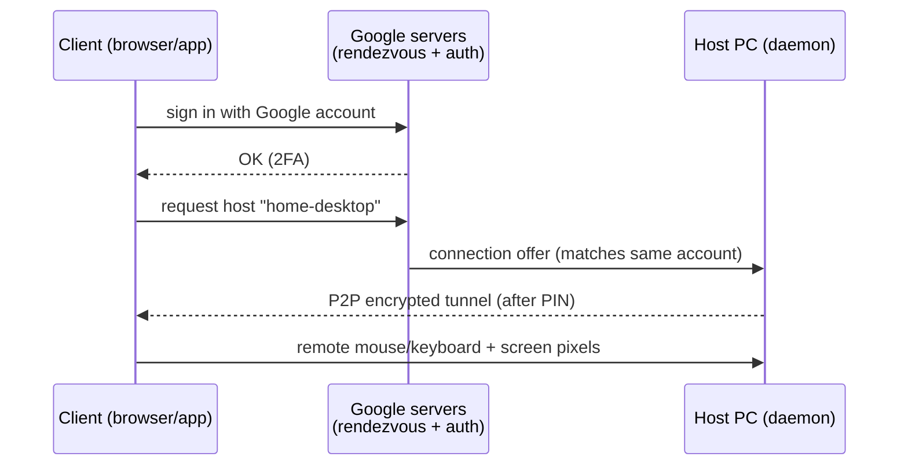

# P04 — Desktop Virtualization with Chrome Remote Desktop

**Subject:** Cloud and Data Center Technology | **Unit:** 2 | **Approx. Hrs:** 4
**PrO (verbatim):** *Create desktop Virtualization using Chrome Remote Desktop.*

---

## 1. Objective
- Set up **Chrome Remote Desktop** (a desktop-virtualization / remote-desktop service) on a **host** computer.
- Connect to the host from a **client** (same computer, another computer, phone).
- Configure **security settings** (PIN, 2-Step Verification, screen locking).
- List use cases of desktop virtualisation.

## 2. Theory (exam-ready)
**Desktop virtualization** = the *desktop environment* (OS, apps, files) runs on one machine (the host) but is *displayed and controlled from another* (the client) over the network. Chrome Remote Desktop is a **hosted remote-desktop** service from Google:

- Host installs the **Chrome Remote Desktop** app/extension (Chrome or the standalone app).
- A small **host daemon** runs in the background and registers with Google's rendezvous servers.
- The client (Chrome browser, phone app, or web app) requests a connection; after **two-factor** checks (Google account) and the **host PIN**, a secure **P2P (peer-to-peer)** encrypted channel is established.

## 3. Step-by-step

### 3.1 Host setup (Windows/macOS/Linux)
1. Install **Google Chrome** → https://www.google.com/chrome/
2. Open https://remotedesktop.google.com → **Set up via Chrome Remote Desktop** → *Set up another computer*.
3. Download and install **Chrome Remote Desktop Host** (admin rights).
4. Give the host a name, e.g., `home-desktop`.
5. Set a **6-digit PIN** (min. 6 digits) → **Start**. The host is now ready. *(Keep the window closed but the daemon running in the tray.)*

### 3.2 Security settings (do these!)
- [ ] Enable **2-Step Verification** on the Google account (https://myaccount.google.com/security).
- [ ] Use a **strong 6-digit PIN** (not 123456) — this is the second factor for host access.
- [ ] Uncheck *"Allow remote management"* if you only need remote access (management mode needs extra credentials).
- [ ] Set the host to **lock the screen** after disconnect (host app setting) so nobody uses the unattended session.
- [ ] Keep OS firewall on; Chrome Remote Desktop uses ports **443 (HTTPS)** and UDP hole-punching — no inbound port forwarding needed.

### 3.3 Client connection
1. Any device: open https://remotedesktop.google.com/access (or the **Chrome Remote Desktop** mobile app).
2. Sign in with the **same Google account** as the host.
3. Click the host name → enter the **PIN** → **Connect**.
4. You now see and control the host desktop (keyboard, mouse, clipboard, printing).

### 3.4 Same-account vs shared access
- **Same account:** instant, no extra invite.
- **Other people (temporary):** from the host, *Share* → sends a one-time **access code** that expires quickly. This is like "session-based" remote help.

## 4. Comparison: types of desktop virtualization
| Criterion | Chrome Remote Desktop | VDI (e.g., Citrix/VMware Horizon) | RDP (Windows) |
|---|---|---|---|
| Kind | Hosted remote-desktop app | Enterprise desktop virtualization | OS built-in remote desktop |
| Where desktops run | On a real host PC | Centralised on servers | On the Windows PC |
| Scale | 1:1 (one host per user) | 1:N (many users share server farms) | 1:1 |
| Setup effort | Very low | High (infra + licensing) | Low (Windows only) |
| Cost | Free | Expensive | Included in Windows Pro |
| Use case | Support, remote work | Company-wide virtual desktops | Quick admin access |

## 5. Use cases
- **Remote work:** access your office desktop from home.
- **Help desk / tech support:** fix a relative's PC remotely.
- **Lab access:** run the P03 Ubuntu VM or Mininet lab (P05) from any device.
- **File & app access:** use heavy software installed only on the host.
- **Headless machines:** control a machine with no monitor.

## 6. Expected Deliverable (report skeleton)
1. Title, aim, date.
2. Screenshot of host app showing the host name + PIN setup.
3. Screenshot of the client listing the remote host.
4. Screenshot of the live remote desktop session.
5. Security checklist (§3.2) completed.
6. Use-case paragraph + the comparison table (§4).

## 7. Viva Q&A
1. **Is Chrome Remote Desktop free?** — Yes (hosted service by Google).
2. **What ports does it use?** — HTTPS 443 + UDP; it is NAT-friendly (no port forwarding).
3. **How is security ensured?** — Google account (2FA) + per-host PIN + TLS-encrypted P2P session.
4. **Remote desktop vs VDI?** — Remote desktop connects to a *specific* computer; VDI serves *virtual* desktops from a data center.
5. **What if the host is behind a firewall?** — The host dials *out* to Google; the client connects through Google's relay → NAT/firewall traversal is automatic.

## 8. Resources
- Chrome Remote Desktop: https://remotedesktop.google.com
- Google support (set up, PIN, access codes): https://support.google.com/chrome/answer/1649523
- Google account security (2-Step Verification): https://myaccount.google.com/security

---

---

## 🐛 Failure Modes & Debugging (Real-World Experience)

> [!bug] What goes wrong in production?
> When running **Desktop Virtualization Chrome Remote Desktop** in a real environment, it almost never works perfectly the first time. 
> 
> **Common Edge Cases to Test:**
> 1. **Network partitions:** What happens to this code if the Wi-Fi drops halfway through execution?
> 2. **Malformed Inputs:** How does the system behave if fed null values, extremely large datasets, or unexpected data types?
> 3. **Resource Exhaustion:** Does this script handle memory leaks or rate-limiting from APIs?

## 🔬 Extension Challenge

> [!example] Prove your expertise
> To truly master this practical, try modifying the code to achieve the following:
> - **Add robust error handling** (try/catch blocks) and structured logging instead of print statements.
> - **Parameterize the inputs** so the script can be run dynamically from the CLI without hardcoding values.
> - **Optimize it:** Can you reduce the execution time or memory footprint?

## 🎯 Key Takeaways

- **Is Chrome Remote Desktop free?** — Yes (hosted service by Google).
- **What ports does it use?** — HTTPS 443 + UDP; it is NAT-friendly (no port forwarding).
- **How is security ensured?** — Google account (2FA) + per-host PIN + TLS-encrypted P2P session.
- **Remote desktop vs VDI?** — Remote desktop connects to a *specific* computer; VDI serves *virtual* desktops from a data center.
- **What if the host is behind a firewall?** — The host dials *out* to Google; the client connects through Google's relay → NAT/firewall traversal is automatic.

> [!tip] Viva Prep
> Be ready to explain the *why* behind each step, not just the output.
