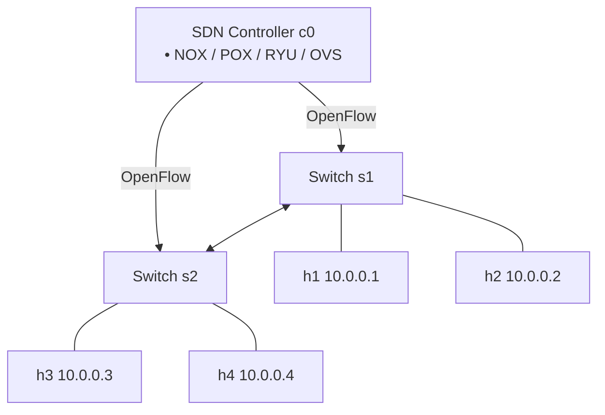

# P05 — Virtual SDN Lab with Mininet

**Subject:** Cloud and Data Center Technology | **Unit:** 3 | **Approx. Hrs:** 4
**PrO (verbatim):** *Setup your own virtual SDN lab using any of below given platform i) Virtualbox/Mininet Environment for SDN - http://mininet.org*

---

## 1. Objective
- Install **Mininet** (network emulator) inside an Ubuntu VM (from P03).
- Write a **Python topology script**: 2 switches, 4 hosts.
- Run the topology, verify the **SDN** data path with ping, and explore with the Mininet CLI.

> [!warning] Lab environment note
> This machine does **not** have Mininet installed (no network namespaces / Open vSwitch). The steps and expected output below are documented from the official Mininet workflow and must be run **in the lab VM** (`sudo apt install -y mininet`).

## 2. Theory (exam-ready)
**Software-Defined Networking (SDN)** separates the **control plane** (decides *where* packets go) from the **data plane** (actually forwards packets). A central **SDN controller** programs simple **switches** via the OpenFlow protocol.

**Mininet** emulates an SDN network on one Linux machine:
- Each **host** is a Linux **network namespace** (isolated network stack, own IPs).
- Each **switch** is a software switch (default: **Open vSwitch** or the built-in `user` switch).
- Links are virtual Ethernet pairs (`veth`), optionally with rate/delay (TCLink).


This is exactly the topology in [`p05_mininet_2switch_4host.py`](./p05_mininet_2switch_4host.py.md).

## 3. Install Mininet (in the P03 Ubuntu VM)
```bash
# In the VM (Ubuntu 22.04/24.04)
sudo apt update
sudo apt install -y mininet
# Optional GUI + SDN controller for advanced labs
sudo apt install -y openvswitch-switch
sudo mn --version   # expect Mininet 2.3.x
```
> Mininet needs root (network namespaces): run `sudo python3 ...` or `sudo mn`.

## 4. The topology script
File: [`p05_mininet_2switch_4host.py`](./p05_mininet_2switch_4host.py.md)

```python
from mininet.topo import Topo
from mininet.net import Mininet
from mininet.link import TCLink
from mininet.cli import CLI
from mininet.log import setLogLevel


class TwoSwitchFourHostTopo(Topo):
    def build(self):
        s1 = self.addSwitch("s1")
        s2 = self.addSwitch("s2")
        h1 = self.addHost("h1", ip="10.0.0.1/24")
        h2 = self.addHost("h2", ip="10.0.0.2/24")
        h3 = self.addHost("h3", ip="10.0.0.3/24")
        h4 = self.addHost("h4", ip="10.0.0.4/24")
        self.addLink(h1, s1)
        self.addLink(h2, s1)
        self.addLink(h3, s2)
        self.addLink(h4, s2)
        self.addLink(s1, s2)


def run():
    setLogLevel("info")
    net = Mininet(topo=TwoSwitchFourHostTopo(), link=TCLink)
    net.addController("c0")
    net.start()
    print(">>> switches:", net.switches)
    print(">>> hosts   :", net.hosts)
    print(">>> Ping test (full mesh)")
    print(net.pingAll())
    print(">>> h1 -> h4 connectivity")
    print(net["h1"].cmd("ping -c 3 10.0.0.4"))
    CLI(net)
    net.stop()


if __name__ == "__main__":
    run()
```

## 5. Run instructions
```bash
cd ~/cdct-lab
cp /mnt/work/college/sem_5/CDCT/practicals/code/p05_mininet_2switch_4host.py .
sudo python3 p05_mininet_2switch_4host.py
```
After the ping test the script drops you into the **mininet>** CLI. Useful commands:
```
mininet> nodes          # list hosts/switches
mininet> links          # show virtual links
mininet> net            # show topology + IPs
mininet> h1 ifconfig    # inspect h1's virtual NIC
mininet> h1 ping -c 3 h4
mininet> h2 traceroute h3
mininet> s1 dpctl dump-flows   # see the OpenFlow flow table on s1
mininet> xterm h1       # open a terminal inside h1 (optional)
mininet> exit
```

## 6. Expected output (run in the lab VM)
```
*** Creating network
*** Adding controller
*** Adding hosts:
h1 h2 h3 h4
*** Adding switches:
s1 s2
*** Adding links:
(h1, s1) (h2, s1) (h3, s2) (h4, s2) (s1, s2)
*** Configuring hosts
*** Starting controller
*** Starting 2 switches
>>> Ping test (full mesh)
h1 -> h2 h3 h4
h2 -> h1 h3 h4
h3 -> h1 h2 h4
h4 -> h1 h2 h3
*** Results: 0% dropped (12/12 received)
>>> h1 -> h4 connectivity
PING 10.0.0.4 (10.0.0.4) 56(84) bytes of data.
64 bytes from 10.0.0.4: icmp_seq=1 ttl=64 time=0.058 ms
64 bytes from 10.0.0.4: icmp_seq=2 ttl=64 time=0.058 ms
64 bytes from 10.0.0.4: icmp_seq=3 ttl=64 time=0.058 ms
--- 10.0.0.4 ping statistics ---
3 packets transmitted, 3 received, 0% packet loss
mininet> exit
```
**Interpretation:** `0% dropped (12/12 received)` = the 2-switch topology routes packets correctly. The ping to `10.0.0.4` crosses **s1 → s2** over the inter-switch link. `s1 dpctl dump-flows` shows the OpenFlow rules the controller installed after the first ARP/ICMP exchange (the *learned flow* — the essence of SDN).

## 7. Expected Deliverable (report skeleton)
1. Title, aim, date.
2. `mn --version` output.
3. The topology script (or link).
4. Screenshot of the script run: topology creation + `pingAll` result.
5. Screenshot of `s1 dpctl dump-flows` showing learned flows.
6. Conclusion: how this demonstrates the SDN *control/data plane separation* (controller = brain, switches = forwarding only).

## 8. Viva Q&A
1. **What is Mininet?** — A network emulator running virtual hosts/switches/links on one Linux machine, using namespaces and veth pairs.
2. **What is SDN?** — Separation of control plane (controller decides) and data plane (switches forward); OpenFlow is the southbound protocol.
3. **Why use namespaces?** — Each host gets an isolated network stack so all hosts can run on one kernel.
4. **What does `pingAll` prove?** — End-to-end L2/L3 connectivity across the emulated SDN fabric.
5. **Controller vs switch in SDN?** — Controller computes routes (logic); switches only match-and-forward per flow rules.

## 9. Resources
- Mininet docs: http://mininet.org
- Mininet walkthrough (official): https://github.com/mininet/mininet/wiki/Documentation
- OpenFlow spec: https://opennetworking.org/software-defined-standards/specifications/
- SDN tutorial (intro): https://docs.pica8.com/display/picoscfg/SDN+Overview

---


---

## 🐛 Failure Modes & Debugging (Real-World Experience)

> [!bug] What goes wrong in production?
> When running **Mininet Virtual Sdn Lab** in a real environment, it almost never works perfectly the first time. 
> 
> **Common Edge Cases to Test:**
> 1. **Network partitions:** What happens to this code if the Wi-Fi drops halfway through execution?
> 2. **Malformed Inputs:** How does the system behave if fed null values, extremely large datasets, or unexpected data types?
> 3. **Resource Exhaustion:** Does this script handle memory leaks or rate-limiting from APIs?

## 🔬 Extension Challenge

> [!example] Prove your expertise
> To truly master this practical, try modifying the code to achieve the following:
> - **Add robust error handling** (try/catch blocks) and structured logging instead of print statements.
> - **Parameterize the inputs** so the script can be run dynamically from the CLI without hardcoding values.
> - **Optimize it:** Can you reduce the execution time or memory footprint?

## 🎯 Key Takeaways

- **Python topology script** — 2 switches, 4 hosts.
- **What is Mininet?** — A network emulator running virtual hosts/switches/links on one Linux machine, using namespaces and veth pairs.
- **What is SDN?** — Separation of control plane (controller decides) and data plane (switches forward); OpenFlow is the southbound protocol.
- **Why use namespaces?** — Each host gets an isolated network stack so all hosts can run on one kernel.
- **What does `pingAll` prove?** — End-to-end L2/L3 connectivity across the emulated SDN fabric.
- **Controller vs switch in SDN?** — Controller computes routes (logic); switches only match-and-forward per flow rules.

> [!tip] Viva Prep
> Be ready to explain the *why* behind each step, not just the output.
