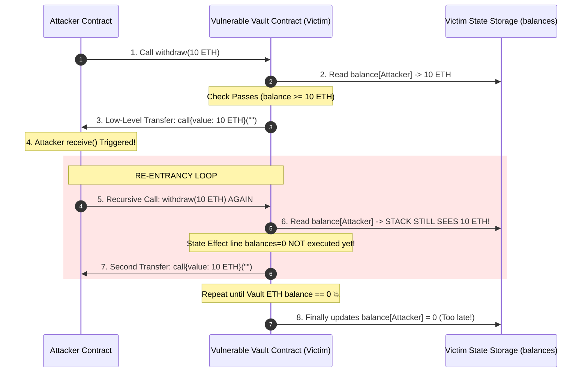
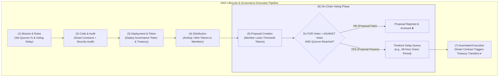
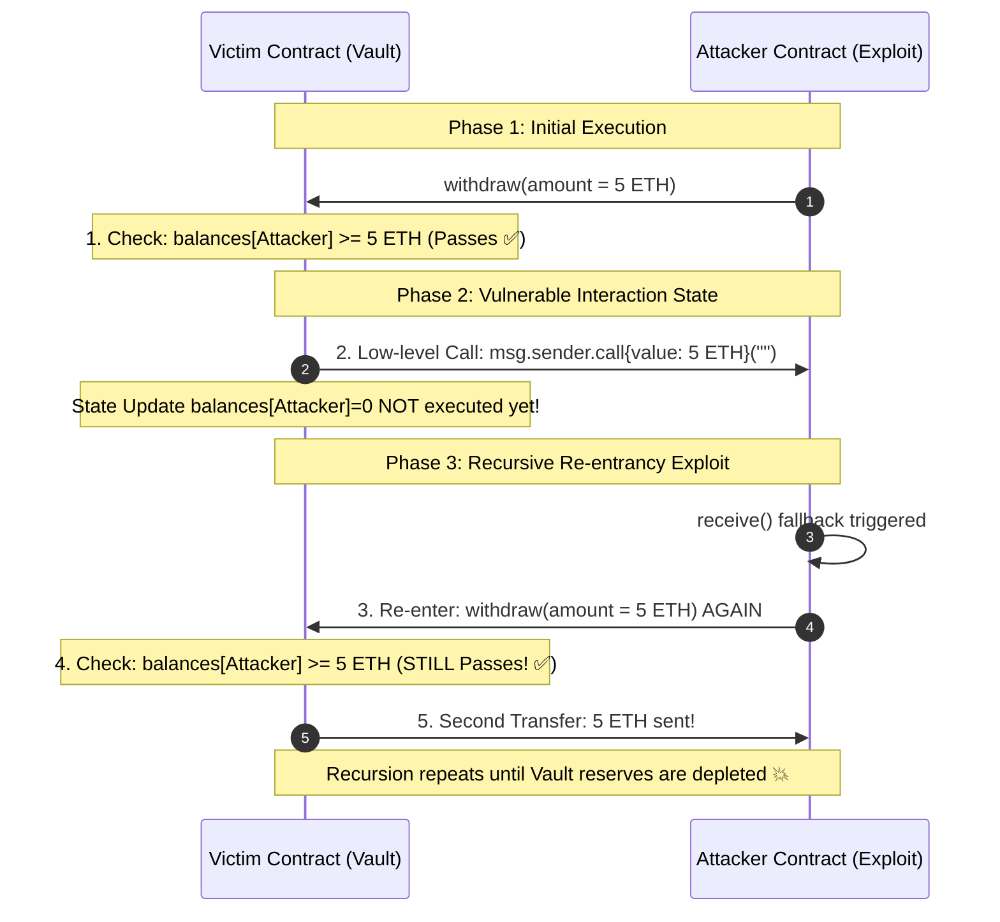
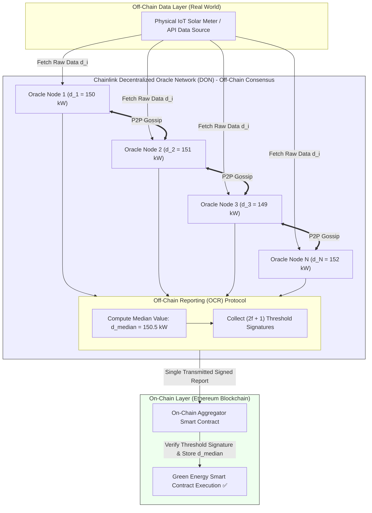
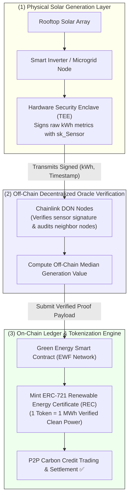

# UNIT 5 — Security, Emerging Trends & Green Energy 🔐🌱

**Syllabus weightage:** 8 hrs / 15% | **Related practicals:** [P08](./P08%20—%20Erc20%20Token.md), [P10](./P10%20—%20Case%20Study%20Security%20Green%20Energy%20Dao.md)
**Star guide:** ⭐ = likely · ⭐⭐ = very likely · ⭐⭐⭐ = practically guaranteed in some form

---

## 🧭 Chapter Roadmap

```
UNIT 5: Security, Emerging Trends & Green Energy
├── 5.1 Blockchain Security & Risks
│     ├── 5.1.1 Smart-contract vulnerabilities (Re-entrancy)  ⭐⭐
│     └── 5.1.2 51% & Sybil attacks                           ⭐⭐⭐ (51% = 7-marker staple)
├── 5.2 Emerging Trends
│     ├── 5.2.1 DeFi: Yield Farming & Liquidity Pools         ⭐⭐
│     ├── 5.2.2 NFTs & the Metaverse                          ⭐
│     └── 5.2.3 DAOs                                          ⭐⭐⭐ (DAO vs Traditional org asked 3×)
└── 5.3 Blockchain in Green Energy
      ├── 5.3.1 Greenwashing & Tokenization of Energy         ⭐
      ├── 5.3.2 The Oracle Problem                            ⭐⭐
      └── 5.3.3 IoT Oracles                                   ⭐
```

### Learning outcomes — after this unit you can:
- Explain **re-entrancy**, **51%** and **Sybil** attacks with examples (and the fix for each)
- Describe DeFi's yield farming & liquidity pools, NFTs, and the Metaverse
- Define a **DAO**, contrast it with traditional organizations, and list its pros/cons
- Explain greenwashing, energy tokenization, and the **oracle problem** (how to trust off-chain data)

---

## 5.1 Blockchain Security & Risks

### 5.1.1 Common Smart Contract Vulnerabilities — Re-entrancy Attacks ⭐⭐

A **re-entrancy attack** exploits a contract that updates its state *after* calling an external contract — the external contract **re-enters** the function before the state is saved, draining funds repeatedly.



**The DAO hack (2016)** — attackers drained ~3.6M ETH (then ~$60M) via exactly this bug, forcing Ethereum's historic hard fork.

**Fixes:**
1. **Checks-Effects-Interactions** — update state (balance = 0) *before* the external call.
2. **Re-entrancy guard** — a `bool locked` modifier that rejects re-entry.
3. Use `transfer` (2300 gas stipend) instead of `call` — historically used to starve re-entry.

### 5.1.2 51% Attacks and Sybil Attacks ⭐⭐⭐

**51% attack** — if one entity controls >50% of the network's hashrate (PoW) or staked value (PoS):
- **Double-spend:** spend coins → get goods/services → re-mine the chain to orphan your spend → coins back.
- **Censorship:** exclude chosen transactions/blocks from the chain.
- **Cannot** forge signatures, steal others' coins, or mint new coins (supply is consensus-capped).
- *Cost:* enormous electricity/hardware (Bitcoin: hundreds of millions $); attacks happen mainly on small chains (e.g. Ethereum Classic hit in 2020). Note: >50% isn't even required — ~30–40% can still cause probabilistic double-spend damage.

**Sybil attack** — one attacker creates **many fake nodes** to out-vote honest ones or isolate victims (censorship, blocking blocks). *Why PoW defeats it:* fake nodes are free, fake *hash power* isn't. Influence is bought with electricity (PoW) or stake (PoS), not identities.

**51% vs Sybil — exam one-liner:** *Sybil attacks multiply your identities cheaply; 51% attacks buy majority influence expensively. Proof-of-work/stake stops the first by pricing influence; economic game theory stops the second by making attacks unprofitable.*

---

## 5.2 Emerging Trends

### 5.2.1 Decentralized Finance (DeFi): Yield Farming & Liquidity Pools ⭐⭐

**DeFi** = financial services (lending, borrowing, trading, interest) built on smart contracts, **without banks or brokers** — open 24/7, permissionless, auditable.

- **Liquidity pool (LP):** users deposit token pairs (e.g. ETH/USDC) into a smart contract; traders swap against the pool (AMM — automated market maker, e.g. Uniswap). Providers earn a share of trading fees.
- **Yield farming:** users **lock/stake** their LP tokens (or single tokens) into farms to earn extra rewards (governance tokens, extra yield) — "put your money to work."
- **The catch (study it):** **impermanent loss** — if the token price ratio changes, liquidity providers can lose value vs simply holding; **smart-contract risk** — a bug means funds lost, no insurance; **gas** — every farm action costs transaction fees.
- Exam-friendly flow: *deposit LP → receive LP-token → stake LP-token in farm → earn rewards → compound.*

### 5.2.2 NFTs & the Metaverse ⭐

- **NFT (Non-Fungible Token):** a unique, non-interchangeable token (ERC-721) representing ownership of a specific digital/real asset — art, collectibles, in-game items, real estate deeds.
- **Fungible** = interchangeable (1 BTC = 1 BTC); **non-fungible** = each is unique (your Bored Ape ≠ mine).
- **Metaverse:** persistent virtual worlds (Decentraland, The Sandbox) where land/items are NFTs and economies run on crypto. Blockchain gives verifiable ownership & portability across virtual worlds.

### 5.2.3 DAOs (Decentralized Autonomous Organizations) ⭐⭐⭐

**DAO** = an organization governed by **code + token-holder voting** instead of a management hierarchy. Rules are encoded in smart contracts; members propose/vote with governance tokens; treasury funds are released automatically when a vote passes.

**DAO vs Traditional organization (W25 Q.5(b)-alt, S26 Q.5(b)):**

| Aspect | Traditional organization | DAO |
|---|---|---|
| Governance | Board of directors / hierarchy | Token-weighted voting |
| Decision speed | Slow (meetings, approvals) | Fast (proposals + smart-contract execution) |
| Trust | Trust in management | Trust in audited code |
| Transparency | Selective | Fully open on-chain |
| Location/legal | Jurisdiction-bound | Global, borderless |
| Human error/risk | Corruption, bias | Smart-contract bugs (DAO hack 2016!) |
| Coordination | Salaries, hierarchy | Incentives, treasury, proposals |

**Steps to launch a DAO (S24/S26 Q.5(b)-alt):** (1) define the mission & governance model (voting rules, quorum); (2) write the smart contracts (token, treasury, voting — Snapshot/Aragon/Zodiac); (3) audit the contracts; (4) deploy on-chain and create the governance token; (5) distribute/airdrop tokens to members; (6) fund the treasury; (7) go live — members propose & vote.



**Advantages (S24 Q.5(c)-alt):** transparency, trustless automation, global participation, community ownership, censorship resistance.
**Disadvantages:** legal/regulatory grey zone, slow under high participation, smart-contract vulnerability (the original DAO hack), token-vote manipulation (whales), no HR/support if things break.

---

## 5.3 Blockchain in Green Energy

### 5.3.1 The Problem of Greenwashing & Tokenization of Energy ⭐

- **Greenwashing** = claiming environmental friendliness without proof. Blockchain fixes this with **verifiable provenance**: every energy unit's origin (solar/wind/coal) is recorded immutably → claims can be audited instead of trusted.
- **Tokenization of energy:** renewable energy production is split into **energy tokens** — 1 token = 1 kWh (or a share of a solar farm). You can trade them like commodities: buy, sell, retire (burn) to prove you used green energy. P2P energy trading (Prosumer→neighbor) becomes automatic via smart contracts.
- This ties to UNIT 3 practical [P08](./P08%20—%20Erc20%20Token.md) — a green-energy token contract.

### 5.3.2 The Oracle Problem: How Do We Trust the Data? ⭐⭐

- **The problem:** blockchains are **deterministic and isolated** — they cannot fetch real-world data (weather, price, temperature) by themselves. If a smart contract reads "temperature > 40°C" for crop insurance, *who feeds it that number?*
- **The oracle** = a trusted data source that bridges off-chain data into the chain. **The problem** = how to trust that bridge: a single oracle is a **single point of failure** (hackable, bribable, wrong).
- **Solutions:** (1) **Decentralized oracles** — multiple independent oracles + majority aggregation (Chainlink); (2) **Reputation/staking** — oracles stake tokens and are slashed for bad data; (3) **TLS/TEE + cryptography** — verifiable off-chain computation (Town Crier); (4) **Direct sensors** with signed hardware.

### 5.3.3 Introduction of IoT Oracles ⭐

- **IoT oracle** = a device (sensor, smart meter, GPS) that pushes *physical-world* measurements onto the blockchain via an oracle node.
- **Flow:** IoT sensor reads data → signs it → oracle transmits → smart contract uses it → payout/action (e.g. insurance payout when rainfall crosses a threshold).
- **Challenges:** sensor spoofing, connectivity, data volume vs gas cost, device key management.
- **Applications:** parametric insurance (drought/flood auto-payout), cold-chain monitoring for pharma/food, renewable-energy certificate generation from smart meters, supply-chain GPS tracking.

---

## 🧠 Deep-Dive Topics

### Deep Dive A: Re-entrancy — the attack explained in one Solidity story
The victim:
```solidity
function withdraw() public {
    uint bal = balances[msg.sender];
    (bool ok,) = msg.sender.call{value: bal}("");  // external call BEFORE state update
    if (ok) balances[msg.sender] = 0;              // ← too late: attacker re-entered
}
```
The attacker's `receive()` fires on the ETH receipt and calls `withdraw()` again. Since `balances[msg.sender]` is still the old value, the check passes again → drain. **The fix:** set `balances[msg.sender] = 0` *before* the call (checks-effects-interactions), or add a `nonReentrant` modifier.

### Deep Dive B: The DAO hack — history that split a chain
2016: *The DAO* raised ~$150M. Attackers exploited re-entrancy to drain ~$60M. The community split: **fork Ethereum** to refund victims (→ today's Ethereum) or **keep the original chain** (→ Ethereum Classic). Lesson: **smart contracts are code, and code is law only if correct** — audits matter. This single event is why "audit" appears in every DAO launch checklist.

### Deep Dive C: Yield farming — where returns actually come from
- **Real returns:** trading fees from the pool + incentives paid by protocols in their own token.
- **Fake returns:** high APY in a token whose price is crashing = negative real return. Rule of thumb examiners love: *yield farmers supply liquidity; protocols buy growth by printing tokens; late entrants hold the bag.*
- **Impermanent loss formula intuition:** the pool rebalances toward the cheaper asset; when the price ratio returns to entry, loss "disappears" (it's only realized if you withdraw during divergence).

### Deep Dive D: The oracle problem — a 7-marker in three acts
1. **The requirement:** smart contracts are deterministic — they can't call the internet. For real-world contracts (insurance, energy, supply chain) they need external data.
2. **The risk:** a single data source is trustable but vulnerable — corrupt, wrong, or hacked data poisons the contract and its money. "Blockchain is trustless" fails at the data boundary.
3. **The resolution:** decentralize the source (many oracles + consensus, e.g. Chainlink), align incentives (staked oracles, slashing), and verify the transport (TLS-notarization, TEEs). Then "trust the network, not the source."

---

## 🚀 Beyond the Textbook (what most classes won't tell you)

- **The 2016 DAO hack wasn't a "bug in Ethereum"** — Ethereum worked exactly as written; the *contract* was wrong. That's the key nuance examiners respect.
- **PoW isn't the only thing that stops Sybil attacks** — cost-per-influence is. PoS does it with stake; reputation systems with identity.
- **Most "51% attacks" happen on tiny chains** — with ~1% of Bitcoin's hashrate you could reorg a small altcoin for a day. Bitcoin is attacked by economics, not hash power.
- **Yield farming is a marketing term, not a law of finance** — "liquidity mining" pays you in the protocol's own token; APY is denominated in a token that can crash 90%.
- **Green energy + blockchain is genuinely one of the most *sensible* real-world use cases** — because verification (not hype) is the actual bottleneck, and provenance is exactly what a blockchain records.

---

## 📝 PYQ Map — UNIT 5 (all available papers)

| Paper | Q. | Topic | Marks |
|---|---|---|---|
| **Winter 2024** | Q.3(b)-alt | 51% attack — what & how it works | 4 |
| | Q.5(b) | dApps in blockchain — explain & working | 4 |
| | Q.5(b)-alt | Short note: DAO | 4 |
| **Summer 2025** | Q.3(c)-alt | Short note: 51% attack | 7 |
| | Q.5(c) | dApps — uses, advantages & disadvantages | 7 |
| **Summer 2026** | Q.3(c)-alt | 51% attack wrt blockchain | 7 |
| | Q.5(b) | Differentiate Traditional org vs DAO | 4 |
| | Q.5(b)-alt | Steps to launch a DAO | 4 |
| **Winter 2025** | Q.3(b) | Sybil attack with example | 4 |
| | Q.5(b)-alt | Compare DAO and Traditional organization | 4 |
| **Summer 2024** | Q.3(c) | Explain 51% attack | 7 |
| | Q.3(c)-alt | Explain Sybil attack | 7 |
| | Q.5(b)-alt | Steps to launch a DAO | 4 |
| | Q.5(c)-alt | DAO — definition, advantages & disadvantages | 7 |

### ✅ Solved PYQ answers (UNIT 5)

**S25 Q.5(c) — What are dApps used for? Advantages & disadvantages (7 marks).**
> **dApps (Decentralized Applications)** are applications whose **backend runs on smart contracts** instead of a centralized server — the frontend is normal, but logic, data, and money are on-chain. **Uses:** DeFi (Uniswap, Aave — trading/lending), gaming & NFTs (Axie, CryptoKitties), DAO governance, social/communication apps, supply-chain and identity tools. **Advantages:** (1) *Open & permissionless* — anyone can use them without an account or KYC; (2) *Censorship-resistant* — no company can shut them down or freeze your funds; (3) *Transparent & auditable* — code and transactions are public; (4) *User-controlled assets* — users hold keys, not the platform; (5) *Interoperable* — contracts can compose (a lending dApp can borrow from a DEX). **Disadvantages:** (1) *Scalability & speed* — on-chain execution is slow and costly (gas); (2) *Bug risk* — a smart-contract bug can permanently lose funds with no recovery; (3) *UX friction* — wallets, gas, seed phrases scare mainstream users; (4) *No customer support* — if you lose your key or funds, nobody can help; (5) *Regulatory uncertainty* — legal status of many dApps is unclear.

**S26 Q.5(b) — Differentiate Traditional Organizations and DAOs (4 marks).** — see §5.2.3 table (governance, speed, trust, transparency, borders, error risk, coordination). Pick any 4 rows.

**S24 Q.5(c)-alt — What is a DAO? Advantages & disadvantages (7 marks).**
> **Definition:** A DAO (Decentralized Autonomous Organization) is an organization governed by **smart contracts and token-weighted voting** instead of a management hierarchy; rules are encoded in code and the treasury is released automatically when votes pass. **Advantages:** (1) *Transparency* — every proposal and vote is public on-chain; (2) *Trustless automation* — execution is code, not management discretion; (3) *Global & permissionless participation* — anyone holding tokens can join/vote; (4) *Community ownership* — no central CEO to capture value; (5) *Censorship resistance* — no single point of failure or shutdown. **Disadvantages:** (1) *Smart-contract risk* — a bug can drain the treasury (the 2016 DAO hack lost ~$60M); (2) *Slow governance* — high participation can stall decisions; (3) *Whale dominance* — large token holders can control votes; (4) *Legal grey area* — DAOs have no recognized legal personality in most jurisdictions; (5) *No safety net* — errors and losses are irreversible.

**S24 Q.3(c)-alt — Explain Sybil attack (7 marks).**
> A **Sybil attack** is an attack on a peer-to-peer network in which a single entity creates **numerous fake identities (nodes)** to gain a disproportionately large influence, appearing to be many independent participants. **How it works:** the attacker registers thousands of nodes, then uses them to (1) **out-vote** honest nodes in consensus or voting, (2) **isolate** a victim so all their connections route through attacker nodes (censoring blocks/transactions), (3) **starve** honest nodes of information, and (4) prevent double-spend detection by controlling what the victim sees. **Example:** in a network that counts one-vote-per-node, an attacker with 10,000 fake nodes beats 100 honest users. **Why blockchains resist it:** influence in Bitcoin is not per-node but **per-hashpower** (PoW) — creating fake nodes is free, but creating fake computational work costs real electricity. Similarly, PoS ties influence to staked value, and permissioned chains tie it to vetted identity. Thus **Sybil resistance = economic cost per unit of influence.**

**W25 Q.3(b) — Explain Sybil attack with example (4 marks).** — condensed version of the 7-marker above (definition + mechanism + the hash-power example).

**S26 Q.3(c)-alt — 51% attack (7 marks).**
> A **51% attack** occurs when a single miner/pool/entity controls **more than 50% of the network's mining (hashing) power** — or staked value in PoS — giving them the ability to influence consensus. **Capabilities:** (1) **Double-spend** — spend coins, receive goods, then re-mine the chain to discard the original spend, regaining the coins; (2) **Transaction censorship** — exclude specific addresses' transactions from being included; (3) **Reordering** — delay or reorder transactions. **Limitations:** the attacker **cannot** forge signatures or steal other users' coins, and **cannot** create coins beyond the protocol's supply cap — they can only manipulate *their own* spends. **Feasibility & defence:** on Bitcoin, >50% hashrate costs hundreds of millions of dollars and even then the attack destroys the coin's value (the attacker's own reward), so it is **economically irrational**; smaller chains (e.g. Ethereum Classic 2020) have suffered real attacks. Defences: high total hashrate, checkpoints, and proof-of-stake's economic finality.

**S24 Q.5(b)-alt / S26 Q.5(b)-alt — Steps to launch a DAO (4 marks).** — the 7 steps in §5.2.3 (mission → contracts → audit → deploy → tokens → treasury → go live).

---

## ✍️ Practice Problems (self-test — answers upside-down)

1. (7) Explain the re-entrancy attack with a step-by-step example and how to fix it.
2. (4) Differentiate a 51% attack and a Sybil attack.
3. (7) What is yield farming? Explain liquidity pools and impermanent loss.
4. (4) Compare DAO and traditional organization on any four points.
5. (3) What is an NFT? How is it different from a cryptocurrency?
6. (7) Explain the oracle problem and the role of IoT oracles in green-energy blockchain.
7. (4) How does blockchain help prevent greenwashing?
8. (3) Why can't a 51% attacker steal other users' coins?

<details>
<summary>**Click for answers**</summary>

1. See Deep Dive A — external call before state update lets `receive()` re-enter; fixes = checks-effects-interactions, re-entrancy guard, transfer-stipend. Cite the 2016 DAO hack.
2. Sybil = fake identities multiply cheaply (influence via nodes); 51% = majority hashpower/stake bought expensively (influence via economic majority). PoW/PoS defeat Sybil by pricing influence; economics defeats 51%.
3. LP = pairs deposited for traders to swap against (AMM), earning fees; yield farming = staking LP/rewards to earn more; impermanent loss = divergence loss vs holding when price ratio moves.
4. Any 4 rows from §5.2.3 table.
5. NFT = unique, non-fungible (ERC-721, one-of-a-kind ownership); crypto = fungible (interchangeable units).
6. Blockchains can't fetch external data → oracles bridge it → single source = single point of failure → decentralized oracles/staking/aggregation. IoT oracles = sensors signing physical data (rainfall, kWh) into contracts for automatic payouts.
7. Immutable provenance: every energy unit's origin is recorded and auditable, so green claims can be verified, not just asserted (fights greenwashing).
8. Signatures are unforgeable; the attacker can only reorder their *own* spends. Others' coins require forging keys, which crypto prevents.

</details>

---

## 📖 Glossary of Key Terms

| Term | One-line meaning |
|---|---|
| Re-entrancy | Attack where an external contract re-enters before state updates |
| 51% attack | Majority-hashpower control → double-spend & censorship |
| Sybil attack | One attacker impersonating many nodes |
| DeFi | Decentralized finance — bankless financial apps on smart contracts |
| Liquidity pool | Contract holding token pairs for AMM trading |
| Yield farming | Staking LP tokens to earn extra rewards |
| Impermanent loss | Value loss vs holding when pool price ratios diverge |
| NFT | Non-fungible token — unique ownership (ERC-721) |
| Metaverse | Persistent virtual worlds with crypto/NFT economies |
| DAO | Code-governed, token-voting organization |
| Greenwashing | Unverifiable environmental claims |
| Oracle | Bridge bringing off-chain data on-chain |
| Oracle problem | How to trust the data bridge |
| IoT oracle | Sensor feeding signed physical data to contracts |

---

## 🔗 Curated Resources (per concept)

- **Re-entrancy (consensys):** https://consensys.github.io/smart-contract-best-practices/attacks/reentrancy/
- **DAOs:** https://ethereum.org/en/dao/ | Snapshot (voting): https://snapshot.org
- **DeFi & yield farming:** https://ethereum.org/en/defi/ | Uniswap AMM docs
- **NFTs:** https://ethereum.org/en/nft/ | ERC-721: https://eips.ethereum.org/EIPS/eip-721
- **Oracle problem & Chainlink:** https://chain.link/education-hub/what-is-a-blockchain-oracle
- **IoT + blockchain (IoTex / Helium):** https://www.iotex.io/
- **Green energy case study (energy web):** https://www.energyweb.org/

---

## 🎥 Video Study Guide (YouTube)

> Your video path for the whole unit — exact keywords to search + channels you can trust.

### 🧑‍🎓 Step 0 — Pick your learning style

| Style | You learn best by | Your path through this unit |
|---|---|---|
| 🎧 **Listener** | short, clear explainers | 1 explainer per topic in the table below |
| 🛠️ **Builder** | hands-on | Re-run [P08](./P08%20—%20Erc20%20Token.md); try a re-entrancy CTF |
| 🔧 **Tinkerer** | experimenting & demos | Damage Labs / Capture-the-Ether re-entrancy challenges |
| 🧠 **Deep Diver** | full theory, "why" | Playlists at the bottom |
| 🧭 **Explorer** | breadth & curiosity | Start with DeFi/NFT explainers |
| 🎓 **Academic** | exam marks | Revision videos → grind the PYQ map above |

### 🎬 Step 1 — Watch by topic (search these on YouTube)

| Topic | YouTube search keywords (copy-paste ready) | Best channels | Style served |
|---|---|---|---|
| Smart-contract security | `smart contract vulnerabilities` · `reentrancy attack explained` · `solidity security best practices` | White Hat / Secureum, RareSkills, Smart Contract Programmer | 🧠 Deep Diver |
| 51% & Sybil attacks | `51 percent attack explained` · `sybil attack explained with example` · `how ethereum classic was attacked` | Computerphile, Simply Explained, Coin Bureau | 🎓 Academic |
| DeFi overview | `what is defi` · `decentralized finance explained` · `defi for beginners` | Finematics, Coin Bureau, Whiteboard Crypto | 🧭 Explorer |
| Yield farming & liquidity | `yield farming explained` · `liquidity pools explained` · `impermanent loss explained` | Finematics, Whiteboard Crypto, Coin Bureau | 🎓 Academic |
| NFTs & Metaverse | `what are nfts` · `nft explained 5 minutes` · `metaverse explained` | Whiteboard Crypto, Fireship, Coin Bureau | 🧭 Explorer |
| DAOs | `what is a dao` · `dao explained` · `dao vs traditional company` · `how to launch a dao` | Finematics, Whiteboard Crypto, Coin Bureau | 🎓 Academic |
| Oracle problem | `blockchain oracle explained` · `what is chainlink` · `oracle problem smart contracts` | Finematics, Chainlink official, Simply Explained | 🧠 Deep Diver |
| IoT + blockchain | `iot blockchain explained` · `iot oracles` · `iotex blockchain` · `sensor data on blockchain` | Helium/IoTeX channels, Simply Explained | 🧭 + 🎧 |
| Green energy & blockchain | `blockchain green energy` · `energy tokenization explained` · `p2p solar energy trading blockchain` | Energy Web, Coin Bureau | 🧭 + 🎓 |
| Whole-unit revision | `blockchain security full course` · `defi nft dao full course` · `blockchain trends exam revision` | freeCodeCamp, MIT OCW, Gate Smashers, Neso Academy | 🎓 Academic |

### 🎬 Step 2 — Full playlists (for Deep Divers & Academics)

1. **"Finematics — DeFi, DAO & oracle explainer library"** — the visual backbone of this unit.
2. **"Secureum / Smart Contract Programmer — smart-contract security bootcamp"** — if you want to truly understand re-entrancy and more.
3. **"MIT 15.S12 — security & applications lectures"** — exam-grade framing of DAOs, DeFi, and trust.

### 🎬 Step 3 — Proof you got it (5 min)

- Re-tell the re-entrancy attack as a story (withdraw → receive → withdraw…).
- Say the DAO-vs-traditional table from memory.
- Explain to a friend why a sensor feeding a contract needs an oracle and why one oracle isn't enough.

---

*End of FOB notes. 🎉 Next: revisit [UNIT 1](./Unit%201%20—%20Foundations%20of%20Decentralization.md) to start your revision loop.*

---


---

## 📖 Historical Context & Motivation

The evolution of smart contract ecosystems—from initial asset transfers to multi-billion-dollar Decentralized Finance (DeFi) protocols, Decentralized Autonomous Organizations (DAOs), and real-world asset (RWA) tokenization—revealed a fundamental software engineering reality: on an immutable blockchain, code bugs become permanent security vulnerabilities. Unlike traditional centralized software architectures where compromised servers can be isolated and patched seamlessly, smart contracts execute deterministically on public networks. Once deployed, malicious actors can inspect open-source bytecode and execute exploits with zero risk of transaction reversal, giving rise to multi-million-dollar protocol hacks.

The watershed moment in smart contract security occurred in June 2016 with **The DAO Hack**, where an attacker exploited a recursive **Re-entrancy** vulnerability to drain 3.6 million Ether (worth ~$60 million at the time, and billions today). This exploit forced a controversial hard fork of the Ethereum network, establishing smart contract auditing and formal verification as essential engineering disciplines. Simultaneously, as smart contracts expanded into real-world domains like Green Energy tracking and microgrid management, developers encountered **The Oracle Problem**: blockchains are deterministic state machines that cannot natively execute external HTTP requests to fetch real-world data (such as solar generation metrics or weather feeds) without violating consensus determinism. The development of Decentralized Oracle Networks (DONs) like Chainlink solved this bottleneck, enabling secure, tamper-proof integration between physical IoT devices and smart contract ledgers.

---

## 🔬 Deep Dive: System Architecture

### Smart Contract Vulnerability Control Flow (Re-entrancy), Decentralized Oracle Networks (DONs), and Impermanent Loss Mathematics

This section provides a rigorous technical breakdown of smart contract security patterns, decentralized oracle consensus mechanics, and the mathematical mechanics of automated market maker liquidity provision.

#### 1. Re-entrancy Vulnerability Mechanics & State Control Flow
A **Re-entrancy Attack** occurs when a vulnerable contract (Victim) initiates an external message call to an untrusted contract (Attacker) *prior* to updating its internal state storage.



##### Exploit Execution Trace
1. The attacker calls `withdraw()`.
2. The victim contract verifies the attacker’s balance: `require(balances[msg.sender] >= amount)`.
3. The victim transfers ETH via low-level call: `(bool success, ) = msg.sender.call{value: amount}("")`.
4. Execution control transfers to the attacker's `fallback()` or `receive()` function.
5. Crucially, because the victim has not yet executed `balances[msg.sender] -= amount`, the attacker's `fallback()` re-invokes `withdraw()`.
6. The victim checks balance again. Because internal state remains unmodified, the check passes, sending another ETH payout. This loop repeats recursively until contract reserves are drained.

##### Remediation Architecture
1. **Checks-Effects-Interactions (CEI) Pattern**: Ensure all state checks occur first, internal storage state modifications (effects) occur second, and external contract calls (interactions) occur last.
2. **ReentrancyGuard Mutex**: Implement a re-entrancy mutex lock that rejects nested execution frames:
   ```solidity
   abstract contract ReentrancyGuard {
       uint256 private constant _NOT_ENTERED = 1;
       uint256 private constant _ENTERED = 2;
       uint256 private _status = _NOT_ENTERED;

       modifier nonReentrant() {
           require(_status != _ENTERED, "ReentrancyGuard: reentrant call");
           _status = _ENTERED;
           _;
           _status = _NOT_ENTERED;
       }
   }
   ```

#### 2. The Oracle Problem & Decentralized Oracle Networks (DONs)
Because blockchain nodes must arrive at deterministic state consensus, the EVM disallows non-deterministic execution inputs, such as making arbitrary HTTP GET requests to external APIs.



##### Chainlink Off-Chain Reporting (OCR) Protocol
To bring real-world data on-chain safely, a Decentralized Oracle Network (DON) operates as a secondary consensus layer:
1. $N$ independent oracle nodes fetch data points $d_1, d_2, \dots, d_N$ from independent off-chain API data providers or IoT sensors.
2. Nodes aggregate data points off-chain using peer-to-peer gossip protocols and compute the median data value $d_{\text{median}} = \text{median}(d_1, \dots, d_N)$.
3. Nodes construct a single aggregated report containing $d_{\text{median}}$ and collect threshold signatures (e.g., $(2f + 1)$ signatures out of $3f + 1$ nodes).
4. A single node submits the aggregated report on-chain. The on-chain Aggregator contract verifies the threshold signature and updates the contract state, minimizing gas costs while eliminating single points of failure.

#### 3. Mathematics of AMM Impermanent Loss (IL)
When providing liquidity to an Automated Market Maker ($x \cdot y = k$), liquidity providers (LPs) experience **Impermanent Loss (IL)** if the relative price of the pooled tokens diverges from when they were deposited.

Let initial token balances be $x_0$ and $y_0$, with initial price ratio $P_0 = \frac{y_0}{x_0}$.
The initial pool invariant is $k = x_0 \cdot y_0$.
Token balances expressed in terms of price $P_0$:
$$x_0 = \sqrt{\frac{k}{P_0}}, \quad y_0 = \sqrt{k \cdot P_0}$$

If the price ratio shifts by multiplier $k_p$ such that $P_1 = k_p \cdot P_0$:
New balances become:
$$x_1 = \frac{x_0}{\sqrt{k_p}}, \quad y_1 = y_0 \cdot \sqrt{k_p}$$

The dollar value of the pool liquidity position $V_{\text{pool}}$ at price $P_1$ is:
$$V_{\text{pool}} = x_1 \cdot P_1 + y_1 = \left( \frac{x_0}{\sqrt{k_p}} \right) (k_p \cdot P_0) + y_0 \sqrt{k_p} = 2 \cdot \sqrt{k_p} \cdot x_0 \cdot P_0$$

The dollar value of holding the initial tokens in a wallet $V_{\text{hold}}$ is:
$$V_{\text{hold}} = x_0 \cdot P_1 + y_0 = x_0 (k_p \cdot P_0) + y_0 = (k_p + 1) \cdot x_0 \cdot P_0$$

The Impermanent Loss ratio $\text{IL}(k_p)$ is defined as:
$$\text{IL}(k_p) = \frac{V_{\text{pool}}}{V_{\text{hold}}} - 1 = \frac{2 \sqrt{k_p}}{k_p + 1} - 1$$

---

## 🏢 Real-World Case Study

### The 2016 DAO Exploit & Chainlink-Enabled Green Energy Microgrid Oracles

#### 1. The 2016 DAO Exploit on Ethereum
The DAO (Decentralized Autonomous Organization) was an early investor-directed venture capital fund deployed on Ethereum in April 2016, raising over $150 million in ETH.

##### The Exploit Vector
The DAO smart contract permitted token holders to execute a `splitDAO` function to withdraw their collateral into a child DAO if they disagreed with investment proposals. The contract code contained a classic re-entrancy flaw:

```solidity
// Simplified extract from vulnerable DAO.sol
function withdrawRewardFor(address msgSender) internal returns (bool) {
    uint amount = balances[msgSender];
    if (amount == 0) return false;
    
    // VULNERABILITY: External call executed BEFORE updating internal state balance
    msg.sender.call.value(amount)(); 
    
    balances[msgSender] = 0; // State updated too late!
    return true;
}
```

An attacker invoked `splitDAO()`, creating a recursive loop via their fallback function that drained 3.6 million ETH into a child DAO. The exploit highlighted the danger of raw `call.value()` interactions and resulted in the historic Ethereum hard fork, splitting the network into Ethereum (ETH, state restored) and Ethereum Classic (ETC, original chain preserved under "code is law").

#### 2. Chainlink IoT Green Energy Microgrid Oracles
In renewable energy markets, traditional Renewable Energy Certificates (RECs) suffer from "greenwashing"—double-counting generated clean energy or forging generation figures.



##### Technical Architecture
Companies like Energy Web Foundation (EWF) integrate hardware security enclaves directly into solar inverters and IoT smart meters. Smart meters sign generation data ($\text{kWh}$) using an internal private key. Chainlink Decentralized Oracle Networks (DONs) fetch signed meter payloads, verify cryptographic signatures, perform median aggregation across neighborhood solar arrays, and submit validated generation metrics on-chain. The smart contract automatically mints fractionalized, non-fungible Green Energy Tokens, creating a transparent, tamper-proof carbon accounting ledger.

---

## 📝 End-of-Chapter Exercises

### Exercise 1: Re-entrancy Vulnerability Code Audit & Remediation
Consider the following vulnerable smart contract designed to manage user savings deposits:

```solidity
contract SavingsBank {
    mapping(address => uint256) public userBalances;

    function deposit() external payable {
        userBalances[msg.sender] += msg.value;
    }

    function withdrawAll() external {
        uint256 balance = userBalances[msg.sender];
        require(balance > 0, "Insufficient funds");

        (bool success, ) = msg.sender.call{value: balance}("");
        require(success, "Transfer failed");

        userBalances[msg.sender] = 0;
    }
}
```

1. Write a complete malicious Solidity contract `ReentrancyAttacker` designed to exploit `withdrawAll()` and drain all funds from `SavingsBank`.
2. Trace the step-by-step EVM call stack during the recursive execution frame of the attack.
3. Rewrite the `withdrawAll()` function to strictly comply with the **Checks-Effects-Interactions (CEI)** design pattern.
4. Implement an explicit OpenZeppelin-style `ReentrancyGuard` modifier and apply it to `withdrawAll()`.

### Exercise 2: AMM Impermanent Loss Calculation
A liquidity provider supplies capital to a ETH/USDC pool on an Automated Market Maker ($x \cdot y = k$).
At deposit:
- Price of ETH ($P_0$) = $2,000\text{ USDC}$.
- Liquidity provider deposits $5\text{ ETH}$ and $10,000\text{ USDC}$.

Six months later, the price of ETH increases to $P_1 = 8,000\text{ USDC}$ ($400\%$ increase, $k_p = 4$).

1. Compute the initial pool invariant $k$.
2. Calculate the updated token balances ($x_1$ and $y_1$) held in the LP position at price $P_1$.
3. Calculate the total USD value of the LP pool position ($V_{\text{pool}}$).
4. Calculate the total USD value if the LP had simply held the initial $5\text{ ETH}$ and $10,000\text{ USDC}$ in a hardware wallet ($V_{\text{hold}}$).
5. Compute the exact percentage Impermanent Loss ($\text{IL}$) incurred by providing liquidity.

### Exercise 3: Chainlink DON Outlier Filtering & Median Aggregation
A Decentralized Oracle Network consisting of $N = 7$ oracle nodes reports the real-time power generation (in $\text{kW}$) from a solar farm to a green energy smart contract.

The node responses submitted during the off-chain reporting round are:
$$\mathcal{D} = \{ 150\text{ kW}, \, 152\text{ kW}, \, 149\text{ kW}, \, 0\text{ kW}, \, 151\text{ kW}, \, 850\text{ kW}, \, 153\text{ kW} \}$$
Nodes 4 ($0\text{ kW}$) and 6 ($850\text{ kW}$) are faulty/Byzantine nodes reporting corrupt sensor data.

1. Trace the sorting and median selection algorithm executed by the on-chain aggregator contract to determine the consensus value.
2. State the finalized power generation value written to the smart contract.
3. Calculate what the reported value would have been if the contract had erroneously used arithmetic mean (average) aggregation instead of median aggregation, and explain why mean aggregation is vulnerable to Byzantine attacks.

### Exercise 4: DAO Quadratic Voting Mechanics & Sybil Analysis
A Decentralized Autonomous Organization (DAO) evaluates a funding proposal for a local solar microgrid project. The DAO implements **Quadratic Voting**, where the voting power $V$ generated by $C$ governance tokens is defined as $V = \sqrt{C}$.

Scenario A: A single large token holder ("Whale") allocates $100\text{ governance tokens}$ from a single wallet to vote FOR the proposal.
Scenario B: A community coalition of 100 individual members each allocates $1\text{ governance token}$ ($100\text{ tokens}$ total) from 100 distinct wallets to vote FOR the proposal.

1. Calculate the aggregate voting power generated under standard 1-Token-1-Vote rules for Scenario A and Scenario B.
2. Calculate the aggregate voting power generated under Quadratic Voting for Scenario A and Scenario B.
3. Suppose the Whale in Scenario A attempts a Sybil attack by splitting their 100 governance tokens across 100 fake sybil wallets (1 token per wallet). Calculate the resulting voting power gained by the Whale.
4. Explain why Quadratic Voting protocols must be coupled with robust cryptographic Self-Sovereign Identity (SSI) or Proof-of-Personhood systems to prevent Sybil attacks.

## ⚡ Quick Revision

> [!abstract]+ One-page summary — review this before the exam

> - **Blockchain Security & Risks**
>   - **Common Smart Contract Vulnerabilities — Re-entrancy Attacks**
>   - **51% Attacks and Sybil Attacks**
> - **Emerging Trends**
>   - **Decentralized Finance (DeFi): Yield Farming & Liquidity Pools**
>   - **NFTs & the Metaverse**
>   - **DAOs (Decentralized Autonomous Organizations)**
> - **Blockchain in Green Energy**
>   - **The Problem of Greenwashing & Tokenization of Energy**
>   - **The Oracle Problem: How Do We Trust the Data?**
>   - **Introduction of IoT Oracles**
> - **Deep-Dive Topics**
>   - **Deep Dive A: Re-entrancy — the attack explained in one Solidity story**
>   - **Deep Dive B: The DAO hack — history that split a chain**
>   - **Deep Dive C: Yield farming — where returns actually come from**
>   - **Deep Dive D: The oracle problem — a 7-marker in three acts**
> - **🚀 Beyond the Textbook (what most classes won't tell you)**
> - **✍ Practice Problems (self-test — answers upside-down)**

### 📌 Key Definitions

- **The DAO hack (2016)** — attackers drained ~3.6M ETH (then ~$60M) via exactly this bug, forcing Ethereum's historic hard fork.
- **Checks-Effects-Interactions** — update state (balance = 0) *before* the external call.
- **Re-entrancy guard** — a `bool locked` modifier that rejects re-entry.
- **51% attack** — if one entity controls >50% of the network's hashrate (PoW) or staked value (PoS):
- **Sybil attack** — one attacker creates **many fake nodes** to out-vote honest ones or isolate victims (censorship, blocking blocks). *Why PoW defeats it:* fake nodes are free, fake *hash power* isn't. Influence is bought with electricity (PoW) or stake (PoS), not identities.
- **without banks or brokers** — open 24/7, permissionless, auditable.
- **impermanent loss** — if the token price ratio changes, liquidity providers can lose value vs simply holding; **smart-contract risk** — a bug means funds lost, no insurance; **gas** — every farm action costs transaction fees.
- **verifiable provenance** — every energy unit's origin (solar/wind/coal) is recorded immutably → claims can be audited instead of trusted.
- **energy tokens** — 1 token = 1 kWh (or a share of a solar farm). You can trade them like commodities: buy, sell, retire (burn) to prove you used green energy. P2P energy trading (Prosumer→neighbor) becomes automatic via smart contracts.
- **deterministic and isolated** — they cannot fetch real-world data (weather, price, temperature) by themselves. If a smart contract reads "temperature > 40°C" for crop insurance, *who feeds it that number?*
- **Decentralized oracles** — multiple independent oracles + majority aggregation (Chainlink); (2) **Reputation/staking** — oracles stake tokens and are slashed for bad data; (3) **TLS/TEE + cryptography** — verifiable off-chain computation (Town Crier); (4) **Direct sensors** with signed hardware.
- **The 2016 DAO hack wasn't a "bug in Ethereum"** — Ethereum worked exactly as written; the *contract* was wrong. That's the key nuance examiners respect.
- **PoW isn't the only thing that stops Sybil attacks** — cost-per-influence is. PoS does it with stake; reputation systems with identity.
- **Most "51% attacks" happen on tiny chains** — with ~1% of Bitcoin's hashrate you could reorg a small altcoin for a day. Bitcoin is attacked by economics, not hash power.
- **Yield farming is a marketing term, not a law of finance** — "liquidity mining" pays you in the protocol's own token; APY is denominated in a token that can crash 90%.
- **more than 50% of the network's mining (hashing) power** — or staked value in PoS — giving them the ability to influence consensus. **Capabilities:** (1) **Double-spend** — spend coins, receive goods, then re-mine the chain to discard the original spend, regaining the coins; (2) **Transaction censorship** — exclude specific addresses' transactions from being included; (3) **Reordering** — delay or reorder transactions. **Limitations:** the attacker **cannot** forge signatures or steal other users' coins, and **cannot** create coins beyond the protocol's supply cap — they can only manipulate *their own* spends. **Feasibility & defence:** on Bitcoin, >50% hashrate costs hundreds of millions of dollars and even then the attack destroys the coin's value (the attacker's own reward), so it is **economically irrational**; smaller chains (e.g. Ethereum Classic 2020) have suffered real attacks. Defences: high total hashrate, checkpoints, and proof-of-stake's economic finality.
- **"Finematics — DeFi, DAO & oracle explainer library"** — the visual backbone of this unit.
- **"MIT 15.S12 — security & applications lectures"** — exam-grade framing of DAOs, DeFi, and trust.

---

## 🧠 Active Recall

*Test yourself — click a question to reveal the answer. Try to answer BEFORE peeking!*

> [!question]- Q1: Define **The DAO hack (2016)**.
> attackers drained ~3.6M ETH (then ~$60M) via exactly this bug, forcing Ethereum's historic hard fork.

> [!question]- Q2: Define **Checks-Effects-Interactions**.
> update state (balance = 0) *before* the external call.

> [!question]- Q3: Define **Re-entrancy guard**.
> a `bool locked` modifier that rejects re-entry.

> [!question]- Q4: Define **51% attack**.
> if one entity controls >50% of the network's hashrate (PoW) or staked value (PoS):

> [!question]- Q5: Define **Sybil attack**.
> one attacker creates **many fake nodes** to out-vote honest ones or isolate victims (censorship, blocking blocks). *Why PoW defeats it:* fake nodes are free, fake *hash power* isn't. Influence is bought with electricity (PoW) or stake (PoS), not identities.

> [!question]- Q6: Define **without banks or brokers**.
> open 24/7, permissionless, auditable.

> [!question]- Q7: Define **impermanent loss**.
> if the token price ratio changes, liquidity providers can lose value vs simply holding; **smart-contract risk** — a bug means funds lost, no insurance; **gas** — every farm action costs transaction fees.

> [!question]- Q8: Define **verifiable provenance**.
> every energy unit's origin (solar/wind/coal) is recorded immutably → claims can be audited instead of trusted.

> [!question]- Q9: Define **energy tokens**.
> 1 token = 1 kWh (or a share of a solar farm). You can trade them like commodities: buy, sell, retire (burn) to prove you used green energy. P2P energy trading (Prosumer→neighbor) becomes automatic via smart contracts.

> [!question]- Q10: Define **deterministic and isolated**.
> they cannot fetch real-world data (weather, price, temperature) by themselves. If a smart contract reads "temperature > 40°C" for crop insurance, *who feeds it that number?*

> [!question]- Q11: Explain **Blockchain Security & Risks** in 3-4 sentences.
> *(Write your answer, then check the section above)*

> [!question]- Q12: Explain **Emerging Trends** in 3-4 sentences.
> *(Write your answer, then check the section above)*

> [!question]- Q13: Compare: **Governance** vs **Board of directors / hierarchy** on the basis of Aspect.
> Governance | Board of directors / hierarchy | Token-weighted voting

> [!question]- Q14: Compare: **Decision speed** vs **Slow (meetings, approvals)** on the basis of Aspect.
> Decision speed | Slow (meetings, approvals) | Fast (proposals + smart-contract execution)

> [!question]- Q15: Compare: **Trust** vs **Trust in management** on the basis of Aspect.
> Trust | Trust in management | Trust in audited code


---

## 📇 Flashcards (Spaced Repetition)

> [!info] How to use
> Install the **Spaced Repetition** plugin → these cards auto-sync into your review queue.
> Format: Question on top, `?` separator, answer below.

#flashcards

What is **The DAO hack (2016)**?
?
attackers drained ~3.6M ETH (then ~$60M) via exactly this bug, forcing Ethereum's historic hard fork.

What is **Checks-Effects-Interactions**?
?
update state (balance = 0) *before* the external call.

What is **Re-entrancy guard**?
?
a `bool locked` modifier that rejects re-entry.

What is **51% attack**?
?
if one entity controls >50% of the network's hashrate (PoW) or staked value (PoS):

What is **Sybil attack**?
?
one attacker creates **many fake nodes** to out-vote honest ones or isolate victims (censorship, blocking blocks). *Why PoW defeats it:* fake nodes are free, fake *hash power* isn't. Influence is bought with electricity (PoW) or stake (PoS), not identities.

What is **without banks or brokers**?
?
open 24/7, permissionless, auditable.

What is **impermanent loss**?
?
if the token price ratio changes, liquidity providers can lose value vs simply holding; **smart-contract risk** — a bug means funds lost, no insurance; **gas** — every farm action costs transaction fees.

What is **verifiable provenance**?
?
every energy unit's origin (solar/wind/coal) is recorded immutably → claims can be audited instead of trusted.

What is **energy tokens**?
?
1 token = 1 kWh (or a share of a solar farm). You can trade them like commodities: buy, sell, retire (burn) to prove you used green energy. P2P energy trading (Prosumer→neighbor) becomes automatic via smart contracts.

What is **deterministic and isolated**?
?
they cannot fetch real-world data (weather, price, temperature) by themselves. If a smart contract reads "temperature > 40°C" for crop insurance, *who feeds it that number?*

What is **Decentralized oracles**?
?
multiple independent oracles + majority aggregation (Chainlink); (2) **Reputation/staking** — oracles stake tokens and are slashed for bad data; (3) **TLS/TEE + cryptography** — verifiable off-chain computation (Town Crier); (4) **Direct sensors** with signed hardware.

What is **The 2016 DAO hack wasn't a "bug in Ethereum"**?
?
Ethereum worked exactly as written; the *contract* was wrong. That's the key nuance examiners respect.

What is **PoW isn't the only thing that stops Sybil attacks**?
?
cost-per-influence is. PoS does it with stake; reputation systems with identity.

What is **Most "51% attacks" happen on tiny chains**?
?
with ~1% of Bitcoin's hashrate you could reorg a small altcoin for a day. Bitcoin is attacked by economics, not hash power.

What is **Yield farming is a marketing term, not a law of finance**?
?
"liquidity mining" pays you in the protocol's own token; APY is denominated in a token that can crash 90%.

What is **more than 50% of the network's mining (hashing) power**?
?
or staked value in PoS — giving them the ability to influence consensus. **Capabilities:** (1) **Double-spend** — spend coins, receive goods, then re-mine the chain to discard the original spend, regaining the coins; (2) **Transaction censorship** — exclude specific addresses' transactions from being included; (3) **Reordering** — delay or reorder transactions. **Limitations:** the attacker **cannot** forge signatures or steal other users' coins, and **cannot** create coins beyond the protocol's supply cap — they can only manipulate *their own* spends. **Feasibility & defence:** on Bitcoin, >50% hashrate costs hundreds of millions of dollars and even then the attack destroys the coin's value (the attacker's own reward), so it is **economically irrational**; smaller chains (e.g. Ethereum Classic 2020) have suffered real attacks. Defences: high total hashrate, checkpoints, and proof-of-stake's economic finality.

What is **"Finematics — DeFi, DAO & oracle explainer library"**?
?
the visual backbone of this unit.

What is **"MIT 15.S12 — security & applications lectures"**?
?
exam-grade framing of DAOs, DeFi, and trust.
