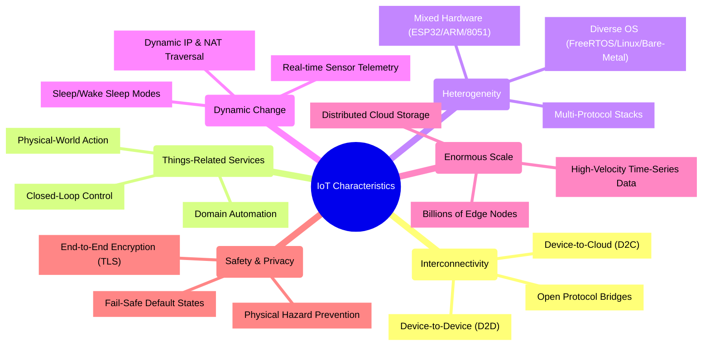
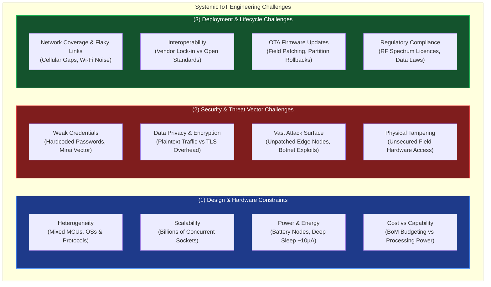
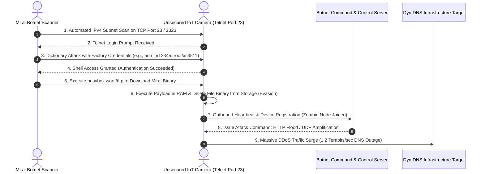

# UNIT 1 — Introduction to IoT 🌐

> **Hands on Practice using IoT (DI05016071)** · **4 hrs · 10% weightage**
> **Covers syllabus sections:** 1.1 Definition & Characteristics · 1.2 Evolution & M2M Communication · 1.3 IoT Architecture (4 layers) · 1.4 Communication APIs · 1.5 M2M vs IoT · 1.6 Challenges (Design, Security, Deployment)
> **Related practicals:** [P01](./P01%20—%20Iot%20Architecture%20Layers.md)

---

## 🧭 Chapter Roadmap

This unit is the **conceptual foundation** of the subject. It carries only 10% weightage but every later unit — ESP32 (Unit 3), MQTT (Unit 4), clouds (Unit 5) — answers the "which layer?" / "what challenge?" questions you build here. Master these ~8 concepts and the architecture diagrams below; they appear again in every practical.

```
UNIT 1: Introduction to IoT
├── 1.1 Definition & Characteristics of IoT    ⭐⭐ (always: "define IoT + any 4 characteristics")
│     └── 1.1.1 The 6 defining characteristics
├── 1.2 Evolution of IoT & M2M Communication    ⭐
│     ├── 1.2.1 Timeline: RFID → internet → IoT
│     └── 1.2.2 What M2M means
├── 1.3 IoT Architecture                        ⭐⭐⭐ (7-mark favourite: draw + explain 4 layers)
│     ├── 1.3.1 4-layer model
│     └── 1.3.2 (bonus) 3-layer & 5-layer variants
├── 1.4 Communication APIs                      ⭐⭐ (REST + WebSocket + MQTT as an API)
├── 1.5 M2M vs IoT comparison                   ⭐⭐ (guaranteed table question)
└── 1.6 Challenges in IoT                       ⭐⭐⭐ (security + design + deployment = short-note gold)
      └── 1.6.1 Security · 1.6.2 Design · 1.6.3 Deployment
```

### Learning outcomes — after this unit you can:
1. **Define IoT** and list its **characteristics** in a clean exam-ready sentence.
2. Trace the **evolution** from RFID/M2M to modern IoT.
3. **Draw the 4-layer architecture** (sensing → network → data processing → application) and map any device to its layer.
4. Explain **REST/HTTP, WebSocket and MQTT** as communication APIs.
5. Write the **M2M vs IoT** comparison table.
6. List **design, security and deployment challenges** — the most asked short note in the subject.

---

## 1.1 Definition and Characteristics of IoT ⭐⭐

### 1.1.1 Definition (memorize this sentence)

> **IoT (Internet of Things)** is a network of physical objects — "things" — embedded with sensors, software and connectivity that lets them **collect data, exchange it over the internet, and act on it** — with minimal or no human intervention.

Break the definition into its 4 building blocks:

| Building block | In simple words | Example |
|---|---|---|
| **Things** | Physical objects, not computers | Fan, pump, soil, car, wearable |
| **Sensors/actuators** | Sense the world / act on the world | DHT11, PIR, relay |
| **Connectivity** | Network to move data | Wi-Fi, BLE, Zigbee, 4G |
| **Processing + cloud** | Where the data becomes useful | ThingSpeak, Blynk |

### 1.1.2 The six characteristics (short-note material)

| Characteristic | Meaning | Example |
|---|---|---|
| **Interconnectivity** | Anything can talk to anything | Phone → cloud → pump |
| **Things-related services** | IoT serves *physical-world* needs | Irrigation from soil data |
| **Heterogeneity** | Devices differ in hardware, protocol, vendor | ESP32 + server + Android app |
| **Dynamic change** | Devices/state change continuously | Sensor values every second |
| **Enormous scale** | Billions of nodes generating data | A city of smart meters |
| **Safety** | Errors can harm humans physically | Faulty pump relay risk |



## 1.2 Evolution of IoT and M2M Communication ⭐

### 1.2.1 The evolution timeline

```
1960s-80s:  ARPANET/internet connects computers
1999:       Kevin Ashton coins "Internet of Things" (RFID supply chains)
2008-09:    Number of connected things exceeds number of people (~12.5 B)
2010s:      Cheap Wi-Fi microcontrollers (ESP8266/ESP32) → DIY IoT explosion
Now:        Billions of devices; 5G, edge AI, digital twins
```

- The idea began with **RFID** (identifying objects by radio) and **sensor networks** — machines talking to machines, not yet over the open internet.
- IoT = that M2M idea **+ internet + cloud analytics + consumer apps**.

### 1.2.2 What is M2M?
**Machine-to-Machine (M2M)** = direct communication between two machines without human input, traditionally over **wired/cellular or local networks** (telemetry, industrial automation, RFID).

## 1.3 IoT Architecture ⭐⭐⭐ (draw this, don't skip it)

The **4-layer model** is the exam standard. Two ways to answer: the block diagram and the layered diagram (draw one, then label each layer).

### 1.3.1 The four layers

| Layer | Job | Example devices/tech | Unit links |
|---|---|---|---|
| **1. Sensing (Perception)** | Collect data from the physical world | DHT11, PIR, LDR, ultrasonic, soil sensor, relay | Unit 2 |
| **2. Network (Transmission)** | Move data to processing | ESP32 Wi-Fi, BLE, Zigbee, 4G/5G, router | Unit 4 |
| **3. Data Processing (Middleware)** | Store, analyse, apply rules | ThingSpeak, Blynk, cloud databases | Unit 5 |
| **4. Application** | Deliver value to users | Mobile apps, dashboards, alert systems | P01, P12 |

```mermaid
graph TD
    subgraph L4["(4) Application Layer (User Interfaces & Services)"]
        DASH["Web / Mobile Dashboards<br/>(Blynk App / ThingSpeak Widgets)"]
        ALERT["Notification & Alerting Services<br/>(SMS, Email, Push Notifications)"]
        ANALYTICS["Enterprise Business Intelligence<br/>(Predictive Models / Digital Twins)"]
    end

    subgraph L3["(3) Data Processing Layer (Middleware & Storage)"]
        CLOUD["Cloud Broker & API Services<br/>(ThingSpeak / Blynk / AWS IoT Core)"]
        RULE_ENG["Real-time Rules Engine<br/>(Threshold Evaluation & Event Triggers)"]
        TSDB[("Time-Series Database<br/>(InfluxDB / MySQL Data Logs)")]
    end

    subgraph L2["(2) Network Layer (Transmission & Routing)"]
        GATEWAY["Edge Gateways & Access Points<br/>(Wi-Fi Router / Cellular Base Station)"]
        PROTOCOLS["Transport & Application Protocols<br/>(MQTT over TCP / REST HTTP / CoAP over UDP)"]
        RF_LINKS["Wireless Bearers<br/>(ESP32 802.11 b/g/n Wi-Fi / BLE 4.2 / Zigbee)"]
    end

    subgraph L1["(1) Sensing & Perception Layer (Physical Edge)"]
        SENSORS["Physical Sensors<br/>(DHT11 Temp/Humid, LDR Light, HC-SR04 Distance, PIR Motion)"]
        MCU["Edge Microcontroller<br/>(ESP32 SoC: ADC1 SAR, GPIO Matrix, FreeRTOS Core 1)"]
        ACTUATORS["Physical Actuators<br/>(Relay Module, Servo Motor, DC Motor + H-Bridge)"]
    end

    %% Sensor Telemetry Flow (Upward Data Ingestion)
    SENSORS -->|"Analog Potentials / Pulses"| MCU
    MCU -->|"Telemetry Payload (JSON / Binary)"| RF_LINKS
    RF_LINKS --> PROTOCOLS
    PROTOCOLS --> GATEWAY
    GATEWAY -->|"WAN IP Sockets"| CLOUD
    CLOUD -->|"Ingest Records"| TSDB
    CLOUD -->|"Evaluate Metrics"| RULE_ENG
    RULE_ENG -->|"Trigger Dashboards"| DASH
    RULE_ENG -->|"Publish Notifications"| ALERT
    RULE_ENG -->|"Feed BI Engines"| ANALYTICS

    %% Actuation Control Command Flow (Downward Downlink Execution)
    DASH -.->"User Control Commands (V0-V255)"| CLOUD
    CLOUD -.->"MQTT Downlink / HTTP Response"| GATEWAY
    GATEWAY -.->"Local Socket"| MCU
    MCU -.->"Digital Output (GPIO LOW/HIGH)"| ACTUATORS

    style L4 fill:#1f2937,stroke:#60a5fa,stroke-width:2px,color:#fff
    style L3 fill:#111827,stroke:#a78bfa,stroke-width:2px,color:#fff
    style L2 fill:#1f2937,stroke:#34d399,stroke-width:2px,color:#fff
    style L1 fill:#111827,stroke:#f59e0b,stroke-width:2px,color:#fff
```

### 1.3.2 Other models (mention for extra marks)
- **3-layer:** Perception → Network → Application (the "textbook basic").
- **5-layer:** the 4 layers **+ Business layer** on top (business models, ROI).
- Exam trick: state "GTU/industry standard for this course is the **4-layer** model."

## 1.4 Introduction to Communication APIs ⭐⭐

An **API (Application Programming Interface)** is how software/hardware talks to a service. In IoT, three styles matter:

| API style | Model | Best for | In this course |
|---|---|---|---|
| **REST (HTTP)** | Request/response; GET/POST | One-way uploads, dashboards | P10, P11, P13 (ThingSpeak) |
| **WebSocket** | Full-duplex persistent connection | Live two-way browser apps | — |
| **MQTT** | Publish/subscribe over TCP | Low-power, many devices, control | P08, P09, P14 |

> [!tip] Exam link
> REST = "ask and get an answer" (P10's `?api_key=…&field1=27.4`); MQTT = "subscribe and receive forever" (P09's remote LED). Compare them on **latency, bandwidth, and connection model** — that is the 4-marker.

## 1.5 Differences between M2M Communication and IoT ⭐⭐

| Criterion | M2M | IoT |
|---|---|---|
| **Scope** | Point-to-point, device-to-device | Device-to-cloud-to-app (many-to-many) |
| **Connectivity** | Direct/wired or local networks | Open internet (TCP/IP) |
| **Data handling** | Raw telemetry to one endpoint | Collected, processed, analysed in cloud |
| **Human role** | None / minimal | Users see dashboards & control via apps |
| **Scalability** | Small, closed systems | Huge, heterogeneous, open |
| **Standards** | Proprietary / industry-specific | Open protocols (HTTP, MQTT, CoAP) |
| **Examples** | RFID tag reader, SCADA, fleet telemetry | Smart home, smart agriculture, smart city |

**One-line difference for viva:** *"M2M is a subset — two machines talking; IoT is the whole system where machines talk, the cloud thinks, and humans benefit."*

## 1.6 Challenges in IoT System ⭐⭐⭐ (short-note favourite)

### 1.6.1 Design challenges
- **Heterogeneity** — integrating devices with different hardware/OS/protocols.
- **Scalability** — designing for billions of nodes, not hundreds.
- **Power/energy** — devices run on battery (sleep modes, low-power Wi-Fi/BLE).
- **Cost vs capability** — sensing, processing and connectivity must fit a budget.

### 1.6.2 Security challenges (the most important)
- **Weak device security** — default passwords, no updates, limited crypto power.
- **Data privacy** — who owns the sensor data; encryption in transit (TLS) and at rest.
- **Huge attack surface** — every node is an entry point (botnets like Mirai recruit IoT cameras).
- **Physical compromise** — devices sit in the field, easy to tamper with.
- **Lack of standards** — inconsistent vendor security practices.

### 1.6.3 Deployment challenges
- **Network reliability/coverage** — Wi-Fi gaps, mobile coverage, interference.
- **Interoperability** — devices from different vendors must work together.
- **Lifecycle & maintenance** — updating firmware on millions of field devices (OTA).
- **Regulatory compliance** — radio licenses, data laws (e.g., India's data-protection rules).



---

## 🧠 Deep-Dive Topics

### Deep Dive A: The "4-layer" lens on this whole subject
Every practical maps onto a layer — memorise this table and you can answer any "which layer" question for the rest of the course:
- P01 (this study) = all 4 layers. · P04–P07 = sensing layer. · P08–P09 = network + sensing/actuation. · P10–P13 = network + data processing. · P14 = all 4 layers again (mini project).

### Deep Dive B: REST vs MQTT — the real trade-off
- REST: request/response, stateless, works through any HTTP proxy; costs a new connection per request → fine for 1 reading/minute (ThingSpeak limit 15 s), wasteful for 1000 sensors.
- MQTT: one long-lived connection, broker fans out to N subscribers; tiny header (~2 bytes vs HTTP's ~500); QoS options; **push** — the device learns instantly (P09). This is why MQTT dominates sensor fleets.

```mermaid
sequenceDiagram
    autonumber
    actor Sensor as ESP32 Sensor Node
    participant Server as HTTP REST Server (ThingSpeak)
    actor Sensor2 as ESP32 MQTT Node
    participant Broker as MQTT Broker (EMQX)
    actor App as Mobile App Subscriber

    box rgb(30, 41, 59) HTTP REST Request-Response Model (Stateless, Heavy)
    Sensor->>Server: 1. TCP 3-Way Handshake (SYN, SYN-ACK, ACK)
    Sensor->>Server: 2. HTTP POST /update (Header ~500 B + Payload "field1=27.4")
    Server-->>Sensor: 3. HTTP/1.1 200 OK (Entry ID)
    Sensor->>Server: 4. TCP FIN Teardown (Connection Closed)
    Note over Sensor,Server: Every 15-20 seconds: New TCP handshake + 500B HTTP header overhead!
    end

    box rgb(15, 23, 42) MQTT Publish-Subscribe Model (Stateful, Lightweight)
    Sensor2->>Broker: 5. TCP Handshake + CONNECT (Client ID, KeepAlive=60s)
    Broker-->>Sensor2: 6. CONNACK (Session Present)
    App->>Broker: 7. SUBSCRIBE "esp32/dht/temperature"
    Broker-->>App: 8. SUBACK
    Note over Sensor2,Broker: Long-lived Persistent TCP Connection Maintained
    Sensor2->>Broker: 9. PUBLISH "esp32/dht/temperature" (Header 2 Bytes, Payload "27.4")
    Broker-->>App: 10. Forward PUBLISH "esp32/dht/temperature" ("27.4")
    end
```

### Deep Dive C: Security — the Mirai story as an exam anecdote
In 2016 the Mirai botnet found IoT cameras/recorders with **factory-default usernames/passwords** and used them to launch record DDoS attacks. It proves the #1 IoT security challenge is **weak device credentials + no patching**, not exotic hacking. A strong exam answer for "IoT security challenges" quotes default credentials, unencrypted traffic and physical tampering.



---

## 🚀 Beyond the Textbook

1. **Kevin Ashton coined "Internet of Things" in 1999** — during a Procter & Gamble presentation on RFID supply chains. Mentioning this in a "evolution" answer is a free mark.
2. **IoT ≠ "everything with Wi-Fi".** The value is the *closed loop*: sensor → decision → actuator. A thermometer that only beeps is a gadget; one that starts the pump is IoT.
3. **Edge vs cloud matters.** Unit 3's ESP32 does "edge processing" (P13 thresholds); cloud does big analytics. "Fog/edge computing" is the industry answer to the latency challenge in §1.6.1.
4. **The 2008-09 crossover is a real statistic** — ~12.5 billion connected devices overtook the human population. Quote it for scale questions.
5. **LPWAN (LoRaWAN, NB-IoT)** is the real-world answer to the power/coverage challenges — Wi-Fi is fine for a lab, but farms/cities use low-power wide-area networks.

---

## 🎯 High-Yield Exam Topics (no PYQ PDFs exist for this subject — these are the likely GTU-style questions)

GTU short notes usually appear as **3–7 mark** "define/explain/short note" items. Per unit, expect ~2 of these in the theory paper (this subject is weighted heavily toward practicals: 100% assessment is PA/ESE-Viva — 50 + 50).

1. Define IoT with any **four characteristics**. (3–4 m) ⭐⭐⭐
2. Short note: **IoT architecture (4 layers)** — draw + explain. (7 m) ⭐⭐⭐
3. **M2M vs IoT** — differences table. (4–7 m) ⭐⭐⭐
4. Short note: **Challenges in IoT (security/design/deployment)**. (7 m) ⭐⭐⭐
5. Define **M2M communication** with example. (3 m) ⭐⭐
6. Short note: **Communication APIs** (REST, WebSocket, MQTT). (4–7 m) ⭐⭐
7. Explain the **evolution of IoT** from RFID to today. (4 m) ⭐⭐
8. Short note: **Applications of IoT** (Smart Home, IIoT — extends into Unit 5). (4 m) ⭐⭐
9. Why is **security** the biggest challenge in IoT? (3–4 m) ⭐⭐
10. Draw and explain the **3-layer vs 4-layer vs 5-layer** models. (4 m) ⭐

### ✅ Solved model answers (highest-yield)

**Q1. (3–4 m) — Define IoT with any four characteristics.**
> IoT is a network of physical objects embedded with sensors, software and connectivity that enables them to collect, exchange and act on data with minimal human intervention. Four characteristics: **(1) Interconnectivity** — any device can communicate with any other; **(2) Things-related services** — services are tied to physical objects and their states; **(3) Heterogeneity** — devices of different hardware, protocols and vendors work together; **(4) Enormous scale** — billions of nodes generate data continuously. (Other acceptable: dynamic change, safety.)

**Q2. (7 m) — Short note: IoT architecture (4-layer).**
> The 4-layer IoT architecture is: **(1) Sensing/Perception layer** — sensors (DHT11, PIR, ultrasonic) and actuators (relay, motor) that interact with the physical world. **(2) Network layer** — transports data using Wi-Fi, BLE, Zigbee, 4G; the ESP32's built-in Wi-Fi is the classic example. **(3) Data Processing layer** — cloud platforms such as ThingSpeak and Blynk store data, run threshold rules and analytics. **(4) Application layer** — user-facing services: mobile dashboards, web UIs, alert systems. Data flows upward (sensor → cloud), commands flow downward (app → actuator). The 3-layer model merges processing into the application layer; the 5-layer model adds a business layer.

**Q3. (4–7 m) — M2M vs IoT differences.**
> **Scope:** M2M is point-to-point device-to-device communication; IoT connects devices to the cloud and applications. **Network:** M2M uses wired/cellular/local links; IoT uses the open internet (TCP/IP). **Data:** M2M transfers raw telemetry to one endpoint; IoT data is processed and analysed in the cloud. **Human role:** M2M has none; IoT users view dashboards and control devices. **Scale:** M2M is small and closed; IoT is massive, heterogeneous and open, using standards like HTTP, MQTT and CoAP. Example: an RFID reader talking to a tag is M2M; a farm that waters itself from cloud analytics is IoT.

---

## ✍️ Practice Problems (self-test — answers hidden)

1. Write the four building blocks of the IoT definition with one example each.
2. Draw the 4-layer architecture and state which layer (a) a DHT11, (b) ThingSpeak, (c) a mobile app, and (d) ESP32's Wi-Fi belong to.
3. Give **three** design, **three** security, and **three** deployment challenges.
4. List the six characteristics of IoT.
5. Why is M2M called a "subset" of IoT?
6. Compare REST and MQTT on connection model and latency.
7. When did the number of connected things overtake the human population, and roughly how many were there?
8. Name the 3-layer and 5-layer architecture variants.

<details>
<summary>📌 Model solutions</summary>

1. **Things** (fan/pump) · **Sensors/actuators** (DHT11/relay) · **Connectivity** (Wi-Fi/BLE) · **Processing/cloud** (ThingSpeak/Blynk).
2. (a) Sensing · (b) Data Processing · (c) Application · (d) Network.
3. Design: heterogeneity, scalability, power; Security: default credentials, data privacy, physical tampering; Deployment: coverage/reliability, interoperability, OTA firmware updates.
4. Interconnectivity, things-related services, heterogeneity, dynamic change, enormous scale, safety.
5. M2M is device-to-device only; IoT is the full device→cloud→application system of which M2M is one component.
6. REST = request/response, one connection per request, higher latency; MQTT = long-lived publish/subscribe connection, near-real-time push.
7. 2008–09, ~12.5 billion devices.
8. 3-layer: Perception → Network → Application; 5-layer adds a Business layer.
</details>

---

## 📖 Glossary of Key Terms

| Term | Definition |
|---|---|
| **IoT** | Network of physical objects with sensing, connectivity and cloud processing |
| **Thing** | Any physical object embedded with electronics to become addressable |
| **Sensor** | Device that converts a physical quantity into an electrical signal |
| **Actuator** | Device that converts a control signal into physical action |
| **M2M** | Machine-to-machine; direct point-to-point device communication |
| **Sensing layer** | Layer 1 — sensors/actuators at the edge |
| **Network layer** | Layer 2 — transports data (Wi-Fi, BLE, Zigbee) |
| **Data processing layer** | Layer 3 — cloud storage/analytics (ThingSpeak, Blynk) |
| **Application layer** | Layer 4 — dashboards, mobile apps, alerts |
| **API** | Interface allowing software/hardware to communicate with a service |
| **REST** | HTTP request/response API style |
| **WebSocket** | Full-duplex persistent connection API |
| **MQTT** | Lightweight publish/subscribe IoT protocol |
| **Heterogeneity** | Variety of devices/protocols/vendors in one system |
| **RFID** | Radio-frequency identification — early IoT-era tagging tech |
| **OTA** | Over-the-air firmware update for field devices |
| **Edge computing** | Processing done near the device, not in the cloud |
| **LPWAN** | Low-power wide-area network (LoRaWAN, NB-IoT) |

---

## 🔗 Curated Resources (per concept)

**Definition & characteristics**
- IoT definition (Oracle): https://www.oracle.com/in/internet-of-things/what-is-iot/
- IoT explained (IBM): https://www.ibm.com/topics/internet-of-things

**Evolution & M2M**
- History of IoT (Postscapes): https://www.postscapes.com/internet-of-things-history/
- M2M vs IoT (IoT Agenda): https://www.techtarget.com/iotagenda/definition/M2M

**Architecture**
- IoT architecture overview (Cisco): https://www.cisco.com/c/en/us/solutions/internet-of-things/iot-architecture.html
- 4-layer model explained: https://www.geeksforgeeks.org/architecture-of-internet-of-things-iot/

**Communication APIs & protocols**
- MQTT official site: https://mqtt.org/
- REST API guide: https://restfulapi.net/

**Challenges**
- IoT security challenges (OWASP): https://owasp.org/www-project-internet-of-things/
- Mirai botnet (Cloudflare): https://www.cloudflare.com/learning/ddos/glossary/mirai-botnet/

**Books (from GTU syllabus)**
- Rajkamal, *Internet of Things: Architecture and Design Principles*, McGraw Hill, 2017.
- Arshdeep Bahga & Vijay Madisetti, *Internet of Things: A Hands-on Approach*, 2015.

---

## 🎥 Video Study Guide (YouTube)

> Don't like reading? Me neither. This is your **structured video path** for the whole unit — better than the syllabus because it tells you *exactly what to search* and *what to watch first*, in a sensible order. Everything below is search keywords (they never rot like links do) + channels you can trust.

### 🧑🎓 Step 0 — Pick your learning style

| Style | You learn best by | Your path through this unit |
|---|---|---|
| 🎧 **Listener** | short, clear explainers | Watch 1 explainer per topic from the table below (3–8 min each) |
| 🛠️ **Builder** | wiring things yourself | Watch the intro → jump to [P01](./P01%20—%20Iot%20Architecture%20Layers.md) and map real sensors to layers |
| 🔧 **Tinkerer** | experimenting & demos | Watch demo videos → note which real gadget fits which layer |
| 🧠 **Deep Diver** | full theory, "why" | Watch the whole-unit playlists at the bottom (university-level depth) |
| 🧭 **Explorer** | breadth & curiosity | Watch the classic "what is IoT" explainers first, then follow your curiosity |
| 🎓 **Academic** | exam marks | Watch the revision/GTU-style videos, then grind the High-Yield questions above |

### 🎬 Step 1 — Watch by topic (search these on YouTube)

| Topic | YouTube search keywords (copy-paste ready) | Best channels | Style served |
|---|---|---|---|
| What is IoT (30-sec mental model) | `what is iot internet of things explained` · `iot explained in 5 minutes` · `iot for beginners` | Simply Explained, IBM Technology, edureka! | 🧭 + 🎧 |
| Characteristics & definition | `characteristics of iot` · `features of internet of things` · `iot definition and examples` | Neso Academy, Simplilearn, Gate Smashers | 🎓 Academic |
| Evolution & M2M | `history of iot evolution` · `m2m communication in iot` · `iot vs m2m difference` | IBM Technology, edureka!, Engineering Funda | 🎧 + 🎓 |
| 4-layer architecture | `iot architecture layers explained` · `iot architecture diagram 4 layer` · `sensing network processing application layer iot` | edureka!, Neso Academy, Ekeeda | 🧠 Deep Diver |
| Communication APIs | `rest api vs websocket` · `mqtt vs http for iot` · `what is an api for beginners` | Fireship, Simply Explained, Hussein Nasser | 🎧 Deep Diver |
| IoT challenges & security | `iot security challenges explained` · `mirai botnet explained` · `internet of things security risks` | Computerphile, Fireship, IBM Technology | 🧠 + 🎓 |
| Real-world applications | `smart home iot explained` · `industrial internet of things iiot explained` · `iot applications examples` | Simply Explained, Real Engineering, Core Electronics | 🧭 Explorer |
| Whole-unit revision (exam mode) | `iot unit 1 diploma notes` · `introduction to iot full lecture` · `iot 10 minute revision` | NPTEL, Gate Smashers, Neso Academy | 🎓 Academic |

