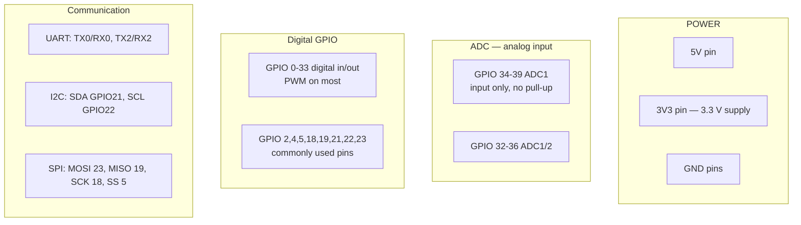

# P02 — Compare Hardware Platforms & ESP32 Pinout / Dual-Core Architecture

**Subject:** Hands on Practice using IoT | **Unit:** 2 | **Approx. Hrs:** 2
**PrO (verbatim):** *Compare hardware platforms (Arduino UNO, ESP32 and Raspberry Pi) and Study of the ESP32 pinout, dual-core architecture, and GPIO capabilities.*

---

## 1. Objective
- Compare **Arduino UNO**, **ESP32** and **Raspberry Pi** as IoT platforms.
- Draw and label the **ESP32 pinout**.
- Explain the ESP32 **dual-core architecture** and its **GPIO capabilities**.

## 2. Comparison of Platforms (exam table)

| Feature | Arduino UNO | ESP32 (DevKit V1) | Raspberry Pi (4/5) |
|---|---|---|---|
| **Type** | 8-bit microcontroller | 32-bit microcontroller (SoC) | Full single-board computer |
| **Processor** | ATmega328P, 16 MHz | 2 × Xtensa LX6 @ 240 MHz | Broadcom 4-core ARM Cortex-A72 |
| **RAM** | 2 KB | 520 KB SRAM | 1–8 GB LPDDR4 |
| **Storage** | 32 KB Flash (1 KB EEPROM) | 4 MB Flash | SD card / 32 GB eMMC |
| **Wi-Fi** | ❌ (needs shield) | ✅ built-in | ✅ built-in |
| **Bluetooth** | ❌ | ✅ BLE + Classic | ✅ (optional dongle on Pi 3/4) |
| **GPIO pins** | 14 digital, 6 analog (10-bit ADC) | ~25 usable digital, 2× 12-bit ADC | 40-pin header (GPIO, I2C, SPI, UART) |
| **Operating system** | Bare-metal (sketch) | Bare-metal (Arduino) / FreeRTOS / ESP-IDF | Linux (Raspberry Pi OS) |
| **Programming** | C++ (Arduino) | C/C++ (Arduino / ESP-IDF), MicroPython | Python, C/C++, Node.js, etc. |
| **Multitasking** | Single task loop | FreeRTOS dual-core tasks | True multi-process OS |
| **Power** | 5 V USB / barrel jack | 5 V USB | 5 V USB-C (needs 3 A) |
| **Cost (approx.)** | ₹400–700 | ₹400–800 | ₹3,000–6,000 |
| **Best for** | Simple sensor/LED learning | **IoT nodes with Wi-Fi/BT** | Edge computing, cameras, full apps |
| **Limitation** | No network stack on-chip | No full OS, limited compute | Higher power, cost, not a raw MCU |

> [!tip] Exam one-liner to memorise
> Arduino UNO = *simple digital/analog control, no networking*; ESP32 = *networking-first microcontroller (Wi-Fi + BT on-chip)*; Raspberry Pi = *a Linux computer with GPIO*, used as a gateway/edge device, not a bare-metal controller.

### When to choose which
- **Arduino UNO:** classroom basics, single sensor, no connectivity needed.
- **ESP32:** almost every practical in this subject — it reads sensors **and** pushes data over Wi-Fi.
- **Raspberry Pi:** needs a full OS (running a database, camera vision, acting as an MQTT broker/gateway aggregating many ESP32 nodes).

## 3. ESP32 Pinout (DevKit V1 — 30-pin)

```
                            ESP32 DevKit V1 (30-pin)
          ┌────────────────────────────────────────────────┐
 USB-C ──►│ EN   RST      3V3  GND                        │
          │ ┌──────────┐        ┌────┐    ┌────┐   ┌────┐  │
          │ │          │        │    │    │    │   │    │  │
    3V3 ├─┤ ├─ GPIO36  │   GPIO26├──┤ GPIO32├─┤ GPIO15├─┤  │
  GND  ├─┤ ├─ GPIO39  │   GPIO27├──┤ GPIO33├─┤ GPIO2 ├─┤  │
GPIO14 ├─┤ ├─ GPIO34  │   GPIO14├──┤ GPIO25├─┤ GPIO4 ├─┤  │
GPIO12 ├─┤ ├─ GPIO35  │   GPIO12├──┤ GPIO26├─┤ GPIO2 ├─┤  │
GPIO13 ├─┤ ├─ GPIO15  │   GPIO13├──┤ GPIO27├─┤ GPIO0 ├─┤  │
  D2  ├─┤ ├─ GPIO4   │   D2   ├──┤  GND  ├─┤ 3V3  ├─┤  │
  D1  ├─┤ ├─ GPIO0   │   D1   ├──┤ GPIO5 ├─┤ GPIO18├─┤  │
GPIO3  ├─┤ ├─ GPIO2   │ GPIO3  ├──┤ GPIO19├─┤ GPIO23├─┤  │
GPIO1  ├─┤ ├─ GPIO15  │ GPIO1  ├──┤ GPIO22├─┤ GND  ├─┤  │
GPIO22 ├─┤ ├─ GPIO3   │ GPIO22 ├──┤ GPIO21├─┤ GPIO19├─┤  │
GPIO21 ├─┤ ├─ GPIO1   │ GPIO21 ├──┤ GPIO3 ├─┤ GPIO23├─┤  │
GPIO19 ├─┤ ├─ GPIO0   │ GPIO19 ├──┤ GPIO22├─┤ GPIO18├─┤  │
GPIO18 ├─┤ ├─ GPIO2   │ GPIO18 ├──┤ GPIO21├─┤ GPIO5 ├─┤  │
  5V  ├─┤ ├─ GPIO4   │  5V    ├──┤ 3V3  ├─┤ GND  ├─┤  │
  GND ├─┤ ├─ GPIO15  │  GND   ├──┤ GPIO23├─┤ GPIO19├─┤  │
  GND ├─┤ ├─ GPIO36  │  GND   ├──┤ GPIO22├─┤ GPIO18├─┤  │
GPIO3 ├─┤ ├─ GPIO39  │ GPIO3  ├──┤ GPIO21├─┤ GPIO5 ├─┤  │
GPIO1 ├─┤ ├─ GPIO34  │ GPIO1  ├──┤ GPIO19├─┤ GPIO18├─┤  │
GPIO22 ├─┤ ├─ GPIO35  │ GPIO22 ├──┤ GPIO23├─┤ GPIO5 ├─┤  │
          └──────────┘        └────┘    └────┘   └────┘  │
      ┌───┬───┬───┬───┬───┬───┬───┬───┬───┬───┬───┬───┐   │
      │   │   │   │   │   │   │   │   │   │   │   │   │   │
      └───┴───┴───┴───┴───┴───┴───┴───┴───┴───┴───┴───┘
        D15 D2  D4  RX2 TX2 D5  D18 D19 D21 RX0 TX0 D22 D23
```



> [!warning] Pin safety rules (viva favourite)
> 1. **GPIO 34–39 are INPUT-ONLY** (no internal pull-up, cannot output). Use GPIO 4/5/18 for LEDs.
> 2. **All GPIO are 3.3 V logic** — do NOT feed 5 V into a pin (it can kill the chip). Use a level shifter for 5 V sensors.
> 3. **GPIO 0** must be HIGH at boot (strapping pin; also enables flash-boot mode when shorted to GND).
> 4. **GPIO 12, 15** are strapping pins that affect boot voltage/mode.
> 5. The **ADC reference is 0–3.3 V**; the ESP32 ADC is non-linear near the extremes.

## 4. ESP32 Dual-Core Architecture

The ESP32 (Espressif) contains **two Xtensa LX6 32-bit cores**, each running at up to **240 MHz**, plus a **2.4 GHz Wi-Fi + Bluetooth (BLE/Classic)** radio, all on one chip.

```
                    ESP32 SoC (simplified)
┌───────────────────────────────────────────────────────────┐
│  CORE 0 (PRO_CPU)              CORE 1 (APP_CPU)           │
│  • Wi-Fi stack, Bluetooth      • runs your user sketch    │
│  • protocol handling           • sensor reading, logic    │
├───────────────────────────────────────────────────────────┤
│  Shared resources:                                          │
│  • 520 KB SRAM · 4 MB Flash (DevKit) · 2× 12-bit ADC        │
│  • 2× 8-bit DAC · PWM/Timers · SPI · I2C · UART · CAN       │
│  • Wi-Fi 802.11 b/g/n + Bluetooth 4.2 BLE/BR/EDR            │
└───────────────────────────────────────────────────────────┘
```

| Feature | Details |
|---|---|
| **Cores** | 2 × Xtensa LX6 (32-bit), 240 MHz each |
| **Why dual-core matters** | Wi-Fi/BT radio stack runs on Core 0; your code runs on Core 1 → Wi-Fi never blocks sensor code |
| **OS support** | FreeRTOS (pre-emptive multi-tasking) under the hood of the Arduino core |
| **Memory** | 520 KB SRAM, 4 MB Flash (external SPI, DevKit), 8 KB RTC fast RAM |
| **Clock** | 80 / 160 / 240 MHz selectable |
| **Deep sleep** | ~10 µA — ultra-low-power battery IoT |

> [!tip] Arduino practical benefit
> in the Arduino IDE you don't manage cores directly — `setup()`/`loop()` run on Core 1 while the Wi-Fi library quietly uses Core 0. If you ever need true parallelism you can call `xTaskCreatePinnedToCore()` (FreeRTOS).

## 5. GPIO Capabilities (summary table)

| Capability | ESP32 details |
|---|---|
| Digital I/O | ~25 usable GPIO (excl. input-only 34–39 & strapping pins) |
| Analog input (ADC) | 2 × **12-bit** (0–4095) SAR ADCs, channels across GPIO 32–39 |
| Analog output (DAC) | 2 × 8-bit true DAC on **GPIO 25, 26** |
| PWM | LEDC hardware PWM on almost all digital pins (8 channels, 1 kHz–40 MHz) |
| Interrupts | GPIO interrupt on all pins (both edges) |
| Touch | 10 capacitive-touch sensors (GPIO 4, 32, 33, 34–39, …) |
| Communication | UART×3, I2C×2, SPI×3, CAN, I2S, SDMMC |

## 6. Expected Deliverable (report skeleton)
1. Title, aim, date.
2. Platform comparison table (section 2) with a short "why" for each platform.
3. ESP32 pinout diagram with 5 key pins labelled and their function.
4. Dual-core block diagram + 3 bullet points on why Wi-Fi is offloaded to Core 0.
5. GPIO capabilities table.
6. Conclusion: which platform you will use for the remaining practicals and why.

## 7. Conclusion
ESP32 is the **middle ground** that dominates this course: it is as simple to program as an Arduino UNO, yet ships with Wi-Fi + Bluetooth, dual cores, and a rich GPIO set on-chip — everything needed for the cloud practicals (P08–P14). Raspberry Pi remains useful as an edge/gateway device, but the practical list of this subject is built around the ESP32.

## 8. Viva Q&A
1. **Difference between Arduino UNO and ESP32?** — ESP32 adds 32-bit dual-core CPU, Wi-Fi, BLE, more RAM/Flash; UNO is 8-bit with no networking.
2. **Which pins are input-only?** — GPIO 34, 35, 36, 39 (ADC1).
3. **Why is a Raspberry Pi not a microcontroller?** — It runs a full Linux OS and is a complete computer; microcontrollers run bare-metal code.
4. **How do the two ESP32 cores divide work?** — Core 0 runs Wi-Fi/BT protocol stack, Core 1 runs the user sketch (FreeRTOS scheduling).
5. **What voltage is ESP32 logic?** — 3.3 V; feeding 5 V to a GPIO damages the chip.
6. **How many ADC bits?** — 12-bit (0–4095), 0–3.3 V range.

## 9. Resources
- ESP32 official docs (Espressif): https://docs.espressif.com/projects/esp-idf/en/latest/esp32/
- Arduino UNO specs: https://docs.arduino.cc/hardware/uno-rev3/
- Raspberry Pi documentation: https://www.raspberrypi.com/documentation/
- Random Nerd Tutorials "ESP32 Pinout Reference": https://randomnerdtutorials.com/esp32-pinout-reference-gpios/

---


---

## 🐛 Failure Modes & Debugging (Real-World Experience)

> [!bug] What goes wrong in production?
> When running **Compare Hardware Platforms Esp32 Pinout** in a real environment, it almost never works perfectly the first time. 
> 
> **Common Edge Cases to Test:**
> 1. **Network partitions:** What happens to this code if the Wi-Fi drops halfway through execution?
> 2. **Malformed Inputs:** How does the system behave if fed null values, extremely large datasets, or unexpected data types?
> 3. **Resource Exhaustion:** Does this script handle memory leaks or rate-limiting from APIs?

## 🔬 Extension Challenge

> [!example] Prove your expertise
> To truly master this practical, try modifying the code to achieve the following:
> - **Add robust error handling** (try/catch blocks) and structured logging instead of print statements.
> - **Parameterize the inputs** so the script can be run dynamically from the CLI without hardcoding values.
> - **Optimize it:** Can you reduce the execution time or memory footprint?

## 🎯 Key Takeaways

- **All GPIO are 3.3 V logic** — do NOT feed 5 V into a pin (it can kill the chip). Use a level shifter for 5 V sensors.
- **Difference between Arduino UNO and ESP32?** — ESP32 adds 32-bit dual-core CPU, Wi-Fi, BLE, more RAM/Flash; UNO is 8-bit with no networking.
- **Which pins are input-only?** — GPIO 34, 35, 36, 39 (ADC1).
- **Why is a Raspberry Pi not a microcontroller?** — It runs a full Linux OS and is a complete computer; microcontrollers run bare-metal code.
- **How do the two ESP32 cores divide work?** — Core 0 runs Wi-Fi/BT protocol stack, Core 1 runs the user sketch (FreeRTOS scheduling).
- **What voltage is ESP32 logic?** — 3.3 V; feeding 5 V to a GPIO damages the chip.
- **How many ADC bits?** — 12-bit (0–4095), 0–3.3 V range.

> [!tip] Viva Prep
> Be ready to explain the *why* behind each step, not just the output.
