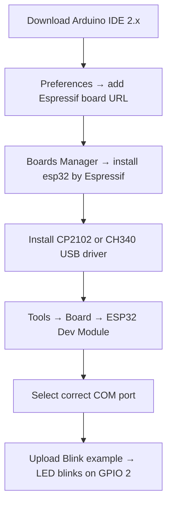

# P03 — Study: Arduino IDE Setup for ESP32 & Driver Installation

**Subject:** Hands on Practice using IoT | **Unit:** 2 | **Approx. Hrs:** 2
**PrO (verbatim):** *Write a Study Practical on Configuration of the Arduino IDE for ESP32 and install necessary drivers.*

---

## 1. Objective
- Install **Arduino IDE** on Windows/Linux/macOS.
- Add the **ESP32 board package** (Espressif) to the Boards Manager.
- Install the correct **USB-to-serial driver** (CP2102 or CH340) for the DevKit.
- Select the correct **board + COM port** and verify with a blink upload.

## 2. What You Need
| Item | Detail |
|---|---|
| Computer | Windows 7+/macOS/Linux, 4 GB+ RAM (as per GTU lab requirement) |
| Board | ESP32 DevKit V1 (30-pin) |
| Cable | **Micro-USB data cable** (many cheap cables are power-only — this is the #1 upload failure) |
| Software | Arduino IDE 2.x from arduino.cc |

## 3. Step-by-Step — Arduino IDE Setup for ESP32

### Step 1 — Install Arduino IDE
1. Download from **https://www.arduino.cc/en/software** (Arduino IDE 2.x).
2. Run the installer with default options (Windows: `.exe`; macOS: `.dmg`; Linux: AppImage/`.deb`).
3. Open the IDE once. You should see the classic layout: **Toolbar (Verify/Upload) · Code editor · Serial Monitor area**.

### Step 2 — Add the ESP32 board package URL
1. Go to **File → Preferences** (Windows/Linux) or **Arduino IDE → Settings** (macOS).
2. In **"Additional boards manager URLs"** paste:
   ```
   https://espressif.github.io/arduino-esp32/package_esp32_index.json
   ```
3. Click **OK**. (You may add several URLs separated by commas — e.g., also the ESP8266 URL.)

### Step 3 — Install the ESP32 core via Boards Manager
1. Open **Tools → Board → Boards Manager…**
2. In the search box type **`esp32`**.
3. Find **"esp32 by Espressif Systems"** and click **Install** (wait for the download — ~150 MB, needs internet).
4. Restart the IDE.

### Step 4 — Install the USB-to-Serial driver (the "driver" part of the PrO)
Find which chip your board uses by looking at the small IC near the USB connector:
- **CP2102 / CP210x (Silicon Labs)** — many ESP32 DevKits.
- **CH340 / CH341 (WCH)** — many "nano" and cheap boards.

| Chip | Driver | Where to get it |
|---|---|---|
| CP210x | **CP210x Universal Windows Driver** | https://www.silabs.com/developers/usb-to-uart-bridge-vcp-drivers |
| CH340 | **CH340 Driver (Windows)** | https://www.wch-ic.com/downloads/CH341SER_ZIP.html |

- Windows: download the `.exe`, plug in the board, run installer, then **unplug/replug** the USB cable.
- macOS: drivers are usually built-in for CP2102; CH340 may need the WCH macOS driver + "Allow" in Security & Privacy.
- Linux: generally no driver needed (kernel has `cp210x`/`ch341` modules built-in).

### Step 5 — Select the board and port
1. Plug the ESP32 in with the **data cable**.
2. **Tools → Board → esp32 → "ESP32 Dev Module"** (DevKit V1).
3. **Tools → Port →** select the new COM port (Windows: `COM3`/`COM4`; macOS/Linux: `/dev/cu.usbserial-*` / `/dev/ttyUSB0`).
   - If no port appears: check the cable is a **data cable**, reinstall the driver, or try another USB port.
4. Recommended settings: **Upload Speed 921600 · Flash Size 4 MB · Partition Scheme "Default 4 MB" · Core 1 · Flash Mode QIO**.

### Step 6 — Verify with a blink upload
1. **File → Examples → 01.Basics → Blink** (the built-in LED is on **GPIO 2** for DevKit V1).
2. Click **Verify (✓)** to compile, then **Upload (→)**.
3. If asked "**A fatal error occurred: Failed to connect to ESP32**": hold the **BOOT** button while uploading, or lower Upload Speed to **115200**.
4. Watch the on-board LED blink on GPIO 2. ✅



## 4. Troubleshooting Table (exam/viva gold)

| Problem | Most likely cause | Fix |
|---|---|---|
| "No port found" | Power-only USB cable | Use a **data** cable |
| "Failed to connect to ESP32" | Board in wrong boot mode / bootloader not found | Hold **BOOT** while uploading; reduce Upload Speed |
| Board resets on upload | Serial port conflict | Close Serial Monitor before uploading |
| "A fatal error occurred: MD5 of file does not match" | Old ESP32 core / corrupted download | Update "esp32 by Espressif" package |
| Not compiling `#include <WiFi.h>` | ESP32 core not installed | Repeat Step 3 |
| MAC port `/dev/ttyUSB0` permission denied | Linux user not in `dialout` group | `sudo usermod -aG dialout $USER`, logout/login |

## 5. Expected Deliverable (report skeleton)
1. Title, aim, date.
2. Screenshots: Preferences with the URL, Boards Manager installing `esp32`, selected board/port.
3. Name the USB chip on your board (CP2102 or CH340) and state the driver installed.
4. Compile log summary + "Done uploading" screenshot.
5. Observation: on-board LED blinks on GPIO 2.
6. Conclusion + one troubleshooting experience you faced and solved.

## 6. Conclusion
The ESP32 is fully usable from the Arduino IDE only after (a) adding the **Espressif board package** and (b) installing the **right USB-UART driver** for the board's bridge chip. Once verified with Blink, the IDE is ready for all sensor and cloud practicals in this course.

## 7. Viva Q&A
1. **What URL is added in Preferences?** — `https://espressif.github.io/arduino-esp32/package_esp32_index.json`
2. **Which drivers may an ESP32 DevKit need?** — CP2102 (Silicon Labs) or CH340 (WCH), depending on the USB-UART chip.
3. **Why doesn't "No port found" fix itself?** — Usually a power-only USB cable; data lines (D+/D−) are missing.
4. **What is the boot/strapping trick?** — Hold the **BOOT** (GPIO0) button to force download mode during upload.
5. **Which pin is the built-in LED on?** — GPIO 2 (DevKit V1).
6. **Do you need a driver on Linux?** — Usually no; the `cp210x`/`ch341` kernel modules load automatically.

## 8. Resources
- Arduino IDE download: https://www.arduino.cc/en/software
- Espressif Arduino-ESP32 docs: https://docs.espressif.com/projects/arduino-esp32/en/latest/
- CP210x drivers (Silicon Labs): https://www.silabs.com/developers/usb-to-uart-bridge-vcp-drivers
- CH340 driver (WCH): https://www.wch-ic.com/downloads/CH341SER_ZIP.html
- ESP32 getting-started guide (Random Nerd Tutorials): https://randomnerdtutorials.com/getting-started-with-esp32/

---


---

## 🐛 Failure Modes & Debugging (Real-World Experience)

> [!bug] What goes wrong in production?
> When running **Arduino Ide Setup Esp32** in a real environment, it almost never works perfectly the first time. 
> 
> **Common Edge Cases to Test:**
> 1. **Network partitions:** What happens to this code if the Wi-Fi drops halfway through execution?
> 2. **Malformed Inputs:** How does the system behave if fed null values, extremely large datasets, or unexpected data types?
> 3. **Resource Exhaustion:** Does this script handle memory leaks or rate-limiting from APIs?

## 🔬 Extension Challenge

> [!example] Prove your expertise
> To truly master this practical, try modifying the code to achieve the following:
> - **Add robust error handling** (try/catch blocks) and structured logging instead of print statements.
> - **Parameterize the inputs** so the script can be run dynamically from the CLI without hardcoding values.
> - **Optimize it:** Can you reduce the execution time or memory footprint?

## 🎯 Key Takeaways

- **CP2102 / CP210x (Silicon Labs)** — many ESP32 DevKits.
- **CH340 / CH341 (WCH)** — many "nano" and cheap boards.
- **What URL is added in Preferences?** — `https://espressif.github.io/arduino-esp32/package_esp32_index.json`
- **Which drivers may an ESP32 DevKit need?** — CP2102 (Silicon Labs) or CH340 (WCH), depending on the USB-UART chip.
- **Why doesn't "No port found" fix itself?** — Usually a power-only USB cable; data lines (D+/D−) are missing.
- **What is the boot/strapping trick?** — Hold the **BOOT** (GPIO0) button to force download mode during upload.
- **Which pin is the built-in LED on?** — GPIO 2 (DevKit V1).
- **Do you need a driver on Linux?** — Usually no; the `cp210x`/`ch341` kernel modules load automatically.

> [!tip] Viva Prep
> Be ready to explain the *why* behind each step, not just the output.
