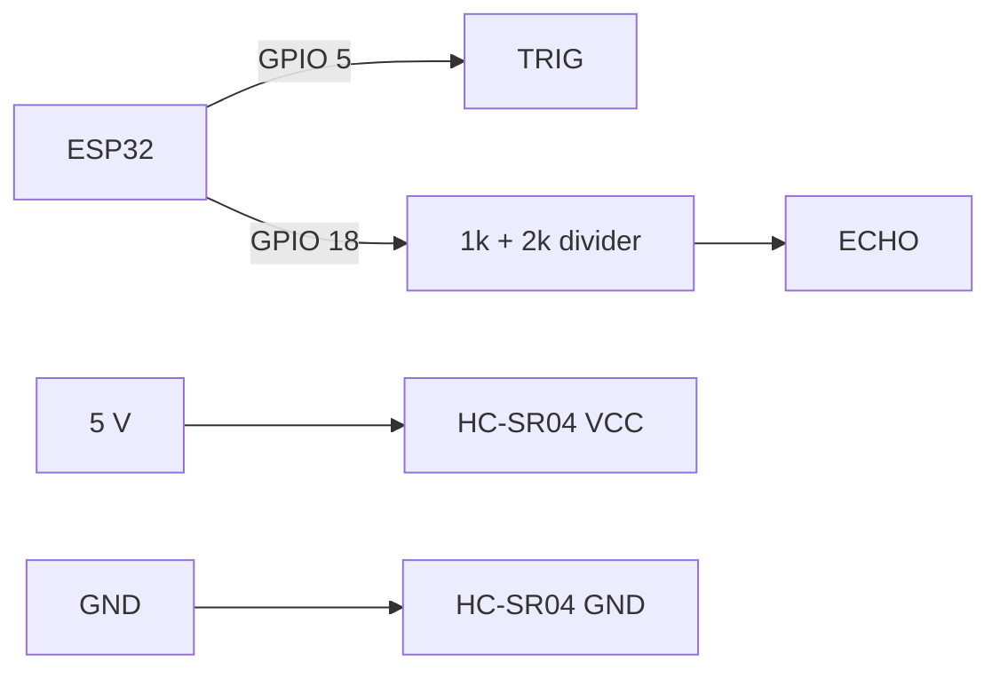

# P07 — Ultrasonic Sensor (HC-SR04) Distance Measurement

**Subject:** Hands on Practice using IoT | **Unit:** 3 | **Approx. Hrs:** 2
**PrO (verbatim):** *Write and execute a program to interface an Ultrasonic Sensor (Distance) with the ESP32 using specific sensor libraries.*

---

## 1. Objective
- Interface the **HC-SR04 ultrasonic distance sensor** with the ESP32.
- Measure distance by timing an **ultrasonic echo**.
- Print distance in **cm** on the Serial Monitor.

## 2. Theory (exam-ready)

### 2.1 How HC-SR04 measures distance
1. We pulse **TRIG** HIGH for 10 µs — the sensor emits 8 ultrasonic pulses (40 kHz).
2. The pulses bounce off an object and return to **ECHO**.
3. The sensor drives **ECHO HIGH for the round-trip time** of the sound.
4. **Distance = (time × speed of sound) / 2** — divide by 2 because the pulse travelled *out and back*.

```
distance_cm = (echoTime_us / 2) * 0.0343     // 0.0343 cm per microsecond
```

| Parameter | HC-SR04 spec |
|---|---|
| Range | 2 cm – 400 cm |
| Measuring angle | ~15° |
| Supply | 5 V (ECHO output is 5 V — see wiring warning) |
| Trigger | 10 µs HIGH on TRIG |
| Accuracy | ±3 mm (ideal conditions) |

> [!warning] Voltage warning
> the HC-SR04 is powered at 5 V and its **ECHO output can be 5 V**, which exceeds the ESP32's 3.3 V GPIO rating. Two safe options: (a) power the module from **3V3** (reduces range but is safe), or (b) add a **voltage divider (1 kΩ + 2 kΩ)** on ECHO → GPIO. The sketch below works with either; the wiring notes show the divider.

### 2.2 Library choice
Two ways: raw `pulseIn()` (no library needed) or **NewPing** library. This practical uses **NewPing** (in Library Manager: **"NewPing by Tim Eckel"**) which is simpler, filters noise, and warns about out-of-range.

## 3. Circuit / Wiring (with 5 V → 3.3 V safety divider)
| ESP32 pin | HC-SR04 pin |
|---|---|
| **5V** | VCC |
| **GPIO 5** | TRIG |
| **GPIO 18** | ECHO (through 1 kΩ + 2 kΩ divider to 3.3 V) |
| **GND** | GND (also divider ground) |

```
ECHO (5V) ── 1 kΩ ──┬── GPIO 18        (measured to GND = 3.3 V)
                    └── 2 kΩ ── GND
```



## 4. Code
```cpp
// P07 — HC-SR04 ultrasonic distance with NewPing library
// TRIG -> GPIO 5, ECHO -> GPIO 18 (via 1k+2k divider to 3V3)
// Library: "NewPing by Tim Eckel" (Library Manager)

#include <NewPing.h>

#define TRIG_PIN 5
#define ECHO_PIN 18
#define MAX_DIST 400            // cm, HC-SR04 maximum range

NewPing sonar(TRIG_PIN, ECHO_PIN, MAX_DIST);

void setup() {
  Serial.begin(115200);
  Serial.println("P07: Ultrasonic distance sensor started.");
}

void loop() {
  // returns distance in cm; 0 means out of range / no echo
  unsigned int dist = sonar.ping_cm();

  if (dist == 0) {
    Serial.println("Distance: out of range");
  } else {
    Serial.print("Distance: ");
    Serial.print(dist);
    Serial.println(" cm");
  }

  delay(500);                   // measure twice per second
}
```

> Full sketch: [`p07_ultrasonic_distance.ino`](./p07_ultrasonic_distance.ino.md)

## 5. Expected Serial Output
> ⚠️ **Not an actual run** — representative expected output while moving a book closer/farther:

```
P07: Ultrasonic distance sensor started.
Distance: 50 cm
Distance: 30 cm
Distance: 10 cm
Distance: 0 cm        <- object closer than 2 cm or sensor sees nothing
Distance: 84 cm
Distance: out of range
```

**Interpretation:** `Distance` tracks the object in real time; values below 2 cm and above 400 cm are unreliable (printed as `out of range`/`0`).

## 6. Verify on Hardware (checklist)
- [ ] Hold a book in front of the sensor — distance matches a ruler within a few cm.
- [ ] Move the book slowly — value changes smoothly, no random jumps.
- [ ] Objects closer than ~2 cm print `0`/`out of range`.
- [ ] Aim the sensor at an open corridor → `out of range` (beyond 400 cm).
- [ ] Remove the 1 kΩ+2 kΩ divider → verify ECHO level is 5 V (may shorten chip life — prefer to keep the divider).
- [ ] Test in cm and confirm NewPing handles the echo timing internally (no `pulseIn` needed in your code).

## 7. Conclusion
By timing the ultrasonic echo and applying the speed-of-sound formula, the ESP32 measures distance up to 4 m. This same measurement becomes the "water/fill level" and "tank depth" input in the cloud practicals (P11) and the Smart Agriculture project (P14).

## 8. Viva Q&A
1. **Formula for distance?** — `(echo time / 2) × speed of sound`; with time in µs: `time × 0.0343 / 2` cm.
2. **Why divide by 2?** — The echo time is the round trip (out + back).
3. **Why 40 kHz?** — The sensor's ultrasonic frequency is above human hearing.
4. **What does TRIG do?** — A 10 µs HIGH pulse makes the module emit 8 ultrasonic pulses.
5. **Why the 1 kΩ + 2 kΩ divider?** — ECHO outputs ~5 V; the divider drops it to ~3.3 V to protect the ESP32 GPIO.
6. **What does NewPing's `ping_cm()` return on failure?** — 0 (out of range / no echo).

## 9. Resources
- NewPing library: https://playground.arduino.cc/Code/NewPing/
- HC-SR04 datasheet: https://cdn.sparkfun.com/datasheets/Sensors/Proximity/HCSR04.pdf
- Ultrasonic distance tutorial: https://randomnerdtutorials.com/esp32-hc-sr04-ultrasonic-arduino/
- ESP32 + ultrasonic + ThingSpeak (used in P11): https://randomnerdtutorials.com/esp32-hc-sr04-ultrasonic-distance-sensor/

---


---

## 🐛 Failure Modes & Debugging (Real-World Experience)

> [!bug] What goes wrong in production?
> When running **Ultrasonic Distance Sensor** in a real environment, it almost never works perfectly the first time. 
> 
> **Common Edge Cases to Test:**
> 1. **Network partitions:** What happens to this code if the Wi-Fi drops halfway through execution?
> 2. **Malformed Inputs:** How does the system behave if fed null values, extremely large datasets, or unexpected data types?
> 3. **Resource Exhaustion:** Does this script handle memory leaks or rate-limiting from APIs?

## 🔬 Extension Challenge

> [!example] Prove your expertise
> To truly master this practical, try modifying the code to achieve the following:
> - **Add robust error handling** (try/catch blocks) and structured logging instead of print statements.
> - **Parameterize the inputs** so the script can be run dynamically from the CLI without hardcoding values.
> - **Optimize it:** Can you reduce the execution time or memory footprint?

## 🎯 Key Takeaways

- **Distance = (time × speed of sound) / 2** — divide by 2 because the pulse travelled *out and back*.
- **Not an actual run** — representative expected output while moving a book closer/farther:
- **Formula for distance?** — `(echo time / 2) × speed of sound`; with time in µs: `time × 0.0343 / 2` cm.
- **Why divide by 2?** — The echo time is the round trip (out + back).
- **Why 40 kHz?** — The sensor's ultrasonic frequency is above human hearing.
- **What does TRIG do?** — A 10 µs HIGH pulse makes the module emit 8 ultrasonic pulses.
- **Why the 1 kΩ + 2 kΩ divider?** — ECHO outputs ~5 V; the divider drops it to ~3.3 V to protect the ESP32 GPIO.
- **What does NewPing's `ping_cm()` return on failure?** — 0 (out of range / no echo).

> [!tip] Viva Prep
> Be ready to explain the *why* behind each step, not just the output.
