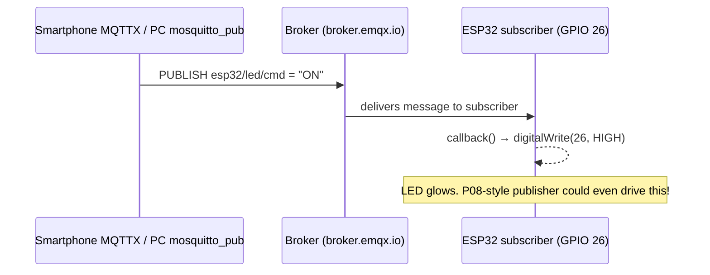

# P09 — ESP32 as MQTT Subscriber: Remote LED/Relay Control

**Subject:** Hands on Practice using IoT | **Unit:** 4 | **Approx. Hrs:** 2
**PrO (verbatim):** *Write and execute a program to subscribe the ESP32 to an MQTT topic so that an external client (like a smartphone or PC) can remotely control an onboard LED or Relay over the internet.*

---

## 1. Objective
- Subscribe the ESP32 to an MQTT **command topic**.
- Parse `ON`/`OFF` messages and drive an **onboard LED or relay**.
- Publish `ON`/`OFF` from a **smartphone (MQTTX app)** or **PC (`mosquitto_pub`)** and watch the ESP32 react.

## 2. Theory (exam-ready)

### 2.1 Subscriber vs Publisher (this practical)
- P08 **published** sensor data. Here the ESP32 **subscribes** to `esp32/led/cmd` — a command topic controlled by *another* device.
- `client.setCallback(onMessage)` → the callback runs automatically whenever a subscribed topic receives a message.
- The callback signature is:
  ```cpp
  void onMessage(char* topic, byte* payload, unsigned int length)
  ```
- Always keep `client.loop()` running in `loop()` — this is what checks for incoming messages and fires the callback.

### 2.2 "1" / "0" vs "ON" / "OFF"
Two common conventions; this practical uses **`ON` / `OFF`** strings. Any subscriber (MQTTX on phone, `mosquitto_pub` on PC) can send them:

```
topic:  esp32/led/cmd     payload: "ON"   → LED/relay HIGH
topic:  esp32/led/cmd     payload: "OFF"  → LED/relay LOW
```



## 3. Libraries to Install
1. **"PubSubClient by Nick O'Leary"** (same as P08).
2. No sensor libraries needed — only Wi-Fi + PubSubClient.

## 4. Circuit / Wiring
| ESP32 pin | Component |
|---|---|
| **GPIO 26** | LED anode via 220 Ω (or relay module IN pin) |
| **GND** | LED cathode (or relay GND) |
| **VIN/5V** | Relay module VCC (if using a relay) |

> 💡 Relay wiring note: connect **IN → GPIO 26, VCC → 5V, GND → GND**. Most ESP32 relay boards use **LOW = active** — if so, swap the logic below to `digitalWrite(relayPin, LOW)` for ON.

## 5. Code
```cpp
// P09 — ESP32 as MQTT subscriber: remote control of LED/relay
// Command topic: esp32/led/cmd   payload "ON" / "OFF"
// Libraries: PubSubClient

#include <WiFi.h>
#include <PubSubClient.h>

const char* ssid = "YOUR_WIFI_SSID";
const char* password = "YOUR_WIFI_PASSWORD";

const char* mqttServer = "broker.emqx.io";
const int   mqttPort = 1883;

const char* topicCmd = "esp32/led/cmd";    // subscribed command topic

const int ledPin = 26;                     // LED (or relay IN) on GPIO 26

WiFiClient espClient;
PubSubClient client(espClient);

void setup() {
  Serial.begin(115200);
  pinMode(ledPin, OUTPUT);
  digitalWrite(ledPin, LOW);

  WiFi.begin(ssid, password);
  Serial.print("Connecting to Wi-Fi");
  while (WiFi.status() != WL_CONNECTED) {
    delay(500);
    Serial.print(".");
  }
  Serial.println();
  Serial.print("Connected, IP: ");
  Serial.println(WiFi.localIP());

  client.setServer(mqttServer, mqttPort);
  client.setCallback(onMessage);   // register the callback
}

// Called automatically by client.loop() when a message arrives
void onMessage(char* topic, byte* payload, unsigned int length) {
  Serial.print("Message arrived on [");
  Serial.print(topic);
  Serial.print("]: ");

  // build a clean string from the payload bytes
  String msg = "";
  for (unsigned int i = 0; i < length; i++) {
    msg += (char)payload[i];
  }
  Serial.println(msg);

  if (msg == "ON") {
    digitalWrite(ledPin, HIGH);
    Serial.println(">>> LED ON");
  } else if (msg == "OFF") {
    digitalWrite(ledPin, LOW);
    Serial.println(">>> LED OFF");
  } else {
    Serial.println("Unknown command (send ON or OFF)");
  }
}

void reconnect() {
  while (!client.connected()) {
    Serial.print("Attempting MQTT connection...");
    if (client.connect("esp32-led-sub-01")) {
      Serial.println("connected");
      client.subscribe(topicCmd);          // subscribe AFTER connecting
    } else {
      Serial.print("failed, rc=");
      Serial.print(client.state());
      Serial.println(" retrying in 5s");
      delay(5000);
    }
  }
}

void loop() {
  if (!client.connected()) {
    reconnect();
  }
  client.loop();   // processes incoming messages -> fires onMessage()
}
```

> Full sketch: [`p09_mqtt_subscribe_led.ino`](./p09_mqtt_subscribe_led.ino.md)

## 6. How to Publish From a Phone/PC (the "external client")

### Option A — Smartphone: MQTTX app
1. Install **MQTTX** (Google Play / App Store).
2. Add a connection: host `broker.emqx.io`, port `1883`.
3. Under the new connection, **publish**:
   - Topic: `esp32/led/cmd`
   - Payload: `ON` (or `OFF`), QoS 0
4. Hit **Send** → the ESP32 prints the message and switches the LED.

### Option B — PC: mosquitto_pub (Mosquitto clients)
```bash
mosquitto_pub -h broker.emqx.io -t "esp32/led/cmd" -m "ON"
mosquitto_pub -h broker.emqx.io -t "esp32/led/cmd" -m "OFF"
```
On Windows install via `winget install EclipseMosquitto` or the installer from mosquitto.org.

## 7. Expected Serial Output
> ⚠️ **Not an actual run** — expected behaviour when a client sends `ON` then `OFF`:

```
Connecting to Wi-Fi.....
Connected, IP: 192.168.1.42
Attempting MQTT connection...connected
Message arrived on [esp32/led/cmd]: ON
>>> LED ON
Message arrived on [esp32/led/cmd]: OFF
>>> LED OFF
Message arrived on [esp32/led/cmd]: ON
>>> LED ON
```

## 8. Verify on Hardware (checklist)
- [ ] ESP32 subscribes and prints `connected` after the MQTT handshake.
- [ ] Sending `ON` from MQTTX / `mosquitto_pub` lights the LED instantly (<1 s).
- [ ] Sending `OFF` switches it off.
- [ ] Sending anything else (e.g. `toggle`) prints `Unknown command` — LED unchanged.
- [ ] Broker's own web client (EMQX public broker web UI) also works as a test publisher.
- [ ] Kill Wi-Fi, reconnect → subscription is re-established automatically.

## 9. Conclusion
The ESP32 became a **remote-controlled actuator**: it listens on `esp32/led/cmd` and any device anywhere on the internet — a phone, a PC, or even P08's publisher — can flip the LED by publishing one word. This publish/subscribe remote-control pattern is exactly how Blynk virtual buttons (P12) and the Smart Agriculture pump control (P14) work underneath.

## 10. Viva Q&A
1. **Which function handles incoming MQTT messages?** — `client.setCallback(onMessage)`; `onMessage()` runs inside `client.loop()`.
2. **Why subscribe after connecting?** — Subscriptions belong to the connection; subscribing before `connect()` has no effect.
3. **What does `client.loop()` do?** — Keeps the MQTT connection alive and dispatches incoming messages to the callback.
4. **What QoS did we use and what does it mean?** — QoS 0 = at-most-once; message delivered once, no acknowledgement (fine for a light switch).
5. **Can a relay be driven the same way?** — Yes; just replace the LED with a relay module (note LOW-active relays may need inverted logic).
6. **Why strings `ON`/`OFF` and not booleans?** — MQTT payloads are byte strings; the application decides the encoding.

## 11. Resources
- PubSubClient library: https://github.com/knolleary/pubsubclient
- MQTTX client download: https://mqttx.app/
- Mosquitto tools download: https://mosquitto.org/download/
- EMQX public broker: https://www.emqx.com/en/mqtt/public-mqtt5-broker
- ESP32 MQTT subscribe tutorial: https://randomnerdtutorials.com/esp32-mqtt-subscribe-arduino-ide/

---


---

## 🐛 Failure Modes & Debugging (Real-World Experience)

> [!bug] What goes wrong in production?
> When running **Esp32 Mqtt Subscriber Remote Control** in a real environment, it almost never works perfectly the first time. 
> 
> **Common Edge Cases to Test:**
> 1. **Network partitions:** What happens to this code if the Wi-Fi drops halfway through execution?
> 2. **Malformed Inputs:** How does the system behave if fed null values, extremely large datasets, or unexpected data types?
> 3. **Resource Exhaustion:** Does this script handle memory leaks or rate-limiting from APIs?

## 🔬 Extension Challenge

> [!example] Prove your expertise
> To truly master this practical, try modifying the code to achieve the following:
> - **Add robust error handling** (try/catch blocks) and structured logging instead of print statements.
> - **Parameterize the inputs** so the script can be run dynamically from the CLI without hardcoding values.
> - **Optimize it:** Can you reduce the execution time or memory footprint?

## 🎯 Key Takeaways

- **LOW = active** — if so, swap the logic below to `digitalWrite(relayPin, LOW)` for ON.
- **publish** — - Topic: `esp32/led/cmd`
- **Not an actual run** — expected behaviour when a client sends `ON` then `OFF`:
- **remote-controlled actuator** — it listens on `esp32/led/cmd` and any device anywhere on the internet — a phone, a PC, or even P08's publisher — can flip the LED by publishing one word. This publish/subscribe remote-control pattern is exactly how Blynk virtual buttons (P12) and the Smart Agriculture pump control (P14) work underneath.
- **Which function handles incoming MQTT messages?** — `client.setCallback(onMessage)`; `onMessage()` runs inside `client.loop()`.
- **Why subscribe after connecting?** — Subscriptions belong to the connection; subscribing before `connect()` has no effect.
- **What does `client.loop()` do?** — Keeps the MQTT connection alive and dispatches incoming messages to the callback.
- **What QoS did we use and what does it mean?** — QoS 0 = at-most-once; message delivered once, no acknowledgement (fine for a light switch).

> [!tip] Viva Prep
> Be ready to explain the *why* behind each step, not just the output.
