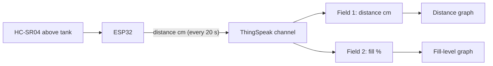

# P11 — Ultrasonic Distance to Cloud (ThingSpeak)

**Subject:** Hands on Practice using IoT | **Unit:** 5 | **Approx. Hrs:** 2
**PrO (verbatim):** *Develop an IoT application to integrate ESP32 Ultrasonic Sensor (Distance) with the cloud platform.*

---

## 1. Objective
- Reuse the **HC-SR04** (P07) to measure distance.
- Upload **distance in cm** to a ThingSpeak channel over **HTTP GET**.
- Build a **fill-level style dashboard** (e.g., water-tank level) on ThingSpeak.

## 2. Theory (exam-ready)

### 2.1 The application: distance → fill level
A distance sensor above a water tank measures the *gap* from the top. We can convert:

```
fill_level_cm = tank_height_cm - measured_distance_cm
fill_percent  = (fill_level_cm / tank_height_cm) * 100
```

> [!tip] Why this is exam gold
> this single practical joins three units — ultrasonic sensing (Unit 2/3), HTTP APIs (Unit 5) and a real application. "Explain how you would measure a tank's fill level with an ultrasonic sensor" is a classic viva/design question.

### 2.2 Using two fields
ThingSpeak supports **8 fields** per channel — we use:
- **Field 1:** raw distance (cm)
- **Field 2:** computed fill level (%)



## 3. Setup — ThingSpeak Channel (do once)
1. **New Channel** → name `ESP32 Tank Level`; enable **Field 1** = `Distance (cm)`, **Field 2** = `Fill (%)`.
2. Copy the **Write API Key** from the **API Keys** tab.
3. (Optional) Make the channel **public** to embed the fill-level chart.

## 4. Libraries to Install
1. **"NewPing by Tim Eckel"** (P07).
2. `WiFi` + `HTTPClient` from the ESP32 core.

## 5. Circuit / Wiring
Same as P07:
| ESP32 | HC-SR04 |
|---|---|
| 5V | VCC |
| **GPIO 5** | TRIG |
| **GPIO 18** | ECHO (via 1 kΩ + 2 kΩ divider to 3.3 V) |
| GND | GND |

## 6. Code
```cpp
// P11 — Ultrasonic distance to ThingSpeak (tank fill-level application)
// TRIG -> GPIO 5, ECHO -> GPIO 18 (1k+2k divider) · NewPing + HTTPClient
// Library: NewPing

#include <WiFi.h>
#include <HTTPClient.h>
#include <NewPing.h>

const char* ssid = "YOUR_WIFI_SSID";
const char* password = "YOUR_WIFI_PASSWORD";

// >>> REPLACE WITH YOUR THINGSPEAK WRITE API KEY <<<
String apiKey = "XXXXXXXXXXXXXXXX";

const float TANK_HEIGHT = 100.0;   // tank height in cm (example)

#define TRIG_PIN 5
#define ECHO_PIN 18
#define MAX_DIST 400

NewPing sonar(TRIG_PIN, ECHO_PIN, MAX_DIST);

const char* server = "api.thingspeak.com";
const unsigned long INTERVAL = 20000;
unsigned long lastSend = 0;

void setup() {
  Serial.begin(115200);

  WiFi.begin(ssid, password);
  Serial.print("Connecting to Wi-Fi");
  while (WiFi.status() != WL_CONNECTED) {
    delay(500);
    Serial.print(".");
  }
  Serial.println();
  Serial.print("Connected, IP: ");
  Serial.println(WiFi.localIP());
}

void loop() {
  unsigned long now = millis();
  if (now - lastSend < INTERVAL) return;
  lastSend = now;

  unsigned int dist = sonar.ping_cm();
  if (dist == 0 || dist > TANK_HEIGHT) {
    Serial.println("Distance out of range, skipping upload");
    return;
  }

  // convert distance from the top into a fill level / percentage
  float fillCm = TANK_HEIGHT - dist;
  float fillPct = (fillCm / TANK_HEIGHT) * 100.0;

  HTTPClient http;
  String url = String("http://") + server + "/update?api_key=" + apiKey +
               "&field1=" + String(dist) +
               "&field2=" + String(fillPct, 1);

  http.begin(url);
  int code = http.GET();

  if (code == 200) {
    Serial.print("Uploaded dist=");
    Serial.print(dist);
    Serial.print(" cm, fill=");
    Serial.print(fillPct, 1);
    Serial.print(" %  -> HTTP 200, entry ");
    Serial.println(http.getString());
  } else {
    Serial.print("Upload failed, HTTP code: ");
    Serial.println(code);
  }
  http.end();
}
```

> Full sketch: [`p11_thingspeak_http_ultrasonic.ino`](./p11_thingspeak_http_ultrasonic.ino.md)

## 7. Dashboard Setup Steps (ThingSpeak)
1. Open the channel → **Private View** → both field charts appear.
2. Click the Field 2 chart → **Share → Embed widget** → copy the iframe into your report/blog.
3. For a "gauge" look: **Apps → MATLAB Visualizations** → new MATLAB Analysis plotting `fillPercent` over time (optional, not required).
4. **React app (optional bonus):** Apps → React → "if Field 2 < 20% then WebRequest/notify" — a real alert rule (ties into P13's threshold concept).

## 8. Expected Serial Output
> ⚠️ **Not an actual run** — expected behaviour with the sensor above a "tank" (a book moving under it):

```
Connecting to Wi-Fi......
Connected, IP: 192.168.1.42
Uploaded dist=45 cm, fill=55.0 %  -> HTTP 200, entry 8812231
Uploaded dist=10 cm, fill=90.0 %  -> HTTP 200, entry 8812235
Uploaded dist=80 cm, fill=20.0 %  -> HTTP 200, entry 8812239
```

**Interpretation:** moving the object closer (smaller distance) → higher `fill %`, exactly like water rising in a tank.

## 9. Verify on Hardware (checklist)
- [ ] HTTP 200 with a numeric entry id on every upload.
- [ ] Field 1 (distance) and Field 2 (fill %) graphs both update every 20 s.
- [ ] Place a book at 10 cm → Field 1 ≈ 10, Field 2 ≈ 90.
- [ ] `dist` above `TANK_HEIGHT` skips the upload (prints "out of range") — no bad data.
- [ ] The embedded widget renders the live chart in your report.
- [ ] (Optional) ThingSpeak React alert fires when fill % drops below a threshold.

## 10. Conclusion
The same HC-SR04 from P07 now feeds a **real cloud dashboard**: raw distance and computed fill percentage land on ThingSpeak every 20 s over a simple HTTP GET. With a tank-height constant, the same sketch becomes a **water-level monitoring system** — one of the mini-project ideas in P14 (Urban Flood & Water Level Alert).

## 11. Viva Q&A
1. **How is fill level computed?** — `fill = TANK_HEIGHT − distance`; `% = fill/TANK_HEIGHT × 100`.
2. **Why two fields instead of one?** — Field 1 keeps the raw measurement (audit/debug), Field 2 the derived quantity used by the dashboard.
3. **What happens when distance > tank height?** — Out of range; the sketch skips the upload to avoid bad data.
4. **Why 20 s interval?** — ThingSpeak's free tier minimum is 15 s; 20 s is safe.
5. **Which library measures distance?** — NewPing (`sonar.ping_cm()`).
6. **What is a React app in ThingSpeak?** — A rule engine that triggers an action (webhook/notify) when a condition on a field becomes true.

## 12. Resources
- ThingSpeak: https://thingspeak.com/
- ThingSpeak channels docs: https://docs.thingspeak.com/en/
- NewPing library: https://playground.arduino.cc/Code/NewPing/
- HC-SR04 + ThingSpeak tutorial: https://randomnerdtutorials.com/esp32-hc-sr04-ultrasonic-thingspeak/
- React apps (ThingSpeak): https://docs.thingspeak.com/en/apps/react/

---


---

## 🐛 Failure Modes & Debugging (Real-World Experience)

> [!bug] What goes wrong in production?
> When running **Ultrasonic Thingspeak Cloud** in a real environment, it almost never works perfectly the first time. 
> 
> **Common Edge Cases to Test:**
> 1. **Network partitions:** What happens to this code if the Wi-Fi drops halfway through execution?
> 2. **Malformed Inputs:** How does the system behave if fed null values, extremely large datasets, or unexpected data types?
> 3. **Resource Exhaustion:** Does this script handle memory leaks or rate-limiting from APIs?

## 🔬 Extension Challenge

> [!example] Prove your expertise
> To truly master this practical, try modifying the code to achieve the following:
> - **Add robust error handling** (try/catch blocks) and structured logging instead of print statements.
> - **Parameterize the inputs** so the script can be run dynamically from the CLI without hardcoding values.
> - **Optimize it:** Can you reduce the execution time or memory footprint?

## 🎯 Key Takeaways

- **Not an actual run** — expected behaviour with the sensor above a "tank" (a book moving under it):
- **real cloud dashboard** — raw distance and computed fill percentage land on ThingSpeak every 20 s over a simple HTTP GET. With a tank-height constant, the same sketch becomes a **water-level monitoring system** — one of the mini-project ideas in P14 (Urban Flood & Water Level Alert).
- **How is fill level computed?** — `fill = TANK_HEIGHT − distance`; `% = fill/TANK_HEIGHT × 100`.
- **Why two fields instead of one?** — Field 1 keeps the raw measurement (audit/debug), Field 2 the derived quantity used by the dashboard.
- **What happens when distance > tank height?** — Out of range; the sketch skips the upload to avoid bad data.
- **Why 20 s interval?** — ThingSpeak's free tier minimum is 15 s; 20 s is safe.
- **Which library measures distance?** — NewPing (`sonar.ping_cm()`).
- **What is a React app in ThingSpeak?** — A rule engine that triggers an action (webhook/notify) when a condition on a field becomes true.

> [!tip] Viva Prep
> Be ready to explain the *why* behind each step, not just the output.
