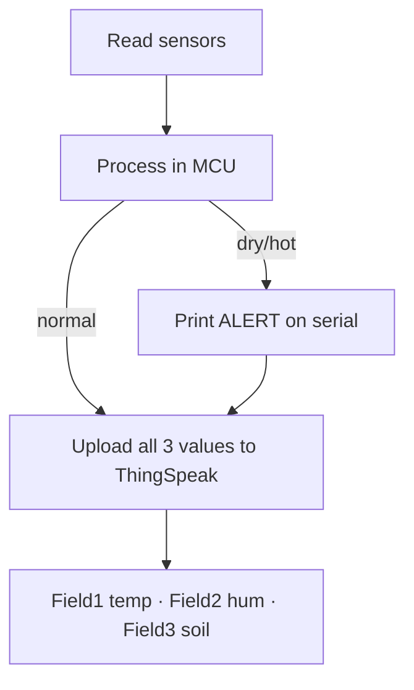

# P13 — Soil Moisture + DHT: Serial (a) and Cloud with Thresholds (b)

**Subject:** Hands on Practice using IoT | **Unit:** 5 | **Approx. Hrs:** 2
**PrO (verbatim):** *(a) Write and execute a program to interface soil moisture and DHT sensors with ESP32 and Read real-time sensor data and process it in the microcontroller. Display the values on the Serial Monitor for verification. (b) Write and execute a program to connect ESP32 to Wi-Fi, send temperature, humidity, and soil moisture data to the cloud at regular intervals, visualize the data on a dashboard, and define threshold values.*

---

## 1. Objective
- **(a)** Read **soil moisture** (analog) + **DHT11** (temp/humidity) on the ESP32 and print them on the Serial Monitor.
- **(b)** Add Wi-Fi + **ThingSpeak** upload of all three values at regular intervals.
- Define **thresholds** (dry soil / hot temperature) and print/flag **alerts** in the firmware.

## 2. Theory (exam-ready)

### 2.1 Soil moisture sensor (YL-69 / FC-28 / capacitive)
- Two prongs act as a capacitor/resistor whose value depends on **water content**: wet soil conducts better → **lower resistance → higher ADC reading**.
- Digital versions (FC-28 D0) also give a HIGH/LOW vs a threshold pot; we use the **analog A0 output** (0–4095).
- Note the **inverted meaning** vs LDR: wet soil → high reading; dry soil → low reading.

```
Soil probe → A0 (GPIO 34) → ADC 0-4095
dry soil ≈ 1500-2200 · normal ≈ 2200-2800 · wet ≈ 2800-4095
```

> [!warning] Voltage caution
> the FC-28 module's analog output is a divider — if you feed it **3V3** instead of 5 V, its output stays within the ESP32's ADC range and is safe.

### 2.2 Threshold alert logic (part b — the marking-scheme favourite)
"Process it in the microcontroller" means the **ESP32 itself** decides if a value is critical, *before* uploading:

| Condition | Meaning | Alert |
|---|---|---|
| `soilRaw < SOIL_DRY (2000)` | Soil too dry | `ALERT: Soil DRY — irrigate!` |
| `temp > TEMP_HOT (35)` | Too hot for crops | `ALERT: High temperature` |
| `hum < HUM_LOW (40)` | Air too dry | `ALERT: Low humidity` |

The cloud (ThingSpeak) stores the data; the **threshold decision lives on the ESP32** (edge processing — a Unit-1/P01 concept).



## 3. Part (a) — Serial Monitor Only

### 3.1 Libraries
1. **"DHT sensor library by Adafruit"** + **"Adafruit Unified Sensor"**.

### 3.2 Wiring
| ESP32 | Sensor |
|---|---|
| 3V3 | DHT VCC · soil module VCC |
| **GPIO 4** | DHT DATA (+ pull-up) |
| **GPIO 34** | Soil module A0 (analog) |
| GND | both GNDs |

### 3.3 Code
```cpp
// P13a — Soil moisture (analog) + DHT11 read, processed on the ESP32,
//         displayed on the Serial Monitor.
// Soil A0 -> GPIO 34 · DHT DATA -> GPIO 4

#include <DHT.h>

#define SOIL_PIN 34
#define DHTPIN 4
#define DHTTYPE DHT11
DHT dht(DHTPIN, DHTTYPE);

void setup() {
  Serial.begin(115200);
  dht.begin();
  pinMode(SOIL_PIN, INPUT);
  Serial.println("P13a: Soil moisture + DHT on Serial Monitor");
}

void loop() {
  delay(2000);                       // DHT needs 2 s between reads

  int soil = analogRead(SOIL_PIN);   // 0..4095 (wet = high)
  float h = dht.readHumidity();
  float t = dht.readTemperature();

  Serial.print("Soil raw: ");
  Serial.print(soil);
  Serial.print("  Humidity: ");
  if (isnan(h)) Serial.print("err"); else Serial.print(h);
  Serial.print(" %  Temperature: ");
  if (isnan(t)) Serial.print("err"); else Serial.print(t);
  Serial.println(" *C");
}
```

> Full sketch: [`p13a_soil_moisture_dht_serial.ino`](./p13a_soil_moisture_dht_serial.ino.md)

### 3.4 Expected Serial Output (part a)
> ⚠️ **Not an actual run** — expected behaviour as the probe moves from wet to dry soil:

```
P13a: Soil moisture + DHT on Serial Monitor
Soil raw: 3210  Humidity: 62.00 %  Temperature: 26.00 *C
Soil raw: 2870  Humidity: 62.00 %  Temperature: 26.00 *C
Soil raw: 1705  Humidity: 61.00 %  Temperature: 27.00 *C   <- probe in dry soil
```

## 4. Part (b) — Wi-Fi + Cloud Upload with Thresholds

### 4.1 ThingSpeak setup (do once)
1. New channel: **Field 1** = Temperature, **Field 2** = Humidity, **Field 3** = Soil moisture.
2. Copy the **Write API Key**.
3. Dashboard: three field charts appear automatically.

### 4.2 Libraries
1. **"DHT sensor library by Adafruit"** + **"Adafruit Unified Sensor"**.
2. `WiFi` + `HTTPClient` (ESP32 core).

### 4.3 Code
```cpp
// P13b — Soil moisture + DHT -> Wi-Fi -> ThingSpeak, with threshold alerts
// Soil A0 -> GPIO 34 · DHT DATA -> GPIO 4 · HTTPClient

#include <WiFi.h>
#include <HTTPClient.h>
#include <DHT.h>

const char* ssid = "YOUR_WIFI_SSID";
const char* password = "YOUR_WIFI_PASSWORD";

// >>> REPLACE WITH YOUR THINGSPEAK WRITE API KEY <<<
String apiKey = "XXXXXXXXXXXXXXXX";

// ---- Threshold values (process on the ESP32, before upload) ----
const int  SOIL_DRY = 2000;    // below this = soil needs irrigation
const float TEMP_HOT = 35.0;   // above this = heat alert
const float HUM_LOW  = 40.0;   // below this = dry-air alert

#define SOIL_PIN 34
#define DHTPIN 4
#define DHTTYPE DHT11
DHT dht(DHTPIN, DHTTYPE);

const char* server = "api.thingspeak.com";
const unsigned long INTERVAL = 20000;   // 20 s
unsigned long lastSend = 0;

void setup() {
  Serial.begin(115200);
  dht.begin();
  pinMode(SOIL_PIN, INPUT);

  WiFi.begin(ssid, password);
  Serial.print("Connecting to Wi-Fi");
  while (WiFi.status() != WL_CONNECTED) {
    delay(500);
    Serial.print(".");
  }
  Serial.println();
  Serial.print("Connected, IP: ");
  Serial.println(WiFi.localIP());
}

void loop() {
  unsigned long now = millis();
  if (now - lastSend < INTERVAL) return;
  lastSend = now;

  int  soil = analogRead(SOIL_PIN);
  float h = dht.readHumidity();
  float t = dht.readTemperature();

  if (isnan(h) || isnan(t)) {
    Serial.println("DHT read failed, skipping cycle");
    return;
  }

  // ---- threshold / alert logic (edge processing on the ESP32) ----
  if (soil < SOIL_DRY) {
    Serial.println("ALERT: Soil DRY - irrigation needed!");
  }
  if (t > TEMP_HOT) {
    Serial.println("ALERT: High temperature!");
  }
  if (h < HUM_LOW) {
    Serial.println("ALERT: Low air humidity!");
  }

  // ---- upload all three values to ThingSpeak ----
  HTTPClient http;
  String url = String("http://") + server + "/update?api_key=" + apiKey +
               "&field1=" + String(t, 1) +
               "&field2=" + String(h, 1) +
               "&field3=" + String(soil);

  http.begin(url);
  int code = http.GET();

  Serial.print("Uploaded temp=");
  Serial.print(t, 1);
  Serial.print(" hum=");
  Serial.print(h, 1);
  Serial.print(" soil=");
  Serial.print(soil);
  Serial.print("  -> HTTP ");
  Serial.println(code == 200 ? "200" : String(code));
  http.end();
}
```

> Full sketch: [`p13b_soil_dht_cloud_threshold.ino`](./p13b_soil_dht_cloud_threshold.ino.md)

### 4.4 Expected Serial Output (part b)
> ⚠️ **Not an actual run** — expected behaviour with a dry-soil scenario:

```
Connecting to Wi-Fi........
Connected, IP: 192.168.1.42
ALERT: Soil DRY - irrigation needed!
Uploaded temp=34.8 hum=41.0 soil=1650  -> HTTP 200
Uploaded temp=34.8 hum=41.0 soil=1648  -> HTTP 200
ALERT: High temperature!
ALERT: Soil DRY - irrigation needed!
Uploaded temp=35.2 hum=41.0 soil=1650  -> HTTP 200
```

**Dashboard:** Field 1 (temp), Field 2 (humidity), Field 3 (soil) each gain a point every 20 s. The **alert lines** show the firmware is doing the threshold processing, not the cloud.

## 5. Verify on Hardware (checklist)
- **Part (a):**
  - [ ] Values print every 2 s; soil raw rises when the probe is in wet soil.
  - [ ] Adding water changes `Soil raw` by >500 units.
- **Part (b):**
  - [ ] HTTP 200 on each upload; all three fields update on ThingSpeak.
  - [ ] Put the probe in dry soil → `ALERT: Soil DRY` prints *and* Field 3 drops below 2000.
  - [ ] Adjust `SOIL_DRY`/`TEMP_HOT` and watch the alerts trigger at the new limits.
  - [ ] Confirm alerts fire on the ESP32 even if the cloud is unreachable (edge decision).

## 6. Conclusion
This practical closes the loop of the whole subject: **sense** (soil + DHT) → **process** (threshold logic on the ESP32) → **communicate** (Wi-Fi) → **cloud + dashboard** (ThingSpeak). The threshold alerts are exactly the "smart" part of Smart Agriculture — and P14 turns them into an automated irrigation pump.

## 7. Viva Q&A
1. **Which way does the soil reading go in water?** — Up (wet soil conducts better → higher ADC reading).
2. **Where is the threshold decision made?** — On the ESP32 (edge processing), before data reaches the cloud.
3. **Why two parts (a) and (b)?** — (a) proves the sensors work before adding networking; (b) adds Wi-Fi + cloud + thresholds.
4. **How would you trigger an actual pump?** — Replace the alert print with `digitalWrite(pumpRelayPin, HIGH)` — exactly what P14 does.
5. **Which pins for soil and DHT?** — Soil A0 → GPIO 34 (input-only ADC1), DHT DATA → GPIO 4.

## 8. Resources
- ThingSpeak: https://thingspeak.com/
- Capacitive soil moisture guide: https://randomnerdtutorials.com/soil-moisture-sensor-esp32/
- FC-28 / YL-69 soil sensor info: https://how2electronics.com/soil-moisture-sensor-esp32/
- Adafruit DHT library: https://github.com/adafruit/DHT-sensor-library

---


---

## 🐛 Failure Modes & Debugging (Real-World Experience)

> [!bug] What goes wrong in production?
> When running **Soil Moisture Dht Cloud Thresholds** in a real environment, it almost never works perfectly the first time. 
> 
> **Common Edge Cases to Test:**
> 1. **Network partitions:** What happens to this code if the Wi-Fi drops halfway through execution?
> 2. **Malformed Inputs:** How does the system behave if fed null values, extremely large datasets, or unexpected data types?
> 3. **Resource Exhaustion:** Does this script handle memory leaks or rate-limiting from APIs?

## 🔬 Extension Challenge

> [!example] Prove your expertise
> To truly master this practical, try modifying the code to achieve the following:
> - **Add robust error handling** (try/catch blocks) and structured logging instead of print statements.
> - **Parameterize the inputs** so the script can be run dynamically from the CLI without hardcoding values.
> - **Optimize it:** Can you reduce the execution time or memory footprint?

## 🎯 Key Takeaways

- **water content** — wet soil conducts better → **lower resistance → higher ADC reading**.
- **Not an actual run** — expected behaviour as the probe moves from wet to dry soil:
- **Not an actual run** — expected behaviour with a dry-soil scenario:
- **Which way does the soil reading go in water?** — Up (wet soil conducts better → higher ADC reading).
- **Where is the threshold decision made?** — On the ESP32 (edge processing), before data reaches the cloud.
- **Why two parts (a) and (b)?** — (a) proves the sensors work before adding networking; (b) adds Wi-Fi + cloud + thresholds.
- **How would you trigger an actual pump?** — Replace the alert print with `digitalWrite(pumpRelayPin, HIGH)` — exactly what P14 does.
- **Which pins for soil and DHT?** — Soil A0 → GPIO 34 (input-only ADC1), DHT DATA → GPIO 4.

> [!tip] Viva Prep
> Be ready to explain the *why* behind each step, not just the output.
